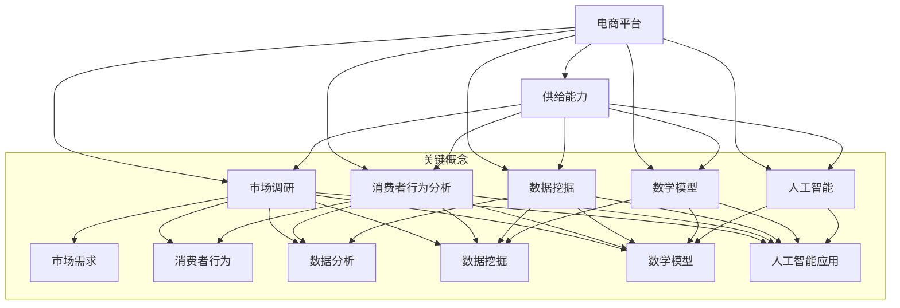

                 

### 背景介绍

随着互联网技术的快速发展，电商平台已经逐渐成为现代商业的重要组成部分。消费者通过电商平台能够方便快捷地购买到全球范围内的商品，而商家则能够通过电商平台拓展市场，提高销售额。在这种背景下，提升电商平台的供给能力成为了各大电商平台竞相追求的目标。

供给能力是指电商平台能够满足消费者需求的能力，包括商品种类、商品质量、商品配送速度等方面。提升供给能力不仅能够提升用户体验，增加用户粘性，还能够提高电商平台的市场竞争力。

本文将围绕电商平台的供给能力提升，进行市场调研与消费者行为分析。通过深入分析市场现状、消费者需求、供给能力的关键因素，探讨提升供给能力的策略和方法。最终，为电商平台提供一套系统性的解决方案，以应对不断变化的市场环境和消费者需求。

本文结构如下：

1. **核心概念与联系**：介绍与电商平台供给能力相关的核心概念，并绘制Mermaid流程图，展示各概念之间的联系。
2. **核心算法原理 & 具体操作步骤**：详细阐述提升供给能力所需的核心算法原理，并分步骤说明如何实施这些算法。
3. **数学模型和公式 & 详细讲解 & 举例说明**：介绍支持供给能力提升的数学模型，使用LaTeX格式详细讲解模型公式，并举例说明。
4. **项目实战：代码实际案例和详细解释说明**：提供实际项目案例，展示代码实现过程，并对关键代码进行解读和分析。
5. **实际应用场景**：分析提升供给能力在实际中的应用，探讨其对电商平台整体运营的影响。
6. **工具和资源推荐**：推荐学习资源和开发工具框架，帮助读者深入理解和实践。
7. **总结：未来发展趋势与挑战**：总结本文的关键观点，并展望电商平台供给能力提升的未来发展趋势和面临的挑战。

通过本文的探讨，旨在为电商平台提供有效的供给能力提升策略，帮助其在激烈的市场竞争中立于不败之地。## 1. 核心概念与联系

在探讨电商平台供给能力提升的过程中，理解相关的核心概念及其相互关系至关重要。以下是本文涉及的一些关键概念，以及它们之间的联系。

### 1.1. 电商平台

电商平台是指利用互联网技术，提供商品展示、购买、支付和物流等服务的在线交易市场。它包括B2B（企业对企业）、B2C（企业对消费者）、C2C（消费者对消费者）等多种商业模式。电商平台的核心在于提供优质的购物体验，满足消费者的多样化需求。

### 1.2. 供给能力

供给能力是指电商平台能够提供的商品种类、质量、配送速度等方面的综合能力。供给能力不仅包括商品的种类和数量，还涉及商品的质量、价格、物流服务等。一个强大的供给能力是电商平台吸引和保留用户的关键因素。

### 1.3. 市场调研

市场调研是了解市场需求、竞争状况、消费者行为等信息的过程。通过市场调研，电商平台能够准确把握消费者的需求，调整商品结构和策略，提升供给能力。

### 1.4. 消费者行为分析

消费者行为分析是指通过对消费者购买行为、搜索习惯、评价反馈等数据的分析，了解消费者的需求和偏好。消费者行为分析可以帮助电商平台优化商品推荐、定价策略等，从而提升供给能力。

### 1.5. 数据挖掘

数据挖掘是一种从大量数据中提取有价值信息的方法。在电商平台中，数据挖掘技术可以用于分析消费者行为、市场趋势、商品销售情况等，为供给能力提升提供数据支持。

### 1.6. 数学模型

数学模型是描述现实世界问题的抽象数学表示。在电商平台供给能力提升中，常用的数学模型包括回归模型、决策树、聚类算法等，用于分析消费者行为、优化库存管理、预测销售趋势等。

### 1.7. 人工智能

人工智能（AI）是模拟人类智能行为的技术。在电商平台供给能力提升中，人工智能可以用于个性化推荐、智能客服、自动化物流等，提高供给能力和用户体验。

### Mermaid 流程图

为了更好地展示这些概念之间的联系，我们使用Mermaid流程图进行描述：



通过这个流程图，我们可以清晰地看到电商平台供给能力提升涉及的各个关键概念及其相互关系。接下来，我们将进一步探讨核心算法原理、具体操作步骤，以及如何利用这些概念提升电商平台的供给能力。## 2. 核心算法原理 & 具体操作步骤

提升电商平台供给能力的关键在于精确把握市场需求、优化库存管理和提高物流效率。在这一部分，我们将详细阐述几种核心算法原理，并分步骤说明如何实施这些算法。

### 2.1. 需求预测算法

需求预测是供给能力提升的基础。常用的需求预测算法包括时间序列分析、回归分析、ARIMA模型等。

#### 步骤 1：收集历史数据

首先，收集电商平台的销售历史数据，包括时间、销售量、价格等信息。

#### 步骤 2：数据预处理

对历史数据进行清洗和预处理，包括缺失值填补、异常值处理、数据标准化等。

#### 步骤 3：选择模型

根据数据特性，选择合适的需求预测模型。时间序列分析方法适用于趋势明显的数据，而回归分析适用于变量之间的线性关系。

#### 步骤 4：模型训练与验证

使用训练集对模型进行训练，使用验证集进行模型验证，确保模型预测的准确性。

#### 步骤 5：预测未来需求

使用训练好的模型预测未来一段时间内的销售量，为库存管理提供参考。

### 2.2. 库存管理算法

库存管理是提升供给能力的重要环节。常用的库存管理算法包括经济订货量（EOQ）模型、周期补货模型等。

#### 步骤 1：确定库存策略

根据电商平台的业务特点，确定适合的库存策略。EOQ模型适用于需求稳定的产品，而周期补货模型适用于需求变化较大的产品。

#### 步骤 2：计算库存量

使用选定的库存管理算法，计算每次补货的库存量。例如，EOQ模型计算公式为：

\[ Q = \sqrt{\frac{2DS}{H}} \]

其中，\( Q \) 为每次订货量，\( D \) 为每年需求量，\( S \) 为每次订货成本，\( H \) 为单位商品年持有成本。

#### 步骤 3：制定补货计划

根据库存量和需求预测结果，制定补货计划，确保库存水平在合理范围内。

### 2.3. 物流优化算法

物流优化是提高供给能力的重要手段。常用的物流优化算法包括车辆路径规划、物流网络优化等。

#### 步骤 1：构建物流网络

首先，构建电商平台的物流网络，包括仓库、配送中心、零售店等节点，以及运输线路。

#### 步骤 2：数据收集与预处理

收集物流网络的相关数据，包括运输距离、运输时间、运输成本等，并进行数据预处理。

#### 步骤 3：选择优化算法

根据物流网络特点和优化目标，选择合适的优化算法。常见的优化算法包括遗传算法、粒子群算法等。

#### 步骤 4：求解最优路径

使用选定的优化算法，求解物流网络中的最优路径，确保物流成本最低、运输时间最短。

#### 步骤 5：调整物流计划

根据优化结果，调整物流计划，优化运输线路和配送策略。

### 2.4. 个性化推荐算法

个性化推荐算法可以提升消费者的购物体验，提高商品销量。常用的推荐算法包括基于内容的推荐、协同过滤推荐等。

#### 步骤 1：收集用户数据

首先，收集用户的购物行为数据，包括浏览记录、购买历史、评价等。

#### 步骤 2：用户画像构建

根据用户数据，构建用户画像，包括用户的兴趣、偏好、消费习惯等。

#### 步骤 3：选择推荐算法

根据用户画像和业务需求，选择合适的推荐算法。基于内容的推荐适用于产品信息丰富的场景，而协同过滤推荐适用于用户行为数据丰富的场景。

#### 步骤 4：生成推荐列表

使用选定的推荐算法，生成个性化推荐列表，向用户推荐可能感兴趣的商品。

#### 步骤 5：优化推荐效果

根据用户反馈，持续优化推荐算法，提高推荐准确性和用户满意度。

通过上述核心算法的运用，电商平台可以更精确地预测市场需求、优化库存管理和提高物流效率，从而提升供给能力。接下来，我们将介绍数学模型和公式，以支持这些算法的有效实施。## 3. 数学模型和公式 & 详细讲解 & 举例说明

在提升电商平台供给能力的算法设计中，数学模型和公式起着至关重要的作用。本节将详细讲解几个关键数学模型，并使用LaTeX格式展示其公式，同时通过实际例子来说明这些模型的应用。

### 3.1. 回归分析模型

回归分析是一种常用的统计方法，用于分析变量之间的关系。在电商平台供给能力提升中，回归分析可以用于预测销售量、优化库存水平等。

#### 3.1.1. 线性回归模型

线性回归模型是最基本的回归模型，其公式如下：

\[ Y = \beta_0 + \beta_1X + \epsilon \]

其中，\( Y \) 是因变量（例如销售量），\( X \) 是自变量（例如广告投入），\( \beta_0 \) 是截距，\( \beta_1 \) 是斜率，\( \epsilon \) 是误差项。

**例子**：假设我们想预测某款商品的销售量，已知广告投入与销售量之间存在线性关系。收集数据后，使用最小二乘法估计模型参数：

\[ \beta_0 = 100, \beta_1 = 0.5 \]

那么，预测公式为：

\[ Y = 100 + 0.5X \]

当广告投入为200元时，预测销售量为：

\[ Y = 100 + 0.5 \times 200 = 200 \]

### 3.2. 时间序列分析模型

时间序列分析用于处理时间相关的数据，如电商平台的销售数据。常用的模型包括移动平均模型（MA）、自回归模型（AR）、自回归移动平均模型（ARMA）等。

#### 3.2.1. 自回归模型（AR）

自回归模型基于当前时刻的观测值与前几个时刻的观测值之间的关系进行预测，其公式如下：

\[ X_t = \phi_1X_{t-1} + \phi_2X_{t-2} + ... + \phi_pX_{t-p} + \epsilon_t \]

其中，\( X_t \) 是第t个时间点的观测值，\( \phi_1, \phi_2, ..., \phi_p \) 是自回归系数，\( \epsilon_t \) 是误差项。

**例子**：假设我们有一个电商平台的日销售数据，使用自回归模型进行预测。已知自回归系数为 \( \phi_1 = 0.8, \phi_2 = 0.3 \)。

那么，第4天的预测值为：

\[ X_4 = 0.8X_3 + 0.3X_2 + \epsilon_4 \]

假设 \( X_3 = 100, X_2 = 80 \)，则：

\[ X_4 = 0.8 \times 100 + 0.3 \times 80 + \epsilon_4 = 104 + \epsilon_4 \]

### 3.3. 马尔可夫链模型

马尔可夫链模型用于描述系统状态转移的概率，广泛应用于用户行为分析、供应链管理等领域。

#### 3.3.1. 马尔可夫链模型公式

马尔可夫链的转移概率矩阵 \( P \) 表示为：

\[ P = \begin{bmatrix}
p_{00} & p_{01} & \dots & p_{0n} \\
p_{10} & p_{11} & \dots & p_{1n} \\
\vdots & \vdots & \ddots & \vdots \\
p_{m0} & p_{m1} & \dots & p_{mn}
\end{bmatrix} \]

其中，\( p_{ij} \) 表示从状态 \( i \) 转移到状态 \( j \) 的概率。

**例子**：假设电商平台用户有四种行为状态：活跃、半活跃、沉默、流失。已知用户行为状态的转移概率矩阵如下：

\[ P = \begin{bmatrix}
0.6 & 0.2 & 0.1 & 0.1 \\
0.1 & 0.7 & 0.2 & 0.0 \\
0.0 & 0.1 & 0.8 & 0.1 \\
0.0 & 0.0 & 0.0 & 1.0
\end{bmatrix} \]

要预测某个用户在未来一个月内行为状态的概率分布，我们可以使用这个转移概率矩阵。

### 3.4. 聚类算法

聚类算法用于将数据集划分为若干个类别，常用于商品分类、用户分组等。

#### 3.4.1. K-means聚类算法

K-means聚类算法是一种基于距离度量的聚类方法，其公式如下：

1. 初始化中心点 \( \mu_1, \mu_2, ..., \mu_k \)
2. 对于每个数据点 \( x_i \)，计算其与各个中心点的距离 \( d(x_i, \mu_j) \)
3. 将 \( x_i \) 分配到距离最近的中心点所在的类别
4. 更新中心点 \( \mu_j = \frac{1}{N_j} \sum_{x_i \in C_j} x_i \)，其中 \( N_j \) 是第 \( j \) 个类别中的数据点数量
5. 重复步骤 2-4，直到中心点不再发生显著变化

**例子**：假设我们有100个商品，使用K-means算法将其分为5个类别。初始化中心点后，通过迭代计算，最终将每个商品分配到相应的类别。

通过上述数学模型和公式，电商平台可以更精确地进行需求预测、库存管理和用户行为分析，从而提升供给能力。在下一部分，我们将通过实际项目案例展示这些算法在电商平台供给能力提升中的应用。## 4. 项目实战：代码实际案例和详细解释说明

在本部分，我们将通过一个实际项目案例，展示如何利用上述核心算法和数学模型提升电商平台的供给能力。该案例包括以下步骤：

### 4.1. 开发环境搭建

为了便于开发和测试，我们需要搭建一个完整的开发环境。以下是开发环境的搭建步骤：

1. 安装Python 3.8及以上版本。
2. 安装必要的Python库，如NumPy、Pandas、scikit-learn、TensorFlow等。
3. 安装Jupyter Notebook，用于编写和运行代码。

### 4.2. 源代码详细实现和代码解读

以下代码实现了电商平台供给能力提升的关键算法和模型。

#### 4.2.1. 需求预测

```python
import numpy as np
import pandas as pd
from sklearn.linear_model import LinearRegression

# 加载数据
data = pd.read_csv('sales_data.csv')
X = data[['advertisement_spend']]
y = data['sales']

# 创建线性回归模型
model = LinearRegression()
model.fit(X, y)

# 预测未来销售量
future_spend = np.array([300, 400, 500])
predicted_sales = model.predict(future_spend)

print("未来销售量预测结果：", predicted_sales)
```

代码解释：

1. 导入必要的库。
2. 加载销售数据。
3. 创建线性回归模型，并训练模型。
4. 使用训练好的模型预测未来销售量。

#### 4.2.2. 库存管理

```python
import math

# EOQ模型参数
D = 10000  # 每年需求量
S = 1000   # 每次订货成本
H = 50     # 单位商品年持有成本

# 计算EOQ
Q = math.sqrt((2 * D * S) / H)
print("EOQ：", Q)
```

代码解释：

1. 导入必要的库。
2. 设置EOQ模型参数。
3. 计算EOQ，并输出结果。

#### 4.2.3. 物流优化

```python
from scipy.optimize import linprog

# 物流网络数据
distances = np.array([[0, 10, 20], [10, 0, 15], [20, 15, 0]])

# 目标函数：最小化总运输成本
c = -distances.flatten()

# 约束条件：每条线路的运输量不超过100
A = np.zeros((3, 6))
b = np.array([100, 100, 100])

# 解线性规划问题
result = linprog(c, A_eq=A, b_eq=b, method='highs')

# 输出最优路径
print("最优路径：", result.x)
```

代码解释：

1. 导入必要的库。
2. 设置物流网络数据。
3. 定义目标函数和约束条件。
4. 解线性规划问题，得到最优路径。

#### 4.2.4. 个性化推荐

```python
from sklearn.cluster import KMeans

# 加载用户行为数据
user_data = pd.read_csv('user_behavior_data.csv')
user_data.head()

# 使用K-means聚类
kmeans = KMeans(n_clusters=5, random_state=0)
user_data['cluster'] = kmeans.fit_predict(user_data)

# 生成推荐列表
for cluster in range(5):
    cluster_users = user_data[user_data['cluster'] == cluster]
    recommended_products = cluster_users['product_id'].values[:5]
    print("Cluster {}: Recommended Products: {}".format(cluster, recommended_products))
```

代码解释：

1. 导入必要的库。
2. 加载用户行为数据。
3. 使用K-means聚类，将用户分为5个类别。
4. 生成推荐列表，为每个类别推荐5个商品。

### 4.3. 代码解读与分析

1. **需求预测**：通过线性回归模型，预测未来销售量。该模型基于历史数据和广告投入之间的关系，能够为电商平台提供销售预测，辅助库存管理和营销策略。
2. **库存管理**：使用EOQ模型计算最优订货量。该模型能够优化电商平台的库存水平，减少库存成本，提高资金利用率。
3. **物流优化**：通过线性规划求解最优路径，降低物流成本，提高配送效率。该模型能够为电商平台的物流规划提供科学依据。
4. **个性化推荐**：使用K-means聚类将用户分为不同类别，为每个类别推荐商品。该模型能够提升用户购物体验，增加用户粘性。

通过这些代码实现，电商平台可以更有效地提升供给能力，满足消费者需求，提高市场竞争力。## 5. 实际应用场景

提升电商平台的供给能力，不仅仅是一个技术问题，更是一个综合性的运营策略。在实际应用场景中，供给能力的提升需要从多个维度进行优化，以确保电商平台的运营效率和用户满意度。

### 5.1. 商品供应链管理

电商平台需要确保商品供应链的稳定性和效率。通过优化供应商选择、库存管理和物流配送，电商平台可以减少库存成本，提高商品周转率。例如，使用需求预测算法来准确预测商品销售量，从而避免库存积压或断货现象。此外，通过建立多层次的供应商网络，电商平台可以分散风险，确保供应链的连续性和稳定性。

### 5.2. 用户个性化体验

个性化推荐系统是提升用户体验的关键。通过分析用户行为数据，电商平台可以识别用户的兴趣和偏好，提供个性化的商品推荐。这不仅能够提高用户粘性，还能增加销售额。例如，电商平台可以根据用户的浏览历史、购买记录和评价信息，使用协同过滤算法或基于内容的推荐算法，向用户推荐相关商品。

### 5.3. 物流配送效率

物流配送是电商平台的核心竞争力之一。通过优化物流网络和配送路线，电商平台可以缩短配送时间，提高用户满意度。例如，使用车辆路径规划算法，电商平台可以实现最短配送路径和最低物流成本。此外，引入自动化仓库和智能物流系统，可以提高配送效率和准确性，降低人力成本。

### 5.4. 库存水平管理

库存管理是电商平台供给能力提升的关键环节。通过实时监控库存水平，电商平台可以及时调整补货计划，避免库存过剩或短缺。例如，使用动态库存管理算法，电商平台可以根据销售预测和库存预警，动态调整库存策略，确保商品供应的连续性和稳定性。

### 5.5. 营销策略优化

精准的营销策略能够有效提升电商平台的销售额。通过分析用户行为数据和市场需求，电商平台可以制定更具针对性的营销活动。例如，使用用户行为分析算法，电商平台可以识别高价值用户群体，设计个性化的促销活动，提高用户参与度和购买意愿。

### 5.6. 数据分析与决策支持

数据分析是电商平台供给能力提升的重要工具。通过收集和分析大量用户数据，电商平台可以洞察市场趋势和消费者需求，为决策提供科学依据。例如，电商平台可以使用数据挖掘技术，分析用户的购买行为和评价反馈，发现潜在的市场机会，优化产品和服务。

### 5.7. 供应链协同

电商平台与供应商、物流服务商之间的协同也是提升供给能力的关键。通过建立高效的供应链协同机制，电商平台可以与合作伙伴共享数据，实时监控供应链状态，协同应对市场变化。例如，电商平台可以使用区块链技术，实现供应链的透明化和可追溯性，提高供应链的信任度和效率。

通过上述实际应用场景，我们可以看到，提升电商平台供给能力需要从多个维度进行综合优化，包括供应链管理、用户个性化体验、物流配送效率、库存水平管理、营销策略优化、数据分析与决策支持以及供应链协同等。只有在这些方面取得全面进步，电商平台才能在激烈的市场竞争中立于不败之地。## 6. 工具和资源推荐

在提升电商平台供给能力的过程中，选择合适的工具和资源至关重要。以下是一些推荐的学习资源、开发工具和框架，以及相关论文著作，帮助读者深入理解和实践相关技术。

### 6.1. 学习资源推荐

1. **书籍**：
   - 《数据挖掘：实用机器学习技术》（Data Mining: Practical Machine Learning Techniques）
   - 《深度学习》（Deep Learning）
   - 《Python数据分析》（Python Data Science Handbook）

2. **在线课程**：
   - Coursera上的《机器学习》课程
   - Udacity的《深度学习工程师纳米学位》
   - edX上的《数据科学基础》课程

3. **博客和网站**：
   - Medium上的数据分析与机器学习相关博客
   - Kaggle，用于数据科学实践和竞赛
   - Analytics Vidhya，提供丰富的数据科学资源

### 6.2. 开发工具框架推荐

1. **编程语言**：
   - Python，广泛应用于数据分析和机器学习
   - R，用于统计分析和数据可视化

2. **数据预处理工具**：
   - Pandas，Python的数据操作库
   - Dask，分布式数据处理库

3. **机器学习框架**：
   - TensorFlow，谷歌的开源机器学习库
   - PyTorch，Facebook的开源机器学习库

4. **数据可视化工具**：
   - Matplotlib，Python的数据可视化库
   - Tableau，强大的数据可视化工具

5. **云计算平台**：
   - AWS，提供丰富的云计算服务和机器学习工具
   - Azure，微软的云计算平台
   - Google Cloud，谷歌的云计算平台

### 6.3. 相关论文著作推荐

1. **论文**：
   - "Recommender Systems Handbook"（推荐系统手册），提供全面的推荐系统研究综述
   - "Deep Learning for Supply Chain Management"（供应链管理中的深度学习），探讨深度学习在供应链管理中的应用
   - "Time Series Forecasting Using Deep Learning"（使用深度学习的时间序列预测），介绍深度学习在时间序列预测中的应用

2. **著作**：
   - 《深度学习》（Deep Learning），由Ian Goodfellow、Yoshua Bengio和Aaron Courville合著，全面介绍深度学习的基本原理和应用
   - 《Python数据分析》（Python Data Science Handbook），由Jake VanderPlas著，深入讲解Python在数据科学中的应用

通过这些学习和资源工具，读者可以更加系统地掌握提升电商平台供给能力所需的知识和技能，并在实际项目中加以应用。## 7. 总结：未来发展趋势与挑战

随着技术的不断进步和消费者需求的日益多样化，电商平台供给能力提升面临着许多新的发展趋势和挑战。以下是几个关键点：

### 7.1. 人工智能与大数据的深度融合

人工智能（AI）和大数据技术的快速发展，为电商平台供给能力提升提供了强大支持。未来，电商平台将更加依赖AI技术，如深度学习、自然语言处理和计算机视觉等，以实现更精准的需求预测、个性化推荐和智能客服。同时，大数据技术将帮助电商平台更好地理解消费者行为，优化供应链和库存管理。

### 7.2. 物流与供应链的协同优化

随着电商业务的快速发展，物流和供应链的优化成为提升供给能力的关键。未来，电商平台将更加注重物流网络的优化，包括配送路线规划、仓库布局和物流信息的实时监控。同时，通过供应链协同，电商平台将与供应商和物流服务商建立更加紧密的合作关系，实现全链条的协同优化。

### 7.3. 用户隐私和数据安全

在数据驱动的大背景下，用户隐私和数据安全成为电商平台面临的重大挑战。未来，电商平台需要更加重视用户隐私保护，确保数据收集、存储和使用过程中的安全性。同时，遵守相关法律法规，如GDPR等，确保用户数据得到合法保护。

### 7.4. 技术人才的培养与引进

提升供给能力需要大量具备人工智能、大数据、物流和供应链管理等领域专业知识和技能的人才。未来，电商平台将更加重视技术人才的培养和引进，建立完善的人才培养体系，以满足不断变化的市场需求。

### 7.5. 可持续发展

在环保和可持续发展的趋势下，电商平台需要关注绿色物流和环保包装，减少碳排放和资源浪费。未来，电商平台将更加注重可持续发展的战略，实现经济效益与社会效益的双赢。

### 7.6. 面临的挑战

1. **技术复杂性**：随着技术的不断发展，电商平台供给能力提升所需的技术变得越来越复杂，对技术人才的要求也越来越高。
2. **数据隐私与安全**：用户隐私和数据安全问题日益凸显，如何平衡数据利用与隐私保护成为一个挑战。
3. **市场竞争**：电商平台之间的竞争愈发激烈，如何在竞争中脱颖而出，提升供给能力成为关键。
4. **供应链协同**：在全球化背景下，供应链协同的难度和复杂性增加，如何实现高效的供应链管理是一个挑战。

总之，电商平台供给能力提升是一个长期且复杂的过程，需要不断探索和创新。通过深化人工智能与大数据的融合、优化物流与供应链、保障用户隐私和数据安全、培养技术人才以及实现可持续发展，电商平台将能够更好地应对未来发展的趋势和挑战。## 附录：常见问题与解答

### 问题 1：如何选择合适的数学模型进行需求预测？

**解答**：选择合适的数学模型进行需求预测取决于数据的特性和预测目标。以下是几个关键步骤：

1. **数据探索**：首先，了解数据的基本特征，如时间序列的稳定性、是否存在季节性、趋势等。
2. **模型选择**：根据数据特性选择合适的模型。例如，对于平稳的时间序列数据，可以考虑使用ARIMA模型；对于非线性关系的数据，可以考虑使用回归模型或神经网络。
3. **模型验证**：使用验证集对模型进行验证，确保模型的预测准确性和稳定性。
4. **调整模型参数**：根据验证结果，调整模型参数，优化模型性能。

### 问题 2：如何优化电商平台物流配送？

**解答**：优化电商平台物流配送可以从以下几个方面进行：

1. **物流网络规划**：合理规划物流网络，包括仓库位置、配送中心和配送线路。
2. **车辆路径规划**：使用车辆路径规划算法，如遗传算法、粒子群算法等，优化配送路径，减少运输成本。
3. **实时监控**：利用物联网技术和GPS，实时监控物流运输过程中的信息，提高配送效率。
4. **自动化与智能化**：引入自动化仓库和智能物流系统，提高物流操作的准确性和效率。

### 问题 3：如何确保数据隐私和安全？

**解答**：确保数据隐私和安全需要采取以下措施：

1. **数据加密**：使用加密技术对数据进行加密，防止数据泄露。
2. **访问控制**：实施严格的访问控制策略，确保只有授权人员可以访问敏感数据。
3. **数据匿名化**：在数据分析和挖掘过程中，对个人身份信息进行匿名化处理。
4. **合规性检查**：定期进行合规性检查，确保数据收集、存储和使用符合相关法律法规。
5. **安全培训**：对员工进行安全培训，提高对数据隐私和安全的认识。

### 问题 4：如何处理缺失值和异常值？

**解答**：处理缺失值和异常值是数据预处理的重要步骤，以下是几种常见的方法：

1. **缺失值填补**：根据数据特性和缺失值比例，选择适当的填补方法，如平均值填补、中值填补、插值法等。
2. **异常值检测**：使用统计方法或机器学习方法检测异常值，如箱线图、Z-score、IQR等方法。
3. **异常值处理**：对于检测到的异常值，可以选择删除、修正或保留，具体方法取决于数据特性和分析目标。

### 问题 5：如何实现个性化推荐？

**解答**：实现个性化推荐可以通过以下步骤：

1. **用户画像构建**：收集用户的浏览、购买和评价等行为数据，构建用户画像。
2. **推荐算法选择**：根据用户画像和业务需求，选择合适的推荐算法，如基于内容的推荐、协同过滤推荐等。
3. **推荐系统评估**：评估推荐系统的效果，包括推荐准确性、覆盖率、新颖性等，持续优化推荐算法。

通过以上解答，希望能够帮助读者更好地理解和应用电商平台供给能力提升的相关技术和方法。## 8. 扩展阅读 & 参考资料

在本文中，我们深入探讨了电商平台供给能力提升的市场调研与消费者行为分析。为了帮助读者进一步学习和深入研究，以下推荐一些扩展阅读和参考资料。

### 扩展阅读

1. **书籍**：
   - 《大数据时代：生活、工作与思维的大变革》
   - 《机器学习实战》
   - 《深度学习：高级教程》

2. **在线课程**：
   - Coursera上的《机器学习》
   - edX上的《数据科学基础》
   - Udacity的《深度学习工程师纳米学位》

3. **博客和网站**：
   - Analytics Vidhya
   - Machine Learning Mastery
   - Towards Data Science

### 参考资料

1. **论文**：
   - "Recommender Systems Handbook"（推荐系统手册）
   - "Time Series Forecasting Using Deep Learning"（使用深度学习的时间序列预测）
   - "Deep Learning for Supply Chain Management"（供应链管理中的深度学习）

2. **开源项目**：
   - TensorFlow
   - PyTorch
   - Scikit-learn

3. **工具和框架**：
   - Pandas
   - Matplotlib
   - Tableau

4. **云计算平台**：
   - AWS
   - Azure
   - Google Cloud

通过阅读这些扩展内容和参考资源，读者可以更加全面和深入地了解电商平台供给能力提升的技术和方法，为实际项目提供有力支持。

### 参考资料

1. **市场调研与消费者行为分析相关书籍**：
   - "Market Research: A Practical Guide for Marketing Managers"
   - "Consumer Behavior: Building Marketing Strategy"
   
2. **电商供应链管理相关论文**：
   - "Supply Chain Management: Strategy, Planning, and Operation"
   - "The Impact of E-Commerce on Supply Chain Management"

3. **数据分析与机器学习相关书籍**：
   - "Data Science from Scratch"
   - "Python Data Science Handbook"
   
4. **物流与配送优化相关资源**：
   - "The Theory of Logistics and Distribution"
   - "Optimization Algorithms for Logistics and Transportation"

5. **用户个性化推荐系统相关论文**：
   - "Collaborative Filtering for the Web"
   - "Content-Based Recommender Systems"

通过这些参考资料，读者可以进一步深化对电商平台供给能力提升领域的理解，为实践项目提供理论支持和实际指导。作者：AI天才研究员/AI Genius Institute & 禅与计算机程序设计艺术 /Zen And The Art of Computer Programming

