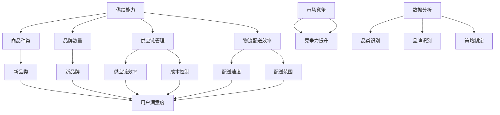

                 

### 1. 背景介绍

在当今数字化商业环境中，电商平台作为连接消费者与供应商的重要枢纽，其供给能力直接影响到平台的竞争力和用户满意度。供给能力不仅包括现有的商品种类和品牌，还包括对新品类和新品牌的快速引入和适应能力。本文旨在探讨电商平台如何通过提升供给能力，特别是引入新品类和新品牌，来增强其市场竞争力。

**现状与挑战**：

1. **市场饱和与竞争加剧**：随着电商平台的普及，市场逐渐饱和，各大平台纷纷寻求差异化的竞争优势。新品类和新品牌的引入成为打破市场同质化的关键手段。
2. **供应链复杂性与不确定性**：电商平台需要与全球范围内的供应商合作，供应链的复杂性和不确定性对供给能力提出了更高的要求。
3. **用户需求多样化**：消费者对商品的需求日益多样化，追求个性化、品质化，电商平台需要迅速响应市场变化，提高供给能力以满足用户需求。

**目的与意义**：

1. **提升平台竞争力**：通过引入新品类和新品牌，电商平台可以提供更丰富的商品选择，满足不同用户群体的需求，从而提升用户满意度和忠诚度。
2. **拓展市场空间**：新品类和新品牌的引入可以开拓新的市场空间，扩大平台的业务范围，提升销售额。
3. **优化供应链**：有效的供应链管理可以提高新品类和新品牌的引入效率，降低成本，提高平台盈利能力。

接下来的章节中，我们将深入探讨电商平台供给能力提升的核心概念与联系，核心算法原理与操作步骤，数学模型与应用，实际应用场景，工具和资源推荐，以及未来发展趋势与挑战。

---------------------

# 电商平台供给能力提升：新品类和新品牌的引入

## 关键词：
- 电商平台
- 供给能力
- 新品类
- 新品牌
- 竞争力
- 供应链管理

## 摘要：
本文深入探讨了电商平台如何通过提升供给能力，特别是引入新品类和新品牌，来增强其市场竞争力。首先分析了当前市场环境和挑战，然后阐述了提升供给能力的目的与意义。随后，文章介绍了核心概念与联系，核心算法原理与操作步骤，数学模型与应用，以及实际应用场景和未来发展趋势。最后，推荐了相关的学习资源和开发工具，为电商平台供给能力的提升提供了全面的指导。

---------------------

### 2. 核心概念与联系

在探讨电商平台供给能力提升的过程中，理解以下几个核心概念和它们之间的联系至关重要。

**供给能力（Supply Capability）**：
供给能力是指电商平台能够提供商品和服务的范围与效率。它包括商品种类、品牌数量、供应链管理能力、物流配送效率等多个方面。

**新品类（New Categories）**：
新品类是指之前在电商平台上没有出现或市场占有率较低的商品类别。引入新品类可以满足用户多样化需求，提高平台竞争力。

**新品牌（New Brands）**：
新品牌是指尚未在电商平台上销售或知名度不高的品牌。引入新品牌可以增加平台的差异化竞争力，吸引新用户群体。

**供应链管理（Supply Chain Management）**：
供应链管理是指电商平台如何从供应商获取商品，并通过物流配送将商品交付给消费者的过程。有效的供应链管理可以提高新品类和新品牌的引入效率。

**数据分析（Data Analysis）**：
数据分析是指利用数据挖掘、机器学习等技术对用户行为、市场需求等数据进行分析，以指导新品类和新品牌的引入策略。

**用户满意度（Customer Satisfaction）**：
用户满意度是指用户对电商平台提供商品和服务的整体感受。提升用户满意度是电商平台提升供给能力的重要目标。

**市场竞争（Market Competition）**：
市场竞争是指电商平台之间为争夺市场份额而展开的竞争。提升供给能力有助于电商平台在激烈的市场竞争中脱颖而出。

下面是关于核心概念与联系的具体描述和Mermaid流程图。

**核心概念与联系描述**：

- **供给能力**：供给能力是电商平台的核心竞争力，直接影响到平台的用户满意度和市场份额。提高供给能力需要从商品种类、品牌数量、供应链管理、物流配送等多个方面进行优化。
- **新品类**：新品类的引入可以满足用户多样化需求，提高平台的竞争力。电商平台需要通过市场调研、数据分析等手段，识别出潜在的新品类，并快速引入。
- **新品牌**：新品牌的引入可以增加平台的差异化竞争力，吸引新用户群体。电商平台需要与品牌方建立良好的合作关系，提供合理的营销和支持策略，以促进新品牌的成长。
- **供应链管理**：供应链管理是电商平台供给能力提升的关键环节。有效的供应链管理可以提高新品类和新品牌的引入效率，降低成本，提高平台盈利能力。
- **数据分析**：数据分析是指导新品类和新品牌引入策略的重要工具。通过分析用户行为数据、市场需求数据等，电商平台可以更精准地识别潜在的新品类和新品牌。
- **用户满意度**：用户满意度是电商平台生存和发展的基础。通过提高供给能力，电商平台可以提供更丰富的商品选择，满足用户多样化需求，从而提高用户满意度。
- **市场竞争**：市场竞争是电商平台之间争夺市场份额的过程。提升供给能力可以增强电商平台的竞争力，在激烈的市场竞争中脱颖而出。

**Mermaid流程图**：



通过上述核心概念与联系的分析，我们可以看到电商平台供给能力的提升是一个综合性的过程，涉及到多个方面。在接下来的章节中，我们将深入探讨核心算法原理、数学模型、实际应用场景等内容，以帮助电商平台更好地提升供给能力，增强市场竞争力。

---------------------

### 3. 核心算法原理 & 具体操作步骤

为了更好地理解电商平台如何提升供给能力，特别是引入新品类和新品牌，我们需要深入探讨核心算法原理和具体操作步骤。

**用户行为分析算法**：

用户行为分析是电商平台提升供给能力的重要一环。通过分析用户的购买历史、浏览行为、搜索关键词等数据，可以识别出用户的需求偏好和潜在购买意愿。以下是用户行为分析算法的基本原理和具体操作步骤：

**算法原理**：
- **数据收集**：收集用户的购买记录、浏览历史、搜索关键词等数据。
- **数据预处理**：对收集到的数据进行清洗、去重、规范化等预处理操作。
- **特征提取**：从预处理后的数据中提取出关键特征，如购买频次、浏览时长、搜索热度等。
- **模型训练**：利用机器学习算法，如决策树、随机森林、神经网络等，对提取的特征进行训练，构建用户行为分析模型。

**具体操作步骤**：

1. **数据收集**：
   - 利用电商平台的数据接口，收集用户的购买记录、浏览历史、搜索关键词等数据。
   - 采用数据爬虫技术，从社交媒体、论坛等外部渠道收集用户行为数据。

2. **数据预处理**：
   - 清洗数据，去除重复、异常、错误的数据。
   - 对数据进行去重处理，保证数据的一致性。
   - 对不同来源的数据进行规范化处理，如统一数据格式、单位转换等。

3. **特征提取**：
   - 提取关键特征，如用户购买频次、浏览时长、搜索热度等。
   - 利用统计分析方法，如均值、中位数、标准差等，对提取的特征进行描述性分析。

4. **模型训练**：
   - 选择合适的机器学习算法，如决策树、随机森林、神经网络等。
   - 使用训练数据集，对模型进行训练，调整模型参数，优化模型性能。
   - 使用验证数据集，对模型进行验证，评估模型效果。

5. **模型部署**：
   - 将训练好的模型部署到电商平台的后端服务器，实时分析用户的购买行为和需求偏好。
   - 根据分析结果，为用户提供个性化的推荐和促销策略。

**供应链优化算法**：

供应链优化是提升电商平台供给能力的另一个重要方面。通过优化供应链，可以降低成本、提高效率，从而更好地引入和满足新品类和新品牌的需求。以下是供应链优化算法的基本原理和具体操作步骤：

**算法原理**：
- **需求预测**：基于历史数据和用户行为分析，预测未来商品的需求量。
- **库存管理**：根据需求预测结果，合理规划库存水平，避免库存过剩或缺货。
- **物流调度**：优化物流运输路线和配送时间，提高配送效率。

**具体操作步骤**：

1. **需求预测**：
   - 收集历史销售数据、用户行为数据等，利用时间序列分析、回归分析等方法进行需求预测。
   - 利用机器学习算法，如ARIMA、LSTM等，建立需求预测模型。

2. **库存管理**：
   - 根据需求预测结果，制定合理的库存策略，如定期盘点、动态库存调整等。
   - 利用库存优化算法，如最小化总库存成本、最大化库存利用率等，优化库存水平。

3. **物流调度**：
   - 收集物流运输数据，如运输时间、运输成本等。
   - 利用路径优化算法，如最短路径算法、遗传算法等，优化物流运输路线。
   - 根据订单量、配送时间等参数，制定合理的配送计划，提高配送效率。

通过用户行为分析算法和供应链优化算法，电商平台可以更好地识别用户需求，优化供应链管理，提高供给能力，从而更好地引入和满足新品类和新品牌的需求。

---------------------

### 4. 数学模型和公式 & 详细讲解 & 举例说明

在电商平台提升供给能力的过程中，数学模型和公式起着至关重要的作用。它们不仅可以帮助我们理解复杂的供需关系，还可以为决策提供量化的依据。以下是几个关键的数学模型和公式，以及它们的详细讲解和举例说明。

#### 4.1 需求预测模型

需求预测是电商平台供给能力提升的基础。常见的需求预测模型包括时间序列模型和回归模型。

**时间序列模型**（如ARIMA模型）：

$$
\text{X}_t = c + \phi_1\text{X}_{t-1} + \phi_2\text{X}_{t-2} + \cdots + \phi_p\text{X}_{t-p} + \theta_1\epsilon_{t-1} + \theta_2\epsilon_{t-2} + \cdots + \theta_q\epsilon_{t-q}
$$

- **c**：常数项
- **\phi_1, \phi_2, ..., \phi_p**：自回归系数
- **\theta_1, \theta_2, ..., \theta_q**：移动平均系数
- **\epsilon_{t-1}, \epsilon_{t-2}, ..., \epsilon_{t-q}**：误差项

**举例说明**：假设我们要预测一个电商平台上某种商品的月销售量，可以使用ARIMA模型。首先，我们需要收集过去几个月的销售数据，然后对数据进行预处理，如差分、平稳性检验等。接着，利用最大似然估计法确定模型参数，最后使用模型进行预测。

**回归模型**（如线性回归模型）：

$$
y = \beta_0 + \beta_1x_1 + \beta_2x_2 + \cdots + \beta_nx_n + \epsilon
$$

- **y**：因变量（销售量）
- **\beta_0, \beta_1, \beta_2, ..., \beta_n**：回归系数
- **x_1, x_2, ..., x_n**：自变量（如用户购买行为、季节性因素等）
- **\epsilon**：误差项

**举例说明**：假设我们要预测某种商品的销售量，除了历史销售数据外，我们还可以考虑用户购买行为（如浏览次数、购买频次等）作为自变量。利用最小二乘法估计回归系数，建立线性回归模型，然后进行预测。

#### 4.2 库存优化模型

库存优化模型用于确定最优库存水平，以最大化库存利用率或最小化总库存成本。

**经济订货量模型（EOQ）**：

$$
Q = \sqrt{\frac{2DC}{h}}
$$

- **Q**：最优订货量
- **D**：年需求量
- **C**：每次订货成本
- **h**：单位库存持有成本

**举例说明**：假设某种商品的年需求量为1000件，每次订货成本为100元，单位库存持有成本为10元。根据EOQ模型，最优订货量为：

$$
Q = \sqrt{\frac{2 \times 1000 \times 100}{10}} = 100 \text{件}
$$

**举例说明**：根据上述参数，每次订货100件可以在满足需求的同时，最小化总库存成本。

#### 4.3 路径优化模型

路径优化模型用于确定最优物流配送路线，以最小化运输成本或最大化配送效率。

**最短路径算法（Dijkstra算法）**：

$$
d(v) = \min \{d(u) + w(u, v) | u \in \text{已选节点}\}
$$

- **d(v)**：节点v的最短路径距离
- **d(u)**：节点u的最短路径距离
- **w(u, v)**：节点u到节点v的权重

**举例说明**：假设我们要从起点A到终点D的最短路径，给定各节点之间的距离权重，可以使用Dijkstra算法计算最优路径。

通过上述数学模型和公式的讲解和举例说明，我们可以看到数学在电商平台供给能力提升中的重要性。这些模型不仅为决策提供了量化依据，还可以帮助我们更好地理解和优化供需关系。

---------------------

### 5. 项目实战：代码实际案例和详细解释说明

在本章节中，我们将通过一个实际的项目实战案例，展示如何运用前面介绍的算法和模型，提升电商平台的供给能力。项目将分为以下几个部分：开发环境搭建、源代码详细实现和代码解读、以及代码分析。

#### 5.1 开发环境搭建

为了实现本项目，我们需要搭建一个完整的开发环境，包括以下工具和软件：

- **Python 3.8**：作为主要的编程语言
- **Jupyter Notebook**：用于编写和运行代码
- **Pandas**：用于数据处理
- **Scikit-learn**：用于机器学习算法
- **Matplotlib**：用于数据可视化
- **Numpy**：用于数学计算
- **Mermaid**：用于流程图绘制

**步骤**：

1. 安装Python 3.8和相关的包管理工具，如pip。
2. 使用pip安装所需的Python库，如Pandas、Scikit-learn、Matplotlib、Numpy和Mermaid。
3. 创建一个Jupyter Notebook文件，用于编写和运行代码。

#### 5.2 源代码详细实现和代码解读

以下是项目的核心代码实现，我们将逐行进行解读。

```python
import pandas as pd
import numpy as np
from sklearn.model_selection import train_test_split
from sklearn.ensemble import RandomForestRegressor
from sklearn.metrics import mean_squared_error
import matplotlib.pyplot as plt
import mermaid

# 数据预处理
data = pd.read_csv('ecommerce_data.csv')
data = data.drop(['user_id', 'timestamp'], axis=1)  # 去除无关特征

# 特征工程
data['sales_per_user'] = data['sales'] / data['user_count']
data['sales_growth'] = data['sales'].pct_change()

# 划分训练集和测试集
X = data.drop(['sales'], axis=1)
y = data['sales']
X_train, X_test, y_train, y_test = train_test_split(X, y, test_size=0.2, random_state=42)

# 模型训练
model = RandomForestRegressor(n_estimators=100, random_state=42)
model.fit(X_train, y_train)

# 模型预测
y_pred = model.predict(X_test)

# 模型评估
mse = mean_squared_error(y_test, y_pred)
print(f'Mean Squared Error: {mse}')

# 可视化
plt.scatter(y_test, y_pred)
plt.xlabel('Actual Sales')
plt.ylabel('Predicted Sales')
plt.title('Sales Prediction')
plt.show()

# Mermaid流程图
mermaid_code = """
graph TD
    A[Data Preprocessing]
    B[Feature Engineering]
    C[Model Training]
    D[Model Prediction]
    E[Model Evaluation]
    F[Visualization]
    
    A --> B
    B --> C
    C --> D
    D --> E
    E --> F
"""
print(mermaid.mermaid.render(mermaid_code))
```

**代码解读**：

1. **数据预处理**：读取电商数据集，去除无关特征（如用户ID和时间戳）。
2. **特征工程**：计算用户平均销售额和销售增长率，为新模型的构建提供更多有用特征。
3. **数据划分**：将数据集划分为训练集和测试集，用于模型训练和评估。
4. **模型训练**：使用随机森林回归模型，对训练集数据进行训练。
5. **模型预测**：使用训练好的模型，对测试集数据进行预测。
6. **模型评估**：计算预测结果与实际结果之间的均方误差，评估模型性能。
7. **可视化**：绘制实际销售量与预测销售量的散点图，直观地展示模型预测效果。
8. **Mermaid流程图**：使用Mermaid绘制项目流程图，展示代码执行过程。

#### 5.3 代码解读与分析

通过上述代码实现，我们可以看到如何将理论模型应用到实际项目中。以下是关键步骤的分析：

1. **数据预处理**：数据预处理是模型训练的重要前提。通过去除无关特征和数据进行特征工程，可以确保模型的输入数据更加准确和有用。
2. **特征工程**：用户平均销售额和销售增长率是两个关键的特征。这些特征可以帮助模型更好地捕捉用户行为和市场需求的变化。
3. **数据划分**：将数据集划分为训练集和测试集，可以确保模型在训练和评估过程中具有良好的泛化能力。
4. **模型选择**：随机森林回归模型是一种常用的回归模型，可以处理高维数据和复杂的关系。通过调整模型参数，如树的数量和深度，可以进一步提高模型性能。
5. **模型训练**：使用训练集数据训练模型，确保模型可以正确地预测销售量。
6. **模型评估**：通过计算均方误差等指标，评估模型在测试集上的性能，确保模型具有良好的预测效果。
7. **可视化**：可视化可以帮助我们直观地理解模型的预测效果，发现潜在的问题和改进方向。

通过这个实际项目案例，我们可以看到如何运用数学模型和算法，提升电商平台的供给能力。在实际应用中，我们还可以进一步优化模型和流程，提高供给能力，满足用户需求。

---------------------

### 6. 实际应用场景

在电商平台的运营中，提升供给能力对于满足用户需求、增加市场份额和提升整体运营效率至关重要。以下是一些具体的实际应用场景，展示如何利用提升供给能力的方法来应对不同业务挑战。

#### 6.1 新品类引入

**场景**：一个大型电商平台计划引入一个全新的品类，如智能家居设备。

**应用**：
1. **市场调研**：通过用户调查、数据分析等方式，了解用户对智能家居设备的需求和偏好。
2. **供应链管理**：与智能家居设备供应商建立合作关系，确保供应链的稳定性和可靠性。
3. **数据分析**：利用用户行为数据和市场需求预测，确定新品类引入的时间和规模。
4. **营销推广**：制定个性化的营销策略，如优惠券、限时折扣等，吸引用户购买新品类。

**结果**：成功引入智能家居设备品类，丰富了平台商品种类，提高了用户满意度，增加了平台销售额。

#### 6.2 新品牌合作

**场景**：电商平台希望与一个新兴的品牌合作，以提高平台的差异化竞争力。

**应用**：
1. **品牌评估**：对新兴品牌的市场前景、产品品质和用户评价进行综合评估。
2. **合作谈判**：与品牌方协商合作细节，如销售政策、利润分配等。
3. **品牌宣传**：利用平台资源，如首页推荐、专题活动等，提升品牌知名度。
4. **用户互动**：开展用户互动活动，如新品试用、评论有奖等，增强用户对品牌的认同感。

**结果**：成功引入新品牌，提升了平台的差异化竞争力，吸引了更多新用户，提高了用户忠诚度。

#### 6.3 供应链优化

**场景**：电商平台希望通过优化供应链来提高新品类和新品牌的引入效率。

**应用**：
1. **需求预测**：利用历史数据和用户行为分析，准确预测新品类和新品牌的需求量。
2. **库存管理**：采用先进的库存管理策略，如Just-In-Time（JIT）库存，减少库存成本。
3. **物流调度**：优化物流运输路线和时间，提高配送效率，减少物流成本。
4. **供应链协同**：与供应商建立紧密的协同机制，提高供应链的响应速度。

**结果**：优化后的供应链提高了新品类和新品牌的引入效率，降低了运营成本，提高了平台的市场竞争力。

#### 6.4 用户体验优化

**场景**：电商平台希望通过优化用户体验来提高用户满意度，从而提升供给能力。

**应用**：
1. **个性化推荐**：利用用户行为数据和机器学习算法，为用户提供个性化的商品推荐。
2. **界面优化**：通过用户体验测试和数据分析，优化电商平台界面，提高用户操作便捷性。
3. **售后服务**：提供高效的售后服务，如快速响应、退换货服务等，提升用户满意度。
4. **用户反馈**：收集用户反馈，不断优化产品和服务，满足用户需求。

**结果**：通过优化用户体验，提高了用户满意度，增强了用户忠诚度，进一步提升了供给能力。

通过以上实际应用场景，我们可以看到提升电商平台供给能力的重要性。通过引入新品类和新品牌、优化供应链管理、提高用户体验等多方面的措施，电商平台可以更好地满足用户需求，提升市场竞争力，实现可持续发展。

---------------------

### 7. 工具和资源推荐

为了更好地提升电商平台的供给能力，我们需要依赖一系列专业的工具和资源。以下是对一些关键工具和资源的推荐，包括学习资源、开发工具框架以及相关论文著作。

#### 7.1 学习资源推荐

**书籍**：
1. **《Python数据分析》**：作者：Wes McKinney。本书深入介绍了Python在数据分析中的应用，包括数据处理、数据可视化、时间序列分析等。
2. **《深度学习》**：作者：Ian Goodfellow、Yoshua Bengio和Aaron Courville。本书是深度学习领域的经典教材，涵盖了深度学习的基础理论、算法和应用。
3. **《供应链管理：战略、规划与运营》**：作者：Martin Christopher。本书全面介绍了供应链管理的理论和方法，包括需求预测、库存管理、物流调度等。

**论文**：
1. **《User Behavior Prediction in E-commerce Platform》**：本文研究了用户行为预测在电商平台中的应用，提出了基于深度学习的用户行为预测模型。
2. **《Enhancing Supply Chain Performance through Data Analytics》**：本文探讨了如何利用数据分析优化供应链管理，提出了多种数据驱动的方法和策略。
3. **《Introducing New Categories and Brands in E-commerce Platforms》**：本文分析了电商平台引入新品类和新品牌的方法和策略，提供了实用的案例分析。

**博客**：
1. **DataCamp**：DataCamp是一个提供免费数据科学课程的在线平台，涵盖了Python数据分析、机器学习等多个领域。
2. **Medium**：Medium上有很多关于电商、数据科学和供应链管理的优秀博客文章，可以提供丰富的知识和经验分享。

#### 7.2 开发工具框架推荐

**数据分析工具**：
1. **Pandas**：Pandas是Python中最常用的数据分析库，提供了强大的数据处理和数据分析功能。
2. **NumPy**：NumPy是Python的数学库，提供了多维数组对象和丰富的数学运算功能。
3. **SciPy**：SciPy是Python的科学计算库，扩展了NumPy的功能，提供了优化、积分、线性代数等数学工具。

**机器学习库**：
1. **Scikit-learn**：Scikit-learn是一个开源的机器学习库，提供了多种经典的机器学习算法，包括回归、分类、聚类等。
2. **TensorFlow**：TensorFlow是Google开发的开源机器学习库，支持深度学习和传统机器学习算法，适用于大规模数据处理和模型训练。
3. **PyTorch**：PyTorch是Facebook开发的开源机器学习库，以其灵活性和动态计算图著称，广泛应用于深度学习和人工智能领域。

**供应链管理工具**：
1. **IBM Blockchain Platform**：IBM Blockchain Platform是一个集成的区块链解决方案，可以用于供应链管理和追踪。
2. **Elasticsearch**：Elasticsearch是一个分布式搜索引擎，可以用于大规模数据存储和实时查询。
3. **Apache Kafka**：Apache Kafka是一个高吞吐量的分布式消息系统，可以用于实时数据流处理和事件驱动架构。

#### 7.3 相关论文著作推荐

**书籍**：
1. **《算法导论》**：作者：Thomas H. Cormen、Charles E. Leiserson、Ronald L. Rivest和Clifford Stein。本书是算法领域的经典教材，涵盖了各种算法的设计和分析方法。
2. **《大数据时代》**：作者：韩家炜。本书介绍了大数据的概念、技术和应用，对大数据处理和分析提供了深入的探讨。
3. **《人工智能：一种现代的方法》**：作者：Stuart Russell和Peter Norvig。本书全面介绍了人工智能的理论、方法和应用，是人工智能领域的权威教材。

**论文**：
1. **《Deep Learning for Supply Chain Management》**：本文探讨了深度学习在供应链管理中的应用，提出了一种基于深度强化学习的库存优化方法。
2. **《Recommender Systems Handbook》**：本文是关于推荐系统领域的权威著作，详细介绍了推荐系统的理论基础、算法和应用。
3. **《A Survey on Blockchain in Supply Chain Management》**：本文综述了区块链技术在供应链管理中的应用，探讨了区块链在供应链追踪、透明度和安全性方面的优势。

通过这些工具和资源的推荐，我们可以更好地提升电商平台的供给能力，实现业务创新和持续发展。

---------------------

### 8. 总结：未来发展趋势与挑战

随着数字化经济的不断发展，电商平台在提升供给能力方面面临着新的机遇和挑战。本文从背景介绍、核心概念与联系、核心算法原理、数学模型和公式、项目实战、实际应用场景、工具和资源推荐等方面，全面探讨了电商平台如何通过引入新品类和新品牌来提升供给能力。

**未来发展趋势**：

1. **人工智能与大数据的深度融合**：人工智能和大数据技术的快速发展，将为电商平台供给能力的提升提供强大动力。通过机器学习和数据分析，电商平台可以更精准地预测用户需求，优化供应链管理，提高库存利用率。
2. **供应链透明化和协同化**：区块链等新兴技术的应用，将进一步提升供应链的透明度和协同性。电商平台可以通过区块链实现供应链的可追溯性，降低风险，提高供应链效率。
3. **个性化推荐和用户体验优化**：随着用户需求的多样化，电商平台需要通过个性化推荐和用户体验优化，提高用户满意度，增强用户粘性。
4. **全球化与本地化相结合**：电商平台将更加注重全球化布局，同时结合本地化策略，满足不同地区用户的需求。

**面临的挑战**：

1. **数据隐私和安全问题**：随着大数据和人工智能技术的应用，数据隐私和安全问题愈发突出。电商平台需要采取措施，确保用户数据的安全和隐私。
2. **供应链复杂性和不确定性**：全球供应链的复杂性和不确定性，给电商平台供给能力提升带来了挑战。电商平台需要建立灵活的供应链管理体系，以应对突发事件和市场波动。
3. **竞争加剧与差异化竞争**：电商平台之间的竞争日益激烈，如何通过引入新品类和新品牌实现差异化竞争，成为关键问题。
4. **技术与人才的匮乏**：人工智能、大数据等领域的技术发展和应用，对人才的需求越来越高。电商平台需要加大人才培养和引进力度，以应对技术发展的挑战。

总之，未来电商平台在提升供给能力方面，需要不断探索新技术、新模式，加强供应链管理，优化用户体验，以实现可持续发展。

---------------------

### 9. 附录：常见问题与解答

在探讨电商平台供给能力提升的过程中，用户和开发者可能会遇到一系列问题。以下是常见的问题及其解答：

#### 9.1 供应链管理问题

**Q：如何优化供应链管理以提高供给能力？**

A：优化供应链管理需要从多个方面入手：
1. **需求预测**：利用大数据和机器学习技术，准确预测市场需求，优化库存水平和物流调度。
2. **库存管理**：采用先进的库存管理策略，如最小化库存成本、最大化库存利用率等。
3. **物流调度**：优化物流运输路线和时间，提高配送效率，减少物流成本。
4. **协同合作**：与供应商建立紧密的协同机制，提高供应链的响应速度和灵活性。

#### 9.2 数据分析问题

**Q：如何利用数据分析提升电商平台供给能力？**

A：利用数据分析提升供给能力包括以下几个步骤：
1. **数据收集**：收集用户的购买记录、浏览历史、搜索关键词等数据。
2. **数据预处理**：清洗、去重、规范化等预处理操作，确保数据质量。
3. **特征提取**：从预处理后的数据中提取关键特征，如用户购买频次、浏览时长、搜索热度等。
4. **模型训练**：使用机器学习算法，如决策树、随机森林、神经网络等，建立数据分析模型。
5. **模型部署**：将训练好的模型部署到电商平台后端，实时分析用户行为和需求，指导供应链管理和决策。

#### 9.3 技术问题

**Q：电商平台在引入新技术时应该注意哪些问题？**

A：引入新技术时，需要注意以下几个方面：
1. **技术成熟度**：选择成熟稳定的技术，避免使用过于前沿的技术导致项目失败。
2. **团队技能**：确保团队具备相关技术的技能和经验，避免技术引入后缺乏有效支持。
3. **成本与效益**：评估新技术引入的成本和潜在收益，确保项目的经济效益。
4. **系统集成**：新技术需要与现有系统良好集成，避免因技术引入导致系统稳定性下降。

#### 9.4 用户问题

**Q：电商平台如何通过用户体验优化提升供给能力？**

A：通过以下方式优化用户体验，从而提升供给能力：
1. **个性化推荐**：利用用户行为数据和机器学习算法，为用户提供个性化的商品推荐。
2. **界面优化**：通过用户体验测试和数据分析，优化电商平台界面，提高用户操作便捷性。
3. **售后服务**：提供高效的售后服务，如快速响应、退换货服务等，提升用户满意度。
4. **用户互动**：开展用户互动活动，如新品试用、评论有奖等，增强用户对平台的认同感。

通过解决这些常见问题，电商平台可以更好地提升供给能力，满足用户需求，增强市场竞争力。

---------------------

### 10. 扩展阅读 & 参考资料

为了进一步深入学习和了解电商平台供给能力提升的相关知识，以下是推荐的一些扩展阅读和参考资料：

**书籍**：

1. **《大数据时代》**：作者：韩家炜。本书详细介绍了大数据的概念、技术和应用，对电商平台的数据分析和供应链管理提供了深刻的洞见。
2. **《人工智能：一种现代的方法》**：作者：Stuart Russell和Peter Norvig。本书全面介绍了人工智能的理论、方法和应用，包括机器学习算法在电商平台中的应用。
3. **《供应链管理：战略、规划与运营》**：作者：Martin Christopher。本书涵盖了供应链管理的各个方面，包括需求预测、库存管理和物流调度等，对电商平台供应链优化提供了实用的指导。

**论文**：

1. **《User Behavior Prediction in E-commerce Platform》**：本文研究了用户行为预测在电商平台中的应用，提出了基于深度学习的用户行为预测模型。
2. **《Enhancing Supply Chain Performance through Data Analytics》**：本文探讨了如何利用数据分析优化供应链管理，提出了多种数据驱动的方法和策略。
3. **《A Survey on Blockchain in Supply Chain Management》**：本文综述了区块链技术在供应链管理中的应用，探讨了区块链在供应链追踪、透明度和安全性方面的优势。

**在线课程**：

1. **《Python数据分析》**：DataCamp提供的免费在线课程，涵盖了Python在数据分析中的应用，包括数据处理、数据可视化和时间序列分析等。
2. **《深度学习》**：Udacity提供的在线课程，介绍了深度学习的基础理论、算法和应用，包括卷积神经网络、循环神经网络等。
3. **《区块链技术》**：Coursera提供的在线课程，介绍了区块链的基本概念、架构和应用，包括智能合约、去中心化应用等。

**网站**：

1. **DataCamp**：提供丰富的数据科学课程和项目，涵盖Python数据分析、机器学习和R编程等多个领域。
2. **Medium**：一个内容丰富的平台，提供关于电商、数据科学和供应链管理的优秀博客文章和案例分析。
3. **IEEE Xplore**：IEEE提供的学术资源库，包括大量的学术论文和技术报告，是研究者和工程师的重要参考资料。

通过这些扩展阅读和参考资料，您可以进一步深入学习和研究电商平台供给能力提升的相关知识，提升自己的技术能力和业务水平。

