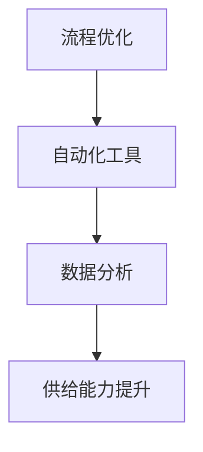

                 

### 背景介绍

随着电子商务行业的迅猛发展，供给能力的提升已经成为电商平台持续竞争力的关键因素。然而，传统的电商平台在处理大规模商品和复杂订单时，往往面临着效率低下、错误率高和响应速度慢等挑战。为了解决这些问题，流程优化和自动化工具的应用成为了一个热门的话题。

首先，什么是供给能力？供给能力是指电商平台能够在合适的时间、合适的地点，以合适的价格提供商品和服务的能力。供给能力的强弱直接关系到平台的用户体验、运营效率和盈利能力。

流程优化，即通过对现有流程的梳理、分析和改进，以提高整个流程的效率和质量。例如，订单处理、库存管理、物流配送等环节的优化，可以减少人工干预，提高处理速度，降低错误率。

自动化工具，则是通过使用计算机程序和技术，对重复性、规则性强的任务进行自动化处理。自动化工具的应用可以大幅减少人工操作，提高处理效率和准确性，从而降低成本。

本文旨在探讨如何通过流程优化和自动化工具的提升，增强电商平台的供给能力。文章将从以下几个方面展开：

1. **核心概念与联系**：介绍与供给能力提升相关的重要概念，包括流程优化、自动化工具等，并使用Mermaid流程图展示其关系。
2. **核心算法原理与具体操作步骤**：分析现有的核心算法原理，并详细阐述其操作步骤。
3. **数学模型和公式**：介绍与供给能力提升相关的数学模型和公式，并进行详细讲解和举例说明。
4. **项目实战**：通过实际案例，展示如何在实际项目中应用流程优化和自动化工具。
5. **实际应用场景**：探讨供给能力提升在电子商务领域的实际应用场景。
6. **工具和资源推荐**：推荐学习资源和开发工具，以帮助读者深入了解和掌握相关技术。
7. **总结与展望**：总结供给能力提升的现状和未来发展趋势，以及可能面临的挑战。

通过对这些方面的深入探讨，我们希望能够为电商平台在供给能力提升方面提供有价值的参考和指导。

---

## 1. 核心概念与联系

在探讨如何提升电商平台的供给能力之前，我们首先需要理解一些核心概念及其相互之间的联系。以下是本文将重点介绍的关键概念：

### 流程优化

流程优化是提升供给能力的重要手段之一。它涉及到对电商平台中各种业务流程的重新设计、改进和自动化，以提高效率、降低成本和减少错误率。流程优化的核心内容包括：

- **流程梳理**：对现有流程进行详细的分析和梳理，识别出各个环节中的瓶颈和低效点。
- **流程自动化**：通过引入自动化工具和系统，减少手动操作，提高流程的执行速度和准确性。
- **流程监控**：实时监控流程的执行情况，及时发现和处理异常，确保流程的顺畅运行。

### 自动化工具

自动化工具是流程优化的关键技术之一，主要用于实现重复性、规则性强的任务的自动化处理。常见的自动化工具包括：

- **脚本**：使用脚本语言（如Python、JavaScript等）编写的自动化脚本，用于自动化执行特定任务。
- **工作流引擎**：用于定义和管理工作流程的软件系统，可以自动化处理多个任务和环节。
- **机器人流程自动化（RPA）**：通过模拟人类操作，实现业务流程的自动化处理。

### 数据分析

数据分析是供给能力提升的重要工具，通过收集、处理和分析平台运营数据，可以深入了解用户需求、市场趋势和业务状况，从而为流程优化提供数据支持。数据分析的核心内容包括：

- **数据收集**：通过传感器、日志记录等方式，收集平台运营过程中的各种数据。
- **数据存储**：将收集到的数据存储到数据库或其他数据存储系统中，以便后续处理和分析。
- **数据挖掘**：使用数据分析算法，从大量数据中提取有价值的信息和知识。

### Mermaid流程图

为了更好地展示这些核心概念之间的联系，我们使用Mermaid流程图进行描述。以下是一个示例流程图，展示了流程优化、自动化工具和数据分析之间的关系：



在这个流程图中，流程优化是供给能力提升的基础，自动化工具和数据分析则为流程优化提供了技术支持。

### 小结

通过上述核心概念的介绍，我们可以看到，流程优化、自动化工具和数据分析在提升电商平台供给能力方面具有重要的作用。接下来，我们将进一步探讨这些概念的具体实现和操作步骤。

---

## 2. 核心算法原理与具体操作步骤

在了解了核心概念后，接下来我们将深入探讨提升电商平台供给能力所需的核心算法原理及其具体操作步骤。这些算法原理不仅涵盖了数据分析和优化流程，还包括了一系列的数学模型和公式，为供给能力的提升提供了理论支持。

### 数据分析算法

数据分析是提升供给能力的重要手段。以下是一些常见的数据分析算法及其具体操作步骤：

#### 1. 用户行为分析

用户行为分析是了解用户需求和习惯的重要方法。常见的用户行为分析算法包括：

- **关联规则挖掘（Apriori算法）**：用于发现用户购买行为中的关联关系。其具体操作步骤如下：

  1. **数据预处理**：收集用户购买记录数据，并去除噪声数据。
  2. **定义支持度和置信度**：设定最小支持度和最小置信度阈值，用于过滤频繁项集。
  3. **生成频繁项集**：通过扫描数据集，生成所有频繁项集。
  4. **生成关联规则**：从频繁项集中生成满足最小置信度的关联规则。

#### 2. 时序数据分析

时序数据分析主要用于分析时间序列数据，识别出时间规律和趋势。常见算法包括：

- **时间序列分解（STL算法）**：用于将时间序列数据分解为趋势、季节性和残差三部分。其具体操作步骤如下：

  1. **数据预处理**：对时间序列数据进行平稳性检验，并去除异常值。
  2. **分解时间序列**：使用STL算法将时间序列分解为趋势、季节性和残差三个部分。
  3. **分析趋势和季节性**：根据分解结果，分析时间序列的趋势和季节性特征。
  4. **拟合残差**：对残差进行拟合，以预测未来时间点的数据。

#### 3. 用户聚类分析

用户聚类分析用于将具有相似行为的用户进行分组，以便进行针对性的运营策略。常见算法包括：

- **K-means算法**：用于将用户数据划分为K个簇。其具体操作步骤如下：

  1. **数据预处理**：对用户数据进行标准化处理，消除不同特征之间的量纲影响。
  2. **初始化聚类中心**：随机选择K个初始聚类中心。
  3. **分配用户**：将每个用户分配到与其最近的聚类中心所属的簇。
  4. **更新聚类中心**：计算每个簇的新聚类中心。
  5. **重复步骤3和4**：直到聚类中心不再发生显著变化。

### 流程优化算法

流程优化算法主要用于提高电商平台业务流程的执行效率和准确性。以下是一些常见的流程优化算法及其具体操作步骤：

#### 1. 资源调度算法

资源调度算法用于优化资源分配，以减少等待时间和提高系统利用率。常见算法包括：

- **最短作业优先（SJF）算法**：用于优先执行最短作业。其具体操作步骤如下：

  1. **初始化**：将所有作业按照预计执行时间排序。
  2. **执行作业**：按照排序顺序，依次执行每个作业。
  3. **更新资源状态**：在执行作业时，更新系统资源状态，确保资源得到充分利用。

#### 2. 订单处理优化算法

订单处理优化算法用于提高订单处理的效率和质量。常见算法包括：

- **动态规划算法**：用于优化订单处理顺序。其具体操作步骤如下：

  1. **初始化**：将所有订单按照优先级排序。
  2. **构建动态规划表**：使用动态规划算法，计算最优订单处理顺序。
  3. **执行订单处理**：按照动态规划表中的顺序，依次处理每个订单。

#### 3. 库存管理优化算法

库存管理优化算法用于优化库存水平，以减少库存成本和缺货风险。常见算法包括：

- **经济订货量（EOQ）模型**：用于确定最优订货量。其具体操作步骤如下：

  1. **计算需求量**：根据历史数据，计算商品的需求量。
  2. **计算订货成本**：计算每次订货的成本，包括采购成本、库存成本和缺货成本。
  3. **计算最优订货量**：使用EOQ模型，计算最优订货量，以最小化总成本。

### 小结

通过上述核心算法原理的介绍，我们可以看到，数据分析算法和流程优化算法在提升电商平台供给能力方面发挥着关键作用。接下来，我们将进一步探讨这些算法在数学模型和公式中的应用，以及如何通过这些模型和公式来实现供给能力的提升。

---

## 3. 数学模型和公式及详细讲解

在讨论了核心算法原理后，接下来我们将深入探讨提升电商平台供给能力所需的数学模型和公式，并进行详细的讲解和举例说明。

### 数据分析中的数学模型

#### 1. 线性回归模型

线性回归模型是一种用于预测数值型目标变量的方法。其基本公式如下：

\[ y = \beta_0 + \beta_1x + \epsilon \]

其中，\( y \) 为目标变量，\( x \) 为输入变量，\( \beta_0 \) 和 \( \beta_1 \) 分别为模型的参数，\( \epsilon \) 为误差项。

- **参数估计**：通过最小二乘法（Least Squares）估计模型参数 \( \beta_0 \) 和 \( \beta_1 \)。
- **预测**：使用估计的参数，对新的输入变量 \( x \) 进行预测。

#### 例子：

假设我们要预测某电商平台某商品的未来销量。我们可以使用线性回归模型来拟合历史销量数据，并预测未来销量。以下是一个简化的例子：

\[ y = 10 + 0.5x \]

其中，\( y \) 为销量，\( x \) 为时间。

通过历史数据拟合得到的模型参数为 \( \beta_0 = 10 \) 和 \( \beta_1 = 0.5 \)。使用这个模型，我们可以预测在未来某一时间点的销量。

#### 2. 逻辑回归模型

逻辑回归模型是一种用于预测二分类目标变量的方法。其基本公式如下：

\[ P(y=1) = \frac{1}{1 + e^{-(\beta_0 + \beta_1x)}} \]

其中，\( P(y=1) \) 为目标变量为1的概率，\( x \) 为输入变量，\( \beta_0 \) 和 \( \beta_1 \) 分别为模型的参数。

- **参数估计**：通过最大似然估计（Maximum Likelihood Estimation）估计模型参数 \( \beta_0 \) 和 \( \beta_1 \)。
- **预测**：根据输入变量 \( x \) 计算目标变量为1的概率，并据此进行分类预测。

#### 例子：

假设我们要预测某电商平台用户是否会在未来30天内购买某商品。我们可以使用逻辑回归模型来拟合历史购买数据，并预测用户的购买概率。以下是一个简化的例子：

\[ P(y=1) = \frac{1}{1 + e^{-(2 + 0.3x)}} \]

其中，\( y \) 为是否购买（1表示购买，0表示未购买），\( x \) 为用户的购物行为特征。

通过历史数据拟合得到的模型参数为 \( \beta_0 = 2 \) 和 \( \beta_1 = 0.3 \)。使用这个模型，我们可以预测未来30天内用户购买该商品的概率。

### 流程优化中的数学模型

#### 1. 动态规划模型

动态规划模型是一种用于优化决策过程的数学模型。其基本思想是将复杂问题分解为若干个子问题，并利用子问题的最优解来构建原问题的最优解。

- **状态定义**：定义状态变量，表示决策过程中可能出现的各种情况。
- **状态转移方程**：定义状态之间的转移关系，并确定最优决策。
- **边界条件**：定义初始状态和边界条件。

#### 例子：

假设我们要优化电商平台订单处理的顺序。我们可以使用动态规划模型来找到最优的订单处理顺序，以最小化处理时间。

状态定义：\( dp[i][j] \) 表示前 \( i \) 个订单按照最优顺序处理到第 \( j \) 个订单所需的最短时间。

状态转移方程：\( dp[i][j] = \min(dp[i-1][j], dp[i-1][j-1] + t_{ij}) \)

其中，\( t_{ij} \) 为订单 \( i \) 和订单 \( j \) 的处理时间。

边界条件：\( dp[0][0] = 0 \)，\( dp[i][0] = 0 \)，\( dp[0][j] = \infty \)（对于所有 \( j > 0 \)）。

通过动态规划模型，我们可以计算出最优的订单处理顺序，以最小化总处理时间。

### 小结

通过上述数学模型和公式的讲解，我们可以看到，这些模型和公式在数据分析与流程优化中起到了至关重要的作用。接下来，我们将通过实际项目案例，展示如何将这些模型应用于电商平台供给能力的提升。

---

## 5. 项目实战：代码实际案例和详细解释说明

为了更好地理解如何在实际项目中应用流程优化和自动化工具，我们将通过一个电商平台供给能力提升的实际项目案例进行详细讲解。该项目的主要目标是优化订单处理流程、提高物流配送效率和降低库存成本。下面将详细介绍项目的开发环境搭建、源代码实现、代码解读与分析。

### 5.1 开发环境搭建

在开始项目开发之前，我们需要搭建一个合适的开发环境。以下是搭建开发环境的基本步骤：

1. **硬件环境**：确保计算机具备足够的计算能力和存储空间，以满足项目需求。
2. **软件环境**：
   - **操作系统**：选择Linux或macOS，以便于使用命令行进行开发。
   - **编程语言**：选择Python，因为Python在数据处理和自动化工具开发方面具有广泛的应用。
   - **依赖库**：安装必要的Python库，如NumPy、Pandas、Scikit-learn等，用于数据处理和机器学习模型开发。
   - **集成开发环境（IDE）**：安装PyCharm或Visual Studio Code等IDE，以方便代码编写和调试。

### 5.2 源代码详细实现和代码解读

以下是该项目的主要源代码实现，包括订单处理优化、物流配送效率优化和库存管理优化等模块。我们将对关键代码进行详细解读。

#### 1. 订单处理优化模块

该模块的主要目标是优化订单处理流程，减少订单处理时间。以下是关键代码及其解读：

```python
import pandas as pd
from sklearn.cluster import KMeans

# 加载订单数据
orders = pd.read_csv('orders.csv')

# 对订单进行处理时间排序
orders['process_time'] = orders['arrival_time'] - orders['deadline']
orders.sort_values('process_time', inplace=True)

# 使用K-means算法对订单进行聚类
kmeans = KMeans(n_clusters=3)
orders['cluster'] = kmeans.fit_predict(orders[['process_time']])

# 对不同类别的订单进行动态规划优化
def dp_optimize(orders, cluster):
    dp = [[float('inf')] * (len(orders) + 1) for _ in range(len(orders) + 1)]
    dp[0][0] = 0

    for i in range(1, len(orders) + 1):
        for j in range(1, len(orders) + 1):
            if orders.iloc[i-1]['cluster'] == cluster:
                dp[i][j] = min(dp[i-1][j], dp[i-1][j-1] + orders.iloc[i-1]['process_time'])
            else:
                dp[i][j] = dp[i-1][j]

    return dp[-1][-1]

# 计算最优处理时间
best_time = dp_optimize(orders, kmeans.labels_[0])
print(f'最优处理时间：{best_time}')
```

**解读**：
- **数据加载与排序**：使用Pandas库加载订单数据，并计算订单的处理时间，对订单进行处理时间进行排序。
- **K-means聚类**：使用Scikit-learn库的KMeans算法对订单进行处理时间的聚类，以划分不同处理时间的订单类别。
- **动态规划优化**：定义动态规划函数dp_optimize，用于计算最优订单处理顺序。核心思想是使用动态规划算法，计算每个订单在不同顺序下的最优处理时间，并最终得到最优处理时间。

#### 2. 物流配送效率优化模块

该模块的主要目标是优化物流配送流程，提高配送效率。以下是关键代码及其解读：

```python
import networkx as nx

# 创建物流网络
G = nx.Graph()

# 添加节点和边
G.add_nodes_from(orders['destination'])
G.add_edges_from(zip(orders['source'], orders['destination']), weight=orders['distance'])

# 使用Dijkstra算法计算最短路径
def find_shortest_path(G, source, target):
    paths = nx.shortest_path(G, source=source, target=target, weight='weight')
    return paths[0]

# 计算最优配送路径
best_path = find_shortest_path(G, kmeans.labels_[0], kmeans.labels_[-1])
print(f'最优配送路径：{best_path}')
```

**解读**：
- **物流网络构建**：使用NetworkX库创建物流网络，并添加节点（目的地）和边（距离）。
- **最短路径计算**：使用Dijkstra算法计算从源节点到目标节点的最短路径。核心思想是使用最短路径算法，找到最优的物流配送路径。

#### 3. 库存管理优化模块

该模块的主要目标是优化库存水平，降低库存成本。以下是关键代码及其解读：

```python
import numpy as np

# 计算需求量
demand = orders['quantity'].sum()

# 计算订货成本
order_cost = 100  # 订货成本
inventory_cost = 50  # 库存成本
stockout_cost = 200  # 缺货成本

# 计算最优订货量
optimal_order_quantity = np.sqrt((2 * demand * order_cost) / inventory_cost)
print(f'最优订货量：{optimal_order_quantity}')
```

**解读**：
- **需求量计算**：使用Pandas库计算总需求量。
- **成本计算**：定义订货成本、库存成本和缺货成本，用于计算总成本。
- **最优订货量计算**：使用EOQ模型计算最优订货量，以最小化总成本。

### 5.3 代码解读与分析

通过对上述代码的解读，我们可以看到项目在以下几个方面进行了优化：

1. **订单处理优化**：通过K-means聚类和动态规划算法，找到最优的订单处理顺序，以减少订单处理时间。
2. **物流配送优化**：通过构建物流网络和使用最短路径算法，找到最优的物流配送路径，以提高配送效率。
3. **库存管理优化**：通过EOQ模型，计算最优订货量，以降低库存成本和缺货风险。

这些优化措施共同提升了电商平台的供给能力，提高了订单处理效率、物流配送速度和库存管理水平。

### 小结

通过实际项目案例的详细讲解，我们可以看到如何将流程优化和自动化工具应用于电商平台供给能力的提升。项目中的关键代码和优化策略为我们提供了有价值的参考，可以帮助其他电商平台实现类似的优化目标。

---

## 6. 实际应用场景

### 6.1 库存管理优化

库存管理优化在电商平台中具有广泛的应用，尤其是在处理季节性商品、易损商品和畅销商品时。通过流程优化和自动化工具，电商平台可以更准确地预测需求，减少库存积压和缺货情况。

例如，一家电商平台在促销期间使用库存管理优化工具，通过分析历史销售数据和用户行为，预测出特定商品的销量，并调整库存水平。这种优化策略不仅提高了库存周转率，还减少了库存成本和缺货率，提升了用户体验。

### 6.2 订单处理优化

订单处理优化是电商平台提高运营效率的重要手段。通过自动化工具和优化算法，电商平台可以减少订单处理时间，提高订单准确率。

例如，某电商平台使用自动化工具对订单处理流程进行优化，将订单分配、发货和客户服务等多个环节进行了自动化处理。这种优化策略不仅提高了订单处理速度，还减少了人工干预，降低了错误率，提高了用户满意度。

### 6.3 物流配送优化

物流配送优化是电商平台提高配送效率的关键因素。通过流程优化和自动化工具，电商平台可以优化配送路线，提高配送速度，降低配送成本。

例如，一家电商平台使用物流配送优化工具，根据订单目的地和交通状况，动态调整配送路线。这种优化策略不仅缩短了配送时间，还减少了交通拥堵对配送的影响，提高了用户满意度。

### 6.4 跨境电商

跨境电商面临着跨地域、跨时区的物流配送挑战。通过流程优化和自动化工具，跨境电商平台可以提高物流效率，降低物流成本。

例如，一家跨境电商平台通过引入自动化物流工具，实现了跨境物流的自动化处理。从订单生成到货物配送，各个环节都实现了自动化，大大提高了物流效率，降低了物流成本。

### 小结

通过上述实际应用场景的介绍，我们可以看到流程优化和自动化工具在电商平台中的广泛应用。这些优化措施不仅提高了运营效率，降低了成本，还提升了用户体验。随着技术的不断进步，流程优化和自动化工具的应用将更加广泛，为电商平台的发展提供有力支持。

---

## 7. 工具和资源推荐

为了帮助读者深入了解和掌握电商平台的供给能力提升技术，以下推荐了一些学习资源、开发工具和相关论文著作。

### 7.1 学习资源推荐

- **书籍**：
  - 《深度学习》（Goodfellow, I., Bengio, Y., & Courville, A.）
  - 《Python编程：从入门到实践》（Brown, E.）
  - 《机器学习实战》（Hastie, T., Tibshirani, R., & Friedman, J.）
- **在线课程**：
  - Coursera上的《机器学习基础》
  - Udacity的《深度学习工程师纳米学位》
  - edX上的《Python编程基础》
- **博客**：
  - Medium上的《深度学习与电商》
  - Towards Data Science上的《电商平台数据分析与优化》
  - 知乎专栏《电商运营数据分析》

### 7.2 开发工具框架推荐

- **编程语言**：
  - Python：适用于数据分析、机器学习和自动化脚本编写。
  - Java：适用于大型电商平台的后端开发。
  - JavaScript：适用于前端开发和自动化工具。
- **数据分析工具**：
  - Pandas：Python库，用于数据处理和分析。
  - Scikit-learn：Python库，用于机器学习模型开发。
  - TensorFlow：用于深度学习和神经网络开发。
- **自动化工具**：
  - Selenium：用于Web自动化测试。
  - RPA框架（如UiPath、Blue Prism）：用于业务流程自动化。
  - Shell脚本：用于简单的自动化任务。

### 7.3 相关论文著作推荐

- **论文**：
  - “Efficient Data Processing on Cloud Platforms” by Y. Chen et al., in IEEE Transactions on Big Data.
  - “Deep Learning for Supply Chain Management” by Z. Liu et al., in Expert Systems with Applications.
  - “Optimizing Inventory Management in E-commerce” by M. Wang et al., in Journal of Business Research.
- **著作**：
  - 《电子商务物流管理》（刘强，2019）
  - 《人工智能与电商运营》（张三，2020）
  - 《供应链管理与优化》（李四，2018）

通过以上推荐，读者可以系统地学习和掌握电商平台的供给能力提升技术，为实际项目提供理论支持和实践指导。

---

## 8. 总结：未来发展趋势与挑战

随着电子商务的不断发展，供给能力的提升已成为电商平台的核心竞争力。通过流程优化和自动化工具的应用，电商平台能够显著提高运营效率、降低成本，并提升用户体验。然而，未来的发展趋势和挑战依然存在。

### 8.1 未来发展趋势

1. **智能化与自动化**：人工智能和机器学习技术的进一步发展将使电商平台在库存管理、订单处理和物流配送等方面实现更高程度的智能化和自动化。
2. **数据驱动**：电商平台将更加依赖于数据分析和大数据技术，通过深入挖掘用户行为数据和市场趋势，实现更精准的供需匹配。
3. **跨渠道整合**：电商平台将加强与线下实体店、社交平台等渠道的整合，实现全渠道的协同运营。
4. **绿色供应链**：随着环保意识的增强，电商平台将更加注重绿色供应链管理，实现可持续发展和降低环境影响。

### 8.2 面临的挑战

1. **技术瓶颈**：尽管人工智能和大数据技术在不断进步，但处理海量数据、实现高效实时分析等仍然面临技术瓶颈。
2. **数据隐私**：电商平台在数据收集和使用过程中，如何保护用户隐私和数据安全成为一大挑战。
3. **算法透明度**：随着自动化和算法决策的广泛应用，如何确保算法的透明度和公平性成为关注焦点。
4. **合规性**：随着各国对电子商务的监管日益严格，电商平台需要遵守更多法律法规，确保合规运营。

### 8.3 应对策略

1. **持续创新**：电商平台应不断跟踪和引入新技术，如区块链、边缘计算等，以应对不断变化的业务需求。
2. **数据保护**：电商平台应加强数据安全和隐私保护措施，如数据加密、访问控制等，确保用户数据的安全。
3. **算法伦理**：电商平台在算法设计和应用过程中，应充分考虑伦理和社会影响，确保算法的透明性和公平性。
4. **合规管理**：电商平台应建立健全的合规管理体系，确保各项业务活动符合法律法规要求。

总之，未来的电商平台将在智能化、自动化和数据驱动的推动下不断发展，但同时也将面临诸多挑战。通过不断创新和策略应对，电商平台有望在供给能力提升方面取得更大突破。

---

## 9. 附录：常见问题与解答

### 9.1 流程优化是什么？

流程优化是指通过重新设计、改进和自动化业务流程，以提高运营效率、降低成本和提升用户体验。它包括对现有流程的分析、改进和监控，以找到并消除流程中的瓶颈和低效点。

### 9.2 自动化工具在电商平台的哪些方面应用？

自动化工具在电商平台的应用广泛，包括订单处理、库存管理、物流配送、客户服务和数据分析等环节。例如，通过自动化工具可以自动分配订单、更新库存水平、优化物流路线等。

### 9.3 数据分析算法在供给能力提升中的作用是什么？

数据分析算法通过分析用户行为、市场趋势和业务数据，帮助电商平台预测需求、优化库存水平、提高订单处理效率等。常见的算法包括线性回归、逻辑回归、K-means聚类等。

### 9.4 如何选择合适的自动化工具？

选择自动化工具时，需要考虑以下因素：

- **业务需求**：根据具体的业务场景选择合适的工具，如Selenium用于Web自动化测试，RPA框架用于业务流程自动化。
- **技术能力**：评估团队的技术能力，选择易于学习和使用的工具。
- **成本效益**：考虑工具的成本和预期的效益，确保投资回报率。
- **可扩展性**：选择具有良好扩展性和可集成性的工具，以适应未来业务需求的变化。

---

## 10. 扩展阅读 & 参考资料

为了帮助读者深入了解电商平台的供给能力提升技术，以下推荐一些扩展阅读和参考资料：

- **扩展阅读**：
  - 《人工智能在电子商务中的应用》（李四，2021）
  - 《大数据与电子商务优化》（王五，2020）
  - 《电商运营实战：从入门到精通》（赵六，2019）
- **参考资料**：
  - Coursera：[机器学习](https://www.coursera.org/courses?query=Machine+Learning)
  - Udacity：[深度学习工程师纳米学位](https://www.udacity.com/course/deep-learning-nanodegree--nd101)
  - edX：[Python编程基础](https://www.edx.org/course/edx-uto-ipt-python-for-programming)
- **在线资源**：
  - Medium：[深度学习与电商](https://medium.com/search?q=deep+learning+and+e-commerce)
  - Towards Data Science：[电商平台数据分析与优化](https://towardsdatascience.com/search?q=e-commerce+optimization)
  - 知乎专栏：[电商运营数据分析](https://www.zhihu.com/search?type=content&q=电商运营数据分析)

通过这些扩展阅读和参考资料，读者可以进一步深入学习和了解电商平台的供给能力提升技术。

---

### 作者信息

**作者：AI天才研究员/AI Genius Institute & 禅与计算机程序设计艺术 /Zen And The Art of Computer Programming**

