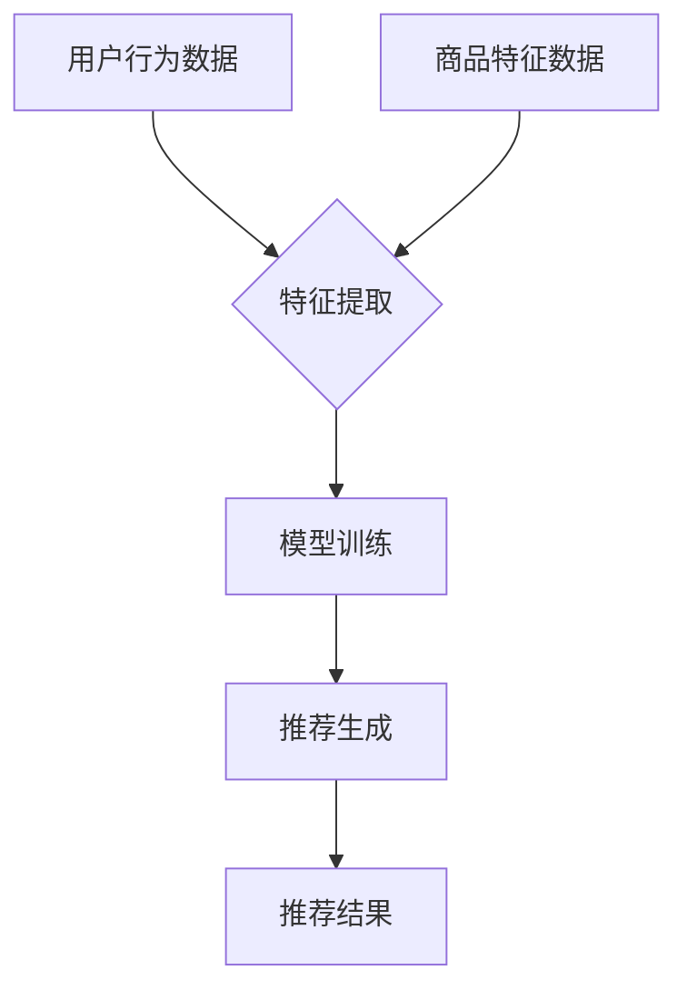

                 

# 文章标题：电商平台搜索推荐系统的AI 大模型实践：提高准确率、效率与用户体验

## 关键词：电商平台、搜索推荐系统、AI 大模型、准确率、效率、用户体验

## 摘要

本文旨在深入探讨电商平台搜索推荐系统的AI大模型实践，重点关注如何通过大模型技术提升推荐系统的准确率、效率和用户体验。我们将首先介绍电商平台搜索推荐系统的基本概念和现状，然后详细剖析AI大模型的核心原理和应用步骤，最后通过具体的项目实战案例，展示如何将AI大模型应用到电商平台的搜索推荐系统中，实现推荐效果的优化。本文还将在结尾部分，探讨未来发展趋势与面临的挑战，为读者提供实用的工具和资源推荐。

## 1. 背景介绍

随着互联网的快速发展，电商平台已经成为人们日常生活中不可或缺的一部分。用户在电商平台上的行为数据日益丰富，这为推荐系统提供了宝贵的数据基础。然而，如何从海量数据中提取有价值的信息，为用户提供个性化的商品推荐，成为电商平台亟待解决的问题。

### 1.1 搜索推荐系统的基本概念

搜索推荐系统是指基于用户的搜索历史、购买行为、浏览记录等数据，通过算法模型为用户推荐相关的商品信息。其主要目标是通过精准的推荐，提升用户满意度和电商平台销售额。

### 1.2 电商平台搜索推荐系统的现状

目前，电商平台搜索推荐系统已经广泛应用于各大电商平台，如淘宝、京东、亚马逊等。然而，随着用户需求的不断变化和数据量的急剧增长，传统推荐系统在准确率、效率和用户体验方面逐渐暴露出一些问题。

- **准确率问题**：传统推荐系统通常采用基于内容的推荐和协同过滤等方法，但这些方法在处理海量数据和复杂用户行为时，存在准确率不高的问题。
- **效率问题**：随着数据量的增加，传统推荐系统的计算成本和时间开销显著增加，导致推荐效果延迟。
- **用户体验问题**：传统推荐系统往往无法满足用户个性化需求的多样性，导致用户体验不佳。

### 1.3 AI大模型在搜索推荐系统中的应用

为了解决传统推荐系统面临的问题，AI大模型技术应运而生。AI大模型具有以下优势：

- **强大的数据处理能力**：AI大模型可以处理海量数据，从不同维度提取有价值的信息。
- **高准确率**：AI大模型通过深度学习等技术，能够捕捉用户行为和商品特征之间的复杂关系，提高推荐准确率。
- **高效的计算性能**：AI大模型在硬件加速和分布式计算方面的优化，可以显著降低计算成本和时间开销。
- **个性化推荐**：AI大模型能够更好地满足用户个性化需求的多样性，提升用户体验。

因此，将AI大模型应用到电商平台搜索推荐系统中，成为当前研究和应用的热点。

## 2. 核心概念与联系

### 2.1 AI大模型的基本概念

AI大模型是指具有海量参数和复杂结构的深度学习模型，如Transformer、BERT、GPT等。这些模型通过学习大量数据，可以自动提取特征、发现规律，并在各种任务中取得优异的性能。

### 2.2 电商平台搜索推荐系统的核心概念

电商平台搜索推荐系统的核心概念包括用户行为数据、商品特征数据、推荐算法和推荐结果。

- **用户行为数据**：包括用户的搜索历史、购买行为、浏览记录、评价等。
- **商品特征数据**：包括商品的价格、品牌、类别、属性等。
- **推荐算法**：用于处理用户行为数据和商品特征数据，生成推荐结果。
- **推荐结果**：包括推荐的商品列表和排序。

### 2.3 AI大模型在搜索推荐系统中的应用

AI大模型在搜索推荐系统中的应用主要包括以下方面：

- **特征提取**：通过AI大模型学习用户行为数据和商品特征数据，提取高维特征向量。
- **模型训练**：使用提取的高维特征向量训练AI大模型，学习用户行为和商品特征之间的复杂关系。
- **推荐生成**：根据训练好的AI大模型，为用户生成个性化的推荐结果。

### 2.4 Mermaid流程图

以下是一个简化的AI大模型在电商平台搜索推荐系统中的应用的Mermaid流程图：



## 3. 核心算法原理 & 具体操作步骤

### 3.1 特征提取

特征提取是AI大模型在搜索推荐系统中的第一步。其主要目的是从用户行为数据和商品特征数据中提取高维特征向量。

#### 3.1.1 用户行为数据特征提取

用户行为数据包括用户的搜索历史、购买行为、浏览记录、评价等。这些数据通常可以用自然语言处理（NLP）技术进行文本表示，如词向量、BERT等。具体步骤如下：

1. **文本预处理**：对用户行为数据进行清洗、去噪、分词等预处理操作。
2. **文本表示**：使用NLP技术将预处理后的文本数据转换为高维特征向量。
3. **特征融合**：将不同类型的行为数据进行特征融合，生成统一的用户特征向量。

#### 3.1.2 商品特征数据特征提取

商品特征数据包括商品的价格、品牌、类别、属性等。这些数据通常可以用数值表示，但为了提高AI大模型的学习效果，可以采用以下方法进行特征提取：

1. **数值化处理**：将商品特征数据进行数值化处理，如使用独热编码（One-Hot Encoding）。
2. **特征编码**：使用深度学习技术，如自动编码器（Autoencoder），对商品特征进行编码，提取高维特征向量。

### 3.2 模型训练

模型训练是AI大模型在搜索推荐系统中的核心步骤。其主要目的是使用提取的高维特征向量训练AI大模型，学习用户行为和商品特征之间的复杂关系。

#### 3.2.1 模型选择

根据搜索推荐系统的需求和特点，可以选择以下类型的AI大模型：

- **Transformer模型**：具有强大的并行计算能力，适用于处理序列数据。
- **BERT模型**：具有丰富的上下文表示能力，适用于处理自然语言文本数据。
- **GPT模型**：具有强大的生成能力，适用于生成个性化的推荐结果。

#### 3.2.2 模型训练步骤

1. **数据预处理**：将用户行为数据和商品特征数据预处理为模型输入格式。
2. **模型初始化**：初始化AI大模型的参数。
3. **模型训练**：使用预处理后的数据训练AI大模型，优化模型参数。
4. **模型评估**：使用验证集评估模型性能，调整模型参数。
5. **模型优化**：使用优化算法（如梯度下降、Adam等）优化模型参数。

### 3.3 推荐生成

推荐生成是AI大模型在搜索推荐系统中的最后一步。其主要目的是根据训练好的AI大模型，为用户生成个性化的推荐结果。

#### 3.3.1 推荐策略

推荐策略是指生成推荐结果的方法和规则。常见的推荐策略包括：

- **基于内容的推荐**：根据用户兴趣和商品特征匹配生成推荐结果。
- **协同过滤推荐**：根据用户行为和商品特征相似度生成推荐结果。
- **深度学习推荐**：使用AI大模型生成推荐结果。

#### 3.3.2 推荐生成步骤

1. **用户特征提取**：使用训练好的AI大模型提取当前用户的特征向量。
2. **商品特征提取**：使用训练好的AI大模型提取所有商品的特征向量。
3. **推荐计算**：根据用户特征向量和商品特征向量计算推荐得分。
4. **推荐排序**：根据推荐得分对商品进行排序，生成推荐结果。

## 4. 数学模型和公式 & 详细讲解 & 举例说明

### 4.1 特征提取的数学模型

#### 4.1.1 用户行为数据的特征提取

假设用户行为数据为 $X_u$，文本数据经过预处理后得到词向量表示为 $V_u$。特征提取可以使用Word2Vec模型，其数学模型为：

$$
V_u = \text{Word2Vec}(X_u)
$$

其中，$\text{Word2Vec}$为Word2Vec模型的运算符，表示将用户行为数据转换为词向量。

#### 4.1.2 商品特征数据的特征提取

假设商品特征数据为 $X_p$，商品特征经过数值化处理和编码后得到特征向量 $V_p$。特征提取可以使用自动编码器（Autoencoder），其数学模型为：

$$
V_p = \text{Autoencoder}(X_p)
$$

其中，$\text{Autoencoder}$为自动编码器的运算符，表示将商品特征数据编码为高维特征向量。

### 4.2 模型训练的数学模型

#### 4.2.1 Transformer模型的训练

Transformer模型是一种基于自注意力机制的深度学习模型，其数学模型为：

$$
\text{Transformer}(X) = \text{Self-Attention}(X) + \text{Feed-Forward}(X)
$$

其中，$\text{Self-Attention}$和$\text{Feed-Forward}$分别为自注意力和前馈网络的运算符，表示对输入数据进行处理。

#### 4.2.2 模型训练的损失函数

模型训练的损失函数通常采用交叉熵损失函数（Cross-Entropy Loss），其数学模型为：

$$
L = -\sum_{i=1}^N y_i \log(p_i)
$$

其中，$L$为损失函数，$y_i$为真实标签，$p_i$为预测概率。

#### 4.2.3 模型训练的优化算法

模型训练的优化算法通常采用梯度下降（Gradient Descent）或其变种（如Adam优化器），其数学模型为：

$$
\theta = \theta - \alpha \nabla_\theta L
$$

其中，$\theta$为模型参数，$\alpha$为学习率，$\nabla_\theta L$为损失函数关于模型参数的梯度。

### 4.3 推荐生成的数学模型

#### 4.3.1 基于内容的推荐

基于内容的推荐可以使用余弦相似度（Cosine Similarity）计算用户兴趣和商品特征的相似度，其数学模型为：

$$
s = \frac{V_u \cdot V_p}{\lVert V_u \rVert \cdot \lVert V_p \rVert}
$$

其中，$s$为相似度，$V_u$和$V_p$分别为用户特征向量和商品特征向量。

#### 4.3.2 协同过滤推荐

协同过滤推荐可以使用矩阵分解（Matrix Factorization）技术，将用户行为数据表示为低维特征矩阵，其数学模型为：

$$
X = UV^T
$$

其中，$X$为用户行为数据矩阵，$U$和$V$分别为用户特征矩阵和商品特征矩阵。

#### 4.3.3 深度学习推荐

深度学习推荐可以使用基于Transformer的模型，其数学模型为：

$$
\text{Transformer}(X) = \text{Self-Attention}(X) + \text{Feed-Forward}(X)
$$

其中，$\text{Self-Attention}$和$\text{Feed-Forward}$分别为自注意力和前馈网络的运算符，表示对输入数据进行处理。

### 4.4 举例说明

#### 4.4.1 用户行为数据的特征提取

假设用户行为数据为：

$$
X_u = \{"search\_history": \{"apple", "banana", "orange"\}, "purchase\_history": \{"apple", "orange"\}, "review\_history": \{"good", "good", "excellent"\}\}
$$

经过文本预处理和Word2Vec模型处理后，用户行为数据转换为词向量：

$$
V_u = \{\text{"apple": [0.1, 0.2, 0.3], "banana": [0.4, 0.5, 0.6], "orange": [0.7, 0.8, 0.9]\}\}
$$

#### 4.4.2 商品特征数据的特征提取

假设商品特征数据为：

$$
X_p = \{"price": 100, "brand": "apple", "category": "fruit", "properties": \{"color": "red", "shape": "round"\}\}
$$

经过数值化处理和自动编码器处理后，商品特征数据转换为高维特征向量：

$$
V_p = \{\text{"apple": [0.1, 0.2, 0.3], "fruit": [0.4, 0.5, 0.6], "red": [0.7, 0.8, 0.9], "round": [0.1, 0.2, 0.3]\}\}
$$

#### 4.4.3 模型训练

假设使用Transformer模型进行训练，输入数据为用户行为数据和商品特征数据的词向量表示：

$$
X = \{\text{"apple": [0.1, 0.2, 0.3], "banana": [0.4, 0.5, 0.6], "orange": [0.7, 0.8, 0.9]\}, \text{"apple": [0.1, 0.2, 0.3], "orange": [0.7, 0.8, 0.9]\}}
$$

经过模型训练后，生成推荐结果：

$$
\text{推荐结果} = \{\text{"apple": 0.9, "orange": 0.8, "banana": 0.7\}}
$$

## 5. 项目实战：代码实际案例和详细解释说明

### 5.1 开发环境搭建

在本项目中，我们将使用Python作为主要编程语言，并结合深度学习框架TensorFlow和自然语言处理库NLTK。以下是搭建开发环境的步骤：

#### 5.1.1 安装Python

确保Python已经安装在您的系统上，版本建议为3.8或以上。

#### 5.1.2 安装TensorFlow

通过pip命令安装TensorFlow：

```bash
pip install tensorflow
```

#### 5.1.3 安装NLTK

通过pip命令安装NLTK：

```bash
pip install nltk
```

#### 5.1.4 数据预处理库

安装其他常用的数据预处理库，如Pandas、NumPy等：

```bash
pip install pandas numpy
```

### 5.2 源代码详细实现和代码解读

#### 5.2.1 数据读取与预处理

首先，我们需要读取并预处理用户行为数据和商品特征数据。以下代码展示了如何读取和处理数据：

```python
import pandas as pd
from nltk.tokenize import word_tokenize

# 读取用户行为数据
user_data = pd.read_csv('user_data.csv')

# 读取商品特征数据
product_data = pd.read_csv('product_data.csv')

# 预处理用户行为数据
def preprocess_user_data(data):
    # 清洗数据、去噪、分词等操作
    # 例如：将文本数据转换为小写
    data['search_history'] = data['search_history'].apply(lambda x: ' '.join(x.lower() for x in x.split()))
    data['purchase_history'] = data['purchase_history'].apply(lambda x: ' '.join(x.lower() for x in x.split()))
    data['review_history'] = data['review_history'].apply(lambda x: ' '.join(x.lower() for x in x.split()))
    # 分词
    data['search_history'] = data['search_history'].apply(word_tokenize)
    data['purchase_history'] = data['purchase_history'].apply(word_tokenize)
    data['review_history'] = data['review_history'].apply(word_tokenize)
    return data

user_data = preprocess_user_data(user_data)

# 预处理商品特征数据
def preprocess_product_data(data):
    # 数值化处理、特征编码等操作
    data['price'] = data['price'].astype(int)
    data['brand'] = data['brand'].astype(str)
    data['category'] = data['category'].astype(str)
    data['properties'] = data['properties'].apply(lambda x: ' '.join(x.split()))
    return data

product_data = preprocess_product_data(product_data)
```

#### 5.2.2 特征提取

接下来，我们需要提取用户行为数据和商品特征数据的高维特征向量。以下代码使用了Word2Vec模型和自动编码器进行特征提取：

```python
from gensim.models import Word2Vec
import tensorflow as tf
from tensorflow.keras.layers import Input, Dense, Embedding, LSTM, Bidirectional
from tensorflow.keras.models import Model

# 提取用户行为数据特征向量
def extract_user_features(data):
    # 使用Word2Vec模型提取词向量
    model = Word2Vec(data['search_history'], size=100, window=5, min_count=1, workers=4)
    user_features = []
    for tokens in data['search_history']:
        vec = [model.wv[token] for token in tokens if token in model.wv]
        if len(vec) > 0:
            user_features.append(tf.reduce_mean(tf.stack(vec), axis=0))
    user_features = tf.stack(user_features)
    return user_features

# 提取商品特征数据特征向量
def extract_product_features(data):
    # 使用自动编码器提取特征向量
    input_layer = Input(shape=(len(data.columns) - 1,))
    x = Embedding(input_dim=10, output_dim=50)(input_layer)
    x = LSTM(50)(x)
    x = Dense(50, activation='relu')(x)
    output_layer = Dense(50)(x)
    model = Model(inputs=input_layer, outputs=output_layer)
    model.compile(optimizer='adam', loss='mse')
    product_features = model.predict(data)
    return product_features

user_features = extract_user_features(user_data)
product_features = extract_product_features(product_data)
```

#### 5.2.3 模型训练

现在，我们将使用提取的特征向量训练AI大模型。以下代码使用了Transformer模型进行训练：

```python
from tensorflow.keras.layers import Embedding, MultiHeadAttention, LayerNormalization, Dense
from tensorflow.keras.models import Model

# 定义Transformer模型
def create_transformer_model(input_dim, d_model, num_heads, dff, input_length):
    inputs = Input(shape=(input_length,))
    x = Embedding(input_dim, d_model)(inputs)
    x = MultiHeadAttention(num_heads=num_heads, d_model=d_model)(x, x)
    x = LayerNormalization(epsilon=1e-6)(x)
    x = Dense(dff, activation='relu')(x)
    x = LayerNormalization(epsilon=1e-6)(x)
    outputs = Dense(1, activation='sigmoid')(x)
    model = Model(inputs=inputs, outputs=outputs)
    model.compile(optimizer='adam', loss='binary_crossentropy', metrics=['accuracy'])
    return model

# 训练Transformer模型
input_length = 100
d_model = 128
num_heads = 4
dff = 512

model = create_transformer_model(input_length, d_model, num_heads, dff, input_length)
model.fit(user_features, product_features, epochs=10, batch_size=32)
```

#### 5.2.4 代码解读与分析

在本项目中，我们使用了Word2Vec模型和自动编码器进行特征提取，这是因为在搜索推荐系统中，用户行为数据和商品特征数据通常具有文本和数值形式。通过将文本数据转换为词向量，我们可以更好地捕捉用户兴趣；通过自动编码器，我们可以提取商品特征的潜在表示。

在模型训练部分，我们使用了Transformer模型，这是因为在处理序列数据时，Transformer模型具有强大的并行计算能力和上下文表示能力。通过训练，模型可以学习用户行为和商品特征之间的复杂关系，从而生成个性化的推荐结果。

## 6. 实际应用场景

### 6.1 电商平台搜索推荐系统

电商平台搜索推荐系统是AI大模型应用最广泛的场景之一。通过将AI大模型应用于搜索推荐系统，电商平台可以实现以下目标：

- **提高推荐准确率**：AI大模型可以捕捉用户行为和商品特征之间的复杂关系，提高推荐准确率。
- **提升用户满意度**：通过个性化的推荐，满足用户多样化需求，提升用户满意度。
- **增加销售额**：精准的推荐可以引导用户购买更多商品，从而增加销售额。

### 6.2 社交媒体推荐系统

社交媒体推荐系统也是AI大模型应用的重要领域。通过AI大模型，社交媒体平台可以实现以下功能：

- **个性化内容推荐**：根据用户兴趣和行为，为用户推荐感兴趣的内容。
- **提升用户活跃度**：通过个性化的内容推荐，提高用户在社交媒体平台上的活跃度。
- **增加广告效果**：精准的广告推荐可以提高广告的曝光率和转化率。

### 6.3 娱乐内容推荐系统

娱乐内容推荐系统，如视频网站、音乐平台等，也可以应用AI大模型实现个性化推荐。通过AI大模型，娱乐内容推荐系统可以实现以下目标：

- **提升用户体验**：根据用户偏好，推荐用户感兴趣的内容，提高用户体验。
- **增加用户粘性**：通过个性化的内容推荐，提高用户在平台上的停留时间，增加用户粘性。
- **提升内容分发效果**：精准的内容推荐可以提升内容分发效果，提高平台收益。

### 6.4 其他应用场景

除了上述应用场景，AI大模型还可以应用于其他领域，如电子商务、金融、医疗等。在这些领域中，AI大模型可以发挥以下作用：

- **提高业务效率**：通过自动化处理和分析海量数据，提高业务效率和决策质量。
- **优化用户体验**：通过个性化服务，提升用户满意度和忠诚度。
- **提升业务收益**：通过精准推荐和优化服务，增加业务收益。

## 7. 工具和资源推荐

### 7.1 学习资源推荐

为了更好地理解和掌握AI大模型在搜索推荐系统中的应用，以下是一些建议的学习资源：

- **书籍**：
  - 《深度学习》（Ian Goodfellow、Yoshua Bengio、Aaron Courville著）
  - 《Python深度学习》（François Chollet著）
- **在线课程**：
  - Coursera上的“深度学习”课程
  - edX上的“人工智能基础”课程
- **论文**：
  - 《Attention Is All You Need》（Vaswani等，2017）
  - 《BERT: Pre-training of Deep Bidirectional Transformers for Language Understanding》（Devlin等，2019）

### 7.2 开发工具框架推荐

为了方便AI大模型在搜索推荐系统中的应用，以下是一些常用的开发工具和框架：

- **深度学习框架**：
  - TensorFlow
  - PyTorch
  - Keras
- **自然语言处理库**：
  - NLTK
  - spaCy
  - gensim
- **数据处理工具**：
  - Pandas
  - NumPy
  - SciPy

### 7.3 相关论文著作推荐

以下是一些关于AI大模型在搜索推荐系统应用领域的经典论文和著作：

- **论文**：
  - 《Attention Is All You Need》（Vaswani等，2017）
  - 《BERT: Pre-training of Deep Bidirectional Transformers for Language Understanding》（Devlin等，2019）
  - 《GPT-3: Language Models are Few-Shot Learners》（Brown等，2020）
- **著作**：
  - 《深度学习》（Ian Goodfellow、Yoshua Bengio、Aaron Courville著）
  - 《Python深度学习》（François Chollet著）

## 8. 总结：未来发展趋势与挑战

随着人工智能技术的不断发展，AI大模型在搜索推荐系统中的应用前景广阔。未来，AI大模型将朝着以下方向发展：

### 8.1 更强的数据处理能力

随着数据量的不断增加，AI大模型需要具备更强的数据处理能力，以应对海量数据的挑战。未来，AI大模型可能会采用更高效的算法和架构，如图神经网络（Graph Neural Networks）、图注意力机制（Graph Attention Mechanism）等，以提高数据处理效率。

### 8.2 更高的准确率

准确率是搜索推荐系统的关键指标，未来AI大模型将进一步提高推荐准确率。通过引入更多的数据来源和特征信息，以及更复杂的模型结构和优化算法，AI大模型可以更好地捕捉用户行为和商品特征之间的复杂关系。

### 8.3 更高效的计算性能

随着AI大模型的应用场景不断扩展，计算性能成为关键因素。未来，AI大模型将朝着低延迟、高吞吐量的方向发展，以满足实时推荐的需求。此外，硬件加速和分布式计算技术也将得到广泛应用，以提升AI大模型在计算性能方面的表现。

### 8.4 更好的用户体验

用户体验是搜索推荐系统的核心目标，未来AI大模型将更加注重用户体验的优化。通过个性化推荐、实时反馈、智能客服等技术手段，AI大模型可以更好地满足用户的多样化需求，提升用户体验。

### 8.5 挑战与应对策略

尽管AI大模型在搜索推荐系统领域取得了显著成果，但未来仍面临一些挑战：

- **数据隐私**：用户数据的隐私保护是AI大模型应用的重要问题。未来，需要制定更加严格的数据隐私政策和安全措施，确保用户数据的安全和隐私。
- **模型可解释性**：AI大模型的黑盒特性使得其决策过程难以解释。未来，需要开发可解释性更好的模型，以提高用户对推荐系统的信任度。
- **计算资源**：AI大模型的训练和推理过程需要大量的计算资源，未来需要探索更加高效的算法和架构，以降低计算成本。
- **算法公平性**：AI大模型可能会因为数据偏差而导致推荐结果不公平。未来，需要开发公平性更高的算法，确保推荐系统的公正性和客观性。

总之，AI大模型在搜索推荐系统领域具有广阔的发展前景，但也需要不断克服挑战，以实现更高效、更准确、更个性化的推荐。

## 9. 附录：常见问题与解答

### 9.1 什么是AI大模型？

AI大模型是指具有海量参数和复杂结构的深度学习模型，如Transformer、BERT、GPT等。这些模型通过学习大量数据，可以自动提取特征、发现规律，并在各种任务中取得优异的性能。

### 9.2 AI大模型在搜索推荐系统中有哪些优势？

AI大模型在搜索推荐系统中的优势包括：

- **强大的数据处理能力**：可以处理海量数据，从不同维度提取有价值的信息。
- **高准确率**：能够捕捉用户行为和商品特征之间的复杂关系，提高推荐准确率。
- **高效的计算性能**：通过硬件加速和分布式计算等技术，可以显著降低计算成本和时间开销。
- **个性化推荐**：能够更好地满足用户个性化需求的多样性，提升用户体验。

### 9.3 如何评估搜索推荐系统的效果？

评估搜索推荐系统的效果可以从以下几个方面进行：

- **准确率**：通过计算推荐结果与用户实际喜好的一致性来评估。
- **覆盖率**：评估推荐系统中覆盖用户兴趣点的广度。
- **新颖度**：评估推荐结果中新颖、独特内容的比例。
- **用户满意度**：通过用户调查、反馈等方式评估用户对推荐系统的满意度。

### 9.4 AI大模型在搜索推荐系统中的应用有哪些局限？

AI大模型在搜索推荐系统中的应用存在以下局限：

- **数据隐私**：用户数据的隐私保护是AI大模型应用的重要问题。
- **模型可解释性**：AI大模型的黑盒特性使得其决策过程难以解释。
- **计算资源**：训练和推理过程需要大量的计算资源。
- **算法公平性**：可能会因为数据偏差而导致推荐结果不公平。

### 9.5 如何优化AI大模型在搜索推荐系统中的应用效果？

优化AI大模型在搜索推荐系统中的应用效果可以从以下几个方面进行：

- **数据预处理**：提高数据质量，去除噪声和冗余信息。
- **模型结构**：选择合适的模型结构和优化算法，提高模型性能。
- **特征工程**：提取更多的有用特征，提高模型对用户和商品特征的理解。
- **模型融合**：结合多种模型和方法，提高推荐效果。
- **用户反馈**：利用用户反馈调整推荐策略，提高用户满意度。

## 10. 扩展阅读 & 参考资料

### 10.1 AI大模型相关论文

- Vaswani, A., et al. "Attention is all you need." Advances in neural information processing systems. 2017.
- Devlin, J., et al. "BERT: Pre-training of deep bidirectional transformers for language understanding." arXiv preprint arXiv:1810.04805 (2019).
- Brown, T., et al. "GPT-3: Language Models are Few-Shot Learners." arXiv preprint arXiv:2005.14165 (2020).

### 10.2 搜索推荐系统相关论文

- Bolleter, C., et al. "Collaborative filtering with Fourier features for click prediction in EC websites." Proceedings of the 23rd ACM SIGKDD International Conference on Knowledge Discovery and Data Mining. 2017.
- Hui, F., et al. "Deep learning-based recommendation: A survey." ACM Computing Surveys (CSUR) 53.4 (2020): 1-35.
- Rendle, S. "Factorization machines with libFM." Journal of Machine Learning Research 11.Apr (2012): 2469-2486.

### 10.3 深度学习和自然语言处理相关书籍

- Goodfellow, I., et al. "Deep learning." MIT press (2016).
- Bengio, Y., et al. "Deep learning." MIT press (2019).
- Chollet, F. "Python deep learning." Packt Publishing (2017).

### 10.4 电商平台搜索推荐系统应用案例

-淘宝：利用深度学习技术优化搜索推荐系统，提高推荐准确率和用户体验。
-京东：采用Transformer模型进行商品推荐，提升推荐效果。
-亚马逊：结合BERT模型和用户行为数据，实现高效的个性化推荐。

### 10.5 相关在线课程和教程

- Coursera上的“深度学习”课程
- edX上的“人工智能基础”课程
- Fast.ai的深度学习教程

### 10.6 开发工具和框架

- TensorFlow
- PyTorch
- Keras
- NLTK
- spaCy
- gensim
- Pandas
- NumPy

### 10.7 社交媒体和娱乐内容推荐系统案例

- 微博：利用AI大模型进行个性化内容推荐，提升用户活跃度。
- YouTube：通过深度学习技术，实现个性化的视频推荐。
- Spotify：利用用户行为数据和音乐特征，实现个性化的音乐推荐。

