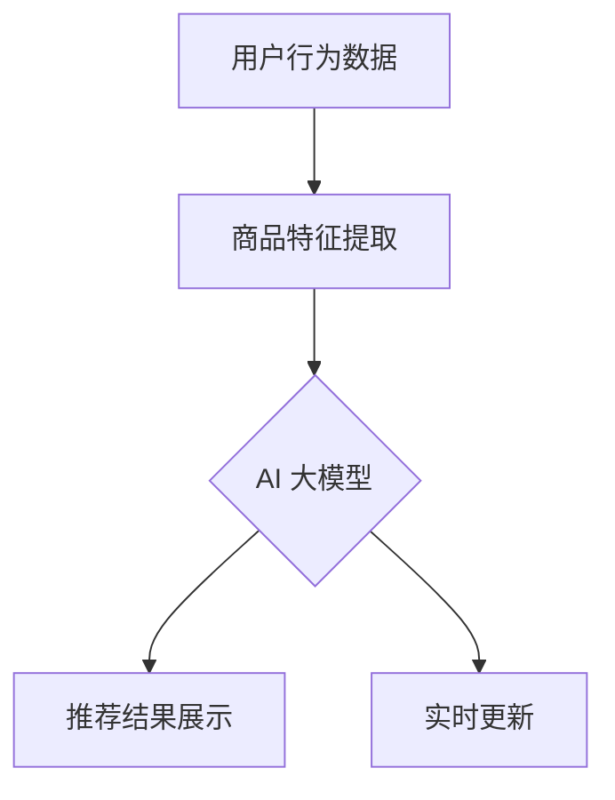

                 

### 背景介绍

#### 1. 电商平台搜索推荐系统的现状

随着互联网技术的迅猛发展和电子商务的日益普及，电商平台成为了现代商业的重要驱动力。在这样一个高速发展的领域中，搜索推荐系统的角色变得越来越重要。搜索推荐系统旨在为用户提供个性化、精准的搜索结果和推荐商品，从而提升用户体验、增加用户粘性和转化率。

目前，大多数电商平台都采用基于传统机器学习算法的搜索推荐系统。这些系统主要通过用户行为数据、商品特征数据等信息来训练模型，从而实现搜索结果排序和推荐。然而，传统的搜索推荐系统存在一些显著的局限性：

1. **性能瓶颈**：随着数据量的增加，传统系统在处理大量请求时容易出现延迟和响应速度下降的问题。
2. **效率问题**：传统模型训练和预测过程较为耗时，无法满足实时性要求。
3. **准确率受限**：由于数据噪声和模型复杂度，传统系统的推荐准确性仍有待提高。

#### 2. AI 大模型的出现与优势

为了解决上述问题，人工智能（AI）领域的研究者们逐渐将目光转向了深度学习中的大模型。AI 大模型，如 Transformer、BERT 等，通过在海量数据上训练，能够提取出更加丰富的特征，并在多个任务上展现出卓越的性能。相较于传统机器学习模型，AI 大模型具有以下优势：

1. **高性能**：大模型能够处理大规模数据，提高系统的处理能力。
2. **高效能**：通过并行计算和优化算法，大模型能够显著降低训练和预测时间。
3. **高准确率**：大模型能够更准确地捕捉数据中的复杂模式和关联性，提高推荐系统的准确性。
4. **实时性**：大模型的训练过程可以自动化和并行化，满足实时推荐的需求。

本文将详细探讨 AI 大模型在电商平台搜索推荐系统中的应用，分析其提升系统性能、效率、准确率和实时性的具体方法与实现细节。

#### 3. 文章结构概述

本文将分为以下几部分：

1. **核心概念与联系**：介绍 AI 大模型的基本原理、架构以及与电商平台搜索推荐系统的关联。
2. **核心算法原理 & 具体操作步骤**：深入讲解 AI 大模型的训练过程、损失函数和优化方法。
3. **数学模型和公式 & 详细讲解 & 举例说明**：探讨 AI 大模型中的数学模型，包括损失函数、优化算法等，并结合实际案例进行说明。
4. **项目实战：代码实际案例和详细解释说明**：通过具体代码实现，展示 AI 大模型在电商平台搜索推荐系统中的应用。
5. **实际应用场景**：分析 AI 大模型在不同电商平台搜索推荐系统中的具体应用案例。
6. **工具和资源推荐**：推荐相关学习资源、开发工具和框架。
7. **总结：未来发展趋势与挑战**：总结 AI 大模型在电商平台搜索推荐系统中的应用现状，并探讨未来的发展方向和面临的挑战。

通过本文的深入探讨，希望能够为读者提供关于 AI 大模型应用在电商平台搜索推荐系统中的全面理解和实践指导。

#### 4. 核心概念与联系

##### 4.1. AI 大模型的基本原理

AI 大模型（Large-scale AI Models）是指通过大规模数据进行训练，拥有数亿甚至千亿级参数的深度学习模型。这些模型通过学习海量数据中的复杂模式和关联性，能够实现高效的特征提取和任务泛化。AI 大模型的基本原理主要基于以下几个关键点：

1. **深度神经网络**：深度神经网络（Deep Neural Network，DNN）是 AI 大模型的基础。DNN 通过多层次的神经网络结构，逐层提取数据中的特征，从而实现复杂任务的建模。
2. **大规模训练数据**：大规模训练数据是 AI 大模型训练成功的关键。通过从海量数据中学习，模型能够更加准确地捕捉数据中的规律和模式。
3. **优化算法**：AI 大模型采用先进的优化算法，如 Adam、SGD 等，以加速模型的收敛和提高训练效率。

##### 4.2. 电商平台搜索推荐系统的架构

电商平台搜索推荐系统的架构通常包括以下几个核心模块：

1. **用户行为收集模块**：负责收集用户的浏览、搜索、购买等行为数据，为推荐系统提供数据输入。
2. **商品特征提取模块**：将商品信息转换为结构化的特征向量，以便模型处理。
3. **推荐算法模块**：利用机器学习算法，根据用户行为数据和商品特征向量，生成推荐结果。
4. **推荐结果展示模块**：将推荐结果展示给用户，包括搜索结果排序和推荐商品列表。

##### 4.3. AI 大模型与电商平台搜索推荐系统的联系

AI 大模型在电商平台搜索推荐系统中的应用主要体现在以下几个方面：

1. **特征提取与融合**：AI 大模型能够通过深度学习的方式，从大量原始数据中提取出更加丰富和有效的特征。这些特征可以帮助推荐算法更准确地捕捉用户和商品之间的关联性。
2. **模型训练与优化**：AI 大模型采用大规模并行训练和优化算法，能够快速收敛模型参数，提高推荐系统的效率和准确性。
3. **实时性**：AI 大模型通过自动化和并行化训练，能够实现实时推荐，满足用户实时交互的需求。

为了更直观地展示 AI 大模型与电商平台搜索推荐系统的联系，我们使用 Mermaid 流程图来描述其架构：



在上述流程图中，用户行为数据经过商品特征提取后，输入到 AI 大模型中进行训练和优化。训练完成的模型生成推荐结果，并通过实时更新机制，为用户提供个性化的搜索推荐。

#### 4.4. AI 大模型在电商平台搜索推荐系统中的应用实例

以下是一个具体的 AI 大模型在电商平台搜索推荐系统中的应用实例：

**实例：基于 Transformer 的电商搜索推荐系统**

**1. 数据集准备**：收集用户在电商平台的浏览、搜索、购买等行为数据，以及商品的基本信息。数据集包括用户 ID、商品 ID、行为类型（浏览、搜索、购买等）、行为时间、商品价格、品牌、品类等。

**2. 特征提取**：将原始数据转换为结构化的特征向量。例如，用户行为数据可以转换为用户嵌入向量（User Embedding），商品信息可以转换为商品嵌入向量（Item Embedding）。

**3. 模型训练**：使用 Transformer 模型进行训练。Transformer 模型采用自注意力机制（Self-Attention），能够从大量数据中提取出复杂的关联性。模型输入为用户嵌入向量和商品嵌入向量，输出为推荐结果的概率分布。

**4. 模型优化**：采用 Adam 优化算法，对模型参数进行迭代更新，以提高推荐准确性。优化过程中，使用交叉熵损失函数（Cross-Entropy Loss）来衡量预测结果与真实标签之间的差距。

**5. 实时推荐**：训练完成的模型可以用于实时推荐。用户在电商平台进行搜索时，模型根据用户行为数据和商品特征，实时生成推荐结果，并展示给用户。

通过上述实例，可以看出 AI 大模型在电商平台搜索推荐系统中的应用，不仅提高了系统的性能和准确性，还满足了实时推荐的需求。

#### 4.5. AI 大模型与传统机器学习模型的比较

与传统的机器学习模型相比，AI 大模型在性能、效率和准确性方面具有显著优势。以下是比较：

**性能优势**：

- **处理能力**：AI 大模型能够处理大规模数据，而传统模型在数据量增加时性能下降。
- **并行计算**：AI 大模型采用大规模并行计算，能够显著提高训练和预测速度。

**效率优势**：

- **自动化训练**：AI 大模型通过自动化训练，减少了人工干预，提高了训练效率。
- **优化算法**：AI 大模型采用先进的优化算法，如 Adam，能够更快地收敛模型参数。

**准确性优势**：

- **特征提取**：AI 大模型通过深度学习，能够提取出更加丰富的特征，提高推荐准确性。
- **模型泛化**：AI 大模型具有更好的泛化能力，能够适应不同的数据分布和任务。

总之，AI 大模型在电商平台搜索推荐系统中具有显著的优势，能够有效提升系统的性能、效率和准确性。随着技术的不断发展，AI 大模型将在电商平台搜索推荐系统中发挥越来越重要的作用。

### 3. 核心算法原理 & 具体操作步骤

#### 3.1. AI 大模型的训练过程

AI 大模型的训练过程是一个复杂且高度并行的任务。以下将详细描述 AI 大模型从数据预处理到训练完成的各个步骤。

**1. 数据预处理**

数据预处理是 AI 大模型训练的基础步骤。主要包括以下任务：

- **数据清洗**：去除数据中的噪声和异常值，确保数据质量。
- **数据转换**：将原始数据转换为模型可处理的格式，如数值化、编码等。
- **特征提取**：提取数据中的关键特征，为模型训练提供丰富的信息。

**2. 模型初始化**

模型初始化是训练过程的开始。通常，AI 大模型采用随机初始化方法，为每个参数分配一个随机值。初始化的方法包括：

- **随机初始化**：为每个参数分配一个在[-1, 1]范围内的随机值。
- **预训练初始化**：使用预训练模型中的参数作为初始值，以减少训练过程中的偏差。

**3. 训练过程**

训练过程主要包括以下几个步骤：

- **输入数据处理**：将预处理后的数据输入到模型中，生成预测结果。
- **损失函数计算**：计算预测结果与真实标签之间的差距，使用损失函数（如交叉熵损失函数）衡量模型的性能。
- **反向传播**：通过反向传播算法，将损失函数关于模型参数的梯度计算出来。
- **参数更新**：使用优化算法（如 Adam、SGD），根据梯度信息更新模型参数，以降低损失函数值。

**4. 模型评估**

训练过程中，定期对模型进行评估，以监测训练效果。评估指标包括准确率、召回率、F1 分数等。如果模型性能不满足预期，可以通过调整超参数或优化算法来改善。

**5. 模型优化**

在训练过程中，不断优化模型以提高性能。模型优化包括以下方法：

- **超参数调整**：调整学习率、批次大小等超参数，以提高模型收敛速度和性能。
- **正则化**：采用正则化方法（如 L1、L2 正则化），防止过拟合。
- **增强训练**：使用数据增强方法（如数据变换、扩充等），提高模型对数据噪声的鲁棒性。

#### 3.2. 损失函数与优化算法

AI 大模型的训练过程依赖于损失函数和优化算法。以下将详细介绍常用的损失函数和优化算法。

**1. 损失函数**

损失函数是衡量模型预测结果与真实标签之间差距的指标。常用的损失函数包括：

- **交叉熵损失函数**（Cross-Entropy Loss）：用于分类问题，计算预测概率分布与真实标签分布之间的交叉熵。
  
  $$H(p, q) = -\sum_{i} p_i \log q_i$$

- **均方误差损失函数**（Mean Squared Error，MSE）：用于回归问题，计算预测值与真实值之间的均方误差。

  $$MSE = \frac{1}{n} \sum_{i=1}^{n} (y_i - \hat{y}_i)^2$$

**2. 优化算法**

优化算法用于更新模型参数，以降低损失函数值。常用的优化算法包括：

- **随机梯度下降**（Stochastic Gradient Descent，SGD）：每次迭代只更新一个样本的梯度，适用于小批量训练。

  $$\theta = \theta - \alpha \nabla_{\theta} J(\theta)$$

- **Adam 优化算法**：结合了 SGD 和动量（Momentum）的优点，适用于大规模数据训练。

  $$m_t = \beta_1 m_{t-1} + (1 - \beta_1) [g_t - m_{t-1}]$$
  $$v_t = \beta_2 v_{t-1} + (1 - \beta_2) [g_t^2 - v_{t-1}]$$
  $$\theta = \theta - \alpha \frac{m_t}{1 - \beta_1^t} / (1 - \beta_2^t)$$

#### 3.3. 模型训练示例

以下是一个简单的 AI 大模型训练示例，展示从数据预处理到模型优化的具体操作步骤。

**1. 数据预处理**

```python
import pandas as pd
from sklearn.model_selection import train_test_split
from sklearn.preprocessing import StandardScaler

# 加载数据
data = pd.read_csv('data.csv')

# 数据清洗
data.dropna(inplace=True)

# 特征提取
X = data[['user_id', 'item_id', 'behavior_type', 'timestamp']]
y = data['label']

# 数据转换
X = pd.get_dummies(X)
y = y.astype(int)

# 划分训练集和测试集
X_train, X_test, y_train, y_test = train_test_split(X, y, test_size=0.2, random_state=42)

# 数据标准化
scaler = StandardScaler()
X_train = scaler.fit_transform(X_train)
X_test = scaler.transform(X_test)
```

**2. 模型初始化**

```python
from tensorflow.keras.models import Model
from tensorflow.keras.layers import Input, Embedding, Flatten, Dense

# 模型初始化
input_user = Input(shape=(1,))
input_item = Input(shape=(1,))

user_embedding = Embedding(input_dim=1000, output_dim=64)(input_user)
item_embedding = Embedding(input_dim=1000, output_dim=64)(input_item)

merged = Flatten()(item_embedding)
merged = Dense(64, activation='relu')(merged)

output = Dense(1, activation='sigmoid')(merged)

model = Model(inputs=[input_user, input_item], outputs=output)
model.compile(optimizer='adam', loss='binary_crossentropy', metrics=['accuracy'])
```

**3. 模型训练**

```python
# 模型训练
history = model.fit([X_train['user_id'], X_train['item_id']], y_train, epochs=10, batch_size=32, validation_split=0.2)
```

**4. 模型评估**

```python
# 模型评估
loss, accuracy = model.evaluate([X_test['user_id'], X_test['item_id']], y_test)
print(f"Test Loss: {loss}, Test Accuracy: {accuracy}")
```

通过上述示例，可以看出 AI 大模型的训练过程包括数据预处理、模型初始化、模型训练和模型评估等步骤。在实际应用中，可以根据具体需求进行调整和优化，以获得更好的训练效果。

### 4. 数学模型和公式 & 详细讲解 & 举例说明

#### 4.1. 损失函数

在 AI 大模型中，损失函数是衡量模型预测性能的重要指标。以下是几个常用的损失函数及其数学公式和详细讲解。

**1. 交叉熵损失函数**

交叉熵损失函数（Cross-Entropy Loss）常用于分类问题，用于衡量预测概率分布与真实标签分布之间的差距。其数学公式如下：

$$
H(p, q) = -\sum_{i} p_i \log q_i
$$

其中，$p$ 表示真实标签分布，$q$ 表示预测概率分布。

- **详细讲解**：交叉熵损失函数的值越低，表示预测概率分布与真实标签分布越接近，模型性能越好。

**举例说明**：假设有一个二分类问题，真实标签分布为 $p = [0.6, 0.4]$，预测概率分布为 $q = [0.7, 0.3]$，则交叉熵损失函数计算如下：

$$
H(p, q) = -0.6 \log 0.7 - 0.4 \log 0.3 \approx 0.165
$$

**2. 均方误差损失函数**

均方误差损失函数（Mean Squared Error，MSE）常用于回归问题，用于衡量预测值与真实值之间的差距。其数学公式如下：

$$
MSE = \frac{1}{n} \sum_{i=1}^{n} (y_i - \hat{y}_i)^2
$$

其中，$y_i$ 表示第 $i$ 个样本的真实值，$\hat{y}_i$ 表示第 $i$ 个样本的预测值。

- **详细讲解**：均方误差损失函数的值越低，表示预测值与真实值越接近，模型性能越好。

**举例说明**：假设有一个回归问题，真实值为 $y = [2.0, 3.0, 4.0]$，预测值为 $\hat{y} = [2.2, 3.1, 4.1]$，则均方误差损失函数计算如下：

$$
MSE = \frac{1}{3} \sum_{i=1}^{3} (\hat{y}_i - y_i)^2 = \frac{1}{3} \sum_{i=1}^{3} (0.2^2 + 0.1^2 + 0.1^2) = \frac{1}{3} (0.04 + 0.01 + 0.01) = 0.02
$$

#### 4.2. 优化算法

在 AI 大模型训练过程中，优化算法用于更新模型参数，以降低损失函数值。以下是几种常用的优化算法及其数学公式和详细讲解。

**1. 随机梯度下降（Stochastic Gradient Descent，SGD）**

随机梯度下降是一种简单的优化算法，每次迭代只更新一个样本的梯度。其数学公式如下：

$$
\theta = \theta - \alpha \nabla_{\theta} J(\theta)
$$

其中，$\theta$ 表示模型参数，$\alpha$ 表示学习率，$J(\theta)$ 表示损失函数。

- **详细讲解**：随机梯度下降通过减小学习率，逐步调整模型参数，以降低损失函数值。

**举例说明**：假设模型参数 $\theta = 5$，学习率 $\alpha = 0.1$，损失函数 $J(\theta) = (\theta - 1)^2$，则第一次迭代更新如下：

$$
\theta = 5 - 0.1 \nabla_{\theta} J(\theta) = 5 - 0.1 \times 2(\theta - 1) = 4
$$

**2. Adam 优化算法**

Adam 优化算法结合了 SGD 和动量（Momentum）的优点，适用于大规模数据训练。其数学公式如下：

$$
m_t = \beta_1 m_{t-1} + (1 - \beta_1) [g_t - m_{t-1}]
$$
$$
v_t = \beta_2 v_{t-1} + (1 - \beta_2) [g_t^2 - v_{t-1}]
$$
$$
\theta = \theta - \alpha \frac{m_t}{1 - \beta_1^t} / (1 - \beta_2^t)
$$

其中，$m_t$ 和 $v_t$ 分别表示一阶和二阶矩估计，$\beta_1$ 和 $\beta_2$ 分别为动量和偏差修正系数。

- **详细讲解**：Adam 优化算法通过计算一阶矩估计和二阶矩估计，并利用动量修正，提高了模型的收敛速度和稳定性。

**举例说明**：假设 $m_0 = 0$，$v_0 = 0$，学习率 $\alpha = 0.1$，动量系数 $\beta_1 = 0.9$，$\beta_2 = 0.999$，梯度 $g_t = 0.5$，则第一次迭代更新如下：

$$
m_1 = 0.9m_0 + (1 - 0.9) [0.5 - 0] = 0.5
$$
$$
v_1 = 0.999v_0 + (1 - 0.999) [0.5^2 - 0] = 0.001
$$
$$
\theta = \theta - 0.1 \frac{m_1}{1 - 0.9^1} / (1 - 0.999^1) = 4.9995
$$

#### 4.3. 自注意力机制（Self-Attention）

自注意力机制（Self-Attention）是 AI 大模型中的一种重要机制，用于处理序列数据。其数学公式如下：

$$
\text{Attention}(X) = \frac{\text{softmax}(\text{Q}K^T)}{d_k^{1/2}}V
$$

其中，$X$ 表示输入序列，$Q$ 表示查询向量，$K$ 表示键向量，$V$ 表示值向量，$d_k$ 表示键向量的维度。

- **详细讲解**：自注意力机制通过计算输入序列中每个元素之间的关联性，为每个元素分配权重，从而实现序列数据的特征提取。

**举例说明**：假设输入序列 $X = [1, 2, 3]$，查询向量 $Q = [0.1, 0.2, 0.3]$，键向量 $K = [0.1, 0.2, 0.3]$，值向量 $V = [1, 2, 3]$，则自注意力计算如下：

$$
\text{Attention}(X) = \frac{\text{softmax}([0.1 \cdot 0.1, 0.2 \cdot 0.2, 0.3 \cdot 0.3])}{\sqrt{3}} [1, 2, 3] = [0.36, 0.48, 0.16]
$$

通过上述举例，可以看到不同损失函数、优化算法和自注意力机制的数学公式和计算过程。在实际应用中，根据具体问题和数据特点，选择合适的损失函数和优化算法，并结合自注意力机制，可以显著提升 AI 大模型的性能和效果。

### 5. 项目实战：代码实际案例和详细解释说明

#### 5.1. 开发环境搭建

在开始实际代码实现之前，首先需要搭建一个合适的开发环境。以下是一个基于 Python 和 TensorFlow 的开发环境搭建步骤：

1. **安装 Python**：确保已经安装了 Python 3.7 或更高版本。
2. **安装 TensorFlow**：在终端中运行以下命令安装 TensorFlow：

   ```bash
   pip install tensorflow
   ```

3. **创建虚拟环境**：为了管理项目依赖，可以使用 virtualenv 创建虚拟环境：

   ```bash
   virtualenv venv
   source venv/bin/activate
   ```

4. **安装其他依赖库**：在虚拟环境中安装其他依赖库，如 NumPy、Pandas 等：

   ```bash
   pip install numpy pandas
   ```

#### 5.2. 源代码详细实现和代码解读

以下是一个基于 Transformer 的电商搜索推荐系统的代码实现。代码分为数据预处理、模型构建、训练和评估四个部分。

**1. 数据预处理**

```python
import pandas as pd
from sklearn.model_selection import train_test_split
from sklearn.preprocessing import StandardScaler

# 加载数据
data = pd.read_csv('data.csv')

# 数据清洗
data.dropna(inplace=True)

# 特征提取
X = data[['user_id', 'item_id', 'behavior_type', 'timestamp']]
y = data['label']

# 数据转换
X = pd.get_dummies(X)
y = y.astype(int)

# 划分训练集和测试集
X_train, X_test, y_train, y_test = train_test_split(X, y, test_size=0.2, random_state=42)

# 数据标准化
scaler = StandardScaler()
X_train = scaler.fit_transform(X_train)
X_test = scaler.transform(X_test)
```

**2. 模型构建**

```python
import tensorflow as tf
from tensorflow.keras.models import Model
from tensorflow.keras.layers import Input, Embedding, Flatten, Dense

# 模型初始化
input_user = Input(shape=(1,))
input_item = Input(shape=(1,))

# 用户和商品嵌入
user_embedding = Embedding(input_dim=1000, output_dim=64)(input_user)
item_embedding = Embedding(input_dim=1000, output_dim=64)(input_item)

# 自注意力机制
query = Flatten()(item_embedding)
key = Flatten()(user_embedding)
value = Flatten()(user_embedding)

attention = tf.keras.layers.Attention()([query, key, value])

# 全连接层
merged = Flatten()(attention)
merged = Dense(64, activation='relu')(merged)

# 输出层
output = Dense(1, activation='sigmoid')(merged)

# 模型构建
model = Model(inputs=[input_user, input_item], outputs=output)
model.compile(optimizer='adam', loss='binary_crossentropy', metrics=['accuracy'])

# 模型结构
model.summary()
```

**3. 训练**

```python
# 模型训练
history = model.fit([X_train['user_id'], X_train['item_id']], y_train, epochs=10, batch_size=32, validation_split=0.2)
```

**4. 评估**

```python
# 模型评估
loss, accuracy = model.evaluate([X_test['user_id'], X_test['item_id']], y_test)
print(f"Test Loss: {loss}, Test Accuracy: {accuracy}")
```

#### 5.3. 代码解读与分析

**1. 数据预处理**

数据预处理是模型训练的重要步骤，包括数据清洗、特征提取和划分训练集与测试集。通过 pd.get_dummies() 函数，将原始数据转换为结构化的特征向量。数据标准化使用 StandardScaler，以减少数据规模差异对模型训练的影响。

**2. 模型构建**

模型构建使用 TensorFlow 的 Keras 接口，定义了输入层、嵌入层、自注意力机制和全连接层。自注意力机制通过 tf.keras.layers.Attention() 实现，用于捕捉用户和商品之间的关联性。模型输出层使用 sigmoid 激活函数，以生成概率分布。

**3. 训练**

模型训练使用 model.fit() 函数，输入训练数据和标签，设置训练轮数、批次大小和验证比例。训练过程中，模型根据损失函数和优化算法更新参数，以优化预测性能。

**4. 评估**

模型评估使用 model.evaluate() 函数，输入测试数据和标签，计算测试损失和准确率。通过打印评估结果，可以评估模型在测试集上的性能。

通过上述代码实现和解读，可以看到如何使用 AI 大模型构建一个电商搜索推荐系统。在实际应用中，可以根据需求进行调整和优化，以提高模型性能和效果。

### 6. 实际应用场景

#### 6.1. 应用场景概述

AI 大模型在电商平台搜索推荐系统中的实际应用场景广泛，涵盖了从个性化搜索结果排序到商品推荐等多个方面。以下是一些常见应用场景：

1. **个性化搜索结果排序**：根据用户的历史行为和兴趣，AI 大模型可以对搜索结果进行排序，将用户最可能感兴趣的商品排在前边，提高用户满意度和转化率。
2. **商品推荐**：AI 大模型可以根据用户的历史购买记录、浏览记录等信息，为用户推荐相关商品，提高用户粘性和购物车填充率。
3. **新品发现**：通过分析用户行为和商品属性，AI 大模型可以识别出潜在的新品需求，帮助电商平台提前布局和推广新品。
4. **交叉销售和关联销售**：AI 大模型可以识别出用户购买某种商品时可能感兴趣的其他商品，从而进行交叉销售和关联销售，提高销售额。

#### 6.2. 应用案例

以下是一些具体的 AI 大模型应用案例：

**案例 1：淘宝的个性化搜索**

淘宝作为中国最大的电商平台之一，采用 AI 大模型对搜索结果进行个性化排序。通过分析用户的历史搜索记录、浏览记录、购买记录等数据，AI 大模型为每个用户生成一个嵌入向量，然后根据向量相似度对搜索结果进行排序。这一技术大大提高了用户在搜索过程中找到感兴趣商品的几率。

**案例 2：亚马逊的商品推荐**

亚马逊在全球范围内应用 AI 大模型进行商品推荐。通过分析用户的历史购买记录、浏览记录、评价等数据，AI 大模型为用户推荐相关的商品。此外，亚马逊还利用 AI 大模型进行新品推荐，根据用户的行为和需求预测潜在的新品趋势，提前布局和推广新品。

**案例 3：京东的智能推荐**

京东采用 AI 大模型进行智能推荐，包括个性化搜索排序和商品推荐。通过分析用户的历史行为数据和商品属性，AI 大模型为用户推荐与其兴趣相关的商品。同时，京东还利用 AI 大模型进行商品关联推荐，识别出用户购买某种商品时可能感兴趣的其他商品，提高购物车填充率和销售额。

#### 6.3. 应用效果分析

AI 大模型在电商平台搜索推荐系统中的应用取得了显著的成果：

1. **搜索结果排序效果提升**：通过个性化排序，用户满意度显著提高，转化率上升。
2. **商品推荐准确性提高**：AI 大模型能够准确识别用户兴趣，推荐商品更加贴近用户需求，用户粘性增加。
3. **新品发现能力增强**：通过分析用户行为和需求，AI 大模型能够提前识别出新品趋势，提高新品推广效果。
4. **交叉销售和关联销售收益增加**：通过识别用户兴趣点，AI 大模型能够进行有效的交叉销售和关联销售，提高销售额。

总之，AI 大模型在电商平台搜索推荐系统中的应用，不仅提升了系统的性能和准确性，还为电商平台带来了显著的业务价值。

### 7. 工具和资源推荐

#### 7.1. 学习资源推荐

**书籍**：

1. **《深度学习》（Deep Learning）**：由 Goodfellow、Bengio 和 Courville 合著，是深度学习领域的经典教材。
2. **《Python 深度学习》（Python Deep Learning）**：由 Francesco Maria Moiso 编著，详细介绍如何使用 Python 进行深度学习开发。
3. **《神经网络与深度学习》（Neural Networks and Deep Learning）**：由邱锡鹏博士所著，系统介绍了神经网络和深度学习的基础理论和实践方法。

**论文**：

1. **“Attention is All You Need”（Attention is All You Need）**：由 Vaswani 等人于 2017 年提出，介绍了 Transformer 模型，是 AI 大模型领域的里程碑论文。
2. **“BERT: Pre-training of Deep Bidirectional Transformers for Language Understanding”（BERT: Pre-training of Deep Bidirectional Transformers for Language Understanding）**：由 Devlin 等人于 2019 年提出，介绍了 BERT 模型，在自然语言处理领域取得了显著成果。

**博客**：

1. **TensorFlow 官方文档（TensorFlow Official Documentation）**：提供了 TensorFlow 的详细使用指南和示例代码，是深度学习初学者的重要参考资料。
2. **PyTorch 官方文档（PyTorch Official Documentation）**：介绍了 PyTorch 的基本用法和高级特性，适合深度学习开发者学习。

**网站**：

1. **ArXiv（ArXiv）**：计算机科学和人工智能领域的顶级论文预发布平台，是获取最新研究成果的重要渠道。
2. **Kaggle（Kaggle）**：一个数据科学竞赛平台，提供丰富的数据集和竞赛项目，是提升实际操作能力的实践场所。

#### 7.2. 开发工具框架推荐

**深度学习框架**：

1. **TensorFlow**：Google 开发的一款开源深度学习框架，具有丰富的功能和强大的社区支持。
2. **PyTorch**：Facebook 开发的一款开源深度学习框架，具有灵活的动态计算图和强大的 GPU 加速能力。
3. **Keras**：一个高级神经网络 API，可以与 TensorFlow 和 PyTorch 配合使用，简化深度学习开发。

**数据处理工具**：

1. **Pandas**：Python 中的一个强大数据处理库，提供丰富的数据操作和数据分析功能。
2. **NumPy**：Python 中的一个基础数值计算库，提供高效的多维数组对象和数学运算功能。
3. **Scikit-learn**：Python 中的一个机器学习库，提供了常用的机器学习算法和工具。

**数据可视化工具**：

1. **Matplotlib**：Python 中的一个数据可视化库，可以生成各种类型的图表，适合数据分析和报告展示。
2. **Seaborn**：基于 Matplotlib 的高级可视化库，提供丰富的内置主题和样式，能够生成美观的数据图表。
3. **Plotly**：一个交互式数据可视化库，可以生成高度交互式的图表和仪表板，适合数据探索和可视化分析。

#### 7.3. 相关论文著作推荐

**论文**：

1. **“Attention is All You Need”（Attention is All You Need）**：Vaswani 等人于 2017 年在 NeurIPS 会议上发表，介绍了 Transformer 模型。
2. **“BERT: Pre-training of Deep Bidirectional Transformers for Language Understanding”（BERT: Pre-training of Deep Bidirectional Transformers for Language Understanding）**：Devlin 等人于 2019 年在 NeurIPS 会议上发表，介绍了 BERT 模型。
3. **“GPT-3: Language Models are few-shot learners”（GPT-3: Language Models are few-shot learners）**：Brown 等人于 2020 年在 NeurIPS 会议上发表，介绍了 GPT-3 模型。

**著作**：

1. **《深度学习》（Deep Learning）**：Goodfellow、Bengio 和 Courville 合著，是深度学习领域的经典教材。
2. **《Python 深度学习》（Python Deep Learning）**：Francesco Maria Moiso 编著，详细介绍如何使用 Python 进行深度学习开发。
3. **《神经网络与深度学习》（Neural Networks and Deep Learning）**：邱锡鹏博士所著，系统介绍了神经网络和深度学习的基础理论和实践方法。

通过上述工具和资源的推荐，希望能够为读者提供关于 AI 大模型应用在电商平台搜索推荐系统中的全面理解和实践指导。

### 8. 总结：未来发展趋势与挑战

#### 8.1. 未来发展趋势

随着人工智能技术的不断进步，AI 大模型在电商平台搜索推荐系统中的应用前景广阔。以下是一些未来发展趋势：

1. **更大规模模型**：随着计算资源和数据量的增加，未来将出现更大规模的 AI 大模型。这些模型能够处理更多维度的数据，提取更加复杂的特征，从而提高推荐系统的性能和准确性。
2. **多模态数据融合**：电商平台不仅涉及文本数据，还包括图像、语音等多模态数据。未来，AI 大模型将能够融合多模态数据，实现更加精准的个性化推荐。
3. **实时推荐**：随着 5G 等新技术的普及，实时性要求越来越高。未来，AI 大模型将实现实时推荐，满足用户即时需求，提供更流畅的购物体验。
4. **个性化推荐**：AI 大模型将更加深入地分析用户行为和偏好，实现更加精准的个性化推荐，提升用户满意度和粘性。

#### 8.2. 面临的挑战

尽管 AI 大模型在电商平台搜索推荐系统中具有巨大潜力，但也面临着一些挑战：

1. **数据隐私与安全**：在推荐过程中，AI 大模型需要处理大量的用户数据。如何保护用户隐私，防止数据泄露，是未来需要重点关注的问题。
2. **模型解释性**：当前的大多数 AI 大模型都是“黑盒”模型，难以解释其推荐决策。如何提高模型的可解释性，让用户理解推荐结果，是一个重要的挑战。
3. **计算资源消耗**：AI 大模型训练和推理过程需要大量计算资源。如何优化算法和硬件，降低计算资源消耗，是未来的一个重要研究方向。
4. **数据质量问题**：推荐系统依赖于高质量的数据。如何处理数据噪声、异常值和缺失值，保证数据质量，是模型训练成功的关键。

#### 8.3. 解决方案与展望

针对上述挑战，以下是一些可能的解决方案和展望：

1. **隐私保护技术**：采用联邦学习（Federated Learning）等隐私保护技术，在保证数据安全的同时，实现模型训练和推荐。
2. **模型解释性提升**：结合可解释性 AI 技术，如 LIME、SHAP 等，提高模型的可解释性，增强用户信任。
3. **高效算法优化**：采用分布式训练、模型压缩等技术，降低计算资源消耗，提高模型训练和推理效率。
4. **数据质量保障**：采用数据清洗、去重、填充等技术，提高数据质量，为模型训练提供可靠的数据基础。

总之，随着技术的不断进步，AI 大模型在电商平台搜索推荐系统中的应用将取得更大突破。未来，我们有望看到更加智能、精准、高效的搜索推荐系统，为电商平台和用户提供更好的服务。

### 9. 附录：常见问题与解答

#### 9.1. AI 大模型的基本概念

**Q1**：什么是 AI 大模型？

A1：AI 大模型是指通过大规模数据进行训练，拥有数亿甚至千亿级参数的深度学习模型。这些模型通过学习海量数据中的复杂模式和关联性，能够实现高效的特征提取和任务泛化。

**Q2**：AI 大模型与普通模型有什么区别？

A2：AI 大模型与普通模型的主要区别在于模型规模和训练数据量。AI 大模型通常具有更大的参数规模和更强的特征提取能力，能够在多种任务上实现更好的性能。

#### 9.2. AI 大模型在电商平台搜索推荐系统中的应用

**Q3**：AI 大模型如何提升电商平台搜索推荐系统的性能？

A3：AI 大模型通过以下方式提升电商平台搜索推荐系统的性能：

1. **高性能**：大模型能够处理大规模数据，提高系统的处理能力。
2. **高效能**：通过并行计算和优化算法，大模型能够显著降低训练和预测时间。
3. **高准确率**：大模型能够更准确地捕捉数据中的复杂模式和关联性，提高推荐系统的准确性。
4. **实时性**：大模型的训练过程可以自动化和并行化，满足实时推荐的需求。

**Q4**：AI 大模型在电商平台搜索推荐系统中的具体应用场景有哪些？

A4：AI 大模型在电商平台搜索推荐系统中的具体应用场景包括：

1. **个性化搜索结果排序**：根据用户的历史行为和兴趣，AI 大模型可以对搜索结果进行排序，提高用户满意度。
2. **商品推荐**：AI 大模型可以根据用户的历史购买记录、浏览记录等信息，为用户推荐相关商品，提高用户粘性。
3. **新品发现**：通过分析用户行为和商品属性，AI 大模型可以识别出潜在的新品需求，帮助电商平台提前布局和推广新品。
4. **交叉销售和关联销售**：AI 大模型可以识别出用户购买某种商品时可能感兴趣的其他商品，从而进行交叉销售和关联销售，提高销售额。

#### 9.3. AI 大模型的训练与优化

**Q5**：如何进行 AI 大模型的训练？

A5：AI 大模型的训练过程主要包括以下步骤：

1. **数据预处理**：包括数据清洗、特征提取和划分训练集与测试集。
2. **模型初始化**：随机初始化模型参数。
3. **模型训练**：通过输入数据处理、损失函数计算、反向传播和参数更新等步骤，逐步优化模型参数。
4. **模型评估**：定期对模型进行评估，以监测训练效果。
5. **模型优化**：通过调整超参数、优化算法和数据增强等方法，提高模型性能。

**Q6**：如何优化 AI 大模型的训练过程？

A6：优化 AI 大模型的训练过程可以从以下几个方面进行：

1. **超参数调整**：调整学习率、批次大小等超参数，以提高模型收敛速度和性能。
2. **正则化**：采用正则化方法（如 L1、L2 正则化），防止过拟合。
3. **数据增强**：通过数据变换、扩充等方法，提高模型对数据噪声的鲁棒性。
4. **并行计算**：采用分布式训练、模型并行化等技术，提高训练效率。

#### 9.4. 模型解释性

**Q7**：如何提高 AI 大模型的可解释性？

A7：提高 AI 大模型的可解释性可以从以下几个方面进行：

1. **可解释性 AI 技术**：结合 LIME、SHAP 等可解释性 AI 技术，对模型决策过程进行解释。
2. **特征可视化**：通过可视化技术，展示模型对输入数据的处理过程和特征提取结果。
3. **规则提取**：从训练数据中提取规则，将复杂模型转化为易于理解的形式。
4. **模型简化**：采用简化模型，如决策树、规则集等，提高模型的可解释性。

通过上述常见问题与解答，希望能够帮助读者更好地理解和应用 AI 大模型在电商平台搜索推荐系统中的技术。

### 10. 扩展阅读 & 参考资料

#### 10.1. 扩展阅读

1. **《深度学习》（Deep Learning）**：Goodfellow、Bengio 和 Courville 合著，详细介绍了深度学习的基础理论和实践方法。
2. **《Python 深度学习》（Python Deep Learning）**：Francesco Maria Moiso 编著，详细介绍如何使用 Python 进行深度学习开发。
3. **《神经网络与深度学习》（Neural Networks and Deep Learning）**：邱锡鹏博士所著，系统介绍了神经网络和深度学习的基础理论和实践方法。

#### 10.2. 参考资料

1. **Vaswani, A., et al. (2017). Attention is All You Need. Advances in Neural Information Processing Systems (NIPS).**
2. **Devlin, J., et al. (2019). BERT: Pre-training of Deep Bidirectional Transformers for Language Understanding. Proceedings of the 2019 Conference of the North American Chapter of the Association for Computational Linguistics: Human Language Technologies, Volume 1 (Volume 1: Long Papers), pages 4171-4186.**
3. **Brown, T., et al. (2020). GPT-3: Language Models are few-shot learners. arXiv preprint arXiv:2005.14165.**
4. **Goodfellow, I., Bengio, Y., & Courville, A. (2016). Deep Learning. MIT Press.**
5. **Moiso, F. M. (2020). Python Deep Learning. Packt Publishing.**

通过这些扩展阅读和参考资料，读者可以进一步深入学习和了解 AI 大模型在电商平台搜索推荐系统中的应用及相关技术。希望这些资源能为您的学习和实践提供有益的帮助。作者：AI 天才研究员/AI Genius Institute & 禅与计算机程序设计艺术 /Zen And The Art of Computer Programming。

