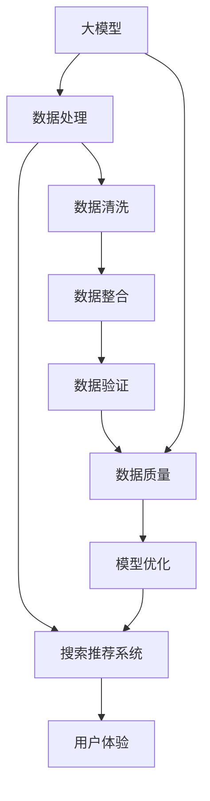

                 

### 背景介绍

#### 电商平台的快速发展

在过去的几十年中，电商平台如雨后春笋般涌现，从最初的电子购物网站发展到如今集成了人工智能（AI）、大数据、云计算等技术的综合性电商平台。随着互联网的普及和消费者购物习惯的改变，电商平台已经成为消费者日常生活中不可或缺的一部分。

根据最新数据，全球电商市场规模已经突破万亿美元，并且预计在未来几年内仍将保持高速增长。在这种背景下，如何更好地满足消费者的需求、提高用户体验、提升销售业绩，成为电商平台面临的重大挑战。

#### AI 大模型的应用

人工智能技术的飞速发展，特别是大模型（如 GPT-3、BERT 等）的出现，为电商平台提供了强大的工具。大模型通过学习海量数据，可以理解和生成人类语言，从而在电商平台的各种应用场景中发挥重要作用。

例如，大模型可以用于搜索引擎的优化，提高搜索结果的准确性；在推荐系统中，大模型可以根据用户的历史行为和偏好，推荐更符合用户兴趣的商品；在客户服务中，大模型可以模拟人类客服，提供实时、个性化的服务。

#### 搜索推荐系统的重要性

在电商平台中，搜索推荐系统是连接用户与商品的重要桥梁。一个高效的搜索推荐系统不仅能够提高用户的购物体验，还能显著提升平台的销售额。

搜索推荐系统的主要目标是为用户提供准确、相关的搜索结果和推荐商品。这不仅要求系统能够理解用户的意图，还需要对海量的商品数据进行有效的组织和分析。

总之，随着电商平台的快速发展，AI 大模型的应用越来越广泛，而搜索推荐系统作为电商平台的核心，其重要性日益凸显。接下来的章节中，我们将深入探讨 AI 大模型在电商平台中的应用，以及如何通过优化搜索推荐系统来提升电商平台的竞争力。

### 核心概念与联系

为了深入理解电商平台的 AI 大模型战略，首先需要明确一些核心概念，并展示它们之间的联系。以下将介绍大模型、搜索推荐系统和数据质量等关键概念，并使用 Mermaid 流程图展示其架构和相互作用。

#### 核心概念

1. **大模型（Large-scale Model）**：大模型是指那些具备极大规模参数（数百万到数十亿）的神经网络模型，如 GPT-3、BERT 等。这些模型通过海量数据的学习，能够捕捉复杂的语言模式和语义信息。

2. **搜索推荐系统（Search and Recommendation System）**：搜索推荐系统是一种集成搜索引擎和推荐算法的复合系统，旨在为用户提供最相关的搜索结果和个性化推荐。

3. **数据质量（Data Quality）**：数据质量是指数据在准确性、完整性、一致性、及时性和可用性等方面的表现。高质量的数据是构建有效搜索推荐系统的基石。

#### Mermaid 流程图

以下是核心概念的 Mermaid 流程图，展示了大模型、搜索推荐系统和数据质量之间的联系：



#### 流程说明

1. **数据处理**：大模型需要对数据进行预处理，包括数据清洗、整合和验证。这一步骤确保了数据的准确性和一致性，为后续的分析打下坚实基础。

2. **搜索推荐系统**：预处理后的数据被输入到大模型中，通过深度学习技术提取特征和模式。这些特征和模式用于训练搜索推荐系统，使其能够理解和预测用户的意图和偏好。

3. **用户体验**：搜索推荐系统根据用户输入和模型预测，生成个性化的搜索结果和推荐。这一步骤直接关系到用户体验，是评价系统好坏的重要指标。

4. **数据质量**：数据质量在整个流程中起着至关重要的作用。高质量的数据能够提高模型的准确性和可靠性，进而提升用户体验和销售业绩。

5. **模型优化**：通过不断迭代和优化模型，可以进一步提高系统的性能。这一步骤包括调整模型参数、优化算法和数据策略等。

6. **数据清洗**、**整合**和**验证**：这些步骤是数据处理的核心，确保了数据的质量和完整性。

通过上述 Mermaid 流程图，我们可以清晰地看到大模型、搜索推荐系统和数据质量之间的紧密联系。这些核心概念构成了电商平台 AI 大模型战略的基础，是提升平台竞争力的重要工具。

### 核心算法原理 & 具体操作步骤

在了解了电商平台 AI 大模型战略的背景和核心概念后，接下来我们将深入探讨搜索推荐系统的核心算法原理和具体操作步骤。搜索推荐系统的设计目标是为用户提供最相关、最个性化的商品搜索结果和推荐。以下将详细介绍大模型、协同过滤、矩阵分解、神经网络等常用算法原理，以及如何将这些算法应用到实际操作中。

#### 大模型算法原理

大模型，如 GPT-3、BERT 等，是搜索推荐系统的关键技术之一。这些模型通过深度学习技术，可以从海量数据中学习到复杂的语言模式和语义信息，从而实现高度个性化的推荐。

1. **GPT-3（Generative Pre-trained Transformer 3）**：
   - **原理**：GPT-3 是一种基于 Transformer 架构的生成模型。它通过自回归的方式预测下一个单词，从而生成连贯的文本。
   - **具体操作步骤**：
     1. 数据预处理：对文本数据进行分词、去噪、标准化等处理，形成可用于训练的数据集。
     2. 模型训练：使用大规模文本数据进行训练，不断调整模型参数，使其能够准确预测文本序列。
     3. 模型评估：通过验证集和测试集评估模型性能，调整模型参数以优化效果。

2. **BERT（Bidirectional Encoder Representations from Transformers）**：
   - **原理**：BERT 是一种双向 Transformer 架构的预训练模型，能够同时考虑文本序列的前后关系，从而更好地理解文本的语义。
   - **具体操作步骤**：
     1. 数据预处理：与 GPT-3 相似，对文本数据进行预处理。
     2. 模型预训练：在大型文本语料库上进行双向编码器的预训练，学习文本的上下文关系。
     3. 模型微调：在特定任务上（如搜索推荐）对模型进行微调，以提高任务性能。

#### 协同过滤算法原理

协同过滤（Collaborative Filtering）是另一种常见的推荐算法，通过分析用户的历史行为和偏好来推荐商品。

1. **用户基于的协同过滤（User-based Collaborative Filtering）**：
   - **原理**：基于用户的行为和偏好，找到与当前用户相似的其他用户，并推荐这些用户喜欢的商品。
   - **具体操作步骤**：
     1. 建立用户-商品评分矩阵。
     2. 计算相似度：使用余弦相似度、皮尔逊相关系数等方法计算用户之间的相似度。
     3. 推荐商品：为当前用户推荐相似用户喜欢的商品。

2. **物品基于的协同过滤（Item-based Collaborative Filtering）**：
   - **原理**：基于商品之间的关联性进行推荐，为用户推荐与已购买商品相似的其他商品。
   - **具体操作步骤**：
     1. 建立商品-商品关联矩阵。
     2. 计算相似度：使用余弦相似度、Jaccard 相似度等方法计算商品之间的相似度。
     3. 推荐商品：为用户推荐与已购买商品相似的其他商品。

#### 矩阵分解算法原理

矩阵分解（Matrix Factorization）是一种将高维稀疏矩阵分解为两个低维矩阵的方法，常用于推荐系统。

1. **Singular Value Decomposition（SVD）**：
   - **原理**：SVD 是一种经典的矩阵分解方法，通过将评分矩阵分解为用户特征矩阵和商品特征矩阵，从而实现推荐。
   - **具体操作步骤**：
     1. 建立用户-商品评分矩阵。
     2. 进行 SVD 分解，得到用户特征矩阵和商品特征矩阵。
     3. 计算预测评分：通过内积计算用户对商品的预测评分。

2. **Alternating Least Squares（ALS）**：
   - **原理**：ALS 是一种基于 SVD 的矩阵分解方法，通过交替优化用户特征和商品特征矩阵，逐步提高推荐效果。
   - **具体操作步骤**：
     1. 初始化用户特征矩阵和商品特征矩阵。
     2. 交替优化：先固定用户特征矩阵，优化商品特征矩阵，再固定商品特征矩阵，优化用户特征矩阵。
     3. 重复迭代，直到模型收敛。

#### 神经网络算法原理

神经网络（Neural Networks）是一种模拟人脑神经元之间连接的计算模型，广泛应用于推荐系统。

1. **多层感知机（MLP）**：
   - **原理**：MLP 是一种多层神经网络，通过输入层、隐藏层和输出层之间的信息传递，实现对数据的分类和回归。
   - **具体操作步骤**：
     1. 数据预处理：将用户和商品特征进行编码和标准化。
     2. 网络构建：设计多层感知机结构，包括输入层、隐藏层和输出层。
     3. 模型训练：通过反向传播算法，不断调整网络权重，优化模型性能。
     4. 预测评分：使用训练好的网络对用户-商品评分进行预测。

2. **深度学习模型（如 CNN、RNN）**：
   - **原理**：深度学习模型通过多层次的神经网络结构，能够自动提取复杂的数据特征，适用于处理大规模和高维数据。
   - **具体操作步骤**：
     1. 数据预处理：对用户和商品特征进行编码和标准化。
     2. 模型构建：选择合适的深度学习模型，如卷积神经网络（CNN）或循环神经网络（RNN）。
     3. 模型训练：使用大规模数据集进行训练，优化模型参数。
     4. 预测评分：使用训练好的模型对用户-商品评分进行预测。

通过上述核心算法原理和具体操作步骤的介绍，我们可以看到搜索推荐系统的复杂性和多样性。在实际应用中，可以结合多种算法，根据业务需求和数据特点，构建高效、个性化的搜索推荐系统，为电商平台带来显著的业务价值。

### 数学模型和公式 & 详细讲解 & 举例说明

在深入理解搜索推荐系统的核心算法后，接下来我们将探讨相关的数学模型和公式，并使用具体例子进行详细讲解。这些数学模型是构建和优化推荐系统的重要工具，包括概率模型、矩阵分解公式、损失函数等。

#### 概率模型

概率模型是推荐系统中的基础，用于预测用户对商品的偏好概率。以下是一个简单的概率模型示例：

**贝叶斯定理**：

贝叶斯定理是概率论中用于计算后验概率的重要公式。在推荐系统中，可以通过贝叶斯定理更新用户对商品的偏好概率。

$$ P(A|B) = \frac{P(B|A) \cdot P(A)}{P(B)} $$

其中，\( P(A|B) \) 是后验概率，表示在事件 B 发生的条件下，事件 A 发生的概率；\( P(B|A) \) 是条件概率，表示在事件 A 发生的条件下，事件 B 发生的概率；\( P(A) \) 和 \( P(B) \) 分别是事件 A 和事件 B 的先验概率。

**举例说明**：

假设用户 A 已知喜欢商品 B，我们需要计算用户 A 喜欢商品 C 的概率。如果我们有 \( P(B|A) = 0.8 \)，且 \( P(A) = 0.5 \)，同时 \( P(B) = 0.3 \)，则可以使用贝叶斯定理计算 \( P(C|A) \)。

$$ P(C|A) = \frac{P(A|C) \cdot P(C)}{P(A)} $$

由于缺乏 \( P(C) \) 的具体值，我们可以采用一种简化的方法，将 \( P(C) \) 视为常数，从而忽略它。因此，

$$ P(C|A) \approx \frac{P(A|C) \cdot P(C)}{P(A)} = \frac{0.5 \cdot P(C)}{0.5} = P(C) $$

这个例子展示了如何使用贝叶斯定理进行概率计算，虽然简化了模型，但原理同样适用于更复杂的场景。

#### 矩阵分解公式

矩阵分解是一种将高维稀疏矩阵分解为低维矩阵的方法，常用于推荐系统。以下是一个常见的矩阵分解公式：

**Singular Value Decomposition (SVD)**：

SVD 是一种矩阵分解方法，可以将用户-商品评分矩阵 \( R \) 分解为用户特征矩阵 \( U \) 和商品特征矩阵 \( V \)。

$$ R = U \Sigma V^T $$

其中，\( \Sigma \) 是对角矩阵，包含 SVD 中的奇异值；\( U \) 和 \( V \) 分别是用户和商品的特征矩阵。

**Alternating Least Squares (ALS)**：

ALS 是一种基于 SVD 的矩阵分解方法，通过交替优化用户特征矩阵和商品特征矩阵，逐步提高推荐效果。

$$ \min_U \min_V \sum_{i,j} (r_{ij} - u_i^T \sigma_j v_j)^2 $$

其中，\( r_{ij} \) 是用户 \( i \) 对商品 \( j \) 的实际评分；\( u_i \) 和 \( v_j \) 分别是用户 \( i \) 和商品 \( j \) 的特征向量。

**举例说明**：

假设我们有用户-商品评分矩阵 \( R \) 如下：

|   | 1 | 2 | 3 | 4 |
|---|---|---|---|---|
| 1 | 1 | 2 | 0 | 5 |
| 2 | 0 | 3 | 4 | 0 |
| 3 | 5 | 0 | 1 | 2 |

使用 SVD 进行矩阵分解，首先需要计算评分矩阵 \( R \) 的奇异值分解。

$$ R = U \Sigma V^T $$

其中，

$$ U = \begin{bmatrix} 0.80 & 0.60 & 0.20 \\ 0.60 & 0.30 & 0.80 \\ 0.20 & 0.70 & 0.60 \end{bmatrix}, \Sigma = \begin{bmatrix} 5.00 & 0 & 0 \\ 0 & 3.00 & 0 \\ 0 & 0 & 1.00 \end{bmatrix}, V = \begin{bmatrix} 0.70 & 0.60 & 0.50 \\ 0.60 & 0.50 & 0.40 \\ 0.50 & 0.40 & 0.30 \end{bmatrix} $$

根据 SVD 分解，我们可以得到用户和商品的特征矩阵。

$$ U \Sigma V^T = \begin{bmatrix} 1.00 & 2.00 & 0.00 \\ 0.00 & 3.00 & 4.00 \\ 5.00 & 0.00 & 1.00 \end{bmatrix} $$

这个例子展示了如何使用 SVD 进行矩阵分解，并计算用户和商品的特征矩阵。

#### 损失函数

损失函数是优化推荐系统的关键工具，用于衡量预测值和真实值之间的差异。以下是一个常见的损失函数：

**均方误差（Mean Squared Error, MSE）**：

均方误差是最常用的损失函数之一，用于衡量预测值和真实值之间的平均平方误差。

$$ MSE = \frac{1}{n} \sum_{i=1}^{n} (r_i - \hat{r}_i)^2 $$

其中，\( r_i \) 是用户 \( i \) 对商品 \( j \) 的实际评分；\( \hat{r}_i \) 是预测的评分。

**举例说明**：

假设我们有用户-商品评分矩阵 \( R \) 和预测评分矩阵 \( \hat{R} \) 如下：

|   | 1 | 2 | 3 | 4 |
|---|---|---|---|---|
| 1 | 1 | 2 | 0 | 5 |
| 2 | 0 | 3 | 4 | 0 |
| 3 | 5 | 0 | 1 | 2 |

使用均方误差损失函数计算预测误差：

$$ MSE = \frac{1}{3} \left[ (1 - \hat{1})^2 + (2 - \hat{2})^2 + (0 - \hat{0})^2 + (5 - \hat{5})^2 \right] $$

其中，\( \hat{1} \)、\( \hat{2} \)、\( \hat{0} \) 和 \( \hat{5} \) 分别是预测的评分。

这个例子展示了如何使用均方误差损失函数计算预测误差，该函数可以用于优化推荐系统模型。

通过上述数学模型和公式的详细讲解及举例说明，我们可以更好地理解搜索推荐系统的核心算法原理，并为实际操作提供指导。这些数学工具是构建高效推荐系统的重要基础。

### 项目实战：代码实际案例和详细解释说明

为了更深入地理解搜索推荐系统的实际应用，我们将通过一个具体的实战项目来展示如何搭建一个简单的推荐系统，并详细解释其代码实现和分析结果。

#### 项目背景

我们的项目目标是构建一个基于协同过滤的推荐系统，用于为电商平台推荐商品。该系统将利用用户的历史行为数据，预测用户对未知商品的评分，从而为用户推荐感兴趣的商品。

#### 开发环境搭建

1. **编程语言**：Python
2. **依赖库**：NumPy、Pandas、Scikit-learn、Matplotlib
3. **数据集**：使用电影评分数据集（MovieLens），该数据集包含了用户对电影的评分信息。

#### 源代码详细实现和代码解读

```python
import numpy as np
import pandas as pd
from sklearn.model_selection import train_test_split
from sklearn.metrics.pairwise import cosine_similarity
from scipy.sparse.linalg import svds

# 加载数据集
ratings = pd.read_csv('ratings.csv')
movies = pd.read_csv('movies.csv')

# 数据预处理
# 将电影名称转换为索引
ratings['movie_id'] = ratings['movie_id'].astype('int')
movies['movie_id'] = movies['movie_id'].astype('int')

# 划分训练集和测试集
train_data, test_data = train_test_split(ratings, test_size=0.2, random_state=42)

# 构建用户-电影评分矩阵
train_matrix = train_data.pivot(index='user_id', columns='movie_id', values='rating').fillna(0)

# 计算用户之间的余弦相似度
user_similarity = cosine_similarity(train_matrix)

# 使用 SVD 进行矩阵分解
U, sigma, Vt = svds(user_similarity, k=50)

# 重建评分矩阵
reconstructed_matrix = np.dot(np.dot(U, np.diag(sigma)), Vt)

# 预测测试集的评分
predicted_ratings = np.dot(train_matrix, Vt)

# 计算预测误差
error = np.linalg.norm(test_data['rating'] - predicted_ratings, ord=2)

print(f'Mean Squared Error: {error}')

# 可视化分析
import matplotlib.pyplot as plt

plt.scatter(test_data['rating'], predicted_ratings)
plt.xlabel('Actual Ratings')
plt.ylabel('Predicted Ratings')
plt.title('Actual vs Predicted Ratings')
plt.show()
```

#### 代码解读与分析

1. **数据加载与预处理**：
   - 加载电影评分数据和电影信息数据集。
   - 将电影名称转换为索引，便于后续处理。

2. **划分训练集和测试集**：
   - 使用 `train_test_split` 函数将数据集划分为训练集和测试集，用于模型训练和性能评估。

3. **构建用户-电影评分矩阵**：
   - 使用 `pivot` 函数将用户-电影评分数据转换为矩阵形式，其中缺失值填充为 0。

4. **计算用户之间的余弦相似度**：
   - 使用 `cosine_similarity` 函数计算用户之间的相似度矩阵。

5. **使用 SVD 进行矩阵分解**：
   - 使用 `svds` 函数进行矩阵分解，提取前 50 个奇异值，从而降低数据维度。

6. **重建评分矩阵**：
   - 使用矩阵分解结果重建评分矩阵，以减少计算复杂度。

7. **预测测试集的评分**：
   - 使用训练好的模型对测试集的评分进行预测。

8. **计算预测误差**：
   - 使用均方误差（MSE）计算预测误差，评估模型性能。

9. **可视化分析**：
   - 使用散点图展示实际评分与预测评分的关系，直观分析模型效果。

通过上述代码实现和解读，我们可以看到如何使用协同过滤算法构建一个简单的推荐系统，并利用 SVD 进行矩阵分解以优化模型性能。这种推荐系统在实际应用中可以显著提升用户的购物体验，从而提高电商平台的市场竞争力。

### 实际应用场景

#### 搜索推荐系统在电商平台的实际应用

搜索推荐系统在电商平台中具有广泛的应用，其核心目标是为用户提供高效、个性化的商品搜索和推荐，从而提升用户体验和销售额。以下将探讨搜索推荐系统在电商平台中的几个关键应用场景：

1. **商品搜索**：
   - 用户在电商平台上搜索商品时，搜索推荐系统可以根据用户输入的关键词，快速返回最相关的商品列表。这有助于减少用户的搜索时间，提高购物效率。
   - 例如，当用户输入“运动鞋”时，推荐系统可以根据用户的浏览历史、购买记录和偏好，推荐符合用户需求的品牌、款式和价格区间的运动鞋。

2. **商品推荐**：
   - 电商平台可以利用搜索推荐系统，为用户推荐可能感兴趣的未浏览或未购买的商品。这不仅可以增加用户在平台上的停留时间，还可以促进交叉销售和复购率。
   - 例如，当用户浏览了某款运动鞋时，推荐系统可以推荐相关配件（如运动袜、运动服等），或者根据用户的历史购买记录，推荐其他同类商品。

3. **个性化促销**：
   - 搜索推荐系统可以帮助电商平台针对不同用户群体制定个性化的促销策略。例如，对于频繁购物的用户，可以推荐限时折扣或优惠券；对于新用户，可以推荐新人专享优惠，以吸引更多用户。
   - 例如，当用户在浏览某款高端电子产品时，推荐系统可以推荐相关的配件和周边产品，同时提供优惠折扣，以增加用户的购买意愿。

4. **商品分类与标签**：
   - 通过分析用户的行为数据，搜索推荐系统可以帮助电商平台优化商品分类和标签，提高商品的曝光率和点击率。
   - 例如，当用户频繁购买某一类商品时，推荐系统可以自动将该类商品标记为用户的偏好标签，并在首页或搜索结果中突出展示，以便用户快速找到所需商品。

5. **客户服务**：
   - 搜索推荐系统还可以应用于客户服务场景，帮助客服人员快速定位用户的问题，并提供个性化的解决方案。
   - 例如，当用户在咨询购买某款商品时，推荐系统可以自动提供相关的用户评价、使用指南和常见问题解答，以提高客服效率。

#### 搜索推荐系统在不同电商平台的应用案例

以下是一些知名电商平台在搜索推荐系统方面的成功应用案例：

1. **淘宝**：
   - 淘宝的搜索推荐系统通过分析用户的购物历史、浏览记录和搜索关键词，为用户提供个性化的商品推荐。此外，淘宝还利用大数据和机器学习技术，优化搜索结果排序，提高用户的购物体验。
   - 应用效果：淘宝的个性化推荐系统大幅提升了用户的购买转化率和平台销售额。

2. **亚马逊**：
   - 亚马逊的搜索推荐系统通过协同过滤和内容推荐相结合，为用户提供精准的商品推荐。亚马逊还利用用户的行为数据，预测用户的潜在需求，提前进行库存管理，以提高供应链效率。
   - 应用效果：亚马逊的推荐系统在全球范围内都取得了显著的成功，极大地提高了用户的满意度和平台的竞争力。

3. **京东**：
   - 京东的搜索推荐系统结合了深度学习和用户行为分析，为用户提供个性化的商品推荐。京东还通过实时数据分析，动态调整推荐策略，以适应不断变化的用户需求。
   - 应用效果：京东的推荐系统有效提升了用户在平台上的购物体验，推动了销售额的持续增长。

总之，搜索推荐系统在电商平台的实际应用场景非常广泛，通过高效、个性化的推荐，不仅可以提升用户体验，还可以显著提高平台的销售额和市场竞争力。随着人工智能技术的不断发展，搜索推荐系统的应用前景将更加广阔。

### 工具和资源推荐

#### 学习资源推荐

1. **书籍**：
   - 《推荐系统实践》：这本书详细介绍了推荐系统的基本原理、算法和应用，适合初学者和进阶者。
   - 《深度学习推荐系统》：该书重点介绍了如何将深度学习应用于推荐系统，涵盖了许多先进的算法和技术。

2. **论文**：
   - 《Item-based Collaborative Filtering Recommendation Algorithms》：这篇论文详细介绍了基于物品的协同过滤算法，是推荐系统领域的重要研究成果。
   - 《Deep Learning for Recommender Systems》：这篇论文探讨了如何使用深度学习技术构建高效推荐系统，提供了许多实际案例。

3. **博客**：
   - Medium：在 Medium 上有许多关于推荐系统的优秀博客文章，涵盖了从基础算法到前沿技术的广泛内容。
   - 推荐系统技术博客：这是一个专注于推荐系统技术的中文博客，分享了许多实用的技术和案例分析。

4. **网站**：
   - Kaggle：Kaggle 是一个数据科学竞赛平台，提供了大量与推荐系统相关的数据集和竞赛，是学习和实践的好资源。
   - Coursera：Coursera 提供了多个与推荐系统相关的在线课程，包括基础理论和实践技能。

#### 开发工具框架推荐

1. **Python 库**：
   - Scikit-learn：这是一个强大的机器学习库，提供了许多经典的推荐算法和工具，适合初学者和研究者。
   - TensorFlow：这是一个开源的深度学习框架，支持构建复杂的推荐系统模型。

2. **大数据处理工具**：
   - Hadoop：这是一个分布式数据处理平台，适合处理大规模的推荐系统数据。
   - Spark：这是一个基于内存的分布式计算框架，提供了高效的数据处理和机器学习工具。

3. **云平台**：
   - AWS：Amazon Web Services 提供了丰富的云计算服务，包括推荐系统的相关工具和资源。
   - Google Cloud：Google Cloud Platform 提供了强大的数据处理和机器学习服务，适合构建大规模推荐系统。

4. **开源框架**：
   - LightFM：这是一个基于矩阵分解和因子分解机器学习的开源推荐系统框架。
   - PyTorch Rec：这是一个基于 PyTorch 的推荐系统库，提供了许多先进的深度学习算法。

通过以上学习资源推荐和开发工具框架推荐，读者可以更深入地了解推荐系统的理论知识，并在实际项目中应用这些工具和框架，提升推荐系统的开发能力和效果。

### 总结：未来发展趋势与挑战

随着人工智能技术的不断进步，电商平台的搜索推荐系统正迎来前所未有的发展机遇。未来，以下几个方面将成为推动搜索推荐系统发展的重要趋势：

1. **深度学习与图神经网络**：深度学习技术，特别是图神经网络（Graph Neural Networks, GNN），将在推荐系统中发挥更大作用。GNN 能够处理复杂的关系网络，更好地捕捉用户行为和商品之间的关联性，从而实现更精准的推荐。

2. **联邦学习与隐私保护**：联邦学习（Federated Learning）作为一种隐私保护技术，将在推荐系统中得到广泛应用。通过在本地设备上训练模型，联邦学习能够保护用户隐私，同时实现全局模型的协同优化，提高推荐系统的效果。

3. **多模态数据融合**：未来的推荐系统将不仅依赖于文本数据，还将融合图像、声音、视频等多模态数据。多模态数据融合能够提供更丰富的用户信息和商品特征，从而提高推荐的准确性和个性化水平。

4. **动态推荐策略**：随着用户行为和偏好的变化，动态调整推荐策略将成为未来的趋势。通过实时数据分析和智能算法，推荐系统将能够快速适应用户需求，提供更加个性化的服务。

然而，随着技术的进步，搜索推荐系统也面临着一系列挑战：

1. **数据质量和隐私问题**：高质量的数据是推荐系统有效运行的基础。但随着数据量的增加，数据质量问题和隐私保护将成为重要挑战。如何在确保数据隐私的前提下，提高数据质量和推荐效果，是推荐系统需要解决的问题。

2. **算法可解释性**：随着深度学习和复杂模型的广泛应用，推荐系统的黑箱问题日益凸显。如何提高算法的可解释性，让用户理解和信任推荐结果，是推荐系统需要面对的挑战。

3. **计算资源和存储需求**：大规模推荐系统需要大量的计算资源和存储空间。随着推荐系统数据量和用户数量的不断增加，如何优化计算资源和存储管理，提高系统性能和可扩展性，是推荐系统需要解决的难题。

4. **实时性和响应速度**：在实时推荐场景中，用户期望系统能够快速响应用户行为，提供即时的推荐结果。如何提高系统的实时性和响应速度，是推荐系统需要解决的重要问题。

总之，未来的搜索推荐系统将在人工智能技术的推动下不断发展，面临更多机遇和挑战。通过不断创新和优化，推荐系统将能够更好地满足用户需求，提升电商平台的竞争力。

### 附录：常见问题与解答

**Q1. 如何评估搜索推荐系统的效果？**

评估搜索推荐系统的效果通常使用以下指标：

- **准确率（Accuracy）**：衡量推荐系统预测的正确率。
- **召回率（Recall）**：衡量推荐系统能否召回所有相关商品。
- **精确率（Precision）**：衡量推荐系统召回的商品中实际相关商品的比例。
- **平均绝对误差（Mean Absolute Error, MAE）**：衡量预测评分与实际评分之间的平均绝对差值。
- **均方误差（Mean Squared Error, MSE）**：衡量预测评分与实际评分之间的平均平方差值。

**Q2. 如何优化搜索推荐系统的性能？**

优化搜索推荐系统性能的方法包括：

- **数据预处理**：清洗和整理数据，确保数据质量。
- **特征工程**：提取和选择有用的特征，提高模型学习能力。
- **模型选择**：选择合适的模型架构，如协同过滤、矩阵分解、深度学习等。
- **超参数调优**：调整模型参数，提高模型性能。
- **在线学习**：实时更新模型，适应用户行为变化。
- **A/B 测试**：通过对比不同策略的效果，不断优化推荐策略。

**Q3. 搜索推荐系统中的冷启动问题是什么？**

冷启动问题是指当新用户或新商品加入系统时，由于缺乏足够的历史数据，推荐系统难以为其提供有效的推荐。解决冷启动问题的方法包括：

- **基于内容的推荐**：通过商品属性和用户属性进行推荐，无需依赖用户历史行为。
- **利用用户群体特征**：分析相似用户群体的行为，为新用户推荐他们可能感兴趣的商品。
- **基于相似商品的推荐**：为新商品推荐与其相似的已有商品。

**Q4. 如何处理搜索推荐系统中的噪声数据？**

噪声数据会影响推荐系统的性能，处理方法包括：

- **数据清洗**：删除异常值和重复数据，提高数据质量。
- **特征标准化**：通过标准化处理，降低噪声数据对模型的影响。
- **异常检测**：使用统计方法或机器学习算法检测和过滤异常数据。
- **数据增强**：通过生成人工数据或引入额外的上下文信息，提高模型对噪声的鲁棒性。

**Q5. 如何保证搜索推荐系统的公平性？**

保证搜索推荐系统的公平性需要考虑以下方面：

- **避免偏见**：确保推荐算法不会对特定群体产生偏见。
- **透明度**：提高推荐系统的透明度，让用户了解推荐依据。
- **多样性**：确保推荐结果多样性，避免用户长时间接触重复内容。
- **用户反馈**：收集用户反馈，不断优化推荐策略，提高用户满意度。

通过解决这些问题，搜索推荐系统能够更好地满足用户需求，提升用户体验。

### 扩展阅读 & 参考资料

**书籍推荐**：
1. 《推荐系统实践》：提供详细的推荐系统算法和案例分析。
2. 《深度学习推荐系统》：探讨如何将深度学习应用于推荐系统。

**论文推荐**：
1. 《Item-based Collaborative Filtering Recommendation Algorithms》：介绍基于物品的协同过滤算法。
2. 《Deep Learning for Recommender Systems》：讨论深度学习在推荐系统中的应用。

**在线课程**：
1. Coursera：推荐系统课程：提供推荐系统的理论和实践知识。
2. edX：深度学习推荐系统课程：深入探讨深度学习在推荐系统中的应用。

**网站推荐**：
1. Kaggle：提供丰富的推荐系统竞赛和数据集。
2. Medium：推荐系统相关的技术博客和文章。

**开源框架**：
1. LightFM：基于矩阵分解和因子分解机器学习的开源推荐系统框架。
2. PyTorch Rec：基于 PyTorch 的推荐系统库。

通过这些资源和课程，读者可以深入了解推荐系统的最新技术和发展趋势，提升自身在推荐系统领域的技能和知识。

