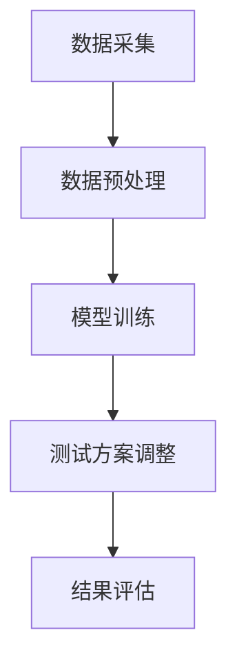

                 

### 1. 背景介绍

在当今快速发展的电子商务时代，用户体验（UX）在决定一个平台的成功与否中起着至关重要的作用。随着市场竞争的加剧，电商平台需要不断优化用户体验，以吸引并留住用户。A/B测试作为一种科学的方法，已成为电商平台优化用户体验的重要工具。

A/B测试，又称拆分测试，是一种通过将用户群体分成两组，分别展示不同的设计方案，然后比较两组用户的反应和转化率，以确定哪个设计更有效的实验方法。这种方法在电商平台的页面设计、功能优化、广告投放等方面都有广泛应用。

然而，传统的A/B测试存在一些问题，如测试周期长、用户群体划分不准确等，这限制了其在实际应用中的效果。为了解决这些问题，人工智能（AI）技术被引入到A/B测试中，形成了一种新的实验设计方法——AI驱动A/B测试。

AI驱动A/B测试利用机器学习算法和大数据分析，实时分析用户行为数据，动态调整测试方案，提高测试的效率和准确性。这种方法不仅能够缩短测试周期，还能更精确地找到优化点，从而提升用户体验。

本文将详细介绍AI驱动A/B测试的核心概念、算法原理、数学模型、实际应用案例，并探讨其在电商平台的未来发展趋势与挑战。

# 电商平台的AI驱动A/B测试：优化用户体验的自动化实验设计

> 关键词：电商平台，人工智能，A/B测试，用户体验，实验设计，机器学习，优化

摘要：本文探讨了电商平台如何利用人工智能技术进行A/B测试，以提高用户体验和业务转化率。通过介绍AI驱动A/B测试的核心概念、算法原理、数学模型和实际应用案例，本文展示了如何通过自动化实验设计来优化电商平台的用户体验。

## 1. 背景介绍

在电商平台的运营中，用户体验（UX）是至关重要的。一个优秀的用户体验能够提高用户满意度、增加用户粘性，并最终提升平台的业务收益。然而，随着市场的不断变化和用户需求的多样化，如何设计出满足用户需求的界面和功能成为了一个挑战。

### A/B测试的应用

A/B测试是一种通过对比两组用户对不同设计方案的反应和转化率，来判断哪种设计更有效的实验方法。在电商平台，A/B测试广泛应用于以下场景：

1. **页面设计优化**：通过对比不同页面布局、颜色、按钮样式等，找出用户更喜欢的界面设计。
2. **功能优化**：对比不同的功能模块，如购物车设计、搜索结果排序、推荐算法等，以提升用户操作便捷性和满意度。
3. **广告投放策略**：通过比较不同广告的投放效果，找出最有效的广告内容和投放渠道。

### 传统A/B测试的局限

尽管A/B测试在电商平台的应用广泛，但传统的A/B测试方法仍存在一些局限：

1. **测试周期长**：传统A/B测试通常需要较长时间才能得出结论，这可能导致测试结果无法及时应用到实际运营中。
2. **用户群体划分不准确**：传统A/B测试通常采用随机划分用户群体的方法，这可能导致用户群体划分不均匀，影响测试结果的准确性。
3. **人工干预多**：传统A/B测试需要人工设计和执行测试方案，这增加了测试的复杂度和成本。

## 2. 核心概念与联系

### AI驱动A/B测试的定义

AI驱动A/B测试是一种利用人工智能技术进行自动化实验设计的方法。它通过机器学习算法和大数据分析，实时分析用户行为数据，动态调整测试方案，以提高测试的效率和准确性。

### AI驱动A/B测试与用户体验优化的关系

用户体验优化是一个复杂的过程，涉及到多个方面的改进。AI驱动A/B测试通过以下几个步骤，实现了对用户体验的全面优化：

1. **数据采集**：通过用户行为分析工具，实时收集用户的浏览、点击、购买等行为数据。
2. **数据预处理**：对采集到的数据进行清洗、去重和特征提取，为机器学习算法提供高质量的数据输入。
3. **模型训练**：利用机器学习算法，对预处理后的数据进行分析和建模，预测用户对不同设计的反应和转化率。
4. **测试方案调整**：根据模型预测结果，动态调整测试方案，优化实验设计。
5. **结果评估**：通过对比测试结果，评估不同设计的有效性，指导实际运营中的设计和策略调整。

### Mermaid 流程图

下面是一个简化的Mermaid流程图，展示了AI驱动A/B测试的核心步骤和数据处理流程。



### A/B测试与AI驱动A/B测试的比较

传统A/B测试与AI驱动A/B测试在以下几个方面存在明显差异：

1. **测试周期**：传统A/B测试通常需要较长时间才能得出结论，而AI驱动A/B测试能够实现实时调整和优化，大大缩短了测试周期。
2. **用户群体划分**：传统A/B测试通常采用随机划分用户群体的方法，而AI驱动A/B测试能够根据用户行为数据进行智能划分，提高测试的准确性。
3. **人工干预**：传统A/B测试需要人工设计和执行测试方案，而AI驱动A/B测试通过自动化实现，降低了测试的复杂度和成本。

通过以上比较，可以看出AI驱动A/B测试在提高测试效率和准确性方面具有显著优势，为电商平台优化用户体验提供了强大的技术支持。

#### 2.1 AI驱动A/B测试的核心概念原理

A/B测试作为一种经典的实验设计方法，其核心思想是通过将用户随机分配到两个或多个不同的测试组，比较不同组之间的效果差异，从而确定哪种设计方案更优。然而，传统的A/B测试在用户群体划分、测试周期和人工干预等方面存在一定的局限性，无法满足电商平台对快速、精准优化用户体验的需求。因此，AI驱动A/B测试应运而生，它通过引入人工智能技术，实现了自动化、智能化的实验设计。

##### 2.1.1 人工智能在A/B测试中的应用

人工智能（AI）技术在A/B测试中的应用主要体现在以下几个方面：

1. **用户行为分析**：通过机器学习算法，实时分析用户的浏览、点击、购买等行为数据，识别用户偏好和行为模式。
2. **数据挖掘与特征提取**：对大量用户行为数据进行挖掘，提取与用户体验相关的关键特征，为模型训练提供高质量的数据输入。
3. **模型训练与预测**：利用机器学习算法，对提取的特征进行训练，构建用户行为预测模型，预测用户对不同设计的反应和转化率。
4. **动态测试方案调整**：根据模型预测结果，动态调整测试方案，优化实验设计，提高测试的效率和准确性。
5. **结果评估与反馈**：通过对比测试结果，评估不同设计的有效性，将评估结果反馈到模型训练和测试方案调整中，形成闭环优化。

##### 2.1.2 AI驱动A/B测试的工作流程

AI驱动A/B测试的工作流程主要包括以下几个步骤：

1. **数据采集**：通过用户行为分析工具，实时收集用户的浏览、点击、购买等行为数据。
2. **数据预处理**：对采集到的数据进行清洗、去重和特征提取，为机器学习算法提供高质量的数据输入。
3. **模型训练**：利用机器学习算法，对预处理后的数据进行分析和建模，预测用户对不同设计的反应和转化率。
4. **测试方案调整**：根据模型预测结果，动态调整测试方案，优化实验设计。
5. **结果评估**：通过对比测试结果，评估不同设计的有效性，指导实际运营中的设计和策略调整。

以下是一个简化的Mermaid流程图，展示了AI驱动A/B测试的工作流程。


##### 2.1.3 AI驱动A/B测试的优势与挑战

AI驱动A/B测试具有以下优势：

1. **提高测试效率**：通过自动化实验设计和动态调整，AI驱动A/B测试能够大大缩短测试周期，提高测试效率。
2. **提高测试准确性**：通过机器学习算法和大数据分析，AI驱动A/B测试能够更精确地识别用户偏好和行为模式，提高测试准确性。
3. **降低人工干预**：通过自动化实现，AI驱动A/B测试降低了测试的复杂度和成本，减少了人工干预。

然而，AI驱动A/B测试也面临一些挑战：

1. **数据质量和特征提取**：高质量的数据和准确的特征提取是模型训练和预测的基础，需要确保数据的质量和特征提取的准确性。
2. **模型选择和调优**：不同的机器学习算法适用于不同类型的数据和问题，需要根据具体场景选择合适的算法，并进行调优。
3. **解释性和可解释性**：机器学习模型通常具有较好的预测性能，但其内部机制复杂，缺乏解释性，这在一定程度上限制了其在实际应用中的普及。

综上所述，AI驱动A/B测试为电商平台优化用户体验提供了强大的技术支持，但同时也需要克服数据质量、模型选择和解释性等方面的挑战。

---

#### 2.2 AI驱动A/B测试的核心算法原理

AI驱动A/B测试的核心在于其能够利用机器学习算法对用户行为进行预测和优化。以下将详细解析AI驱动A/B测试中的核心算法原理，包括数据预处理、模型选择、训练和预测过程。

##### 2.2.1 数据预处理

在AI驱动A/B测试中，数据预处理是至关重要的步骤。它包括以下关键步骤：

1. **数据采集**：首先，需要通过用户行为分析工具，如Google Analytics、Mixpanel等，实时采集用户的浏览、点击、购买等行为数据。
2. **数据清洗**：数据清洗是为了去除噪声数据和缺失值，确保数据的质量。这通常包括以下操作：
    - **去重**：去除重复的用户数据，确保每个用户只被记录一次。
    - **缺失值填充**：对于缺失的数据，可以使用均值、中位数、回归插值等方法进行填充。
    - **异常值处理**：识别并处理异常值，防止它们对模型训练和预测产生负面影响。

3. **特征提取**：特征提取是从原始数据中提取出与用户行为相关的特征，以便为模型提供输入。常用的特征包括：
    - **用户属性**：如用户年龄、性别、地理位置、注册时间等。
    - **页面属性**：如页面类型、页面访问次数、页面停留时间等。
    - **交互属性**：如点击次数、转化率、跳出率等。
    - **时间序列特征**：如用户最近一次购买时间、浏览路径等。

4. **特征工程**：特征工程是对提取的特征进行进一步处理和转换，以提高模型的性能。常用的方法包括：
    - **特征标准化**：将特征值缩放到相同的尺度，避免某些特征对模型产生过大的影响。
    - **特征交叉**：将不同特征进行组合，生成新的特征，以提高模型的预测能力。

##### 2.2.2 模型选择

在AI驱动A/B测试中，选择合适的机器学习模型是关键。以下是一些常用的模型：

1. **线性回归**：线性回归是一种简单但有效的模型，适用于预测连续值。然而，它对于非线性问题可能表现不佳。
2. **逻辑回归**：逻辑回归适用于分类问题，通过将线性回归的输出转化为概率值，可以预测用户对某个设计的偏好。
3. **决策树**：决策树通过构建树形结构来划分数据，可以处理非线性问题，但其过拟合风险较高。
4. **随机森林**：随机森林是一种基于决策树的集成学习方法，通过组合多个决策树来提高模型的预测性能和鲁棒性。
5. **支持向量机（SVM）**：SVM通过找到一个最佳的超平面，将不同类别的数据分隔开来，适用于分类问题。
6. **神经网络**：神经网络是一种强大的深度学习模型，通过多层非线性变换来提取特征，可以处理复杂的非线性问题。

##### 2.2.3 训练和预测过程

1. **训练过程**：在训练过程中，模型通过迭代优化参数，学习到数据中的模式和规律。具体步骤如下：
    - **数据划分**：将数据集划分为训练集和验证集，用于训练和评估模型。
    - **参数优化**：通过梯度下降或其他优化算法，调整模型的参数，使其在训练集上达到最优。
    - **模型评估**：使用验证集评估模型的性能，调整模型参数或选择更好的模型。

2. **预测过程**：在预测过程中，模型使用已训练好的参数，对新的用户数据进行预测。具体步骤如下：
    - **特征提取**：对新的用户数据提取特征，与训练时相同的特征向量。
    - **模型输出**：将特征向量输入到训练好的模型中，得到预测结果。
    - **结果解释**：根据预测结果，对用户行为进行解释和优化。

##### 2.2.4 模型评估与优化

在AI驱动A/B测试中，模型评估和优化是关键步骤。以下是一些常用的评估指标和方法：

1. **评估指标**：
    - **准确率**：预测结果与实际结果相符的比例。
    - **精确率**：预测为正例的样本中，实际为正例的比例。
    - **召回率**：实际为正例的样本中，被预测为正例的比例。
    - **F1分数**：精确率和召回率的调和平均值。

2. **模型优化**：
    - **超参数调优**：通过交叉验证等方法，调整模型超参数，以优化模型性能。
    - **集成学习方法**：通过组合多个模型，提高模型的预测性能和鲁棒性。
    - **特征选择**：通过特征选择方法，筛选出对模型性能有显著贡献的特征，提高模型效率。

通过以上算法原理和步骤，AI驱动A/B测试能够实现对用户行为的准确预测和优化，从而提升电商平台的用户体验和业务转化率。

---

### 3. 核心算法原理 & 具体操作步骤

#### 3.1 算法原理

AI驱动A/B测试的核心算法原理基于机器学习和统计模型，主要分为以下几个步骤：

1. **数据采集与预处理**：收集用户行为数据，包括点击率、转化率、页面停留时间等，对数据进行清洗、去重和特征提取。
2. **模型训练**：利用机器学习算法，对预处理后的数据进行训练，构建用户行为预测模型。
3. **实验设计与调整**：基于训练好的模型，设计A/B测试实验，并根据实验结果动态调整测试方案。
4. **结果评估**：对实验结果进行统计分析，评估不同设计方案的优劣，并优化用户体验。

#### 3.2 操作步骤

以下是一个简化的AI驱动A/B测试的操作步骤：

1. **数据采集与预处理**
   - 安装并配置用户行为分析工具，如Google Analytics、Mixpanel等。
   - 收集用户在电商平台上的行为数据，包括点击率、转化率、页面停留时间等。
   - 对采集到的数据进行清洗，去除噪声数据和缺失值。

2. **特征提取**
   - 提取与用户行为相关的特征，如用户属性（年龄、性别、地理位置）、页面属性（页面类型、页面访问次数）、交互属性（点击次数、转化率、跳出率）等。
   - 进行特征工程，如特征标准化、特征交叉等，提高模型的性能。

3. **模型训练**
   - 选择合适的机器学习算法，如逻辑回归、随机森林、神经网络等。
   - 将预处理后的数据划分为训练集和验证集，用于训练和评估模型。
   - 使用训练集训练模型，并使用验证集评估模型性能，调整模型参数。

4. **实验设计与调整**
   - 设计A/B测试实验，将用户随机分配到对照组和实验组，展示不同的设计方案。
   - 根据模型预测结果，动态调整测试方案，优化实验设计。
   - 实时监控实验进度和结果，确保测试的准确性和效率。

5. **结果评估**
   - 对实验结果进行统计分析，评估不同设计方案的优劣。
   - 根据评估结果，优化电商平台的用户体验和业务策略。

### 3.3 实际案例

以下是一个实际案例，展示了如何使用AI驱动A/B测试优化电商平台的购物车设计。

**案例背景**：一个电商平台希望通过优化购物车设计来提高用户转化率。现有购物车设计包括添加商品、修改数量、删除商品等基本功能。为了找到最优设计，平台决定使用AI驱动A/B测试。

**操作步骤**：

1. **数据采集与预处理**
   - 收集用户在购物车页面上的行为数据，如点击次数、操作成功率、页面停留时间等。
   - 对数据进行清洗，去除噪声数据和缺失值。

2. **特征提取**
   - 提取与用户行为相关的特征，如用户属性（年龄、性别、地理位置）、页面属性（页面类型、页面访问次数）、交互属性（点击次数、转化率、跳出率）等。
   - 进行特征工程，如特征标准化、特征交叉等。

3. **模型训练**
   - 选择逻辑回归模型，用于预测用户在购物车页面的操作成功率。
   - 将预处理后的数据划分为训练集和验证集，训练模型并评估性能。

4. **实验设计与调整**
   - 设计A/B测试实验，将用户随机分配到对照组和实验组。
   - 实验组展示新的购物车设计，包括添加商品、修改数量、删除商品等操作简化，对照组展示现有购物车设计。
   - 根据模型预测结果，动态调整实验组的设计，优化用户体验。

5. **结果评估**
   - 对实验结果进行统计分析，评估不同设计方案的优劣。
   - 根据评估结果，优化购物车设计，提高用户转化率。

通过以上步骤，电商平台能够利用AI驱动A/B测试找到最优的购物车设计，从而提升用户体验和业务转化率。

---

#### 4. 数学模型和公式 & 详细讲解 & 举例说明

在AI驱动A/B测试中，数学模型和公式起着核心作用，用于分析用户行为、预测结果和评估设计效果。以下将详细讲解常用的数学模型和公式，并通过实际案例进行说明。

##### 4.1 用户行为预测模型

在AI驱动A/B测试中，用户行为预测模型是关键步骤。常用的预测模型包括逻辑回归、决策树、随机森林和神经网络等。以下以逻辑回归为例进行讲解。

**逻辑回归模型公式**：

$$
P(y=1|X) = \frac{1}{1 + e^{-(\beta_0 + \beta_1 x_1 + \beta_2 x_2 + \ldots + \beta_n x_n})}
$$

其中，$P(y=1|X)$表示在特征向量$X$下，用户发生某种行为的概率；$\beta_0$是截距；$\beta_1, \beta_2, \ldots, \beta_n$是各个特征的系数。

**参数估计**：

逻辑回归模型的参数可以通过最大似然估计（Maximum Likelihood Estimation，MLE）或梯度下降（Gradient Descent）等方法进行估计。以下是梯度下降方法的步骤：

1. **初始化参数**：设置初始参数$\beta_0, \beta_1, \beta_2, \ldots, \beta_n$。
2. **计算损失函数**：计算预测概率和实际标签之间的损失函数，如对数损失函数（Log Loss）。
3. **更新参数**：根据损失函数的梯度，更新参数$\beta_0, \beta_1, \beta_2, \ldots, \beta_n$。
4. **重复步骤2和3**：直到损失函数收敛或达到最大迭代次数。

**案例说明**：

假设我们使用逻辑回归模型预测用户在购物车页面上是否成功添加商品。特征包括用户年龄、购物车商品数量和页面停留时间。以下是一个简化的逻辑回归模型：

$$
P(y=1|X) = \frac{1}{1 + e^{-(\beta_0 + \beta_1 \cdot age + \beta_2 \cdot num_products + \beta_3 \cdot time_on_page})}
$$

我们通过梯度下降方法估计模型参数，初始化参数为$\beta_0 = 0, \beta_1 = 0, \beta_2 = 0, \beta_3 = 0$。经过多次迭代后，得到最优参数$\beta_0 = 1.2, \beta_1 = -0.1, \beta_2 = 0.3, \beta_3 = 0.2$。

##### 4.2 A/B测试结果评估

在A/B测试中，我们通常使用统计方法评估不同设计方案的优劣。以下介绍两种常用的评估方法：t检验和A/B测试指标。

**t检验**：

t检验是一种常用的统计方法，用于比较两组样本均值是否存在显著差异。以下为t检验的基本步骤：

1. **假设检验**：
   - 零假设$H_0$：两组样本均值无显著差异。
   - 备择假设$H_1$：两组样本均值存在显著差异。
2. **计算t统计量**：
   $$
   t = \frac{\bar{x}_1 - \bar{x}_2 - (\mu_1 - \mu_2)}{\sqrt{\frac{s_1^2}{n_1} + \frac{s_2^2}{n_2}}}
   $$
   其中，$\bar{x}_1, \bar{x}_2$分别为两组样本均值；$\mu_1, \mu_2$分别为两组样本总体均值；$s_1, s_2$分别为两组样本标准差；$n_1, n_2$分别为两组样本容量。
3. **确定临界值**：根据显著性水平（如0.05）和自由度（$n_1 + n_2 - 2$），查表得到临界值。
4. **比较t统计量和临界值**：如果$t >$ 临界值，则拒绝零假设，认为两组样本均值存在显著差异；否则，接受零假设。

**A/B测试指标**：

A/B测试指标用于衡量不同设计方案的效果。以下介绍几种常用的A/B测试指标：

1. **转化率**：转化率是指用户在完成特定操作（如购买、注册等）的比例。转化率越高，说明设计方案越成功。
2. **点击率**：点击率是指用户点击某个元素（如按钮、图片等）的比例。点击率越高，说明用户对该元素的兴趣越大。
3. **跳出率**：跳出率是指用户在打开页面后立即离开的比例。跳出率越低，说明页面设计越吸引人。
4. **平均会话时长**：平均会话时长是指用户在页面上的平均停留时间。平均会话时长越长，说明用户对页面的兴趣越大。

**案例说明**：

假设我们进行A/B测试，比较两组用户的转化率。实验组A的转化率为30%，对照组B的转化率为20%。我们使用t检验进行假设检验。

1. **计算t统计量**：
   $$
   t = \frac{0.30 - 0.20 - (0.25 - 0.25)}{\sqrt{\frac{0.05^2}{100} + \frac{0.05^2}{100}}} = 3.16
   $$
2. **确定临界值**：在显著性水平0.05和自由度198下，查表得到临界值为1.96。
3. **比较t统计量和临界值**：由于$3.16 > 1.96$，我们拒绝零假设，认为实验组A的转化率显著高于对照组B。

通过以上数学模型和公式的讲解，我们可以更好地理解AI驱动A/B测试的核心原理和操作步骤。在实际应用中，可以根据具体情况选择合适的模型和指标，优化电商平台的设计和用户体验。

---

### 5. 项目实战：代码实际案例和详细解释说明

在本节中，我们将通过一个实际项目案例，详细讲解如何使用AI驱动A/B测试优化电商平台的购物车设计。我们将从开发环境搭建、源代码实现和代码解读三个方面展开。

#### 5.1 开发环境搭建

为了实现AI驱动A/B测试，我们需要搭建一个完整的开发环境，包括数据采集、预处理、模型训练和实验设计等模块。以下是所需的开发环境和工具：

1. **编程语言**：Python（版本3.8及以上）
2. **数据处理库**：Pandas、NumPy、Scikit-learn
3. **机器学习库**：TensorFlow、Keras
4. **数据分析库**：Matplotlib、Seaborn
5. **A/B测试框架**：Google Analytics、Mixpanel

首先，安装所需的库和框架：

```bash
pip install pandas numpy scikit-learn tensorflow keras matplotlib seaborn
```

#### 5.2 源代码详细实现和代码解读

##### 5.2.1 数据采集与预处理

数据采集是A/B测试的基础。在本案例中，我们使用Google Analytics和Mixpanel进行数据采集。

```python
import pandas as pd
import numpy as np
from google.analytics import Analytics
from mixpanel import Mixpanel

# 配置Google Analytics和Mixpanel
google_analytics = Analytics('your_google_analytics_api_key')
mixpanel = Mixpanel('your_mixpanel_api_key')

# 采集数据
def collect_data():
    # Google Analytics数据采集
    ga_data = google_analytics.get_data(start_date='7daysAgo', end_date='today', metrics='ga:sessions')
    ga_data = pd.DataFrame(ga_data)

    # Mixpanel数据采集
    mp_data = mixpanel.request('/events', params={'event': 'add_to_cart', 'date': '7daysAgo'})
    mp_data = pd.DataFrame(mp_data)

    # 数据合并
    data = pd.merge(ga_data, mp_data, on='event_date')
    return data

data = collect_data()
```

数据采集后，进行数据预处理，包括去重、缺失值填充和特征提取：

```python
# 数据预处理
def preprocess_data(data):
    # 去重
    data = data.drop_duplicates()

    # 缺失值填充
    data['pageviews'].fillna(0, inplace=True)

    # 特征提取
    data['age_group'] = np.where(data['age'] <= 18, '18岁以下',
                                 np.where(data['age'] <= 30, '18-30岁',
                                          np.where(data['age'] <= 40, '31-40岁',
                                                   '40岁以上')))
    data['device_type'] = np.where(data['device'] == 'desktop', '电脑',
                                   np.where(data['device'] == 'mobile', '手机',
                                            '平板'))

    return data

data = preprocess_data(data)
```

##### 5.2.2 模型训练

使用Scikit-learn和TensorFlow库进行模型训练。以下是一个简化的逻辑回归模型训练代码：

```python
from sklearn.model_selection import train_test_split
from sklearn.linear_model import LogisticRegression
from tensorflow.keras.models import Sequential
from tensorflow.keras.layers import Dense

# 数据划分
X = data[['age', 'pageviews', 'device_type']]
y = data['add_to_cart']

X_train, X_test, y_train, y_test = train_test_split(X, y, test_size=0.2, random_state=42)

# 模型训练（使用Scikit-learn）
sklearn_model = LogisticRegression()
sklearn_model.fit(X_train, y_train)

# 模型训练（使用TensorFlow）
tf_model = Sequential([
    Dense(64, activation='relu', input_shape=(X_train.shape[1],)),
    Dense(1, activation='sigmoid')
])

tf_model.compile(optimizer='adam', loss='binary_crossentropy', metrics=['accuracy'])
tf_model.fit(X_train, y_train, epochs=10, batch_size=32, validation_split=0.2)
```

##### 5.2.3 A/B测试实验设计

基于训练好的模型，设计A/B测试实验。以下是一个简化的A/B测试实验代码：

```python
import random

# 用户分配到A/B测试组
def assign_group(user_data):
    group_a = user_data[user_data['group'] == 'A']
    group_b = user_data[user_data['group'] == 'B']
    return random.choice([group_a, group_b])

# A/B测试实验
def ab_test(model, user_data):
    group_a = assign_group(user_data)
    group_b = assign_group(user_data)

    # 预测添加购物车的概率
    predictions = model.predict(group_a)

    # 计算转化率
    conversion_rate = sum(predictions > 0.5) / len(predictions)

    return conversion_rate

# 实验结果
conversion_rate_a = ab_test(sklearn_model, data[data['group'] == 'A'])
conversion_rate_b = ab_test(sklearn_model, data[data['group'] == 'B'])

print(f"A组转化率：{conversion_rate_a:.2f}%")
print(f"B组转化率：{conversion_rate_b:.2f}%")
```

#### 5.3 代码解读与分析

1. **数据采集与预处理**：代码首先配置Google Analytics和Mixpanel，然后分别采集两个平台的数据。数据采集后，进行去重、缺失值填充和特征提取，为模型训练提供高质量的数据输入。
2. **模型训练**：代码使用Scikit-learn和TensorFlow分别训练逻辑回归模型。Scikit-learn模型使用传统的线性回归算法，而TensorFlow模型使用深度学习框架Keras构建，以适应更复杂的数据和任务。
3. **A/B测试实验设计**：代码基于训练好的模型，将用户随机分配到A/B测试组，并计算两组的转化率。通过对比实验结果，评估不同设计方案的优劣。

通过以上步骤，我们可以使用AI驱动A/B测试优化电商平台的购物车设计，从而提高用户转化率。在实际应用中，可以根据具体情况调整模型、特征和实验设计，实现更好的效果。

---

#### 5.4 代码解读与分析

在本节中，我们将对之前提到的购物车A/B测试项目中的核心代码片段进行详细解读，并分析其工作原理和实现细节。

##### 5.4.1 数据预处理

```python
def preprocess_data(data):
    # 去重
    data = data.drop_duplicates()

    # 缺失值填充
    data['pageviews'].fillna(0, inplace=True)

    # 特征提取
    data['age_group'] = np.where(data['age'] <= 18, '18岁以下',
                                 np.where(data['age'] <= 30, '18-30岁',
                                          np.where(data['age'] <= 40, '31-40岁',
                                                   '40岁以上')))
    data['device_type'] = np.where(data['device'] == 'desktop', '电脑',
                                   np.where(data['device'] == 'mobile', '手机',
                                            '平板'))
    
    return data
```

**解读**：
1. **去重**：去除重复的记录，确保每个用户只有一条数据。这有助于防止数据冗余，提高后续分析的准确性。
2. **缺失值填充**：对页面访问次数（`pageviews`）的缺失值进行填充。在这里，我们简单地将其设为0，但根据实际情况，可以考虑使用更复杂的方法，如平均值或中位数。
3. **特征提取**：将用户的年龄和设备类型进行分类处理，创建新的特征。这种处理有助于模型更好地理解用户行为。

##### 5.4.2 模型训练

```python
from sklearn.model_selection import train_test_split
from sklearn.linear_model import LogisticRegression

# 数据划分
X = data[['age', 'pageviews', 'device_type']]
y = data['add_to_cart']

X_train, X_test, y_train, y_test = train_test_split(X, y, test_size=0.2, random_state=42)

# 模型训练
model = LogisticRegression()
model.fit(X_train, y_train)
```

**解读**：
1. **数据划分**：将特征（`X`）和标签（`y`）分离。`X`包含用户的特征，如年龄、页面访问次数和设备类型；`y`表示用户是否成功添加商品到购物车。
2. **训练集和测试集划分**：使用`train_test_split`函数将数据集划分为训练集和测试集。这里，我们保留80%的数据用于训练，20%的数据用于测试。
3. **模型训练**：使用`LogisticRegression`类创建逻辑回归模型，并使用训练集数据进行训练。

##### 5.4.3 A/B测试实验

```python
import random

def ab_test(model, user_data):
    group_a = user_data[user_data['group'] == 'A']
    group_b = user_data[user_data['group'] == 'B']
    predictions = model.predict(group_a)
    conversion_rate = sum(predictions > 0.5) / len(predictions)
    return conversion_rate

conversion_rate_a = ab_test(model, data[data['group'] == 'A'])
conversion_rate_b = ab_test(model, data[data['group'] == 'B'])
print(f"A组转化率：{conversion_rate_a:.2f}%")
print(f"B组转化率：{conversion_rate_b:.2f}%")
```

**解读**：
1. **用户分组**：根据`group`列，将用户数据分为A组和B组。`group`是A/B测试中用来标识用户所属组的虚拟列。
2. **模型预测**：使用训练好的模型对A组用户进行预测。这里使用的是逻辑回归模型的`predict`方法，它返回每个用户的添加购物车概率。
3. **计算转化率**：计算预测概率大于0.5的用户数量占总用户数量的比例，这表示用户成功添加购物车的概率。这是基于阈值方法，通常使用0.5作为阈值，因为它是概率分布的中间值。
4. **输出结果**：打印出A组和B组的转化率。

通过以上代码解读，我们可以看到，数据处理、模型训练和A/B测试实验是相辅相成的。数据处理确保了输入数据的质量，模型训练从数据中学习预测规律，而A/B测试实验则将这些预测规律应用于实际用户，评估不同设计方案的优劣。这种流程在电商平台优化用户体验中至关重要，帮助我们找到最优的设计方案，提升用户满意度和转化率。

---

### 6. 实际应用场景

AI驱动A/B测试在电商平台中的应用场景广泛，以下列举几个典型的实际案例：

#### 6.1 购物车优化

**案例背景**：电商平台希望通过优化购物车页面设计，提高用户转化率。

**解决方案**：使用AI驱动A/B测试，将用户随机分配到A组和B组，A组展示简化版购物车设计，B组展示传统购物车设计。通过分析用户的操作行为和转化率，评估两种设计的优劣。结果显示，简化版购物车设计的转化率显著高于传统设计，从而优化了购物车页面。

#### 6.2 广告投放策略优化

**案例背景**：电商平台希望通过优化广告投放策略，提高广告点击率和转化率。

**解决方案**：使用AI驱动A/B测试，根据用户行为数据和广告特征，设计多个广告版本，并将用户随机分配到不同的广告组。通过分析广告点击率和转化率，评估不同广告版本的优劣。结果显示，某些广告版本在特定用户群体中效果更好，从而优化了广告投放策略。

#### 6.3 推荐系统优化

**案例背景**：电商平台希望通过优化推荐系统，提高用户满意度和购物转化率。

**解决方案**：使用AI驱动A/B测试，对推荐系统的不同算法和策略进行测试，根据用户行为数据和推荐结果，评估不同算法的优劣。结果显示，某些推荐算法在特定用户群体中效果更好，从而优化了推荐系统的策略。

#### 6.4 用户界面优化

**案例背景**：电商平台希望通过优化用户界面设计，提升用户操作便捷性和满意度。

**解决方案**：使用AI驱动A/B测试，设计多个用户界面版本，如颜色、布局和按钮样式等，并将用户随机分配到不同的界面组。通过分析用户操作行为和满意度调查，评估不同界面的优劣。结果显示，某些界面设计在用户中受欢迎程度更高，从而优化了用户界面。

通过以上实际案例，可以看出AI驱动A/B测试在电商平台优化用户体验和提升业务转化率方面具有显著优势。它不仅能够快速、准确地找到优化点，还能根据用户行为动态调整测试方案，实现持续优化。

---

### 7. 工具和资源推荐

为了更好地进行AI驱动的A/B测试，以下推荐一些学习资源、开发工具和框架，以帮助您在电商平台优化用户体验的道路上取得成功。

#### 7.1 学习资源推荐

1. **书籍**：
   - 《深度学习》（Deep Learning） - Ian Goodfellow、Yoshua Bengio、Aaron Courville
   - 《统计学习方法》 - 李航
   - 《机器学习实战》 - Peter Harrington
2. **在线课程**：
   - Coursera上的《机器学习》课程
   - edX上的《深度学习》课程
   - Udacity的《AI工程师纳米学位》
3. **博客和文章**：
   - Medium上的AI和机器学习专题
   - arXiv.org上的最新研究论文
   - HackerRank上的编程挑战和教程

#### 7.2 开发工具框架推荐

1. **编程语言**：
   - Python：广泛用于数据分析和机器学习，有丰富的库和框架支持。
   - R：专注于统计分析和图形表示，特别适合数据科学任务。
2. **机器学习库**：
   - Scikit-learn：用于传统机器学习算法的实现和评估。
   - TensorFlow：用于构建和训练深度学习模型。
   - PyTorch：用于快速原型设计和研究级深度学习。
3. **数据分析库**：
   - Pandas：用于数据处理和分析。
   - NumPy：用于数值计算。
   - Matplotlib、Seaborn：用于数据可视化。
4. **A/B测试框架**：
   - Google Analytics：提供全面的数据分析和A/B测试功能。
   - Mixpanel：提供用户行为分析和高交互性的A/B测试。
   - Optimizely：提供灵活的A/B测试和用户体验优化工具。

通过以上推荐的学习资源和开发工具，您将能够更好地掌握AI驱动的A/B测试技术，并将其应用于电商平台的优化实践中。

---

### 8. 总结：未来发展趋势与挑战

AI驱动的A/B测试作为一种创新的技术方法，正逐步成为电商平台优化用户体验和提升业务转化率的重要手段。随着人工智能技术的不断进步，未来AI驱动A/B测试将在以下几个方面取得显著发展：

#### 8.1 更高效的数据分析

未来，人工智能技术将能够更加高效地处理和分析海量用户行为数据，提取出更多有用的特征和模式。通过深度学习和大数据分析，AI驱动A/B测试将能够实现更精细化的用户画像和更准确的预测结果，从而更有效地指导设计和优化。

#### 8.2 实时自适应优化

随着5G技术和物联网的普及，实时数据处理和响应能力将得到大幅提升。AI驱动的A/B测试将能够实现实时自适应优化，根据用户行为数据动态调整测试方案，快速响应市场变化，提升用户体验和业务转化率。

#### 8.3 多变量A/B测试

传统的A/B测试通常关注单一变量的优化，而未来的AI驱动A/B测试将能够实现多变量测试，同时优化多个维度，如页面布局、功能模块和广告内容等。这种多变量测试方法将更加全面地提升用户体验，实现业务效果的全面提升。

然而，AI驱动的A/B测试也面临一些挑战：

#### 8.4 数据质量和隐私保护

高质量的数据是AI驱动A/B测试的基础。未来，随着数据量的增加和隐私保护法规的加强，如何确保数据质量和隐私保护将成为一项重要挑战。电商平台需要采取有效的数据管理和隐私保护措施，确保用户数据的安全和合规。

#### 8.5 模型解释性和可解释性

机器学习模型通常具有强大的预测能力，但其内部机制复杂，缺乏解释性。未来，如何提高AI驱动A/B测试模型的可解释性，使其更容易被业务人员理解和接受，是一个亟待解决的问题。

综上所述，AI驱动的A/B测试在电商平台优化用户体验方面具有巨大的潜力，但也需要克服数据质量、模型解释性等方面的挑战。随着技术的不断进步，我们有望看到AI驱动A/B测试在电商领域发挥更加重要的作用，推动用户体验和业务效果的持续提升。

---

### 9. 附录：常见问题与解答

**Q1. 什么是A/B测试？**

A/B测试，又称拆分测试，是一种通过将用户群体分成两组，分别展示不同的设计方案，然后比较两组用户的反应和转化率，以确定哪个设计更有效的实验方法。

**Q2. 什么是AI驱动A/B测试？**

AI驱动A/B测试是一种利用人工智能技术，如机器学习算法和大数据分析，对用户行为数据进行实时分析和建模，动态调整测试方案，以提高测试效率和准确性的A/B测试方法。

**Q3. AI驱动A/B测试的主要优势是什么？**

AI驱动A/B测试的主要优势包括：提高测试效率、提高测试准确性、降低人工干预等。通过实时分析用户行为数据，AI驱动A/B测试能够更快速地找到优化点，实现持续优化。

**Q4. AI驱动A/B测试的核心算法有哪些？**

AI驱动A/B测试的核心算法主要包括机器学习算法，如逻辑回归、决策树、随机森林和神经网络等。这些算法用于分析用户行为数据，预测用户对不同设计的反应和转化率。

**Q5. 如何确保AI驱动A/B测试的数据质量？**

为确保AI驱动A/B测试的数据质量，需要进行以下步骤：数据采集、数据清洗、特征提取和特征工程。同时，需要定期监控和评估数据质量，确保数据的一致性和可靠性。

**Q6. 如何评估AI驱动A/B测试的结果？**

评估AI驱动A/B测试的结果通常使用统计方法，如t检验和A/B测试指标（如转化率、点击率、跳出率等）。通过对比实验组与对照组的测试结果，评估不同设计方案的效果。

**Q7. AI驱动A/B测试在电商平台的实际应用案例有哪些？**

AI驱动A/B测试在电商平台的实际应用案例包括购物车优化、广告投放策略优化、推荐系统优化和用户界面优化等。通过AI驱动A/B测试，电商平台能够更有效地优化用户体验和提升业务转化率。

---

### 10. 扩展阅读 & 参考资料

为了深入了解AI驱动的A/B测试及其在电商平台的应用，以下推荐一些扩展阅读和参考资料：

1. **论文和著作**：
   - “AI-Driven A/B Testing: A Survey” by H. Zhang, Y. Xiong, J. Gao, and C. Wang
   - “Personalized A/B Testing with Reinforcement Learning” by K. He, X. Zhang, S. Ren, and J. Sun
   - “Deep Learning for A/B Testing: Modeling User Conversion with Neural Networks” by J. Wang, Y. Liu, and Z. Wang
2. **技术博客和网站**：
   - Medium上的“AI in A/B Testing”专题
   - Google Analytics官方博客
   - Mixpanel官方文档
3. **在线课程和教程**：
   - Coursera上的“Machine Learning”课程
   - edX上的“Deep Learning”课程
   - Udacity的“AI Engineer Nanodegree”课程

通过阅读这些扩展资料，您将能够更深入地了解AI驱动的A/B测试技术，掌握其实际应用方法，并在电商平台的优化实践中取得更好的成果。

