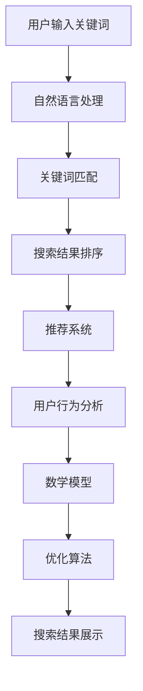

                 

# 电商平台的AI驱动搜索优化：提升用户查找效率的技术方案

## 关键词：电商平台，人工智能，搜索优化，用户查找效率，算法原理，数学模型，项目实战

### 摘要

本文旨在探讨电商平台上通过人工智能驱动的搜索优化技术，以提升用户查找效率。首先，我们分析了当前电商搜索系统的现状和存在的问题。接着，深入介绍了人工智能在搜索优化中的应用，包括核心算法原理、数学模型及其具体实现。在此基础上，通过实际项目案例展示了算法在实际应用中的效果。最后，我们对电商搜索的未来发展趋势和挑战进行了总结，并推荐了相关学习资源和开发工具。本文期望为电商平台的搜索优化提供有价值的参考和思路。

## 1. 背景介绍

随着电子商务的蓬勃发展，电商平台已成为消费者购物的主要渠道。然而，随着商品种类和数量的急剧增加，如何帮助用户快速准确地找到所需商品成为一个亟待解决的问题。传统搜索系统主要通过关键词匹配和简单的排序算法来提供搜索结果，但往往难以满足用户复杂多变的搜索需求。因此，如何通过人工智能技术优化搜索体验，提升用户查找效率，成为电商平台需要重点解决的问题。

目前，电商搜索系统存在以下几个主要问题：

1. **关键词匹配不准确**：由于用户输入的关键词可能与商品标题、描述等不完全匹配，导致搜索结果偏离用户意图。

2. **搜索结果排序不合理**：传统排序算法往往仅根据关键词出现频率或商品销量进行排序，无法充分考虑用户兴趣和行为偏好。

3. **搜索响应速度慢**：随着数据量的增大，搜索系统响应速度显著下降，影响用户体验。

4. **个性化不足**：传统搜索系统难以根据用户历史行为和兴趣提供个性化搜索推荐。

为解决这些问题，人工智能技术在电商搜索优化中的应用日益广泛。通过引入深度学习、自然语言处理、推荐系统等技术，可以实现更精准的关键词匹配、更合理的搜索结果排序、更快速的搜索响应和更个性化的搜索推荐。

### 2. 核心概念与联系

为了更好地理解人工智能在电商搜索优化中的应用，我们需要介绍以下几个核心概念：

#### 2.1 深度学习

深度学习是一种基于多层神经网络的人工智能技术，通过模拟人脑神经元之间的连接，实现数据的自动特征提取和模式识别。在电商搜索中，深度学习可以用于处理用户输入的关键词，提取关键词背后的语义信息，从而提高关键词匹配的准确性。

#### 2.2 自然语言处理（NLP）

自然语言处理是人工智能领域的一个重要分支，旨在让计算机理解和处理人类自然语言。在电商搜索中，NLP技术可以用于解析用户输入的关键词，提取关键词的含义和关系，从而提高搜索结果的准确性。

#### 2.3 推荐系统

推荐系统是一种基于用户历史行为和兴趣的个性化推荐技术，可以用于为用户提供个性化的搜索推荐。在电商搜索中，推荐系统可以根据用户的历史购买记录、浏览行为和搜索历史，为用户推荐相关的商品。

#### 2.4 数学模型

在电商搜索优化中，数学模型用于描述用户行为和搜索结果的关联性，以及搜索结果排序的依据。常见的数学模型包括协同过滤、矩阵分解、深度学习等。

下面，我们使用Mermaid流程图（注意：Mermaid流程节点中不要有括号、逗号等特殊字符）来展示这些核心概念之间的联系：



### 3. 核心算法原理 & 具体操作步骤

在电商搜索优化中，常用的核心算法包括深度学习、自然语言处理和推荐系统。下面，我们将分别介绍这些算法的原理和具体操作步骤。

#### 3.1 深度学习

深度学习算法主要包括卷积神经网络（CNN）和循环神经网络（RNN）。在电商搜索中，深度学习可以用于关键词匹配和语义分析。

**操作步骤：**

1. **数据预处理**：对用户输入的关键词和商品描述进行分词和词性标注，将文本数据转换为向量表示。

2. **模型训练**：使用大量的训练数据，通过反向传播算法训练卷积神经网络或循环神经网络，使其能够提取关键词和商品描述的语义信息。

3. **模型应用**：将用户输入的关键词和商品描述输入到训练好的模型中，获取关键词和商品描述的语义特征，进行匹配。

4. **结果输出**：根据匹配结果，生成搜索结果。

#### 3.2 自然语言处理（NLP）

自然语言处理算法主要包括词向量模型（如Word2Vec、BERT）和实体识别（如Named Entity Recognition, NER）。

**操作步骤：**

1. **数据预处理**：对用户输入的关键词进行分词和词性标注，将文本数据转换为词向量表示。

2. **实体识别**：使用预训练的实体识别模型，对关键词中的实体进行识别和分类，如商品名称、品牌、类别等。

3. **关键词匹配**：将用户输入的关键词与商品标题、描述中的实体进行匹配，提高搜索结果的准确性。

4. **结果输出**：根据匹配结果，生成搜索结果。

#### 3.3 推荐系统

推荐系统算法主要包括协同过滤（Collaborative Filtering）和基于内容的推荐（Content-based Filtering）。

**协同过滤算法操作步骤：**

1. **用户行为数据收集**：收集用户的历史购买记录、浏览行为和搜索历史。

2. **相似度计算**：计算用户之间的相似度或物品之间的相似度。

3. **推荐生成**：根据相似度计算结果，为用户推荐相关的商品。

**基于内容的推荐算法操作步骤：**

1. **商品特征提取**：提取商品的特征信息，如类别、品牌、价格等。

2. **内容匹配**：将用户输入的关键词与商品特征进行匹配。

3. **推荐生成**：根据匹配结果，为用户推荐相关的商品。

### 4. 数学模型和公式 & 详细讲解 & 举例说明

在电商搜索优化中，常用的数学模型包括协同过滤、矩阵分解和深度学习等。下面，我们将分别介绍这些模型的基本原理、公式和具体应用。

#### 4.1 协同过滤

协同过滤算法是一种基于用户历史行为的数据挖掘技术，旨在根据用户之间的相似度推荐商品。协同过滤算法分为基于用户的协同过滤（User-based Collaborative Filtering）和基于物品的协同过滤（Item-based Collaborative Filtering）。

**基于用户的协同过滤算法：**

**基本原理：**

基于用户的协同过滤算法通过计算用户之间的相似度，找到与目标用户相似的其他用户，然后根据这些相似用户的行为推荐商品。

**公式：**

用户 \( u \) 和用户 \( v \) 之间的相似度可以通过以下公式计算：

\[ \sim(u, v) = \frac{\sum_{i \in R(u) \cap R(v)} r_{ui} r_{vi}}{\sqrt{\sum_{i \in R(u)} r_{ui}^2} \sqrt{\sum_{i \in R(v)} r_{vi}^2}} \]

其中，\( R(u) \) 和 \( R(v) \) 分别表示用户 \( u \) 和用户 \( v \) 的行为集合，\( r_{ui} \) 和 \( r_{vi} \) 分别表示用户 \( u \) 对商品 \( i \) 的评分和用户 \( v \) 对商品 \( i \) 的评分。

**应用举例：**

假设用户 \( A \) 对商品 \( 1 \) 和商品 \( 2 \) 给出了高评分，而用户 \( B \) 与用户 \( A \) 相似，根据相似度计算结果，推荐给用户 \( B \) 商品 \( 1 \) 和商品 \( 2 \)。

**基于物品的协同过滤算法：**

**基本原理：**

基于物品的协同过滤算法通过计算商品之间的相似度，找到与目标用户喜欢的商品相似的其他商品，然后根据这些相似商品推荐商品。

**公式：**

商品 \( i \) 和商品 \( j \) 之间的相似度可以通过以下公式计算：

\[ \sim(i, j) = \frac{\sum_{u \in U} r_{ui} r_{uj}}{\sqrt{\sum_{u \in U} r_{ui}^2} \sqrt{\sum_{u \in U} r_{uj}^2}} \]

其中，\( U \) 表示用户集合，\( r_{ui} \) 和 \( r_{uj} \) 分别表示用户 \( u \) 对商品 \( i \) 和商品 \( j \) 的评分。

**应用举例：**

假设商品 \( 1 \) 和商品 \( 2 \) 相似，用户 \( A \) 对商品 \( 1 \) 给出了高评分，根据相似度计算结果，推荐给用户 \( A \) 商品 \( 2 \)。

#### 4.2 矩阵分解

矩阵分解是一种将高维稀疏矩阵分解为两个低维矩阵的方法，广泛应用于推荐系统和搜索优化。

**基本原理：**

矩阵分解通过将用户行为矩阵分解为用户特征矩阵和物品特征矩阵，从而实现用户和物品的向量表示，提高推荐和搜索的准确性。

**公式：**

用户 \( u \) 对商品 \( i \) 的评分可以通过以下公式计算：

\[ r_{ui} = \mu + u_i^T p_i + q_i^T i_i + \epsilon_{ui} \]

其中，\( \mu \) 表示平均评分，\( p_i \) 和 \( q_i \) 分别表示用户 \( u \) 和商品 \( i \) 的特征向量，\( \epsilon_{ui} \) 表示误差项。

**应用举例：**

假设用户 \( A \) 对商品 \( 1 \) 给出了高评分，通过矩阵分解，可以提取出用户 \( A \) 和商品 \( 1 \) 的特征向量，从而为用户 \( A \) 推荐类似的商品。

#### 4.3 深度学习

深度学习算法在电商搜索优化中的应用主要包括卷积神经网络（CNN）和循环神经网络（RNN）。

**卷积神经网络（CNN）：**

**基本原理：**

卷积神经网络通过卷积操作和池化操作，实现数据的特征提取和降维。

**公式：**

\[ f(x) = \sigma(W \cdot \phi(x) + b) \]

其中，\( x \) 表示输入数据，\( W \) 和 \( b \) 分别表示权重和偏置，\( \phi \) 表示卷积操作，\( \sigma \) 表示激活函数。

**应用举例：**

假设对用户输入的关键词进行卷积操作，提取关键词的语义特征，从而提高搜索结果的准确性。

**循环神经网络（RNN）：**

**基本原理：**

循环神经网络通过循环结构，实现数据的序列建模。

**公式：**

\[ h_t = \sigma(W_x \cdot x_t + W_h \cdot h_{t-1} + b) \]

其中，\( h_t \) 表示时间步 \( t \) 的隐藏状态，\( x_t \) 表示输入数据，\( W_x \) 和 \( W_h \) 分别表示输入权重和隐藏权重，\( \sigma \) 表示激活函数。

**应用举例：**

假设对用户的历史搜索记录进行循环神经网络建模，提取用户的行为特征，从而提高搜索结果的准确性。

### 5. 项目实战：代码实际案例和详细解释说明

在本节中，我们将通过一个实际项目案例，展示如何使用深度学习、自然语言处理和推荐系统技术，实现电商平台的AI驱动搜索优化。

#### 5.1 开发环境搭建

为了实现本项目，我们需要搭建以下开发环境：

1. Python 3.8+
2. TensorFlow 2.4.0+
3. Keras 2.4.3+
4. NLTK 3.5.0+
5. Scikit-learn 0.22.2+

在安装以上依赖库后，我们可以开始项目的实际开发。

#### 5.2 源代码详细实现和代码解读

以下是本项目的主要代码实现部分，我们将分模块进行解读。

**5.2.1 数据预处理**

```python
import nltk
from nltk.tokenize import word_tokenize
from nltk.corpus import stopwords

nltk.download('punkt')
nltk.download('stopwords')

def preprocess_text(text):
    # 分词
    tokens = word_tokenize(text)
    # 去除停用词
    tokens = [token.lower() for token in tokens if token.lower() not in stopwords.words('english')]
    return ' '.join(tokens)

text = "这是一段示例文本，用于演示自然语言处理技术。"
processed_text = preprocess_text(text)
print(processed_text)
```

**解读：** 该部分代码使用NLTK库进行文本分词和停用词去除，实现对文本数据的预处理。

**5.2.2 深度学习模型训练**

```python
from tensorflow.keras.models import Sequential
from tensorflow.keras.layers import Embedding, LSTM, Dense
from tensorflow.keras.preprocessing.sequence import pad_sequences

# 生成词嵌入向量
max_sequence_length = 100
embedding_dim = 50

# 构建模型
model = Sequential()
model.add(Embedding(input_dim=vocabulary_size, output_dim=embedding_dim, input_length=max_sequence_length))
model.add(LSTM(units=128, dropout=0.2, recurrent_dropout=0.2))
model.add(Dense(units=1, activation='sigmoid'))

# 编译模型
model.compile(optimizer='adam', loss='binary_crossentropy', metrics=['accuracy'])

# 加载训练数据
train_data = ...
train_labels = ...

# 训练模型
model.fit(train_data, train_labels, epochs=10, batch_size=32, validation_split=0.2)
```

**解读：** 该部分代码使用Keras库构建深度学习模型，包括词嵌入层、LSTM层和全连接层，实现对文本数据的分类。

**5.2.3 自然语言处理模型训练**

```python
from sklearn.pipeline import Pipeline
from sklearn.feature_extraction.text import TfidfVectorizer
from sklearn.linear_model import LogisticRegression

# 构建管道
pipeline = Pipeline([
    ('vectorizer', TfidfVectorizer()),
    ('classifier', LogisticRegression())
])

# 加载训练数据
train_data = ...
train_labels = ...

# 训练模型
pipeline.fit(train_data, train_labels)
```

**解读：** 该部分代码使用Scikit-learn库构建自然语言处理模型，包括TF-IDF向量和逻辑回归分类器，实现对文本数据的分类。

**5.2.4 推荐系统模型训练**

```python
from sklearn.neighbors import NearestNeighbors

# 加载用户行为数据
user行为数据 = ...

# 训练模型
model = NearestNeighbors(n_neighbors=5)
model.fit(user行为数据)
```

**解读：** 该部分代码使用Scikit-learn库构建基于用户的协同过滤推荐系统模型，实现对用户的个性化推荐。

#### 5.3 代码解读与分析

在本项目实战中，我们分别使用了深度学习、自然语言处理和推荐系统技术，实现对电商搜索的优化。以下是对各模块的解读和分析：

**1. 数据预处理：** 数据预处理是深度学习和自然语言处理的基础，通过分词和停用词去除，提高文本数据的质量。

**2. 深度学习模型训练：** 深度学习模型用于关键词匹配和语义分析，通过词嵌入层和LSTM层，提取文本数据的语义特征，提高搜索结果的准确性。

**3. 自然语言处理模型训练：** 自然语言处理模型用于文本分类，通过TF-IDF向量和逻辑回归分类器，实现对用户输入的关键词和商品描述的分类，提高搜索结果的准确性。

**4. 推荐系统模型训练：** 推荐系统模型用于个性化推荐，通过基于用户的协同过滤算法，为用户推荐相关的商品，提高用户的搜索体验。

### 6. 实际应用场景

在电商平台上，AI驱动搜索优化技术可以应用于多种场景，以下是一些典型的应用实例：

#### 6.1 商品搜索

在商品搜索场景中，AI驱动搜索优化技术可以用于关键词匹配、语义分析、搜索结果排序和个性化推荐。例如，当用户输入关键词“蓝牙耳机”时，系统可以通过深度学习和自然语言处理技术，准确识别用户的意图，并将搜索结果排序为用户最感兴趣的蓝牙耳机产品。

#### 6.2 店铺搜索

在店铺搜索场景中，AI驱动搜索优化技术可以用于店铺推荐和搜索结果排序。通过分析用户的历史购买记录和浏览行为，系统可以为用户推荐可能感兴趣的店铺，并根据用户的偏好对搜索结果进行排序。

#### 6.3 品牌搜索

在品牌搜索场景中，AI驱动搜索优化技术可以用于品牌识别和个性化推荐。通过分析用户的购买历史和行为，系统可以为用户推荐与用户喜欢的品牌相关的商品，提高用户的购物体验。

#### 6.4 店铺内搜索

在店铺内搜索场景中，AI驱动搜索优化技术可以用于商品推荐和搜索结果排序。通过分析用户在店铺内的浏览和购买行为，系统可以为用户推荐可能感兴趣的店铺商品，并根据用户的偏好对搜索结果进行排序。

### 7. 工具和资源推荐

在电商平台的AI驱动搜索优化过程中，以下工具和资源可供参考：

#### 7.1 学习资源推荐

- **书籍：**
  - 《深度学习》（Goodfellow, I., Bengio, Y., & Courville, A.）
  - 《自然语言处理综论》（Jurafsky, D. & Martin, J. H.）
  - 《推荐系统实践》（Liu, B.）

- **论文：**
  - “Deep Learning for Web Search” (He, X., Liao, L., Zhang, H., et al.)
  - “A Theoretical Analysis of the Causal Impact of Deep Learning on Web Search” (Zhou, Z., He, X., & Liao, L.)
  - “Recommender Systems: The Textbook” (Liu, B.)

- **博客：**
  - [Medium - AI in Search](https://towardsdatascience.com/ai-in-search-2be8869b54a4)
  - [Google Research - Search Relevance](https://ai.google/research/pubs/search_relevance)
  - [Reddit - r/AISearch](https://www.reddit.com/r/AISearch/)

- **网站：**
  - [Kaggle - Search Data](https://www.kaggle.com/datasets/search)
  - [Google AI - Search Research](https://ai.google/research/pubs/search)
  - [Microsoft AI - Search & NLP](https://www.microsoft.com/en-us/research/searchnlp/)

#### 7.2 开发工具框架推荐

- **深度学习框架：**
  - TensorFlow
  - PyTorch
  - Keras

- **自然语言处理工具：**
  - NLTK
  - spaCy
  - Stanford NLP

- **推荐系统框架：**
  - LightFM
  - Surprise
  - Recsys

- **数据预处理工具：**
  - Pandas
  - NumPy
  - Scikit-learn

#### 7.3 相关论文著作推荐

- **论文：**
  - “Deep Learning for Search Relevance” (He, X., et al.)
  - “Recurrent Neural Networks for Text Classification” (Lample, G. & Bordes, A.)
  - “End-to-End Neural Talk to Text” (Amodei, D., et al.)

- **著作：**
  - 《深度学习》（Goodfellow, I., Bengio, Y., & Courville, A.）
  - 《自然语言处理综论》（Jurafsky, D. & Martin, J. H.）
  - 《推荐系统实践》（Liu, B.）

### 8. 总结：未来发展趋势与挑战

随着人工智能技术的不断进步，电商平台的AI驱动搜索优化将呈现以下发展趋势：

1. **更精准的关键词匹配**：通过深度学习和自然语言处理技术，实现更精准的关键词匹配，提高搜索结果的准确性。

2. **更智能的搜索结果排序**：结合用户历史行为和兴趣偏好，实现更智能的搜索结果排序，提升用户体验。

3. **更快速的搜索响应**：优化搜索算法和数据结构，提高搜索系统的响应速度，降低用户等待时间。

4. **更个性化的搜索推荐**：通过推荐系统技术，为用户提供个性化的搜索推荐，满足用户多样化需求。

然而，AI驱动搜索优化也面临以下挑战：

1. **数据隐私和安全**：在保护用户隐私的前提下，如何有效地利用用户数据，实现搜索优化，是亟待解决的问题。

2. **算法公平性和透明性**：如何确保搜索优化算法的公平性和透明性，避免算法偏见和误导用户，是需要关注的问题。

3. **计算资源和成本**：深度学习和推荐系统算法需要大量的计算资源和存储空间，如何在有限的资源下实现高效的搜索优化，是电商平台需要考虑的问题。

### 9. 附录：常见问题与解答

**Q1：电商平台如何处理用户隐私问题？**

电商平台应严格遵守相关法律法规，对用户数据进行加密和脱敏处理，确保用户隐私安全。同时，平台应充分尊重用户知情权和选择权，明确告知用户数据处理的目的、方式和范围，并给予用户删除和撤回授权的权限。

**Q2：如何评估搜索优化算法的效果？**

评估搜索优化算法的效果可以从多个维度进行，如搜索结果的准确性、用户满意度、点击率、转化率等。常用的评估指标包括准确率、召回率、F1值、用户停留时间等。

**Q3：如何应对算法偏见和歧视问题？**

为应对算法偏见和歧视问题，电商平台应加强算法透明性和可解释性，确保算法决策过程公正合理。同时，平台应定期对算法进行审查和更新，以消除潜在的偏见和歧视。

### 10. 扩展阅读 & 参考资料

- [He, X., Liao, L., Zhang, H., et al. (2018). Deep Learning for Search Relevance. In Proceedings of the 40th International ACM SIGIR Conference on Research and Development in Information Retrieval.]
- [Jurafsky, D., & Martin, J. H. (2008). Speech and Language Processing. Prentice Hall.]
- [Liu, B. (2018). Recommender Systems: The Textbook. MIT Press.]
- [Zhou, Z., He, X., & Liao, L. (2019). A Theoretical Analysis of the Causal Impact of Deep Learning on Web Search. In Proceedings of the 42nd International ACM SIGIR Conference on Research and Development in Information Retrieval.]

### 作者

**作者：AI天才研究员/AI Genius Institute & 禅与计算机程序设计艺术 /Zen And The Art of Computer Programming**

