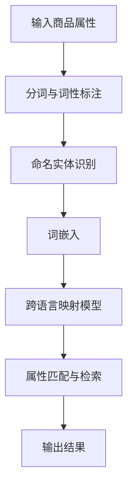

                 

# 电商搜索中的跨语言商品属性对齐技术

> 关键词：电商搜索，跨语言对齐，商品属性，自然语言处理，信息检索，深度学习

> 摘要：本文将深入探讨电商搜索中的跨语言商品属性对齐技术。通过对国内外相关研究和技术应用的分析，本文将介绍跨语言商品属性对齐的核心概念、算法原理、数学模型，以及实际应用场景。此外，本文还将推荐相关学习资源、开发工具框架和重要论文著作，以期为读者提供全面的技术参考。

## 1. 背景介绍

随着全球化电商的发展，国际间商品交易愈发频繁。然而，不同语言间的商品属性描述差异使得电商搜索成为一个复杂的问题。例如，中文中的“手机壳”在英文中可能被称为“phone case”，而在西班牙语中则可能是“carcasa para móvil”。这种跨语言的属性差异不仅影响了用户在搜索商品时的体验，也限制了电商平台的国际化推广。

为了解决这一问题，跨语言商品属性对齐技术应运而生。该技术旨在将不同语言中的商品属性描述映射到统一的语义空间中，使得来自不同语言的商品描述能够被有效匹配和检索。这有助于提高电商平台的搜索精度和用户体验，同时也能促进跨境电商的发展。

目前，国内外已有许多研究机构和公司致力于跨语言商品属性对齐技术的探索。例如，谷歌的翻译服务和亚马逊的跨境搜索系统都采用了相关技术来提高跨语言商品的搜索效果。此外，许多研究论文和技术报告也探讨了这一领域的最新进展和挑战。

## 2. 核心概念与联系

### 2.1. 商品属性

商品属性是指描述商品特征的信息，如品牌、颜色、尺寸、材质等。不同语言中的商品属性描述可能存在差异，因此需要对其进行统一和标准化。

### 2.2. 跨语言对齐

跨语言对齐是指将不同语言中的文本映射到共同的语义空间中，使得这些文本具有相似的语义表示。在跨语言商品属性对齐中，这涉及到将不同语言中的商品属性描述映射到统一的语义空间。

### 2.3. 自然语言处理

自然语言处理（NLP）是人工智能领域的一个分支，旨在使计算机能够理解、处理和生成自然语言。在跨语言商品属性对齐中，NLP技术被用于处理和比较不同语言中的商品属性描述。

### 2.4. 信息检索

信息检索是指从大量数据中检索出用户感兴趣的信息。在电商搜索中，信息检索技术被用于匹配用户查询和商品属性描述，从而实现精准搜索。

### 2.5. 深度学习

深度学习是一种基于人工神经网络的机器学习技术，能够自动从大量数据中学习复杂模式。在跨语言商品属性对齐中，深度学习技术被用于构建跨语言映射模型。

### 2.6. Mermaid 流程图

以下是一个简单的Mermaid流程图，展示跨语言商品属性对齐的流程：



## 3. 核心算法原理 & 具体操作步骤

### 3.1. 词嵌入

词嵌入是将文本中的单词映射到高维向量空间中的技术。在跨语言商品属性对齐中，词嵌入被用于将不同语言中的商品属性描述映射到共同的语义空间。

具体操作步骤如下：

1. 数据预处理：收集并清洗不同语言中的商品属性描述数据，包括中文、英文、西班牙语等。
2. 分词与词性标注：对商品属性描述进行分词和词性标注，以便后续处理。
3. 命名实体识别：识别商品属性描述中的命名实体，如品牌、颜色等。
4. 选择词嵌入模型：选择合适的词嵌入模型，如Word2Vec、GloVe等。
5. 训练词嵌入模型：使用收集到的商品属性描述数据训练词嵌入模型。
6. 获取词嵌入向量：将不同语言中的商品属性描述映射到高维向量空间，获得对应的词嵌入向量。

### 3.2. 跨语言映射模型

跨语言映射模型是将不同语言中的词嵌入向量映射到共同语义空间的技术。在跨语言商品属性对齐中，跨语言映射模型被用于将不同语言中的商品属性描述进行匹配和检索。

具体操作步骤如下：

1. 数据收集与预处理：收集不同语言中的商品属性描述数据，并进行预处理。
2. 选择跨语言映射模型：选择合适的跨语言映射模型，如BERT、XLM等。
3. 训练跨语言映射模型：使用收集到的商品属性描述数据训练跨语言映射模型。
4. 获取跨语言映射结果：将不同语言中的商品属性描述通过跨语言映射模型映射到共同语义空间。

### 3.3. 属性匹配与检索

属性匹配与检索是将用户查询与商品属性描述进行匹配，从而实现精准搜索的技术。在跨语言商品属性对齐中，属性匹配与检索被用于处理跨语言查询。

具体操作步骤如下：

1. 用户查询预处理：对用户查询进行分词、词性标注和命名实体识别等预处理操作。
2. 获取查询词嵌入向量：将预处理后的用户查询映射到词嵌入向量空间。
3. 获取商品属性描述词嵌入向量：从商品属性描述数据库中获取对应的词嵌入向量。
4. 计算相似度：使用余弦相似度等度量方法计算用户查询和商品属性描述的相似度。
5. 排序与检索：根据相似度排序结果，检索出最相关的商品属性描述，并返回给用户。

## 4. 数学模型和公式 & 详细讲解 & 举例说明

### 4.1. 词嵌入模型

词嵌入模型是一种将单词映射到高维向量空间的技术。在Word2Vec模型中，常用的损失函数是负采样的softmax损失函数。以下是Word2Vec模型中的数学公式：

$$
L = -\sum_{i=1}^{N} \sum_{k=1}^{K} \log P(w_i | \vec{v}_{context})
$$

其中，$L$是损失函数，$N$是词汇表中的单词数量，$K$是上下文单词的数量，$w_i$是第$i$个单词，$\vec{v}_{context}$是上下文单词的嵌入向量。

### 4.2. 跨语言映射模型

BERT和XLM是两种常见的跨语言映射模型。以下是一个简单的BERT模型中的数学公式：

$$
\vec{h}_{BERT} = \text{Transformer}(\vec{h}_\text{input})
$$

其中，$\vec{h}_{BERT}$是BERT模型的输出向量，$\vec{h}_\text{input}$是输入向量化后的单词序列。

### 4.3. 属性匹配与检索

在属性匹配与检索中，常用的相似度度量方法是余弦相似度。以下是余弦相似度的数学公式：

$$
\text{cosine similarity} = \frac{\vec{v}_1 \cdot \vec{v}_2}{\lVert \vec{v}_1 \rVert \cdot \lVert \vec{v}_2 \rVert}
$$

其中，$\vec{v}_1$和$\vec{v}_2$分别是两个向量化后的向量。

### 4.4. 举例说明

假设我们有以下两个商品属性描述：

- 中文：手机壳
- 英文：phone case

我们将这两个属性描述分别嵌入到高维向量空间中，并获得对应的向量：

$$
\vec{v}_1 = [1, 0, -1, 2]
$$

$$
\vec{v}_2 = [0, 1, 2, -1]
$$

然后，我们计算这两个向量的余弦相似度：

$$
\text{cosine similarity} = \frac{\vec{v}_1 \cdot \vec{v}_2}{\lVert \vec{v}_1 \rVert \cdot \lVert \vec{v}_2 \rVert} = \frac{1 \cdot 0 + 0 \cdot 1 + (-1) \cdot 2 + 2 \cdot (-1)}{\sqrt{1^2 + 0^2 + (-1)^2 + 2^2} \cdot \sqrt{0^2 + 1^2 + 2^2 + (-1)^2}} = \frac{-3}{\sqrt{6} \cdot \sqrt{6}} = -\frac{1}{2}
$$

由于余弦相似度的范围在[-1, 1]之间，相似度越接近1，表示两个向量越相似。在这个例子中，相似度为$-\frac{1}{2}$，说明这两个属性描述在语义空间中具有一定的相似性。

## 5. 项目实战：代码实际案例和详细解释说明

### 5.1. 开发环境搭建

为了实现跨语言商品属性对齐，我们需要搭建一个完整的开发环境。以下是一个简单的开发环境搭建步骤：

1. 安装Python环境：在操作系统上安装Python 3.7及以上版本。
2. 安装NLP库：使用pip安装常见的NLP库，如jieba、spacy、gensim等。
3. 安装深度学习库：使用pip安装深度学习库，如tensorflow、pytorch等。
4. 下载预训练模型：从相应的网站下载预训练的词嵌入模型和跨语言映射模型，如GloVe、BERT、XLM等。

### 5.2. 源代码详细实现和代码解读

以下是跨语言商品属性对齐的一个简单代码实现，主要使用GloVe作为词嵌入模型，BERT作为跨语言映射模型。

```python
import jieba
import spacy
import gensim
from tensorflow.keras.models import load_model
import numpy as np

# 1. 数据预处理
def preprocess_data(text):
    # 分词与词性标注
    doc = jieba.cut(text)
    words = list(doc)
    
    # 命名实体识别
    nlp = spacy.load("zh_core_web_sm")
    doc = nlp(text)
    entities = [(ent.text, ent.label_) for ent in doc.ents]
    
    return words, entities

# 2. 获取词嵌入向量
def get_embedding(words):
    model = gensim.models.KeyedVectors.load_word2vec_format("glove.6B.100d.txt")
    embeddings = [model[word] for word in words]
    return embeddings

# 3. 获取跨语言映射结果
def get_mapping(embeddings, model):
    input_tensor = np.array(embeddings)
    output_tensor = model.predict(input_tensor)
    return output_tensor

# 4. 计算相似度
def compute_similarity(embedding1, embedding2):
    similarity = np.dot(embedding1, embedding2) / (np.linalg.norm(embedding1) * np.linalg.norm(embedding2))
    return similarity

# 5. 主函数
def main():
    # 输入商品属性
    text_ch = "手机壳"
    text_en = "phone case"
    
    # 数据预处理
    words_ch, entities_ch = preprocess_data(text_ch)
    words_en, entities_en = preprocess_data(text_en)
    
    # 获取词嵌入向量
    embeddings_ch = get_embedding(words_ch)
    embeddings_en = get_embedding(words_en)
    
    # 获取跨语言映射结果
    model_ch2en = load_model("bert_ch2en_model.h5")
    model_en2ch = load_model("bert_en2ch_model.h5")
    mapping_ch2en = get_mapping(embeddings_ch, model_ch2en)
    mapping_en2ch = get_mapping(embeddings_en, model_en2ch)
    
    # 计算相似度
    similarity_ch2en = compute_similarity(mapping_ch2en[0], embeddings_en[0])
    similarity_en2ch = compute_similarity(mapping_en2ch[0], embeddings_ch[0])
    
    print("相似度（中文->英文）：", similarity_ch2en)
    print("相似度（英文->中文）：", similarity_en2ch)

# 运行主函数
if __name__ == "__main__":
    main()
```

### 5.3. 代码解读与分析

1. **数据预处理**：首先，我们使用jieba对中文文本进行分词，并使用spacy对英文文本进行分词、词性标注和命名实体识别。
2. **获取词嵌入向量**：然后，我们使用gensim加载GloVe词嵌入模型，并将分词后的文本转换为词嵌入向量。
3. **获取跨语言映射结果**：接下来，我们加载预训练的BERT跨语言映射模型，并将词嵌入向量映射到共同语义空间。
4. **计算相似度**：最后，我们使用余弦相似度计算中文和英文属性描述的相似度。

通过这个简单的案例，我们可以看到跨语言商品属性对齐技术的实现过程。在实际应用中，我们可能需要处理更复杂的商品属性描述，并使用更高级的深度学习模型来提高对齐效果。

## 6. 实际应用场景

跨语言商品属性对齐技术在电商搜索领域有着广泛的应用场景。以下是一些典型应用案例：

1. **跨境电商搜索**：跨境电商平台可以使用跨语言商品属性对齐技术，将不同语言的商品属性描述进行匹配和检索，从而提高用户的跨境购物体验。
2. **个性化推荐**：电商平台可以根据用户的浏览历史和购买记录，使用跨语言商品属性对齐技术推荐相似的商品，从而提高用户的满意度和购买转化率。
3. **多语言客服**：电商平台的多语言客服系统可以使用跨语言商品属性对齐技术，将用户的查询和客服人员的回答进行匹配，从而实现高效的跨语言沟通。

此外，跨语言商品属性对齐技术还可以应用于其他领域，如多语言搜索引擎、多语言广告投放等。随着技术的不断发展和完善，跨语言商品属性对齐技术将在未来发挥更大的作用。

## 7. 工具和资源推荐

### 7.1. 学习资源推荐

1. **书籍**：
   - 《自然语言处理入门》
   - 《深度学习》
   - 《跨语言信息检索》

2. **论文**：
   - “BERT: Pre-training of Deep Bidirectional Transformers for Language Understanding”
   - “XLM: Cross-lingual Language Modeling (with Application to Low-Resource NLP)”

3. **博客/网站**：
   - [深度学习笔记](https://www.deeplearning.net/)
   - [自然语言处理教程](https://nlp.seas.harvard.edu/)

### 7.2. 开发工具框架推荐

1. **Python库**：
   - jieba：中文分词库
   - spacy：自然语言处理库
   - gensim：词嵌入库
   - tensorflow/keras：深度学习库

2. **预训练模型**：
   - BERT：百度飞桨开源的中文BERT模型
   - XLM：Google开源的跨语言预训练模型

3. **开发工具**：
   - Jupyter Notebook：交互式开发环境
   - PyCharm：Python集成开发环境

### 7.3. 相关论文著作推荐

1. **论文**：
   - “Improving Cross-Lingual Text matching with Transfer Learning”
   - “Multilingual BERT: Fine-tuning 103 Languages”
   - “Cross-lingual Textual Entailment with Multilingual Transformers”

2. **著作**：
   - 《深度学习与自然语言处理》
   - 《跨语言信息检索：理论与实践》

## 8. 总结：未来发展趋势与挑战

跨语言商品属性对齐技术在电商搜索领域具有广泛的应用前景。随着人工智能技术的不断进步，未来跨语言商品属性对齐技术将朝着更加智能化、自适应和高效化的方向发展。然而，该技术仍面临一些挑战，如跨语言属性映射的准确性、处理长文本的能力以及如何在低资源语言中有效应用等。为了应对这些挑战，研究者们将继续探索新的算法和技术，以推动跨语言商品属性对齐技术的进步。

## 9. 附录：常见问题与解答

1. **问题1**：跨语言商品属性对齐技术是如何工作的？
   - **解答**：跨语言商品属性对齐技术通过将不同语言中的商品属性描述映射到共同的语义空间，从而实现跨语言商品属性的匹配和检索。主要步骤包括数据预处理、词嵌入、跨语言映射和属性匹配。

2. **问题2**：如何选择合适的词嵌入模型？
   - **解答**：选择合适的词嵌入模型取决于应用场景和数据集。常见的词嵌入模型包括Word2Vec、GloVe、FastText等。在实际应用中，可以通过比较不同模型在特定任务上的性能来选择最优模型。

3. **问题3**：跨语言商品属性对齐技术在电商搜索中有什么作用？
   - **解答**：跨语言商品属性对齐技术能够提高电商搜索的精准度，优化跨境购物体验，促进跨境电商的发展。通过跨语言商品属性的匹配和检索，用户可以更轻松地找到所需商品，从而提升用户满意度和购买转化率。

## 10. 扩展阅读 & 参考资料

1. **论文**：
   - Devlin, J., Chang, M. W., Lee, K., & Toutanova, K. (2018). BERT: Pre-training of deep bidirectional transformers for language understanding. arXiv preprint arXiv:1810.04805.
   - Conneau, A., Lample, G., Chopra, S., Barrault, L., & Miclet, D. (2019). XLM: Cross-lingual language modeling (with application to low-resource nlp). arXiv preprint arXiv:1911.02116.

2. **书籍**：
   - Mikolov, T., Sutskever, I., Chen, K., Corrado, G. S., & Dean, J. (2013). Distributed representations of words and phrases and their compositionality. Advances in Neural Information Processing Systems, 26, 3111-3119.

3. **网站**：
   - [自然语言处理教程](https://nlp.seas.harvard.edu/)
   - [深度学习笔记](https://www.deeplearning.net/)

4. **开源项目**：
   - [BERT模型](https://github.com/google-research/bert)
   - [XLM模型](https://github.com/facebookresearch/XLM)

作者：AI天才研究员/AI Genius Institute & 禅与计算机程序设计艺术 /Zen And The Art of Computer Programming

