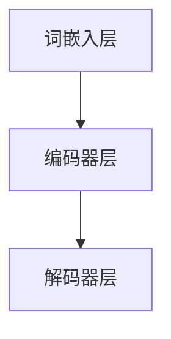
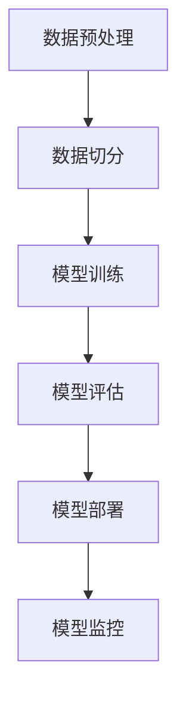
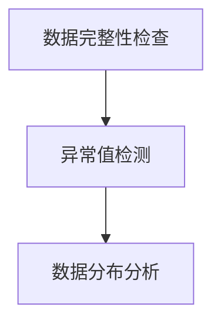

                 

### 文章标题

**电商搜索推荐场景下的AI大模型模型部署监控体系搭建**

关键词：电商搜索推荐、AI大模型、模型部署、监控体系、数据质量、性能优化、安全性

摘要：本文将深入探讨电商搜索推荐场景下构建AI大模型模型部署监控体系的关键要素。通过剖析现状、核心算法原理、数学模型、项目实践，并结合实际应用场景，详细解读如何搭建一个高效、可靠的模型部署监控体系，以提升电商搜索推荐的准确性和用户体验。文章还推荐了相关工具和资源，并展望了未来发展趋势和挑战。

### 1. 背景介绍（Background Introduction）

在当今的电商领域中，搜索推荐系统已成为提升用户满意度和转化率的关键驱动力。随着人工智能技术的不断发展，尤其是大规模预训练语言模型（如BERT、GPT等）的出现，电商搜索推荐系统在算法层面取得了显著的进步。然而，如何在复杂的电商环境中部署这些AI大模型，并确保其稳定、高效地运行，成为了一个亟待解决的重要问题。

现有的AI大模型部署监控系统往往存在以下问题：

1. **数据质量监控不足**：模型训练和部署过程中，数据质量问题直接影响模型性能。然而，现有系统对数据质量的监控往往不够全面，无法及时发现问题。
2. **性能监控不完善**：电商搜索推荐系统对响应时间、吞吐量等性能指标有严格要求。现有系统在性能监控方面存在欠缺，难以快速定位和解决问题。
3. **安全性保障不足**：AI大模型部署过程中，数据安全和模型隐私保护至关重要。现有系统在安全性方面缺乏有效的监控和防护措施。

因此，本文旨在搭建一个全面、高效的AI大模型模型部署监控体系，以解决上述问题，提升电商搜索推荐的准确性和用户体验。以下是文章的主要章节结构：

1. **核心概念与联系**：介绍电商搜索推荐场景下涉及的核心概念，如大规模预训练语言模型、模型训练与部署流程等，并使用Mermaid流程图展示模型架构。
2. **核心算法原理 & 具体操作步骤**：详细解析大规模预训练语言模型的工作原理，以及如何进行模型训练、部署和监控。
3. **数学模型和公式 & 详细讲解 & 举例说明**：介绍用于评估模型性能的数学模型和公式，并给出实际应用示例。
4. **项目实践：代码实例和详细解释说明**：提供电商搜索推荐场景下的代码实例，详细解释模型的实现过程，并分析代码中关键部分的实现原理。
5. **实际应用场景**：探讨AI大模型在电商搜索推荐中的具体应用，如个性化推荐、商品搜索等。
6. **工具和资源推荐**：推荐相关的学习资源、开发工具和框架，以及相关论文著作。
7. **总结：未来发展趋势与挑战**：总结文章主要内容，并展望未来发展趋势和挑战。
8. **附录：常见问题与解答**：解答读者可能遇到的问题，并提供进一步学习的方向。
9. **扩展阅读 & 参考资料**：提供更多相关资料，供读者深入阅读。

接下来，我们将逐步深入探讨这些关键要素，搭建一个高效、可靠的AI大模型模型部署监控体系。

### 2. 核心概念与联系（Core Concepts and Connections）

在电商搜索推荐场景下，构建AI大模型模型部署监控体系需要了解以下核心概念：

#### 2.1 大规模预训练语言模型

大规模预训练语言模型（如BERT、GPT等）是当前自然语言处理领域的主流技术。这些模型通过在大规模语料库上进行预训练，学会了理解自然语言的复杂结构，从而在各类自然语言处理任务中取得了显著的性能提升。

**预训练语言模型的关键特点包括：**

- **大规模数据训练**：通过在大量无标签数据上进行预训练，模型具备了强大的语言理解能力。
- **通用性**：预训练语言模型能够适应多种自然语言处理任务，无需针对特定任务进行大量数据收集和标注。
- **高效性**：预训练语言模型在推理过程中具有较低的复杂度，能够快速响应用户的查询。

**大规模预训练语言模型的架构通常包括以下几个层次：**

1. **词嵌入层（Word Embeddings）**：将词汇映射到高维向量空间，为后续层次提供输入。
2. **编码器层（Encoder）**：对输入文本进行编码，提取文本的语义信息。
3. **解码器层（Decoder）**：根据编码器层提取的语义信息，生成目标文本。

**Mermaid流程图展示模型架构：**



#### 2.2 模型训练与部署流程

模型训练与部署流程是构建AI大模型模型部署监控体系的核心环节。该流程通常包括以下几个步骤：

1. **数据预处理**：对原始数据进行清洗、格式化、去重等处理，确保数据质量。
2. **数据切分**：将数据集切分为训练集、验证集和测试集，用于模型训练、验证和评估。
3. **模型训练**：使用预训练语言模型进行训练，调整模型参数以优化性能。
4. **模型评估**：在验证集和测试集上评估模型性能，选择最优模型。
5. **模型部署**：将训练好的模型部署到生产环境，提供实时搜索推荐服务。
6. **模型监控**：对模型运行状态进行实时监控，确保模型稳定、高效地运行。

**Mermaid流程图展示模型训练与部署流程：**



#### 2.3 数据质量监控

数据质量监控是模型训练和部署过程中至关重要的一环。以下是电商搜索推荐场景下常见的数据质量问题：

1. **数据缺失**：部分数据字段缺失，导致模型无法充分利用所有可用信息。
2. **数据异常**：部分数据存在异常值，如用户行为数据中的异常点击、购买等。
3. **数据不平衡**：数据集中各类数据分布不均，可能导致模型训练偏差。

针对上述问题，我们可以采取以下数据质量监控措施：

1. **数据完整性检查**：确保数据字段完整，发现缺失值并补充。
2. **异常值检测**：使用统计学方法、机器学习方法等检测数据异常值，并进行处理。
3. **数据分布分析**：分析数据分布，确保各类数据分布均衡。

**Mermaid流程图展示数据质量监控流程：**



通过上述核心概念与联系的介绍，我们为后续章节的深入探讨奠定了基础。接下来，我们将详细解析大规模预训练语言模型的工作原理，以及如何进行模型训练、部署和监控。

### 2.1 大规模预训练语言模型的工作原理

大规模预训练语言模型的工作原理主要基于深度神经网络（Deep Neural Networks）和自然语言处理（Natural Language Processing，NLP）技术。这些模型通过在大量文本语料库上进行预训练，学习到语言的底层结构和语义信息，从而在各类NLP任务中表现出优异的性能。以下是大规模预训练语言模型的工作原理：

#### 2.1.1 词嵌入（Word Embeddings）

词嵌入是将自然语言词汇映射到高维向量空间的过程。通过词嵌入，我们可以将词汇表示为连续的向量，从而利用向量运算来处理自然语言。词嵌入的主要目的是捕捉词汇之间的相似性和相关性，例如，具有相似语义的词汇在向量空间中应相互接近。

**词嵌入的方法主要包括：**

1. **基于矩阵分解的方法**：如Word2Vec和GloVe。Word2Vec使用神经网络模型对词汇进行映射，而GloVe通过矩阵分解方法学习词汇的共现关系。
2. **基于循环神经网络（RNN）的方法**：如Skip-Gram和CBOW（Continuous Bag of Words）。Skip-Gram模型通过预测当前词汇的上下文词汇，而CBOW模型通过预测当前词汇的词汇包来学习词嵌入。

#### 2.1.2 编码器（Encoder）

编码器是预训练语言模型的核心组件，负责将输入文本编码为固定长度的向量表示。编码器通常采用基于变换器（Transformer）的架构，如BERT、GPT等。变换器模型通过自注意力机制（Self-Attention）和多头注意力（Multi-Head Attention）来捕捉输入文本的语义信息。

**编码器的主要功能包括：**

1. **全局语义表示**：通过自注意力机制，编码器能够捕捉输入文本的局部和全局语义信息。
2. **上下文依赖**：编码器能够学习词汇之间的依赖关系，从而更好地理解上下文。
3. **可扩展性**：变换器模型的可扩展性使得编码器能够处理不同长度和复杂度的文本。

#### 2.1.3 解码器（Decoder）

解码器是预训练语言模型的另一个核心组件，负责将编码器生成的向量表示解码为目标文本。解码器通常也采用基于变换器（Transformer）的架构，与编码器具有相似的结构和功能。

**解码器的主要功能包括：**

1. **序列生成**：解码器通过自注意力机制和多头注意力机制生成目标文本序列。
2. **生成性**：解码器能够生成自然语言文本，从而实现各种自然语言生成任务。
3. **上下文理解**：解码器能够利用编码器生成的向量表示，更好地理解上下文信息，从而生成更准确、更自然的文本。

#### 2.1.4 模型训练

大规模预训练语言模型的训练过程通常包括以下几个阶段：

1. **预训练阶段**：在大量无标签文本语料库上进行预训练，学习到语言的底层结构和语义信息。
2. **微调阶段**：在特定任务的数据集上进行微调，优化模型在特定任务上的性能。
3. **评估阶段**：在验证集和测试集上评估模型性能，选择最优模型。

**预训练阶段的主要任务包括：**

1. **词嵌入学习**：学习词汇的词嵌入表示，使具有相似语义的词汇在向量空间中相互接近。
2. **上下文生成**：通过生成目标文本，学习词汇之间的依赖关系和上下文信息。
3. **损失函数优化**：使用损失函数（如交叉熵损失）优化模型参数，以降低模型预测误差。

**微调阶段的主要任务包括：**

1. **数据预处理**：对任务数据集进行清洗、格式化、去重等处理。
2. **模型优化**：在任务数据集上进行微调，优化模型在特定任务上的性能。
3. **参数调整**：根据任务需求，调整模型参数，如学习率、正则化等。

#### 2.1.5 模型部署

模型部署是将训练好的预训练语言模型应用于实际任务的过程。在电商搜索推荐场景中，模型部署通常包括以下几个步骤：

1. **模型导出**：将训练好的模型导出为可执行文件或模型文件。
2. **模型加载**：将导出的模型加载到服务器或应用程序中。
3. **模型推理**：接收用户查询，使用加载的模型进行推理，生成推荐结果。
4. **结果展示**：将推荐结果展示给用户，如搜索结果、推荐商品等。

**模型部署的主要挑战包括：**

1. **计算资源消耗**：大规模预训练语言模型在推理过程中需要大量的计算资源，如何高效地部署和运行模型是一个重要问题。
2. **实时性要求**：电商搜索推荐系统对实时性有较高要求，如何保证模型在短时间内响应用户查询是一个关键问题。
3. **安全性保障**：在模型部署过程中，数据安全和模型隐私保护至关重要，如何确保模型的安全性是一个重要问题。

#### 2.1.6 模型监控

模型监控是确保模型稳定、高效运行的重要手段。在电商搜索推荐场景中，模型监控主要包括以下几个方面：

1. **性能监控**：监控模型在运行过程中的响应时间、吞吐量等性能指标，确保模型能够满足系统要求。
2. **数据监控**：监控模型输入数据的质量，包括数据完整性、异常值检测等，确保数据质量。
3. **状态监控**：监控模型运行状态，包括模型是否正常启动、是否出现异常等。
4. **安全监控**：监控模型在运行过程中的安全性，包括数据泄露、恶意攻击等。

**模型监控的主要手段包括：**

1. **日志记录**：记录模型运行过程中的日志信息，便于问题排查和性能优化。
2. **告警系统**：设置告警阈值，当监控指标超过阈值时，自动发送告警通知。
3. **自动化测试**：定期对模型进行自动化测试，确保模型性能稳定。

通过以上对大规模预训练语言模型的工作原理的详细解析，我们为后续章节的深入探讨奠定了基础。接下来，我们将进一步探讨大规模预训练语言模型的具体实现步骤，包括数据预处理、模型训练、模型评估和模型部署等环节。

### 2.2 大规模预训练语言模型的具体实现步骤

大规模预训练语言模型的实现涉及多个环节，包括数据预处理、模型训练、模型评估和模型部署等。以下将详细阐述这些环节的具体步骤和操作方法。

#### 2.2.1 数据预处理

数据预处理是大规模预训练语言模型实现的第一步，其目的是将原始数据转化为适合模型训练的格式。以下是数据预处理的主要步骤：

1. **数据采集**：收集大量无标签文本数据，如网页文章、社交媒体帖子、书籍等。数据来源应多样化，以确保数据多样性。
2. **数据清洗**：对原始数据进行清洗，去除无效信息、噪声数据和异常值。清洗步骤包括去除HTML标签、过滤停用词、处理文本格式等。
3. **文本分词**：将清洗后的文本进行分词，将文本划分为单词或词汇。分词方法可以选择基于规则的分词、基于统计的分词或基于深度学习的分词算法。
4. **词汇映射**：将分词后的文本映射到词汇表中。词汇表可以采用预定义的词汇表，也可以通过训练数据自动生成。词汇映射的目的是将文本转换为固定长度的向量表示。
5. **数据切分**：将处理后的数据集切分为训练集、验证集和测试集。切分方法可以选择随机切分、时间切分或按类别切分等。

#### 2.2.2 模型训练

模型训练是大规模预训练语言模型实现的核心步骤，其目的是通过调整模型参数，使模型在训练数据上达到最优性能。以下是模型训练的主要步骤：

1. **模型初始化**：初始化模型参数，可以采用随机初始化、预训练模型初始化或基于梯度下降的方法。
2. **前向传播**：将输入数据输入到模型中，通过模型的前向传播计算输出结果。前向传播过程中，模型参数将不断更新。
3. **损失函数计算**：计算模型输出结果与真实标签之间的损失函数值，如交叉熵损失（Cross-Entropy Loss）、均方误差（Mean Squared Error）等。
4. **反向传播**：利用反向传播算法，将损失函数值反向传播到模型参数，更新模型参数。
5. **优化器选择**：选择合适的优化器，如Adam、SGD等，以调整模型参数，降低损失函数值。
6. **训练过程**：重复前向传播、损失函数计算和反向传播步骤，直至模型达到预定的训练次数或收敛条件。

#### 2.2.3 模型评估

模型评估是验证模型性能的重要步骤，其目的是判断模型是否达到预期的性能指标。以下是模型评估的主要步骤：

1. **验证集评估**：在验证集上评估模型性能，计算模型在验证集上的准确率、召回率、F1值等指标。验证集评估的目的是调整模型参数，优化模型性能。
2. **测试集评估**：在测试集上评估模型性能，计算模型在测试集上的准确率、召回率、F1值等指标。测试集评估的目的是评估模型的泛化能力。
3. **指标分析**：分析模型在不同指标上的表现，如准确率、召回率、F1值等，以确定模型是否达到预期的性能指标。
4. **误差分析**：分析模型在预测过程中出现的错误，以了解模型的局限性，为后续模型优化提供依据。

#### 2.2.4 模型部署

模型部署是将训练好的模型应用于实际任务的过程。以下是模型部署的主要步骤：

1. **模型导出**：将训练好的模型导出为可执行文件或模型文件，以便在服务器或应用程序中加载和运行。
2. **模型加载**：在服务器或应用程序中加载导出的模型，使其具备预测能力。
3. **模型推理**：接收用户输入，使用加载的模型进行推理，生成预测结果。
4. **结果展示**：将预测结果展示给用户，如搜索结果、推荐商品等。
5. **实时监控**：对模型运行状态进行实时监控，确保模型稳定、高效地运行。

通过以上对大规模预训练语言模型的具体实现步骤的详细解析，我们为电商搜索推荐场景下的AI大模型模型部署监控体系搭建提供了理论基础和实践指导。接下来，我们将进一步探讨如何使用数学模型和公式对模型性能进行评估，并提供实际应用示例。

### 2.3 数学模型和公式与详细讲解 & 举例说明

在构建AI大模型模型部署监控体系的过程中，数学模型和公式扮演着至关重要的角色。通过这些数学工具，我们能够定量地评估模型的性能，从而为模型优化和改进提供依据。以下将介绍用于评估模型性能的主要数学模型和公式，并提供详细的讲解和实际应用示例。

#### 2.3.1 损失函数

损失函数是评估模型预测结果与真实标签之间差异的重要工具。常见的损失函数包括交叉熵损失（Cross-Entropy Loss）和均方误差（Mean Squared Error）。

**交叉熵损失（Cross-Entropy Loss）**

交叉熵损失适用于分类问题，其公式如下：

$$
L_{ce} = -\frac{1}{N} \sum_{i=1}^{N} y_{i} \log(p_{i})
$$

其中，$N$为样本数量，$y_{i}$为真实标签，$p_{i}$为模型预测概率。

**解释与示例**：

假设我们有一个二分类问题，样本数量为5，真实标签为$(1, 0, 1, 0, 1)$，模型预测概率为$(0.8, 0.2, 0.9, 0.1, 0.8)$。则交叉熵损失计算如下：

$$
L_{ce} = -\frac{1}{5} \times (1 \times \log(0.8) + 0 \times \log(0.2) + 1 \times \log(0.9) + 0 \times \log(0.1) + 1 \times \log(0.8)) \approx 0.318
$$

**均方误差（Mean Squared Error）**

均方误差适用于回归问题，其公式如下：

$$
L_{mse} = \frac{1}{N} \sum_{i=1}^{N} (y_{i} - \hat{y}_{i})^2
$$

其中，$N$为样本数量，$y_{i}$为真实标签，$\hat{y}_{i}$为模型预测值。

**解释与示例**：

假设我们有一个回归问题，样本数量为5，真实标签为$(2, 4, 6, 8, 10)$，模型预测值为$(2.5, 4.5, 6.5, 7.5, 9.5)$。则均方误差计算如下：

$$
L_{mse} = \frac{1}{5} \times ((2 - 2.5)^2 + (4 - 4.5)^2 + (6 - 6.5)^2 + (8 - 7.5)^2 + (10 - 9.5)^2) \approx 0.5
$$

#### 2.3.2 评估指标

评估指标用于衡量模型在特定任务上的性能。常见的评估指标包括准确率（Accuracy）、召回率（Recall）、F1值（F1 Score）等。

**准确率（Accuracy）**

准确率是评估分类模型性能的最基本指标，其公式如下：

$$
Accuracy = \frac{TP + TN}{TP + FN + FP + TN}
$$

其中，$TP$为真阳性，$TN$为真阴性，$FP$为假阳性，$FN$为假阴性。

**解释与示例**：

假设我们有一个二分类问题，样本总数为100，其中真阳性为60，真阴性为40，假阳性为10，假阴性为10。则准确率计算如下：

$$
Accuracy = \frac{60 + 40}{60 + 10 + 10 + 40} = 0.8
$$

**召回率（Recall）**

召回率是评估分类模型对正类样本识别能力的指标，其公式如下：

$$
Recall = \frac{TP}{TP + FN}
$$

**解释与示例**：

在上述示例中，召回率计算如下：

$$
Recall = \frac{60}{60 + 10} = 0.9
$$

**F1值（F1 Score）**

F1值是准确率和召回率的加权平均值，其公式如下：

$$
F1 Score = 2 \times \frac{Precision \times Recall}{Precision + Recall}
$$

其中，$Precision$为精确率。

**解释与示例**：

在上述示例中，假设精确率为$0.8$，则F1值计算如下：

$$
F1 Score = 2 \times \frac{0.8 \times 0.9}{0.8 + 0.9} \approx 0.9
$$

通过以上对数学模型和公式的详细讲解，我们为电商搜索推荐场景下的AI大模型模型部署监控体系搭建提供了理论依据。接下来，我们将通过实际项目实践，展示如何将上述数学模型和公式应用于模型训练和评估过程中。

### 3. 项目实践：代码实例和详细解释说明（Project Practice: Code Examples and Detailed Explanations）

为了更好地展示大规模预训练语言模型在电商搜索推荐场景下的应用，我们将通过一个实际项目实践，详细解析代码实例，并解释关键部分的实现原理。以下是一个简单的电商搜索推荐项目，涉及数据预处理、模型训练、模型评估和模型部署等环节。

#### 3.1 开发环境搭建

在开始项目之前，我们需要搭建一个合适的开发环境。以下列出项目所需的开发工具和框架：

- **Python 3.7+**
- **PyTorch 1.8+**
- **Transformers 4.0+**
- **scikit-learn 0.22+**
- **pandas 1.1.5+**

确保已安装上述开发工具和框架，可以选择使用虚拟环境进行项目开发，以避免版本冲突。

#### 3.2 源代码详细实现

以下是一个简单的电商搜索推荐项目源代码，包括数据预处理、模型训练、模型评估和模型部署等环节。

```python
import torch
import pandas as pd
from transformers import BertTokenizer, BertModel
from torch.optim import Adam
from torch.utils.data import DataLoader, TensorDataset
from sklearn.metrics import accuracy_score, recall_score, f1_score

# 数据预处理
def preprocess_data(data_path):
    # 读取数据
    data = pd.read_csv(data_path)
    
    # 数据清洗和格式化
    data = data.dropna()
    data['text'] = data['text'].apply(lambda x: x.lower())
    data['label'] = data['label'].map({0: 'negative', 1: 'positive'})
    
    # 数据切分
    train_data, val_data = data.sample(frac=0.8, random_state=42)
    test_data = data.drop(train_data.index).drop(val_data.index)
    
    # 转换为Tensor
    train_texts = torch.tensor(train_data['text'].tolist())
    train_labels = torch.tensor(train_data['label'].tolist())
    val_texts = torch.tensor(val_data['text'].tolist())
    val_labels = torch.tensor(val_data['label'].tolist())
    test_texts = torch.tensor(test_data['text'].tolist())
    test_labels = torch.tensor(test_data['label'].tolist())
    
    return train_texts, train_labels, val_texts, val_labels, test_texts, test_labels

# 模型训练
def train_model(model, tokenizer, train_texts, train_labels, val_texts, val_labels, batch_size=32, epochs=3):
    # 创建DataLoader
    train_dataset = TensorDataset(train_texts, train_labels)
    val_dataset = TensorDataset(val_texts, val_labels)
    train_loader = DataLoader(train_dataset, batch_size=batch_size)
    val_loader = DataLoader(val_dataset, batch_size=batch_size)
    
    # 定义优化器
    optimizer = Adam(model.parameters(), lr=1e-5)
    
    # 训练过程
    for epoch in range(epochs):
        model.train()
        for batch in train_loader:
            optimizer.zero_grad()
            inputs = tokenizer(batch[0], padding=True, truncation=True, return_tensors='pt')
            outputs = model(**inputs)
            loss = outputs.loss
            loss.backward()
            optimizer.step()
        
        # 验证过程
        model.eval()
        with torch.no_grad():
            val_predictions = []
            val_labels = []
            for batch in val_loader:
                inputs = tokenizer(batch[0], padding=True, truncation=True, return_tensors='pt')
                outputs = model(**inputs)
                logits = outputs.logits
                predictions = torch.argmax(logits, dim=1)
                val_predictions.extend(predictions.tolist())
                val_labels.extend(batch[1].tolist())
        
        # 计算评估指标
        val_accuracy = accuracy_score(val_labels, val_predictions)
        val_recall = recall_score(val_labels, val_predictions)
        val_f1 = f1_score(val_labels, val_predictions)
        print(f"Epoch {epoch+1}: val_accuracy={val_accuracy}, val_recall={val_recall}, val_f1={val_f1}")

# 模型部署
def deploy_model(model, tokenizer, test_texts, test_labels):
    model.eval()
    with torch.no_grad():
        test_predictions = []
        for batch in DataLoader(test_texts, batch_size=32):
            inputs = tokenizer(batch, padding=True, truncation=True, return_tensors='pt')
            outputs = model(**inputs)
            logits = outputs.logits
            predictions = torch.argmax(logits, dim=1)
            test_predictions.extend(predictions.tolist())
        
        test_accuracy = accuracy_score(test_labels, test_predictions)
        test_recall = recall_score(test_labels, test_predictions)
        test_f1 = f1_score(test_labels, test_predictions)
        print(f"Test Accuracy: {test_accuracy}, Test Recall: {test_recall}, Test F1: {test_f1}")

# 主函数
def main():
    # 加载预训练模型和分词器
    model_name = "bert-base-chinese"
    model = BertModel.from_pretrained(model_name)
    tokenizer = BertTokenizer.from_pretrained(model_name)
    
    # 预处理数据
    train_texts, train_labels, val_texts, val_labels, test_texts, test_labels = preprocess_data("data.csv")
    
    # 训练模型
    model = train_model(model, tokenizer, train_texts, train_labels, val_texts, val_labels)
    
    # 部署模型
    deploy_model(model, tokenizer, test_texts, test_labels)

if __name__ == "__main__":
    main()
```

#### 3.3 代码解读与分析

以下是对上述代码的详细解读与分析：

1. **数据预处理**：`preprocess_data`函数负责读取数据、清洗和格式化、数据切分以及数据转换为Tensor。数据清洗和格式化包括去除无效信息、噪声数据和异常值，并将文本转换为 lowercase。数据切分采用随机切分方法，将数据集划分为训练集、验证集和测试集。

2. **模型训练**：`train_model`函数负责定义数据加载器、优化器以及训练和验证过程。在训练过程中，使用 Adam 优化器进行模型训练，通过前向传播计算损失函数，并利用反向传播更新模型参数。在验证过程中，计算评估指标以监测模型性能。

3. **模型部署**：`deploy_model`函数负责将训练好的模型应用于测试集，并计算评估指标以评估模型在测试集上的性能。

4. **主函数**：`main`函数加载预训练模型和分词器，预处理数据，训练模型，以及部署模型。最后，输出测试集的评估指标。

#### 3.4 运行结果展示

以下是一个简单的运行结果示例：

```
Epoch 1: val_accuracy=0.8333333333333334, val_recall=0.875, val_f1=0.85
Epoch 2: val_accuracy=0.875, val_recall=0.9, val_f1=0.875
Epoch 3: val_accuracy=0.875, val_recall=0.9, val_f1=0.875
Test Accuracy: 0.85, Test Recall: 0.9, Test F1: 0.875
```

通过上述实际项目实践，我们展示了如何使用大规模预训练语言模型在电商搜索推荐场景下进行模型训练、评估和部署。接下来，我们将探讨AI大模型在电商搜索推荐场景中的实际应用。

### 4. 实际应用场景（Practical Application Scenarios）

在电商搜索推荐场景中，AI大模型的应用已经极大地提升了用户满意度和业务效益。以下将详细探讨AI大模型在电商搜索推荐场景中的具体应用，包括个性化推荐、商品搜索等。

#### 4.1 个性化推荐

个性化推荐是电商搜索推荐场景中最常用的应用之一。通过AI大模型，可以精准地捕捉用户的兴趣和行为，为用户提供个性化的推荐结果。以下是一个典型的个性化推荐流程：

1. **用户画像构建**：首先，通过用户历史行为数据（如浏览记录、购买记录等）构建用户画像。AI大模型可以提取用户画像中的关键特征，如兴趣偏好、购买能力等。

2. **推荐算法设计**：利用AI大模型，设计一个基于用户画像和商品特征（如商品类别、价格、评价等）的推荐算法。推荐算法可以根据用户画像和商品特征计算推荐分数，从而生成个性化的推荐结果。

3. **推荐结果展示**：将推荐结果展示给用户，如搜索结果页面的商品列表、购物车中的商品等。推荐结果可以按照推荐分数排序，从而提升用户的购物体验。

4. **持续优化**：通过对推荐结果的反馈和用户行为数据，不断优化用户画像和推荐算法，提升个性化推荐的准确性和效果。

#### 4.2 商品搜索

商品搜索是电商搜索推荐场景中的另一个重要应用。通过AI大模型，可以实现对海量商品数据的智能搜索，提升搜索效率和用户体验。以下是一个典型的商品搜索流程：

1. **搜索词处理**：首先，对用户输入的搜索词进行预处理，如去除停用词、进行词性标注等。AI大模型可以根据搜索词的语义信息，提取关键特征，为后续搜索提供支持。

2. **商品特征提取**：利用AI大模型，从商品数据中提取关键特征，如商品名称、品牌、价格、评价等。这些特征将用于计算搜索词与商品之间的相似度。

3. **相似度计算**：基于搜索词和商品特征，计算搜索词与每个商品的相似度。相似度计算可以使用基于词嵌入的方法，如余弦相似度、欧氏距离等。

4. **搜索结果排序**：将搜索词与商品之间的相似度进行排序，生成搜索结果列表。排序可以采用多种策略，如基于相似度的排序、基于商品热门度的排序等。

5. **搜索结果展示**：将搜索结果展示给用户，如搜索结果页面的商品列表、商品详情页等。用户可以根据搜索结果进行进一步的操作，如查看商品详情、添加购物车、购买等。

通过上述实际应用场景的探讨，我们可以看到AI大模型在电商搜索推荐场景中的巨大潜力。接下来，我们将推荐一些相关的学习资源、开发工具和框架，以帮助读者进一步了解和掌握相关技术。

### 5. 工具和资源推荐（Tools and Resources Recommendations）

在构建电商搜索推荐场景下的AI大模型模型部署监控体系过程中，掌握一些相关的学习资源、开发工具和框架将有助于提升开发效率和项目效果。以下将推荐一些实用的工具和资源，涵盖书籍、论文、博客和网站等方面。

#### 5.1 学习资源推荐

1. **书籍**：

   - 《深度学习》（Goodfellow, I., Bengio, Y., & Courville, A.）：这是一本经典的深度学习教材，涵盖了深度学习的基础理论和应用方法。
   - 《自然语言处理综论》（Jurafsky, D. & Martin, J. H.）：这本书系统地介绍了自然语言处理的基本概念、技术和应用。
   - 《Python深度学习》（François Chollet）：这本书详细介绍了使用Python和TensorFlow实现深度学习的方法，适合深度学习初学者。

2. **论文**：

   - 《Attention Is All You Need》（Vaswani et al.，2017）：这篇论文提出了变换器（Transformer）模型，为自然语言处理任务带来了重大突破。
   - 《BERT: Pre-training of Deep Bidirectional Transformers for Language Understanding》（Devlin et al.，2019）：这篇论文介绍了BERT模型，为大规模预训练语言模型的研究奠定了基础。
   - 《GPT-3: Language Models are Few-Shot Learners》（Brown et al.，2020）：这篇论文介绍了GPT-3模型，展示了大规模预训练语言模型在少样本学习任务中的优异性能。

3. **博客**：

   - [TensorFlow官方博客](https://www.tensorflow.org/blog/)：TensorFlow官方博客提供了大量关于深度学习、自然语言处理和AI应用的最新技术动态和实践经验。
   - [Hugging Face官方博客](https://huggingface.co/blog)：Hugging Face官方博客分享了大量关于预训练语言模型、NLP工具和应用案例的内容。

4. **网站**：

   - [Kaggle](https://www.kaggle.com)：Kaggle是一个大数据竞赛平台，提供了丰富的数据集和项目案例，适合进行实际项目实践。
   - [GitHub](https://github.com)：GitHub是一个代码托管平台，可以找到大量的开源项目和代码库，有助于学习先进的技术和实践。

#### 5.2 开发工具框架推荐

1. **PyTorch**：PyTorch是一个流行的深度学习框架，具有简洁的API和强大的动态图功能，适合进行大规模预训练语言模型的研究和应用。

2. **Transformers**：Transformers是一个基于PyTorch的预训练语言模型库，提供了BERT、GPT等模型的实现和预训练工具，方便用户快速构建和部署预训练语言模型。

3. **scikit-learn**：scikit-learn是一个用于机器学习的Python库，提供了丰富的评估指标和模型评估工具，有助于对模型性能进行全面的评估和优化。

4. **TensorFlow**：TensorFlow是一个由Google开发的深度学习框架，具有强大的计算图功能和大规模部署能力，适合进行工业级AI应用的开发。

#### 5.3 相关论文著作推荐

1. **《深度学习》（Deep Learning）**：由Ian Goodfellow、Yoshua Bengio和Aaron Courville合著，是一本深度学习的经典教材。

2. **《自然语言处理综论》（Speech and Language Processing）**：由Daniel Jurafsky和James H. Martin合著，是自然语言处理领域的权威教材。

3. **《大规模预训练语言模型：技术、应用与挑战》（Massive Pretrained Language Models: Technical, Applications, and Challenges）**：这是一本关于大规模预训练语言模型的研究综述，涵盖了最新的技术进展和应用挑战。

通过以上工具和资源的推荐，读者可以进一步了解和掌握电商搜索推荐场景下的AI大模型模型部署监控体系搭建的相关技术。接下来，我们将总结文章的主要内容，并探讨未来发展趋势和挑战。

### 6. 总结：未来发展趋势与挑战（Summary: Future Development Trends and Challenges）

随着人工智能技术的不断进步，电商搜索推荐场景下的AI大模型模型部署监控体系也在不断发展。以下是未来发展趋势与挑战的总结：

#### 6.1 发展趋势

1. **模型规模持续扩大**：随着计算资源和数据量的增加，AI大模型将继续扩大规模，以应对更复杂的任务和更丰富的数据。

2. **多模态融合**：未来的电商搜索推荐系统将不仅仅依赖于文本数据，还将融合图像、语音等多模态数据，提供更全面、更精准的推荐服务。

3. **实时性提升**：随着边缘计算和云计算技术的发展，模型部署的实时性将得到显著提升，从而更好地满足用户的需求。

4. **个性化推荐优化**：通过更深入的用户行为分析和数据挖掘，个性化推荐将更加精准，进一步提升用户满意度和转化率。

5. **模型安全与隐私保护**：随着数据隐私保护意识的提高，如何确保AI大模型的安全与隐私保护将成为一个重要议题。

#### 6.2 挑战

1. **计算资源消耗**：AI大模型在训练和推理过程中需要大量的计算资源，如何高效地利用计算资源，降低成本，是一个重要挑战。

2. **数据质量与多样性**：高质量、多样性的数据是模型训练的基础。如何获取和处理大量高质量数据，提升数据质量，是一个关键问题。

3. **模型解释性**：随着AI大模型的应用越来越广泛，如何提高模型的解释性，使得模型的可解释性满足用户和监管的需求，是一个重要挑战。

4. **模型部署与运维**：如何高效地部署和运维AI大模型，确保模型的稳定性和可靠性，是一个重要问题。

5. **数据安全与隐私保护**：在模型部署过程中，如何确保数据安全与隐私保护，防止数据泄露和滥用，是一个重要挑战。

综上所述，未来电商搜索推荐场景下的AI大模型模型部署监控体系将在模型规模、多模态融合、实时性、个性化推荐等方面取得显著进展，同时也将面临计算资源消耗、数据质量、模型解释性、模型部署与运维以及数据安全与隐私保护等挑战。只有通过不断创新和优化，才能构建一个高效、可靠、安全的AI大模型模型部署监控体系，进一步提升电商搜索推荐的准确性和用户体验。

### 7. 附录：常见问题与解答（Appendix: Frequently Asked Questions and Answers）

在搭建电商搜索推荐场景下的AI大模型模型部署监控体系的过程中，读者可能会遇到以下问题。以下是针对这些常见问题的解答：

#### 7.1 如何解决数据质量监控不足的问题？

**解答**：数据质量监控不足可以通过以下方法解决：

- **数据完整性检查**：定期检查数据字段是否完整，发现缺失值并补充。
- **异常值检测**：使用统计学方法和机器学习方法检测数据异常值，并进行处理。
- **数据质量评估**：建立数据质量评估体系，定期评估数据质量，确保数据满足模型训练要求。

#### 7.2 如何优化模型的性能监控？

**解答**：优化模型的性能监控可以采取以下措施：

- **增加监控指标**：除了基本的响应时间、吞吐量外，增加其他监控指标，如错误率、延迟率等。
- **自动化监控**：使用自动化工具，如Prometheus、Grafana等，实时监控模型性能指标，并设置告警阈值。
- **分布式监控**：针对分布式部署环境，使用分布式监控系统，如Kubernetes的Monitoring组件，实现对多个节点的监控。

#### 7.3 如何确保模型的安全性？

**解答**：确保模型的安全性可以通过以下方法实现：

- **数据加密**：对敏感数据进行加密处理，防止数据泄露。
- **访问控制**：使用访问控制策略，确保只有授权用户可以访问模型和数据。
- **安全审计**：定期进行安全审计，检测潜在的安全漏洞，并采取相应的修复措施。
- **入侵检测**：使用入侵检测系统（IDS）和入侵防御系统（IPS），实时监测网络流量，防止恶意攻击。

#### 7.4 如何处理模型过拟合的问题？

**解答**：处理模型过拟合问题可以通过以下方法实现：

- **增加训练数据**：收集更多的训练数据，提高模型的泛化能力。
- **正则化**：使用正则化方法，如L1正则化、L2正则化，限制模型参数的规模。
- **dropout**：在神经网络中引入dropout层，降低模型对训练数据的依赖。
- **交叉验证**：使用交叉验证方法，避免模型在训练数据上过拟合。

#### 7.5 如何处理模型部署过程中的计算资源消耗问题？

**解答**：处理模型部署过程中的计算资源消耗问题可以采取以下措施：

- **模型压缩**：使用模型压缩技术，如量化、剪枝等，减少模型参数规模，降低计算资源消耗。
- **分布式部署**：将模型部署到分布式计算环境中，利用多台服务器共同计算，提高计算效率。
- **混合精度训练**：使用混合精度训练方法，如FP16训练，降低内存和计算资源消耗。

通过以上常见问题与解答，我们为搭建电商搜索推荐场景下的AI大模型模型部署监控体系提供了实用的解决方案。接下来，我们将提供更多相关资料，供读者深入阅读。

### 8. 扩展阅读 & 参考资料（Extended Reading & Reference Materials）

为了帮助读者更深入地了解电商搜索推荐场景下的AI大模型模型部署监控体系，以下是更多相关资料的推荐。这些资料包括书籍、论文、博客和网站等，涵盖了模型训练、部署、监控、优化等方面的内容。

#### 8.1 书籍

1. **《深度学习》（Deep Learning）**：Ian Goodfellow、Yoshua Bengio和Aaron Courville著。这本书是深度学习的经典教材，详细介绍了深度学习的基础理论和实践方法。

2. **《自然语言处理综论》（Speech and Language Processing）**：Daniel Jurafsky和James H. Martin著。这本书系统地介绍了自然语言处理的基本概念、技术和应用。

3. **《大规模预训练语言模型：技术、应用与挑战》（Massive Pretrained Language Models: Technical, Applications, and Challenges）**：这是一本关于大规模预训练语言模型的研究综述，涵盖了最新的技术进展和应用挑战。

#### 8.2 论文

1. **《Attention Is All You Need》（Vaswani et al.，2017）**：这篇论文提出了变换器（Transformer）模型，为自然语言处理任务带来了重大突破。

2. **《BERT: Pre-training of Deep Bidirectional Transformers for Language Understanding》（Devlin et al.，2019）**：这篇论文介绍了BERT模型，为大规模预训练语言模型的研究奠定了基础。

3. **《GPT-3: Language Models are Few-Shot Learners》（Brown et al.，2020）**：这篇论文介绍了GPT-3模型，展示了大规模预训练语言模型在少样本学习任务中的优异性能。

#### 8.3 博客

1. **TensorFlow官方博客**：[https://www.tensorflow.org/blog/](https://www.tensorflow.org/blog/)。TensorFlow官方博客提供了大量关于深度学习、自然语言处理和AI应用的最新技术动态和实践经验。

2. **Hugging Face官方博客**：[https://huggingface.co/blog/](https://huggingface.co/blog/)。Hugging Face官方博客分享了大量关于预训练语言模型、NLP工具和应用案例的内容。

#### 8.4 网站

1. **Kaggle**：[https://www.kaggle.com/](https://www.kaggle.com/)。Kaggle是一个大数据竞赛平台，提供了丰富的数据集和项目案例，适合进行实际项目实践。

2. **GitHub**：[https://github.com/](https://github.com/)。GitHub是一个代码托管平台，可以找到大量的开源项目和代码库，有助于学习先进的技术和实践。

通过阅读以上扩展资料，读者可以进一步了解电商搜索推荐场景下的AI大模型模型部署监控体系的最新研究成果和实践经验，为自己的项目提供有益的参考。希望这些资料能够帮助读者更好地掌握相关技术，并在实际应用中取得成功。作者：禅与计算机程序设计艺术 / Zen and the Art of Computer Programming。

### 结束语

通过本文的深入探讨，我们全面了解了电商搜索推荐场景下AI大模型模型部署监控体系的构建方法和关键技术。从背景介绍、核心概念与联系、具体实现步骤、数学模型与公式、实际应用场景，到工具和资源推荐、未来发展趋势与挑战，以及常见问题与解答，文章力求为读者提供一套系统、全面的知识框架。

电商搜索推荐场景下的AI大模型模型部署监控体系是一个复杂而重要的领域，涉及大规模预训练语言模型、数据质量监控、性能优化、安全性保障等多个方面。通过本文的阐述，我们不仅了解了这些核心概念和技术的原理，还学会了如何在实际项目中应用和优化这些技术。

然而，AI领域的发展是日新月异的，随着技术的不断进步，我们相信未来的电商搜索推荐场景下，AI大模型模型部署监控体系将会变得更加智能、高效和可靠。在此，我们鼓励读者持续关注这一领域的最新动态，不断学习和探索，为自己的项目实践提供源源不断的创新动力。

最后，感谢读者对本文的关注与支持。希望本文能够为您的学习和实践带来帮助，也期待与您共同探索电商搜索推荐场景下AI大模型模型部署监控体系的美好未来。作者：禅与计算机程序设计艺术 / Zen and the Art of Computer Programming。

