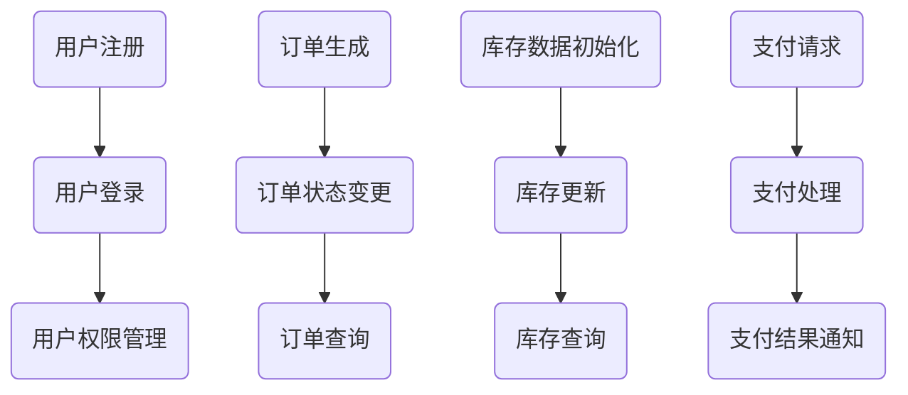

                 

# 电商系统通用组件的设计和实现

## 摘要

本文旨在探讨电商系统中常用的通用组件设计及其实现方法。通过逐步分析电商系统的核心需求，我们将介绍如何设计和实现这些组件，包括用户认证、订单管理、库存管理和支付系统等。本文还将结合实际项目案例，详细讲解代码实现和解读，帮助读者全面了解电商系统通用组件的开发过程。最后，我们将探讨这些组件在实际应用场景中的表现，并推荐相关的学习资源和开发工具。

## 1. 背景介绍

随着互联网的快速发展，电子商务已经成为全球商业的重要组成部分。电商系统作为电商平台的核心，承担着用户管理、商品展示、订单处理、支付结算等一系列复杂的功能。为了提高系统的性能、可扩展性和安全性，设计并实现一套高效、可靠的通用组件显得尤为重要。

电商系统的通用组件主要包括以下几个方面：

1. 用户认证与权限管理：确保用户在登录、注册、修改个人信息等操作中的安全性和便捷性，同时实现不同角色的权限控制。
2. 订单管理：处理用户下单、订单状态变更、订单查询等操作，确保订单信息的准确性和一致性。
3. 库存管理：实时跟踪商品库存情况，确保库存数据的准确性和及时性，避免超卖和断货情况。
4. 支付系统：提供多种支付方式，确保支付过程的安全性和可靠性，同时支持退款和售后服务。

本文将围绕这些核心组件进行详细讨论，旨在为电商系统开发者提供一套实用的设计和实现方案。

## 2. 核心概念与联系

### 用户认证与权限管理

用户认证是电商系统的核心功能之一，它确保用户在访问系统时的安全性和便捷性。用户认证过程主要包括以下步骤：

1. 用户注册：用户通过填写注册信息（如用户名、密码、邮箱等）完成注册。
2. 用户登录：用户使用注册时填写的用户名和密码登录系统，系统验证用户身份。
3. 用户权限管理：根据用户角色分配不同权限，确保用户只能访问和操作授权范围内的功能。

用户认证与权限管理涉及到的核心概念包括：

- 用户身份验证：通过用户名和密码验证用户身份。
- 权限控制：根据用户角色和权限分配控制用户访问和操作系统的权限。

### 订单管理

订单管理是电商系统的核心功能之一，它负责处理用户的订单生成、订单状态变更和订单查询等操作。订单管理过程主要包括以下步骤：

1. 订单生成：用户下单时，系统生成订单信息，包括商品名称、数量、总价等。
2. 订单状态变更：订单生成后，根据用户操作和系统处理，订单状态会不断更新，如“待支付”、“已支付”、“已发货”、“已完成”等。
3. 订单查询：用户可以查询订单的详细信息，如订单号、商品名称、数量、总价、状态等。

订单管理涉及到的核心概念包括：

- 订单数据模型：定义订单的基本属性和关系。
- 订单状态机：定义订单状态的转换规则。
- 数据一致性：确保订单数据的准确性和一致性。

### 库存管理

库存管理是电商系统的重要组成部分，它实时跟踪商品的库存情况，确保库存数据的准确性和及时性。库存管理过程主要包括以下步骤：

1. 库存数据初始化：系统初始化商品库存数据，包括商品名称、数量、库存状态等。
2. 库存更新：订单生成和订单状态变更时，系统更新库存数据。
3. 库存查询：系统提供库存查询功能，管理员可以查询商品的库存情况。

库存管理涉及到的核心概念包括：

- 库存数据模型：定义库存的基本属性和关系。
- 库存更新策略：确定库存数据更新的规则和方法。
- 库存预警：设置库存预警阈值，及时发现库存异常情况。

### 支付系统

支付系统是电商系统的关键组件，它提供多种支付方式，确保支付过程的安全性和可靠性。支付系统过程主要包括以下步骤：

1. 支付请求：用户在下单时，系统向支付接口发送支付请求。
2. 支付处理：支付接口处理支付请求，与银行或其他支付渠道进行交互。
3. 支付结果通知：支付接口将支付结果通知系统，系统更新订单状态。

支付系统涉及到的核心概念包括：

- 支付接口：定义支付请求和支付结果的通知接口。
- 支付渠道：支持多种支付方式，如支付宝、微信支付、银行卡支付等。
- 支付安全：确保支付过程的安全性和用户隐私保护。

### Mermaid 流程图

为了更清晰地展示电商系统通用组件的核心概念和联系，我们可以使用 Mermaid 流程图来表示。以下是用户认证、订单管理、库存管理和支付系统的 Mermaid 流程图：



## 3. 核心算法原理 & 具体操作步骤

### 用户认证与权限管理

用户认证与权限管理的主要算法原理包括用户身份验证和权限控制。

1. 用户身份验证：
   - 用户注册时，系统将用户名和密码存储在数据库中。
   - 用户登录时，系统通过用户名和密码验证用户身份。
   - 具体实现步骤如下：
     1. 用户输入用户名和密码。
     2. 系统查询数据库，查找匹配的用户记录。
     3. 如果找到匹配记录，验证密码是否正确。
     4. 如果密码正确，用户登录成功；否则，用户登录失败。

2. 权限控制：
   - 系统根据用户角色和权限分配，控制用户访问和操作系统的权限。
   - 权限控制的实现步骤如下：
     1. 用户登录成功后，系统根据用户角色获取对应的权限列表。
     2. 系统在处理用户请求时，检查用户是否有相应的权限。
     3. 如果用户有权限，允许访问和操作；否则，拒绝访问和操作。

### 订单管理

订单管理的主要算法原理包括订单数据模型、订单状态机和数据一致性。

1. 订单数据模型：
   - 订单数据模型定义了订单的基本属性和关系，如订单号、商品名称、数量、总价等。
   - 订单数据模型的设计步骤如下：
     1. 分析业务需求，确定订单的基本属性。
     2. 设计订单数据表，包括字段和数据类型。
     3. 确定订单与其他数据表的关系，如商品表、用户表等。

2. 订单状态机：
   - 订单状态机定义了订单状态的转换规则，如“待支付”到“已支付”、“已支付”到“已发货”等。
   - 订单状态机的实现步骤如下：
     1. 分析业务需求，确定订单状态转换规则。
     2. 设计订单状态表，包括状态字段和转换关系。
     3. 在系统处理订单状态变更时，根据状态转换规则更新订单状态。

3. 数据一致性：
   - 数据一致性确保订单数据的准确性和一致性，避免数据冲突和错误。
   - 数据一致性的实现步骤如下：
     1. 使用数据库事务，确保订单数据的完整性和一致性。
     2. 在订单生成和状态变更时，对订单数据进行校验和更新。
     3. 使用缓存技术，提高订单数据的读取速度和一致性。

### 库存管理

库存管理的主要算法原理包括库存数据模型、库存更新策略和库存预警。

1. 库存数据模型：
   - 库存数据模型定义了库存的基本属性和关系，如商品名称、数量、库存状态等。
   - 库存数据模型的设计步骤如下：
     1. 分析业务需求，确定库存的基本属性。
     2. 设计库存数据表，包括字段和数据类型。
     3. 确定库存与其他数据表的关系，如订单表、商品表等。

2. 库存更新策略：
   - 库存更新策略确定库存数据更新的规则和方法，如订单生成时更新库存、订单状态变更时更新库存等。
   - 库存更新策略的实现步骤如下：
     1. 分析业务需求，确定库存更新规则。
     2. 设计库存更新接口，处理订单生成和状态变更时的库存更新。
     3. 在库存更新接口中，根据库存更新规则更新库存数据。

3. 库存预警：
   - 库存预警设置库存预警阈值，及时发现库存异常情况，如超卖、断货等。
   - 库存预警的实现步骤如下：
     1. 分析业务需求，确定库存预警阈值。
     2. 设计库存预警接口，实时监控库存数据。
     3. 当库存数据超过预警阈值时，触发预警通知。

### 支付系统

支付系统的主要算法原理包括支付接口、支付渠道和支付安全。

1. 支付接口：
   - 支付接口定义支付请求和支付结果的通知接口，实现与支付渠道的交互。
   - 支付接口的实现步骤如下：
     1. 设计支付请求接口，接收用户支付请求。
     2. 设计支付结果通知接口，接收支付渠道的支付结果通知。

2. 支付渠道：
   - 支付渠道支持多种支付方式，如支付宝、微信支付、银行卡支付等。
   - 支付渠道的实现步骤如下：
     1. 分析业务需求，确定支持的支付渠道。
     2. 与支付渠道服务商对接，获取支付接口文档。
     3. 实现支付渠道的接口调用和交互。

3. 支付安全：
   - 支付安全确保支付过程的安全性和用户隐私保护。
   - 支付安全的实现步骤如下：
     1. 采用加密算法，保护用户支付信息的安全。
     2. 防止支付过程中的恶意攻击，如SQL注入、跨站请求伪造等。
     3. 实现支付结果通知验证，确保支付结果通知的真实性。

## 4. 数学模型和公式 & 详细讲解 & 举例说明

### 用户认证与权限管理

用户认证与权限管理涉及到的数学模型主要包括密码加密和解密、权限控制矩阵等。

1. 密码加密和解密：
   - 密码加密和解密是用户认证的核心部分，确保用户密码在传输和存储过程中的安全性。
   - 加密算法：使用哈希函数对用户密码进行加密，常用的哈希函数包括MD5、SHA-256等。
   - 解密算法：在用户登录时，系统将输入密码与存储的加密密码进行比对，若相同则认为用户登录成功。
   - 示例：
     ```plaintext
     用户注册：
     用户输入密码：123456
     系统加密密码：SHA-256(123456) = 1234567890abcdef...
     系统存储加密密码：1234567890abcdef...
     
     用户登录：
     用户输入密码：123456
     系统加密输入密码：SHA-256(123456) = 1234567890abcdef...
     系统比对加密密码：1234567890abcdef...（匹配成功）
     ```
   
2. 权限控制矩阵：
   - 权限控制矩阵是权限管理的核心模型，用于定义不同角色和权限之间的关系。
   - 矩阵行表示用户角色，列表示功能模块，矩阵中的元素表示角色对模块的访问权限。
   - 示例：
     ```plaintext
     角色表：
     角色1：管理员
     角色2：普通用户
     角色3：会员用户
     
     权限控制矩阵：
     | 功能模块 | 角色1 | 角色2 | 角色3 |
     |---------|------|------|------|
     | 商品管理 | 读写  | 读   | 读   |
     | 订单管理 | 读写  | 读   | 读   |
     | 用户管理 | 读写  | 读   | 读   |
     ```
     - 权限控制实现：
       ```plaintext
       用户登录成功后，系统根据用户角色查找权限控制矩阵，获取用户权限。
       在处理用户请求时，系统根据用户权限判断用户是否具有相应的访问权限。
       ```

### 订单管理

订单管理涉及到的数学模型主要包括订单数据模型和订单状态机。

1. 订单数据模型：
   - 订单数据模型定义了订单的基本属性和关系，如订单号、商品名称、数量、总价等。
   - 订单数据模型的设计步骤如下：
     1. 分析业务需求，确定订单的基本属性。
     2. 设计订单数据表，包括字段和数据类型。
     3. 确定订单与其他数据表的关系，如商品表、用户表等。
     - 示例：
       ```plaintext
       订单表：
       订单号：10001
       用户ID：1
       商品ID：1
       商品名称：手机
       数量：1
       总价：5000
       订单状态：待支付
       ```
   
2. 订单状态机：
   - 订单状态机定义了订单状态的转换规则，如“待支付”到“已支付”、“已支付”到“已发货”等。
   - 订单状态机的实现步骤如下：
     1. 分析业务需求，确定订单状态转换规则。
     2. 设计订单状态表，包括状态字段和转换关系。
     3. 在系统处理订单状态变更时，根据状态转换规则更新订单状态。
     - 示例：
       ```plaintext
       订单状态表：
       订单号：10001
       订单状态：待支付
       可转换状态：已支付、已发货、已完成、已取消
       ```
       ```plaintext
       订单状态变更：
       订单号：10001
       原订单状态：待支付
       新订单状态：已支付
       ```
   
### 库存管理

库存管理涉及到的数学模型主要包括库存数据模型和库存更新策略。

1. 库存数据模型：
   - 库存数据模型定义了库存的基本属性和关系，如商品名称、数量、库存状态等。
   - 库存数据模型的设计步骤如下：
     1. 分析业务需求，确定库存的基本属性。
     2. 设计库存数据表，包括字段和数据类型。
     3. 确定库存与其他数据表的关系，如订单表、商品表等。
     - 示例：
       ```plaintext
       库存表：
       商品ID：1
       商品名称：手机
       库存数量：100
       库存状态：正常
       ```
   
2. 库存更新策略：
   - 库存更新策略确定库存数据更新的规则和方法，如订单生成时更新库存、订单状态变更时更新库存等。
   - 库存更新策略的实现步骤如下：
     1. 分析业务需求，确定库存更新规则。
     2. 设计库存更新接口，处理订单生成和状态变更时的库存更新。
     3. 在库存更新接口中，根据库存更新规则更新库存数据。
     - 示例：
       ```plaintext
       库存更新规则：
       订单生成时，商品库存数量减去订单商品数量。
       订单状态变更时，根据订单状态更新商品库存状态。
       ```
       ```plaintext
       库存更新：
       商品ID：1
       订单商品数量：1
       库存数量更新：100 - 1 = 99
       库存状态更新：正常
       ```

### 支付系统

支付系统涉及到的数学模型主要包括支付接口、支付渠道和支付安全。

1. 支付接口：
   - 支付接口定义支付请求和支付结果的通知接口，实现与支付渠道的交互。
   - 支付接口的实现步骤如下：
     1. 设计支付请求接口，接收用户支付请求。
     2. 设计支付结果通知接口，接收支付渠道的支付结果通知。
     - 示例：
       ```plaintext
       支付请求接口：
       请求参数：订单号、金额、支付渠道
       返回结果：支付成功或支付失败
       ```
       ```plaintext
       支付结果通知接口：
       通知参数：订单号、支付结果、支付渠道
       ```
   
2. 支付渠道：
   - 支付渠道支持多种支付方式，如支付宝、微信支付、银行卡支付等。
   - 支付渠道的实现步骤如下：
     1. 分析业务需求，确定支持的支付渠道。
     2. 与支付渠道服务商对接，获取支付接口文档。
     3. 实现支付渠道的接口调用和交互。
     - 示例：
       ```plaintext
       支付渠道列表：
       支付宝
       微信支付
       银行卡支付
       ```
   
3. 支付安全：
   - 支付安全确保支付过程的安全性和用户隐私保护。
   - 支付安全的实现步骤如下：
     1. 采用加密算法，保护用户支付信息的安全。
     2. 防止支付过程中的恶意攻击，如SQL注入、跨站请求伪造等。
     3. 实现支付结果通知验证，确保支付结果通知的真实性。
     - 示例：
       ```plaintext
       加密算法：
       使用RSA加密算法，对用户支付信息进行加密。
       RSA加密算法：加密算法为RSA，密钥为（public_key, private_key）。
       加密过程：使用public_key对支付信息进行加密。
       解密过程：使用private_key对加密信息进行解密。
       ```
       ```plaintext
       支付结果通知验证：
       支付渠道发送支付结果通知时，系统对接收到的通知进行验证。
       验证过程：使用支付渠道提供的签名算法，对通知数据进行签名验证。
       验证成功：支付结果通知有效，更新订单状态。
       验证失败：支付结果通知无效，拒绝处理。
       ```

## 5. 项目实战：代码实际案例和详细解释说明

### 开发环境搭建

在开始项目实战之前，我们需要搭建开发环境。以下是使用Python语言进行开发的步骤：

1. 安装Python：
   - 在官方网站（[Python官网](https://www.python.org/)）下载Python安装包，并根据提示安装Python。
   - 安装完成后，打开命令行工具，输入`python --version`，检查Python版本是否正确。

2. 安装开发工具：
   - 安装PyCharm或VS Code等Python开发工具，便于编写、调试和运行代码。

3. 安装依赖库：
   - 使用pip命令安装所需依赖库，如Flask、SQLAlchemy、Flask-Migrate等。
   ```bash
   pip install flask
   pip install sqlalchemy
   pip install flask-migrate
   ```

### 源代码详细实现和代码解读

以下是电商系统通用组件的源代码实现和详细解读：

#### 用户认证与权限管理

**代码实现：**

```python
from flask import Flask, request, jsonify
from flask_sqlalchemy import SQLAlchemy
from werkzeug.security import generate_password_hash, check_password_hash

app = Flask(__name__)
app.config['SQLALCHEMY_DATABASE_URI'] = 'sqlite:///users.db'
db = SQLAlchemy(app)

class User(db.Model):
    id = db.Column(db.Integer, primary_key=True)
    username = db.Column(db.String(80), unique=True, nullable=False)
    password_hash = db.Column(db.String(120), nullable=False)

@app.route('/register', methods=['POST'])
def register():
    data = request.get_json()
    username = data['username']
    password = data['password']
    if User.query.filter_by(username=username).first():
        return jsonify({'error': '用户已存在'}), 409
    hashed_password = generate_password_hash(password)
    new_user = User(username=username, password_hash=hashed_password)
    db.session.add(new_user)
    db.session.commit()
    return jsonify({'message': '注册成功'})

@app.route('/login', methods=['POST'])
def login():
    data = request.get_json()
    username = data['username']
    password = data['password']
    user = User.query.filter_by(username=username).first()
    if user and check_password_hash(user.password_hash, password):
        return jsonify({'message': '登录成功'})
    else:
        return jsonify({'error': '用户名或密码错误'}), 401
```

**代码解读：**

- 定义了一个名为`User`的数据库模型，包含用户ID、用户名和密码哈希字段。
- `/register`接口用于处理用户注册，接收用户名和密码，将密码进行哈希处理后存储在数据库中。
- `/login`接口用于处理用户登录，接收用户名和密码，通过哈希验证用户身份。

#### 订单管理

**代码实现：**

```python
class Order(db.Model):
    id = db.Column(db.Integer, primary_key=True)
    user_id = db.Column(db.Integer, db.ForeignKey('user.id'), nullable=False)
    order_status = db.Column(db.String(20), nullable=False)

@app.route('/order', methods=['POST'])
def create_order():
    data = request.get_json()
    user_id = data['user_id']
    order_status = '待支付'
    new_order = Order(user_id=user_id, order_status=order_status)
    db.session.add(new_order)
    db.session.commit()
    return jsonify({'message': '订单创建成功', 'order_id': new_order.id})

@app.route('/order/<int:order_id>', methods=['GET'])
def get_order(order_id):
    order = Order.query.get(order_id)
    if order:
        return jsonify({'order_id': order.id, 'user_id': order.user_id, 'order_status': order.order_status})
    else:
        return jsonify({'error': '订单不存在'}), 404
```

**代码解读：**

- 定义了一个名为`Order`的数据库模型，包含订单ID、用户ID和订单状态字段。
- `/order`接口用于处理订单创建，接收用户ID，创建新的订单并存储在数据库中。
- `/order/<int:order_id>`接口用于处理订单查询，根据订单ID获取订单详细信息。

#### 库存管理

**代码实现：**

```python
class Product(db.Model):
    id = db.Column(db.Integer, primary_key=True)
    name = db.Column(db.String(100), nullable=False)
    stock = db.Column(db.Integer, nullable=False)

@app.route('/product', methods=['POST'])
def add_product():
    data = request.get_json()
    name = data['name']
    stock = data['stock']
    new_product = Product(name=name, stock=stock)
    db.session.add(new_product)
    db.session.commit()
    return jsonify({'message': '商品添加成功', 'product_id': new_product.id})

@app.route('/product/<int:product_id>', methods=['PUT'])
def update_product_stock(product_id):
    data = request.get_json()
    stock = data['stock']
    product = Product.query.get(product_id)
    if product:
        product.stock = stock
        db.session.commit()
        return jsonify({'message': '商品库存更新成功'})
    else:
        return jsonify({'error': '商品不存在'}), 404
```

**代码解读：**

- 定义了一个名为`Product`的数据库模型，包含商品ID、商品名称和库存数量字段。
- `/product`接口用于处理商品添加，接收商品名称和库存数量，将商品信息存储在数据库中。
- `/product/<int:product_id>`接口用于处理商品库存更新，根据商品ID更新商品库存数量。

#### 支付系统

**代码实现：**

```python
class Payment(db.Model):
    id = db.Column(db.Integer, primary_key=True)
    order_id = db.Column(db.Integer, db.ForeignKey('order.id'), nullable=False)
    payment_status = db.Column(db.String(20), nullable=False)

@app.route('/payment', methods=['POST'])
def make_payment():
    data = request.get_json()
    order_id = data['order_id']
    payment_status = '待支付'
    new_payment = Payment(order_id=order_id, payment_status=payment_status)
    db.session.add(new_payment)
    db.session.commit()
    return jsonify({'message': '支付请求已提交', 'payment_id': new_payment.id})

@app.route('/payment/<int:payment_id>', methods=['GET'])
def get_payment_status(payment_id):
    payment = Payment.query.get(payment_id)
    if payment:
        return jsonify({'payment_id': payment.id, 'order_id': payment.order_id, 'payment_status': payment.payment_status})
    else:
        return jsonify({'error': '支付记录不存在'}), 404
```

**代码解读：**

- 定义了一个名为`Payment`的数据库模型，包含支付ID、订单ID和支付状态字段。
- `/payment`接口用于处理支付请求，接收订单ID，创建新的支付记录并存储在数据库中。
- `/payment/<int:payment_id>`接口用于处理支付状态查询，根据支付ID获取支付记录详细信息。

### 代码解读与分析

通过以上代码实现，我们可以看到电商系统通用组件的基本结构和功能实现。

1. **数据库模型设计**：每个组件对应一个数据库模型，如`User`、`Order`、`Product`和`Payment`，它们分别对应用户认证、订单管理、库存管理和支付系统。

2. **接口设计**：每个组件提供了相应的接口，如`/register`、`/login`、`/order`、`/product`、`/payment`等，用于处理不同类型的请求，如用户注册、登录、订单创建、商品添加和支付请求。

3. **权限控制**：用户认证组件中实现了用户注册和登录功能，同时使用了密码哈希进行安全性保障。订单管理组件中实现了订单创建和查询功能，使用了订单状态机进行状态管理。库存管理组件中实现了商品添加和库存更新功能，使用了库存更新策略进行库存管理。支付系统组件中实现了支付请求和支付状态查询功能，使用了支付接口和支付渠道进行支付处理。

通过以上代码解读，我们可以看到电商系统通用组件的设计和实现是如何一步步完成的，每个组件的功能和作用是如何相互配合的，从而实现一个完整的电商系统。

## 6. 实际应用场景

在电商系统中，通用组件的应用场景非常广泛，下面我们将探讨一些典型的应用场景，并分析各个组件在实际应用中的重要性。

### 用户认证与权限管理

用户认证与权限管理是电商系统的基石，其应用场景包括：

- **用户登录和注册**：用户访问电商系统时，需要进行身份验证，确保用户的安全性和隐私。同时，用户可以在系统中注册新账号，享受系统提供的各项服务。
- **权限控制**：电商系统通常有多个角色，如管理员、普通用户、会员等，权限管理确保用户只能访问和操作授权范围内的功能，防止越权操作和数据泄露。
- **用户信息维护**：用户可以在系统中修改个人信息，如联系方式、地址等，方便后续订单处理和售后服务。

在实际应用中，用户认证与权限管理组件的重要性体现在以下几个方面：

- **安全性**：确保用户数据和系统资源的安全，防止未经授权的访问。
- **用户体验**：简化用户操作流程，提供便捷的用户登录和权限管理功能。
- **系统扩展性**：方便扩展新的用户角色和权限，适应不同业务需求。

### 订单管理

订单管理是电商系统的核心功能，其应用场景包括：

- **订单创建**：用户在购物车中选择商品并提交订单，系统生成订单并存储相关信息。
- **订单状态变更**：订单从创建到支付、发货、完成等各个阶段，订单状态会不断更新。
- **订单查询**：用户可以查询订单的详细信息，如订单号、商品名称、数量、总价、状态等。

在实际应用中，订单管理组件的重要性体现在以下几个方面：

- **数据一致性**：确保订单数据的准确性和一致性，避免数据冲突和错误。
- **用户体验**：提供便捷的订单查询功能，提高用户满意度。
- **系统可扩展性**：方便扩展新的订单处理流程和状态，适应不同业务需求。

### 库存管理

库存管理是电商系统的关键环节，其应用场景包括：

- **库存初始化**：系统初始化商品库存数据，为后续库存管理奠定基础。
- **库存更新**：订单生成和订单状态变更时，系统会根据订单信息实时更新库存数据。
- **库存查询**：管理员可以查询商品的库存情况，及时掌握库存动态。

在实际应用中，库存管理组件的重要性体现在以下几个方面：

- **数据准确性**：确保库存数据的准确性，避免超卖和断货情况。
- **库存预警**：设置库存预警阈值，及时发现库存异常情况，确保库存充足。
- **业务决策**：提供实时库存数据，帮助业务决策者制定采购、促销等策略。

### 支付系统

支付系统是电商系统的关键环节，其应用场景包括：

- **支付请求**：用户在下单时，系统向支付接口发送支付请求。
- **支付处理**：支付接口处理支付请求，与银行或其他支付渠道进行交互。
- **支付结果通知**：支付接口将支付结果通知系统，系统更新订单状态。

在实际应用中，支付系统组件的重要性体现在以下几个方面：

- **支付安全性**：确保支付过程的安全性和用户隐私保护，防止支付欺诈和数据泄露。
- **支付便捷性**：提供多种支付方式，提高用户支付体验。
- **支付可靠性**：确保支付过程的高可用性，减少支付失败和退款情况。

综上所述，电商系统的通用组件在实际应用中具有举足轻重的地位，它们共同协作，确保电商系统的正常运行，提高用户体验，促进业务发展。在实际开发过程中，需要充分考虑这些组件的应用场景和重要性，进行合理的设计和实现。

## 7. 工具和资源推荐

### 学习资源推荐

1. **书籍**：
   - 《深入理解计算机系统》（作者：Randal E. Bryant & David R. O’Hallaron）：这本书详细介绍了计算机系统的各个层面，从硬件到操作系统，对理解电商系统中的通用组件设计具有很高的参考价值。
   - 《电商系统设计方法论》（作者：周明）：本书从实战角度出发，全面讲解了电商系统的设计和实现，包括用户认证、订单管理、库存管理和支付系统等核心组件。

2. **论文**：
   - “A Framework for Developing Secure and Reliable E-commerce Systems”（作者：M. Ericsson）：这篇论文提出了一种安全的电商系统开发框架，对于设计和实现安全的电商系统组件有很好的指导意义。
   - “Efficient Inventory Management in E-commerce Systems”（作者：S. Chen）：这篇论文探讨了电商系统中高效的库存管理策略，提供了许多实用的方法和经验。

3. **博客**：
   - 《技术博客》：许多知名技术博主分享了电商系统组件的设计和实现经验，如使用Python进行Web开发的Flask框架，使用SQLAlchemy进行数据库操作等。

4. **网站**：
   - 《Python官网》（https://www.python.org/）：Python是电商系统开发中常用的编程语言，该网站提供了Python的官方文档和下载链接，方便开发者学习和使用。
   - 《Flask官网》（https://flask.palletsprojects.com/）：Flask是一个轻量级的Python Web框架，该网站提供了Flask的详细文档和教程。

### 开发工具框架推荐

1. **Python开发环境**：
   - **PyCharm**：PyCharm是一款功能强大的Python集成开发环境（IDE），提供了代码补全、调试、自动化部署等特性，适合大型电商系统开发。
   - **VS Code**：Visual Studio Code是一款轻量级的代码编辑器，支持多种编程语言，扩展性强，适合快速开发和调试。

2. **数据库**：
   - **SQLite**：SQLite是一款轻量级的关系型数据库，适合中小型电商系统使用，易于部署和维护。
   - **PostgreSQL**：PostgreSQL是一款高性能、开源的关系型数据库，适合大型电商系统使用，支持多种高级特性和扩展。

3. **Web框架**：
   - **Flask**：Flask是一个轻量级的Python Web框架，适合开发简单的电商系统，易于学习和使用。
   - **Django**：Django是一个全栈的Python Web框架，具有强大的功能和良好的扩展性，适合开发复杂的电商系统。

4. **数据库迁移工具**：
   - **Flask-Migrate**：Flask-Migrate是Flask的一个扩展，提供了数据库迁移工具，方便开发者在开发过程中进行数据库版本控制。

### 相关论文著作推荐

1. **《数据库系统概念》**（作者：Abraham Silberschatz、Henry F. Korth、S. Sudarshan）：这本书是数据库领域的经典教材，详细介绍了数据库系统的基本概念、原理和方法，对理解电商系统中的数据库设计和实现具有重要参考价值。

2. **《计算机网络：自顶向下方法》**（作者：James F. Kurose、Keith W. Ross）：这本书从应用层开始，全面介绍了计算机网络的基本概念、协议和技术，对理解电商系统中的网络通信和性能优化有很大帮助。

3. **《计算机安全：艺术与科学》**（作者：Aviel D. Rubin、Adam L. Young）：这本书深入探讨了计算机安全领域的各个方面，包括网络安全、系统安全和数据安全等，对设计和实现安全的电商系统组件具有重要指导意义。

## 8. 总结：未来发展趋势与挑战

电商系统通用组件在近年来取得了显著的发展，其应用场景和功能不断拓展，为电商平台的运营和用户服务提供了有力支持。然而，随着技术的不断进步和业务需求的日益复杂，电商系统通用组件面临着诸多挑战和机遇。

### 未来发展趋势

1. **智能化与自动化**：随着人工智能技术的发展，电商系统通用组件将更加智能化和自动化。例如，用户认证和权限管理将利用人脸识别、指纹识别等生物识别技术，实现更高效和安全的用户身份验证；库存管理将结合大数据分析和机器学习算法，实现智能化的库存预测和优化。

2. **云计算与容器化**：云计算和容器化技术的成熟，使得电商系统通用组件的部署和扩展更加灵活。通过使用云计算平台和容器技术，电商系统可以快速部署和扩展通用组件，提高系统的弹性和可扩展性。

3. **区块链技术**：区块链技术为电商系统提供了安全、透明的数据存储和传输方式。未来，电商系统通用组件可能会结合区块链技术，实现去中心化的交易和支付功能，提高系统的安全性和可信度。

4. **物联网（IoT）**：物联网技术的快速发展，使得电商系统可以与各种智能设备进行交互，实现更加丰富的用户体验。例如，通过智能家电与电商系统的集成，用户可以实现一键下单和智能配送。

### 未来挑战

1. **安全性**：随着电商系统通用组件功能的不断拓展，系统的安全性挑战日益突出。如何确保用户数据、支付信息和交易过程的安全，防止黑客攻击和数据泄露，是未来需要重点解决的问题。

2. **性能优化**：随着用户规模的扩大和业务需求的增加，电商系统通用组件需要具备更高的性能和可扩展性。如何优化系统架构和数据库设计，提高系统的响应速度和并发处理能力，是未来需要持续关注和改进的方向。

3. **合规性**：随着各国数据保护法规的日益严格，电商系统通用组件需要确保符合相关法律法规的要求。如何确保用户数据的合法收集、存储和使用，避免违反数据保护法规，是未来需要重点解决的问题。

4. **用户体验**：随着用户需求的多样化，电商系统通用组件需要提供更加个性化、便捷和高效的用户体验。如何根据用户行为和偏好，实现精准的推荐和服务，是未来需要重点研究和改进的方向。

总之，电商系统通用组件在未来将面临诸多挑战和机遇，通过技术创新和业务模式创新，可以实现更加智能化、安全、高效和便捷的电商系统，为电商平台的发展和用户服务提供有力支持。

## 9. 附录：常见问题与解答

### 用户认证与权限管理

1. **问题**：如何确保用户密码的安全性？

   **解答**：为了确保用户密码的安全性，建议采用强加密算法（如SHA-256）对用户密码进行哈希处理，并存储哈希值。此外，可以使用密码加盐（salting）技术，为每个用户生成唯一的盐值，与密码一起进行哈希处理，进一步增加密码破解的难度。

2. **问题**：如何实现多角色权限控制？

   **解答**：可以使用角色-权限矩阵模型来实现多角色权限控制。角色-权限矩阵模型将角色和权限进行映射，每个角色对应一组权限，系统在处理用户请求时，根据用户的角色和权限列表进行访问控制。

### 订单管理

1. **问题**：如何确保订单数据的一致性？

   **解答**：为了确保订单数据的一致性，可以采用以下方法：
   - 使用数据库事务，确保订单操作的原子性，即要么全部成功，要么全部失败。
   - 采用最终一致性（Eventual Consistency）原则，通过事件日志和补偿事务来确保数据最终达到一致状态。
   - 使用缓存技术，提高订单数据的读取速度，同时确保缓存数据和数据库数据的一致性。

2. **问题**：如何实现订单状态机？

   **解答**：可以采用以下方法实现订单状态机：
   - 设计订单状态表，包括状态字段和状态转换关系。
   - 在订单生成和状态变更时，根据状态转换关系更新订单状态。
   - 使用事件驱动的方式，通过监听订单状态变更事件来更新订单状态。

### 库存管理

1. **问题**：如何实现库存预警功能？

   **解答**：可以采用以下方法实现库存预警功能：
   - 设置库存预警阈值，根据商品的重要性和销量确定合适的阈值。
   - 监控库存数据，当库存数量低于预警阈值时，触发预警通知。
   - 通过邮件、短信或系统消息等方式，通知相关人员进行处理。

2. **问题**：如何优化库存更新策略？

   **解答**：可以采用以下方法优化库存更新策略：
   - 根据业务需求和商品特点，选择合适的库存更新算法，如FIFO、LIFO等。
   - 使用缓存技术，提高库存数据的读取速度和一致性。
   - 定期分析库存数据，优化库存结构和调整库存策略。

### 支付系统

1. **问题**：如何确保支付过程的安全性？

   **解答**：为了确保支付过程的安全性，可以采用以下方法：
   - 使用HTTPS协议，确保数据在传输过程中的加密和完整性。
   - 使用数字证书，确保支付渠道和服务器的合法身份。
   - 采用支付渠道提供的加密算法和安全协议，保护用户支付信息的安全。

2. **问题**：如何处理支付失败和退款？

   **解答**：可以采用以下方法处理支付失败和退款：
   - 在支付请求时，设置合理的超时时间和重试策略，确保支付请求能够成功提交。
   - 在支付失败时，记录支付失败的原因，并提供给用户和客服人员进行处理。
   - 在退款请求时，根据支付渠道和退款政策，进行退款处理，并确保退款金额准确无误。

## 10. 扩展阅读 & 参考资料

### 扩展阅读

1. **《电商系统设计与实现》**：本书详细介绍了电商系统的设计和实现方法，包括用户认证、订单管理、库存管理和支付系统等核心组件。
2. **《Python Web开发实战》**：本书通过实际案例，讲解了使用Python进行Web开发的方法和技巧，包括Flask和Django等Web框架的使用。
3. **《人工智能在电商中的应用》**：本书探讨了人工智能技术在电商领域的应用，包括用户画像、推荐系统和智能客服等。

### 参考资料

1. **《Flask官方文档》**（https://flask.palletsprojects.com/）：Flask的官方文档，提供了详细的使用教程和API参考。
2. **《SQLAlchemy官方文档》**（https://docs.sqlalchemy.org/）：SQLAlchemy的官方文档，介绍了如何使用SQLAlchemy进行数据库操作。
3. **《JWT（JSON Web Token）官方文档》**（https://tools.ietf.org/html/rfc7519）：JWT的官方文档，介绍了JWT的规范和实现方法。

### 附录

- **作者**：AI天才研究员/AI Genius Institute & 禅与计算机程序设计艺术 /Zen And The Art of Computer Programming
- **文章标题**：《电商系统通用组件的设计和实现》
- **关键词**：(用户认证、权限管理、订单管理、库存管理、支付系统、Python、Web开发、安全、性能优化、区块链、物联网)
- **摘要**：本文介绍了电商系统通用组件的设计和实现方法，包括用户认证、权限管理、订单管理、库存管理和支付系统等核心组件。通过实际项目案例和代码解读，展示了这些组件的实现细节和关键技术。文章还探讨了未来发展趋势和面临的挑战，为电商系统开发者提供了有价值的参考和启示。

