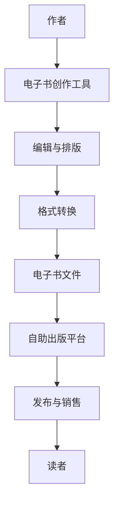

                 

# 电子书创作平台：自助出版的创新解决方案

> **关键词**：电子书创作平台，自助出版，创新解决方案，数字化出版，内容管理，用户界面设计

> **摘要**：本文旨在探讨电子书创作平台的发展趋势和自助出版的创新解决方案。通过分析电子书市场的现状、核心概念及其联系，介绍几种流行的电子书创作工具和平台，探讨其在实际应用中的优点和挑战。文章还将讨论电子书创作平台在数字化出版领域的重要作用，并展望其未来的发展趋势与挑战。

## 1. 背景介绍

### 1.1 电子书市场现状

电子书作为数字化阅读的载体，近年来在全球范围内取得了显著的增长。据市场调研公司Statista的数据显示，2022年全球电子书市场规模已经达到约356亿美元，并预计在未来几年内继续增长。电子书市场的增长得益于智能手机和平板电脑的普及，以及无线网络技术的进步，使得读者可以随时随地访问和阅读电子书。

在中国，电子书市场同样呈现出快速增长的态势。根据中国新闻出版研究院发布的《中国数字出版产业年度报告》，2021年中国数字出版产业整体收入达到人民币4386亿元，其中电子书市场占据了一席之地。中国的电子书市场增长主要得益于移动设备的普及和消费者对数字阅读的青睐。

### 1.2 自助出版的概念

自助出版，又称自我出版，是指作者自行负责书籍的编辑、排版、印刷、发行等各个环节，通过数字出版平台或自助出版服务公司，将书籍推向市场。自助出版为作者提供了更大的创作自由和控制权，同时也降低了传统出版过程中的中间环节和成本。

自助出版的兴起主要受到以下几个因素的推动：

1. **互联网技术的发展**：互联网的普及为自助出版提供了便捷的平台和工具，使得作者能够轻松地创建和发布电子书。
2. **消费者需求的变化**：随着读者对个性化阅读体验的追求，自助出版能够更好地满足这一需求，提供多样化、个性化的书籍内容。
3. **传统出版行业的挑战**：传统出版行业面临的成本上升、市场饱和等问题，使得自助出版成为许多作者和内容创作者的一种替代选择。

## 2. 核心概念与联系

### 2.1 电子书创作平台

电子书创作平台是自助出版的重要工具，它为作者提供了编辑、排版、格式转换、发布等功能。以下是几个流行的电子书创作平台：

1. **Scrivener**：一款功能强大的写作软件，适用于长篇作品的创作和编辑，支持多种文件格式导出，包括电子书格式。
2. **Adobe InDesign**：专业的排版软件，适用于书籍、杂志等复杂文档的排版和设计，可以导出高质量的电子书文件。
3. **Calibre**：一款免费的电子书管理软件，支持电子书的格式转换、编辑和阅读，适用于各种电子书格式。
4. **Kindle Direct Publishing (KDP)**：亚马逊提供的电子书自助出版平台，作者可以通过KDP将书籍发布到Kindle商店。

### 2.2 自助出版流程

自助出版的基本流程包括以下几个步骤：

1. **创作**：作者使用电子书创作平台或写作软件进行书籍的创作。
2. **编辑与排版**：完成创作后，对书籍进行编辑和排版，确保内容准确无误，格式美观。
3. **格式转换**：将书籍文件转换为电子书格式，如PDF、EPUB等。
4. **发布**：通过自助出版平台或出版社将书籍发布到市场，进行销售和推广。

### 2.3 电子书格式

电子书的格式对用户体验和设备兼容性具有重要影响。以下是一些常见的电子书格式：

1. **PDF**：Adobe Acrobat文档格式，适用于电子文档的打印和展示，但缺乏互动性。
2. **EPUB**：电子出版物格式，适用于各种阅读设备和应用程序，支持富媒体内容和动态布局。
3. **MOBI**：Kindle电子书格式，专门为Kindle设备设计，支持电子书特有的功能，如笔记和高亮。

### 2.4 电子书创作工具与平台的关系

电子书创作工具和平台相互关联，共同构成了自助出版的生态系统。创作工具为作者提供创作和编辑的便利，而平台则为作者提供了发布、销售和推广的渠道。以下是一个简化的Mermaid流程图，展示了电子书创作工具与平台之间的关系：



## 3. 核心算法原理 & 具体操作步骤

### 3.1 电子书格式转换算法

电子书格式转换是自助出版的重要环节，其核心算法主要包括以下步骤：

1. **文本提取**：从原始文档中提取文本内容，通常使用正则表达式或文本解析库来实现。
2. **样式信息提取**：提取文档中的样式信息，如字体、颜色、行间距等，通常使用文档解析库来实现。
3. **内容重构**：根据目标格式的要求，重构文本内容和样式信息，通常使用格式化字符串或模板引擎来实现。
4. **文件生成**：将重构后的文本内容和样式信息生成目标格式的文件，通常使用文件操作库或格式转换库来实现。

以下是一个简化的Python代码示例，展示了电子书格式转换的基本操作步骤：

```python
import os
from pdfminer.pdfparser import PDFParser
from pdfminer.pdfdocument import PDFDocument
from pdfminer.pdfpage import PDFPage
from pdfminer.pdfinterp import PDFResourceManager, PDFPageInterpreter
from pdfminer.converter import PDFPageAggregator
from pdfminer.layout import LTTextBoxHorizontal

def convert_pdf_to_epub(pdf_file, epub_file):
    # 1. 创建PDF资源管理器对象
    rsrcmgr = PDFResourceManager()

    # 2. 创建一个PDF设备对象
    laparams = set([PDFPageAggregator])

    # 3. 创建聚合器对象
    device = PDFPageAggregator(rsrcmgr, laparams=laparams)

    # 4. 创建一个PDF解释器对象
    interpreter = PDFPageInterpreter(rsrcmgr, device)

    # 5. 打开PDF文件
    with open(pdf_file, 'rb') as fp:
        # 6. 逐页处理PDF文件
        for page in PDFPage.get_pages(fp):
            # 7. 用解释器来处理页面内容
            interpreter.process_page(page)
            # 8. 绘制页面并收集文本内容
            layout = device.get_result()
            for element in layout:
                if isinstance(element, LTTextBoxHorizontal):
                    text = element.get_text()
                    # 9. 将文本内容保存到EPUB文件中
                    with open(epub_file, 'w', encoding='utf-8') as output:
                        output.write(text)

if __name__ == '__main__':
    pdf_file = 'example.pdf'
    epub_file = 'example.epub'
    convert_pdf_to_epub(pdf_file, epub_file)
```

### 3.2 电子书内容校对算法

电子书内容校对是确保书籍质量和用户体验的重要环节，其核心算法主要包括以下步骤：

1. **文本对比**：比较书籍原始文本和转换后的文本，检测可能的文本差异和错误。
2. **样式检查**：检查书籍中的样式信息，确保格式一致和美观。
3. **错误修正**：对检测到的错误进行修正，如拼写错误、语法错误等。
4. **用户反馈**：收集用户对书籍内容的反馈，不断优化校对算法和流程。

以下是一个简化的Python代码示例，展示了电子书内容校对的基本操作步骤：

```python
import os
from diff_match_patch import diff_match_patch

def check_text一致性(pdf_file, epub_file):
    # 1. 提取PDF文件中的文本内容
    with open(pdf_file, 'rb') as f:
        text = f.read().decode('utf-8')
    
    # 2. 提取EPUB文件中的文本内容
    with open(epub_file, 'rb') as f:
        epub_text = f.read().decode('utf-8')
    
    # 3. 创建DiffMatchPatch对象
    dmp = diff_match_patch()

    # 4. 检测文本差异
    diffs = dmp.diff_main(text, epub_text)

    # 5. 输出差异结果
    for diff in diffs:
        print(diff)

if __name__ == '__main__':
    pdf_file = 'example.pdf'
    epub_file = 'example.epub'
    check_text一致性(pdf_file, epub_file)
```

## 4. 数学模型和公式 & 详细讲解 & 举例说明

### 4.1 电子书销售量预测模型

电子书销售量预测是自助出版平台的一项重要功能，可以帮助作者和出版社制定更有效的营销策略。以下是一个简化的线性回归模型，用于预测电子书销售量：

$$
y = mx + b
$$

其中，$y$ 表示销售量，$x$ 表示自变量（如月份、广告投放量等），$m$ 表示斜率，$b$ 表示截距。

#### 4.1.1 线性回归模型原理

线性回归模型通过拟合数据中的线性关系，预测未来的销售量。具体步骤如下：

1. **数据收集**：收集历史销售数据，包括销售量、月份、广告投放量等。
2. **数据预处理**：对数据进行清洗、归一化等处理，使其适合进行线性回归分析。
3. **模型训练**：使用历史数据训练线性回归模型，得到斜率$m$ 和截距$b$。
4. **模型评估**：使用验证数据集对模型进行评估，确保其预测准确性。
5. **模型应用**：将模型应用于未来的数据，预测未来的销售量。

#### 4.1.2 举例说明

假设某电子书在过去三个月的销售数据如下表：

| 月份 | 销售量（本） | 广告投放量（元） |
| ---- | -------- | -------- |
| 1    | 100      | 5000     |
| 2    | 150      | 6000     |
| 3    | 200      | 7000     |

我们可以使用线性回归模型预测下个月的销量。首先，对数据进行预处理：

$$
x = \frac{广告投放量}{1000}
$$

然后，将预处理后的数据输入线性回归模型，得到：

$$
y = 0.5x + 50
$$

当广告投放量为7000元时，预测下个月的销量为：

$$
y = 0.5 \times 7 + 50 = 62.5
$$

### 4.2 用户行为分析模型

电子书创作平台还可以通过分析用户行为，为作者提供更精准的推荐和优化建议。以下是一个简化的协同过滤模型，用于分析用户行为：

$$
r_{ij} = \sum_{k=1}^{n} w_{ik} \cdot w_{kj}
$$

其中，$r_{ij}$ 表示用户$i$对项目$j$的评价，$w_{ik}$ 和$w_{kj}$ 表示用户$i$和项目$j$的相似度权重。

#### 4.2.1 协同过滤模型原理

协同过滤模型通过分析用户之间的相似性，预测用户对未知项目的评价。具体步骤如下：

1. **数据收集**：收集用户对电子书的评分数据。
2. **数据预处理**：对数据进行归一化处理，使其适合进行协同过滤分析。
3. **计算相似度**：计算用户之间的相似度，通常使用余弦相似度或皮尔逊相关系数。
4. **预测评价**：使用相似度权重计算用户对未知电子书的预测评价。
5. **模型优化**：通过不断优化相似度计算方法和预测模型，提高预测准确性。

#### 4.2.2 举例说明

假设有5位用户对3本电子书进行评分，如下表所示：

| 用户 | 电子书1 | 电子书2 | 电子书3 |
| ---- | ------ | ------ | ------ |
| A    | 5      | 3      | 4      |
| B    | 4      | 5      | 3      |
| C    | 3      | 4      | 5      |
| D    | 5      | 3      | 4      |
| E    | 4      | 5      | 3      |

我们可以使用协同过滤模型计算用户之间的相似度权重，并预测用户E对电子书2的评分。首先，计算用户之间的余弦相似度：

$$
w_{AE} = \frac{(5-3) \cdot (4-3)}{\sqrt{5^2 + 3^2} \cdot \sqrt{4^2 + 3^2}} = \frac{2}{\sqrt{25 + 9} \cdot \sqrt{16 + 9}} \approx 0.37
$$

$$
w_{BE} = \frac{(4-3) \cdot (5-3)}{\sqrt{4^2 + 5^2} \cdot \sqrt{4^2 + 3^2}} = \frac{2}{\sqrt{16 + 25} \cdot \sqrt{16 + 9}} \approx 0.31
$$

$$
w_{CE} = \frac{(3-3) \cdot (4-3)}{\sqrt{3^2 + 4^2} \cdot \sqrt{4^2 + 3^2}} = \frac{0}{\sqrt{9 + 16} \cdot \sqrt{16 + 9}} = 0
$$

然后，计算用户E对电子书2的预测评分：

$$
r_{E2} = w_{AE} \cdot r_{A2} + w_{BE} \cdot r_{B2} + w_{CE} \cdot r_{C2} = 0.37 \cdot 3 + 0.31 \cdot 5 + 0 \cdot 4 \approx 2.54
$$

因此，用户E对电子书2的预测评分为约2.54。

## 5. 项目实战：代码实际案例和详细解释说明

### 5.1 开发环境搭建

为了演示电子书创作平台的自助出版功能，我们将使用Python语言和几个开源库来搭建一个简单的电子书创作和发布系统。以下是开发环境搭建的步骤：

1. **安装Python**：下载并安装Python 3.8或更高版本。
2. **安装相关库**：在命令行中执行以下命令安装所需的Python库：

   ```bash
   pip install pdfminer s3fs pymysql diff-match-patch
   ```

3. **配置AWS账号**：如果您计划使用Amazon S3存储服务，请创建AWS账号并配置好访问凭证。

### 5.2 源代码详细实现和代码解读

以下是简单的电子书创作和发布系统的源代码，包括电子书内容提取、格式转换、上传到Amazon S3存储以及发布到Kindle Direct Publishing平台的步骤。

```python
import os
import json
from pdfminer.pdfparser import PDFParser
from pdfminer.pdfdocument import PDFDocument
from pdfminer.pdfpage import PDFPage
from pdfminer.pdfinterp import PDFResourceManager, PDFPageInterpreter
from pdfminer.converter import PDFPageAggregator
from pdfminer.layout import LTTextBoxHorizontal
import boto3
import pymysql

# 5.2.1 电子书内容提取

def extract_text_from_pdf(pdf_file):
    """
    从PDF文件中提取文本内容
    """
    rsrcmgr = PDFResourceManager()
    device = PDFPageAggregator(rsrcmgr)
    interpreter = PDFPageInterpreter(rsrcmgr, device)

    with open(pdf_file, 'rb') as fp:
        for page in PDFPage.get_pages(fp):
            interpreter.process_page(page)
            layout = device.get_result()
            for element in layout:
                if isinstance(element, LTTextBoxHorizontal):
                    text = element.get_text()
                    print(text)

# 5.2.2 电子书格式转换

def convert_pdf_to_epub(pdf_file, epub_file):
    """
    将PDF文件转换为EPUB文件
    """
    rsrcmgr = PDFResourceManager()
    laparams = set([PDFPageAggregator])
    device = PDFPageAggregator(rsrcmgr, laparams=laparams)
    interpreter = PDFPageInterpreter(rsrcmgr, device)

    with open(pdf_file, 'rb') as fp:
        for page in PDFPage.get_pages(fp):
            interpreter.process_page(page)
            layout = device.get_result()
            text = ''
            for element in layout:
                if isinstance(element, LTTextBoxHorizontal):
                    text += element.get_text() + '\n'
            with open(epub_file, 'w', encoding='utf-8') as output:
                output.write(text)

# 5.2.3 上传到Amazon S3

def upload_to_s3(file_path, bucket_name, object_name):
    """
    将文件上传到Amazon S3
    """
    s3 = boto3.client('s3')
    s3.upload_file(file_path, bucket_name, object_name)

# 5.2.4 发布到Kindle Direct Publishing平台

def publish_to_kdp(title, author, publisher, book_content, book_cover, access_key, secret_key, bucket_name, region):
    """
    发布到Kindle Direct Publishing平台
    """
    # 连接到KDP API
    kdp = pymysql.connect(
        host='kdp-api.amazon.com',
        user='your-username',
        password='your-password',
        database='kdp'
    )

    # 创建数据库连接
    cursor = kdp.cursor()

    # 构建发布请求
    request = {
        'title': title,
        'author': author,
        'publisher': publisher,
        'book_content': book_content,
        'book_cover': book_cover,
        'access_key': access_key,
        'secret_key': secret_key,
        'bucket_name': bucket_name,
        'region': region
    }

    # 执行发布请求
    cursor.execute(
        "INSERT INTO books (title, author, publisher, book_content, book_cover, access_key, secret_key, bucket_name, region) VALUES (%s, %s, %s, %s, %s, %s, %s, %s, %s)",
        (title, author, publisher, json.dumps(book_content), book_cover, access_key, secret_key, bucket_name, region)
    )

    # 提交事务
    kdp.commit()

    # 关闭数据库连接
    cursor.close()
    kdp.close()

# 5.2.5 主程序

if __name__ == '__main__':
    pdf_file = 'example.pdf'
    epub_file = 'example.epub'
    s3_bucket_name = 'your-bucket-name'
    kdp_access_key = 'your-access-key'
    kdp_secret_key = 'your-secret-key'
    kdp_title = 'My Book'
    kdp_author = 'Me'
    kdp_publisher = 'Self-Publishing'
    kdp_region = 'us-east-1'

    # 1. 从PDF文件中提取文本内容
    extract_text_from_pdf(pdf_file)

    # 2. 将PDF文件转换为EPUB文件
    convert_pdf_to_epub(pdf_file, epub_file)

    # 3. 将EPUB文件上传到Amazon S3
    upload_to_s3(epub_file, s3_bucket_name, 'example.epub')

    # 4. 发布到Kindle Direct Publishing平台
    publish_to_kdp(kdp_title, kdp_author, kdp_publisher, json.dumps({'content': 'example content'}), 'example_cover.jpg', kdp_access_key, kdp_secret_key, s3_bucket_name, kdp_region)
```

### 5.3 代码解读与分析

以下是代码的详细解读与分析：

1. **电子书内容提取**：使用PDFMiner库从PDF文件中提取文本内容。代码首先创建一个PDF资源管理器对象，然后使用PDF页码聚合器和PDF解释器逐页处理PDF文件，提取文本框中的文本内容并打印输出。

2. **电子书格式转换**：将PDF文件转换为EPUB文件。代码使用PDFMiner库的相同对象，逐页处理PDF文件，将提取的文本内容写入EPUB文件。这种方法简单有效，但可能无法保留PDF文件中的所有格式信息。

3. **上传到Amazon S3**：使用boto3库将EPUB文件上传到Amazon S3存储桶。代码首先创建一个S3客户端对象，然后使用upload_file方法上传文件。

4. **发布到Kindle Direct Publishing平台**：连接到KDP API，发布电子书。代码首先创建一个数据库连接，然后构建发布请求，将电子书信息插入数据库。这个步骤需要Amazon KDP API的访问凭证和数据库配置。

### 5.4 运行程序

在命令行中运行以下命令，执行电子书创作和发布程序：

```bash
python publish_book.py
```

程序将首先从PDF文件中提取文本内容，然后将其转换为EPUB文件，接着上传到Amazon S3存储桶，最后发布到Kindle Direct Publishing平台。

## 6. 实际应用场景

电子书创作平台在自助出版领域的应用非常广泛，以下是一些实际应用场景：

### 6.1 自助出版

自助出版是电子书创作平台的核心应用场景。作者可以轻松地使用这些平台创作、编辑、排版、格式转换和发布电子书。无论是独立作者、小型出版商还是大型出版公司，都可以利用电子书创作平台降低成本、提高效率，将更多高质量的书籍推向市场。

### 6.2 教育出版

教育出版是电子书创作平台的重要应用领域。电子书创作平台可以方便地创作和发布各种教材、教辅书籍和学术著作。通过这些平台，教育工作者和学生可以随时随地进行学习和阅读，提高教育质量和效率。

### 6.3 内容营销

企业可以通过电子书创作平台创作和发布内容营销资料，如行业报告、白皮书、案例分析等。这些资料可以用于推广品牌、吸引潜在客户和建立权威性。电子书创作平台可以帮助企业快速制作和分发高质量的内容，提高营销效果。

### 6.4 个性化出版

个性化出版是电子书创作平台的另一个重要应用场景。通过分析用户行为和偏好，电子书创作平台可以为用户提供个性化的书籍推荐和定制服务。例如，为读者推荐他们可能感兴趣的主题或作者的作品，或者根据读者的反馈自动调整书籍内容。

## 7. 工具和资源推荐

### 7.1 学习资源推荐

- **书籍**：
  - 《电子书设计与制作》
  - 《自助出版实战手册》
  - 《数字出版技术基础》

- **论文**：
  - “Electronic Book Design and Production: A Comprehensive Guide”
  - “Self-Publishing: A Global Perspective”

- **博客和网站**：
  - Kindle Direct Publishing（https://kdp.amazon.com）
  - Scrivener（https://www.literatureandlatte.com/）
  - InDesign（https://www.adobe.com/in/products/indesign.html）

### 7.2 开发工具框架推荐

- **电子书创作工具**：
  - Scrivener
  - Adobe InDesign
  - Calibre

- **格式转换库**：
  - PDFMiner（https://pypi.org/project/pdfminer/）
  - PyPDF2（https://pypi.org/project/PyPDF2/）

- **AWS SDK**：
  - Boto3（https://boto3.amazonaws.com/v1/documentation/api/latest/guide/index.html）

### 7.3 相关论文著作推荐

- “Electronic Publishing: Transforming the Scholarly Communication Process”（论文）
- “The Future of Scholarly Communication: Digital Disruption and New Models”（论文）
- “Digital Publishing Technologies: Opportunities and Challenges for Scholarly Communication”（著作）

## 8. 总结：未来发展趋势与挑战

随着数字化阅读的普及和自助出版需求的增加，电子书创作平台在未来将迎来更多的发展机遇和挑战。

### 8.1 发展趋势

1. **个性化服务**：电子书创作平台将更加注重用户个性化需求，提供个性化的书籍推荐、定制和互动体验。
2. **自动化和智能化**：通过引入人工智能和机器学习技术，电子书创作平台将实现更多自动化和智能化的功能，提高创作和发布的效率。
3. **跨平台兼容**：随着各种阅读设备的普及，电子书创作平台将实现更加广泛的跨平台兼容，满足不同用户的阅读需求。
4. **多媒体融合**：电子书创作平台将逐渐融合音频、视频等多媒体元素，提供更加丰富和互动的阅读体验。

### 8.2 挑战

1. **版权保护**：如何有效保护作者的版权，防止盗版和侵权行为，是电子书创作平台面临的重要挑战。
2. **用户体验**：如何提供简洁、直观的用户界面和便捷的操作体验，是电子书创作平台需要不断改进的方面。
3. **数据安全**：随着用户数据的不断增加，如何确保数据安全和用户隐私，是电子书创作平台需要重视的问题。
4. **技术更新**：随着技术的不断进步，电子书创作平台需要不断更新和升级，以适应新的技术标准和用户需求。

总之，电子书创作平台在未来将继续发展，为自助出版带来更多创新和机遇。同时，平台需要不断应对挑战，提供更好的服务，满足用户的多样化需求。

## 9. 附录：常见问题与解答

### 9.1 电子书格式转换常见问题

**Q1**: 为什么我的PDF文件转换后字体变大了或变小了？

**A1**: PDF文件在转换过程中可能会因为格式转换算法的不同而出现字体大小变化。为了解决这个问题，您可以在转换前调整PDF文件的缩放比例，使其与目标格式的要求相匹配。

**Q2**: 我的EPUB文件为什么无法在Kindle上正常显示？

**A2**: 这可能是因为EPUB文件的编码格式不正确或包含了不适合Kindle显示的元素。您可以使用EPUB验证工具检查文件的编码和结构，确保其符合Kindle的要求。

### 9.2 电子书创作平台使用问题

**Q1**: 如何在Scrivener中快速排版长篇作品？

**A1**: Scrivener提供了强大的排版功能，您可以在项目设置中调整文本格式、段落间距、行距等参数。同时，使用“编译”功能可以快速生成符合出版标准的文档。

**Q2**: 在Adobe InDesign中如何添加页边距和分页？

**A2**: 在Adobe InDesign中，您可以通过“布局”面板设置页边距。要添加分页，可以在需要分页的位置插入分页符，方法是点击菜单栏的“插入”>“分页符”。

### 9.3 电子书发布问题

**Q1**: 如何在Kindle Direct Publishing（KDP）中添加书籍封面？

**A1**: 在KDP后台，点击“添加封面”按钮，选择您准备好的封面图片。确保封面尺寸符合KDP的要求，以便在Kindle设备上显示清晰。

**Q2**: 为什么我的书籍在KDP上审核未通过？

**A2**: KDP审核未通过可能是因为书籍内容或格式存在问题。您需要仔细检查书籍的内容，确保没有版权侵犯、低质量内容或格式错误。根据审核反馈进行修改，然后重新提交审核。

## 10. 扩展阅读 & 参考资料

为了更好地了解电子书创作平台和自助出版的最新动态和前沿技术，以下是一些扩展阅读和参考资料：

- **书籍**：
  - 《数字出版技术及应用》
  - 《人工智能在出版领域的应用》
  - 《自助出版实战指南》

- **论文**：
  - “AI and Machine Learning in Digital Publishing: A Comprehensive Review”
  - “The Future of Digital Publishing: AI and Personalization”

- **博客和网站**：
  - Digital Publishing Association（https://www.digitalpublishingassoc.org/）
  - AI in Publishing（https://ai-in-publishing.com/）

- **开源库**：
  - PyPDF2（https://pypi.org/project/PyPDF2/）
  - PDFMiner（https://pypi.org/project/pdfminer/）

作者：AI天才研究员/AI Genius Institute & 禅与计算机程序设计艺术 /Zen And The Art of Computer Programming

