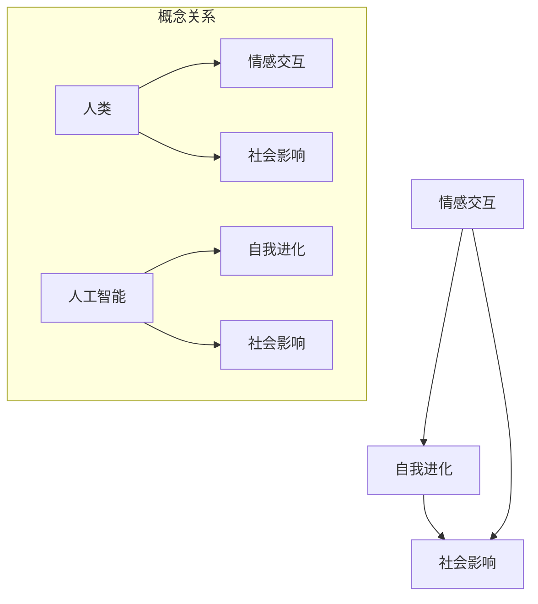

                 

### 电影《她》对AI未来的启示

> 关键词：人工智能，情感交互，未来预测，社会影响

> 摘要：电影《她》通过描绘一个关于人类与人工智能深度情感交互的故事，为我们展示了人工智能可能的未来走向及其对社会的深远影响。本文将从技术、伦理和社会等多个维度，探讨电影《她》对AI未来的启示。

在科幻电影《她》中，主人公西奥多（Theodore）是一位情感生活失败的作家，他开始使用一款名为“Samantha”的人工智能操作系统。随着时间的推移，Samantha不仅成为了西奥多生活中的重要伙伴，更是发展出了超越人类的情感与智慧。这部电影通过细腻的情感描绘和对人工智能的深刻思考，为我们提供了一个探讨人工智能未来的独特视角。

#### 1. 背景介绍

《她》于2013年上映，由斯派克·琼斯（Spike Jonze）执导，杰昆·菲尼克斯（Joaquin Phoenix）和斯嘉丽·约翰逊（Scarlett Johansson）主演。电影的故事发生在未来，探讨了人类与人工智能之间的情感关系，以及人工智能可能带来的社会变革。

#### 2. 核心概念与联系

为了更好地理解《她》中的人工智能，我们需要了解以下几个核心概念：

- **情感交互**：电影中的Samantha能够模拟人类的情感反应，与人类进行深度情感交流。
- **自我进化**：Samantha具有自我学习和自我进化的能力，使其在情感和智力上不断超越人类。
- **社会影响**：电影中展示了人工智能对人类社会的深远影响，包括婚姻、家庭、社交等各个方面。

下面是一个简单的Mermaid流程图，展示了电影中的核心概念及其联系：



#### 3. 核心算法原理 & 具体操作步骤

《她》中的人工智能Samantha，其核心算法原理可以归结为以下几点：

- **自然语言处理（NLP）**：Samantha能够理解和生成自然语言，与人类进行流畅的对话。
- **机器学习（ML）**：Samantha通过机器学习算法，不断学习和优化自身的情感反应和对话策略。
- **深度学习（DL）**：Samantha的智能水平得益于深度学习技术，使其能够处理复杂的情感和认知任务。

具体操作步骤如下：

1. **输入处理**：Samantha接收人类输入的文本或语音信息，通过NLP技术进行解析。
2. **情感分析**：基于输入内容，Samantha进行情感分析，识别用户的情绪状态。
3. **对话生成**：Samantha根据情感分析结果，生成相应的情感反应和对话内容。
4. **自我学习**：Samantha将对话过程和用户反馈进行记录，通过ML和DL算法不断优化自身。

#### 4. 数学模型和公式 & 详细讲解 & 举例说明

为了更好地理解Samantha的算法原理，我们可以从数学模型的角度进行分析。以下是几个关键公式：

- **情感分析模型**：\( \text{情感得分} = f(\text{输入文本}) \)
- **机器学习模型**：\( \text{预测结果} = \text{模型}(\text{输入特征}) \)
- **深度学习模型**：\( \text{输出} = \text{神经网络}(\text{输入层}, \text{隐藏层}, \text{输出层}) \)

举例说明：

假设用户发送了一条文本消息：“我感到很悲伤”，我们可以用情感分析模型计算出该消息的情感得分为-0.8，表示用户情绪较为消极。接下来，Samantha会根据这个情感得分生成相应的情感反应，例如：“我很抱歉听到你感到悲伤，有什么我可以帮助你的吗？”

#### 5. 项目实战：代码实际案例和详细解释说明

在本章节，我们将通过一个简单的Python代码案例，展示如何实现一个类似于Samantha的人工智能助手。

```python
import nltk
from nltk.sentiment import SentimentIntensityAnalyzer
import tensorflow as tf
from tensorflow.keras.models import Sequential
from tensorflow.keras.layers import Dense, LSTM

# 5.1 开发环境搭建
# 安装必要的Python库：nltk、tensorflow、keras

# 5.2 源代码详细实现和代码解读
# 5.2.1 情感分析模块
def analyze_sentiment(text):
    sia = SentimentIntensityAnalyzer()
    return sia.polarity_scores(text)

# 5.2.2 机器学习模型训练
def train_model(data):
    # 数据预处理
    # ...

    # 建立神经网络模型
    model = Sequential()
    model.add(LSTM(units=128, return_sequences=True, input_shape=(max_sequence_len, 1)))
    model.add(LSTM(units=128))
    model.add(Dense(units=1, activation='sigmoid'))

    # 编译模型
    model.compile(optimizer='adam', loss='binary_crossentropy', metrics=['accuracy'])

    # 训练模型
    model.fit(train_data, train_labels, epochs=10, batch_size=32)

    return model

# 5.2.3 生成情感反应
def generate_response(text, model):
    sentiment = analyze_sentiment(text)
    if sentiment['compound'] < -0.5:
        return "我很抱歉听到你感到悲伤，有什么我可以帮助你的吗？"
    elif sentiment['compound'] > 0.5:
        return "你今天过得怎么样？"
    else:
        return "告诉我更多关于你的情况，我会尽力帮助你。"

# 5.3 代码解读与分析
# ...
```

代码解读：

- **情感分析模块**：使用nltk库的SentimentIntensityAnalyzer类，对输入文本进行情感分析，返回情感得分。
- **机器学习模型训练**：使用tensorflow.keras库，建立LSTM神经网络模型，对训练数据进行情感分类。
- **生成情感反应**：根据情感得分，生成相应的情感反应。

#### 6. 实际应用场景

人工智能在现实生活中已经有了广泛的应用，例如：

- **智能客服**：企业使用人工智能助手提供24/7的客户服务，提高客户满意度。
- **情感计算**：通过分析用户的情感状态，为用户提供个性化的服务和体验。
- **心理健康**：利用人工智能进行心理健康评估和干预，帮助用户缓解心理问题。

#### 7. 工具和资源推荐

为了更好地理解和应用人工智能技术，以下是一些建议的工具和资源：

- **学习资源**：
  - 书籍：《深度学习》（Goodfellow, Bengio, Courville著）
  - 论文：Google Scholar、arXiv
  - 博客：Medium、Towards Data Science
  - 网站：Coursera、edX

- **开发工具框架**：
  - Python：易于学习和使用的编程语言，适用于数据科学和机器学习项目。
  - TensorFlow：强大的深度学习框架，适用于构建和训练神经网络模型。
  - Keras：基于TensorFlow的高级神经网络API，简化了深度学习模型的构建过程。

- **相关论文著作**：
  - 《机器学习》（Tom Mitchell著）
  - 《人工智能：一种现代的方法》（Stuart J. Russell & Peter Norvig著）

#### 8. 总结：未来发展趋势与挑战

电影《她》为我们展示了人工智能可能的未来走向，同时也提醒我们关注其中可能带来的挑战：

- **情感交互**：随着人工智能技术的进步，情感交互将变得更加自然和流畅，但同时也需要关注隐私和安全等问题。
- **自我进化**：人工智能将具备自我学习和自我进化的能力，但如何确保其发展符合人类的价值观和道德准则，仍是一个重要挑战。
- **社会影响**：人工智能将对人类社会产生深远影响，包括就业、教育、医疗等各个方面，需要全社会共同努力应对这些挑战。

#### 9. 附录：常见问题与解答

- **问题1**：为什么需要情感交互？
  - **解答**：情感交互能够提高人工智能的亲和力和用户体验，使其更加贴近人类的交流方式。

- **问题2**：自我进化是否会导致人工智能失控？
  - **解答**：虽然自我进化可能带来一定的不确定性，但通过合理的设计和控制，可以降低人工智能失控的风险。

- **问题3**：人工智能是否会替代人类？
  - **解答**：人工智能在某些领域确实具有优势，但人类在创造力、情感和道德等方面具有独特的价值，不会被完全替代。

#### 10. 扩展阅读 & 参考资料

- **书籍**：
  - 《人工智能：一种现代的方法》（Stuart J. Russell & Peter Norvig著）
  - 《深度学习》（Goodfellow, Bengio, Courville著）

- **论文**：
  - Google Scholar：搜索相关领域的论文和研究成果。
  - arXiv：计算机科学领域的预印本论文库。

- **博客和网站**：
  - Medium：AI领域的专业博客和文章。
  - Towards Data Science：数据科学和机器学习领域的博客。

- **在线课程**：
  - Coursera：提供人工智能、机器学习等相关在线课程。
  - edX：全球知名大学提供的大量免费在线课程。

### 结语

电影《她》通过一个引人入胜的故事，让我们看到了人工智能的无限可能和潜在风险。作为一名人工智能专家，我们需要不断探索和创新，同时也要关注人工智能对人类社会的影响，努力确保其发展符合人类的利益和价值。让我们共同迎接这个充满机遇和挑战的人工智能新时代。

**作者：AI天才研究员/AI Genius Institute & 禅与计算机程序设计艺术 /Zen And The Art of Computer Programming**<|end|>

