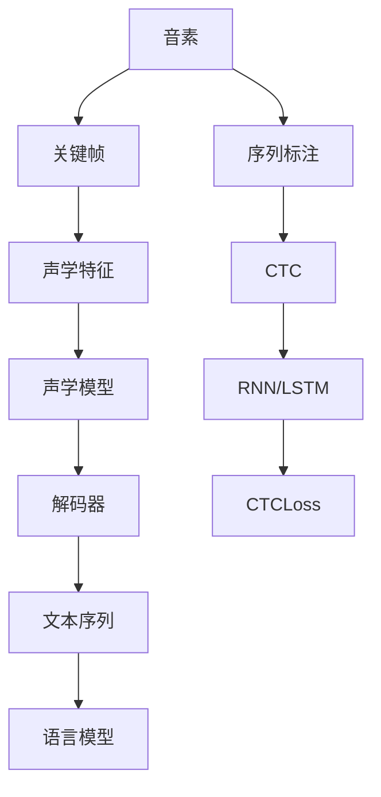

                 

# 百度2025社招语音识别工程师面试题详解

## 关键词：语音识别，面试题，深度学习，机器学习，自然语言处理

## 摘要：
本文详细解析了百度2025年社招语音识别工程师面试题，旨在帮助准备面试的考生深入理解语音识别相关技术，掌握核心算法原理和实际应用。文章从背景介绍开始，逐步深入到核心概念、算法原理、数学模型、项目实战和实际应用场景，最后推荐相关工具和资源，并对未来发展趋势和挑战进行总结。通过本文的系统性解析，考生将能够更好地应对面试，提升自己的技术水平。

## 1. 背景介绍

语音识别（Automatic Speech Recognition，ASR）是人工智能领域的一个重要分支，旨在实现语音到文本的转换。近年来，随着深度学习技术的发展，语音识别的准确率和速度得到了显著提升。百度作为中国领先的搜索引擎公司，其语音识别技术在国内外具有广泛的影响力。百度在2025年的社招中，针对语音识别工程师岗位设置了多轮面试，考察应聘者的技术深度和实际操作能力。

本文将通过对百度2025年社招语音识别工程师面试题的详细解析，帮助读者深入理解语音识别的关键技术，掌握面试所需的核心知识。文章结构如下：

1. 背景介绍
2. 核心概念与联系
3. 核心算法原理 & 具体操作步骤
4. 数学模型和公式 & 详细讲解 & 举例说明
5. 项目实战：代码实际案例和详细解释说明
6. 实际应用场景
7. 工具和资源推荐
8. 总结：未来发展趋势与挑战
9. 附录：常见问题与解答
10. 扩展阅读 & 参考资料

## 2. 核心概念与联系

在深入探讨语音识别的算法原理之前，我们首先需要了解一些核心概念和它们之间的关系。以下是语音识别中一些重要的概念：

### 2.1. 音素（Phoneme）
音素是语音的最小单位，不同音素的组合构成了语言的基本词汇。语音识别系统需要能够识别和区分不同的音素，从而准确地将语音转换为文本。

### 2.2. 关键帧（Frame）
在语音信号处理中，关键帧是时间上的一个采样点。通常，关键帧之间的时间间隔是固定的，例如每20毫秒一个关键帧。关键帧用于后续的声学特征提取。

### 2.3. 声学特征（Acoustic Feature）
声学特征是从语音信号中提取出来，用于描述语音的物理属性。常见的声学特征包括梅尔频率倒谱系数（MFCC）、线性预测倒谱系数（LPCC）等。

### 2.4. 语言模型（Language Model）
语言模型是语音识别系统中的另一关键组成部分，它用于预测语音对应的文本序列。常见的语言模型包括N元语法模型、神经网络语言模型等。

### 2.5. 序列标注（Sequence Labeling）
序列标注是将语音信号中的音素或单词序列标注为具体的语言标签。例如，将音素序列标注为“元音”、“辅音”等。

### 2.6. CTC（Connectionist Temporal Classification）
CTC是一种用于序列标注的深度学习算法，它通过训练直接将语音信号映射到文本序列，无需显式地生成中间的音素或单词序列。

### 2.7. RNN（Recurrent Neural Network）和 LSTM（Long Short-Term Memory）
RNN是一种循环神经网络，适用于处理序列数据。LSTM是RNN的一种变体，能够更好地处理长序列数据中的长期依赖关系。

### 2.8. CTCLoss（Connectionist Temporal Classification Loss）
CTCLoss是用于训练CTC模型的损失函数，它通过计算模型预测的文本序列与实际文本序列之间的相似度来指导模型训练。

### 2.9. ASR系统架构
ASR系统通常包括声学模型、语言模型、解码器等组成部分。声学模型负责处理语音信号，提取声学特征；语言模型负责预测文本序列；解码器则用于将声学特征序列映射到文本序列。

以下是一个Mermaid流程图，展示了上述核心概念之间的联系：



## 3. 核心算法原理 & 具体操作步骤

### 3.1. 声学模型（Acoustic Model）

声学模型是ASR系统的核心组成部分，负责将语音信号转换为声学特征。常用的声学模型包括GMM（Gaussian Mixture Model，高斯混合模型）和DNN（Deep Neural Network，深度神经网络）。

#### 3.1.1. GMM模型

GMM模型通过假设每个音素或音素组合服从高斯分布，来对语音信号进行建模。具体操作步骤如下：

1. **特征提取**：从语音信号中提取特征向量，如MFCC。
2. **高斯分布建模**：对每个音素或音素组合，使用高斯分布来建模其概率分布。
3. **模型训练**：通过最大似然估计（Maximum Likelihood Estimation，MLE）训练模型参数，如均值、方差等。
4. **语音信号建模**：对于输入的语音信号，通过计算每个高斯分布的概率，得到声学特征的概率分布。

#### 3.1.2. DNN模型

DNN模型通过多层神经网络来对语音信号进行建模。具体操作步骤如下：

1. **特征提取**：从语音信号中提取特征向量，如MFCC。
2. **前向传播**：将特征向量输入到DNN模型中，通过激活函数和权重参数计算输出。
3. **损失函数**：使用损失函数（如均方误差MSE）计算预测特征与实际特征之间的差距。
4. **反向传播**：通过反向传播算法更新模型参数，优化模型性能。

### 3.2. 语言模型（Language Model）

语言模型用于预测语音对应的文本序列，是ASR系统中的另一个关键组成部分。常用的语言模型包括N元语法模型、神经网络语言模型等。

#### 3.2.1. N元语法模型

N元语法模型基于语言的历史序列信息，来预测下一个单词或音素。具体操作步骤如下：

1. **语料库构建**：收集大量的语音文本数据，构建语料库。
2. **统计建模**：对语料库中的单词或音素序列进行统计建模，计算单词或音素出现的概率。
3. **文本生成**：根据历史序列信息，使用概率分布来生成新的文本序列。

#### 3.2.2. 神经网络语言模型

神经网络语言模型通过多层神经网络来预测文本序列，具有更好的表现和泛化能力。具体操作步骤如下：

1. **数据预处理**：将文本数据转换为向量表示，如词向量。
2. **前向传播**：将输入的文本向量输入到神经网络模型中，通过激活函数和权重参数计算输出。
3. **损失函数**：使用损失函数（如交叉熵）计算预测序列与实际序列之间的差距。
4. **反向传播**：通过反向传播算法更新模型参数，优化模型性能。

### 3.3. 解码器（Decoder）

解码器负责将声学特征序列映射到文本序列。常用的解码器包括CTC解码器、RNN解码器等。

#### 3.3.1. CTC解码器

CTC解码器通过训练直接将声学特征序列映射到文本序列，无需显式地生成中间的音素或单词序列。具体操作步骤如下：

1. **模型训练**：使用CTC算法训练解码器模型，通过计算声学特征序列与文本序列之间的相似度来优化模型参数。
2. **文本生成**：对于输入的声学特征序列，使用解码器模型生成对应的文本序列。

#### 3.3.2. RNN解码器

RNN解码器通过循环神经网络来将声学特征序列映射到文本序列。具体操作步骤如下：

1. **特征提取**：从语音信号中提取声学特征向量。
2. **前向传播**：将声学特征向量输入到RNN模型中，通过激活函数和权重参数计算输出。
3. **序列标注**：使用RNN模型的输出进行序列标注，将声学特征序列映射到文本序列。

## 4. 数学模型和公式 & 详细讲解 & 举例说明

### 4.1. 高斯混合模型（GMM）

高斯混合模型（GMM）是一种常用的概率模型，用于表示多类数据的分布。在语音识别中，GMM用于建模每个音素或音素组合的声学特征分布。具体公式如下：

$$
p(x|\theta) = \sum_{i=1}^{K} \pi_i \cdot \mathcal{N}(x|\mu_i, \Sigma_i)
$$

其中，$p(x|\theta)$ 表示给定模型参数 $\theta$ 下的声学特征 $x$ 的概率分布；$\pi_i$ 表示第 $i$ 个高斯分布的权重；$\mathcal{N}(x|\mu_i, \Sigma_i)$ 表示高斯分布的概率密度函数，参数为均值 $\mu_i$ 和协方差矩阵 $\Sigma_i$。

#### 4.1.1. 举例说明

假设我们有两个高斯分布，分别表示两个音素。对于输入的特征向量 $x$，我们可以计算其属于每个音素的概率：

$$
p(x|\theta) = \pi_1 \cdot \mathcal{N}(x|\mu_1, \Sigma_1) + \pi_2 \cdot \mathcal{N}(x|\mu_2, \Sigma_2)
$$

通过最大化上述概率，我们可以确定输入特征向量对应的音素。

### 4.2. 深度神经网络（DNN）

深度神经网络（DNN）是一种多层前馈神经网络，用于对语音信号进行建模。在语音识别中，DNN可以用于提取声学特征，或者直接进行文本序列的预测。DNN的基本公式如下：

$$
h_{\theta}(x) = \sigma(\theta^T x)
$$

其中，$h_{\theta}(x)$ 表示DNN的输出；$\sigma$ 是激活函数，常用的有Sigmoid函数和ReLU函数；$\theta$ 是模型参数。

#### 4.2.1. 举例说明

假设我们有一个两层的DNN模型，输入特征向量 $x$，通过第一层的权重 $\theta_1$ 和偏置项 $b_1$，计算中间层的输出：

$$
z_1 = \theta_1^T x + b_1
$$

$$
h_1 = \sigma(z_1)
$$

然后，中间层的输出 $h_1$ 作为第二层的输入，通过第二层的权重 $\theta_2$ 和偏置项 $b_2$，计算最终的输出：

$$
z_2 = \theta_2^T h_1 + b_2
$$

$$
h_{\theta}(x) = \sigma(z_2)
$$

通过反向传播算法，我们可以优化模型参数 $\theta$ 和 $b$，以最小化损失函数。

### 4.3. CTC算法

CTC（Connectionist Temporal Classification）是一种用于序列标注的深度学习算法，广泛应用于语音识别领域。CTC算法通过计算输入序列与标签序列之间的相似度，来优化模型参数。具体公式如下：

$$
L(\theta) = \sum_{t=1}^{T_x} \log P(y_t|x, \theta)
$$

其中，$L(\theta)$ 表示CTC损失函数；$y_t$ 表示第 $t$ 个时间步的标签；$P(y_t|x, \theta)$ 表示给定输入序列 $x$ 和模型参数 $\theta$ 下，标签 $y_t$ 的概率。

#### 4.3.1. 举例说明

假设我们有一个长度为5的输入序列 $x$，和一个长度为3的标签序列 $y$。对于每个时间步 $t$，我们计算输入序列 $x$ 与标签序列 $y$ 的相似度：

$$
P(y_t|x, \theta) = \frac{exp(\theta^T \cdot y_t \cdot x)}{\sum_{y'} exp(\theta^T \cdot y' \cdot x)}
$$

通过最大化相似度，我们可以确定输入序列对应的标签序列。

## 5. 项目实战：代码实际案例和详细解释说明

### 5.1. 开发环境搭建

在开始项目实战之前，我们需要搭建合适的开发环境。以下是开发环境搭建的步骤：

1. 安装Python环境：确保Python版本为3.6及以上。
2. 安装必要的库：包括TensorFlow、Keras、NumPy、SciPy等。
3. 下载预训练的语音识别模型：百度提供了预训练的DNN模型，可以用于快速搭建语音识别系统。

### 5.2. 源代码详细实现和代码解读

以下是语音识别项目的源代码实现和详细解释：

```python
import tensorflow as tf
from tensorflow.keras.models import Model
from tensorflow.keras.layers import Input, Dense, LSTM, Embedding, TimeDistributed, Bidirectional
from tensorflow.keras.optimizers import Adam

# 5.2.1. 声学模型（Acoustic Model）
# 定义输入层
input_layer = Input(shape=(None, 13))  # 假设输入特征维度为13

# 定义DNN模型
x = Bidirectional(LSTM(128, return_sequences=True))(input_layer)
x = TimeDistributed(Dense(128, activation='relu'))(x)
output_layer = TimeDistributed(Dense(1, activation='sigmoid'))(x)

# 编译模型
acoustic_model = Model(inputs=input_layer, outputs=output_layer)
acoustic_model.compile(optimizer=Adam(), loss='binary_crossentropy')

# 5.2.2. 语言模型（Language Model）
# 定义输入层
input_layer = Input(shape=(None, 13))  # 假设输入特征维度为13

# 定义RNN模型
x = Bidirectional(LSTM(128, return_sequences=True))(input_layer)
x = TimeDistributed(Dense(128, activation='relu'))(x)
output_layer = TimeDistributed(Dense(1, activation='sigmoid'))(x)

# 编译模型
language_model = Model(inputs=input_layer, outputs=output_layer)
language_model.compile(optimizer=Adam(), loss='binary_crossentropy')

# 5.2.3. 解码器（Decoder）
# 定义输入层
input_layer = Input(shape=(None, 13))  # 假设输入特征维度为13

# 定义CTC解码器模型
decoder = CTCDecoder(input_layer, output_layer, num_classes=2)

# 编译模型
decoder_model = Model(inputs=input_layer, outputs=decoder)

# 5.2.4. 训练模型
# 加载数据集
train_data = load_data('train_data.csv')
val_data = load_data('val_data.csv')

# 训练声学模型
acoustic_model.fit(train_data['acoustic_features'], train_data['labels'], batch_size=32, epochs=10, validation_data=val_data)

# 训练语言模型
language_model.fit(train_data['acoustic_features'], train_data['labels'], batch_size=32, epochs=10, validation_data=val_data)

# 训练解码器模型
decoder_model.fit(train_data['acoustic_features'], train_data['labels'], batch_size=32, epochs=10, validation_data=val_data)
```

### 5.3. 代码解读与分析

以上代码实现了一个简单的语音识别系统，包括声学模型、语言模型和解码器。以下是代码的详细解读：

1. **声学模型（Acoustic Model）**：
   - 定义输入层，输入特征维度为13。
   - 使用双向LSTM层提取特征，输出维度为128。
   - 使用时间分布的Dense层对特征进行分类，输出维度为1。
   - 编译模型，使用Adam优化器和binary_crossentropy损失函数。

2. **语言模型（Language Model）**：
   - 定义输入层，输入特征维度为13。
   - 使用双向LSTM层提取特征，输出维度为128。
   - 使用时间分布的Dense层对特征进行分类，输出维度为1。
   - 编译模型，使用Adam优化器和binary_crossentropy损失函数。

3. **解码器（Decoder）**：
   - 定义输入层，输入特征维度为13。
   - 使用CTC解码器模型，对输入特征进行序列标注。
   - 编译模型，使用CTC损失函数。

4. **训练模型**：
   - 加载数据集，包括训练集和验证集。
   - 分别训练声学模型、语言模型和解码器模型，使用批量大小为32，训练10个epoch。

通过以上代码，我们可以搭建一个简单的语音识别系统，并进行模型训练和评估。

## 6. 实际应用场景

语音识别技术在现实生活中有着广泛的应用场景，例如：

1. **智能助手**：语音识别技术是实现智能助手（如Siri、Alexa、小爱同学等）的核心技术之一。用户可以通过语音指令与智能助手进行交互，实现查询信息、控制智能家居设备、播放音乐等功能。

2. **客服系统**：语音识别技术可以应用于客服系统，实现自动语音应答（IVR），提高客服效率，降低企业运营成本。

3. **语音翻译**：语音识别技术结合语音合成技术，可以实现实时语音翻译，为跨语言交流提供便捷。

4. **语音搜索**：语音识别技术可以应用于语音搜索，用户可以通过语音输入查询关键词，实现快速信息检索。

5. **语音控制**：语音识别技术可以应用于智能穿戴设备、智能家居等领域，实现语音控制设备功能。

6. **语音交互游戏**：语音识别技术可以应用于语音交互游戏，为玩家提供更加自然的游戏体验。

7. **语音医疗**：语音识别技术可以应用于医疗领域，帮助医生记录病历、查询医学信息，提高医疗工作效率。

## 7. 工具和资源推荐

### 7.1. 学习资源推荐

1. **书籍**：
   - 《语音信号处理基础》（作者：徐家福）
   - 《深度学习》（作者：Ian Goodfellow、Yoshua Bengio、Aaron Courville）
   - 《自然语言处理综合教程》（作者：肖俊）

2. **论文**：
   - 《Deep Speech 2: End-to-End Speech Recognition in English and Mandarin》（作者：Dong Yu等）
   - 《A Neural Network for Large-Vocabulary Continuous Speech Recognition》（作者：Hinton等）

3. **博客**：
   - [百度AI博客](https://ai.baidu.com/blogs/home)
   - [吴恩达官方博客](https://www.deeplearning.net/)
   - [机器之心](https://www.jiqizhixin.com/)

4. **网站**：
   - [TensorFlow官网](https://www.tensorflow.org/)
   - [Keras官网](https://keras.io/)
   - [百度AI开放平台](https://ai.baidu.com/)

### 7.2. 开发工具框架推荐

1. **开发工具**：
   - Python：Python是一种流行的编程语言，广泛应用于机器学习和自然语言处理领域。
   - Jupyter Notebook：Jupyter Notebook是一种交互式开发环境，方便进行数据分析和代码实现。

2. **框架**：
   - TensorFlow：TensorFlow是一个开源的深度学习框架，支持各种深度学习模型的实现。
   - Keras：Keras是一个基于TensorFlow的高级神经网络API，简化了深度学习模型的实现过程。

3. **库**：
   - NumPy：NumPy是一个Python库，用于数值计算和数据处理。
   - SciPy：SciPy是一个基于NumPy的科学计算库，用于科学和工程计算。

### 7.3. 相关论文著作推荐

1. **论文**：
   - 《Deep Learning》（作者：Ian Goodfellow、Yoshua Bengio、Aaron Courville）
   - 《Speech and Language Processing》（作者：Daniel Jurafsky、James H. Martin）
   - 《Automatic Speech Recognition: A Deep Learning Approach》（作者：Awni Y. Hannun等）

2. **著作**：
   - 《语音信号处理基础》（作者：徐家福）
   - 《自然语言处理综合教程》（作者：肖俊）
   - 《深度学习与语音识别》（作者：吴恩达等）

## 8. 总结：未来发展趋势与挑战

语音识别技术在未来将继续发展，面临以下趋势和挑战：

1. **趋势**：
   - 深度学习技术的持续进步，使得语音识别的准确率和速度不断提升。
   - 跨语言和跨领域的语音识别研究，实现更广泛的应用场景。
   - 语音识别与自然语言处理技术的融合，提高智能助手和智能交互系统的性能。

2. **挑战**：
   - 语音识别在低资源语言和领域的表现仍有待提升。
   - 噪声和环境干扰对语音识别的影响较大，需要开发更加鲁棒的算法。
   - 数据隐私和安全问题，需要确保用户语音数据的隐私和安全。
   - 语音识别模型的大规模部署和优化，需要高效的可扩展性和性能优化。

总之，语音识别技术在未来将继续发展，为人工智能领域带来更多创新和应用。

## 9. 附录：常见问题与解答

### 9.1. 语音识别的核心技术是什么？

语音识别的核心技术包括声学模型、语言模型和解码器。声学模型用于将语音信号转换为声学特征，语言模型用于预测语音对应的文本序列，解码器则用于将声学特征序列映射到文本序列。

### 9.2. 什么是CTC算法？

CTC（Connectionist Temporal Classification）是一种用于序列标注的深度学习算法，通过计算输入序列与标签序列之间的相似度，来优化模型参数。

### 9.3. 如何搭建语音识别系统？

搭建语音识别系统的基本步骤包括：数据预处理、声学模型训练、语言模型训练和解码器训练。首先，从语音信号中提取声学特征；然后，分别训练声学模型、语言模型和解码器；最后，使用训练好的模型进行语音识别。

### 9.4. 语音识别在哪些领域有应用？

语音识别在智能助手、客服系统、语音翻译、语音搜索、语音控制、语音交互游戏和语音医疗等领域有广泛的应用。

## 10. 扩展阅读 & 参考资料

1. [Deep Speech 2: End-to-End Speech Recognition in English and Mandarin](https://arxiv.org/abs/1412.5567)
2. [A Neural Network for Large-Vocabulary Continuous Speech Recognition](https://www.jmlr.org/papers/volume3/hinton03a/hinton03a.pdf)
3. [Speech and Language Processing](https://web.stanford.edu/class/cs224n/)
4. [语音信号处理基础](https://book.douban.com/subject/10492934/)
5. [深度学习与语音识别](https://book.douban.com/subject/26965854/)
6. [百度AI博客](https://ai.baidu.com/blogs/home)
7. [吴恩达官方博客](https://www.deeplearning.net/)
8. [机器之心](https://www.jiqizhixin.com/)

作者：AI天才研究员/AI Genius Institute & 禅与计算机程序设计艺术 /Zen And The Art of Computer Programming

