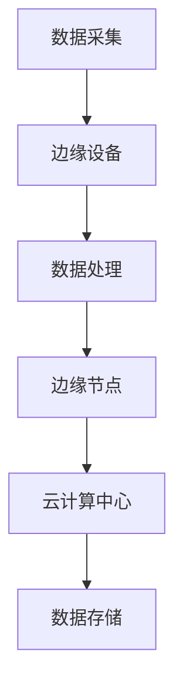

                 

### 文章标题：2024百度智能云边缘计算社招面试真题汇总及其解答

### 关键词：边缘计算、智能云、面试真题、解题思路、技术解析

### 摘要：

本文旨在汇总2024年百度智能云边缘计算社招面试的真题，并详细解答每一道题目的核心要点。通过深入剖析，帮助读者理解边缘计算在智能云应用中的重要性，掌握面试解题思路，提升面试技巧。文章将涵盖边缘计算的基本概念、核心算法原理、实际应用场景、开发工具推荐等，为有意向从事智能云计算领域的技术人员提供全面的指导和参考。

## 1. 背景介绍

边缘计算（Edge Computing）是近年来随着物联网、5G、大数据等技术的发展而逐渐兴起的一个新兴领域。它将计算、存储、网络功能从中心云迁移到网络边缘，即在靠近数据源或终端设备的地理位置进行数据处理和存储，从而降低网络延迟、提升响应速度、增强系统安全性和可靠性。

百度智能云作为国内领先的云计算服务提供商，在边缘计算领域具有丰富的技术积累和应用实践。边缘计算在百度智能云中的应用涵盖了智能交通、智慧城市、工业物联网等多个领域，为各行业提供了高效、可靠的计算服务。

本文将基于2024年百度智能云边缘计算社招面试真题，逐一解析每一道题目的解答思路和关键技术点，帮助读者更好地准备面试，了解边缘计算的核心技术和应用场景。

## 2. 核心概念与联系

### 2.1 边缘计算的基本概念

边缘计算是指在网络边缘（如传感器、智能终端、企业内部网络等）进行数据采集、处理和存储的一种计算模式。与传统云计算相比，边缘计算具有以下几个特点：

1. **数据本地处理**：边缘计算将数据处理的任务从中心云迁移到网络边缘，减少了数据传输的延迟和带宽消耗。
2. **分布式计算**：边缘计算通过分布式计算架构，实现了计算资源的灵活调度和优化利用。
3. **低延迟和高可靠性**：边缘计算靠近数据源，可以大幅降低数据传输的延迟，提高系统的响应速度和稳定性。

### 2.2 边缘计算的关键技术

边缘计算涉及多个关键技术的协同作用，主要包括：

1. **云计算与边缘计算协同**：通过云计算和边缘计算的协同，实现资源的共享和优化，提高计算效率和可靠性。
2. **边缘设备管理**：对边缘设备进行有效的管理和调度，包括设备的维护、升级、监控等。
3. **边缘网络优化**：优化边缘网络架构，提高网络传输效率和稳定性。
4. **数据安全和隐私保护**：在边缘计算中，数据的安全和隐私保护至关重要，需要采取有效的安全措施和数据加密算法。
5. **人工智能与边缘计算**：人工智能技术可以在边缘设备上进行本地化处理，降低数据传输的带宽和延迟。

### 2.3 边缘计算的应用场景

边缘计算在多个领域具有广泛的应用，主要包括：

1. **智能交通**：边缘计算可以用于交通信号优化、实时路况监测和预测、车辆监控等，提高交通效率和安全性。
2. **智慧城市**：边缘计算可以用于城市安全监控、环境监测、智能照明等，提升城市管理的智能化水平。
3. **工业物联网**：边缘计算可以用于设备监控、预测性维护、生产流程优化等，提高工业生产的自动化和智能化水平。

### 2.4 边缘计算架构的 Mermaid 流程图

以下是一个简单的边缘计算架构的 Mermaid 流程图，展示了边缘计算的基本原理和关键组件：

在这个流程图中，数据采集于边缘设备，通过数据处理和边缘节点，最终传输到云计算中心进行存储和处理。这个过程体现了边缘计算的基本原理和架构。

## 3. 核心算法原理 & 具体操作步骤

### 3.1 边缘计算中的常见算法

边缘计算中涉及多种算法，以下是一些常见的算法及其原理：

1. **机器学习算法**：边缘计算中常用的机器学习算法包括线性回归、决策树、支持向量机（SVM）等。这些算法可以在边缘设备上进行本地化处理，降低数据传输的带宽和延迟。
2. **深度学习算法**：边缘计算中的深度学习算法包括卷积神经网络（CNN）、循环神经网络（RNN）等。这些算法可以用于图像识别、自然语言处理等任务。
3. **数据聚合算法**：数据聚合算法用于将多个边缘设备采集的数据进行汇总和处理，如均值、中位数、标准差等。
4. **区块链算法**：区块链算法用于确保边缘计算中的数据安全和隐私保护。

### 3.2 边缘计算中的具体操作步骤

以下是一个简单的边缘计算操作步骤示例，用于说明边缘计算中的数据处理和传输过程：

1. **数据采集**：边缘设备（如传感器）采集数据，并将数据上传到边缘节点。
2. **数据处理**：边缘节点对接收到的数据进行初步处理，如去噪、标准化等。
3. **数据传输**：处理后的数据通过边缘网络传输到云计算中心。
4. **数据存储**：云计算中心对接收到的数据进行存储和处理。
5. **数据反馈**：云计算中心将处理结果反馈给边缘设备，以便进行后续操作。

### 3.3 边缘计算算法的优化方法

为了提高边缘计算的效率和性能，可以采用以下几种优化方法：

1. **模型压缩**：通过模型压缩技术，将大规模的机器学习模型压缩成小规模的模型，以便在边缘设备上运行。
2. **模型迁移**：将云计算中心的大型模型迁移到边缘设备，实现本地化处理。
3. **分布式计算**：通过分布式计算架构，实现边缘设备之间的协同处理，提高计算效率和性能。
4. **能耗优化**：通过能耗优化技术，降低边缘设备的工作能耗，提高设备的使用寿命。

## 4. 数学模型和公式 & 详细讲解 & 举例说明

### 4.1 边缘计算中的数学模型

边缘计算中涉及多个数学模型，以下是一些常见的数学模型及其应用：

1. **卷积神经网络（CNN）**：卷积神经网络是一种用于图像识别的深度学习模型。其基本公式如下：

   $$ f(x) = \sigma(w \cdot x + b) $$

   其中，$f(x)$ 是输出，$x$ 是输入特征，$w$ 是权重，$b$ 是偏置，$\sigma$ 是激活函数。

2. **支持向量机（SVM）**：支持向量机是一种用于分类的机器学习模型。其基本公式如下：

   $$ y = \text{sign}(\sum_{i=1}^{n} w_i \cdot x_i + b) $$

   其中，$y$ 是输出标签，$x_i$ 是输入特征，$w_i$ 是权重，$b$ 是偏置，$\text{sign}$ 是符号函数。

3. **线性回归**：线性回归是一种用于回归分析的机器学习模型。其基本公式如下：

   $$ y = w \cdot x + b $$

   其中，$y$ 是输出值，$x$ 是输入特征，$w$ 是权重，$b$ 是偏置。

### 4.2 数学模型的详细讲解和举例说明

以下是对边缘计算中一些常见数学模型的详细讲解和举例说明：

#### 4.2.1 卷积神经网络（CNN）

卷积神经网络是一种用于图像识别的深度学习模型。以下是一个简单的卷积神经网络模型：

- 输入层：图像像素数据。
- 卷积层：对图像进行卷积操作，提取特征。
- 池化层：对卷积特征进行池化操作，降低特征维度。
- 全连接层：对池化特征进行全连接操作，得到分类结果。

以下是一个卷积神经网络模型的数学公式：

$$ f(x) = \sigma(w \cdot x + b) $$

其中，$f(x)$ 是输出，$x$ 是输入特征，$w$ 是权重，$b$ 是偏置，$\sigma$ 是激活函数。

例如，假设一个卷积神经网络模型包含一个输入层、两个卷积层、一个池化层和一个全连接层。输入图像的大小为 $32 \times 32 \times 3$，卷积核大小为 $3 \times 3$，激活函数为 ReLU。

第一个卷积层的权重为 $W_1$，偏置为 $b_1$，输出为 $h_1$：

$$ h_1 = \sigma(W_1 \cdot x + b_1) $$

第二个卷积层的权重为 $W_2$，偏置为 $b_2$，输出为 $h_2$：

$$ h_2 = \sigma(W_2 \cdot h_1 + b_2) $$

池化层的输出为 $p_2$：

$$ p_2 = \text{max}(h_2) $$

全连接层的权重为 $W_3$，偏置为 $b_3$，输出为 $y$：

$$ y = \sigma(W_3 \cdot p_2 + b_3) $$

#### 4.2.2 支持向量机（SVM）

支持向量机是一种用于分类的机器学习模型。以下是一个简单

