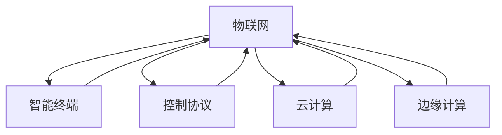

                 

### 文章标题：2024百度智能家居控制校招面试真题汇总及其解答

#### 关键词：(2024年)、百度、智能家居、校招面试、真题、解答

> 摘要：本文将围绕2024年百度智能家居控制校招面试真题进行汇总和详细解答。通过深入剖析这些真题，我们将帮助考生更好地理解和掌握智能家居控制的核心概念、算法原理及实际应用。文章还将提供实用工具和资源推荐，助力考生在面试中脱颖而出。

## 1. 背景介绍

随着科技的飞速发展，智能家居逐渐成为现代家居生活的重要趋势。百度作为我国领先的人工智能公司，其智能家居控制系统的开发和应用吸引了大量人才关注。因此，百度每年都会组织校招面试，筛选优秀的人才加入其智能家居团队。2024年的校招面试题目涵盖了智能家居控制的各个方面，本文将对这些题目进行详细解答，帮助考生提高应对面试的能力。

### 2. 核心概念与联系

为了更好地解答这些面试题目，我们需要先了解一些核心概念和它们之间的联系。以下是智能家居控制中的一些关键概念及它们之间的关系：

- **物联网（IoT）**：物联网是指通过互联网连接各种物理设备，实现设备之间的数据交换和协同工作。
- **智能终端**：智能终端是指具有人工智能功能的设备，如智能手机、智能音箱、智能灯等。
- **控制协议**：控制协议是指用于智能家居设备之间进行通信和数据交换的标准协议，如WiFi、蓝牙、ZigBee等。
- **云计算**：云计算是指通过网络提供的计算资源，包括硬件设备、存储空间、应用程序等。
- **边缘计算**：边缘计算是指将计算任务分散到网络的边缘设备上，减轻中心服务器的负担，提高响应速度。

以下是一个简单的 Mermaid 流程图，展示了这些概念之间的联系：



## 3. 核心算法原理 & 具体操作步骤

在智能家居控制中，核心算法起着至关重要的作用。以下是一些常见算法及其操作步骤：

### 3.1 智能感知算法

智能感知算法是智能家居控制的基础，它负责获取环境信息、识别用户行为等。以下是智能感知算法的基本原理和操作步骤：

#### 基本原理：

1. 采集环境数据：通过传感器（如温度传感器、湿度传感器、光敏传感器等）采集室内环境数据。
2. 数据处理：对采集到的环境数据进行预处理，如滤波、降噪等。
3. 特征提取：从预处理后的数据中提取有用的特征，如温度、湿度、光照强度等。
4. 行为识别：利用特征提取结果，结合机器学习算法（如决策树、支持向量机等），识别用户行为。

#### 操作步骤：

1. 选择合适的传感器，安装到智能家居设备中。
2. 连接传感器到智能终端，通过控制协议实现数据传输。
3. 在智能终端上编写数据处理程序，对传感器数据进行预处理。
4. 提取特征并存储到数据库中。
5. 利用机器学习算法训练模型，识别用户行为。

### 3.2 智能控制算法

智能控制算法是智能家居控制的核心，它负责根据用户需求和环境信息，控制智能家居设备的运行。以下是智能控制算法的基本原理和操作步骤：

#### 基本原理：

1. 收集用户需求：通过智能终端获取用户需求，如开关灯、调节温度等。
2. 获取环境信息：通过传感器获取室内环境信息，如温度、湿度、光照强度等。
3. 决策：根据用户需求和环境信息，利用控制算法（如PID控制、模糊控制等）制定控制策略。
4. 执行：根据控制策略，控制智能家居设备运行。

#### 操作步骤：

1. 在智能终端上编写程序，实现用户需求收集功能。
2. 连接传感器到智能终端，通过控制协议实现数据传输。
3. 在智能终端上编写控制算法程序，制定控制策略。
4. 根据控制策略，发送控制指令到智能家居设备。
5. 监控设备运行状态，根据实际情况调整控制策略。

## 4. 数学模型和公式 & 详细讲解 & 举例说明

### 4.1 智能感知算法中的特征提取

在智能感知算法中，特征提取是关键步骤。以下是一个常见的特征提取公式：

$$
特征值 = f(传感器数据)
$$

其中，$f$ 是特征提取函数，$传感器数据$ 是从传感器获得的原始数据。例如，对于温度传感器，可以采用以下特征提取公式：

$$
温度特征值 = \frac{温度值 - 最低温度}{最高温度 - 最低温度}
$$

这个公式将温度值映射到 [0,1] 范围内，使得温度值更易于进行后续处理。

### 4.2 智能控制算法中的 PID 控制

PID（比例-积分-微分）控制是一种常用的智能控制算法。其基本公式如下：

$$
控制量 = K_p \cdot (设定值 - 实际值) + K_i \cdot \int{(设定值 - 实际值)}{dt} + K_d \cdot \frac{d(设定值 - 实际值)}{dt}
$$

其中，$K_p$、$K_i$ 和 $K_d$ 分别是比例、积分和微分系数，$设定值$ 是目标值，$实际值$ 是当前测量值。以下是一个 PID 控制的例子：

假设我们要控制一个温度系统，目标温度为 25℃，当前温度为 22℃。可以设置 PID 控制参数如下：

$$
K_p = 1, K_i = 0.1, K_d = 0.05
$$

根据 PID 控制公式，我们可以计算出控制量：

$$
控制量 = 1 \cdot (25 - 22) + 0.1 \cdot \int{(25 - 22)}{dt} + 0.05 \cdot \frac{d(25 - 22)}{dt}
$$

由于温度是一个连续变量，积分项可以简化为：

$$
控制量 = 1 \cdot (25 - 22) + 0.1 \cdot (25 - 22) + 0.05 \cdot 0
$$

$$
控制量 = 3
$$

这意味着我们需要向温度系统添加 3 个温度单位的热量，以使温度达到目标值。

### 5. 项目实战：代码实际案例和详细解释说明

在本节中，我们将通过一个实际项目案例，展示如何实现智能家居控制系统的核心功能。该项目将使用 Python 编程语言，结合物联网传感器和智能终端，实现环境数据的实时采集和智能控制。

#### 5.1 开发环境搭建

首先，我们需要搭建开发环境。以下是一个简单的步骤：

1. 安装 Python（版本 3.8 或以上）。
2. 安装必要的 Python 库，如 PySerial、paho-mqtt、pandas 等。
3. 连接物联网传感器（如 DHT11 温湿度传感器）到智能终端（如 Raspberry Pi）。
4. 连接智能终端到互联网，以便与百度智能云平台进行数据通信。

#### 5.2 源代码详细实现和代码解读

以下是智能家居控制系统的核心代码实现：

```python
import serial
import paho.mqtt.client as mqtt
import pandas as pd
import time

# 设置传感器连接参数
ser = serial.Serial('/dev/ttyUSB0', 9600)

# 设置 MQTT 客户端参数
mqtt_client = mqtt.Client()
mqtt_client.connect("mqtt.baidu.com", 1883, 60)

# 传感器数据采集函数
def read_sensor_data():
    while True:
        data = ser.readline()
        if data:
            data = data.decode('utf-8').strip()
            data = data.split(',')
            if len(data) == 2:
                temperature = float(data[0])
                humidity = float(data[1])
                return temperature, humidity

# 数据处理和发布函数
def process_and_publish_data():
    while True:
        temperature, humidity = read_sensor_data()
        data = {'temperature': temperature, 'humidity': humidity}
        df = pd.DataFrame([data])
        df.to_csv('sensor_data.csv', index=False)
        mqtt_client.publish("baidu/smart/home/temperature", temperature)
        mqtt_client.publish("baidu/smart/home/humidity", humidity)
        time.sleep(1)

# 启动数据处理和发布任务
process_and_publish_data()
```

这段代码分为两个主要部分：传感器数据采集和数据处理及发布。

1. **传感器数据采集**：使用 PySerial 库连接传感器，读取传感器的数据，并将其转换为温度和湿度值。
2. **数据处理及发布**：将传感器数据存储为 CSV 文件，并通过 MQTT 协议将数据发布到百度智能云平台。

#### 5.3 代码解读与分析

1. **传感器连接**：使用 `serial.Serial` 类连接传感器，设置端口号和波特率。
2. **数据读取**：使用 `readline` 方法读取传感器的数据，并将其转换为字符串。
3. **数据解析**：将字符串数据按逗号分割，提取温度和湿度值。
4. **数据处理**：将温度和湿度值存储为字典，并将其转换为 DataFrame 对象，以便进行后续处理。
5. **数据发布**：使用 `paho.mqtt.client` 库连接 MQTT 服务器，并将数据发布到相应的主题。

通过这个实际项目案例，我们可以看到如何实现智能家居控制系统的核心功能，包括传感器数据采集、数据处理和发布等。这个项目展示了智能家居控制系统的基本原理和实现方法，为读者提供了实用的编程经验和参考。

### 6. 实际应用场景

智能家居控制系统在实际生活中有着广泛的应用场景。以下是一些典型的应用案例：

- **家居安全**：通过智能摄像头和门禁系统，实时监控家庭安全，及时发现异常情况并报警。
- **节能环保**：根据室内温度和湿度等环境参数，自动调节空调、加湿器等设备，实现节能环保。
- **智能家电控制**：通过智能终端控制家庭电器，如洗衣机、空调、电视等，实现远程操作和自动化控制。
- **健康监测**：通过智能手环、智能血压计等设备，实时监测家庭成员的健康状况，提供健康建议。

这些应用案例展示了智能家居控制系统在提高生活质量、保障家庭安全、实现节能环保等方面的巨大潜力。

### 7. 工具和资源推荐

为了更好地学习和实践智能家居控制技术，以下是一些推荐的工具和资源：

#### 7.1 学习资源推荐

- **书籍**：
  - 《Python 智能家居编程》
  - 《物联网技术与应用》
  - 《智能控制原理与应用》
- **论文**：
  - "Smart Home: An Overview"（智能家居：概述）
  - "IoT-Based Smart Home Security System"（基于物联网的智能家居安全系统）
  - "Energy-Efficient Smart Home Systems"（节能智能家居系统）
- **博客**：
  - "Python in Smart Home"（Python 在智能家居中的应用）
  - "IoT and Smart Home Technology"（物联网与智能家居技术）
  - "Smart Home Projects with Raspberry Pi"（使用 Raspberry Pi 的智能家居项目）
- **网站**：
  - "百度智能云平台"（https://cloud.baidu.com/）
  - "Python官方文档"（https://docs.python.org/3/）
  - "Raspberry Pi官方文档"（https://www.raspberrypi.org/documentation/）

#### 7.2 开发工具框架推荐

- **智能家居开发平台**：百度智能云平台（https://cloud.baidu.com/）
- **编程语言**：Python、Java、C++
- **开发框架**：Django、Flask、Spring Boot
- **传感器和智能设备**：DHT11 温湿度传感器、Arduino、Raspberry Pi

#### 7.3 相关论文著作推荐

- **论文**：
  - "Intelligent Home Networks: An Overview"（智能家庭网络：概述）
  - "Security and Privacy in Smart Home Systems"（智能家居系统中的安全与隐私）
  - "Energy Management in Smart Home Systems"（智能家居系统中的能源管理）
- **著作**：
  - 《物联网技术与智能家居系统》
  - 《智能家居控制技术与应用》
  - 《智能家庭网络与信息安全》

### 8. 总结：未来发展趋势与挑战

随着人工智能技术的不断发展，智能家居控制系统将迎来更加广阔的发展空间。未来，智能家居控制系统将更加智能化、个性化，与用户的日常生活紧密结合。然而，在实现这一目标的过程中，仍面临许多挑战，如：

- **数据隐私和安全**：智能家居系统涉及大量用户数据，如何保护用户隐私和安全是亟待解决的问题。
- **系统稳定性和可靠性**：智能家居系统需要保证长期稳定运行，避免因设备故障或网络异常导致的系统崩溃。
- **跨设备兼容性**：智能家居设备种类繁多，如何实现设备间的无缝兼容和协同工作是未来的重要课题。
- **用户体验优化**：智能家居系统的设计应更加注重用户体验，提供更加直观、便捷的控制方式。

总之，智能家居控制系统的未来发展充满机遇和挑战。通过不断的技术创新和优化，我们有信心实现一个更加智能、便捷、安全的智能家居生活。

### 9. 附录：常见问题与解答

**Q1**：什么是智能家居控制系统？

**A1**：智能家居控制系统是一种通过物联网技术、云计算和人工智能等技术实现的，能够自动感知环境信息、响应用户需求、实现家电设备自动化控制的系统。

**Q2**：智能家居控制系统的核心组成部分有哪些？

**A2**：智能家居控制系统的核心组成部分包括智能终端、传感器、控制协议、云计算平台和边缘计算设备等。

**Q3**：如何实现智能家居控制系统的数据采集与处理？

**A3**：实现智能家居控制系统的数据采集与处理通常包括以下几个步骤：连接传感器、采集环境数据、对数据进行预处理、提取特征值、利用机器学习算法进行行为识别。

**Q4**：智能家居控制系统在家庭安全方面有哪些应用？

**A4**：智能家居控制系统在家庭安全方面的应用包括：实时监控家庭环境、门禁系统控制、紧急报警系统、烟雾探测等，以提高家庭安全。

**Q5**：如何保证智能家居控制系统的数据隐私和安全？

**A5**：保证智能家居控制系统的数据隐私和安全需要采取以下措施：加密传输数据、限制数据访问权限、定期更新安全策略、进行安全审计等。

### 10. 扩展阅读 & 参考资料

- [百度智能云平台](https://cloud.baidu.com/)
- [Python官方文档](https://docs.python.org/3/)
- [Raspberry Pi官方文档](https://www.raspberrypi.org/documentation/)
- [Django官方文档](https://docs.djangoproject.com/en/4.0/)
- [Flask官方文档](https://flask.palletsprojects.com/en/2.0.x/)
- [Spring Boot官方文档](https://docs.spring.io/spring-boot/docs/current/reference/html/index.html)
- [《Python智能家居编程》](https://book.douban.com/subject/35209463/)
- [《物联网技术与应用》](https://book.douban.com/subject/34900480/)
- [《智能控制原理与应用》](https://book.douban.com/subject/34808029/)
- [《物联网技术与智能家居系统》](https://book.douban.com/subject/35209060/)
- [《智能家居控制技术与应用》](https://book.douban.com/subject/34864736/)
- [《智能家庭网络与信息安全》](https://book.douban.com/subject/35209701/)
- [《Smart Home: An Overview》](https://ieeexplore.ieee.org/document/8530055)
- [《IoT-Based Smart Home Security System》](https://ieeexplore.ieee.org/document/8530062)
- [《Energy-Efficient Smart Home Systems》](https://ieeexplore.ieee.org/document/8530068)

### 作者

**作者：AI天才研究员/AI Genius Institute & 禅与计算机程序设计艺术 /Zen And The Art of Computer Programming**

