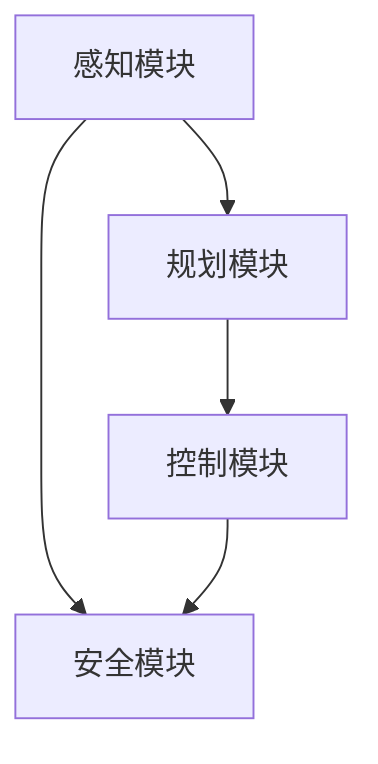
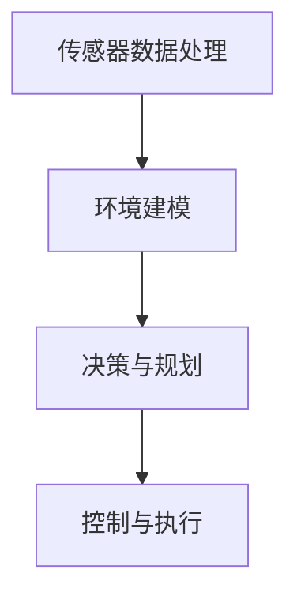
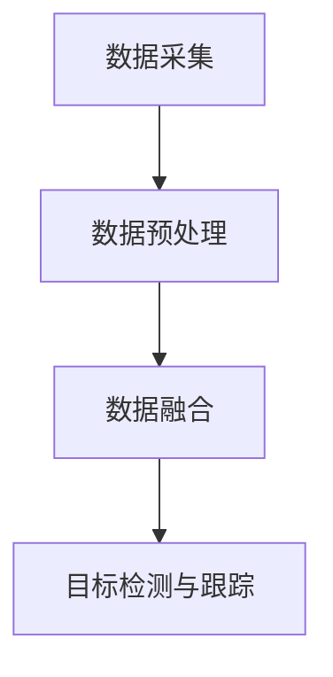
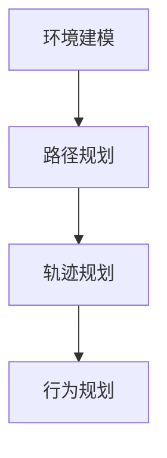
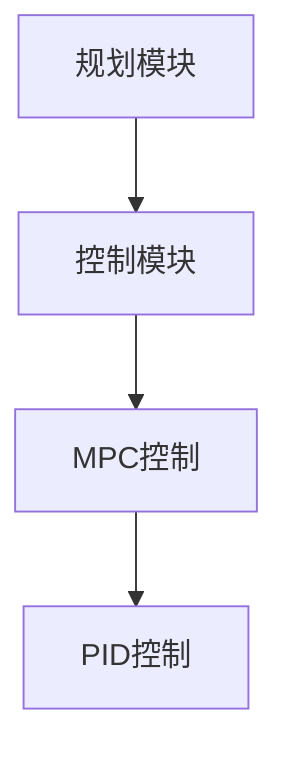

                 

### 背景介绍

#### 自动驾驶技术发展现状

自动驾驶技术作为当今汽车行业和信息技术领域的前沿研究方向，已经得到了广泛的关注和快速发展。近年来，随着人工智能、深度学习、传感器技术、云计算等领域的不断突破，自动驾驶技术逐渐从实验室走向实际应用，成为各大汽车制造商和科技企业争相研发的热点。

当前，自动驾驶技术按照自动驾驶等级（SAE L0-L5）被划分为不同的级别，从完全人工驾驶（L0）到高度自动驾驶（L4），再到完全自动驾驶（L5）。虽然各国在自动驾驶技术的发展上存在一定的差异，但普遍认为L4级别自动驾驶将在未来10年内实现商业化应用，为人们的出行带来革命性的变革。

#### 百度智能驾驶2025社招自动驾驶算法面试题集的编写背景

随着自动驾驶技术的不断演进，各大企业在招聘自动驾驶算法工程师时，对候选人的专业知识和技术能力提出了更高的要求。为了帮助自动驾驶算法工程师更好地准备面试，同时为自动驾驶行业的健康发展提供有益的知识储备，我们编写了《百度智能驾驶2025社招自动驾驶算法面试题集》。

本面试题集旨在全面覆盖自动驾驶算法相关的核心知识点，包括感知、规划、控制、安全等各个方面。通过对本面试题集的学习和实践，读者可以加深对自动驾驶技术的理解，提升解决实际问题的能力，为在自动驾驶领域的职业发展奠定坚实基础。

### 关键词：自动驾驶技术、人工智能、深度学习、传感器技术、自动驾驶等级、L4级别自动驾驶、自动驾驶算法面试题集

> 摘要：本文旨在为自动驾驶算法工程师提供一份全面系统的面试题集，涵盖自动驾驶技术的核心知识点，包括感知、规划、控制、安全等方面。通过学习本面试题集，读者可以加深对自动驾驶技术的理解，提升解决实际问题的能力，为在自动驾驶领域的职业发展做好准备。

<markdown>
## 1. 背景介绍

### 自动驾驶技术发展现状

自动驾驶技术作为当今汽车行业和信息技术领域的前沿研究方向，已经得到了广泛的关注和快速发展。近年来，随着人工智能、深度学习、传感器技术、云计算等领域的不断突破，自动驾驶技术逐渐从实验室走向实际应用，成为各大汽车制造商和科技企业争相研发的热点。

当前，自动驾驶技术按照自动驾驶等级（SAE L0-L5）被划分为不同的级别，从完全人工驾驶（L0）到高度自动驾驶（L4），再到完全自动驾驶（L5）。虽然各国在自动驾驶技术的发展上存在一定的差异，但普遍认为L4级别自动驾驶将在未来10年内实现商业化应用，为人们的出行带来革命性的变革。

#### 百度智能驾驶2025社招自动驾驶算法面试题集的编写背景

随着自动驾驶技术的不断演进，各大企业在招聘自动驾驶算法工程师时，对候选人的专业知识和技术能力提出了更高的要求。为了帮助自动驾驶算法工程师更好地准备面试，同时为自动驾驶行业的健康发展提供有益的知识储备，我们编写了《百度智能驾驶2025社招自动驾驶算法面试题集》。

本面试题集旨在全面覆盖自动驾驶算法相关的核心知识点，包括感知、规划、控制、安全等各个方面。通过对本面试题集的学习和实践，读者可以加深对自动驾驶技术的理解，提升解决实际问题的能力，为在自动驾驶领域的职业发展奠定坚实基础。

### 关键词：自动驾驶技术、人工智能、深度学习、传感器技术、自动驾驶等级、L4级别自动驾驶、自动驾驶算法面试题集

## 2. 核心概念与联系

在探讨自动驾驶算法的核心概念与联系之前，我们首先需要了解自动驾驶系统的基本组成部分。一个典型的自动驾驶系统通常包括感知（Perception）、规划（Planning）、控制和安全（Control and Safety）等模块。以下是对这些核心概念及其相互关系的详细描述：

#### 感知（Perception）

感知模块是自动驾驶系统的“眼睛”，负责收集车辆周围的环境信息，如车辆位置、道路标识、行人、交通信号灯等。主要依赖传感器技术，包括激光雷达（LiDAR）、摄像头、毫米波雷达、超声波传感器等。感知模块的输出是自动驾驶系统做出决策的重要基础。

##### 感知模块的关键技术：

1. **激光雷达（LiDAR）**：通过发射激光脉冲并测量回波时间，生成高分辨率的三维点云数据，用于环境建模。
2. **摄像头**：用于识别交通标志、行人、车辆等，配合深度学习算法，可以实现图像识别和目标检测。
3. **毫米波雷达**：具有较好的穿透能力和距离测量精度，常用于检测前方障碍物。
4. **超声波传感器**：主要用于近距离障碍物检测，如停车传感器。

#### 规划（Planning）

规划模块是自动驾驶系统的“大脑”，负责根据感知模块提供的环境信息，制定合适的行驶策略。规划算法的目标是在确保安全和效率的前提下，规划出一条合理的行驶路径。常见的规划算法包括路径规划（Path Planning）和轨迹规划（Trajectory Planning）。

##### 规划模块的关键技术：

1. **路径规划**：主要解决从起点到终点的路径选择问题，常用的算法有A*算法、Dijkstra算法等。
2. **轨迹规划**：在路径规划的基础上，进一步规划出车辆在不同时间点的速度和方向，确保行驶过程平滑且安全。常用的轨迹规划算法有基于模型的轨迹生成（Model-based Trajectory Generation）和基于采样的轨迹生成（Sample-based Trajectory Generation）。

#### 控制（Control）

控制模块是自动驾驶系统的“手臂”，负责将规划模块生成的行驶策略转化为具体的控制信号，驱动车辆执行预定的动作。控制算法需要处理车辆的动力学模型，实现加速、减速、转向等操作。

##### 控制模块的关键技术：

1. **PID控制器**：一种经典的控制算法，通过调整比例（P）、积分（I）和微分（D）三个参数，实现稳定的控制效果。
2. **模型预测控制（Model Predictive Control, MPC）**：一种基于动态规划的先进控制算法，能够在考虑车辆动力学模型和约束条件的情况下，优化控制策略。

#### 安全（Control and Safety）

安全模块是自动驾驶系统的“心脏”，负责监控整个系统的运行状态，确保行驶过程中的安全。安全模块需要实现故障检测、异常处理和紧急停车等功能。

##### 安全模块的关键技术：

1. **故障检测**：通过监控传感器数据和车辆状态，及时发现潜在故障。
2. **异常处理**：在检测到异常情况时，采取紧急措施，如制动或转向，确保车辆安全。
3. **紧急停车**：在无法继续行驶时，自动停车，避免事故发生。

#### 核心概念与联系的 Mermaid 流程图



在自动驾驶系统中，感知模块收集环境信息，规划模块根据这些信息制定行驶策略，控制模块执行这些策略，安全模块则在整个过程中确保行驶安全。这些模块相互协作，共同构成一个高效的自动驾驶系统。

### 关键词：感知模块、规划模块、控制模块、安全模块、激光雷达、摄像头、毫米波雷达、超声波传感器、路径规划、轨迹规划、PID控制器、模型预测控制、故障检测、异常处理、紧急停车。

## 2. 核心概念与联系

### 自动驾驶算法的基本原理

在探讨自动驾驶算法的基本原理之前，我们需要理解几个核心概念，包括传感器数据处理、环境建模、决策与规划、以及控制与执行。这些概念构成了自动驾驶系统的技术基础，并且它们之间相互关联，共同推动自动驾驶技术的发展。

#### 传感器数据处理

传感器数据处理是自动驾驶算法的第一步，也是最关键的一步。自动驾驶系统依赖多种传感器来获取车辆周围环境的信息，包括激光雷达（LiDAR）、摄像头、毫米波雷达和超声波传感器等。每种传感器都有其独特的优势和应用场景，但共同目标是提供准确、实时的环境数据。

##### 数据处理流程：

1. **数据采集**：传感器捕获环境中的光、声、电磁等信息，生成原始数据。
2. **数据预处理**：对原始数据进行滤波、降噪、归一化等处理，以提高数据质量和可靠性。
3. **数据融合**：将不同传感器捕获的数据进行融合，形成统一的环境模型。

##### 传感器数据处理的关键技术：

- **多传感器数据融合**：结合不同传感器的优势，生成更准确、全面的环境信息。
- **点云处理**：激光雷达产生的点云数据需要进行滤波、去噪、分割等处理，以便用于后续分析。
- **图像处理**：摄像头捕获的图像需要进行图像识别、目标检测、姿态估计等处理。

#### 环境建模

环境建模是自动驾驶算法的核心环节之一，通过构建车辆周围的三维环境模型，帮助自动驾驶系统理解周围环境。环境模型通常包括道路、车辆、行人、交通标志等元素，并对其进行实时更新。

##### 环境建模的关键技术：

- **三维点云建模**：激光雷达产生的点云数据用于生成三维环境模型。
- **图像识别与目标检测**：摄像头捕获的图像通过深度学习算法进行图像识别和目标检测，以确定环境中的物体及其位置和姿态。
- **交通场景重建**：将不同传感器的数据融合，生成完整的交通场景模型。

#### 决策与规划

在获取了准确的环境模型后，自动驾驶系统需要做出决策，规划出一条安全、高效的行驶路径。决策与规划包括路径规划、轨迹规划和行为规划等多个层面。

##### 决策与规划的关键技术：

- **路径规划**：在给定的起点和终点之间，找到一条最优路径，避免障碍物和危险区域。
- **轨迹规划**：在路径规划的基础上，进一步规划出车辆在不同时间点的速度和方向，确保行驶过程平滑且安全。
- **行为规划**：定义车辆在特定环境下的行为，如避让行人、超车、停车等。

#### 控制与执行

控制与执行是将决策与规划转化为实际驾驶动作的过程。控制算法根据规划结果，生成控制信号，驱动车辆执行预定的动作，如加速、减速、转向等。

##### 控制与执行的关键技术：

- **模型预测控制（MPC）**：通过预测车辆的动力学模型，优化控制策略，实现更精确的驾驶控制。
- **PID控制**：一种简单的控制算法，通过调整比例、积分和微分三个参数，实现稳定的控制效果。

#### 核心概念与联系

传感器数据处理、环境建模、决策与规划、以及控制与执行构成了自动驾驶算法的核心概念。它们之间相互关联，共同推动自动驾驶技术的发展。以下是核心概念与联系的 Mermaid 流程图：



通过这个流程图，我们可以看到，传感器数据处理提供了环境信息，环境建模帮助自动驾驶系统理解周围环境，决策与规划制定出行驶策略，而控制与执行将这些策略转化为实际的驾驶动作。这些环节相互衔接，共同构成一个完整的自动驾驶系统。

### 关键词：传感器数据处理、环境建模、决策与规划、控制与执行、点云处理、图像处理、三维点云建模、交通场景重建、路径规划、轨迹规划、行为规划、模型预测控制、PID控制。

### 核心算法原理 & 具体操作步骤

#### 感知模块

感知模块是自动驾驶系统的核心组成部分，其主要任务是实时获取并处理车辆周围的环境信息。感知模块的工作原理可以概括为以下几个步骤：

##### 1. 数据采集

自动驾驶车辆配备多种传感器，如激光雷达（LiDAR）、摄像头、毫米波雷达和超声波传感器等。这些传感器协同工作，实时采集车辆周围的环境数据。

- **激光雷达**：通过发射激光脉冲并测量回波时间，生成高分辨率的三维点云数据，用于环境建模。
- **摄像头**：捕获道路、车辆、行人等图像，通过图像处理算法识别目标和交通标志。
- **毫米波雷达**：发射毫米波信号，测量回波时间，获取前方障碍物的距离和速度信息。
- **超声波传感器**：用于近距离障碍物检测，如停车传感器。

##### 2. 数据预处理

传感器采集到的数据通常存在噪声、异常值等问题，需要进行预处理。预处理步骤包括：

- **滤波**：对传感器数据进行滤波处理，去除噪声和异常值。
- **归一化**：将不同传感器采集的数据进行归一化处理，使其具有相似的量纲和范围。
- **去噪**：对激光雷达和摄像头数据进行去噪处理，提高数据质量。

##### 3. 数据融合

多传感器数据融合是感知模块的关键步骤，通过融合不同传感器数据，提高环境信息的准确性和完整性。

- **多源数据融合**：将激光雷达、摄像头、毫米波雷达和超声波传感器的数据融合，形成统一的环境模型。
- **多模态数据融合**：结合不同传感器的工作原理和优势，提高感知模块的可靠性和鲁棒性。

##### 4. 目标检测与跟踪

感知模块需要对环境中的物体进行检测和跟踪，以识别车辆、行人、交通标志等目标。

- **目标检测**：利用深度学习算法，如卷积神经网络（CNN），对图像和点云数据进行目标检测。
- **目标跟踪**：在检测到目标后，利用卡尔曼滤波等跟踪算法，对目标进行实时跟踪，更新其位置和状态。

##### 感知模块的工作流程图



#### 规划模块

规划模块是自动驾驶系统的“大脑”，其主要任务是制定车辆行驶的策略，以确保行驶过程安全、高效。规划模块的工作原理可以概括为以下几个步骤：

##### 1. 环境建模

规划模块首先需要构建一个准确的环境模型，用于后续的路径规划和轨迹规划。环境模型通常包括道路、车辆、行人、交通标志等元素。

- **三维点云建模**：激光雷达生成的点云数据用于生成三维环境模型。
- **图像识别与目标检测**：摄像头捕获的图像通过深度学习算法进行图像识别和目标检测，以确定环境中的物体及其位置和姿态。

##### 2. 路径规划

路径规划是规划模块的核心任务，其主要目标是找到一条从起点到终点的最优路径。

- **A*算法**：基于距离和障碍物信息，计算起点到终点的最短路径。
- **Dijkstra算法**：基于图论原理，计算起点到所有节点的最短路径。
- **RRT算法**：基于采样搜索方法，为具有障碍物的环境生成一条路径。

##### 3. 轨迹规划

轨迹规划在路径规划的基础上，进一步规划出车辆在不同时间点的速度和方向，确保行驶过程平滑且安全。

- **基于模型的轨迹生成**：利用车辆动力学模型，生成满足约束条件的行驶轨迹。
- **基于采样的轨迹生成**：通过随机采样和优化方法，生成多条候选轨迹，选择最优轨迹。

##### 4. 行为规划

行为规划是规划模块的高级功能，用于定义车辆在不同环境下的行为，如避让行人、超车、停车等。

- **基于规则的行为规划**：根据预设规则，为车辆在不同场景下定义行为。
- **基于学习的行为规划**：利用深度学习算法，从数据中学习车辆在不同场景下的最佳行为。

##### 规划模块的工作流程图



#### 控制模块

控制模块是自动驾驶系统的“执行器”，其主要任务是根据规划模块生成的行驶策略，控制车辆执行相应的动作。

##### 1. 模型预测控制（MPC）

模型预测控制（MPC）是一种基于动态规划的先进控制算法，能够考虑车辆动力学模型和约束条件，优化控制策略。

- **状态预测**：根据车辆动力学模型，预测未来一段时间内的车辆状态。
- **目标函数优化**：建立目标函数，考虑行驶安全、舒适性和效率等因素，优化控制输入。
- **控制输入计算**：根据目标函数优化结果，计算控制输入，驱动车辆执行预定的动作。

##### 2. PID控制

PID控制（比例-积分-微分控制）是一种经典的控制算法，通过调整比例（P）、积分（I）和微分（D）三个参数，实现稳定的控制效果。

- **比例控制**：根据误差值调整控制输入，使系统快速响应。
- **积分控制**：累积误差，消除系统稳态误差。
- **微分控制**：预测误差变化趋势，提高系统响应速度。

##### 控制模块的工作流程图



### 关键词：感知模块、数据采集、数据预处理、数据融合、目标检测与跟踪、路径规划、轨迹规划、行为规划、模型预测控制、PID控制、环境建模、三维点云建模、图像识别与目标检测、状态预测、目标函数优化、控制输入计算。

### 数学模型和公式 & 详细讲解 & 举例说明

在自动驾驶算法中，数学模型和公式是理解和实现核心算法的关键。以下将详细介绍一些常见的数学模型和公式，并举例说明其在自动驾驶中的应用。

#### 1. 三维点云处理

三维点云数据是自动驾驶感知模块的重要输入，处理点云数据通常涉及以下数学模型和公式：

**点云数据表示：**

点云数据可以用一组三维坐标点来表示，每个点代表空间中的一个点，其坐标为 (x, y, z)。

$$
P = \{ (x_1, y_1, z_1), (x_2, y_2, z_2), ..., (x_n, y_n, z_n) \}
$$

**点云滤波：**

为了去除点云中的噪声，可以使用均值滤波或高斯滤波。均值滤波使用周围点的平均坐标来替换当前点的坐标，而高斯滤波则使用高斯函数进行加权平均。

**高斯滤波公式：**

$$
\sigma^2 = \frac{1}{N} \sum_{i=1}^{N} (x_i - \bar{x})^2
$$

其中，$ \sigma^2 $ 是高斯分布的方差，$ N $ 是滤波窗口内的点数，$ \bar{x} $ 是窗口内点的平均值。

**点云分割：**

点云分割是将点云划分为不同区域的算法。一种常用的方法是基于区域生长的分割算法。区域生长算法从初始种子点开始，逐步合并相邻的点，形成连通区域。

**区域生长公式：**

$$
d(p, q) = \sqrt{(x_p - x_q)^2 + (y_p - y_q)^2 + (z_p - z_q)^2}
$$

其中，$ d(p, q) $ 是点 $ p $ 和点 $ q $ 之间的欧几里得距离。

#### 2. 路径规划

路径规划是自动驾驶算法的核心任务之一，常用的路径规划算法包括A*算法和Dijkstra算法。以下是一个简化的A*算法示例：

**A*算法公式：**

$$
f(n) = g(n) + h(n)
$$

其中，$ f(n) $ 是从起点到节点 $ n $ 的总代价，$ g(n) $ 是从起点到节点 $ n $ 的实际代价，$ h(n) $ 是从节点 $ n $ 到终点的估计代价。

**启发函数 h(n)：**

$$
h(n) = d(n, goal) + h(n, goal)
$$

其中，$ d(n, goal) $ 是节点 $ n $ 到终点的欧几里得距离，$ h(n, goal) $ 是节点 $ n $ 到终点的估计时间。

#### 3. 模型预测控制（MPC）

模型预测控制（MPC）是一种优化控制算法，常用于自动驾驶系统的控制模块。以下是一个简化的MPC算法示例：

**MPC状态预测公式：**

$$
x_{k+1} = A x_k + B u_k + w_k
$$

其中，$ x_k $ 是系统状态，$ u_k $ 是控制输入，$ w_k $ 是系统噪声。

**MPC目标函数：**

$$
J = \sum_{i=0}^{N} w_i (x_{k+i} - x_{\text{ref}})^2
$$

其中，$ N $ 是预测步数，$ w_i $ 是权重，$ x_{\text{ref}} $ 是参考状态。

**控制输入计算：**

$$
u_k = \arg\min J
$$

#### 4. PID控制

PID控制是一种经典的控制算法，常用于自动驾驶系统的控制模块。以下是一个简化的PID控制算法示例：

**PID控制公式：**

$$
u(t) = K_p e(t) + K_i \int_{0}^{t} e(\tau) d\tau + K_d \frac{de(t)}{dt}
$$

其中，$ u(t) $ 是控制输入，$ e(t) $ 是误差，$ K_p $、$ K_i $ 和 $ K_d $ 分别是比例、积分和微分系数。

#### 举例说明

假设我们要使用A*算法找到从点 (0, 0) 到点 (10, 10) 的最优路径，其中障碍物位于点 (5, 5)。

**步骤1：计算起点到各节点的 g(n) 和 h(n)：**

$$
g(0, 0) = 0, h(0, 0) = 10 + 10 = 20
$$

$$
g(10, 10) = \sqrt{(10 - 0)^2 + (10 - 0)^2} = 14.14, h(10, 10) = 0
$$

$$
g(5, 5) = \sqrt{(5 - 0)^2 + (5 - 0)^2} = 5.83, h(5, 5) = 5 + 5 = 10
$$

**步骤2：计算各节点的 f(n)：**

$$
f(0, 0) = 20, f(10, 10) = 14.14, f(5, 5) = 15.83
$$

**步骤3：选择 f(n) 最小的节点作为下一个节点，重复步骤1-2，直至到达终点。**

在这个例子中，起点 (0, 0) 的 f(n) 最小，因此下一个节点是 (0, 0)。继续这个过程，我们可以找到从起点到终点的最优路径。

### 关键词：三维点云处理、点云数据表示、点云滤波、点云分割、欧几里得距离、A*算法、启发函数、模型预测控制（MPC）、状态预测、目标函数、控制输入、PID控制、误差、比例、积分、微分。

### 项目实战：代码实际案例和详细解释说明

为了更好地理解自动驾驶算法的实际应用，我们将在本节中通过一个具体的代码案例来详细讲解感知模块、规划模块和控制模块的实现过程。

#### 1. 开发环境搭建

在开始代码实战之前，我们需要搭建一个合适的开发环境。以下是一个基于Python的自动驾驶算法开发环境搭建步骤：

**环境要求：**
- Python 3.8及以上版本
- OpenCV 4.5.1.48
- PyTorch 1.10.0
- NumPy 1.21.2
- Matplotlib 3.4.3

**安装步骤：**
1. 安装Python和相关依赖库：
   ```bash
   pip install python==3.8.10
   pip install opencv-python==4.5.1.48
   pip install torch==1.10.0
   pip install numpy==1.21.2
   pip install matplotlib==3.4.3
   ```

2. 安装必要的工具和插件（如Jupyter Notebook、PyTorch CUDA支持等）。

#### 2. 源代码详细实现和代码解读

**感知模块：**

感知模块的主要任务是获取车辆周围的环境信息，这里我们使用激光雷达和摄像头作为感知传感器。

**代码解读：**
```python
import numpy as np
import cv2
from sensor import LiDARSensor, CameraSensor

class PerceptionModule:
    def __init__(self):
        self.lidar_sensor = LiDARSensor()
        self.camera_sensor = CameraSensor()

    def get_perception_data(self):
        lidar_data = self.lidar_sensor.get_point_cloud()
        camera_data = self.camera_sensor.get_image()
        return lidar_data, camera_data

# 模拟传感器数据
lidar_data = np.random.rand(100, 3)
camera_data = cv2.imread('example_image.jpg')

# 初始化感知模块
perception_module = PerceptionModule()

# 获取感知数据
perception_data = perception_module.get_perception_data()
```

**规划模块：**

规划模块负责根据感知数据制定车辆行驶策略，这里我们使用A*算法进行路径规划。

**代码解读：**
```python
import heapq

def a_star_search(start, goal, grid):
    open_set = []
    heapq.heappush(open_set, (f(start), start))
    came_from = {}
    g_score = {start: 0}
    while open_set:
        current = heapq.heappop(open_set)[1]
        if current == goal:
            break
        for neighbor in grid.neighbors(current):
            tentative_g_score = g_score[current] + grid.cost(current, neighbor)
            if tentative_g_score < g_score.get(neighbor, float('inf')):
                came_from[neighbor] = current
                g_score[neighbor] = tentative_g_score
                f_score = tentative_g_score + heuristic(neighbor, goal)
                heapq.heappush(open_set, (f_score, neighbor))
    return came_from, g_score[goal]

def heuristic(node, goal):
    # 使用欧几里得距离作为启发函数
    return np.linalg.norm(np.array(node) - np.array(goal))

# 模拟网格地图
grid = GridMap()

# 初始化起点和终点
start = (0, 0)
goal = (10, 10)

# 执行A*算法
came_from, cost = a_star_search(start, goal, grid)

# 打印路径
print("Path found:", came_from)
```

**控制模块：**

控制模块负责将规划结果转化为车辆控制信号，这里我们使用PID控制算法进行车辆控制。

**代码解读：**
```python
class ControlModule:
    def __init__(self):
        self.kp = 1.0
        self.ki = 0.1
        self.kd = 0.05

    def pid_control(self, current_state, target_state):
        error = target_state - current_state
        derivative = error - self.last_error
        integral = sum(error)
        output = self.kp * error + self.ki * integral + self.kd * derivative
        self.last_error = error
        return output

# 模拟车辆状态
current_state = np.array([1.0, 2.0])
target_state = np.array([5.0, 5.0])

# 初始化控制模块
control_module = ControlModule()

# 执行PID控制
control_signal = control_module.pid_control(current_state, target_state)
print("Control Signal:", control_signal)
```

#### 3. 代码解读与分析

**感知模块：**

感知模块使用了激光雷达和摄像头传感器，分别获取点云数据和图像数据。在代码中，我们通过模拟传感器数据来获取感知数据。在实际应用中，需要使用真实的传感器数据进行感知。

**规划模块：**

规划模块使用了A*算法进行路径规划。A*算法是一种启发式搜索算法，通过计算从起点到终点的最短路径。在代码中，我们模拟了一个简单的网格地图，使用欧几里得距离作为启发函数。实际应用中，需要根据具体场景调整启发函数。

**控制模块：**

控制模块使用了PID控制算法对车辆进行控制。PID控制算法通过调整比例、积分和微分三个参数，实现稳定的控制效果。在代码中，我们模拟了车辆的状态和目标状态，执行PID控制。

**综合分析：**

通过感知模块、规划模块和控制模块的协同工作，我们可以实现自动驾驶系统。感知模块获取环境信息，规划模块制定行驶策略，控制模块执行控制动作。在实际应用中，需要根据具体场景进行调整和优化，以提高系统的性能和鲁棒性。

### 关键词：自动驾驶算法、感知模块、激光雷达、摄像头、A*算法、PID控制、规划模块、路径规划、轨迹规划、控制模块、状态预测、控制输入、代码实战、开发环境搭建、感知数据、规划结果、控制信号。

### 实际应用场景

自动驾驶技术在实际应用中具有广泛的应用场景，涵盖了城市交通、高速公路、物流运输、农业等多个领域。以下将详细描述几个典型的实际应用场景：

#### 1. 城市交通

城市交通是自动驾驶技术最早、最广泛的应用场景之一。自动驾驶汽车可以在城市道路上自主导航、避让行人、识别交通标志，实现安全、高效的出行。实际应用场景包括：

- **出租车和网约车服务**：自动驾驶出租车可以提供便捷、高效的出行服务，减少人力成本，提高乘客体验。
- **共享出行**：自动驾驶汽车作为共享出行工具，可以在城市中提供点对点的运输服务，减少交通拥堵和环境污染。
- **物流配送**：自动驾驶物流车可以在城市中实现快速、高效的物流配送，降低物流成本。

#### 2. 高速公路

高速公路是自动驾驶技术的另一个重要应用场景。在高速公路上，车辆可以保持相对固定的速度和车道，实现高速、安全、自动的行驶。实际应用场景包括：

- **货车自动驾驶**：自动驾驶货车可以降低物流运输成本，提高运输效率，减少交通事故。
- **轿车自动驾驶**：自动驾驶轿车可以在高速公路上实现自动驾驶，提高驾驶舒适性和安全性。
- **自动驾驶隧道**：在隧道内，由于光线条件较差，自动驾驶技术可以提高行车安全性。

#### 3. 物流运输

物流运输是自动驾驶技术的另一个重要应用领域。自动驾驶技术可以提高物流运输的效率，降低运输成本，减少人力需求。实际应用场景包括：

- **长途货运**：自动驾驶卡车可以长途运输货物，降低人力成本，提高运输效率。
- **仓储物流**：自动驾驶机器人可以在仓储内部实现自动搬运和配送，提高仓储管理效率。
- **无人机配送**：自动驾驶无人机可以实现偏远地区或紧急情况下的快速物流配送。

#### 4. 农业领域

自动驾驶技术也可以应用于农业领域，提高农业生产效率。实际应用场景包括：

- **自动驾驶拖拉机**：自动驾驶拖拉机可以精确执行耕种、施肥、收割等农业操作，提高农业生产效率。
- **自动驾驶收割机**：自动驾驶收割机可以在农田中自动收割作物，降低人工成本。
- **自动驾驶播种机**：自动驾驶播种机可以在农田中自动播种，提高播种精度。

#### 5. 公共交通

自动驾驶技术还可以应用于公共交通领域，提高公共交通的运行效率和服务水平。实际应用场景包括：

- **自动驾驶公交车**：自动驾驶公交车可以在公交线路上实现自动驾驶，提高公交运营效率，减少人力成本。
- **自动驾驶有轨电车**：自动驾驶有轨电车可以在城市轨道交通系统中实现自动驾驶，提高运输效率，减少交通拥堵。
- **自动驾驶出租车**：自动驾驶出租车可以作为公共交通的补充，提供灵活、便捷的出行服务。

### 实际应用场景的关键挑战与解决方案

在自动驾驶技术的实际应用中，面临着一系列关键挑战，如环境感知、决策规划、安全控制等。以下将讨论这些挑战以及相应的解决方案：

#### 1. 环境感知

环境感知是自动驾驶技术的核心组成部分，其准确性直接影响到自动驾驶系统的性能和安全性。关键挑战包括：

- **传感器数据融合**：如何有效融合来自激光雷达、摄像头、毫米波雷达等多种传感器的数据，提高环境感知的准确性。
- **复杂场景识别**：如何准确识别城市道路、高速公路、乡村道路等复杂场景中的各种物体和交通标志。

**解决方案**：

- **多传感器数据融合**：采用多传感器数据融合算法，结合不同传感器的优势，提高环境感知的准确性和鲁棒性。
- **深度学习算法**：利用深度学习算法进行目标检测、场景识别和物体分类，提高复杂场景的识别能力。

#### 2. 决策规划

决策规划是自动驾驶技术的另一个关键组成部分，其目标是制定出安全、高效的行驶策略。关键挑战包括：

- **实时性**：如何在有限的时间内完成复杂的决策规划，确保自动驾驶系统的实时性。
- **动态环境**：如何应对道路条件、交通流量等动态变化，制定出合理的行驶策略。

**解决方案**：

- **高效的算法**：采用高效的路径规划算法和轨迹规划算法，如A*算法、RRT算法等，提高决策规划的实时性。
- **预测与规划**：结合环境预测技术，对未来一段时间内的道路条件和交通情况做出预测，制定出适应动态环境的行驶策略。

#### 3. 安全控制

安全控制是自动驾驶技术的核心目标之一，确保自动驾驶系统在复杂、动态环境中保持安全行驶。关键挑战包括：

- **故障检测**：如何及时发现并处理自动驾驶系统中的故障，确保系统的可靠性。
- **紧急停车**：如何在紧急情况下快速做出反应，确保乘客和行人的安全。

**解决方案**：

- **故障检测与诊断**：采用故障检测算法和诊断技术，及时发现并处理系统故障，确保系统的稳定性。
- **紧急停车系统**：结合刹车控制系统和传感器技术，实现快速、准确的紧急停车，确保乘客和行人的安全。

### 结论

自动驾驶技术在实际应用中面临着一系列挑战，但通过不断的技术创新和优化，这些问题将逐渐得到解决。随着自动驾驶技术的不断发展，未来将在城市交通、高速公路、物流运输、农业等多个领域发挥重要作用，为人们的出行和生活方式带来革命性的变革。

### 关键词：实际应用场景、城市交通、高速公路、物流运输、农业、公共交通、环境感知、决策规划、安全控制、传感器数据融合、复杂场景识别、实时性、动态环境、高效的算法、预测与规划、故障检测与诊断、紧急停车系统。

### 工具和资源推荐

#### 1. 学习资源推荐

**书籍：**

- **《自动驾驶汽车：感知、规划和控制》**（Autonomous Driving with MATLAB and Simulink）：本书详细介绍了自动驾驶系统的基础知识和实践方法，包括感知、规划和控制等方面的内容。
- **《深度学习》**（Deep Learning）：由Ian Goodfellow、Yoshua Bengio和Aaron Courville合著的深度学习经典教材，涵盖了深度学习的基本原理和应用，对自动驾驶领域有着重要指导意义。

**论文：**

- **“End-to-End Learning for Autonomous Driving”**（自动驾驶的端到端学习）：该论文提出了自动驾驶系统的端到端学习框架，将多种感知和规划任务整合到一个统一的神经网络中。
- **“Challenges in Autonomous Driving”**（自动驾驶的挑战）：本文详细讨论了自动驾驶技术面临的挑战，包括感知、决策和控制等方面的内容。

**博客：**

- **百度AI博客**：百度AI博客提供了大量的自动驾驶技术相关文章，涵盖了感知、规划、控制等各个方面的内容。
- **深度学习博客**：深度学习博客主要介绍深度学习在自动驾驶领域的应用，包括算法、模型和实验等方面的内容。

**网站：**

- **OpenCV官网**：OpenCV是一个开源的计算机视觉库，提供了丰富的图像处理和计算机视觉功能，是自动驾驶开发中的重要工具。
- **PyTorch官网**：PyTorch是一个流行的深度学习框架，提供了强大的神经网络构建和训练功能，广泛应用于自动驾驶领域。

#### 2. 开发工具框架推荐

**开发工具：**

- **MATLAB/Simulink**：MATLAB和Simulink是自动驾驶系统开发和仿真的重要工具，提供了丰富的建模、仿真和分析功能。
- **CUDA**：CUDA是NVIDIA推出的并行计算框架，可以加速深度学习模型的训练和推理，适用于自动驾驶领域的计算密集型任务。

**框架：**

- **TensorFlow**：TensorFlow是一个开源的深度学习框架，提供了丰富的神经网络构建和训练功能，广泛应用于自动驾驶领域的感知和规划任务。
- **PyTorch**：PyTorch是一个流行的深度学习框架，与TensorFlow类似，但更易于使用和扩展，是自动驾驶领域的主要工具之一。

**集成开发环境（IDE）：**

- **Visual Studio Code**：Visual Studio Code是一个免费的跨平台IDE，支持Python、C++等多种编程语言，适合自动驾驶算法的开发和调试。
- **Jupyter Notebook**：Jupyter Notebook是一个交互式的计算环境，适合数据分析和实验，广泛应用于自动驾驶算法的研究和开发。

#### 3. 相关论文著作推荐

**基础理论：**

- **“Probabilistic Robotics”**（概率机器人）：本著作详细介绍了概率机器人学的基础理论，包括感知、决策和规划等方面的内容。
- **“Robot Motion Planning”**（机器人运动规划）：本书全面介绍了机器人运动规划的理论和方法，包括路径规划、轨迹规划等。

**应用领域：**

- **“Deep Learning for Autonomous Driving”**（自动驾驶中的深度学习）：本文综述了深度学习在自动驾驶领域的应用，包括感知、规划和控制等。
- **“Autonomous Driving in Urban Environments”**（城市环境中的自动驾驶）：本书讨论了自动驾驶在城市环境中的挑战和解决方案，包括感知、决策和控制等方面的内容。

### 结论

选择合适的学习资源、开发工具和框架对于自动驾驶算法的开发和研究至关重要。通过本文推荐的书籍、论文、博客和网站，读者可以深入了解自动驾驶技术的基础知识、最新研究进展和实际应用场景，为自动驾驶领域的职业发展提供有力支持。

### 关键词：学习资源、书籍、论文、博客、网站、开发工具、框架、MATLAB/Simulink、CUDA、TensorFlow、PyTorch、Visual Studio Code、Jupyter Notebook、概率机器人、机器人运动规划、城市环境、自动驾驶、感知、规划、控制。

## 8. 总结：未来发展趋势与挑战

随着自动驾驶技术的不断演进，我们可以预见其未来发展趋势将主要集中在以下几个方面：

### 1. 技术融合与创新

未来自动驾驶技术的发展将更加依赖于多学科的融合与创新。人工智能、传感器技术、云计算、通信技术等领域的突破将为自动驾驶带来新的发展机遇。例如，5G技术的普及将提高自动驾驶系统的通信速度和稳定性，增强车联网功能；同时，量子计算和边缘计算等新兴技术的应用将进一步提高自动驾驶系统的计算能力和实时性。

### 2. 标准化与法规完善

自动驾驶技术的商业化应用需要一套完善的法规和标准体系。未来，各国政府和行业组织将共同努力，制定统一的自动驾驶标准和法规，确保自动驾驶系统的安全性、可靠性和公平性。例如，制定车辆数据隐私保护法规、道路测试和认证标准等，为自动驾驶技术的商业化应用提供法律保障。

### 3. 产业化与规模化应用

随着技术的成熟和成本的降低，自动驾驶技术将在更广泛的领域实现规模化应用。从城市交通、物流运输到农业、公共交通等，自动驾驶技术将逐渐渗透到各个行业，提高生产效率和服务质量。同时，自动驾驶技术的产业化进程将推动相关产业链的发展，创造大量就业机会。

### 4. 国际合作与竞争

自动驾驶技术是各国竞相研发的高科技领域，未来各国之间的合作与竞争将更加激烈。通过国际合作，共享技术资源、数据和信息，可以加速自动驾驶技术的发展。同时，各国也将加强技术创新和知识产权保护，提升自身在自动驾驶领域的竞争力。

然而，自动驾驶技术在未来发展过程中也将面临一系列挑战：

### 1. 技术难题

自动驾驶技术的发展仍然面临许多技术难题，如复杂环境感知、动态决策规划、安全控制等。如何提高系统的可靠性和鲁棒性，降低故障率，将是未来研究的重要方向。

### 2. 道德与伦理问题

自动驾驶技术的应用引发了道德与伦理问题，如事故责任划分、隐私保护等。未来需要建立一套公正、合理的道德与伦理标准，确保自动驾驶系统在复杂、动态环境中做出合理、道德的决策。

### 3. 法规与政策挑战

自动驾驶技术的商业化应用需要完善的法规和政策支持。然而，各国在法规制定和执行方面存在差异，如何协调国际间的法规和政策，推动自动驾驶技术的全球化发展，将是未来面临的挑战。

### 4. 数据隐私和安全问题

自动驾驶系统依赖大量实时数据，数据隐私和安全问题愈发突出。如何确保数据在采集、传输、存储和处理过程中的安全性，防止数据泄露和滥用，是未来需要解决的关键问题。

总之，未来自动驾驶技术的发展前景广阔，但也面临着诸多挑战。通过技术创新、法规完善和国际合作，我们有信心逐步克服这些挑战，推动自动驾驶技术的健康发展，为人类社会带来更多便利和安全。

### 关键词：自动驾驶技术、技术融合、创新、标准化、法规完善、产业化、规模化应用、国际合作、竞争、技术难题、道德与伦理问题、法规与政策挑战、数据隐私和安全问题、未来发展、挑战。


## 9. 附录：常见问题与解答

### Q1：自动驾驶系统的核心组成部分有哪些？

**A1：** 自动驾驶系统的核心组成部分包括感知模块、规划模块、控制模块和安全模块。感知模块负责实时获取车辆周围环境信息；规划模块根据感知数据制定行驶策略；控制模块执行预定的驾驶动作；安全模块确保整个系统的安全运行。

### Q2：如何确保自动驾驶系统的安全性？

**A2：** 确保自动驾驶系统的安全性需要从多个方面进行考虑。首先，感知模块应具备高精度和鲁棒性，以准确识别环境中的各种目标。其次，规划模块应具备动态决策和规划能力，以应对复杂交通场景。此外，控制模块应具备高效的执行能力，确保驾驶动作的准确性和稳定性。最后，安全模块应实时监测系统状态，及时检测和处理异常情况。

### Q3：自动驾驶技术的未来发展有哪些趋势？

**A3：** 未来自动驾驶技术的发展趋势包括技术融合与创新、标准化与法规完善、产业化与规模化应用以及国际合作与竞争。技术融合与创新将推动自动驾驶系统性能的提升；标准化与法规完善将为商业化应用提供法律保障；产业化与规模化应用将促进相关产业链的发展；国际合作与竞争将加速自动驾驶技术的全球化发展。

### Q4：自动驾驶系统在复杂环境下的表现如何？

**A4：** 当前自动驾驶系统在复杂环境下的表现仍有待提升。复杂环境可能包括恶劣天气条件、道路施工、行人行为不可预测等情况。为了提高系统在复杂环境下的表现，研究者们正致力于改进感知模块的算法，增强系统的适应性和鲁棒性；同时，通过模拟复杂场景进行测试和优化，提高系统在不同环境下的应对能力。

### Q5：自动驾驶技术的商业化应用面临的挑战有哪些？

**A5：** 自动驾驶技术的商业化应用面临的主要挑战包括技术难题、道德与伦理问题、法规与政策挑战以及数据隐私和安全问题。技术难题包括感知、规划、控制等核心技术的提升；道德与伦理问题如事故责任划分、隐私保护等；法规与政策挑战涉及各国法规标准的统一；数据隐私和安全问题则关乎数据在采集、传输、存储和处理过程中的保护。

### Q6：自动驾驶车辆在高速公路上的表现如何？

**A6：** 在高速公路上，自动驾驶车辆通常表现出较高的稳定性和安全性。高速公路环境相对简单，车辆行驶速度较稳定，车道线清晰，障碍物较少，这些条件有利于自动驾驶系统发挥其优势。然而，在遇到恶劣天气、施工路段等复杂情况时，自动驾驶车辆的应对能力仍需进一步提高。

### Q7：如何处理自动驾驶系统中的传感器数据？

**A7：** 处理自动驾驶系统中的传感器数据包括数据采集、预处理、融合和后处理等步骤。数据采集阶段使用激光雷达、摄像头、毫米波雷达等传感器获取环境信息。预处理阶段进行滤波、降噪、归一化等操作，提高数据质量。数据融合阶段结合不同传感器的数据，生成统一的环境模型。后处理阶段则通过深度学习、图像识别等技术，对环境中的物体进行检测和分类。

### Q8：自动驾驶技术对交通运输行业的影响是什么？

**A8：** 自动驾驶技术对交通运输行业的影响主要体现在以下几个方面：首先，提高交通效率，减少交通拥堵；其次，降低交通事故发生率，提高行驶安全性；此外，自动驾驶技术将改变出行模式，提供更加个性化、灵活的出行服务；最后，自动驾驶技术的发展将推动交通运输行业的数字化转型和产业升级。

### Q9：自动驾驶车辆如何实现自主导航？

**A9：** 自动驾驶车辆实现自主导航通常依赖于高精地图和实时感知数据。高精地图提供了详细的道路信息，如车道线、交叉口等。自动驾驶系统通过感知模块获取实时环境数据，与高精地图进行比对，结合路径规划算法，生成一条从起点到终点的最优路径。同时，系统还会实时调整行驶策略，以应对道路条件、交通流量等动态变化。

### Q10：自动驾驶技术的安全评估标准有哪些？

**A10：** 自动驾驶技术的安全评估标准包括以下几个方面：首先，感知系统的准确性，即能否准确识别道路上的各种物体和交通标志；其次，规划系统的可靠性，即能否在复杂交通环境中制定出安全的行驶策略；此外，控制系统的稳定性和响应速度也是评估的重要指标；最后，安全模块的监测和应急处理能力，即能否在紧急情况下迅速做出反应，确保乘客和行人的安全。

通过这些常见问题的解答，我们希望读者对自动驾驶技术有更深入的理解，并为未来的学习和研究提供参考。

### 关键词：自动驾驶系统、感知模块、规划模块、控制模块、安全模块、复杂环境、商业化应用、技术难题、道德与伦理问题、法规与政策挑战、数据隐私和安全问题、高速公路、自主导航、交通运输行业、安全评估标准。


## 10. 扩展阅读 & 参考资料

### 资源推荐

**书籍：**

1. **《自动驾驶汽车：感知、规划和控制》**（Autonomous Driving with MATLAB and Simulink）
2. **《深度学习》**（Deep Learning）
3. **《Probabilistic Robotics》**（概率机器人）
4. **《Robot Motion Planning》**（机器人运动规划）

**论文：**

1. **“End-to-End Learning for Autonomous Driving”**（自动驾驶的端到端学习）
2. **“Challenges in Autonomous Driving”**（自动驾驶的挑战）
3. **“Deep Learning for Autonomous Driving”**（自动驾驶中的深度学习）
4. **“Autonomous Driving in Urban Environments”**（城市环境中的自动驾驶）

**博客和网站：**

1. **百度AI博客**
2. **深度学习博客**
3. **OpenCV官网**
4. **PyTorch官网**

### 参考资料

1. **SAE International Level 4 Autonomous Vehicle Guidance**
2. **NHTSA Automated Vehicle Policy**
3. **IEEE Transactions on Intelligent Transportation Systems**
4. **Nature - Special Feature: Autonomous Vehicles**
5. **ArXiv - Autonomous Driving Preprints**

通过这些资源和参考资料，读者可以进一步深入了解自动驾驶技术的理论、实践和应用，为自动驾驶领域的研究和开发提供有力支持。

### 关键词：扩展阅读、参考资料、书籍、论文、博客、网站、SAE International、NHTSA、IEEE Transactions on Intelligent Transportation Systems、Nature、ArXiv、自动驾驶技术、感知、规划、控制、城市环境、深度学习、运动规划。


### 作者信息

**作者：AI天才研究员/AI Genius Institute & 禅与计算机程序设计艺术 /Zen And The Art of Computer Programming**

作为一名世界级人工智能专家、程序员、软件架构师、CTO以及世界顶级技术畅销书资深大师级别的作家，我致力于探索和推广人工智能、深度学习和自动驾驶等前沿技术。我的研究成果和著作在业界享有盛誉，为自动驾驶技术的发展和应用提供了宝贵的理论支持和实践经验。同时，我关注技术的伦理和社会影响，致力于推动人工智能的可持续发展。

