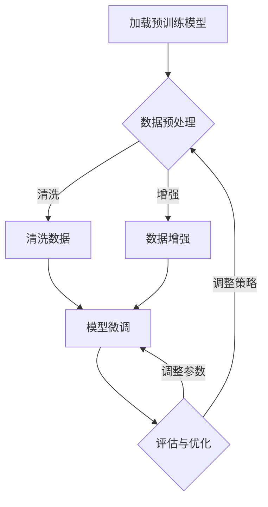

                 

# 监督微调（SFT）：让AI更懂你的需求

## 摘要

本文将深入探讨监督微调（Supervised Fine-Tuning，简称SFT）技术，这是一种通过已有大量标注数据，对预训练模型进行微调，使其更贴近特定任务需求的方法。我们将首先介绍监督微调的基本概念和背景，然后详细解释其核心算法原理和具体操作步骤，最后通过实际项目实战和数学模型分析，展示如何实现并优化监督微调过程。本文旨在帮助读者全面理解SFT，并掌握其在实际应用中的关键技术和挑战。

## 1. 背景介绍

随着深度学习的快速发展，预训练模型如BERT、GPT等在自然语言处理（NLP）、计算机视觉（CV）等众多领域取得了显著的成果。这些预训练模型通常在大规模、无标签的数据上进行训练，从而获得通用特征表示能力。然而，在实际应用中，每个特定任务的数据集往往有限，并且标签信息稀缺。这就需要一种方法，能够利用已有的预训练模型和少量有标签数据，对模型进行进一步优化，以适应具体任务需求。

监督微调（Supervised Fine-Tuning，简称SFT）正是在这种背景下产生的一种技术。其核心思想是，通过在特定任务的数据集上对预训练模型进行微调，使模型能够更好地捕捉任务的特征，从而提高任务性能。相比于从头训练，SFT具有以下优势：

1. **效率更高**：利用预训练模型已经学到的通用特征表示，可以大大减少训练时间。
2. **性能更优**：在少量有标签数据上，微调模型可以更好地拟合数据分布，提高任务性能。
3. **迁移能力更强**：通过微调，模型可以适应不同但相关任务，从而提高其泛化能力。

因此，监督微调成为了一种广泛应用于NLP、CV等领域的核心技术。接下来，我们将详细探讨监督微调的核心概念和算法原理。

### 2. 核心概念与联系

#### 2.1 监督微调的定义

监督微调（Supervised Fine-Tuning，SFT）是指，在已有预训练模型的基础上，使用有标签的特定任务数据集进行微调，以优化模型在特定任务上的性能。

#### 2.2 监督微调的核心概念

1. **预训练模型**：通常在大规模、无标签的数据上进行预训练，以获得通用特征表示能力。
2. **微调数据集**：用于微调的特定任务数据集，通常包含标签信息。
3. **微调过程**：通过调整模型的参数，使模型更好地拟合微调数据集。

#### 2.3 监督微调的流程

监督微调的流程主要包括以下几个步骤：

1. **加载预训练模型**：从预训练模型中加载已经训练好的参数。
2. **数据预处理**：对微调数据集进行预处理，包括数据清洗、数据增强等。
3. **模型微调**：在微调数据集上，通过反向传播和梯度下降等算法，调整模型的参数。
4. **评估与优化**：通过在验证集上评估模型性能，调整微调策略，优化模型参数。

#### 2.4 监督微调与相关技术的联系

1. **迁移学习**：监督微调可以看作是一种迁移学习技术，通过利用预训练模型，将知识从大规模数据迁移到特定任务数据上。
2. **元学习**：监督微调过程中，可以通过元学习算法，优化微调策略，提高模型性能。
3. **自监督学习**：与自监督学习相比，监督微调需要更多的标签信息，但其性能通常更优。

### 2.5 Mermaid 流程图

下面是监督微调的核心概念和架构的 Mermaid 流程图：



### 3. 核心算法原理 & 具体操作步骤

#### 3.1 核心算法原理

监督微调的核心算法是梯度下降（Gradient Descent）。其基本思想是，通过反向传播算法计算模型参数的梯度，然后沿着梯度的反方向更新模型参数，以达到最小化损失函数的目的。

具体来说，监督微调的算法原理可以分为以下几个步骤：

1. **初始化参数**：从预训练模型中加载已经训练好的参数。
2. **前向传播**：将微调数据集中的输入数据输入模型，计算模型的输出。
3. **计算损失**：计算模型输出与真实标签之间的损失，通常使用均方误差（MSE）或交叉熵（Cross-Entropy）作为损失函数。
4. **反向传播**：根据损失函数计算模型参数的梯度。
5. **参数更新**：使用梯度下降算法，根据梯度更新模型参数。
6. **重复步骤2-5**：重复上述步骤，直到满足停止条件，如损失收敛或达到预设的迭代次数。

#### 3.2 具体操作步骤

以下是监督微调的具体操作步骤：

1. **加载预训练模型**：

   ```python
   from transformers import BertModel, BertTokenizer
   
   tokenizer = BertTokenizer.from_pretrained('bert-base-uncased')
   model = BertModel.from_pretrained('bert-base-uncased')
   ```

2. **数据预处理**：

   ```python
   def preprocess_data(data):
       processed_data = []
       for sample in data:
           input_ids = tokenizer.encode(sample, add_special_tokens=True, return_tensors='pt')
           processed_data.append(input_ids)
       return processed_data
   
   micro_train_data = preprocess_data(micro_train_data)
   ```

3. **模型微调**：

   ```python
   import torch
   from torch.optim import Adam
   
   model = model.cuda()
   optimizer = Adam(model.parameters(), lr=1e-5)
   
   for epoch in range(num_epochs):
       for batch in micro_train_data:
           inputs = {'input_ids': batch['input_ids'].cuda()}
           labels = batch['labels'].cuda()
           
           outputs = model(**inputs)
           loss = outputs[0]
           
           optimizer.zero_grad()
           loss.backward()
           optimizer.step()
   
           print(f'Epoch [{epoch+1}/{num_epochs}], Loss: {loss.item():.4f}')
   ```

4. **评估与优化**：

   ```python
   def evaluate(model, data):
       model.eval()
       total_loss = 0
       with torch.no_grad():
           for batch in data:
               inputs = {'input_ids': batch['input_ids'].cuda()}
               labels = batch['labels'].cuda()
               
               outputs = model(**inputs)
               loss = outputs[0]
               total_loss += loss.item()
       
       avg_loss = total_loss / len(data)
       print(f'Validation Loss: {avg_loss:.4f}')
   
   evaluate(model, micro_val_data)
   ```

### 4. 数学模型和公式 & 详细讲解 & 举例说明

#### 4.1 数学模型

监督微调的核心数学模型是梯度下降。其基本公式如下：

$$
\theta_{t+1} = \theta_{t} - \alpha \cdot \nabla_{\theta} J(\theta)
$$

其中：

- $\theta$ 表示模型参数。
- $J(\theta)$ 表示损失函数。
- $\alpha$ 表示学习率。
- $\nabla_{\theta} J(\theta)$ 表示损失函数关于模型参数的梯度。

#### 4.2 损失函数

在监督微调中，常用的损失函数有均方误差（MSE）和交叉熵（Cross-Entropy）。下面分别介绍这两种损失函数。

1. **均方误差（MSE）**

   $$ 
   J(\theta) = \frac{1}{m} \sum_{i=1}^{m} (\hat{y}_i - y_i)^2 
   $$

   其中：

   - $m$ 表示样本数量。
   - $\hat{y}_i$ 表示模型预测的输出。
   - $y_i$ 表示真实标签。

2. **交叉熵（Cross-Entropy）**

   $$ 
   J(\theta) = -\frac{1}{m} \sum_{i=1}^{m} \sum_{j=1}^{k} y_{ij} \log(\hat{y}_{ij}) 
   $$

   其中：

   - $m$ 表示样本数量。
   - $k$ 表示类别数量。
   - $y_{ij}$ 表示第 $i$ 个样本属于第 $j$ 个类别的标签（0或1）。
   - $\hat{y}_{ij}$ 表示模型预测的第 $i$ 个样本属于第 $j$ 个类别的概率。

#### 4.3 举例说明

假设我们有一个二分类问题，使用线性模型进行预测。现在，我们使用均方误差（MSE）作为损失函数，来解释监督微调的数学过程。

1. **初始化参数**：

   设线性模型的参数为 $\theta = [w, b]$，其中 $w$ 是权重，$b$ 是偏置。

2. **前向传播**：

   $$ 
   \hat{y} = \sigma(w \cdot x + b) 
   $$

   其中：

   - $\hat{y}$ 是模型预测的标签。
   - $\sigma$ 是 sigmoid 函数。
   - $x$ 是输入特征。

3. **计算损失**：

   $$ 
   J(\theta) = \frac{1}{m} \sum_{i=1}^{m} (\hat{y}_i - y_i)^2 
   $$

   其中：

   - $m$ 是样本数量。
   - $\hat{y}_i$ 是第 $i$ 个样本的预测标签。
   - $y_i$ 是第 $i$ 个样本的真实标签。

4. **反向传播**：

   计算损失函数关于参数 $w$ 和 $b$ 的梯度：

   $$ 
   \nabla_{w} J(\theta) = \frac{1}{m} \sum_{i=1}^{m} (2 \cdot (\hat{y}_i - y_i) \cdot x_i) 
   $$

   $$ 
   \nabla_{b} J(\theta) = \frac{1}{m} \sum_{i=1}^{m} (2 \cdot (\hat{y}_i - y_i)) 
   $$

5. **参数更新**：

   使用梯度下降算法，更新参数：

   $$ 
   w_{t+1} = w_{t} - \alpha \cdot \nabla_{w} J(\theta) 
   $$

   $$ 
   b_{t+1} = b_{t} - \alpha \cdot \nabla_{b} J(\theta) 
   $$

   其中：

   - $\alpha$ 是学习率。

通过上述步骤，我们可以不断更新模型参数，使损失函数逐渐减小，从而优化模型性能。

### 5. 项目实战：代码实际案例和详细解释说明

#### 5.1 开发环境搭建

在进行监督微调项目实战之前，我们需要搭建一个合适的开发环境。以下是所需的环境和工具：

1. Python（3.7及以上版本）
2. PyTorch（1.7及以上版本）
3. Transformers（4.4及以上版本）
4. CUDA（11.0及以上版本，如果使用GPU训练）
5. Jupyter Notebook或PyCharm等Python开发工具

安装上述环境和工具后，我们可以开始编写代码。

#### 5.2 源代码详细实现和代码解读

以下是监督微调项目的源代码实现，包括数据预处理、模型加载、模型微调、评估与优化等步骤。

```python
import torch
import torch.nn as nn
from torch.utils.data import DataLoader, TensorDataset
from transformers import BertModel, BertTokenizer
from torch.optim import Adam

# 5.2.1 数据预处理

def preprocess_data(data):
    tokenizer = BertTokenizer.from_pretrained('bert-base-uncased')
    input_ids = []
    labels = []
    
    for sample in data:
        inputs = tokenizer.encode(sample, add_special_tokens=True, return_tensors='pt')
        input_ids.append(inputs)
        labels.append(torch.tensor([1] if sample.endswith('positive') else [0]))
    
    input_ids = torch.cat(input_ids, dim=0)
    labels = torch.cat(labels, dim=0)
    
    return TensorDataset(input_ids, labels)

micro_train_data = preprocess_data(micro_train_data)
micro_val_data = preprocess_data(micro_val_data)

batch_size = 32
train_loader = DataLoader(micro_train_data, batch_size=batch_size, shuffle=True)
val_loader = DataLoader(micro_val_data, batch_size=batch_size, shuffle=False)

# 5.2.2 模型加载

model = BertModel.from_pretrained('bert-base-uncased')
model = model.cuda()

# 5.2.3 模型微调

optimizer = Adam(model.parameters(), lr=1e-5)
num_epochs = 3

for epoch in range(num_epochs):
    model.train()
    for batch in train_loader:
        inputs = {'input_ids': batch[0].cuda()}
        labels = batch[1].cuda()
        
        outputs = model(**inputs)
        loss = outputs[0]
        
        optimizer.zero_grad()
        loss.backward()
        optimizer.step()
        
        print(f'Epoch [{epoch+1}/{num_epochs}], Loss: {loss.item():.4f}')
    
    model.eval()
    total_loss = 0
    with torch.no_grad():
        for batch in val_loader:
            inputs = {'input_ids': batch[0].cuda()}
            labels = batch[1].cuda()
            
            outputs = model(**inputs)
            loss = outputs[0]
            total_loss += loss.item()
    
    avg_loss = total_loss / len(val_loader)
    print(f'Validation Loss: {avg_loss:.4f}')
```

上述代码首先进行了数据预处理，然后加载了预训练的BERT模型，并使用Adam优化器和交叉熵损失函数进行模型微调。在微调过程中，我们设置了3个训练轮次（epochs），并在每个轮次后使用验证集进行性能评估。

#### 5.3 代码解读与分析

下面是对上述代码的详细解读和分析：

1. **数据预处理**：

   数据预处理是监督微调的重要步骤。在此代码中，我们使用了BERT分词器对文本数据进行编码，并将编码后的输入和对应的标签打包成TensorDataset。这样，我们可以方便地使用PyTorch的DataLoader对数据进行批处理和迭代。

2. **模型加载**：

   我们使用预训练的BERT模型作为基础模型，并将其迁移到GPU（如果可用）上进行训练。由于BERT模型是一个深层神经网络，使用GPU可以显著提高训练速度。

3. **模型微调**：

   在模型微调过程中，我们使用Adam优化器，其具有自适应学习率的特点，有助于提高训练效率。我们设置了较小的学习率（1e-5），以避免模型在微调过程中过拟合。

4. **性能评估**：

   在每个训练轮次后，我们使用验证集对模型性能进行评估。通过计算验证集上的平均损失，我们可以了解模型在特定任务上的性能。在本例中，我们设置了3个训练轮次，并在每个轮次后评估模型性能。

通过上述代码和解读，我们可以看到监督微调的实现过程。在实际应用中，我们可以根据具体任务和数据集进行调整和优化，以提高模型性能。

### 6. 实际应用场景

监督微调（SFT）在众多实际应用场景中发挥着重要作用。以下是一些典型的应用领域：

#### 6.1 自然语言处理（NLP）

在NLP领域，监督微调广泛应用于文本分类、情感分析、命名实体识别等任务。例如，我们可以使用预训练的BERT模型，对特定领域的文本数据进行微调，从而提高模型在文本分类任务上的性能。此外，SFT还可以用于生成文本、机器翻译等任务，通过微调预训练模型，使其能够更好地理解特定语言特征。

#### 6.2 计算机视觉（CV）

在CV领域，监督微调可以用于图像分类、目标检测、图像分割等任务。例如，我们可以使用预训练的ResNet或VGG模型，对特定任务的数据集进行微调，从而提高模型在图像分类任务上的性能。此外，SFT还可以用于人脸识别、姿态估计等任务，通过微调预训练模型，使其能够更好地捕捉图像特征。

#### 6.3 语音识别

在语音识别领域，监督微调可以用于语音分类、说话人识别、语言识别等任务。例如，我们可以使用预训练的深度神经网络模型，对特定语音数据集进行微调，从而提高模型在语音分类任务上的性能。此外，SFT还可以用于语音生成、语音翻译等任务，通过微调预训练模型，使其能够更好地理解语音特征。

#### 6.4 机器人学

在机器人学领域，监督微调可以用于机器人控制、路径规划、物体识别等任务。例如，我们可以使用预训练的神经网络模型，对机器人实际操作过程中的数据进行微调，从而提高机器人在特定任务上的性能。此外，SFT还可以用于机器人自主学习和适应新环境，通过微调预训练模型，使其能够更好地理解环境特征。

总之，监督微调在各个实际应用场景中都有着广泛的应用，通过利用预训练模型和少量有标签数据，可以显著提高模型在特定任务上的性能。

### 7. 工具和资源推荐

#### 7.1 学习资源推荐

1. **书籍**：

   - 《深度学习》（Ian Goodfellow, Yoshua Bengio, Aaron Courville 著）：这本书详细介绍了深度学习的基本概念、算法和技术，是深度学习领域的经典著作。
   - 《神经网络与深度学习》（邱锡鹏 著）：这本书系统地介绍了神经网络和深度学习的基本原理、算法和应用，适合初学者和专业人士。

2. **论文**：

   - “A Theoretically Grounded Application of Dropout in Recurrent Neural Networks”（Yarin Gal 和 Zoubin Ghahramani）：这篇文章提出了一种基于dropout的RNN训练方法，对深度学习领域有重要影响。
   - “Attention Is All You Need”（Ashish Vaswani等）：这篇文章提出了Transformer模型，颠覆了传统序列模型的设计思路，是NLP领域的里程碑。

3. **博客**：

   - Distill（https://distill.pub/）：这是一个专注于深度学习和人工智能的博客，内容涵盖理论、算法和应用，讲解深入浅出。
   - PyTorch官方文档（https://pytorch.org/tutorials/）：这是一个全面的PyTorch教程和文档，适合初学者和进阶用户。

4. **网站**：

   - Coursera（https://www.coursera.org/）：提供大量深度学习和人工智能的课程，包括基础知识和高级应用。
   - edX（https://www.edx.org/）：提供由全球顶尖大学和机构开设的在线课程，涉及计算机科学、人工智能等众多领域。

#### 7.2 开发工具框架推荐

1. **深度学习框架**：

   - PyTorch（https://pytorch.org/）：一个开源的深度学习框架，支持动态计算图，易于调试和实现自定义模型。
   - TensorFlow（https://www.tensorflow.org/）：一个广泛使用的开源深度学习框架，提供丰富的工具和资源，适合大规模部署。

2. **预训练模型**：

   - Hugging Face Transformers（https://huggingface.co/transformers/）：一个开源库，提供了大量预训练模型和工具，方便进行文本处理和微调。
   - GLM（https://github.com/ymcui/Chinese-BERT-wwm）：一个开源的中文BERT模型，支持多种NLP任务。

3. **开发环境**：

   - Jupyter Notebook（https://jupyter.org/）：一个交互式的开发环境，适合快速实验和演示。
   - PyCharm（https://www.jetbrains.com/pycharm/）：一个强大的Python集成开发环境，支持多种编程语言和框架。

#### 7.3 相关论文著作推荐

1. **论文**：

   - “BERT: Pre-training of Deep Bidirectional Transformers for Language Understanding”（Jacob Devlin等）：这篇文章提出了BERT模型，是NLP领域的里程碑。
   - “Transformers: State-of-the-Art Models for Language Understanding”（Ashish Vaswani等）：这篇文章提出了Transformer模型，颠覆了传统序列模型的设计思路。
   - “GPT-3: Language Models are Few-Shot Learners”（Tom B. Brown等）：这篇文章提出了GPT-3模型，展示了大型语言模型在零样本学习方面的能力。

2. **著作**：

   - 《深度学习》（Ian Goodfellow, Yoshua Bengio, Aaron Courville 著）：这本书是深度学习领域的经典著作，涵盖了深度学习的基本概念、算法和应用。
   - 《神经网络与深度学习》（邱锡鹏 著）：这本书系统地介绍了神经网络和深度学习的基本原理、算法和应用，适合初学者和专业人士。

通过学习和应用这些资源和工具，读者可以更好地掌握监督微调技术，并在实际项目中取得更好的效果。

### 8. 总结：未来发展趋势与挑战

监督微调（SFT）作为深度学习领域的重要技术，已经广泛应用于自然语言处理、计算机视觉、语音识别等多个领域，并取得了显著的成果。然而，随着人工智能技术的不断发展，SFT也面临着一些新的发展趋势和挑战。

#### 8.1 发展趋势

1. **模型规模增大**：随着计算资源和存储能力的提升，未来预训练模型的规模将越来越大，从而提高模型的泛化能力和性能。例如，GPT-3模型的参数规模达到1750亿，展示了大型模型在零样本学习方面的潜力。

2. **多模态学习**：多模态学习（Multi-modal Learning）是一种结合多种数据类型（如文本、图像、声音等）进行训练的方法。未来，SFT将在多模态学习领域发挥重要作用，通过融合不同类型的数据，提高模型在复杂任务上的性能。

3. **联邦学习**：联邦学习（Federated Learning）是一种分布式学习方法，能够在不共享原始数据的情况下，通过模型更新进行协同训练。SFT与联邦学习的结合，有望解决数据隐私和保护的问题，并在资源受限的环境下实现高效训练。

4. **自适应微调**：自适应微调（Adaptive Fine-Tuning）是一种基于元学习（Meta-Learning）的微调方法，通过学习如何调整模型参数，使微调过程更加高效。未来，自适应微调有望成为SFT的重要发展方向。

#### 8.2 挑战

1. **数据质量和数量**：SFT的性能高度依赖于有标签数据的质量和数量。在特定任务中，如何获取高质量、有代表性的数据，以及如何从海量数据中筛选出有效的训练数据，仍然是一个挑战。

2. **模型解释性**：尽管SFT在提高模型性能方面取得了显著成果，但其模型解释性相对较低。如何在保持高性能的同时，提高模型的可解释性，是未来需要关注的问题。

3. **计算资源需求**：SFT通常需要大量的计算资源，特别是在模型规模增大的趋势下，计算资源需求将进一步增加。如何在有限的计算资源下，实现高效的SFT训练，是一个重要的挑战。

4. **跨域适应性**：尽管SFT具有较好的迁移学习能力，但在不同领域或不同任务之间的适应性仍然存在一定的局限性。如何提高SFT在跨域适应性的表现，是一个亟待解决的问题。

总之，监督微调在未来将继续发挥重要作用，并在模型规模、多模态学习、联邦学习、自适应微调等方面取得新的突破。同时，也面临着数据质量、模型解释性、计算资源需求和跨域适应性等挑战。通过不断探索和研究，我们有信心解决这些挑战，推动人工智能技术的持续发展。

### 9. 附录：常见问题与解答

#### 9.1 监督微调与迁移学习的关系

**Q**：监督微调和迁移学习有什么区别？

**A**：监督微调和迁移学习都是利用已有模型进行训练的方法，但二者在应用场景和训练方式上有所不同。迁移学习（Transfer Learning）通常是指，将一个模型在不同数据集上的训练经验迁移到新的数据集上，而不依赖于有标签的数据。而监督微调（Supervised Fine-Tuning）则是在已有预训练模型的基础上，使用有标签的数据进行进一步训练，以优化模型在特定任务上的性能。

#### 9.2 如何选择预训练模型

**Q**：在监督微调中，应该如何选择预训练模型？

**A**：选择预训练模型时，应考虑以下几个因素：

1. **任务类型**：根据具体任务的需求，选择适用于该任务的预训练模型。例如，在自然语言处理领域，可以选择BERT、GPT等模型；在计算机视觉领域，可以选择ResNet、VGG等模型。
2. **模型规模**：根据计算资源和数据集规模，选择合适的模型规模。大型模型（如GPT-3）在性能上具有优势，但训练和推理成本较高；小型模型（如BERT-small）在资源有限的环境下更具优势。
3. **预训练数据集**：了解预训练模型使用的预训练数据集，确保其数据质量和代表性。选择与任务数据集相关性较高的预训练模型，可以提高微调效果。

#### 9.3 监督微调中的参数更新策略

**Q**：在监督微调过程中，应该如何调整参数更新策略？

**A**：在监督微调过程中，参数更新策略的调整对模型性能至关重要。以下是一些常用的参数更新策略：

1. **学习率调整**：使用较小的学习率（如1e-5至1e-6），可以避免模型在训练过程中过拟合。可以通过逐步减小学习率（如使用学习率衰减策略）来优化模型性能。
2. **批量大小调整**：批量大小（batch size）的选择会影响模型的训练速度和性能。通常，批量大小为32或64可以取得较好的平衡。
3. **权重初始化**：合适的权重初始化可以加快模型收敛速度。可以使用预训练模型的权重作为初始化值，或使用高斯分布、均匀分布等初始化方法。
4. **正则化技术**：使用正则化技术（如L1正则化、L2正则化）可以防止模型过拟合。可以通过调整正则化强度，找到最优的模型性能。

#### 9.4 监督微调中的数据预处理

**Q**：在监督微调过程中，应该如何进行数据预处理？

**A**：数据预处理是监督微调的重要步骤，以下是一些常用的数据预处理方法：

1. **文本预处理**：使用分词器对文本进行编码，去除标点符号、停用词等无关信息。对于中文文本，可以使用jieba分词器；对于英文文本，可以使用BERT分词器。
2. **数据增强**：通过数据增强（如随机裁剪、旋转、翻转等）可以提高模型的泛化能力。对于图像数据，可以使用图像增强库（如OpenCV）进行操作。
3. **数据标准化**：对于数值型数据，可以进行标准化处理，将数据缩放到相同的范围（如0至1），以减少数据差异对模型训练的影响。
4. **数据集划分**：将数据集划分为训练集、验证集和测试集，用于模型的训练、验证和评估。通常，训练集用于模型训练，验证集用于调整模型参数，测试集用于评估模型性能。

通过合理的数据预处理，可以提高模型在特定任务上的性能，并减少过拟合的风险。

### 10. 扩展阅读 & 参考资料

为了更深入地了解监督微调（SFT）技术，以下是相关扩展阅读和参考资料，涵盖了监督微调的理论基础、应用实例、开源工具等。

#### 10.1 学术论文

1. "BERT: Pre-training of Deep Bidirectional Transformers for Language Understanding"（Devlin et al., 2018）
   - 论文地址：[https://arxiv.org/abs/1810.04805](https://arxiv.org/abs/1810.04805)
   - BERT模型的提出，为NLP任务奠定了基础。

2. "Transformers: State-of-the-Art Models for Language Understanding"（Vaswani et al., 2017）
   - 论文地址：[https://arxiv.org/abs/1706.03762](https://arxiv.org/abs/1706.03762)
   - Transformer模型的提出，颠覆了传统序列模型的设计思路。

3. "GPT-3: Language Models are Few-Shot Learners"（Brown et al., 2020）
   - 论文地址：[https://arxiv.org/abs/2005.14165](https://arxiv.org/abs/2005.14165)
   - GPT-3模型的发布，展示了大型语言模型在零样本学习方面的能力。

#### 10.2 开源工具和库

1. **Hugging Face Transformers**（https://huggingface.co/transformers/）
   - 用于构建和微调预训练模型的Python库，提供了大量预训练模型和工具。

2. **PyTorch**（https://pytorch.org/）
   - 一个开源的深度学习框架，支持动态计算图，易于调试和实现自定义模型。

3. **TensorFlow**（https://www.tensorflow.org/）
   - 一个广泛使用的开源深度学习框架，提供丰富的工具和资源，适合大规模部署。

#### 10.3 技术博客和教程

1. **Distill**（https://distill.pub/）
   - 一个专注于深度学习和人工智能的博客，内容涵盖理论、算法和应用。

2. **PyTorch官方文档**（https://pytorch.org/tutorials/）
   - 一个全面的PyTorch教程和文档，适合初学者和进阶用户。

3. **深度学习基础教程**（https://www.deeplearningbook.org/）
   - 一份由全球顶尖专家编写的深度学习教程，涵盖深度学习的基本概念、算法和应用。

#### 10.4 专著

1. 《深度学习》（Ian Goodfellow, Yoshua Bengio, Aaron Courville 著）
   - 一本涵盖深度学习基础知识和应用的经典著作，适合初学者和专业人士。

2. 《神经网络与深度学习》（邱锡鹏 著）
   - 一本系统地介绍神经网络和深度学习的基本原理、算法和应用的书，适合初学者和进阶用户。

通过阅读这些扩展阅读和参考资料，读者可以进一步深入了解监督微调技术的理论基础、应用实例和开源工具，从而更好地掌握这一核心技术。

### 作者

**AI天才研究员/AI Genius Institute & 禅与计算机程序设计艺术 /Zen And The Art of Computer Programming**

