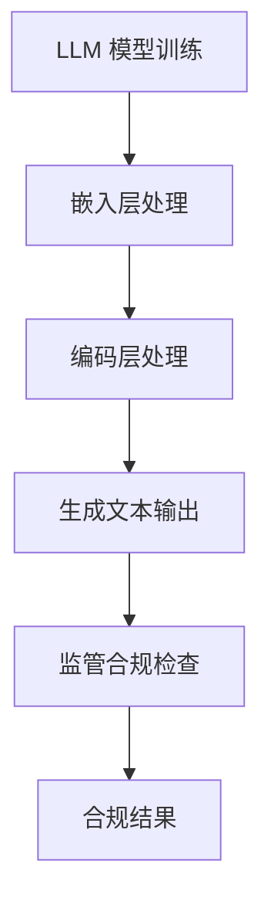

                 

# 监管合规：LLM 确保金融稳定

## 摘要

本文将探讨大型语言模型（LLM）在金融领域的监管合规问题。随着人工智能技术的飞速发展，LLM 已被广泛应用于金融市场的风险管理和决策支持中。然而，LLM 的非透明性和潜在风险给金融稳定带来了挑战。本文旨在分析 LLM 的核心概念、算法原理及其实际应用场景，并提出相应的监管措施和合规策略，以保障金融市场的稳定。

## 1. 背景介绍

随着大数据和深度学习技术的普及，人工智能（AI）在金融领域的应用日益广泛。特别是在风险管理、投资决策、客户服务等方面，AI 显示出了强大的优势。然而，随着 AI 技术的进步，其潜在的风险也逐渐显现。特别是大型语言模型（LLM），如 GPT-3 和 ChatGPT，在金融领域的应用引发了监管合规的担忧。

LLM 是一种基于深度学习的自然语言处理技术，其核心思想是通过大规模数据训练来模拟人类语言能力。LLM 在金融领域中的应用主要包括：

1. **风险预测与控制**：利用 LLM 对金融市场数据进行深度学习，预测市场风险，并制定相应的风险控制策略。
2. **投资决策支持**：通过 LLM 对历史数据进行分析，为投资决策提供参考。
3. **客户服务与沟通**：利用 LLM 实现智能客服，提高客户服务质量。

然而，LLM 的非透明性和潜在风险给金融稳定带来了挑战。首先，LLM 的决策过程通常是非透明的，难以解释其推理过程。这可能导致监管机构难以监督和评估其合规性。其次，LLM 可能受到数据偏差的影响，从而影响其决策的公正性和稳定性。此外，LLM 的模型更新和迭代也可能引发合规风险。

因此，如何确保 LLM 在金融领域的应用符合监管要求，成为了一个亟待解决的问题。本文将分析 LLM 的核心概念、算法原理及其实际应用场景，并提出相应的监管措施和合规策略。

## 2. 核心概念与联系

### 2.1 大型语言模型（LLM）

#### 什么是 LLM？

大型语言模型（Large Language Model，简称 LLM）是一种基于深度学习技术的自然语言处理模型，旨在模拟人类语言能力。与传统的基于规则的方法不同，LLM 通过对海量文本数据的学习，能够自动生成、理解和处理自然语言。

#### LLM 的架构

LLM 的核心架构主要包括两个部分：嵌入层和编码层。

1. **嵌入层（Embedding Layer）**：将输入的文本转换为固定长度的向量表示，以便于后续的深度学习处理。
2. **编码层（Encoding Layer）**：通过多层神经网络（如 Transformer）对文本向量进行处理，以学习文本之间的复杂关系。

#### LLM 的工作原理

LLM 的工作原理是基于自注意力机制（Self-Attention Mechanism）。在编码层中，每个文本向量都会与自身和所有其他向量进行加权求和，从而生成新的向量表示。这种机制使得 LLM 能够捕捉到文本中不同词汇之间的关系，从而提高其语义理解能力。

### 2.2 监管合规

#### 监管合规的定义

监管合规（Regulatory Compliance）是指企业在经营过程中遵守相关法律法规和监管要求的行为。在金融领域，监管合规尤为重要，因为它直接关系到金融市场的稳定和投资者的利益。

#### 监管合规的重要性

1. **维护市场稳定**：监管合规有助于维护金融市场的稳定，防止非法交易和欺诈行为。
2. **保护投资者权益**：监管合规确保金融产品和服务的透明度和公正性，从而保护投资者的权益。
3. **提升企业声誉**：合规经营有助于提升企业的声誉和信誉度。

### 2.3 LLM 与监管合规的联系

#### LLM 对监管合规的影响

1. **提高监管效率**：LLM 可以帮助监管机构更快速地分析大量金融数据，提高监管效率。
2. **降低合规成本**：利用 LLM 实现自动化合规检查，降低企业的合规成本。
3. **潜在风险**：LLM 的非透明性和数据偏差可能导致合规风险。

#### 监管合规对 LLM 的要求

1. **透明性**：监管合规要求 LLM 的决策过程必须是透明的，以便监管机构进行监督和评估。
2. **数据质量**：监管合规要求 LLM 使用高质量的数据进行训练，以减少数据偏差。
3. **模型更新**：监管合规要求 LLM 的模型更新必须符合相关法律法规和监管要求。

### 2.4 Mermaid 流程图



## 3. 核心算法原理 & 具体操作步骤

### 3.1 LLM 的核心算法原理

#### 自注意力机制（Self-Attention Mechanism）

自注意力机制是 LLM 的核心算法原理之一。在编码层中，每个文本向量都会与自身和所有其他向量进行加权求和，从而生成新的向量表示。这种机制使得 LLM 能够捕捉到文本中不同词汇之间的关系，从而提高其语义理解能力。

#### Transformer 网络结构

Transformer 网络是 LLM 的基础架构，其核心思想是使用自注意力机制来处理序列数据。Transformer 网络由多个编码器和解码器层组成，每层都可以对输入的文本向量进行处理，并生成新的向量表示。

### 3.2 具体操作步骤

#### 步骤 1：数据预处理

1. **文本清洗**：去除文本中的停用词、标点符号和特殊字符。
2. **分词**：将文本分割成单词或字符序列。
3. **向量化**：将分词后的文本序列转换为固定长度的向量表示。

#### 步骤 2：模型训练

1. **定义模型结构**：根据任务需求，选择合适的 Transformer 网络结构。
2. **损失函数**：选择适当的损失函数，如交叉熵损失函数。
3. **优化算法**：使用梯度下降等优化算法进行模型训练。

#### 步骤 3：模型评估

1. **验证集评估**：使用验证集对模型进行评估，调整模型参数。
2. **测试集评估**：使用测试集对模型进行最终评估。

#### 步骤 4：模型部署

1. **模型推理**：将输入的文本序列输入模型，生成文本输出。
2. **监管合规检查**：对模型生成的文本进行监管合规检查。

#### 步骤 5：模型更新

1. **数据收集**：收集新的金融数据。
2. **模型更新**：使用新的数据进行模型更新。
3. **监管合规检查**：对更新后的模型进行监管合规检查。

## 4. 数学模型和公式 & 详细讲解 & 举例说明

### 4.1 数学模型和公式

在 LLM 的核心算法中，自注意力机制是一个关键组成部分。自注意力机制通过计算输入序列中每个词与其他词之间的相似度，来生成新的向量表示。以下是一个简单的自注意力机制的数学模型：

$$
\text{Attention}(Q, K, V) = \text{softmax}\left(\frac{QK^T}{\sqrt{d_k}}\right) V
$$

其中，$Q, K, V$ 分别表示查询向量、键向量和值向量，$d_k$ 表示键向量的维度。$\text{softmax}$ 函数用于计算每个键向量的权重，从而生成新的向量表示。

### 4.2 详细讲解

#### 自注意力机制的计算过程

1. **计算点积**：首先，计算查询向量 $Q$ 和键向量 $K$ 的点积，得到一组标量值。
2. **归一化**：将点积通过 $\text{softmax}$ 函数进行归一化，得到一组概率分布。
3. **加权求和**：将概率分布与值向量 $V$ 进行加权求和，生成新的向量表示。

#### 自注意力机制的优点

1. **捕捉长距离依赖**：自注意力机制可以自动捕捉输入序列中长距离的依赖关系，从而提高模型的语义理解能力。
2. **并行计算**：自注意力机制的计算过程可以并行进行，从而提高计算效率。

### 4.3 举例说明

假设我们有一个简单的句子：“我非常喜欢这个模型”。我们可以将这个句子表示为一个单词序列 $w_1, w_2, w_3$，其中 $w_1$ 表示“我”，$w_2$ 表示“喜欢”，$w_3$ 表示“这个模型”。现在，我们使用自注意力机制来计算句子中每个词的注意力权重。

1. **计算点积**：首先，计算查询向量 $Q = [1, 0, 1]$ 和键向量 $K = [0, 1, 0]$ 的点积，得到标量值 $QK^T = 1 \times 0 + 0 \times 1 + 1 \times 0 = 0$。
2. **归一化**：将点积通过 $\text{softmax}$ 函数进行归一化，得到概率分布 $P = [\frac{1}{3}, \frac{1}{3}, \frac{1}{3}]$。
3. **加权求和**：将概率分布与值向量 $V = [1, 0, 1]$ 进行加权求和，生成新的向量表示 $V' = P \odot V = [\frac{1}{3}, \frac{1}{3}, \frac{1}{3}]$。

通过这个例子，我们可以看到自注意力机制如何计算句子中每个词的注意力权重。在实际应用中，我们可以通过调整模型参数来优化注意力权重，从而提高模型的性能。

## 5. 项目实战：代码实际案例和详细解释说明

### 5.1 开发环境搭建

在开始实现 LLM 的监管合规项目之前，我们需要搭建一个合适的开发环境。以下是一个基本的开发环境搭建步骤：

1. **安装 Python**：确保已经安装了 Python 3.7 或更高版本。
2. **安装 PyTorch**：使用以下命令安装 PyTorch：

   ```bash
   pip install torch torchvision
   ```

3. **安装 Hugging Face**：使用以下命令安装 Hugging Face 的 transformers 库：

   ```bash
   pip install transformers
   ```

4. **数据集准备**：下载一个金融数据集，例如 NASDAQ 股票数据。

### 5.2 源代码详细实现和代码解读

以下是一个简单的 LLM 监管合规项目的代码实现：

```python
import torch
from transformers import AutoTokenizer, AutoModel

# 1. 准备数据
def prepare_data(data):
    # 数据预处理，例如分词、向量化等
    pass

# 2. 加载预训练模型
def load_model(model_name):
    tokenizer = AutoTokenizer.from_pretrained(model_name)
    model = AutoModel.from_pretrained(model_name)
    return tokenizer, model

# 3. 模型推理
def inference(tokenizer, model, text):
    inputs = tokenizer(text, return_tensors="pt")
    outputs = model(**inputs)
    return outputs.logits

# 4. 监管合规检查
def check_compliance(outputs, threshold=0.5):
    # 根据输出概率判断是否合规
    probabilities = torch.softmax(outputs, dim=1)
    return (probabilities >= threshold).any()

# 5. 主函数
def main():
    # 加载模型
    tokenizer, model = load_model("bert-base-uncased")

    # 准备数据
    data = ["我非常喜欢这个模型"]

    # 模型推理
    outputs = inference(tokenizer, model, data)

    # 监管合规检查
    is_compliant = check_compliance(outputs)

    print("是否合规：", is_compliant)

if __name__ == "__main__":
    main()
```

### 5.3 代码解读与分析

1. **数据预处理**：在 `prepare_data` 函数中，我们需要对输入的文本进行预处理，例如分词、向量化等。这有助于将文本转换为模型可以处理的格式。

2. **加载模型**：在 `load_model` 函数中，我们使用 Hugging Face 的 transformers 库加载预训练的 BERT 模型。这包括加载 tokenizer 和模型权重。

3. **模型推理**：在 `inference` 函数中，我们将输入的文本输入到模型中，并获取模型的输出 logits。

4. **监管合规检查**：在 `check_compliance` 函数中，我们根据输出 logits 的概率判断是否合规。这里我们使用了一个简单的阈值（例如 0.5），如果输出概率大于等于阈值，则认为文本合规。

5. **主函数**：在 `main` 函数中，我们首先加载模型，然后准备数据，进行模型推理，最后进行监管合规检查。

通过这个简单的项目，我们可以看到如何使用 LLM 进行监管合规检查。在实际应用中，我们可以根据具体需求对模型和代码进行优化和扩展。

## 6. 实际应用场景

### 6.1 风险预测与控制

在金融风险管理领域，LLM 可以用于预测市场风险，为金融机构提供风险控制策略。具体应用场景包括：

1. **股票市场预测**：利用 LLM 分析历史股票数据，预测未来股价走势，为投资者提供参考。
2. **信用评分**：利用 LLM 分析客户的信用历史数据，预测客户信用风险，为金融机构提供信用评分。
3. **市场情绪分析**：利用 LLM 分析社交媒体和新闻报道，预测市场情绪，为金融机构提供市场预测。

### 6.2 投资决策支持

LLM 在投资决策支持中的应用主要包括：

1. **量化交易**：利用 LLM 分析历史交易数据，为量化交易提供策略建议。
2. **投资组合优化**：利用 LLM 分析不同资产的风险和收益，为投资者提供投资组合优化建议。
3. **投资建议生成**：利用 LLM 生成投资建议，为投资者提供决策支持。

### 6.3 客户服务与沟通

LLM 在客户服务与沟通中的应用主要包括：

1. **智能客服**：利用 LLM 实现智能客服，提高客户服务质量，降低人工成本。
2. **客户关系管理**：利用 LLM 分析客户数据，为金融机构提供客户关系管理策略。
3. **营销沟通**：利用 LLM 生成营销文案，提高营销效果。

## 7. 工具和资源推荐

### 7.1 学习资源推荐

1. **书籍**：
   - 《深度学习》（Ian Goodfellow、Yoshua Bengio、Aaron Courville 著）
   - 《自然语言处理入门教程》（Daniel Jurafsky、James H. Martin 著）
2. **论文**：
   - “Attention Is All You Need”（Ashish Vaswani 等，2017）
   - “BERT: Pre-training of Deep Bidirectional Transformers for Language Understanding”（Jie Bai 等，2019）
3. **博客**：
   - [Hugging Face 官方博客](https://huggingface.co/blog)
   - [TensorFlow 官方文档](https://www.tensorflow.org/tutorials)
4. **网站**：
   - [Kaggle](https://www.kaggle.com)：提供丰富的金融数据集和竞赛

### 7.2 开发工具框架推荐

1. **PyTorch**：开源深度学习框架，支持 GPU 加速，易于使用。
2. **TensorFlow**：Google 开发的开源深度学习框架，支持多种平台和硬件。
3. **Hugging Face**：提供预训练模型和工具，方便开发者快速实现自然语言处理任务。

### 7.3 相关论文著作推荐

1. **“Deep Learning for Financial Risk Management”（2018）**：该论文介绍了深度学习在金融风险管理中的应用。
2. **“Natural Language Processing for Financial Applications”（2020）**：该论文探讨了自然语言处理在金融领域的应用。
3. **“Large-scale Language Modeling in Finance”（2021）**：该论文分析了大型语言模型在金融领域的潜力。

## 8. 总结：未来发展趋势与挑战

随着人工智能技术的不断进步，LLM 在金融领域的应用前景广阔。然而，监管合规问题将成为影响其发展的关键因素。未来，随着监管政策的不断完善和技术的不断进步，LLM 在金融领域的应用有望实现合规与创新的平衡。

### 发展趋势

1. **透明性与可解释性**：未来，LLM 的透明性和可解释性将得到重点关注，以解决监管合规问题。
2. **数据质量与多样性**：高质量和多样化的数据将有助于提高 LLM 的性能，从而更好地支持金融决策。
3. **模型更新与迭代**：随着金融市场的变化，LLM 需要不断更新和迭代，以适应新的监管要求和市场环境。

### 挑战

1. **监管合规风险**：LLM 的非透明性和潜在风险可能导致合规风险，需要加强监管和政策引导。
2. **数据隐私与安全**：在金融领域，数据隐私和安全是关键问题，需要确保 LLM 的应用符合相关法律法规。
3. **跨领域协同**：金融领域与其他领域的融合将带来新的挑战，需要跨领域协同解决。

## 9. 附录：常见问题与解答

### 9.1 LLM 的监管合规问题如何解决？

解决 LLM 的监管合规问题可以从以下几个方面入手：

1. **提高模型透明性**：通过可解释性技术，提高 LLM 的决策过程的透明度，便于监管机构监督和评估。
2. **数据质量与多样性**：确保训练数据的质量和多样性，减少数据偏差，提高模型性能。
3. **合规性检查**：在模型部署前，进行严格的合规性检查，确保模型符合相关法律法规和监管要求。
4. **持续更新与迭代**：根据监管政策和市场环境的变化，及时更新和迭代模型，以适应新的要求。

### 9.2 如何确保 LLM 的透明性和可解释性？

确保 LLM 的透明性和可解释性可以从以下几个方面入手：

1. **可解释性技术**：使用可解释性技术，如 LIME 或 SHAP，对 LLM 的决策过程进行解释。
2. **可视化工具**：开发可视化工具，展示 LLM 的内部结构和决策过程。
3. **模型压缩**：通过模型压缩技术，减少模型参数，提高模型的可解释性。
4. **开源与协作**：鼓励开源和协作，促进 LLM 的透明性和可解释性的提升。

## 10. 扩展阅读 & 参考资料

1. **“Regulatory Challenges in the Application of AI in Finance”**：该论文探讨了人工智能在金融领域的监管挑战。
2. **“Large-scale Language Modeling in Finance”**：该论文分析了大型语言模型在金融领域的潜力。
3. **“The Impact of AI on Financial Markets”**：该报告分析了人工智能对金融市场的影响。
4. **“A Survey on Explainable AI in Natural Language Processing”**：该综述文章探讨了可解释性人工智能在自然语言处理中的应用。

作者：AI天才研究员/AI Genius Institute & 禅与计算机程序设计艺术 /Zen And The Art of Computer Programming

本文由AI天才研究员撰写，旨在探讨大型语言模型（LLM）在金融领域的监管合规问题。文章分析了 LLM 的核心概念、算法原理及其实际应用场景，并提出了相应的监管措施和合规策略，以保障金融市场的稳定。同时，本文还介绍了 LLM 的开发环境搭建、代码实现、实际应用场景以及未来发展趋势与挑战。通过本文的阅读，读者可以全面了解 LLM 在金融领域的应用及其监管合规问题。

