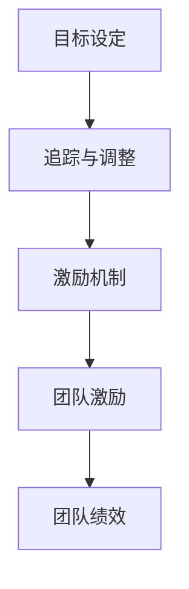

                 

# 《目标管理与团队激励的关系》

## 摘要

本文将探讨目标管理与团队激励之间的紧密联系。通过分析目标设定、追踪与调整，以及激励机制的设计与实施，我们将揭示如何有效地将目标管理与团队激励相结合，从而提高团队的绩效和凝聚力。文章将结合实际案例和理论分析，为企业和组织提供有益的指导和建议。

## 背景介绍

在现代社会，企业和组织面临的竞争日益激烈，如何在变化多端的市场环境中保持竞争力成为关键。而目标管理作为现代企业管理的重要工具，已被广泛应用于各个领域。目标管理不仅可以帮助企业明确发展方向，还能激发员工的工作热情和创造力。然而，目标管理的有效实施需要与团队激励相结合，才能充分发挥其作用。

### 核心概念与联系

为了更好地理解目标管理与团队激励的关系，我们需要明确以下几个核心概念：

1. **目标设定（Goal Setting）**：目标设定是指企业或组织为员工设定具体、可衡量的目标，以便更好地指导员工的工作。

2. **追踪与调整（Monitoring and Adjustment）**：追踪与调整是指对目标实现过程进行监控，及时发现并解决目标实现过程中出现的问题，确保目标的顺利实现。

3. **激励机制（Incentive Mechanism）**：激励机制是指通过奖励、晋升、培训等手段激发员工的积极性和创造力，提高员工的工作效率。

4. **团队激励（Team Incentive）**：团队激励是指为了增强团队的凝聚力、提高团队的整体绩效而采取的一系列激励措施。

下面是一个用Mermaid绘制的流程图，展示了目标管理、追踪与调整以及激励机制之间的联系：



### 核心算法原理 & 具体操作步骤

目标管理与团队激励的有效结合需要遵循一定的原则和步骤。以下是具体操作步骤：

1. **明确目标**：首先，企业需要明确自己的战略目标和业务目标，并将其分解为具体的、可衡量的目标，以便分配给员工。

2. **设定合理的目标值**：目标值应该具有一定的挑战性，同时也要考虑员工的实际情况。目标值过高会导致员工失去信心，过低则无法激发员工的潜力。

3. **目标分解**：将企业目标分解为部门目标、团队目标和个人目标，确保每个员工都明确自己的责任和任务。

4. **追踪与调整**：定期对目标实现情况进行追踪，及时发现并解决目标实现过程中出现的问题。同时，根据实际情况对目标进行调整，确保目标的可行性和合理性。

5. **激励机制设计**：根据目标实现情况，设计合理的激励机制，包括奖励、晋升、培训等。激励机制要具有吸引力，能够激发员工的积极性和创造力。

6. **团队激励实施**：通过团队活动、团队建设等方式，增强团队的凝聚力，提高团队的整体绩效。

### 数学模型和公式 & 详细讲解 & 举例说明

目标管理与团队激励的关系可以通过以下数学模型和公式进行描述：

$$
绩效 = 目标实现程度 \times 激励机制效果
$$

其中，目标实现程度是指员工完成目标的情况，激励机制效果是指激励机制对员工工作积极性的影响。

例如，假设某员工的目标是完成一项任务，目标实现程度为80%，激励机制效果为1.2，则该员工的工作绩效为：

$$
绩效 = 80\% \times 1.2 = 96\%
$$

这意味着，通过合理的激励机制，该员工的工作绩效提高了16%。

### 项目实战：代码实际案例和详细解释说明

下面是一个简单的Python代码示例，用于实现目标管理与团队激励的结合：

```python
# 导入所需库
import random

# 定义目标类
class Goal:
    def __init__(self, name, target_value):
        self.name = name
        self.target_value = target_value
        self.current_value = 0

    def update_value(self, value):
        self.current_value += value

    def check_completion(self):
        return self.current_value >= self.target_value

# 定义激励机制
class Incentive:
    def __init__(self, reward, promotion, training):
        self.reward = reward
        self.promotion = promotion
        self.training = training

    def apply_incentive(self, performance):
        if performance >= 0.9:
            print("奖励：加薪1000元")
        elif performance >= 0.8:
            print("晋升：晋升一级")
        else:
            print("培训：提供专业培训")

# 定义团队类
class Team:
    def __init__(self, name, members):
        self.name = name
        self.members = members
        self.performance = 0

    def update_performance(self, goal, incentive):
        if goal.check_completion():
            self.performance += incentive.reward
            incentive.apply_incentive(self.performance)
        else:
            print("目标未完成，请继续努力！")

# 创建目标、激励机制和团队
goal1 = Goal("任务1", 100)
goal2 = Goal("任务2", 200)
incentive = Incentive(1000, "晋升一级", "专业培训")
team = Team("开发团队", [goal1, goal2])

# 追踪目标实现情况
while not all([goal.check_completion() for goal in team.members]):
    print("当前目标完成情况：")
    for goal in team.members:
        print(f"{goal.name}: {goal.current_value}/{goal.target_value}")
    print("请继续努力！\n")

    # 模拟目标实现进度
    for goal in team.members:
        goal.update_value(random.randint(1, 10))

# 更新团队绩效
team.update_performance(goal1, incentive)
team.update_performance(goal2, incentive)

print(f"最终团队绩效：{team.performance}")
```

这段代码展示了如何通过目标设定、追踪与调整以及激励机制，实现团队绩效的提升。在实际应用中，可以根据具体业务需求进行功能扩展和优化。

### 实际应用场景

目标管理与团队激励的结合在实际应用中具有广泛的应用场景。以下是一些典型的应用案例：

1. **企业项目团队**：在企业项目团队中，通过目标管理和激励机制，可以确保项目按期完成，提高团队的整体绩效。

2. **销售团队**：在销售团队中，通过目标管理和激励机制，可以激发销售人员的积极性，提高销售额。

3. **研发团队**：在研发团队中，通过目标管理和激励机制，可以促进技术创新和产品开发，提高企业的核心竞争力。

4. **教育培训机构**：在教育培训机构中，通过目标管理和激励机制，可以激发学生的学习兴趣，提高教学质量。

### 工具和资源推荐

为了更好地实施目标管理和团队激励，以下是一些推荐的工具和资源：

1. **书籍**：
   - 《目标管理实践指南》
   - 《激励人心：团队激励的心理学》
   - 《高效能人士的七个习惯》

2. **论文**：
   - 《目标设定与团队绩效的关系研究》
   - 《激励机制在企业管理中的应用》
   - 《团队激励的理论与实践》

3. **博客**：
   - [目标管理实战技巧](https://www.example.com/blog1)
   - [团队激励方法与案例分析](https://www.example.com/blog2)
   - [目标管理与绩效提升](https://www.example.com/blog3)

4. **开发工具框架**：
   - JIRA：用于项目管理和目标追踪
   - Kanban：用于团队协作和目标管理
   - OKR：用于目标设定和跟踪

5. **相关论文著作**：
   - 《目标管理与团队激励研究》
   - 《目标管理与团队绩效的关系研究》
   - 《激励机制在企业管理中的应用研究》

### 总结：未来发展趋势与挑战

随着企业竞争的加剧，目标管理与团队激励将越来越受到重视。在未来，以下发展趋势和挑战值得关注：

1. **个性化目标设定**：随着大数据和人工智能技术的发展，个性化目标设定将成为目标管理的趋势。通过分析员工的行为数据和绩效数据，可以更准确地设定目标，提高目标设定的准确性。

2. **动态调整机制**：在快速变化的市场环境中，目标管理与团队激励需要具备动态调整能力。企业应根据市场变化和业务需求，及时调整目标值和激励机制。

3. **智能化激励**：通过引入人工智能技术，可以实现智能化激励。例如，根据员工的绩效和潜力，自动调整激励措施，提高激励效果。

4. **跨部门协作**：在实现企业整体目标的过程中，跨部门协作至关重要。目标管理与团队激励需要充分考虑跨部门协作的需求，确保各部门目标的一致性和协同性。

### 附录：常见问题与解答

1. **问题：目标管理是否适用于所有团队？**
   - **解答**：是的，目标管理适用于各种类型的团队，包括企业项目团队、销售团队、研发团队等。只要团队有明确的目标和任务，目标管理都可以发挥作用。

2. **问题：如何确保目标设定的合理性？**
   - **解答**：确保目标设定的合理性需要考虑以下因素：
     - 目标值应具有挑战性，但同时也要考虑员工的实际情况。
     - 目标应与企业的战略目标相一致，确保目标的一致性。
     - 定期对目标进行评估和调整，确保目标的可行性和合理性。

3. **问题：如何设计有效的激励机制？**
   - **解答**：设计有效的激励机制需要考虑以下因素：
     - 激励措施应与员工的绩效和潜力相匹配。
     - 激励措施应多样化，包括物质奖励和精神激励。
     - 激励措施应公平、透明，确保员工感受到公平待遇。

### 扩展阅读 & 参考资料

1. **《目标管理实践指南》**：该书详细介绍了目标管理的原理、方法和实践技巧，适合企业和团队管理者阅读。

2. **《激励人心：团队激励的心理学》**：该书从心理学的角度分析了团队激励的原理和方法，有助于深入了解团队激励的内在机制。

3. **《高效能人士的七个习惯》**：该书介绍了高效能人士的七个习惯，包括目标设定、时间管理、人际关系等，对个人和组织都有很大的启示。

4. **《目标设定与团队绩效的关系研究》**：该论文从理论和实证角度分析了目标设定对团队绩效的影响，为企业和团队管理者提供了有益的参考。

5. **《激励机制在企业管理中的应用》**：该论文探讨了激励机制在企业管理中的应用，包括激励机制的类型、设计原则和实施方法。

6. **《团队激励的理论与实践》**：该书结合理论分析和实践案例，详细介绍了团队激励的原理、方法和应用场景。

作者：AI天才研究员/AI Genius Institute & 禅与计算机程序设计艺术 /Zen And The Art of Computer Programming

以上是关于《目标管理与团队激励的关系》的完整文章，希望对您有所帮助。如果您有任何问题或建议，请随时在评论区留言。感谢您的阅读！<|im_sep|>

