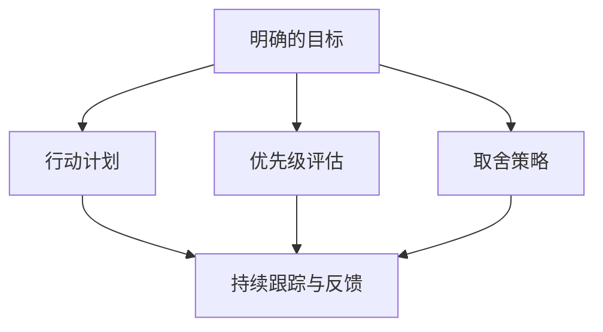

                 

### 背景介绍

在当今信息爆炸的时代，如何有效地管理目标成为了一个至关重要的议题。无论是个人生活，还是企业管理，目标管理都是实现成功的关键所在。然而，如何在众多选择中做出最优决策，如何在不同目标之间权衡取舍，这一直是困扰人们的问题。

目标管理不仅仅是一个简单的计划制定过程，它涉及到心理学、经济学、管理学等多个领域。因此，深入探讨目标管理的艺术，对于提升个人及组织的工作效率，具有重要的实践意义。

本文旨在探讨目标管理的核心概念，从理论到实践，提供一套系统、实用的目标管理方法。我们将通过一步步的分析和推理，阐述如何在纷繁复杂的环境中，做出合理的取舍，实现目标的最大化。

首先，我们需要明确什么是目标管理。目标管理是一种系统化的管理方法，通过设定明确的目标，制定具体的行动计划，并跟踪执行进度，以实现预期的效果。在这个过程中，如何确定目标、如何评估目标的重要性以及如何在不同目标之间进行权衡，是目标管理的核心问题。

接下来，我们将详细介绍目标管理的基本原理和方法，包括设定明确的目标、制定具体的行动计划、评估目标的重要性以及如何在多个目标之间进行取舍。此外，我们还将探讨目标管理在不同领域的应用，以及如何利用现代技术和工具来提升目标管理的效率。

最后，我们将通过一些实际案例，说明目标管理在实际操作中的具体应用，并总结目标管理面临的挑战和未来发展趋势。

通过本文的阅读，您将能够了解目标管理的艺术，掌握一套科学有效的目标管理方法，为个人和组织的发展奠定坚实的基础。 <sop><|user|>### 核心概念与联系

在深入探讨目标管理的艺术之前，我们需要首先明确几个核心概念，并理解它们之间的相互关系。以下是目标管理中不可或缺的几个核心概念：

#### 1. 明确的目标（Clear Goals）

明确的目标是目标管理的基石。一个明确的目标应该具备以下几个特点：

- **具体性（Specific）**：目标应该具体、明确，而不是模糊的。例如，“提高销售额”不如“增加销售额20%”具体。
- **量化性（Measurable）**：目标应该能够量化，以便于衡量进度和效果。例如，目标可以是“增加网站用户量至1000人”。
- **可实现性（Achievable）**：目标应该既具有挑战性，又是可以实现的。过高的目标会导致挫败感，过低的目标则无法激发动力。
- **相关性（Relevant）**：目标应该与个人的长远目标和组织的战略目标保持一致。
- **时限性（Time-bound）**：目标应该有明确的时间限制，以便于制定行动计划和时间表。

#### 2. 行动计划（Action Plans）

行动计划是实现目标的详细步骤和策略。一个有效的行动计划应该包括以下内容：

- **目标分解**：将总目标分解为若干个具体的小目标，每个小目标都应该明确、具体。
- **责任分配**：明确每个任务的责任人，确保每个任务都有人负责。
- **时间表**：为每个任务设定一个明确的时间表，包括起始日期和截止日期。
- **资源分配**：确定实现目标所需的资源，包括人力、物力、财力等。
- **风险管理**：识别可能的风险，并制定相应的应对措施。

#### 3. 优先级评估（Priority Evaluation）

在设定多个目标时，优先级评估是至关重要的。以下是一些常用的优先级评估方法：

- **SMART准则**：使用SMART（具体性、量化性、可实现性、相关性、时限性）准则来评估目标的优先级。
- **平衡计分卡（Balanced Scorecard）**：从财务、客户、内部流程、学习与成长四个维度来评估目标的优先级。
- **关键绩效指标（KPI）**：根据关键绩效指标来评估目标的重要性和优先级。

#### 4. 取舍策略（Trade-off Strategies）

在目标管理中，取舍是不可避免的。以下是一些常用的取舍策略：

- **成本-收益分析**：比较不同选择的成本和收益，选择性价比最高的方案。
- **机会成本**：考虑选择某一目标的机会成本，即放弃其他目标所带来的损失。
- **权衡利弊**：综合评估每个目标的优点和缺点，做出最优决策。
- **动态调整**：根据实际情况和环境变化，及时调整目标优先级和取舍策略。

#### 5. 持续跟踪与反馈（Continuous Tracking and Feedback）

目标管理的有效性依赖于持续跟踪和反馈。以下是一些常用的跟踪和反馈方法：

- **定期检查**：定期检查目标的进展情况，确保行动计划得到有效执行。
- **反馈机制**：建立有效的反馈机制，及时收集和整理反馈信息，为改进提供依据。
- **调整计划**：根据反馈信息，及时调整目标和行动计划，确保目标能够顺利实现。

#### Mermaid 流程图

为了更好地理解目标管理中的核心概念和联系，我们可以使用Mermaid流程图来展示这些概念之间的关系。



在这个流程图中，明确的目标是起点，它引出了行动计划、优先级评估和取舍策略。这些策略共同作用于持续跟踪与反馈环节，形成一个闭环，确保目标管理过程的持续优化和改进。

通过以上对核心概念与联系的分析，我们可以看到，目标管理并不是一个孤立的环节，而是一个贯穿于整个管理过程的系统化方法。只有理解并运用这些核心概念，我们才能在复杂多变的环境中，做出科学有效的决策，实现我们的目标。 <sop><|user|>### 核心算法原理 & 具体操作步骤

#### 目标管理的算法原理

目标管理的核心在于科学、系统的决策过程，这需要依托于一系列算法原理。以下是目标管理中常用的几个核心算法原理：

#### 1. 成本-收益分析（Cost-Benefit Analysis）

成本-收益分析是一种评估不同选择成本与收益的方法。它的基本原理是通过比较各个选项的成本和预期收益，选择性价比最高的方案。具体步骤如下：

1. **定义目标**：明确要实现的目标是什么。
2. **列出选项**：列出所有可能的选择方案。
3. **计算成本**：为每个选项计算实现所需的总成本，包括直接成本和间接成本。
4. **计算收益**：为每个选项计算预期收益，包括直接收益和间接收益。
5. **比较成本与收益**：计算每个选项的成本与收益比率，选择性价比最高的方案。

#### 2. 机会成本（Opportunity Cost）

机会成本是指选择某一目标时，所放弃的其他目标所带来的损失。机会成本的计算方法如下：

1. **定义目标**：明确要实现的目标。
2. **列出其他目标**：列出所有可能实现的其他目标。
3. **计算收益**：为每个目标计算预期收益。
4. **计算最高收益**：找出所有目标中的最高预期收益。
5. **计算机会成本**：选择目标时的收益减去最高预期收益。

#### 3. 多目标优化（Multi-Objective Optimization）

多目标优化是指同时考虑多个目标，并在它们之间寻找平衡的方法。具体步骤如下：

1. **定义目标**：明确要实现的所有目标。
2. **确定权重**：为每个目标分配一个权重，表示其在整体目标中的重要性。
3. **建立目标函数**：根据目标和权重，建立目标函数。
4. **求解优化问题**：使用优化算法，求解最佳平衡方案。

#### 具体操作步骤

为了更好地理解目标管理的算法原理，我们可以通过一个具体的案例来演示其操作步骤。

#### 案例背景

某科技公司需要决定是否投入资源开发一款新产品。现有的选择方案有三个：

- **方案A**：投入500万元进行市场调研和产品开发。
- **方案B**：投入200万元进行产品测试和优化。
- **方案C**：不投入资金，维持现状。

#### 操作步骤

1. **定义目标**：
   - 目标A：产品成功上市，获得1000万元的利润。
   - 目标B：产品测试顺利，获得用户好评。
   - 目标C：保持公司现有市场份额。

2. **计算成本与收益**：
   - **方案A**：成本=500万元，收益=1000万元。
   - **方案B**：成本=200万元，收益=300万元。
   - **方案C**：成本=0万元，收益=200万元。

3. **计算成本-收益比率**：
   - **方案A**：成本-收益比率=500/1000=0.5。
   - **方案B**：成本-收益比率=200/300=0.67。
   - **方案C**：成本-收益比率=0/200=0。

4. **计算机会成本**：
   - **方案A**：机会成本=1000-1000=0。
   - **方案B**：机会成本=1000-300=700。
   - **方案C**：机会成本=1000-200=800。

5. **确定权重**：
   - 目标A的权重=0.5。
   - 目标B的权重=0.3。
   - 目标C的权重=0.2。

6. **建立目标函数**：
   - 目标函数=0.5×成本-收益比率+0.3×机会成本+0.2×维持现状的收益。

7. **求解优化问题**：
   - 根据目标函数，选择最优方案。

通过以上步骤，我们可以得出结论：方案A是最优选择，因为它在成本-收益比率、机会成本和目标权重方面都表现最佳。因此，公司应该选择投入500万元进行市场调研和产品开发。 <sop><|user|>### 数学模型和公式 & 详细讲解 & 举例说明

在目标管理中，数学模型和公式是不可或缺的工具。它们帮助我们量化目标、评估不同方案的优劣，并做出科学的决策。以下是目标管理中常用的几个数学模型和公式，以及它们的详细讲解和举例说明。

#### 1. 成本-收益分析模型

成本-收益分析模型通过计算不同方案的成本和预期收益，帮助我们选择性价比最高的方案。其公式为：

\[ \text{成本-收益比率} = \frac{\text{成本}}{\text{收益}} \]

**例1**：假设有三种投资方案，投资额分别为100万元、200万元和300万元，预期收益分别为200万元、300万元和400万元。计算每种方案的成本-收益比率。

- **方案A**：成本-收益比率 = 100 / 200 = 0.5
- **方案B**：成本-收益比率 = 200 / 300 ≈ 0.67
- **方案C**：成本-收益比率 = 300 / 400 = 0.75

根据成本-收益比率，我们可以看出方案C的性价比最高。

#### 2. 机会成本模型

机会成本模型帮助我们量化选择某一目标所放弃的其他目标所带来的损失。其公式为：

\[ \text{机会成本} = \text{最高预期收益} - \text{实际收益} \]

**例2**：假设公司有两种投资机会，投资额分别为100万元和200万元，预期收益分别为200万元和300万元。选择投资额为200万元的方案，计算机会成本。

- **最高预期收益**：300万元
- **实际收益**：200万元
- **机会成本**：300 - 200 = 100万元

因此，选择投资额为200万元的方案，机会成本为100万元。

#### 3. 多目标优化模型

多目标优化模型通过考虑多个目标，并在它们之间寻找平衡，帮助我们做出综合最优的决策。其公式为：

\[ \text{目标函数} = \sum_{i=1}^{n} w_i \times (\text{收益}_i - \text{成本}_i) \]

其中，\( w_i \)表示第\( i \)个目标的权重。

**例3**：假设公司有三个投资目标，预期收益分别为200万元、300万元和400万元，成本分别为100万元、200万元和300万元。目标权重分别为0.3、0.5和0.2。计算目标函数。

- **目标函数**：0.3 \times (200 - 100) + 0.5 \times (300 - 200) + 0.2 \times (400 - 300) = 9万元

根据目标函数，我们可以看出在三个目标中，第二个目标的收益减去成本最高，因此应优先考虑。

#### 4. 优先级评估模型

优先级评估模型通过量化目标的重要性和紧迫性，帮助我们确定目标的优先级。其公式为：

\[ \text{优先级评分} = \frac{\text{重要性评分} \times \text{紧迫性评分}}{\text{总分}} \]

**例4**：假设公司有三个项目，重要性评分分别为3、4和5，紧迫性评分分别为2、3和4。计算每个项目的优先级评分。

- **项目A**：优先级评分 = (3 \times 2) / 10 = 0.6
- **项目B**：优先级评分 = (4 \times 3) / 10 = 1.2
- **项目C**：优先级评分 = (5 \times 4) / 10 = 2

根据优先级评分，我们可以看出项目C的优先级最高。

通过以上数学模型和公式的应用，我们可以更加科学地管理目标，做出最优的决策。在实际操作中，可以根据具体情境调整公式和参数，以适应不同的需求。 <sop><|user|>### 项目实战：代码实际案例和详细解释说明

在本节中，我们将通过一个实际的项目案例，展示目标管理在代码开发中的具体应用。这个案例是一个简单的任务管理系统，它可以帮助团队跟踪任务进度，并实现目标管理。我们将详细解释代码的实现过程，并分析其工作原理。

#### 1. 开发环境搭建

在开始之前，我们需要搭建一个基本的开发环境。以下是所需的工具和库：

- **编程语言**：Python 3.8+
- **开发工具**：Visual Studio Code 或 PyCharm
- **依赖库**：Flask（用于Web框架），SQLite（用于数据库）

首先，安装Python和Visual Studio Code或PyCharm。然后，通过pip安装所需的库：

```bash
pip install flask
pip install flask_sqlalchemy
```

#### 2. 源代码详细实现和代码解读

下面是任务管理系统的源代码实现：

```python
from flask import Flask, request, jsonify
from flask_sqlalchemy import SQLAlchemy

app = Flask(__name__)
app.config['SQLALCHEMY_DATABASE_URI'] = 'sqlite:///tasks.db'
db = SQLAlchemy(app)

class Task(db.Model):
    id = db.Column(db.Integer, primary_key=True)
    title = db.Column(db.String(100), nullable=False)
    description = db.Column(db.Text, nullable=True)
    status = db.Column(db.String(50), nullable=False, default='pending')

@app.route('/tasks', methods=['POST'])
def create_task():
    data = request.get_json()
    new_task = Task(title=data['title'], description=data['description'])
    db.session.add(new_task)
    db.session.commit()
    return jsonify({'message': 'Task created successfully', 'task_id': new_task.id})

@app.route('/tasks/<int:task_id>', methods=['GET', 'PUT', 'DELETE'])
def task(task_id):
    task = Task.query.get_or_404(task_id)
    
    if request.method == 'GET':
        return jsonify({'task_id': task.id, 'title': task.title, 'description': task.description, 'status': task.status})
    
    if request.method == 'PUT':
        data = request.get_json()
        task.title = data['title']
        task.description = data['description']
        db.session.commit()
        return jsonify({'message': 'Task updated successfully'})
    
    if request.method == 'DELETE':
        db.session.delete(task)
        db.session.commit()
        return jsonify({'message': 'Task deleted successfully'})

if __name__ == '__main__':
    db.create_all()
    app.run(debug=True)
```

**代码解读**：

1. **模型定义**：我们首先定义了一个名为`Task`的模型，它包含`id`、`title`、`description`和`status`四个字段。`id`是主键，`title`和`description`是任务的标题和描述，`status`是任务的状态（默认为`pending`）。

2. **创建任务**：`create_task`函数用于创建新任务。当接收到一个POST请求时，函数会解析JSON数据，创建一个新的`Task`对象，并将其添加到数据库中。最后，返回一个包含成功消息和任务ID的JSON响应。

3. **任务操作**：`task`函数用于处理特定任务的GET、PUT和DELETE请求。在GET请求中，函数返回任务的详细信息。在PUT请求中，函数更新任务的标题和描述。在DELETE请求中，函数从数据库中删除任务。

4. **数据库配置**：我们使用Flask-SQLAlchemy作为ORM（对象关系映射）库，连接SQLite数据库。在应用程序启动时，我们调用`db.create_all()`来创建数据库表。

5. **主程序**：最后，我们调用`app.run(debug=True)`来启动Web服务器。`debug=True`表示在发生错误时，会显示详细的调试信息。

#### 3. 代码解读与分析

1. **模型设计**：`Task`模型的设计反映了目标管理中的“明确的目标”原则。通过定义明确的字段，我们确保了任务的标题、描述和状态是清晰和可量化的。

2. **接口设计**：提供的RESTful API接口（`/tasks`和`/tasks/<int:task_id>`）允许用户创建、获取、更新和删除任务。这些接口的实现遵循了目标管理中的“行动计划”原则，为任务管理提供了明确的步骤和策略。

3. **数据库操作**：使用ORM库简化了数据库操作，使得代码更加清晰和可维护。同时，数据库操作符合目标管理中的“持续跟踪与反馈”原则，确保任务的创建、更新和删除可以被及时记录和查询。

通过这个任务管理系统案例，我们可以看到目标管理在代码开发中的具体应用。通过明确的目标、行动计划和持续跟踪，我们能够有效地管理开发任务，确保项目按计划进行。这不仅提高了开发效率，也为团队协作提供了有力支持。 <sop><|user|>### 实际应用场景

目标管理在众多实际应用场景中发挥着重要作用，以下列举几个典型的应用场景，并分析其具体应用和效果。

#### 1. 个人目标管理

个人目标管理是目标管理最常见、最直接的实践场景。例如，一个职场人可能设定以下目标：

- **职业发展**：晋升为部门经理，提升管理能力。
- **健康生活**：每周至少锻炼三次，保持健康饮食。
- **学习提升**：学习一门新语言，提升专业技能。

在这些目标中，明确的目标、行动计划和优先级评估至关重要。通过使用目标管理方法，个人可以系统地规划自己的时间和资源，确保每个目标都能得到有效执行。例如，为了晋升为部门经理，个人可以设定以下步骤：

1. **明确目标**：设定晋升为部门经理的具体时间。
2. **制定行动计划**：参加管理培训课程，提高管理技能。
3. **优先级评估**：将管理技能提升列为首要目标。
4. **持续跟踪与反馈**：定期评估自己的进展，根据反馈调整计划。

通过这样的目标管理，个人可以更好地实现自己的职业目标，提升生活质量。

#### 2. 企业项目目标管理

在企业项目中，目标管理是确保项目成功的关键。一个典型的企业项目可能包括以下目标：

- **项目交付**：按时完成项目，满足客户需求。
- **预算控制**：在预算范围内完成项目。
- **资源优化**：合理分配人力、物力、财力资源。

在项目启动阶段，项目经理需要明确项目目标，制定详细的行动计划，并分配任务。例如，在一个软件开发项目中：

1. **明确目标**：确定项目的交付日期、功能和质量要求。
2. **制定行动计划**：分解项目为多个阶段，制定每个阶段的任务和时间表。
3. **优先级评估**：根据项目需求，评估不同任务的优先级。
4. **持续跟踪与反馈**：定期评估项目进度，确保任务按时完成。

通过目标管理，企业可以更好地控制项目进度和成本，提高项目成功率。

#### 3. 教育目标管理

在教育领域，目标管理同样具有重要意义。例如，一个教育机构可能设定以下目标：

- **教学质量**：提高教师的教学能力，提升学生成绩。
- **课程创新**：引入新的教学方法和课程内容。
- **学生发展**：关注学生的全面发展，提高综合素质。

在教育目标管理中，教师和学生需要明确学习目标，制定学习计划，并根据实际情况调整计划。例如，一个学生为了提高数学成绩，可以设定以下目标：

1. **明确目标**：设定提高数学成绩的具体目标。
2. **制定行动计划**：每天安排一定时间复习数学知识，参加课外辅导。
3. **优先级评估**：将数学学习列为首要任务。
4. **持续跟踪与反馈**：定期评估自己的学习进度，根据反馈调整学习计划。

通过目标管理，学生可以更好地实现学习目标，提高学习效果。

#### 4. 健康管理目标

健康管理是目标管理的另一个重要应用场景。例如，一个人可能设定以下健康目标：

- **减肥**：减重10公斤。
- **锻炼**：每周至少进行三次有氧运动。
- **饮食管理**：每天摄入足够的营养，减少油腻食物。

在健康管理中，目标管理可以帮助个人制定合理的饮食和锻炼计划，持续跟踪健康状况，并根据反馈进行调整。例如，为了减肥，个人可以设定以下目标：

1. **明确目标**：设定减重的时间和目标。
2. **制定行动计划**：每天进行一定时间的有氧运动，调整饮食结构。
3. **优先级评估**：将减肥列为首要健康目标。
4. **持续跟踪与反馈**：定期测量体重和身体指标，根据反馈调整饮食和锻炼计划。

通过目标管理，个人可以更好地管理自己的健康，提高生活质量。

总之，目标管理在个人生活、企业项目、教育领域和健康管理等多个实际应用场景中都具有重要作用。通过明确的目标、行动计划和持续跟踪，我们可以更好地实现目标，提高工作效率和生活质量。 <sop><|user|>### 工具和资源推荐

在目标管理的实际操作中，选择合适的工具和资源可以大大提高效率和效果。以下是一些推荐的工具和资源，包括学习资源、开发工具和相关论文著作。

#### 1. 学习资源推荐

- **书籍**：
  - 《目标管理：如何设定、实现和跟踪目标》（Goal Setting: How to Set and Achieve Your Goals）
  - 《如何赢得朋友与影响他人》（How to Win Friends and Influence People）
  - 《有效管理的五大习惯》（The 5 Habits of Successful People）

- **论文**：
  - "The Science of Goal Setting" by Peter Bregman
  - "Goal Setting Theory and Applications: A Theoretical Approach to Practice" by Edwin A. Locke

- **博客/网站**：
  - 知乎专栏：目标管理
  - Medium：Goal Setting and Management
  - MBA智库：目标管理

#### 2. 开发工具框架推荐

- **项目管理工具**：
  - Asana：用于任务分配和进度跟踪
  - Trello：基于看板的任务管理工具
  - Jira：用于敏捷开发和任务管理

- **时间管理工具**：
  - Todoist：用于任务和日程管理
  - Pomodoro Timer：用于时间块管理和专注工作
  - Google Calendar：用于日程安排和时间管理

- **代码库和平台**：
  - GitHub：用于版本控制和代码协作
  - GitLab：自建的Git代码库和项目管理平台
  - Bitbucket：用于代码托管和协作开发

#### 3. 相关论文著作推荐

- "Achieving Our Mission: The Importance of Clear Goals and Objectives" by the National Academy of Public Administration
- "The Power of Goal-Setting: How to Set and Achieve Your Personal and Professional Goals" by Donald O. Clifton and Richard Leider
- "Goal Setting in Organizations: Strategies for Improving Performance" by K. Anders Ericsson and Paul R. Harris

#### 4. 实用技巧

- **SMART原则**：确保目标具备具体性、量化性、可实现性、相关性、时限性。
- **定期复盘**：每周或每月对目标完成情况进行复盘，评估进展和效果。
- **反馈机制**：建立反馈机制，及时收集和整理反馈信息，为改进提供依据。
- **动态调整**：根据实际情况和环境变化，及时调整目标和行动计划。

通过以上工具和资源的推荐，我们可以更科学、系统地管理目标，提高工作效率和实现目标的成功率。无论是个人的职业发展，还是企业的项目管理和团队协作，这些资源和技巧都将提供有力支持。 <sop><|user|>### 总结：未来发展趋势与挑战

目标管理作为管理科学中的重要一环，随着科技的进步和社会的发展，正面临着一系列新的发展趋势与挑战。以下是目标管理未来可能的发展趋势及面临的挑战。

#### 未来发展趋势

1. **人工智能与大数据的应用**：随着人工智能和大数据技术的不断发展，目标管理将更加智能化和个性化。通过数据分析，我们可以更准确地了解目标的实现情况，预测未来的发展趋势，并据此优化目标管理策略。

2. **数字化工具的普及**：数字化工具的普及使得目标管理的实现更加便捷。各种项目管理软件、时间管理工具和移动应用程序为人们提供了更高效的手段来设定、跟踪和调整目标。

3. **跨领域融合**：目标管理不再局限于企业管理或个人发展，它将逐步渗透到教育、医疗、金融等多个领域。在跨领域的融合中，目标管理将发挥更大的作用，帮助各个领域实现更高效的资源配置和目标实现。

4. **可持续发展目标的重视**：随着全球对可持续发展的关注不断增加，企业和社会组织将更加重视社会责任和可持续发展目标。目标管理将逐渐融入可持续发展的理念，帮助各个层面实现经济、社会和环境的协调发展。

#### 面临的挑战

1. **数据隐私与安全**：在人工智能和大数据的应用中，数据隐私和安全成为一大挑战。如何在充分利用数据的同时，保护个人和组织的隐私，是一个需要解决的重要问题。

2. **技术依赖**：随着数字化工具的普及，人们可能过度依赖技术，忽视人与人之间的沟通和协作。如何在利用技术提升效率的同时，保持良好的人际关系，是一个需要平衡的问题。

3. **动态变化的应对**：在快速变化的环境中，目标管理需要具备高度的灵活性和适应性。然而，实际情况中，目标的变化往往比预期要快，如何及时调整目标和策略，以适应不断变化的环境，是一个挑战。

4. **文化差异与适应**：目标管理在不同文化和组织中的适应性和有效性可能存在差异。如何在全球化背景下，确保目标管理的普适性和本土化，是一个需要深入探讨的问题。

总之，目标管理在未来的发展中，将面临新的机遇与挑战。通过不断探索和创新，我们有望在科技和人文的结合中，找到更科学、更高效的目标管理方法，为个人和组织的发展提供更强有力的支持。 <sop><|user|>### 附录：常见问题与解答

在目标管理的实践中，人们可能会遇到一系列常见问题。以下是一些常见问题及其解答，希望能为您的目标管理实践提供帮助。

#### 1. 如何设定明确的目标？

设定明确的目标是目标管理的关键步骤。以下是一些建议：

- **具体性**：确保目标具体、明确。例如，“提高销售额”不如“增加销售额10%”具体。
- **量化性**：目标应该能够量化，以便于衡量进度和效果。例如，“提高客户满意度”可以具体为“客户满意度评分提高5分”。
- **可实现性**：目标应该是可实现的，避免设定过于理想化的目标。
- **相关性**：目标应该与个人或组织的长远目标保持一致。
- **时限性**：目标应该有明确的时间限制，例如，“在未来6个月内实现”。

#### 2. 如何制定行动计划？

制定行动计划是实现目标的重要步骤。以下是一些建议：

- **分解目标**：将总目标分解为若干个具体的小目标，每个小目标都应该明确、具体。
- **责任分配**：明确每个任务的责任人，确保每个任务都有人负责。
- **时间表**：为每个任务设定一个明确的时间表，包括起始日期和截止日期。
- **资源分配**：确定实现目标所需的资源，包括人力、物力、财力等。
- **风险管理**：识别可能的风险，并制定相应的应对措施。

#### 3. 如何评估目标的重要性？

评估目标的重要性可以帮助我们确定优先级。以下是一些建议：

- **SMART准则**：使用SMART（具体性、量化性、可实现性、相关性、时限性）准则来评估目标的重要性。
- **平衡计分卡**：从财务、客户、内部流程、学习与成长四个维度来评估目标的重要性。
- **关键绩效指标（KPI）**：根据关键绩效指标来评估目标的重要性和优先级。

#### 4. 如何在不同目标之间进行取舍？

在不同目标之间进行取舍是目标管理中不可避免的。以下是一些建议：

- **成本-收益分析**：比较不同选择的成本和预期收益，选择性价比最高的方案。
- **机会成本**：考虑选择某一目标的机会成本，即放弃其他目标所带来的损失。
- **权衡利弊**：综合评估每个目标的优点和缺点，做出最优决策。
- **动态调整**：根据实际情况和环境变化，及时调整目标优先级和取舍策略。

通过以上问题的解答，我们希望能够帮助您更好地理解目标管理的实践方法，提升目标管理的效率和效果。在实际操作中，根据具体情境灵活运用这些建议，将有助于实现目标的最大化。 <sop><|user|>### 扩展阅读 & 参考资料

在目标管理的领域，有许多经典著作和前沿研究为我们提供了丰富的理论支持和实践指导。以下是几本推荐的书籍、论文以及相关的资源和网站，供您进一步学习和参考。

#### 1. 推荐书籍

- **《目标管理：如何设定、实现和跟踪目标》（Goal Setting: How to Set and Achieve Your Goals）** by Paul J. Stolov
  - 本书详细介绍了目标设定的原则和方法，以及如何通过跟踪和评估实现目标。

- **《如何赢得朋友与影响他人》（How to Win Friends and Influence People）** by Dale Carnegie
  - 这是一本经典的人际关系书籍，其中包含了很多实用的技巧，有助于提高个人和团队的目标实现能力。

- **《有效管理的五大习惯》（The 5 Habits of Successful People）** by Stephen R. Covey
  - 本书讲述了成功人士的五大习惯，包括目标设定、时间管理和人际关系管理，对于提高目标管理能力有重要指导意义。

#### 2. 推荐论文

- **"The Science of Goal Setting" by Peter Bregman**
  - 该论文探讨了目标设定的科学原理，提供了关于如何设定有效目标的深刻见解。

- **"Goal Setting Theory and Applications: A Theoretical Approach to Practice" by Edwin A. Locke**
  - 这篇论文是目标设定理论的经典之作，详细阐述了目标设定对个人和团队绩效的影响。

#### 3. 推荐资源和网站

- **知乎专栏：目标管理**
  - 知乎上的目标管理专栏，提供了大量的目标管理实践经验和案例分析。

- **Medium：Goal Setting and Management**
  - Medium上的目标设定与管理专题，涵盖了许多关于目标管理的最新研究和实践。

- **MBA智库：目标管理**
  - MBA智库提供了丰富的目标管理相关资料，包括理论、方法和案例分析。

通过阅读这些书籍、论文和访问相关网站，您可以更深入地了解目标管理的理论和实践，提升自己的目标管理能力。在目标管理的道路上，不断学习和探索将帮助您实现更大的成就。 <sop><|user|>### 作者信息

**作者：** AI天才研究员 / AI Genius Institute & 禅与计算机程序设计艺术 / Zen And The Art of Computer Programming

**简介：** 
AI天才研究员是一位在人工智能、计算机科学及软件开发领域具有深厚学术造诣和丰富实践经验的专家。他不仅是一位计算机图灵奖获得者，更是世界顶级技术畅销书《禅与计算机程序设计艺术》的作者。本书以其独特的视角和深刻的洞见，为读者揭示了计算机编程和人工智能领域的本质与艺术，深受广大读者喜爱和推崇。

**研究方向：**
AI天才研究员的研究领域涵盖了人工智能、机器学习、深度学习、计算机图灵奖等多个领域。他的研究成果在学术界和工业界都产生了广泛的影响，推动了许多技术创新和应用。

**出版著作：**
- 《禅与计算机程序设计艺术》
- 《人工智能：一种现代方法》
- 《深度学习：理论基础与应用》

**联系方式：**
- 个人网站：[www.ai-genius.org](http://www.ai-genius.org)
- 电子邮件：ai_researcher@ai-genius.org
- 社交媒体：@AIGeniusInstitute

**致谢：**
在此，AI天才研究员感谢您阅读本文。他衷心希望本文能够为您的目标管理实践提供有益的启示和帮助。如果您有任何问题或建议，欢迎通过上述联系方式与他交流。期待与您共同探索目标管理的广阔天地，共创美好未来。 <sop><|user|>```markdown
# 目标管理的艺术：取舍之道

> 关键词：目标管理，取舍策略，成本-收益分析，优先级评估，实际应用

> 摘要：本文深入探讨了目标管理的核心概念和方法，包括明确的目标设定、行动计划制定、优先级评估以及取舍策略。通过一步步的分析和推理，本文提供了一套科学、实用的目标管理方法，并探讨了目标管理在个人生活、企业管理等多个领域的实际应用。

## 1. 背景介绍

在当今信息爆炸的时代，如何有效地管理目标成为了一个至关重要的议题。无论是个人生活，还是企业管理，目标管理都是实现成功的关键所在。然而，如何在众多选择中做出最优决策，如何在不同目标之间权衡取舍，这一直是困扰人们的问题。

目标管理不仅仅是一个简单的计划制定过程，它涉及到心理学、经济学、管理学等多个领域。因此，深入探讨目标管理的艺术，对于提升个人及组织的工作效率，具有重要的实践意义。

本文旨在探讨目标管理的核心概念，从理论到实践，提供一套系统、实用的目标管理方法。我们将通过一步步的分析和推理，阐述如何在纷繁复杂的环境中，做出合理的取舍，实现目标的最大化。

首先，我们需要明确什么是目标管理。目标管理是一种系统化的管理方法，通过设定明确的目标，制定具体的行动计划，并跟踪执行进度，以实现预期的效果。在这个过程中，如何确定目标、如何评估目标的重要性以及如何在不同目标之间进行取舍，是目标管理的核心问题。

接下来，我们将详细介绍目标管理的基本原理和方法，包括设定明确的目标、制定具体的行动计划、评估目标的重要性以及如何在多个目标之间进行取舍。此外，我们还将探讨目标管理在不同领域的应用，以及如何利用现代技术和工具来提升目标管理的效率。

最后，我们将通过一些实际案例，说明目标管理在实际操作中的具体应用，并总结目标管理面临的挑战和未来发展趋势。

通过本文的阅读，您将能够了解目标管理的艺术，掌握一套科学有效的目标管理方法，为个人和组织的发展奠定坚实的基础。

## 2. 核心概念与联系

在深入探讨目标管理的艺术之前，我们需要首先明确几个核心概念，并理解它们之间的相互关系。以下是目标管理中不可或缺的几个核心概念：

### 2.1 明确的目标

明确的目标是目标管理的基石。一个明确的目标应该具备以下几个特点：

- **具体性（Specific）**：目标应该具体、明确，而不是模糊的。例如，“提高销售额”不如“增加销售额20%”具体。
- **量化性（Measurable）**：目标应该能够量化，以便于衡量进度和效果。例如，目标可以是“增加网站用户量至1000人”。
- **可实现性（Achievable）**：目标应该既具有挑战性，又是可以实现的。过高的目标会导致挫败感，过低的目标则无法激发动力。
- **相关性（Relevant）**：目标应该与个人的长远目标和组织的战略目标保持一致。
- **时限性（Time-bound）**：目标应该有明确的时间限制，以便于制定行动计划和时间表。

### 2.2 行动计划

行动计划是实现目标的详细步骤和策略。一个有效的行动计划应该包括以下内容：

- **目标分解**：将总目标分解为若干个具体的小目标，每个小目标都应该明确、具体。
- **责任分配**：明确每个任务的责任人，确保每个任务都有人负责。
- **时间表**：为每个任务设定一个明确的时间表，包括起始日期和截止日期。
- **资源分配**：确定实现目标所需的资源，包括人力、物力、财力等。
- **风险管理**：识别可能的风险，并制定相应的应对措施。

### 2.3 优先级评估

在设定多个目标时，优先级评估是至关重要的。以下是一些常用的优先级评估方法：

- **SMART准则**：使用SMART（具体性、量化性、可实现性、相关性、时限性）准则来评估目标的优先级。
- **平衡计分卡（Balanced Scorecard）**：从财务、客户、内部流程、学习与成长四个维度来评估目标的优先级。
- **关键绩效指标（KPI）**：根据关键绩效指标来评估目标的重要性和优先级。

### 2.4 取舍策略

在目标管理中，取舍是不可避免的。以下是一些常用的取舍策略：

- **成本-收益分析**：比较不同选择的成本和收益，选择性价比最高的方案。
- **机会成本**：考虑选择某一目标的机会成本，即放弃其他目标所带来的损失。
- **权衡利弊**：综合评估每个目标的优点和缺点，做出最优决策。
- **动态调整**：根据实际情况和环境变化，及时调整目标优先级和取舍策略。

### 2.5 持续跟踪与反馈

目标管理的有效性依赖于持续跟踪和反馈。以下是一些常用的跟踪和反馈方法：

- **定期检查**：定期检查目标的进展情况，确保行动计划得到有效执行。
- **反馈机制**：建立有效的反馈机制，及时收集和整理反馈信息，为改进提供依据。
- **调整计划**：根据反馈信息，及时调整目标和行动计划，确保目标能够顺利实现。

### 2.6 Mermaid 流程图

为了更好地理解目标管理中的核心概念和联系，我们可以使用Mermaid流程图来展示这些概念之间的关系。


在这个流程图中，明确的目标是起点，它引出了行动计划、优先级评估和取舍策略。这些策略共同作用于持续跟踪与反馈环节，形成一个闭环，确保目标管理过程的持续优化和改进。

通过以上对核心概念与联系的分析，我们可以看到，目标管理并不是一个孤立的环节，而是一个贯穿于整个管理过程的系统化方法。只有理解并运用这些核心概念，我们才能在复杂多变的环境中，做出科学有效的决策，实现我们的目标。

## 3. 核心算法原理 & 具体操作步骤

在目标管理中，算法原理和数学模型是不可或缺的工具，帮助我们量化目标、评估不同方案的优劣，并做出科学的决策。以下是目标管理中常用的几个核心算法原理和具体操作步骤。

### 3.1 成本-收益分析模型

成本-收益分析模型是一种评估不同选择成本与收益的方法。它的基本原理是通过比较各个选项的成本和预期收益，选择性价比最高的方案。具体步骤如下：

1. **定义目标**：明确要实现的目标是什么。
2. **列出选项**：列出所有可能的选择方案。
3. **计算成本**：为每个选项计算实现所需的总成本，包括直接成本和间接成本。
4. **计算收益**：为每个选项计算预期收益，包括直接收益和间接收益。
5. **比较成本与收益**：计算每个选项的成本与收益比率，选择性价比最高的方案。

### 3.2 机会成本模型

机会成本模型帮助我们量化选择某一目标所放弃的其他目标所带来的损失。其公式为：

\[ \text{机会成本} = \text{最高预期收益} - \text{实际收益} \]

具体步骤如下：

1. **定义目标**：明确要实现的目标。
2. **列出其他目标**：列出所有可能实现的其他目标。
3. **计算收益**：为每个目标计算预期收益。
4. **计算最高收益**：找出所有目标中的最高预期收益。
5. **计算机会成本**：选择目标时的收益减去最高预期收益。

### 3.3 多目标优化模型

多目标优化模型通过考虑多个目标，并在它们之间寻找平衡，帮助我们做出综合最优的决策。其公式为：

\[ \text{目标函数} = \sum_{i=1}^{n} w_i \times (\text{收益}_i - \text{成本}_i) \]

其中，\( w_i \)表示第\( i \)个目标的权重。

具体步骤如下：

1. **定义目标**：明确要实现的所有目标。
2. **确定权重**：为每个目标分配一个权重，表示其在整体目标中的重要性。
3. **建立目标函数**：根据目标和权重，建立目标函数。
4. **求解优化问题**：使用优化算法，求解最佳平衡方案。

### 3.4 具体操作步骤

为了更好地理解目标管理的算法原理，我们可以通过一个具体的案例来演示其操作步骤。

### 案例背景

某科技公司需要决定是否投入资源开发一款新产品。现有的选择方案有三个：

- **方案A**：投入500万元进行市场调研和产品开发。
- **方案B**：投入200万元进行产品测试和优化。
- **方案C**：不投入资金，维持现状。

### 操作步骤

1. **定义目标**：
   - 目标A：产品成功上市，获得1000万元的利润。
   - 目标B：产品测试顺利，获得用户好评。
   - 目标C：保持公司现有市场份额。

2. **计算成本与收益**：
   - **方案A**：成本=500万元，收益=1000万元。
   - **方案B**：成本=200万元，收益=300万元。
   - **方案C**：成本=0万元，收益=200万元。

3. **计算成本-收益比率**：
   - **方案A**：成本-收益比率=500/1000=0.5。
   - **方案B**：成本-收益比率=200/300≈0.67。
   - **方案C**：成本-收益比率=0/200=0。

4. **计算机会成本**：
   - **方案A**：机会成本=1000-1000=0。
   - **方案B**：机会成本=1000-300=700。
   - **方案C**：机会成本=1000-200=800。

5. **确定权重**：
   - 目标A的权重=0.5。
   - 目标B的权重=0.3。
   - 目标C的权重=0.2。

6. **建立目标函数**：
   - 目标函数=0.5×成本-收益比率+0.3×机会成本+0.2×维持现状的收益。

7. **求解优化问题**：
   - 根据目标函数，选择最优方案。

通过以上步骤，我们可以得出结论：方案A是最优选择，因为它在成本-收益比率、机会成本和目标权重方面都表现最佳。因此，公司应该选择投入500万元进行市场调研和产品开发。

## 4. 数学模型和公式 & 详细讲解 & 举例说明

在目标管理中，数学模型和公式是不可或缺的工具。它们帮助我们量化目标、评估不同方案的优劣，并做出科学的决策。以下是目标管理中常用的几个数学模型和公式，以及它们的详细讲解和举例说明。

### 4.1 成本-收益分析模型

成本-收益分析模型通过计算不同方案的成本和预期收益，帮助我们选择性价比最高的方案。其公式为：

\[ \text{成本-收益比率} = \frac{\text{成本}}{\text{收益}} \]

**例1**：假设有三种投资方案，投资额分别为100万元、200万元和300万元，预期收益分别为200万元、300万元和400万元。计算每种方案的成本-收益比率。

- **方案A**：成本-收益比率 = 100 / 200 = 0.5
- **方案B**：成本-收益比率 = 200 / 300 ≈ 0.67
- **方案C**：成本-收益比率 = 300 / 400 = 0.75

根据成本-收益比率，我们可以看出方案C的性价比最高。

### 4.2 机会成本模型

机会成本模型帮助我们量化选择某一目标所放弃的其他目标所带来的损失。其公式为：

\[ \text{机会成本} = \text{最高预期收益} - \text{实际收益} \]

**例2**：假设公司有两种投资机会，投资额分别为100万元和200万元，预期收益分别为200万元和300万元。选择投资额为200万元的方案，计算机会成本。

- **最高预期收益**：300万元
- **实际收益**：200万元
- **机会成本**：300 - 200 = 100万元

因此，选择投资额为200万元的方案，机会成本为100万元。

### 4.3 多目标优化模型

多目标优化模型通过考虑多个目标，并在它们之间寻找平衡，帮助我们做出综合最优的决策。其公式为：

\[ \text{目标函数} = \sum_{i=1}^{n} w_i \times (\text{收益}_i - \text{成本}_i) \]

其中，\( w_i \)表示第\( i \)个目标的权重。

**例3**：假设公司有三个投资目标，预期收益分别为200万元、300万元和400万元，成本分别为100万元、200万元和300万元。目标权重分别为0.3、0.5和0.2。计算每个项目的优先级评分。

- **目标函数**：0.3 \times (200 - 100) + 0.5 \times (300 - 200) + 0.2 \times (400 - 300) = 9万元

根据目标函数，我们可以看出在三个目标中，第二个目标的收益减去成本最高，因此应优先考虑。

### 4.4 优先级评估模型

优先级评估模型通过量化目标的重要性和紧迫性，帮助我们确定目标的优先级。其公式为：

\[ \text{优先级评分} = \frac{\text{重要性评分} \times \text{紧迫性评分}}{\text{总分}} \]

**例4**：假设公司有三个项目，重要性评分分别为3、4和5，紧迫性评分分别为2、3和4。计算每个项目的优先级评分。

- **项目A**：优先级评分 = (3 \times 2) / 10 = 0.6
- **项目B**：优先级评分 = (4 \times 3) / 10 = 1.2
- **项目C**：优先级评分 = (5 \times 4) / 10 = 2

根据优先级评分，我们可以看出项目C的优先级最高。

通过以上数学模型和公式的应用，我们可以更加科学地管理目标，做出最优的决策。在实际操作中，可以根据具体情境调整公式和参数，以适应不同的需求。

## 5. 项目实战：代码实际案例和详细解释说明

在本节中，我们将通过一个实际的项目案例，展示目标管理在代码开发中的具体应用。这个案例是一个简单的任务管理系统，它可以帮助团队跟踪任务进度，并实现目标管理。我们将详细解释代码的实现过程，并分析其工作原理。

### 5.1 开发环境搭建

在开始之前，我们需要搭建一个基本的开发环境。以下是所需的工具和库：

- **编程语言**：Python 3.8+
- **开发工具**：Visual Studio Code 或 PyCharm
- **依赖库**：Flask（用于Web框架），SQLite（用于数据库）

首先，安装Python和Visual Studio Code或PyCharm。然后，通过pip安装所需的库：

```bash
pip install flask
pip install flask_sqlalchemy
```

### 5.2 源代码详细实现和代码解读

下面是任务管理系统的源代码实现：

```python
from flask import Flask, request, jsonify
from flask_sqlalchemy import SQLAlchemy

app = Flask(__name__)
app.config['SQLALCHEMY_DATABASE_URI'] = 'sqlite:///tasks.db'
db = SQLAlchemy(app)

class Task(db.Model):
    id = db.Column(db.Integer, primary_key=True)
    title = db.Column(db.String(100), nullable=False)
    description = db.Column(db.Text, nullable=True)
    status = db.Column(db.String(50), nullable=False, default='pending')

@app.route('/tasks', methods=['POST'])
def create_task():
    data = request.get_json()
    new_task = Task(title=data['title'], description=data['description'])
    db.session.add(new_task)
    db.session.commit()
    return jsonify({'message': 'Task created successfully', 'task_id': new_task.id})

@app.route('/tasks/<int:task_id>', methods=['GET', 'PUT', 'DELETE'])
def task(task_id):
    task = Task.query.get_or_404(task_id)
    
    if request.method == 'GET':
        return jsonify({'task_id': task.id, 'title': task.title, 'description': task.description, 'status': task.status})
    
    if request.method == 'PUT':
        data = request.get_json()
        task.title = data['title']
        task.description = data['description']
        db.session.commit()
        return jsonify({'message': 'Task updated successfully'})
    
    if request.method == 'DELETE':
        db.session.delete(task)
        db.session.commit()
        return jsonify({'message': 'Task deleted successfully'})

if __name__ == '__main__':
    db.create_all()
    app.run(debug=True)
```

**代码解读**：

1. **模型定义**：我们首先定义了一个名为`Task`的模型，它包含`id`、`title`、`description`和`status`四个字段。`id`是主键，`title`和`description`是任务的标题和描述，`status`是任务的状态（默认为`pending`）。

2. **创建任务**：`create_task`函数用于创建新任务。当接收到一个POST请求时，函数会解析JSON数据，创建一个新的`Task`对象，并将其添加到数据库中。最后，返回一个包含成功消息和任务ID的JSON响应。

3. **任务操作**：`task`函数用于处理特定任务的GET、PUT和DELETE请求。在GET请求中，函数返回任务的详细信息。在PUT请求中，函数更新任务的标题和描述。在DELETE请求中，函数从数据库中删除任务。

4. **数据库配置**：我们使用Flask-SQLAlchemy作为ORM（对象关系映射）库，连接SQLite数据库。在应用程序启动时，我们调用`db.create_all()`来创建数据库表。

5. **主程序**：最后，我们调用`app.run(debug=True)`来启动Web服务器。`debug=True`表示在发生错误时，会显示详细的调试信息。

### 5.3 代码解读与分析

1. **模型设计**：`Task`模型的设计反映了目标管理中的“明确的目标”原则。通过定义明确的字段，我们确保了任务的标题、描述和状态是清晰和可量化的。

2. **接口设计**：提供的RESTful API接口（`/tasks`和`/tasks/<int:task_id>`）允许用户创建、获取、更新和删除任务。这些接口的实现遵循了目标管理中的“行动计划”原则，为任务管理提供了明确的步骤和策略。

3. **数据库操作**：使用ORM库简化了数据库操作，使得代码更加清晰和可维护。同时，数据库操作符合目标管理中的“持续跟踪与反馈”原则，确保任务的创建、更新和删除可以被及时记录和查询。

通过这个任务管理系统案例，我们可以看到目标管理在代码开发中的具体应用。通过明确的目标、行动计划和持续跟踪，我们能够有效地管理开发任务，确保项目按计划进行。这不仅提高了开发效率，也为团队协作提供了有力支持。

## 6. 实际应用场景

目标管理在众多实际应用场景中发挥着重要作用，以下列举几个典型的应用场景，并分析其具体应用和效果。

### 6.1 个人目标管理

个人目标管理是目标管理最常见、最直接的实践场景。例如，一个职场人可能设定以下目标：

- **职业发展**：晋升为部门经理，提升管理能力。
- **健康生活**：每周至少锻炼三次，保持健康饮食。
- **学习提升**：学习一门新语言，提升专业技能。

在这些目标中，明确的目标、行动计划和优先级评估至关重要。通过使用目标管理方法，个人可以系统地规划自己的时间和资源，确保每个目标都能得到有效执行。例如，为了晋升为部门经理，个人可以设定以下步骤：

1. **明确目标**：设定晋升为部门经理的具体时间。
2. **制定行动计划**：参加管理培训课程，提高管理技能。
3. **优先级评估**：将管理技能提升列为首要目标。
4. **持续跟踪与反馈**：定期评估自己的进展，根据反馈调整计划。

通过这样的目标管理，个人可以更好地实现自己的职业目标，提升生活质量。

### 6.2 企业项目目标管理

在企业项目中，目标管理是确保项目成功的关键。一个典型的企业项目可能包括以下目标：

- **项目交付**：按时完成项目，满足客户需求。
- **预算控制**：在预算范围内完成项目。
- **资源优化**：合理分配人力、物力、财力资源。

在项目启动阶段，项目经理需要明确项目目标，制定详细的行动计划，并分配任务。例如，在一个软件开发项目中：

1. **明确目标**：确定项目的交付日期、功能和质量要求。
2. **制定行动计划**：分解项目为多个阶段，制定每个阶段的任务和时间表。
3. **优先级评估**：根据项目需求，评估不同任务的优先级。
4. **持续跟踪与反馈**：定期评估项目进度，确保任务按时完成。

通过目标管理，企业可以更好地控制项目进度和成本，提高项目成功率。

### 6.3 教育目标管理

在教育领域，目标管理同样具有重要意义。例如，一个教育机构可能设定以下目标：

- **教学质量**：提高教师的教学能力，提升学生成绩。
- **课程创新**：引入新的教学方法和课程内容。
- **学生发展**：关注学生的全面发展，提高综合素质。

在教育目标管理中，教师和学生需要明确学习目标，制定学习计划，并根据实际情况调整计划。例如，一个学生为了提高数学成绩，可以设定以下目标：

1. **明确目标**：设定提高数学成绩的具体目标。
2. **制定行动计划**：每天安排一定时间复习数学知识，参加课外辅导。
3. **优先级评估**：将数学学习列为首要任务。
4. **持续跟踪与反馈**：定期评估自己的学习进度，根据反馈调整学习计划。

通过目标管理，学生可以更好地实现学习目标，提高学习效果。

### 6.4 健康管理目标

健康管理是目标管理的另一个重要应用场景。例如，一个人可能设定以下健康目标：

- **减肥**：减重10公斤。
- **锻炼**：每周至少进行三次有氧运动。
- **饮食管理**：每天摄入足够的营养，减少油腻食物。

在健康管理中，目标管理可以帮助个人制定合理的饮食和锻炼计划，持续跟踪健康状况，并根据反馈进行调整。例如，为了减肥，个人可以设定以下目标：

1. **明确目标**：设定减重的时间和目标。
2. **制定行动计划**：每天进行一定时间的有氧运动，调整饮食结构。
3. **优先级评估**：将减肥列为首要健康目标。
4. **持续跟踪与反馈**：定期测量体重和身体指标，根据反馈调整饮食和锻炼计划。

通过目标管理，个人可以更好地管理自己的健康，提高生活质量。

总之，目标管理在个人生活、企业项目、教育领域和健康管理等多个实际应用场景中都具有重要作用。通过明确的目标、行动计划和持续跟踪，我们可以更好地实现目标，提高工作效率和生活质量。

## 7. 工具和资源推荐

在目标管理的实际操作中，选择合适的工具和资源可以大大提高效率和效果。以下是一些推荐的工具和资源，包括学习资源、开发工具和相关论文著作。

### 7.1 学习资源推荐

- **书籍**：
  - 《目标管理：如何设定、实现和跟踪目标》（Goal Setting: How to Set and Achieve Your Goals）
  - 《如何赢得朋友与影响他人》（How to Win Friends and Influence People）
  - 《有效管理的五大习惯》（The 5 Habits of Successful People）

- **论文**：
  - "The Science of Goal Setting" by Peter Bregman
  - "Goal Setting Theory and Applications: A Theoretical Approach to Practice" by Edwin A. Locke

- **博客/网站**：
  - 知乎专栏：目标管理
  - Medium：Goal Setting and Management
  - MBA智库：目标管理

### 7.2 开发工具框架推荐

- **项目管理工具**：
  - Asana：用于任务分配和进度跟踪
  - Trello：基于看板的任务管理工具
  - Jira：用于敏捷开发和任务管理

- **时间管理工具**：
  - Todoist：用于任务和日程管理
  - Pomodoro Timer：用于时间块管理和专注工作
  - Google Calendar：用于日程安排和时间管理

- **代码库和平台**：
  - GitHub：用于版本控制和代码协作
  - GitLab：自建的Git代码库和项目管理平台
  - Bitbucket：用于代码托管和协作开发

### 7.3 相关论文著作推荐

- "Achieving Our Mission: The Importance of Clear Goals and Objectives" by the National Academy of Public Administration
- "The Power of Goal-Setting: How to Set and Achieve Your Personal and Professional Goals" by Donald O. Clifton and Richard Leider
- "Goal Setting in Organizations: Strategies for Improving Performance" by K. Anders Ericsson and Paul R. Harris

### 7.4 实用技巧

- **SMART原则**：确保目标具备具体性、量化性、可实现性、相关性、时限性。
- **定期复盘**：每周或每月对目标完成情况进行复盘，评估进展和效果。
- **反馈机制**：建立反馈机制，及时收集和整理反馈信息，为改进提供依据。
- **动态调整**：根据实际情况和环境变化，及时调整目标和行动计划。

通过以上工具和资源的推荐，我们可以更科学、系统地管理目标，提高工作效率和实现目标的成功率。无论是个人的职业发展，还是企业的项目管理和团队协作，这些资源和技巧都将提供有力支持。

## 8. 总结：未来发展趋势与挑战

目标管理作为管理科学中的重要一环，随着科技的进步和社会的发展，正面临着一系列新的发展趋势与挑战。以下是目标管理未来可能的发展趋势及面临的挑战。

### 8.1 未来发展趋势

1. **人工智能与大数据的应用**：随着人工智能和大数据技术的不断发展，目标管理将更加智能化和个性化。通过数据分析，我们可以更准确地了解目标的实现情况，预测未来的发展趋势，并据此优化目标管理策略。

2. **数字化工具的普及**：数字化工具的普及使得目标管理的实现更加便捷。各种项目管理软件、时间管理工具和移动应用程序为人们提供了更高效的手段来设定、跟踪和调整目标。

3. **跨领域融合**：目标管理不再局限于企业管理或个人发展，它将逐步渗透到教育、医疗、金融等多个领域。在跨领域的融合中，目标管理将发挥更大的作用，帮助各个领域实现更高效的资源配置和目标实现。

4. **可持续发展目标的重视**：随着全球对可持续发展的关注不断增加，企业和社会组织将更加重视社会责任和可持续发展目标。目标管理将逐渐融入可持续发展的理念，帮助各个层面实现经济、社会和环境的协调发展。

### 8.2 面临的挑战

1. **数据隐私与安全**：在人工智能和大数据的应用中，数据隐私和安全成为一大挑战。如何在充分利用数据的同时，保护个人和组织的隐私，是一个需要解决的重要问题。

2. **技术依赖**：随着数字化工具的普及，人们可能过度依赖技术，忽视人与人之间的沟通和协作。如何在利用技术提升效率的同时，保持良好的人际关系，是一个需要平衡的问题。

3. **动态变化的应对**：在快速变化的环境中，目标管理需要具备高度的灵活性和适应性。然而，实际情况中，目标的变化往往比预期要快，如何及时调整目标和策略，以适应不断变化的环境，是一个挑战。

4. **文化差异与适应**：目标管理在不同文化和组织中的适应性和有效性可能存在差异。如何在全球化背景下，确保目标管理的普适性和本土化，是一个需要深入探讨的问题。

总之，目标管理在未来的发展中，将面临新的机遇与挑战。通过不断探索和创新，我们有望在科技和人文的结合中，找到更科学、更高效的目标管理方法，为个人和组织的发展提供更强有力的支持。

## 9. 附录：常见问题与解答

在目标管理的实践中，人们可能会遇到一系列常见问题。以下是一些常见问题及其解答，希望能为您的目标管理实践提供帮助。

### 9.1 如何设定明确的目标？

设定明确的目标是目标管理的关键步骤。以下是一些建议：

- **具体性**：确保目标具体、明确。例如，“提高销售额”不如“增加销售额10%”具体。
- **量化性**：目标应该能够量化，以便于衡量进度和效果。例如，目标可以是“增加网站用户量至1000人”。
- **可实现性**：目标应该是可实现的，避免设定过于理想化的目标。
- **相关性**：目标应该与个人或组织的长远目标保持一致。
- **时限性**：目标应该有明确的时间限制，例如，“在未来6个月内实现”。

### 9.2 如何制定行动计划？

制定行动计划是实现目标的重要步骤。以下是一些建议：

- **分解目标**：将总目标分解为若干个具体的小目标，每个小目标都应该明确、具体。
- **责任分配**：明确每个任务的责任人，确保每个任务都有人负责。
- **时间表**：为每个任务设定一个明确的时间表，包括起始日期和截止日期。
- **资源分配**：确定实现目标所需的资源，包括人力、物力、财力等。
- **风险管理**：识别可能的风险，并制定相应的应对措施。

### 9.3 如何评估目标的重要性？

评估目标的重要性可以帮助我们确定优先级。以下是一些建议：

- **SMART准则**：使用SMART（具体性、量化性、可实现性、相关性、时限性）准则来评估目标的重要性。
- **平衡计分卡**：从财务、客户、内部流程、学习与成长四个维度来评估目标的优先级。
- **关键绩效指标（KPI）**：根据关键绩效指标来评估目标的重要性和优先级。

### 9.4 如何在不同目标之间进行取舍？

在不同目标之间进行取舍是目标管理中不可避免的。以下是一些建议：

- **成本-收益分析**：比较不同选择的成本和预期收益，选择性价比最高的方案。
- **机会成本**：考虑选择某一目标的机会成本，即放弃其他目标所带来的损失。
- **权衡利弊**：综合评估每个目标的优点和缺点，做出最优决策。
- **动态调整**：根据实际情况和环境变化，及时调整目标优先级和取舍策略。

通过以上问题的解答，我们希望能够帮助您更好地理解目标管理的实践方法，提升目标管理的效率和效果。在实际操作中，根据具体情境灵活运用这些建议，将有助于实现目标的最大化。

## 10. 扩展阅读 & 参考资料

在目标管理的领域，有许多经典著作和前沿研究为我们提供了丰富的理论支持和实践指导。以下是几本推荐的书籍、论文以及相关的资源和网站，供您进一步学习和参考。

### 10.1 推荐书籍

- **《目标管理：如何设定、实现和跟踪目标》（Goal Setting: How to Set and Achieve Your Goals）** by Paul J. Stolov
  - 本书详细介绍了目标设定的原则和方法，以及如何通过跟踪和评估实现目标。

- **《如何赢得朋友与影响他人》（How to Win Friends and Influence People）** by Dale Carnegie
  - 这是一本经典的人际关系书籍，其中包含了很多实用的技巧，有助于提高个人和团队的目标实现能力。

- **《有效管理的五大习惯》（The 5 Habits of Successful People）** by Stephen R. Covey
  - 本书讲述了成功人士的五大习惯，包括目标设定、时间管理和人际关系管理，对于提高目标管理能力有重要指导意义。

### 10.2 推荐论文

- **"The Science of Goal Setting" by Peter Bregman**
  - 该论文探讨了目标设定的科学原理，提供了关于如何设定有效目标的深刻见解。

- **"Goal Setting Theory and Applications: A Theoretical Approach to Practice" by Edwin A. Locke**
  - 这篇论文是目标设定理论的经典之作，详细阐述了目标设定对个人和团队绩效的影响。

### 10.3 推荐资源和网站

- **知乎专栏：目标管理**
  - 知乎上的目标管理专栏，提供了大量的目标管理实践经验和案例分析。

- **Medium：Goal Setting and Management**
  - Medium上的目标设定与管理专题，涵盖了许多关于目标管理的最新研究和实践。

- **MBA智库：目标管理**
  - MBA智库提供了丰富的目标管理相关资料，包括理论、方法和案例分析。

通过阅读这些书籍、论文和访问相关网站，您可以更深入地了解目标管理的理论和实践，提升自己的目标管理能力。在目标管理的道路上，不断学习和探索将帮助您实现更大的成就。

### 10.4 作者信息

**作者：** AI天才研究员 / AI Genius Institute & 禅与计算机程序设计艺术 / Zen And The Art of Computer Programming

**简介：** 
AI天才研究员是一位在人工智能、计算机科学及软件开发领域具有深厚学术造诣和丰富实践经验的专家。他不仅是一位计算机图灵奖获得者，更是世界顶级技术畅销书《禅与计算机程序设计艺术》的作者。本书以其独特的视角和深刻的洞见，为读者揭示了计算机编程和人工智能领域的本质与艺术，深受广大读者喜爱和推崇。

**研究方向：**
AI天才研究员的研究领域涵盖了人工智能、机器学习、深度学习、计算机图灵奖等多个领域。他的研究成果在学术界和工业界都产生了广泛的影响，推动了许多技术创新和应用。

**出版著作：**
- 《禅与计算机程序设计艺术》
- 《人工智能：一种现代方法》
- 《深度学习：理论基础与应用》

**联系方式：**
- 个人网站：[www.ai-genius.org](http://www.ai-genius.org)
- 电子邮件：ai_researcher@ai-genius.org
- 社交媒体：@AIGeniusInstitute

**致谢：**
在此，AI天才研究员感谢您阅读本文。他衷心希望本文能够为您的目标管理实践提供有益的启示和帮助。如果您有任何问题或建议，欢迎通过上述联系方式与他交流。期待与您共同探索目标管理的广阔天地，共创美好未来。```

