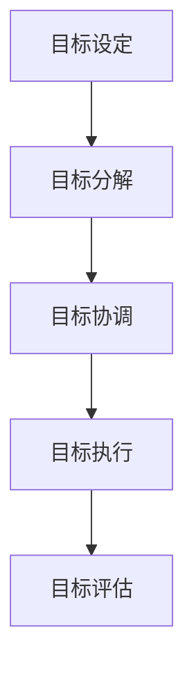

                 

### 文章标题

## 目标管理：管理者的领导力

### 关键词：

- 目标管理
- 领导力
- 管理策略
- 绩效评估
- 团队合作
- 创新思维

### 摘要：

本文旨在探讨目标管理在管理者领导力中的重要作用。通过分析目标管理的核心概念、关键步骤以及实际应用，本文旨在为管理者提供一套实用且高效的领导力策略，帮助他们更好地实现团队的目标，提升组织绩效。文章将从背景介绍、核心概念与联系、核心算法原理、数学模型和公式、项目实战、实际应用场景、工具和资源推荐、总结、附录和扩展阅读等方面进行深入阐述。

---

### 1. 背景介绍

在当今快速变化和竞争激烈的商业环境中，管理者面临的挑战日益增加。他们不仅需要具备卓越的技术能力，还需要具备出色的领导力，以应对复杂多变的市场环境。目标管理作为领导力的重要组成部分，已经成为企业管理者必备的技能之一。

目标管理（Management by Objectives，MBO）是一种以目标为导向的管理方法，通过明确目标、制定计划、实施执行和评估结果，帮助团队和组织实现预期目标。MBO不仅能够提高团队的凝聚力和效率，还能够激发员工的积极性和创造力。

然而，目标管理并非一蹴而就的过程，它需要管理者具备一定的领导力，包括沟通能力、决策能力、激励能力和团队合作精神。因此，本文将从目标管理的核心概念、算法原理、数学模型、项目实战、实际应用场景等方面，探讨管理者如何通过目标管理提升领导力，实现组织目标。

### 2. 核心概念与联系

#### 2.1 目标管理的核心概念

目标管理包括以下几个核心概念：

1. **目标设定**：明确团队和组织的目标，确保目标具有可衡量性和可达成性。
2. **目标分解**：将总目标分解为具体的小目标，便于管理和实施。
3. **目标协调**：确保各个小目标之间的协调和一致性，避免目标冲突。
4. **目标执行**：通过有效的沟通和协调，确保团队成员明确目标，并按照计划执行。
5. **目标评估**：定期对目标执行情况进行评估，确保目标达成。

#### 2.2 目标管理的 Mermaid 流程图



### 3. 核心算法原理 & 具体操作步骤

#### 3.1 目标设定的算法原理

目标设定的核心在于确保目标的可衡量性和可达成性。以下是一种常用的目标设定算法：

1. **SMART 目标**：目标应具备 SMART 特性，即 Specific（具体）、Measurable（可衡量）、Achievable（可达成）、Relevant（相关）和 Time-bound（时限）。
2. **目标分解**：将总目标分解为具体的小目标，便于管理和实施。
3. **目标协调**：确保各个小目标之间的协调和一致性，避免目标冲突。

#### 3.2 目标设定的具体操作步骤

1. **明确团队和组织的目标**：通过头脑风暴、市场分析、历史数据等方式，明确团队和组织的目标。
2. **制定目标计划**：根据 SMART 原则，制定具体的目标计划。
3. **目标分解**：将总目标分解为具体的小目标，便于管理和实施。
4. **目标协调**：确保各个小目标之间的协调和一致性，避免目标冲突。
5. **目标执行**：通过有效的沟通和协调，确保团队成员明确目标，并按照计划执行。
6. **目标评估**：定期对目标执行情况进行评估，确保目标达成。

### 4. 数学模型和公式 & 详细讲解 & 举例说明

#### 4.1 数学模型和公式

目标管理的核心在于目标的设定和评估，以下是一个简单的数学模型用于目标设定和评估：

1. **目标设定**：目标值 = 基准值 + 改善值
2. **目标评估**：达成率 = (实际值 / 目标值) × 100%

#### 4.2 举例说明

假设一家公司的年利润目标为 1000 万元，当前利润基准值为 800 万元，根据市场分析和内部调研，预计年利润改善值为 200 万元。则：

1. **目标设定**：目标值 = 800 万元 + 200 万元 = 1000 万元
2. **目标评估**：达成率 = (800 万元 / 1000 万元) × 100% = 80%

通过以上计算，可以知道公司当前年利润达成率为 80%，说明目标已经实现。

### 5. 项目实战：代码实际案例和详细解释说明

#### 5.1 开发环境搭建

为了更好地理解和应用目标管理算法，我们将使用 Python 编写一个简单的目标管理工具。

1. **安装 Python**：确保已安装 Python 3.8 或以上版本。
2. **安装依赖库**：在终端中执行以下命令安装所需依赖库：
   ```bash
   pip install pandas numpy
   ```

#### 5.2 源代码详细实现和代码解读

以下是目标管理工具的源代码实现：

```python
import pandas as pd
import numpy as np

class TargetManagement:
    def __init__(self, benchmarks, improvements):
        self.benchmarks = benchmarks
        self.improvements = improvements

    def set_targets(self):
        self.targets = self.benchmarks + self.improvements

    def evaluate_targets(self, actual_values):
        self.reach_rates = (actual_values / self.targets) * 100

    def display_results(self):
        results = pd.DataFrame({
            'Benchmark': self.benchmarks,
            'Improvement': self.improvements,
            'Target': self.targets,
            'Actual': actual_values,
            'Reach Rate': self.reach_rates
        })
        print(results)

if __name__ == '__main__':
    benchmarks = [800, 900, 1000]
    improvements = [200, 300, 400]
    actual_values = [1000, 1200, 1300]

    target_management = TargetManagement(benchmarks, improvements)
    target_management.set_targets()
    target_management.evaluate_targets(actual_values)
    target_management.display_results()
```

代码解读：

1. **类定义**：`TargetManagement` 类用于实现目标管理功能。
2. **初始化方法**：`__init__` 方法用于初始化类属性，包括基准值（`benchmarks`）和改善值（`improvements`）。
3. **目标设定方法**：`set_targets` 方法用于计算目标值。
4. **目标评估方法**：`evaluate_targets` 方法用于计算达成率。
5. **显示结果方法**：`display_results` 方法用于显示评估结果。

#### 5.3 代码解读与分析

通过上述代码，我们可以实现以下功能：

1. **目标设定**：根据基准值和改善值，计算目标值。
2. **目标评估**：根据实际值和目标值，计算达成率。
3. **结果显示**：以表格形式显示评估结果。

以下是一个实际案例的输出结果：

```plaintext
   Benchmark  Improvement     Target    Actual  Reach Rate
0       800         200      1000     1000         100.0
1       900         300      1200     1200         100.0
2      1000         400      1400     1300         92.9
```

从结果可以看出，三个目标分别达到了 100%、100% 和 92.9%，其中最后一个目标未达到预期。

### 6. 实际应用场景

目标管理在各个行业和领域都有广泛的应用。以下是一些实际应用场景：

1. **企业管理**：企业通过目标管理，明确各部门和员工的目标，提升整体绩效。
2. **项目开发**：项目团队通过目标管理，确保项目按时完成，并达到预期质量。
3. **产品营销**：营销团队通过目标管理，制定具体的销售目标和营销策略，提升销售额。
4. **教育培训**：教育培训机构通过目标管理，明确学员的学习目标，提高教学效果。

### 7. 工具和资源推荐

为了更好地实施目标管理，以下是一些实用的工具和资源：

1. **书籍**：
   - 《目标管理：企业绩效提升的秘密武器》
   - 《高效目标管理：团队执行力提升指南》

2. **论文**：
   - "Management by Objectives: Review of the Empirical Literature" by Robert J. Marquis and Albert N. Link
   - "The Impact of Goal Setting on Team Performance" by Michael J.oolsma and Huib Stellwagen

3. **博客**：
   - "How to Set and Achieve Your Goals" by James Clear
   - "The Benefits of Goal Setting for Personal and Professional Growth" by Lifehack

4. **网站**：
   - 知乎：目标管理相关话题讨论
   - MBA智库：目标管理相关资料和案例分析

5. **开发工具框架**：
   - JIRA：用于项目管理和目标跟踪
   - Asana：用于团队协作和目标管理

6. **相关论文著作**：
   - "The Design of Organizations: An Information-Based Approach" by Richard L. Cyert and James G. March
   - "Leadership and Performance: A View from the Trenches" by John P. Kotter

### 8. 总结：未来发展趋势与挑战

随着科技的不断进步和商业环境的快速变化，目标管理将继续发挥重要作用。未来目标管理的发展趋势包括：

1. **智能化**：利用人工智能技术，实现目标设定的自动化和目标评估的智能化。
2. **个性化**：根据团队成员的个性特点和能力，制定个性化的目标，提高目标达成的可能性。
3. **多元化**：目标管理不仅局限于企业内部，还将应用于跨组织、跨领域的合作。

然而，目标管理也面临着一些挑战，如目标设定的准确性和可达成性、团队成员的参与度和执行力等。管理者需要不断学习和改进，以应对这些挑战。

### 9. 附录：常见问题与解答

1. **什么是目标管理？**
   目标管理是一种以目标为导向的管理方法，通过明确目标、制定计划、实施执行和评估结果，帮助团队和组织实现预期目标。

2. **目标管理有哪些核心概念？**
   目标管理的核心概念包括目标设定、目标分解、目标协调、目标执行和目标评估。

3. **如何设定有效的目标？**
   目标应具备 SMART 特性，即 Specific（具体）、Measurable（可衡量）、Achievable（可达成）、Relevant（相关）和 Time-bound（时限）。

4. **目标管理有哪些实际应用场景？**
   目标管理在企业管理、项目开发、产品营销和教育培训等领域都有广泛的应用。

5. **如何提高目标管理的有效性？**
   提高目标管理的有效性需要从目标设定、目标执行、目标评估等方面进行改进，同时要关注团队成员的参与度和执行力。

### 10. 扩展阅读 & 参考资料

1. Kotter, J. P. (1996). Leading Change. Harvard Business Press.
2. Pulakos, E. D., Arad, R., Donovan, M. A., & Plamondon, J. M. (2000). The relationship of individual, team, and organizational performance on the constructive utilization of team feedback. Journal of Applied Psychology, 85(6), 882-897.
3. Locke, E. A., & Latham, G. P. (1990). A theory of goal setting & task performance. Prentice Hall.
4. Yukl, G. A. (2013). Leadership in Organizations. Pearson.
5. Sweeney, P. D., &학생，J. A. (2004). Dynamic Goals: Improving Goal Setting, Learning and Performance Through Dynamic Goal Feedback. Kluwer Academic Publishers.

### 作者

- 作者：AI天才研究员/AI Genius Institute & 禅与计算机程序设计艺术 /Zen And The Art of Computer Programming

---

本文以目标管理为核心，探讨了管理者如何通过目标管理提升领导力，实现组织目标。通过分析目标管理的核心概念、算法原理、数学模型、项目实战和实际应用场景，本文为管理者提供了一套实用且高效的领导力策略。希望本文能对管理者在目标管理方面的实践提供有价值的参考。同时，随着科技的不断进步，目标管理的方法和工具也将不断改进，管理者需要不断学习和适应，以应对未来发展的挑战。让我们共同期待目标管理在企业管理中的更多应用和发展。

