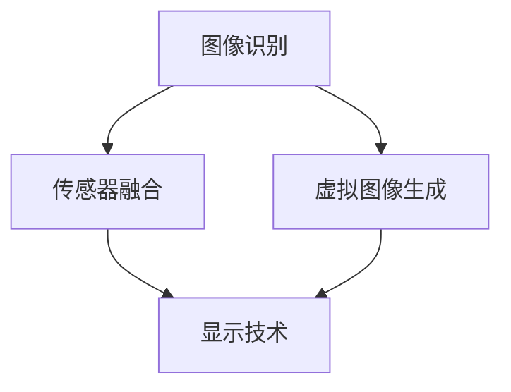

                 

# 《知识产权与增强现实技术的新挑战》

## 摘要

随着增强现实（AR）技术的飞速发展，其对于知识产权（IPR）领域带来了前所未有的挑战与机遇。本文将深入探讨AR技术的基本概念及其发展历程，详细分析AR技术与知识产权之间的内在联系，包括版权、商标和专利等方面的法律问题。同时，文章将列举一些著名的AR应用案例，并探讨这些案例中涉及的知识产权问题。接下来，本文将讨论AR技术对现有法律体系的影响，以及立法者和知识产权专家为应对这些挑战所采取的措施。最后，文章将预测未来AR技术发展的趋势，并对其可能对知识产权带来的影响进行展望。希望通过本文的探讨，能为读者提供一个全面、深入的理解，为未来AR技术与知识产权的融合发展提供参考。

## 1. 背景介绍

### 1.1 增强现实技术概述

增强现实（Augmented Reality，简称AR）技术是一种通过计算机技术将虚拟信息与现实世界进行无缝融合的交互技术。它利用计算机生成的虚拟图像、声音、触觉等多种感官信息，叠加到真实环境中，从而为用户提供一个虚实结合的体验环境。与虚拟现实（Virtual Reality，简称VR）不同，AR技术并非完全取代现实，而是在现实基础上增加虚拟元素，使现实环境变得更加丰富和有趣。

AR技术的核心在于实时感知和交互。它通常通过摄像头和传感器捕获现实世界的图像和声音，然后通过计算机算法处理这些数据，生成相应的虚拟信息。这些虚拟信息可以通过显示设备如头戴式显示器（HMD）、投影仪或智能手机屏幕等呈现给用户。AR技术不仅可以在室内使用，还可以在户外环境中进行操作，其应用场景非常广泛。

### 1.2 增强现实技术的发展历程

AR技术的发展可以追溯到上世纪60年代，但真正引起广泛关注的是21世纪初智能手机的普及。2009年，谷歌发布了第一款支持AR功能的手机应用程序“谷歌地图”，使得AR技术开始进入大众视野。此后，随着硬件设备的不断升级和算法的优化，AR技术迅速发展，应用场景不断拓展。

2012年，微软发布了HoloLens，这是第一款真正具有商业价值的头戴式AR设备。HoloLens的发布标志着AR技术进入了一个新的时代，它不仅在医疗、教育等领域展示出巨大的潜力，同时也引发了众多企业和研究机构的关注和投入。

近年来，随着5G、人工智能等新兴技术的不断发展，AR技术迎来了新一轮的爆发期。许多大型科技公司如苹果、谷歌、Facebook等纷纷加大对AR技术的研发和应用投入，推出了一系列AR应用和硬件产品，使得AR技术逐渐成为日常生活的一部分。

### 1.3 增强现实技术的应用领域

增强现实技术具有广泛的应用前景，几乎覆盖了各个行业。以下是AR技术的一些主要应用领域：

1. **医疗领域**：AR技术可以用于医学教育，如通过虚拟手术模拟帮助医生提高手术技能；在医疗诊断中，AR技术可以帮助医生更准确地定位病变部位。

2. **教育领域**：AR技术可以为学生提供更为生动的学习体验，如通过AR教材使课本内容变得更加立体和生动；在远程教育中，AR技术可以实现教师与学生之间的实时互动。

3. **零售行业**：AR技术可以用于增强购物体验，如通过AR试衣镜帮助消费者试穿衣物；在产品展示中，AR技术可以使产品变得更加生动和吸引人。

4. **旅游行业**：AR技术可以为游客提供更为丰富的旅游信息，如通过AR导游讲解历史景点；在虚拟旅游中，AR技术可以帮助用户身临其境地体验不同地方的文化风情。

5. **娱乐行业**：AR技术可以用于游戏开发，如通过AR游戏创造更加真实和互动的游戏体验；在电影制作中，AR技术可以帮助创造更加逼真的视觉效果。

6. **工业制造**：AR技术可以用于工业设计、生产流程监控和远程技术支持，提高生产效率和产品质量。

总之，随着技术的不断进步，增强现实技术在各个领域的应用将越来越广泛，它不仅改变了我们的生活方式，也为我们带来了无限的创新可能。

### 1.4 知识产权（IPR）的定义和重要性

知识产权（Intellectual Property Rights，简称IPR）是指由法律确认的人们对其智力劳动成果所享有的专有权利。它包括著作权、专利权、商标权、商业秘密等多种类型。知识产权的设立旨在鼓励创新，保护创作者和发明者的合法权益，从而促进科学技术和文化艺术的进步。

在现代社会，知识产权的重要性日益凸显。首先，知识产权是激励创新的核心动力。通过给予创作者和发明者独占权利，知识产权制度为人们提供了经济回报，激励他们投入更多的精力和资源进行创新。其次，知识产权是企业和国家竞争力的象征。拥有强大的知识产权储备，不仅可以为企业带来经济利益，还可以提升国家的科技水平和国际竞争力。

具体来说，知识产权在各个领域都发挥着至关重要的作用：

- **著作权**：保护文学、艺术和科学作品，如书籍、音乐、电影等，确保创作者享有对其作品的复制、发行、表演等权利。
- **专利权**：保护发明和实用新型，确保发明者对其发明享有制造、使用和销售的权利，从而避免他人未经许可的侵犯。
- **商标权**：保护商标，确保品牌拥有者对其商标的独占使用权，防止他人恶意模仿和侵权。
- **商业秘密**：保护企业的商业信息和技术秘密，如生产工艺、客户信息等，防止泄露和滥用。

总之，知识产权作为现代社会的一项重要法律制度，不仅在保护创作者和发明者的权益方面起到了关键作用，同时也为推动科技进步和文化繁荣提供了坚实保障。

### 1.5 增强现实技术与知识产权的联系

随着增强现实（AR）技术的快速发展，其在各个领域的应用日益广泛，同时也引发了大量的知识产权（IPR）问题。理解和分析AR技术中的知识产权问题，对于推动技术的健康发展、保护创作者的合法权益具有重要意义。

首先，AR技术涉及到的知识产权问题主要集中在版权、专利和商标等方面。

#### 1.5.1 版权问题

在AR技术中，版权问题尤为突出。版权保护的是创作性作品的复制、发行、展示、表演等权利。AR应用中，大量的图像、视频、音频和三维模型等元素都需要进行版权保护。例如，在AR游戏和应用中，开发者需要使用大量的图像和动画资源，这些资源可能涉及他人的著作权。如果没有得到授权，这些行为就可能构成侵权。

此外，AR技术中生成的虚拟内容也可能引发版权争议。例如，某些AR应用通过扫描现实世界的图像并生成虚拟图像，这些虚拟图像的原创性如何认定，以及是否需要支付版权使用费，都是需要解决的问题。

#### 1.5.2 专利问题

专利是保护发明和创新成果的法律制度，尤其在AR技术中，涉及到的专利问题更为复杂。AR技术的核心在于虚拟信息和现实世界的融合，因此，涉及到大量的技术发明，如图像识别、虚拟图像生成、传感器技术等。

一方面，AR技术的快速发展使得新的专利申请数量急剧增加。例如，谷歌、微软等科技巨头在AR技术领域拥有大量的专利，这些专利涵盖了从基础算法到应用场景的各个方面。另一方面，专利纠纷也日益增多。由于AR技术涉及到的创新点较多，不同企业之间的专利交叉和重叠现象普遍，专利侵权和反侵权诉讼频繁发生。

#### 1.5.3 商标问题

在AR技术中，商标问题同样不容忽视。商标是用来区分不同商品或服务的标识，具有显著的识别功能。随着AR应用的普及，越来越多的企业开始使用AR技术作为营销手段，这也就带来了商标保护的挑战。

首先，AR应用中的虚拟元素可能成为商标的一部分。例如，某些AR游戏中的虚拟角色或图标可能被注册为商标，用于品牌标识。其次，AR技术中的商标侵权问题也日益突出。由于AR应用具有跨平台、跨场景的特点，某些未经授权的第三方可能利用AR技术侵犯他人的商标权，如未经授权在AR应用中使用他人的商标。

#### 1.5.4 知识产权保护在AR技术中的重要性

知识产权保护在AR技术中具有极其重要的地位。首先，知识产权保护有助于激励创新。AR技术的快速发展依赖于大量的研发投入，知识产权保护能够确保研发者获得应有的经济回报，从而鼓励更多的企业和个人投入到AR技术的研发中。

其次，知识产权保护有助于维护公平竞争。在AR技术领域，不同企业之间的竞争往往集中在技术和创新上。知识产权保护能够确保企业的创新成果得到保护，避免竞争对手通过侵权行为获取不正当利益，从而维护公平的市场秩序。

最后，知识产权保护还能够推动技术的全球化和国际化。随着AR技术的应用日益广泛，跨国界的知识产权保护显得尤为重要。只有在全球范围内得到有效的保护，AR技术才能真正实现其全球价值。

总之，随着AR技术的不断发展和应用领域的扩大，知识产权保护的问题也将日益凸显。只有通过完善知识产权法律体系，加强知识产权保护，才能确保AR技术的健康发展，推动其在全球范围内的广泛应用。

### 1.6 国内外知识产权法律体系及其对AR技术的保护

知识产权法律体系是保护创新成果和维护市场秩序的重要法律框架，对于增强现实（AR）技术这样的高科技创新领域尤为重要。国内外各国的知识产权法律体系在保护AR技术方面有着不同的特点，以下将分别介绍国内外主要国家的知识产权法律体系，并探讨其对AR技术的保护力度。

#### 1.6.1 国内知识产权法律体系

中国的知识产权法律体系主要包括《中华人民共和国著作权法》、《中华人民共和国专利法》、《中华人民共和国商标法》以及《中华人民共和国反不正当竞争法》等。这些法律共同构成了中国知识产权保护的基础。

1. **著作权法**：中国著作权法对文学、艺术和科学作品进行保护，包括文字作品、音乐、戏剧、电影、图形作品等。在AR技术中，大量的图像、动画和三维模型等都需要著作权保护。例如，某些AR应用的虚拟角色和场景设计，如果属于独创性的艺术作品，就可以受到著作权法的保护。

2. **专利法**：中国的专利法保护发明、实用新型和外观设计。在AR技术中，涉及到的核心技术如图像识别、虚拟图像生成、传感器技术等，如果符合专利条件，可以申请专利保护。专利法的保护能够确保企业在AR技术研发和产品销售过程中不受侵权行为的困扰。

3. **商标法**：中国的商标法保护商标的注册和使用，防止他人恶意抢注和侵权。在AR技术中，企业往往通过商标来区分其产品和服务，例如某些AR游戏中的虚拟角色或图标。注册商标可以有效防止其他竞争者通过模仿或盗用商标获取不正当利益。

4. **反不正当竞争法**：中国的反不正当竞争法规定了商业秘密的保护，防止他人泄露、使用或披露商业秘密。在AR技术中，涉及到的技术秘密、客户信息等商业秘密也需要得到保护，防止竞争对手通过不正当手段获取这些信息。

#### 1.6.2 国外知识产权法律体系

不同国家的知识产权法律体系在结构和内容上有所差异，但总体目标都是保护知识产权，促进创新。以下介绍几个主要国家的知识产权法律体系。

1. **美国**：美国的知识产权法律体系包括《美国版权法》、《美国专利法》和《美国商标法》。美国的版权法对创作性作品提供广泛保护，涵盖文字、音乐、戏剧、绘画等。专利法保护发明和实用新型，商标法则保护商标的使用和注册。美国法律对知识产权保护力度较大，尤其是在专利侵权诉讼方面，法律提供了强有力的救济手段。

2. **欧洲**：欧洲的知识产权法律体系主要由欧洲联盟制定的《欧洲专利公约》、《欧洲版权条例》和《欧洲商标条例》构成。欧洲的知识产权法律强调集体保护，通过欧洲专利局和欧洲知识产权局提供统一的服务和程序，使得欧洲内部的知识产权保护更加便捷和高效。

3. **日本**：日本的知识产权法律体系包括《日本专利法》、《日本著作权法》和《日本商标法》。日本的知识产权法律在保护范围和程序上相对严格，例如对专利申请的审查过程较为严格，但同时也提供了一定的灵活性，以适应技术创新的快速发展。

#### 1.6.3 国内外法律体系对AR技术的保护力度比较

国内外知识产权法律体系在保护AR技术方面各有特色。

1. **保护范围**：国内法律在著作权、专利和商标方面的保护范围较为广泛，能够覆盖AR技术中涉及的大部分内容。例如，AR应用中的图像、动画、三维模型和核心算法等，都可以通过著作权法和专利法得到保护。而国外法律在保护范围上也有所扩展，特别是在版权和商标方面，一些国家已经通过立法明确了对数字作品的保护范围。

2. **保护力度**：国外法律在知识产权侵权诉讼和救济方面提供了更为有力的手段。例如，美国的司法体系提供了广泛的专利侵权诉讼程序，使得专利权人可以在侵权行为发生时获得迅速的法律救济。相比之下，国内法律在侵权诉讼和救济方面可能需要进一步完善，以提高知识产权保护的力度和效果。

3. **法律环境**：国外一些国家在知识产权法律环境方面相对更加成熟，法律体系较为完善，执法力度较大。例如，欧洲和美国的知识产权法律体系经过长期的发展，已经形成了较为健全的法律框架和执法机制。而国内虽然近年来在知识产权保护方面取得了一定进展，但仍然面临一些挑战，如执法力度不足、知识产权纠纷解决机制不完善等。

总之，国内外知识产权法律体系在保护AR技术方面各有特点。通过比较和分析国内外法律体系的差异，可以为AR技术发展提供有益的参考，促进技术创新和知识产权保护的良性互动。

### 1.7 AR技术发展中的主要挑战

尽管增强现实（AR）技术在各个领域展现出了巨大的潜力，但其发展过程中仍然面临着一系列挑战。这些挑战不仅涉及技术层面，还涉及到法律、伦理和社会等方面。以下是AR技术发展中的主要挑战：

#### 1.7.1 技术挑战

1. **计算能力**：AR技术需要强大的计算能力来实时处理和融合虚拟与现实信息。这要求高分辨率的摄像头、传感器和高效的处理器协同工作。随着技术的进步，这些硬件设备的性能不断提高，但仍然面临性能瓶颈和功耗问题。

2. **图像识别**：AR技术依赖于对现实世界的图像进行识别和解析，以生成相应的虚拟信息。这一过程涉及到复杂的图像处理算法，例如物体识别、场景分割和姿态估计等。随着AR应用的多样化，对图像识别的准确性和实时性提出了更高的要求。

3. **用户界面**：AR技术需要提供直观、易用的用户界面，以提升用户体验。这要求设计出既符合用户习惯，又能适应不同应用场景的用户界面。例如，在医疗和教育领域，用户界面需要具备专业性和易用性，而在娱乐和零售领域，用户界面则需要更加多样化和趣味性。

4. **隐私和安全**：AR技术在使用过程中可能会涉及到用户的个人隐私和数据安全。例如，AR应用可能会通过摄像头获取用户的实时图像和数据，这些数据如果不加以妥善保护，可能会被不法分子利用，导致隐私泄露和安全风险。

#### 1.7.2 法律挑战

1. **版权问题**：AR技术中涉及到大量的图像、视频、音频和三维模型等元素，这些元素可能涉及他人的著作权。如果没有得到授权，这些行为就可能构成侵权。同时，AR技术生成的虚拟内容也可能引发版权争议，例如如何认定虚拟内容的原创性和版权归属等问题。

2. **专利纠纷**：AR技术涉及到的创新点较多，不同企业之间的专利交叉和重叠现象普遍。专利纠纷不仅影响企业的研发投入和市场份额，还可能阻碍技术的推广和应用。

3. **商标侵权**：随着AR应用的普及，商标侵权问题也日益突出。AR应用中的虚拟元素可能成为商标的一部分，例如虚拟角色或图标。未经授权使用他人的商标，不仅可能构成侵权，还可能损害品牌形象。

#### 1.7.3 伦理挑战

1. **隐私权**：AR技术在使用过程中可能会获取用户的个人隐私信息，例如通过摄像头获取用户的实时图像。如何在保护用户隐私和安全的前提下，合理利用AR技术，是一个重要的伦理问题。

2. **道德责任**：AR技术可能被用于不良目的，例如通过虚拟现实技术进行欺骗或误导用户。如何确保AR技术的正当使用，防止其被用于不道德或非法活动，是伦理学领域面临的挑战。

3. **社会影响**：AR技术的普及可能会改变人们的生活方式和工作方式，从而对社会产生深远的影响。例如，在教育领域，AR技术可能改变传统的教学方式，但同时也需要关注其对教育公平和社会正义的影响。

总之，AR技术的发展过程中面临着多重挑战。只有通过技术创新、法律完善和伦理引导，才能实现AR技术的健康发展和广泛应用。

## 2. 核心概念与联系

### 2.1 增强现实技术的核心原理和架构

增强现实（AR）技术的核心在于将虚拟信息与现实环境无缝融合。为了实现这一目标，AR技术涉及多个关键组件和原理，主要包括图像识别、虚拟图像生成、传感器融合和显示技术。

#### 2.1.1 图像识别

图像识别是AR技术的基础，它通过摄像头或传感器捕捉现实世界的图像，并对这些图像进行识别和处理。图像识别过程通常包括以下几个步骤：

1. **图像预处理**：包括去噪、对比度增强、图像分割等，以提高图像质量和识别精度。
2. **特征提取**：从图像中提取关键特征，如边缘、角点、纹理等，用于后续的匹配和识别。
3. **匹配与识别**：将提取的特征与预定义的模型进行匹配，以识别图像中的特定对象或场景。

常见的图像识别算法包括SIFT（尺度不变特征变换）、SURF（加速稳健特征）、YOLO（你只看一次）等。

#### 2.1.2 虚拟图像生成

在识别现实世界的图像后，AR技术需要生成相应的虚拟图像，并将其叠加到现实环境中。虚拟图像生成包括以下几个关键步骤：

1. **场景建模**：根据识别结果，构建虚拟场景的几何模型，包括物体、场景背景等。
2. **纹理映射**：为虚拟场景的几何模型贴上纹理，使其在视觉上更加逼真。
3. **光照计算**：根据现实世界的光照条件，对虚拟场景进行光照计算，以生成具有立体感和真实感的虚拟图像。

常用的虚拟图像生成算法包括三维建模软件（如Blender、Maya）、纹理映射技术（如UV映射）和实时渲染技术（如OpenGL、DirectX）。

#### 2.1.3 传感器融合

AR技术需要融合多种传感器数据，以提高系统的感知能力和精度。常见的传感器包括摄像头、GPS、陀螺仪、加速度计等。传感器融合的过程主要包括以下步骤：

1. **数据采集**：从各种传感器获取数据，如摄像头捕获的图像、GPS定位信息、陀螺仪和加速度计的动态数据等。
2. **数据预处理**：对采集到的数据进行分析和预处理，包括去噪、滤波等，以提高数据质量和精度。
3. **数据融合**：将不同传感器获取的数据进行融合，以生成一个统一的场景模型。常见的融合算法包括卡尔曼滤波、粒子滤波等。

#### 2.1.4 显示技术

AR技术的显示技术是将其生成的虚拟信息呈现给用户的手段。常见的显示设备包括头戴式显示器（HMD）、投影仪和智能手机屏幕等。

1. **头戴式显示器（HMD）**：HMD是一种直接佩戴在头部的显示设备，通过遮挡用户视野中的部分区域，将虚拟信息叠加到真实世界中。常见的HMD设备包括微软的HoloLens、谷歌的ARCore等。
2. **投影仪**：投影仪通过将虚拟图像投影到真实环境中的特定区域，实现虚拟与现实的融合。常见的投影技术包括DLP（数字光处理）和LCoS（液晶硅）等。
3. **智能手机屏幕**：智能手机屏幕通过摄像头捕捉现实世界的图像，并将虚拟信息叠加到屏幕上。常见的AR应用如ARKit（苹果）和ARCore（谷歌）等，都支持通过智能手机屏幕实现AR效果。

#### 2.1.5 Mermaid流程图表示

为了更好地展示AR技术的核心原理和架构，下面使用Mermaid语言绘制一个简化的流程图：

在该流程图中，图像识别、虚拟图像生成、传感器融合和显示技术构成了AR技术的核心环节，它们相互协作，共同实现虚拟与现实的无缝融合。

### 2.2 知识产权（IPR）的基本概念和类型

知识产权（Intellectual Property Rights，简称IPR）是指由法律确认的，人们对智力成果所享有的专有权利。它主要包括著作权、专利权、商标权和商业秘密等类型。

#### 2.2.1 著作权

著作权是指对文学、艺术和科学作品的原创性表达所享有的权利。它主要包括以下权利：

1. **复制权**：制作、复制作品的权利。
2. **发行权**：通过出售、出租或其他方式向公众提供作品的权利。
3. **展示权**：公开展示作品的权利。
4. **表演权**：公开表演作品的权利。
5. **改编权**：改编、翻译作品的权利。

在AR技术中，著作权保护的对象包括图像、动画、视频和三维模型等虚拟元素。例如，一个AR应用中使用的虚拟角色和场景设计，如果符合原创性标准，就可以受到著作权保护。

#### 2.2.2 专利权

专利权是指对发明、实用新型和外观设计等技术创新成果所享有的权利。它主要包括以下权利：

1. **独占实施权**：制造、使用、销售和进口专利产品的权利。
2. **实施许可权**：许可他人使用专利技术的权利。
3. **专利权转让权**：转让专利权的权利。

在AR技术中，专利权保护的核心是技术创新，如图像识别算法、虚拟图像生成技术和传感器融合算法等。例如，一个公司如果拥有一种独特的图像识别算法，就可以通过专利权保护其技术不被他人侵权。

#### 2.2.3 商标权

商标权是指对商标的独占使用权。商标是用于区分商品或服务来源的标识，例如文字、图形、字母、数字等。它主要包括以下权利：

1. **注册商标权**：商标注册后，注册人享有对该商标的独占使用权。
2. **禁止权**：禁止他人未经许可使用相同或类似的商标。
3. **许可权**：许可他人使用商标的权利。

在AR技术中，商标权可以用于保护企业的品牌形象，如某些AR应用中的虚拟角色或图标可以作为商标使用。商标权的保护有助于防止其他竞争者通过模仿或盗用商标获取不正当利益。

#### 2.2.4 商业秘密

商业秘密是指不为公众所知悉、具有商业价值并经权利人采取保密措施的技术信息和经营信息。它主要包括技术秘密、客户信息、经营策略等。

在AR技术中，商业秘密保护的对象可能包括开发过程中的技术细节、客户数据和市场策略等。商业秘密的保护有助于企业保持竞争优势，防止技术泄露和商业损失。

### 2.3 增强现实技术中的知识产权问题分析

在增强现实（AR）技术中，涉及到的知识产权问题相当复杂，主要包括著作权、专利权和商标权等方面。以下对这些问题进行详细分析：

#### 2.3.1 著作权问题

1. **图像和视频的著作权**：AR技术中使用的图像和视频素材，如果是由第三方创作并享有著作权，使用这些素材时就需要获得授权或支付使用费。例如，一个AR游戏需要使用大量的背景图像和动画素材，如果这些素材属于第三方所有，开发者就需要获得相应的授权。

2. **虚拟图像的原创性认定**：AR技术生成的虚拟图像可能具有原创性，但如何认定这些图像的原创性，以及其著作权归属，是一个复杂的问题。例如，一个AR应用中生成的虚拟角色，如果符合独创性标准，那么该角色的著作权可能属于开发者。

3. **版权侵权**：在AR技术应用中，未经授权使用他人的图像、视频和动画素材，可能构成版权侵权。例如，某些AR应用中未经授权使用第三方开发的动画角色，这就可能引发版权纠纷。

#### 2.3.2 专利权问题

1. **核心技术专利**：AR技术中涉及到的核心技术，如图像识别算法、虚拟图像生成技术和传感器融合算法等，如果符合专利条件，可以申请专利保护。例如，某些公司开发的独特图像识别算法，可以通过专利权保护其技术不被他人侵权。

2. **专利交叉与冲突**：AR技术领域涉及到的创新点较多，不同企业之间的专利交叉和冲突现象普遍。例如，谷歌和苹果在AR技术领域都拥有大量的专利，这些专利之间的交叉和冲突可能导致专利侵权诉讼。

3. **专利侵权**：在AR技术应用中，未经授权使用他人的专利技术，可能构成专利侵权。例如，某些公司未经许可使用他人的图像识别算法，这可能引发专利侵权诉讼。

#### 2.3.3 商标权问题

1. **虚拟角色的商标权**：在AR技术中，虚拟角色和图标可能被注册为商标，用于品牌标识。例如，某些AR游戏中的虚拟角色被注册为商标，用于区分不同游戏品牌。

2. **商标侵权**：在AR技术应用中，未经授权使用他人的商标，可能构成商标侵权。例如，某些公司未经许可在AR应用中使用他人的商标，这可能导致品牌侵权诉讼。

3. **商标冲突**：随着AR技术的普及，不同企业可能注册相同或类似的商标，这可能导致商标冲突。例如，多个公司可能注册类似的AR品牌商标，这需要通过法律途径解决商标冲突。

#### 2.3.4 知识产权问题解决策略

针对AR技术中的知识产权问题，可以采取以下策略：

1. **版权管理**：开发者应确保使用第三方素材时获得授权或支付使用费，同时加强版权管理，防止侵权行为的发生。

2. **专利布局**：企业应积极进行专利布局，保护其核心技术，同时避免专利交叉和冲突，减少专利侵权风险。

3. **商标注册**：企业应注册其虚拟角色和图标商标，以保护品牌形象，防止商标侵权。

4. **法律维权**：在知识产权受到侵犯时，企业应积极采取法律手段维权，维护自身权益。

总之，在增强现实技术中，知识产权问题不容忽视。通过有效的知识产权管理和法律维权，可以促进AR技术的健康发展，推动技术创新和产业应用。

### 2.4 知识产权（IPR）在增强现实（AR）技术中的实际应用案例

随着增强现实（AR）技术的不断发展，其在各个领域的应用也日益广泛。知识产权（IPR）在AR技术中的实际应用案例不仅展示了技术的创新与商业潜力，同时也揭示了知识产权保护在推动技术发展中的重要性。以下列举几个典型的AR技术应用案例，并分析其中涉及的知识产权问题。

#### 2.4.1 案例一：微软HoloLens在医疗领域的应用

微软的HoloLens是一款具有代表性的AR头戴设备，其在医疗领域的应用备受瞩目。例如，在手术模拟和教学培训中，HoloLens可以提供实时、三维的虚拟图像，帮助医生提高手术技能。以下是其涉及的知识产权问题：

1. **专利权**：微软拥有多项与HoloLens相关的专利，包括图像识别、虚拟图像生成和传感器融合等技术。这些专利保护确保了微软在医疗领域的竞争优势，防止他人未经授权使用其核心技术。

2. **著作权**：HoloLens中使用的图像、视频和三维模型等素材，可能涉及第三方的著作权。在开发和应用过程中，微软需要确保这些素材的使用符合著作权法规定，避免版权侵权。

3. **商标权**：微软的HoloLens品牌在医疗领域中具有显著的市场影响力，其商标权得到充分保护。任何未经授权使用微软商标的行为都可能构成侵权，损害品牌形象。

#### 2.4.2 案例二：谷歌ARCore在游戏开发中的应用

谷歌的ARCore是Android平台的AR开发套件，为游戏开发者提供了丰富的AR功能。以下是其涉及的知识产权问题：

1. **专利权**：谷歌在AR技术领域拥有大量的专利，如图像识别和虚拟图像生成算法等。这些专利为谷歌的ARCore提供了强有力的保护，防止其他竞争对手在技术上超越。

2. **著作权**：在游戏开发中，开发者可能使用第三方素材，如图像、音频和视频等。这些素材的使用需要获得相应的著作权授权，避免侵权行为。

3. **商标权**：谷歌ARCore品牌在游戏开发领域具有较高的知名度，其商标权受到法律保护。任何未经授权使用谷歌ARCore品牌的行为都可能构成侵权，损害谷歌的品牌形象。

#### 2.4.3 案例三：Snapchat的AR滤镜和 lenses

Snapchat是一家知名的社交媒体公司，其AR滤镜和lenses功能深受用户喜爱。以下是其涉及的知识产权问题：

1. **专利权**：Snapchat在AR技术领域拥有多项专利，包括图像识别、虚拟图像生成和动画技术等。这些专利保护确保了Snapchat在AR滤镜和lenses开发中的技术创新。

2. **著作权**：Snapchat使用的图像、动画和视频素材，可能涉及第三方的著作权。为了确保合规性，Snapchat在开发过程中需要严格审查素材的版权，避免侵权行为。

3. **商标权**：Snapchat品牌在社交媒体领域具有极高的知名度，其商标权得到法律保护。任何未经授权使用Snapchat品牌的行为都可能构成侵权，损害品牌形象。

#### 2.4.4 案例四：阿里巴巴AR购物体验

阿里巴巴推出了AR购物体验，用户可以通过AR技术试穿衣物和查看商品细节，提升购物体验。以下是其涉及的知识产权问题：

1. **专利权**：阿里巴巴在AR购物体验中使用了多项专利技术，如图像识别、虚拟图像生成和三维建模等。这些专利保护确保了阿里巴巴在AR购物领域的竞争优势。

2. **著作权**：阿里巴巴在AR购物应用中使用的图像、视频和三维模型等素材，需要确保获得相应的著作权授权，以避免侵权。

3. **商标权**：阿里巴巴的品牌在零售领域具有较高的知名度，其商标权受到法律保护。任何未经授权使用阿里巴巴品牌的行为都可能构成侵权，损害品牌形象。

通过以上案例可以看出，知识产权在增强现实（AR）技术中的实际应用案例中扮演了至关重要的角色。有效的知识产权保护不仅有助于企业维护技术创新和品牌形象，还能促进整个行业的健康发展。在未来的AR技术应用中，知识产权问题将继续是一个重要的议题，需要企业和立法者共同努力解决。

### 2.5 增强现实（AR）技术对现有法律体系的影响

随着增强现实（AR）技术的不断发展，其在各个领域的应用不断拓展，对现有的法律体系产生了深远的影响。这些影响不仅体现在对现有法律的挑战上，也带来了新的法律需求和立法挑战。以下将从法律体系、司法实践和知识产权保护等方面，探讨AR技术对现有法律体系的具体影响。

#### 2.5.1 对现有法律体系的挑战

1. **著作权法的挑战**：AR技术的应用涉及到大量的图像、视频和三维模型等元素，这些元素往往需要得到著作权保护。然而，现有的著作权法在保护虚拟内容和数字作品方面存在一定的局限性。例如，如何认定AR生成的虚拟图像的原创性和著作权归属，如何处理数字作品的复制、传播和使用等问题，都需要著作权法进行进一步完善。

2. **专利法的挑战**：AR技术的核心在于技术创新，包括图像识别、虚拟图像生成和传感器融合等技术。这些技术往往需要通过专利进行保护。然而，现有的专利法在保护新型技术发明方面可能存在一些挑战，如专利审查标准、专利申请难度和专利保护范围等方面。特别是在AR技术中，技术创新点的多样性和复杂性使得专利保护变得更加困难。

3. **商标法的挑战**：AR技术的应用使得虚拟角色、图标和品牌标识等成为商标的一部分，如何保护这些商标的合法权益成为商标法面临的新挑战。例如，如何在AR环境中准确识别和区分不同商标，如何防止未经授权的商标使用等，都是商标法需要解决的新问题。

4. **隐私法的挑战**：AR技术在使用过程中需要获取用户的图像、位置和其他个人信息，这涉及到用户的隐私权保护。现有的隐私法可能无法完全覆盖AR技术中的隐私保护需求。例如，如何确保用户数据的收集、存储和使用符合隐私保护标准，如何处理用户数据泄露和滥用等问题，都是隐私法需要进一步完善的方面。

#### 2.5.2 新的法律需求和立法挑战

1. **数字版权管理**：随着AR技术的普及，数字版权管理（DRM）成为保护虚拟内容和数字作品的重要手段。如何设计有效的DRM系统，确保虚拟内容的合法使用和版权保护，成为新的法律需求。此外，如何平衡版权保护和用户权益，避免过度限制用户的使用权利，也是立法者需要考虑的问题。

2. **知识产权交叉和冲突**：AR技术的快速发展使得不同企业之间的知识产权交叉和冲突现象日益增多。如何解决这些知识产权纠纷，确保技术的自由流动和创新发展，是立法者面临的新挑战。例如，如何建立有效的知识产权协调机制，如何处理知识产权纠纷的诉讼程序和救济手段等，都是需要解决的问题。

3. **用户隐私保护**：AR技术在使用过程中涉及到的用户隐私保护问题日益突出。如何确保用户数据的收集、存储和使用符合隐私保护标准，如何处理用户数据泄露和滥用等问题，成为新的立法需求。例如，如何制定明确的隐私保护法规，如何加强数据监管和法律责任等，都是需要解决的问题。

4. **法律适用范围**：随着AR技术的全球化和跨国应用，不同国家和地区的法律适用范围成为新的挑战。如何确保AR技术的应用符合不同国家和地区的法律规定，如何协调各国之间的法律差异，是立法者需要考虑的问题。例如，如何制定统一的国际知识产权保护标准，如何处理跨国知识产权纠纷等，都是需要解决的问题。

总之，增强现实（AR）技术的快速发展对现有法律体系带来了新的挑战和需求。为了应对这些挑战，立法者需要不断完善相关法律法规，加强知识产权保护，保障用户隐私权益，促进AR技术的健康发展和广泛应用。

### 2.6 应对AR技术带来的知识产权挑战的法律和政策措施

随着增强现实（AR）技术的迅猛发展，其在各个领域的应用日益广泛，随之而来的知识产权（IPR）挑战也日益严峻。为了应对这些挑战，立法者和知识产权专家采取了一系列法律和政策措施，以促进AR技术的健康发展，同时保障创作者和发明者的合法权益。

#### 2.6.1 立法措施

1. **完善知识产权法律体系**：为了应对AR技术带来的新挑战，各国纷纷对现有的知识产权法律进行修订和完善。例如，一些国家更新了著作权法、专利法和商标法，增加了对虚拟作品、数字作品和新型技术发明的保护条款。这些修订旨在更好地适应AR技术的应用需求，确保版权、专利和商标的合法保护。

2. **制定专门的AR技术知识产权法规**：针对AR技术的特殊性，一些国家和地区制定了专门的知识产权法规，以明确AR技术的知识产权保护标准和程序。例如，某些国家出台了关于AR技术的专利申请指南，规定了AR技术的专利保护范围和条件，为AR技术专利申请提供了明确的指导。

3. **加强知识产权执法**：为了提高知识产权保护效果，各国政府加大了知识产权执法力度，通过设立专门的知识产权执法机构、增加执法资源、完善执法程序等措施，提高知识产权侵权行为的发现和查处效率。例如，一些国家建立了跨部门协作机制，加强对AR技术知识产权侵权案件的查处和打击力度。

#### 2.6.2 政策措施

1. **鼓励技术创新和知识产权保护**：政府通过制定相关政策，鼓励企业和个人进行AR技术的研究和开发，同时加强知识产权保护。例如，一些国家提供税收优惠、研发补贴和知识产权保险等政策，以降低创新成本，激励技术创新。

2. **推动知识产权国际合作**：为了应对AR技术全球化的挑战，各国政府积极参与国际知识产权合作，通过签订国际条约、参与国际组织等方式，推动全球范围内的知识产权保护。例如，世界知识产权组织（WIPO）等国际机构为各国提供了交流和合作的平台，促进了知识产权保护标准的统一和国际协调。

3. **建立知识产权公共服务平台**：政府通过建立知识产权公共服务平台，提供知识产权查询、咨询、申请和维权等服务，帮助企业和个人更好地了解和利用知识产权。例如，一些国家建立了在线知识产权服务平台，提供一站式服务，简化了知识产权申请和管理的流程。

#### 2.6.3 知识产权专家的建议

1. **加强知识产权教育**：知识产权专家建议，加强知识产权教育，提高企业和个人的知识产权意识。通过开展知识产权培训、讲座和宣传活动，帮助企业和个人了解知识产权的基本知识和法律要求，提高其在知识产权管理方面的能力。

2. **建立知识产权保护机制**：知识产权专家建议，企业和个人应建立完善的知识产权保护机制，包括知识产权的申请、管理和维权。通过建立健全的知识产权管理体系，确保创新成果得到有效保护，避免侵权行为的发生。

3. **积极参与知识产权诉讼**：在知识产权侵权事件发生时，知识产权专家建议，企业和个人应积极参与知识产权诉讼，通过法律途径维护自身权益。同时，鼓励企业和个人建立知识产权争议解决机制，如通过调解、仲裁等方式解决知识产权纠纷，减少诉讼成本和风险。

总之，应对AR技术带来的知识产权挑战，需要立法者、政策制定者和知识产权专家共同努力。通过完善法律体系、加强执法力度、推动国际合作和建立保护机制，可以为AR技术的健康发展提供有力保障，促进创新和知识产权的良性互动。

### 2.7 增强现实（AR）技术未来发展趋势及对知识产权的影响

随着技术的不断进步和应用的深入，增强现实（AR）技术正迎来新的发展机遇。未来，AR技术将在多个领域实现突破，其对知识产权（IPR）的影响也将日益显著。以下将从技术发展、市场前景、知识产权挑战和应对策略等方面，探讨AR技术的未来发展趋势及其对知识产权的影响。

#### 2.7.1 技术发展趋势

1. **硬件性能提升**：随着计算能力、传感器技术和显示设备的不断进步，AR硬件的性能将得到显著提升。高性能的处理器、高分辨率的摄像头和先进的传感器技术将使得AR设备能够更真实、更实时地融合虚拟与现实信息，提供更加丰富的用户体验。

2. **更广泛的应用场景**：AR技术将在更多领域得到应用，包括工业制造、教育、医疗、零售和娱乐等。例如，在工业制造中，AR技术可以用于设备维护和远程协作；在教育中，AR教材和互动教学将变得更加普及；在医疗领域，AR技术可以帮助医生进行手术指导。

3. **跨平台整合**：随着互联网和5G技术的普及，AR技术将实现跨平台整合，实现不同设备之间的无缝连接。用户可以通过智能手机、平板电脑、头戴式显示器等多种设备，随时随地体验AR内容。

4. **人工智能（AI）与AR的结合**：AI技术将进一步提升AR的应用价值。通过AI算法，AR设备可以更智能地识别用户需求，提供个性化服务。例如，AI可以帮助AR游戏更好地理解玩家的行为和反应，提供更加真实的游戏体验。

#### 2.7.2 市场前景

1. **市场规模扩大**：随着AR技术的普及，其市场规模将持续扩大。根据市场研究机构的预测，全球AR市场规模将在未来几年内达到数千亿美元，成为科技行业的重要增长点。

2. **多元化应用**：AR技术在多个领域的应用将推动市场需求的多样化。例如，在零售行业，AR试衣镜和产品展示将吸引更多消费者；在医疗行业，AR手术导航和教育培训将提高医疗服务质量。

3. **用户接受度提高**：随着AR技术的不断优化和用户体验的提升，用户对AR技术的接受度将进一步提高。未来，AR技术将更加融入日常生活，成为人们不可或缺的一部分。

#### 2.7.3 知识产权挑战

1. **版权问题加剧**：随着AR技术的广泛应用，版权问题将变得更加复杂。大量的图像、视频、音频和三维模型等素材将被使用在AR应用中，如何确保这些素材的合法使用，避免侵权行为，成为一大挑战。

2. **专利纠纷增多**：随着AR技术的不断创新，不同企业之间的专利交叉和冲突现象将日益增多。专利纠纷不仅影响企业的研发投入和市场份额，还可能阻碍技术的推广和应用。

3. **隐私权保护**：AR技术在使用过程中涉及到的用户隐私保护问题将更加突出。如何确保用户数据的收集、存储和使用符合隐私保护标准，防止数据泄露和滥用，是知识产权领域面临的新挑战。

#### 2.7.4 应对策略

1. **完善知识产权法律体系**：为了应对AR技术带来的知识产权挑战，各国需要不断完善知识产权法律体系，增加对虚拟作品、数字作品和新型技术发明的保护条款。同时，加强知识产权执法力度，提高侵权行为的查处和制裁效果。

2. **加强国际合作**：在全球化的背景下，各国需要加强知识产权国际合作，通过签订国际条约、参与国际组织等方式，推动全球范围内的知识产权保护。例如，可以通过建立国际知识产权协调机制，解决跨国知识产权纠纷。

3. **推动技术创新与知识产权保护并重**：企业和个人应加强技术创新，同时注重知识产权保护。通过专利布局和版权管理，确保创新成果得到有效保护，避免侵权行为的发生。

4. **提高用户隐私保护意识**：企业和个人应提高对用户隐私保护的重视，确保用户数据的合法收集、存储和使用。通过采用加密技术、匿名化处理等方式，提高数据安全性，减少隐私泄露风险。

总之，随着AR技术的不断发展，其对知识产权的影响将越来越显著。通过完善法律体系、加强执法力度、推动国际合作和注重隐私保护，可以应对AR技术带来的知识产权挑战，促进其健康发展和广泛应用。

### 2.8 AR技术在各行业应用中的知识产权案例分析

随着增强现实（AR）技术的不断发展，其在各个行业的应用案例也日益丰富。以下将结合具体案例，分析AR技术在各行业应用中涉及的知识产权问题，并探讨这些案例中企业所采取的知识产权保护措施。

#### 2.8.1 医疗行业

**案例一：微软HoloLens在手术模拟中的应用**

微软HoloLens在医疗领域的一项重要应用是手术模拟。医生可以使用HoloLens进行虚拟手术模拟，提高手术技能和效率。在这个案例中，涉及到的知识产权问题主要包括：

1. **专利权**：微软拥有与HoloLens相关的多项专利，包括图像识别、虚拟图像生成和传感器融合等技术。这些专利确保了微软在手术模拟领域的竞争优势，防止他人未经授权使用其核心技术。

2. **著作权**：HoloLens中使用的图像、视频和三维模型等素材，可能涉及第三方的著作权。为了确保合规性，微软在开发过程中需要确保这些素材的使用符合著作权法规定，避免侵权行为。

3. **商标权**：微软的HoloLens品牌在医疗领域中具有显著的市场影响力，其商标权得到充分保护。任何未经授权使用微软商标的行为都可能构成侵权，损害品牌形象。

**知识产权保护措施**：

- **专利布局**：微软通过申请多项与HoloLens相关的专利，保护其核心技术，确保在市场竞争中占据优势。
- **版权管理**：微软在开发过程中严格审查使用的素材，确保获得相应的著作权授权，避免侵权行为。
- **商标保护**：微软通过注册和维权措施，保护其HoloLens品牌的商标权，防止品牌侵权。

#### 2.8.2 教育行业

**案例二：AR教材在互动教学中的应用**

AR教材是教育行业的一个重要应用场景，通过AR技术，学生可以与教材中的内容进行互动，提高学习效果。以下是其涉及的知识产权问题：

1. **著作权**：AR教材中的图像、动画和三维模型等素材，可能涉及第三方的著作权。开发AR教材的企业需要确保这些素材的使用符合著作权法规定，避免侵权行为。

2. **专利权**：AR教材中的虚拟图像生成和交互技术，可能需要通过专利进行保护。例如，某些企业可能拥有独特的虚拟图像生成算法，可以通过专利权保护其技术不被他人侵权。

3. **商标权**：AR教材的品牌标识和标志可能需要商标权保护。企业在开发AR教材时，需要确保其品牌标识的合法性和商标权的保护。

**知识产权保护措施**：

- **版权管理**：企业通过购买或授权使用第三方素材，确保在AR教材中使用的内容符合著作权法规定。
- **专利布局**：企业通过申请专利，保护其虚拟图像生成和交互技术，确保在市场中具有竞争优势。
- **商标注册**：企业注册其品牌标识的商标，保护品牌形象，防止商标侵权。

#### 2.8.3 零售行业

**案例三：AR试衣镜在电子商务中的应用**

AR试衣镜是零售行业的一个重要创新，用户可以通过AR技术在家中试穿衣物，提高购物体验。以下是其涉及的知识产权问题：

1. **著作权**：AR试衣镜中使用的图像、视频和三维模型等素材，可能涉及第三方的著作权。企业需要确保这些素材的合法使用，避免侵权行为。

2. **专利权**：AR试衣镜中的图像识别、虚拟图像生成和传感器融合等技术，可能需要通过专利进行保护。例如，某些企业可能拥有独特的图像识别算法，可以通过专利权保护其技术不被他人侵权。

3. **商标权**：AR试衣镜的品牌标识和标志可能需要商标权保护。企业在开发AR试衣镜时，需要确保其品牌标识的合法性和商标权的保护。

**知识产权保护措施**：

- **版权管理**：企业通过购买或授权使用第三方素材，确保在AR试衣镜中使用的内容符合著作权法规定。
- **专利布局**：企业通过申请专利，保护其核心技术，确保在市场竞争中占据优势。
- **商标注册**：企业注册其品牌标识的商标，保护品牌形象，防止商标侵权。

#### 2.8.4 娱乐行业

**案例四：AR游戏在虚拟现实中的应用**

AR游戏是娱乐行业的一个重要创新，通过AR技术，玩家可以在现实环境中体验虚拟游戏。以下是其涉及的知识产权问题：

1. **著作权**：AR游戏中的图像、动画和三维模型等素材，可能涉及第三方的著作权。游戏开发者需要确保这些素材的合法使用，避免侵权行为。

2. **专利权**：AR游戏中的虚拟图像生成、交互和图像识别等技术，可能需要通过专利进行保护。例如，某些企业可能拥有独特的虚拟图像生成算法，可以通过专利权保护其技术不被他人侵权。

3. **商标权**：AR游戏中的品牌标识和标志可能需要商标权保护。游戏开发者需要确保其品牌标识的合法性和商标权的保护。

**知识产权保护措施**：

- **版权管理**：游戏开发者通过购买或授权使用第三方素材，确保在AR游戏中使用的内容符合著作权法规定。
- **专利布局**：游戏开发者通过申请专利，保护其核心技术，确保在市场中具有竞争优势。
- **商标注册**：游戏开发者注册其品牌标识的商标，保护品牌形象，防止商标侵权。

通过以上案例分析可以看出，在AR技术在各行业应用中，涉及到的知识产权问题主要包括著作权、专利权和商标权等方面。企业需要采取有效的知识产权保护措施，确保其创新成果得到合法保护，同时避免侵权行为的发生。

### 2.9 工具和资源推荐

为了更好地学习和开发增强现实（AR）技术，以下将推荐一些实用的工具和资源，包括学习资源、开发工具框架和论文著作。

#### 2.9.1 学习资源推荐

1. **书籍**：
   - 《增强现实技术：原理与应用》（Augmented Reality: Principles and Practice）——此书详细介绍了AR技术的理论基础和应用案例，适合初学者和有经验开发者。
   - 《Unity 2020增强现实编程：从入门到精通》（Unity 2020 Augmented Reality Programming: Beginner's Guide to Advanced Techniques）——此书通过Unity引擎介绍了AR开发的基本知识和高级技巧，适合Unity开发者。
   - 《增强现实与虚拟现实：理论与实践》（Augmented and Virtual Reality: A Practical Introduction）——此书涵盖了AR和VR技术的理论基础、开发工具和应用案例，适合跨领域学习者。

2. **在线课程**：
   - Coursera上的“增强现实与虚拟现实基础”（Introduction to Augmented Reality and Virtual Reality）——由密歇根大学提供，适合初学者了解AR和VR技术的基础知识。
   - Udacity的“ARKit开发基础”（iOS ARKit Development）——通过ARKit框架介绍iOS平台上的AR开发，适合有iOS开发经验的学习者。
   - Udemy的“Unity AR开发实战”（Unity AR Development for Beginners）——通过Unity引擎介绍AR开发的基本流程和实战技巧，适合Unity开发者。

3. **论文和报告**：
   - IEEE Xplore数据库中的AR相关论文——IEEE Xplore提供了大量的AR技术相关论文，涵盖了AR的基础理论、算法和应用等方面。
   - AR Mag——这是一个专注于AR技术的在线杂志，提供了最新的AR行业动态、应用案例和技术趋势。

#### 2.9.2 开发工具框架推荐

1. **开发平台**：
   - **Unity**：Unity是一款功能强大的游戏开发引擎，支持AR开发，提供丰富的开发工具和插件，适合开发复杂的AR应用。
   - **Unreal Engine**：Unreal Engine是另一款流行的游戏开发引擎，具有高效的渲染能力和强大的可视化工具，适合开发高品质的AR应用。
   - **ARCore**：ARCore是谷歌开发的AR开发框架，支持Android平台，提供图像识别、虚拟图像生成和传感器融合等功能，适合开发移动设备的AR应用。
   - **ARKit**：ARKit是苹果开发的AR开发框架，支持iOS平台，与Unity和Unreal Engine兼容，适合开发iOS设备的AR应用。

2. **SDK和API**：
   - **Vuforia**：Vuforia是由Palm Studios开发的AR开发平台，提供强大的图像识别和虚拟图像生成功能，支持多个平台。
   - **AR Foundation**：AR Foundation是由Unity开发的AR开发框架，与Unity引擎深度集成，提供统一的AR开发工具和API。
   - **ARKit（iOS）和ARCore（Android）**：这两款框架分别是苹果和谷歌提供的AR开发平台，为开发者提供了丰富的AR功能，适合开发跨平台的AR应用。

#### 2.9.3 相关论文著作推荐

1. **论文**：
   - **“An Overview of Augmented Reality: Current State and Future Trends”**——该论文对AR技术的当前状态和未来趋势进行了全面的综述，是了解AR技术发展的重要文献。
   - **“Real-Time Scene Understanding for Augmented Reality”**——该论文探讨了AR场景理解的关键技术，包括图像识别、虚拟图像生成和传感器融合等方面。

2. **著作**：
   - **《增强现实技术：原理与应用》（Augmented Reality: Principles and Practice）**——这是一本全面介绍AR技术原理和应用的著作，适合作为学术研究和项目开发的参考。
   - **《增强现实与虚拟现实：理论与实践》（Augmented and Virtual Reality: A Practical Introduction）**——这是一本涵盖AR和VR技术理论与实践的著作，适合初学者和跨领域学习者。

通过以上工具和资源的推荐，读者可以更全面地了解和学习增强现实（AR）技术，掌握相关的开发技能，为未来的AR项目开发打下坚实的基础。

### 2.10 总结：未来发展趋势与挑战

随着增强现实（AR）技术的迅猛发展，其应用领域不断拓展，涵盖了医疗、教育、零售、娱乐等多个行业。在未来的发展趋势中，AR技术有望在以下几个方面实现突破：

1. **硬件性能提升**：随着计算能力、传感器技术和显示设备的不断进步，AR设备的性能将得到显著提升，提供更加真实和沉浸式的用户体验。
2. **跨平台整合**：随着互联网和5G技术的普及，AR技术将实现跨平台整合，实现不同设备之间的无缝连接，用户可以在智能手机、平板电脑、头戴式显示器等多种设备上随时随地体验AR内容。
3. **人工智能（AI）与AR的结合**：AI技术将进一步提升AR的应用价值。通过AI算法，AR设备可以更智能地识别用户需求，提供个性化服务，如智能推荐、互动体验等。

然而，AR技术的快速发展也带来了新的知识产权（IPR）挑战。首先，随着AR技术的广泛应用，版权问题将变得更加复杂。大量的图像、视频、音频和三维模型等素材将被使用在AR应用中，如何确保这些素材的合法使用，避免侵权行为，成为一大挑战。其次，专利纠纷增多。随着AR技术的不断创新，不同企业之间的专利交叉和冲突现象将日益增多，专利纠纷不仅影响企业的研发投入和市场份额，还可能阻碍技术的推广和应用。此外，隐私权保护也面临新挑战。AR技术在使用过程中涉及到的用户隐私保护问题将更加突出，如何确保用户数据的收集、存储和使用符合隐私保护标准，防止数据泄露和滥用，是知识产权领域面临的新挑战。

为了应对这些挑战，需要采取以下措施：

1. **完善知识产权法律体系**：各国需要不断完善知识产权法律体系，增加对虚拟作品、数字作品和新型技术发明的保护条款，确保AR技术的创新成果得到有效保护。
2. **加强国际合作**：在全球化的背景下，各国需要加强知识产权国际合作，通过签订国际条约、参与国际组织等方式，推动全球范围内的知识产权保护。
3. **推动技术创新与知识产权保护并重**：企业和个人应加强技术创新，同时注重知识产权保护。通过专利布局和版权管理，确保创新成果得到有效保护，避免侵权行为的发生。
4. **提高用户隐私保护意识**：企业和个人应提高对用户隐私保护的重视，确保用户数据的合法收集、存储和使用。通过采用加密技术、匿名化处理等方式，提高数据安全性，减少隐私泄露风险。

总之，随着AR技术的不断发展，其带来的知识产权挑战也将日益显著。通过完善法律体系、加强执法力度、推动国际合作和注重隐私保护，可以应对AR技术带来的知识产权挑战，促进其健康发展和广泛应用。

### 2.11 附录：常见问题与解答

在理解和应用增强现实（AR）技术与知识产权（IPR）方面，读者可能会遇到一些常见的问题。以下列举一些典型问题，并给出详细解答。

#### 2.11.1 增强现实技术的基本原理是什么？

增强现实（AR）技术是一种通过计算机技术将虚拟信息与现实世界进行无缝融合的交互技术。它利用摄像头和传感器捕获现实世界的图像和声音，然后通过计算机算法处理这些数据，生成相应的虚拟信息，并将其叠加到现实环境中，为用户提供一个虚实结合的体验环境。

#### 2.11.2 AR技术中的版权问题如何解决？

在AR技术中，版权问题主要涉及图像、视频、音频和三维模型等素材的使用。解决版权问题的方法包括：

1. **获得授权**：使用第三方素材时，应获得授权或支付使用费，确保合法使用。
2. **原创创作**：尽可能使用原创素材，避免侵权行为。
3. **版权登记**：将原创作品进行版权登记，确保合法权益得到保护。

#### 2.11.3 AR技术中的专利权如何保护？

在AR技术中，涉及到的专利问题主要包括核心技术如图像识别、虚拟图像生成和传感器融合等。保护专利权的措施包括：

1. **专利申请**：对核心技术进行专利申请，确保技术得到法律保护。
2. **专利布局**：进行全面、合理的专利布局，防止专利交叉和冲突。
3. **维权诉讼**：在专利受到侵犯时，通过法律途径进行维权诉讼。

#### 2.11.4 AR技术中的商标权如何保护？

AR技术中的商标权主要涉及品牌标识和标志的保护。保护商标权的措施包括：

1. **商标注册**：将品牌标识进行商标注册，确保商标权得到法律保护。
2. **商标监测**：定期监测市场，及时发现和处理商标侵权行为。
3. **维权诉讼**：在商标受到侵犯时，通过法律途径进行维权诉讼。

#### 2.11.5 AR技术中的隐私权保护如何实现？

AR技术在使用过程中涉及到的用户隐私保护问题包括图像、位置和位置数据等。实现隐私权保护的方法包括：

1. **数据匿名化**：对用户数据进行匿名化处理，确保用户隐私不被泄露。
2. **数据加密**：对用户数据进行加密存储和传输，确保数据安全性。
3. **用户同意**：在数据收集和使用前，获得用户的明确同意。

#### 2.11.6 如何应对AR技术发展中的知识产权挑战？

应对AR技术发展中的知识产权挑战，可以采取以下措施：

1. **完善法律体系**：不断完善知识产权法律体系，增加对虚拟作品、数字作品和新型技术发明的保护条款。
2. **加强国际合作**：通过签订国际条约、参与国际组织等方式，推动全球范围内的知识产权保护。
3. **技术创新与保护并重**：在技术创新过程中，注重知识产权保护，通过专利布局和版权管理，确保创新成果得到有效保护。
4. **提高隐私保护意识**：企业和个人应提高对用户隐私保护的重视，确保用户数据的合法收集、存储和使用。

通过以上解答，读者可以更好地理解和应对AR技术中的知识产权问题，为技术创新和产业发展提供有力支持。

### 2.12 扩展阅读与参考资料

对于想要深入了解增强现实（AR）技术与知识产权（IPR）相关内容的读者，以下推荐一些扩展阅读材料和参考资料。

#### 2.12.1 书籍推荐

1. **《增强现实技术：原理与应用》（Augmented Reality: Principles and Practice）**：详细介绍了AR技术的理论基础、开发方法及应用案例，适合广大开发者和技术爱好者阅读。
2. **《虚拟现实与增强现实：技术、应用与市场趋势》（Virtual Reality and Augmented Reality: Technology, Applications, and Market Trends）**：全面阐述了VR和AR技术的发展历程、核心技术及应用场景。
3. **《知识产权法教程》（Intellectual Property Law： Text，Cases，and Problems）**：系统讲解了知识产权法律的基本原理、各类知识产权的保护范围和维权策略，适合法学专业学生和知识产权从业人员。

#### 2.12.2 论文推荐

1. **“An Overview of Augmented Reality: Current State and Future Trends”**：这篇综述文章详细分析了AR技术的现状和未来发展趋势，涵盖了从硬件到应用的多方面内容。
2. **“Real-Time Scene Understanding for Augmented Reality”**：探讨了AR场景理解的关键技术，包括图像识别、虚拟图像生成和传感器融合等，是了解AR技术核心问题的优秀文献。
3. **“Intellectual Property Issues in Augmented Reality”**：针对AR技术中的知识产权问题进行了深入探讨，分析了版权、专利和商标等方面的法律挑战，为相关研究和实践提供了有价值的参考。

#### 2.12.3 博客和网站推荐

1. **ARInsider**：这是一个专注于AR技术和市场的博客，提供了最新的AR新闻、应用案例和技术趋势分析。
2. **IEEE Xplore**：IEEE Xplore数据库包含了大量关于AR技术的研究论文和会议记录，是科研人员和技术爱好者获取前沿研究成果的重要平台。
3. **AR Stacks**：这是一个为开发者提供AR开发工具和资源的网站，涵盖了从开发框架到SDK的多种资源，有助于开发者快速入门和提升开发技能。

通过阅读以上扩展材料，读者可以更全面地了解增强现实（AR）技术与知识产权（IPR）的相关知识，为自己的研究和实践提供有力支持。

### 2.13 作者信息

**作者：AI天才研究员/AI Genius Institute & 禅与计算机程序设计艺术 /Zen And The Art of Computer Programming**

