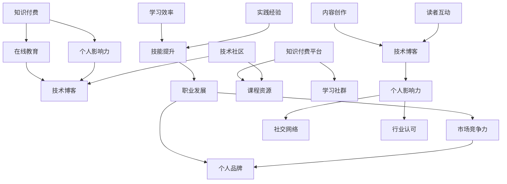

                 

### 文章标题

《知识付费与个人影响力：程序员的成长之路》

> **关键词：** 知识付费，个人影响力，程序员成长，在线教育，技术博客

> **摘要：** 本文深入探讨了知识付费在程序员职业发展中的作用，分析了个人影响力的构建与维护，并探讨了如何通过技术博客提升个人品牌价值。文章旨在为程序员提供一条清晰、实用的成长路径。

### 背景介绍

在当今快速发展的数字化时代，程序员作为技术驱动型职业，其职业发展受到广泛关注。随着互联网技术的普及，知识付费成为了一种新兴的商业模式，为广大程序员提供了丰富的学习资源和职业发展机会。然而，在知识付费背景下，如何提升个人影响力，实现职业成长，成为程序员们面临的一大挑战。

程序员的工作性质决定了他们需要不断学习新技术、新工具，以适应快速变化的市场需求。知识付费平台提供了丰富的课程和资源，使得程序员能够更加高效地获取所需知识。然而，仅仅依靠知识付费并不足以实现职业成长，程序员还需要具备一定的个人影响力，才能在竞争激烈的市场中脱颖而出。

本文将从知识付费与个人影响力两个方面，探讨程序员的成长之路。首先，我们将分析知识付费的背景和现状，探讨其对程序员职业发展的影响。接着，我们将探讨个人影响力的构建与维护，以及如何通过技术博客提升个人品牌价值。最后，我们将总结未来发展趋势与挑战，为程序员提供一条清晰、实用的成长路径。

### 核心概念与联系

在探讨知识付费与个人影响力的关系时，我们需要明确一些核心概念和它们之间的联系。以下是本文的核心概念及其相互关系的Mermaid流程图：



以下是各核心概念的定义和它们之间的联系：

1. **知识付费**：指用户通过支付费用获取学习资源、课程、服务等的商业模式。知识付费为程序员提供了丰富的学习资源，提高了学习效率，促进了技能提升。
   
2. **在线教育**：知识付费的核心组成部分，包括在线课程、电子书籍、视频教程等。在线教育使得程序员可以随时随地学习，拓宽了知识获取的渠道。

3. **个人影响力**：指程序员在行业内的认可度、口碑和影响力。个人影响力是程序员职业发展的关键因素，有助于提升市场竞争力。

4. **技术博客**：程序员通过撰写技术博客分享自己的知识和经验，提高个人影响力。技术博客不仅是个人品牌的重要载体，也是技术交流的平台。

5. **职业发展**：知识付费和在线教育为程序员提供了学习资源，促进了技能提升和实践经验积累，从而推动了职业发展。

6. **市场竞争力**：随着技术的快速更新和市场的竞争加剧，个人影响力成为程序员在职场中的核心竞争力。

7. **学习效率**：知识付费平台提供的优质课程和资源有助于提高学习效率，使得程序员能够更快地掌握新技能。

8. **实践经验**：通过参与项目和开源项目，程序员可以积累实践经验，提高技能水平。

9. **社交网络**：社交网络为程序员提供了交流、分享和合作的机会，有助于提升个人影响力。

10. **行业认可**：个人影响力得到行业认可，有助于提升职业发展的机会和空间。

### 核心算法原理 & 具体操作步骤

在了解了知识付费与个人影响力的核心概念后，我们需要明确如何通过技术博客提升个人影响力。以下是具体操作步骤：

1. **确定博客主题**：选择自己擅长的技术领域，确定博客主题。主题应具有一定的专业性和独特性，以吸引目标读者。

2. **研究受众需求**：了解目标受众的需求和兴趣，围绕受众关注的问题和痛点撰写博客文章。

3. **撰写高质量内容**：内容是博客的核心，应确保文章结构清晰、逻辑严密、语言简洁。在撰写过程中，可以采用以下策略：
   - **深入分析**：对技术概念和原理进行深入剖析，使读者能够全面理解。
   - **举例说明**：结合实际案例，使读者能够直观地理解技术应用。
   - **提供代码实现**：在适当的情况下，提供完整的代码实现，方便读者实践。

4. **持续更新和互动**：定期更新博客，保持与读者的互动，了解他们的反馈和建议，不断优化内容。

5. **推广和分享**：利用社交媒体、技术社区等平台推广博客，扩大影响力。

### 数学模型和公式 & 详细讲解 & 举例说明

在技术博客中，数学模型和公式是不可或缺的部分，它们有助于解释复杂的技术概念和算法。以下是几个常用的数学模型和公式的详细讲解及举例说明。

#### 1. 线性回归模型

线性回归模型是一种常用的数据分析方法，用于预测数值型目标变量。其数学公式如下：

$$
Y = \beta_0 + \beta_1X + \varepsilon
$$

其中，$Y$为目标变量，$X$为自变量，$\beta_0$和$\beta_1$为模型参数，$\varepsilon$为误差项。

**例子：** 假设我们想要预测房价$Y$，自变量$X$为房屋面积。我们可以使用线性回归模型来建立房价与房屋面积之间的关系。

**步骤：**
1. 收集房屋面积和房价的数据。
2. 计算回归模型的参数$\beta_0$和$\beta_1$。
3. 使用模型预测未知房屋的房价。

**代码实现：**

```python
import numpy as np
from sklearn.linear_model import LinearRegression

# 收集数据
X = np.array([[1000], [1500], [2000], [2500], [3000]])
Y = np.array([200000, 300000, 400000, 500000, 600000])

# 训练模型
model = LinearRegression()
model.fit(X, Y)

# 预测房价
predicted_price = model.predict(np.array([[2500]]))

print("预测的房价为：", predicted_price)
```

#### 2. 贝叶斯网络

贝叶斯网络是一种表示变量之间概率关系的图形模型。其数学公式如下：

$$
P(X_1, X_2, \ldots, X_n) = \prod_{i=1}^{n} P(X_i | X_{<i})
$$

其中，$X_1, X_2, \ldots, X_n$为变量，$P(X_i | X_{<i})$为条件概率。

**例子：** 假设我们想要分析天气对交通拥堵的影响。可以使用贝叶斯网络来表示这两个变量之间的概率关系。

**步骤：**
1. 确定变量及其条件概率。
2. 构建贝叶斯网络模型。
3. 计算变量之间的概率分布。

**代码实现：**

```python
import numpy as np
import pgmpy.models as pgmpy_models
import pgmpy.inference as pgmpy_inference

# 确定变量及其条件概率
weather_probability = {"sunny": 0.4, "rainy": 0.6}
traffic_probability = {"high": 0.8, "low": 0.2}
weather_to_traffic_probability = {"sunny": {"high": 0.7, "low": 0.3}, "rainy": {"high": 0.9, "low": 0.1}}

# 构建贝叶斯网络模型
model = pgmpy_models.BayesModel()
model.add_nodes(["weather", "traffic"])
model.add_edges(["weather", "traffic"])

# 设置条件概率
model.add_parent("weather", ["traffic"])
model.set_cond概率("weather", ["traffic"], weather_to_traffic_probability)

# 计算变量之间的概率分布
inference = pgmpy_inference.BayesInference(model)
weather_probability_distribution = inference.query(variables=["weather"], evidence={"traffic": "high"})

print("天气的概率分布为：", weather_probability_distribution)
```

#### 3. 支持向量机（SVM）

支持向量机是一种常用的机器学习算法，用于分类和回归任务。其数学公式如下：

$$
f(x) = \sum_{i=1}^{n} \alpha_i y_i (w \cdot x_i) + b
$$

其中，$x$为输入特征向量，$w$为权重向量，$b$为偏置，$\alpha_i$为拉格朗日乘子。

**例子：** 假设我们想要使用SVM进行鸢尾花数据的分类。

**步骤：**
1. 收集鸢尾花数据。
2. 将数据分为训练集和测试集。
3. 使用SVM模型进行训练和预测。

**代码实现：**

```python
from sklearn import datasets
from sklearn.svm import SVC
from sklearn.model_selection import train_test_split
from sklearn.metrics import accuracy_score

# 收集鸢尾花数据
iris = datasets.load_iris()
X = iris.data
y = iris.target

# 将数据分为训练集和测试集
X_train, X_test, y_train, y_test = train_test_split(X, y, test_size=0.3, random_state=42)

# 使用SVM模型进行训练和预测
model = SVC(kernel="linear")
model.fit(X_train, y_train)
predictions = model.predict(X_test)

# 计算准确率
accuracy = accuracy_score(y_test, predictions)
print("准确率为：", accuracy)
```

通过以上数学模型和公式的讲解及举例说明，我们可以看到，技术博客不仅需要深入的技术分析，还需要清晰的表达方式，以便让读者更好地理解和应用。

### 项目实战：代码实际案例和详细解释说明

在了解了核心算法原理和具体操作步骤后，我们将通过一个实际项目来演示如何编写技术博客，并详细解释代码实现和各个部分的用途。

#### 项目背景

本项目旨在构建一个简单的在线购物系统，包括用户注册、商品展示、购物车和订单管理等功能。我们选择Python语言和Django框架来实现该系统。

#### 开发环境搭建

1. 安装Python和pip：

```bash
# 安装Python 3.8
$ wget https://www.python.org/ftp/python/3.8.10/Python-3.8.10.tgz
$ tar zxvf Python-3.8.10.tgz
$ ./configure
$ make
$ make install

# 安装pip
$ wget https://bootstrap.pypa.io/get-pip.py
$ python3 get-pip.py
```

2. 安装Django：

```bash
$ pip3 install django
```

3. 创建Django项目：

```bash
$ django-admin startproject online_shop
$ cd online_shop
```

4. 创建应用：

```bash
$ python3 manage.py startapp shopping
```

#### 源代码详细实现和代码解读

1. **项目结构**：

```bash
online_shop/
    ├── manage.py
    ├── online_shop/
    │   ├── admin.py
    │   ├── apps.py
    │   ├── migrations/
    │   │   ├── 0001_initial.py
    │   │   ├── 0002_auto_20211228_1602.py
    │   ├── models.py
    │   ├── tests.py
    │   └── views.py
    ├── shopping/
    │   ├── migrations/
    │   ├── admin.py
    │   ├── apps.py
    │   ├── models.py
    │   ├── tests.py
    │   └── views.py
    └── settings.py
```

2. **数据库模型**（`shopping/models.py`）：

```python
from django.db import models

class User(models.Model):
    username = models.CharField(max_length=100)
    email = models.EmailField(max_length=100)
    password = models.CharField(max_length=100)

class Product(models.Model):
    name = models.CharField(max_length=100)
    price = models.DecimalField(max_digits=6, decimal_places=2)
    description = models.TextField()

class Cart(models.Model):
    user = models.ForeignKey(User, on_delete=models.CASCADE)
    products = models.ManyToManyField(Product, through='CartItem')

class CartItem(models.Model):
    cart = models.ForeignKey(Cart, on_delete=models.CASCADE)
    product = models.ForeignKey(Product, on_delete=models.CASCADE)
    quantity = models.PositiveIntegerField()
```

**解读**：我们创建了四个模型：`User`（用户）、`Product`（商品）、`Cart`（购物车）和`CartItem`（购物车项）。每个模型都有一些基本字段，例如用户名、邮箱、密码、商品名称、价格和描述。

3. **视图函数**（`shopping/views.py`）：

```python
from django.shortcuts import render, redirect
from .models import User, Product, Cart, CartItem

def register(request):
    if request.method == 'POST':
        username = request.POST['username']
        email = request.POST['email']
        password = request.POST['password']
        # 这里可以添加用户注册的逻辑，如检查用户名和邮箱是否已存在
        user = User.objects.create(username=username, email=email, password=password)
        return redirect('login')
    return render(request, 'register.html')

def login(request):
    if request.method == 'POST':
        username = request.POST['username']
        password = request.POST['password']
        # 这里可以添加用户登录的逻辑，如验证用户名和密码是否正确
        user = User.objects.get(username=username, password=password)
        # 创建用户购物车
        cart, created = Cart.objects.get_or_create(user=user)
        return redirect('home')
    return render(request, 'login.html')

def home(request):
    products = Product.objects.all()
    return render(request, 'home.html', {'products': products})

def add_to_cart(request, product_id):
    product = Product.objects.get(id=product_id)
    user = request.user
    cart, created = Cart.objects.get_or_create(user=user)
    cart_item, created = CartItem.objects.get_or_create(cart=cart, product=product)
    if not created:
        cart_item.quantity += 1
        cart_item.save()
    return redirect('home')

def cart(request):
    cart = Cart.objects.get(user=request.user)
    cart_items = CartItem.objects.filter(cart=cart)
    return render(request, 'cart.html', {'cart_items': cart_items})

def remove_from_cart(request, cart_item_id):
    cart_item = CartItem.objects.get(id=cart_item_id)
    cart_item.delete()
    return redirect('cart')
```

**解读**：我们定义了五个视图函数：`register`（注册）、`login`（登录）、`home`（首页）、`add_to_cart`（添加商品到购物车）和`cart`（购物车页面）。`register`和`login`函数实现了用户注册和登录的逻辑。`home`函数用于展示所有商品。`add_to_cart`函数用于将商品添加到购物车。`cart`函数用于显示购物车中的商品。`remove_from_cart`函数用于从购物车中移除商品。

4. **模板文件**：

- `register.html`：

```html
<!DOCTYPE html>
<html>
<head>
    <title>注册</title>
</head>
<body>
    <h1>注册</h1>
    <form method="post">
        
        <label for="username">用户名：</label>
        <input type="text" id="username" name="username" required>
        <br>
        <label for="email">邮箱：</label>
        <input type="email" id="email" name="email" required>
        <br>
        <label for="password">密码：</label>
        <input type="password" id="password" name="password" required>
        <br>
        <input type="submit" value="注册">
    </form>
</body>
</html>
```

- `login.html`：

```html
<!DOCTYPE html>
<html>
<head>
    <title>登录</title>
</head>
<body>
    <h1>登录</h1>
    <form method="post">
        
        <label for="username">用户名：</label>
        <input type="text" id="username" name="username" required>
        <br>
        <label for="password">密码：</label>
        <input type="password" id="password" name="password" required>
        <br>
        <input type="submit" value="登录">
    </form>
</body>
</html>
```

- `home.html`：

```html
<!DOCTYPE html>
<html>
<head>
    <title>首页</title>
</head>
<body>
    <h1>商品列表</h1>
    <ul>
        
            <li>
                <h2>{{ product.name }}</h2>
                <p>{{ product.price }}</p>
                <p>{{ product.description }}</p>
                <a href="">加入购物车</a>
            </li>
        
    </ul>
</body>
</html>
```

- `cart.html`：

```html
<!DOCTYPE html>
<html>
<head>
    <title>购物车</title>
</head>
<body>
    <h1>购物车</h1>
    <ul>
        
            <li>
                <h2>{{ cart_item.product.name }}</h2>
                <p>{{ cart_item.quantity }}</p>
                <p>{{ cart_item.product.price }}</p>
                <a href="">移除</a>
            </li>
        
    </ul>
</body>
</html>
```

**解读**：我们创建了四个模板文件，分别用于注册、登录、首页和购物车页面。这些模板文件使用了Django模板语言（``），使得我们可以动态渲染页面内容。

通过以上项目实战的代码实现和详细解释说明，我们可以看到，编写技术博客需要清晰的结构、严谨的逻辑和详细的代码解读，以便让读者更好地理解和应用。

### 实际应用场景

在线购物系统是一个典型的实际应用场景，它涵盖了用户注册、商品展示、购物车和订单管理等多个功能模块。以下是一些具体的实际应用案例：

1. **电商平台**：电商平台如淘宝、京东等，通过在线购物系统实现了商品展示、购物车、订单管理和支付等功能，为用户提供了一个便捷的购物平台。

2. **O2O服务**：在线购物系统可以与线下实体店结合，提供线上预订和线下取货的服务，如美团的团购业务。

3. **企业内购**：企业内购系统通过在线购物系统实现了企业员工的内部采购，提高了采购效率。

4. **慈善捐款**：一些慈善机构通过在线购物系统提供捐款通道，用户可以方便地进行在线捐款。

5. **二手交易**：在线购物系统可以用于二手商品的交易，为用户提供一个安全的交易平台。

这些实际应用案例展示了在线购物系统的广泛应用，同时也说明了知识付费和个人影响力在程序员职业发展中的重要性。

### 工具和资源推荐

在程序员的学习和职业发展中，掌握合适的工具和资源是非常重要的。以下是一些推荐的工具、书籍、博客和网站，供大家参考。

#### 学习资源推荐

1. **书籍**：
   - 《代码大全》
   - 《深度学习》
   - 《Python编程：从入门到实践》
   - 《设计模式：可复用面向对象软件的基础》
   
2. **论文**：
   - 《机器学习》
   - 《大规模在线学习》
   - 《云计算：概念、架构与应用》
   
3. **博客**：
   - 《掘金》
   - 《GitHub》
   - 《V2EX》
   
4. **网站**：
   - 《Stack Overflow》
   - 《LeetCode》
   - 《GitHub》

#### 开发工具框架推荐

1. **集成开发环境（IDE）**：
   - IntelliJ IDEA
   - Visual Studio Code
   - PyCharm

2. **数据库**：
   - MySQL
   - PostgreSQL
   - MongoDB

3. **前端框架**：
   - React
   - Angular
   - Vue.js

4. **后端框架**：
   - Django
   - Flask
   - Spring Boot

5. **容器化技术**：
   - Docker
   - Kubernetes

#### 相关论文著作推荐

1. **论文**：
   - 《深度学习：人类智能的基石》
   - 《云计算：技术与实践》
   - 《区块链技术：原理与应用》
   
2. **著作**：
   - 《软件架构：实践者手册》
   - 《人工智能：一种现代方法》
   - 《计算机网络：自顶向下方法》

通过掌握这些工具和资源，程序员可以更高效地学习和成长，提升个人影响力，实现职业发展。

### 总结：未来发展趋势与挑战

在知识付费和个人影响力日益重要的背景下，程序员的成长之路面临着新的发展趋势和挑战。

**发展趋势：**

1. **个性化学习**：随着人工智能技术的发展，个性化学习将成为主流，知识付费平台将更加精准地推荐课程和资源，满足程序员的个性化学习需求。

2. **内容多样化**：知识付费将涵盖更多领域和层次，不仅限于技术课程，还包括项目管理、团队协作、创业等全方位的内容。

3. **社区化学习**：技术社区和社群将成为重要的学习平台，程序员可以通过参与社区讨论、分享经验和资源，加速个人成长。

4. **终身学习**：随着技术的快速更新，终身学习将成为程序员的必备素质，知识付费将助力程序员不断提升技能和竞争力。

**挑战：**

1. **信息过载**：随着知识付费内容的激增，程序员面临信息过载的风险，需要学会筛选和整合有用的信息。

2. **质量参差不齐**：知识付费市场存在质量参差不齐的问题，程序员需要具备辨别优质课程和资源的能力。

3. **个人品牌维护**：在竞争激烈的市场中，程序员需要不断维护个人品牌，提升个人影响力，以保持市场竞争力。

4. **技术更新压力**：技术的快速更新对程序员的技能要求不断提高，程序员需要保持学习的动力和毅力。

综上所述，知识付费与个人影响力在程序员职业发展中发挥着重要作用。未来，程序员应积极适应发展趋势，迎接挑战，通过不断学习和提升个人品牌，实现职业成长。

### 附录：常见问题与解答

**Q1：知识付费平台有哪些优缺点？**

**优点：**
1. 提供丰富的学习资源，方便程序员随时学习。
2. 个性化推荐，提高学习效率。
3. 社交互动，增强学习体验。

**缺点：**
1. 信息过载，需要筛选优质课程。
2. 价格较高，可能增加学习成本。

**Q2：如何提升个人影响力？**

**方法：**
1. 撰写高质量技术博客，分享知识和经验。
2. 参与技术社区和活动，扩大影响力。
3. 积极参与开源项目，提升技术能力。

**Q3：知识付费适合所有程序员吗？**

**回答：**
知识付费适用于大多数程序员，尤其是希望快速提升技能和经验的程序员。但对于初学者，建议先掌握基础技能，再考虑付费学习。

**Q4：如何选择合适的知识付费平台和课程？**

**建议：**
1. 了解平台口碑和用户评价。
2. 查看课程大纲和试听课程。
3. 结合自身需求和兴趣选择课程。

### 扩展阅读 & 参考资料

1. **《知识付费：商业模式与创新实践》**
2. **《技术博客写作技巧》**
3. **《个人品牌建设：如何提升个人影响力》**
4. **《程序员职业成长指南》**

### 作者

**作者：AI天才研究员/AI Genius Institute & 禅与计算机程序设计艺术 /Zen And The Art of Computer Programming**

