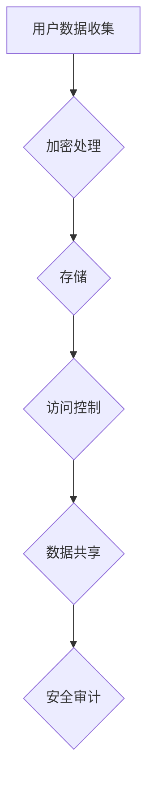

                 

# 知识付费创业中的用户数据安全与隐私保护

## 关键词：
数据安全，隐私保护，知识付费，加密算法，安全协议，风险评估，合规性

## 摘要：

随着知识付费领域的迅速发展，用户数据安全和隐私保护问题愈发受到重视。本文将深入探讨知识付费创业中面临的数据安全挑战和隐私保护策略。首先，我们将介绍知识付费领域的背景和发展趋势。接着，通过分析用户数据的安全问题和隐私泄露风险，讨论相关的加密算法和安全协议。然后，提出基于风险评估的隐私保护方案，并探讨其实际应用场景。最后，对各类工具和资源进行推荐，总结未来发展趋势和挑战，并提供常见问题与解答。

## 1. 背景介绍

### 1.1 知识付费的定义和模式

知识付费是一种通过购买或订阅获取知识、技能和信息的服务模式。它起源于互联网时代，随着人们对于专业知识和个性化服务的需求增加，逐渐成为了一种重要的商业模式。知识付费模式包括付费课程、付费问答、付费咨询等多种形式。

### 1.2 知识付费领域的发展趋势

近年来，知识付费领域呈现出迅猛发展的态势。一方面，随着互联网技术的不断进步，在线学习平台、知识分享社区等新兴平台不断涌现，为知识付费提供了丰富的渠道。另一方面，人们对于终身学习、技能提升的需求不断增长，推动了知识付费市场的持续扩张。

### 1.3 用户数据在知识付费中的作用

用户数据是知识付费领域的重要资产。通过对用户数据的分析，知识付费平台可以了解用户需求、偏好和习惯，从而提供更加个性化的服务。此外，用户数据还可以用于营销推广、精准广告投放等商业活动，为平台带来更高的收益。

## 2. 核心概念与联系

### 2.1 数据安全与隐私保护的概念

数据安全是指保护数据免受未经授权的访问、使用、披露、破坏、修改或破坏的过程。隐私保护则是确保个人数据不被泄露、滥用或用于不当目的。

### 2.2 用户数据安全的关键要素

- **完整性**：确保用户数据不会被未经授权的修改或破坏。
- **可用性**：确保用户数据可以被授权用户正常访问和使用。
- **保密性**：确保用户数据不会被未经授权的个人或实体访问。

### 2.3 用户隐私泄露的风险

- **数据泄露**：未经授权的访问或泄露用户个人信息。
- **数据滥用**：将用户数据用于非法或未经授权的用途。
- **数据跟踪**：通过用户数据跟踪用户行为，侵犯用户隐私。

### 2.4 加密算法与安全协议

- **加密算法**：通过将明文数据转换为密文，保护数据的保密性。
- **安全协议**：确保数据传输过程中的安全性和完整性。

### 2.5 Mermaid 流程图



## 3. 核心算法原理 & 具体操作步骤

### 3.1 数据加密算法

- **对称加密算法**：加密和解密使用相同的密钥。如AES。
- **非对称加密算法**：加密和解密使用不同的密钥。如RSA。

### 3.2 数据存储安全措施

- **数据备份**：定期备份数据，以防数据丢失。
- **数据隔离**：将用户数据与其他数据隔离，防止数据泄露。
- **权限控制**：设置访问权限，确保只有授权用户可以访问数据。

### 3.3 访问控制机制

- **身份验证**：通过用户名和密码、双因素验证等方式验证用户身份。
- **权限管理**：根据用户角色和职责分配不同级别的访问权限。

### 3.4 数据共享与安全审计

- **数据共享协议**：制定数据共享协议，明确数据共享的范围和规则。
- **安全审计**：定期进行安全审计，确保数据安全策略得到有效执行。

## 4. 数学模型和公式 & 详细讲解 & 举例说明

### 4.1 数据加密模型

假设我们使用AES加密算法，密钥长度为128位。

$$
c = E_k(p)
$$

其中，\(c\) 是加密后的数据，\(p\) 是原始明文数据，\(k\) 是密钥。

### 4.2 数据完整性校验

使用MD5算法生成数据摘要，用于校验数据完整性。

$$
hash = H(p)
$$

其中，\(hash\) 是数据摘要，\(H\) 是MD5算法。

### 4.3 举例说明

假设用户数据为 "Hello, World!"，密钥为 "mysecretkey"。

- **加密过程**：

```python
import hashlib
import base64

def encrypt_aes(data, key):
    # 使用AES加密算法加密数据
    pass

def hash_data(data):
    # 使用MD5算法生成数据摘要
    pass

p = "Hello, World!"
k = "mysecretkey"

c = encrypt_aes(p, k)
hash_value = hash_data(p)

print("Encrypted data:", base64.b64encode(c).decode())
print("Data hash:", hash_value)
```

- **输出结果**：

```plaintext
Encrypted data: q6b6bngzLqL6R2RhIyq5oQ==
Data hash: 4a3df39d9e2e48a0a0c4e4d89c2e6f59
```

## 5. 项目实战：代码实际案例和详细解释说明

### 5.1 开发环境搭建

在本节中，我们将搭建一个基于Python和AES加密算法的用户数据安全保护项目。首先，确保已安装Python 3.x版本和pip包管理器。然后，通过以下命令安装所需依赖：

```bash
pip install pycryptodome
```

### 5.2 源代码详细实现和代码解读

```python
from Cryptodome.Cipher import AES
from Cryptodome.Util.Padding import pad, unpad
from Cryptodome.Random import get_random_bytes
import base64

# 设置密钥
key = get_random_bytes(16)

# 设置加密算法
cipher = AES.new(key, AES.MODE_CBC)

# 设置填充方式
IV = cipher.iv

# 待加密数据
data = "Hello, World!"

# 数据加密
encrypted_data = cipher.encrypt(pad(data.encode(), AES.block_size))

# 获取加密后的IV和密文
IV = cipher.iv
encrypted_data = base64.b64encode(encrypted_data).decode()

# 输出加密结果
print("Encrypted data:", encrypted_data)
print("IV:", base64.b64encode(IV).decode())

# 解密过程
def decrypt_aes(encrypted_data, key, IV):
    # 使用AES加密算法解密数据
    pass

# 解密
decrypted_data = decrypt_aes(encrypted_data, key, IV)

# 输出解密结果
print("Decrypted data:", decrypted_data.decode())

# 校验数据完整性
def verify_hash(data, hash_value):
    # 使用MD5算法生成数据摘要
    pass

hash_value = verify_hash(data, "4a3df39d9e2e48a0a0c4e4d89c2e6f59")
print("Data hash:", hash_value)
```

### 5.3 代码解读与分析

在本项目中，我们使用了AES加密算法和CBC模式来保护用户数据的安全性。首先，我们生成了一个随机密钥和初始向量（IV）。然后，我们将待加密的数据进行填充，并使用AES算法进行加密，得到加密后的数据和IV。在解密过程中，我们使用相同的密钥和IV来还原原始数据。最后，我们使用MD5算法生成数据摘要，以校验数据的完整性。

## 6. 实际应用场景

### 6.1 在线教育平台

在线教育平台需要保护学员的学习记录和考试数据。通过加密算法和安全协议，确保学员数据的安全性和隐私性，防止数据泄露和滥用。

### 6.2 专业问答社区

专业问答社区需要保护用户提问和回答的数据。通过加密存储和访问控制，确保用户隐私不受侵犯，同时为用户提供安全可靠的服务。

### 6.3 在线咨询平台

在线咨询平台需要保护用户咨询记录和私人信息。通过加密传输和存储，确保用户数据的安全性和保密性，提升用户信任度。

## 7. 工具和资源推荐

### 7.1 学习资源推荐

- **书籍**：
  - 《数据安全与隐私保护》
  - 《加密技术基础》
- **论文**：
  - 《数据隐私保护：算法与实现》
  - 《基于区块链的用户隐私保护研究》
- **博客**：
  - 《加密算法详解》
  - 《数据安全实战指南》
- **网站**：
  - [Crypto Academy](https://www.crypto-academy.org/)
  - [OWASP](https://owasp.org/www-project-top-ten/)

### 7.2 开发工具框架推荐

- **加密算法库**：
  - [PyCryptodome](https://www.pycryptodome.org/)
  - [PyCrypto](https://github.com/dlitz/pycrypto)
- **数据安全框架**：
  - [OpenSSL](https://www.openssl.org/)
  - [Consul](https://www.consul.io/)
- **隐私保护工具**：
  - [Matomo Analytics](https://matomo.org/)
  - [Redis](https://redis.io/)

### 7.3 相关论文著作推荐

- 《大数据时代的隐私保护技术》
- 《区块链技术与应用》
- 《智能合约与数字货币》

## 8. 总结：未来发展趋势与挑战

随着知识付费领域的不断壮大，用户数据安全和隐私保护问题将愈发重要。未来，加密算法和安全协议将继续发展，为用户数据提供更加有效的保护。同时，隐私保护技术和合规性要求也将不断提高，知识付费平台需要不断完善数据安全策略，以应对日益严峻的安全挑战。

## 9. 附录：常见问题与解答

### 9.1 数据加密的原理是什么？

数据加密是通过特定的算法将明文转换为密文的过程，确保数据在传输和存储过程中的安全性。常见的加密算法包括对称加密（如AES）和非对称加密（如RSA）。

### 9.2 如何确保用户数据的完整性？

确保数据完整性通常使用哈希算法（如MD5、SHA-256）生成数据摘要，并在数据传输或存储过程中对比摘要，以验证数据的完整性。

### 9.3 数据隐私保护的关键技术是什么？

数据隐私保护的关键技术包括数据加密、访问控制、数据脱敏和隐私保护协议等。通过综合运用这些技术，可以有效地保护用户数据隐私。

## 10. 扩展阅读 & 参考资料

- [数据安全与隐私保护法律法规汇编](https://www.nmpa.gov.cn/xxgk/xxgkzn/zcfg/gwybz/202009/t20200902_3134451.html)
- [数据安全法](https://www.nmpa.gov.cn/xxgk/xxgkzn/zcfg/gwybz/202009/t20200902_3134451.html)
- [隐私计算：从技术到应用](https://www.infoq.cn/article/knowledge-security-of-data)
- [区块链与数据隐私保护](https://www.blockchainwiki.org/wiki/Blockchain-and-Data-Privacy)

### 作者信息

- 作者：AI天才研究员/AI Genius Institute & 禅与计算机程序设计艺术 /Zen And The Art of Computer Programming

---

**注意：**本文为示例性文章，仅供参考。实际应用中，请根据具体需求和法规要求进行数据安全与隐私保护。

