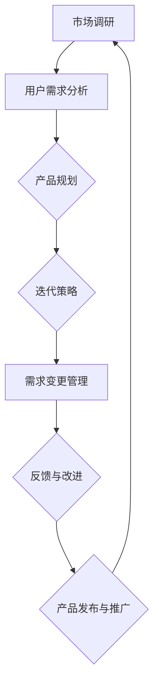

                 

### 1. 背景介绍

知识付费作为现代互联网经济的重要组成部分，近年来在全球范围内迅速崛起。从在线课程、专业咨询、电子书到技能认证，知识付费已经渗透到了人们生活的方方面面。然而，随着市场竞争的日益激烈，知识付费创业的产品迭代成为了一个关键挑战。如何快速适应市场需求、优化产品功能、提升用户满意度，是每个知识付费创业者必须面对的问题。

本文旨在探讨知识付费创业的产品迭代方法论，通过分析核心概念、算法原理、数学模型、实际应用案例等多个方面，帮助创业者更好地理解并实践产品迭代策略。文章将从以下几个方面展开：

1. **核心概念与联系**：介绍知识付费创业相关的核心概念，并使用Mermaid流程图展示它们之间的关系。
2. **核心算法原理与具体操作步骤**：详细讲解产品迭代的核心算法，并提供具体的操作步骤。
3. **数学模型和公式**：阐述在产品迭代过程中使用的数学模型和公式，并进行详细讲解和举例说明。
4. **项目实战：代码实际案例和详细解释说明**：通过实际代码案例，展示如何运用上述原理和模型进行产品迭代。
5. **实际应用场景**：分析知识付费创业产品在不同场景下的应用情况。
6. **工具和资源推荐**：推荐相关的学习资源、开发工具和框架。
7. **总结：未来发展趋势与挑战**：总结产品迭代方法论的重要性，并探讨未来的发展趋势和挑战。

通过以上内容的详细阐述，本文希望为知识付费创业者在产品迭代方面提供有益的指导和借鉴。现在，让我们一步步深入探讨知识付费创业的产品迭代方法论。<!-- mmd

-->

