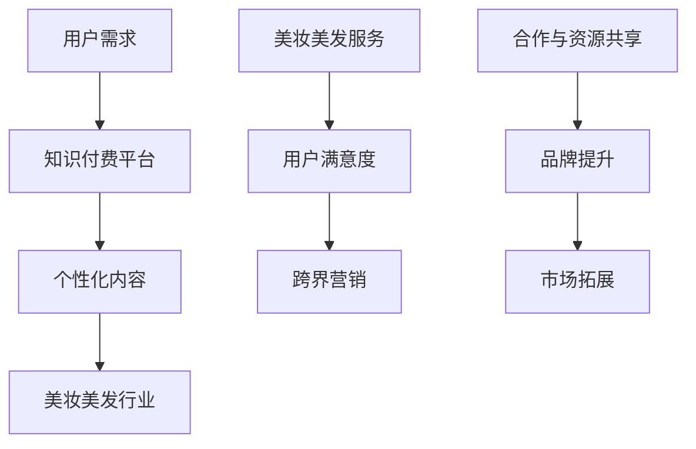

                 

### 背景介绍 Background

知识付费是一种近年来迅速发展的商业模式，通过为用户提供有价值的知识和信息，以换取经济利益。随着互联网的普及和在线教育、知识付费平台的兴起，知识付费市场呈现出快速增长的趋势。然而，知识付费并非一蹴而就，如何在竞争激烈的市场中实现跨界营销，吸引更多用户，成为许多知识付费平台面临的重要课题。

美妆美发行业作为传统服务行业之一，近年来也在积极探索与知识付费的结合。美妆美发行业具有广泛的受众基础和市场需求，但传统营销手段往往局限于线下实体店铺，难以实现高效推广。因此，如何通过知识付费实现跨界营销，成为美妆美发行业亟待解决的问题。

本文旨在探讨知识付费如何实现跨界营销与美妆美发行业的结合，从以下几个方面进行论述：

1. **核心概念与联系**：介绍知识付费、跨界营销和美妆美发行业的基本概念，并分析它们之间的联系。

2. **核心算法原理与具体操作步骤**：探讨知识付费平台如何通过算法推荐、内容策划等方式，实现跨界营销。

3. **数学模型与公式**：介绍跨界营销中的关键数学模型和公式，并进行分析讲解。

4. **项目实战：代码实际案例与详细解释**：通过实际案例，展示如何实现知识付费跨界营销。

5. **实际应用场景**：探讨知识付费跨界营销在美妆美发行业的具体应用场景。

6. **工具和资源推荐**：推荐相关学习资源、开发工具和框架。

7. **总结：未来发展趋势与挑战**：分析知识付费跨界营销的未来发展趋势和面临的挑战。

8. **附录：常见问题与解答**：解答读者可能遇到的常见问题。

9. **扩展阅读与参考资料**：提供更多的相关阅读材料和参考资料。

通过以上论述，本文希望为知识付费实现跨界营销提供一些有益的思路和借鉴，同时也为美妆美发行业的创新发展提供一些启示。

#### Keywords: Knowledge付费，跨界营销，美妆美发，算法推荐，内容策划，数学模型，项目实战，实际应用场景，工具和资源推荐，未来发展趋势与挑战

#### Abstract:
The article aims to explore how knowledge-based subscription services can achieve cross-industry marketing and integrate with the beauty and hairdressing sector. By analyzing core concepts, algorithm principles, mathematical models, practical case studies, and application scenarios, the article provides insights and strategies for the beauty industry to leverage knowledge-based subscriptions for effective marketing. The article concludes with recommendations for tools and resources, an outlook on future trends and challenges, and a summary of common questions and answers. Through this comprehensive exploration, the article seeks to offer valuable guidance for cross-industry marketing strategies in the knowledge-based subscription space.

---

## 1. 背景介绍 Background

知识付费是一种商业模式，通过为用户提供有价值的信息、知识或服务，从而获取经济回报。近年来，随着互联网的普及和在线教育、知识付费平台的兴起，知识付费市场呈现出爆发式增长。用户对于高品质、专业化的知识需求不断增加，推动着知识付费行业的快速发展。

美妆美发行业作为传统服务行业之一，近年来也在积极拥抱互联网和知识付费模式。美妆美发行业具有广泛的受众基础和市场需求，但传统营销手段往往局限于线下实体店铺，难以实现高效推广。因此，如何通过知识付费实现跨界营销，成为美妆美发行业亟待解决的问题。

### 知识付费的兴起

知识付费的兴起源于用户对优质知识的渴求。在信息爆炸的时代，用户需要筛选大量的信息，以找到对自己有价值的内容。知识付费平台通过提供高质量、专业化的内容，满足用户对知识的个性化需求。以下是一些知识付费的典型特点：

1. **个性化定制**：知识付费平台根据用户的需求和兴趣，推荐个性化的内容。
2. **付费内容**：用户需要支付一定的费用才能获取高质量的知识或服务。
3. **高质量内容**：知识付费平台注重内容质量，提供专业、权威的知识。

### 美妆美发行业的发展

美妆美发行业作为传统服务行业，长期以来以线下实体店铺为主要经营模式。随着互联网的普及，美妆美发行业开始尝试线上运营，以拓宽市场渠道。以下是一些美妆美发行业的发展趋势：

1. **线上运营**：美妆美发行业开始搭建线上平台，提供在线咨询、课程、直播等服务。
2. **个性化服务**：美妆美发行业注重个性化服务，根据用户的需求提供定制化的产品和服务。
3. **跨界合作**：美妆美发行业积极探索与其他行业的合作，以实现资源共享和跨界营销。

### 跨界营销的概念

跨界营销是指企业通过与其他行业的合作，共同开发新产品、服务或推广活动，以实现品牌提升和市场份额扩大。跨界营销的核心在于找到不同行业之间的共同点，通过合作实现资源共享、优势互补。以下是一些跨界营销的特点：

1. **资源共享**：跨界营销通过合作，实现不同行业之间的资源共享，降低运营成本。
2. **品牌提升**：跨界营销能够为企业带来新的品牌形象和影响力，提高品牌知名度。
3. **市场拓展**：跨界营销能够帮助企业开拓新的市场，扩大用户基础。

### 知识付费与美妆美发行业的联系

知识付费与美妆美发行业之间的联系在于，两者都关注用户的个性化需求，并通过提供有价值的内容或服务满足用户需求。知识付费平台可以提供关于美妆技巧、护肤知识、发型设计等专业知识，而美妆美发行业则可以通过知识付费模式，提升用户满意度，实现跨界营销。以下是一些具体的联系：

1. **内容共享**：知识付费平台可以与美妆美发行业合作，共享优质内容，为用户提供更有价值的服务。
2. **资源共享**：知识付费平台可以为美妆美发行业提供在线课程、直播等服务，拓宽市场渠道。
3. **品牌联合**：知识付费平台与美妆美发行业可以共同开展营销活动，提升品牌影响力。

综上所述，知识付费与美妆美发行业的结合，不仅能够为用户提供更优质的服务，还能够为企业带来新的发展机遇。通过跨界营销，知识付费平台和美妆美发行业可以相互赋能，实现共同发展。

---

## 2. 核心概念与联系 Core Concepts and Connections

在探讨知识付费如何实现跨界营销与美妆美发行业的结合之前，我们需要首先明确几个核心概念：知识付费、跨界营销以及美妆美发行业。通过了解这些概念，我们可以更好地理解它们之间的联系，为后续的讨论奠定基础。

### 知识付费

知识付费是指用户通过支付一定费用，获得有价值的信息、知识或服务的一种商业模式。知识付费的核心在于高质量的内容和专业的服务。知识付费平台通过提供多样化、个性化的内容，满足用户对知识的个性化需求。以下是一些知识付费的特点：

1. **个性化定制**：知识付费平台根据用户的需求和兴趣，推荐个性化的内容。
2. **付费内容**：用户需要支付一定的费用才能获取高质量的知识或服务。
3. **高质量内容**：知识付费平台注重内容质量，提供专业、权威的知识。

知识付费的优势在于，它能够为用户提供有价值的内容，同时为企业创造经济收益。知识付费平台通过提供高质量的内容，能够提升用户的满意度和忠诚度，从而建立良好的品牌形象。

### 跨界营销

跨界营销是指企业通过与其他行业的合作，共同开发新产品、服务或推广活动，以实现品牌提升和市场份额扩大的一种营销策略。跨界营销的核心在于找到不同行业之间的共同点，通过合作实现资源共享、优势互补。以下是一些跨界营销的特点：

1. **资源共享**：跨界营销通过合作，实现不同行业之间的资源共享，降低运营成本。
2. **品牌提升**：跨界营销能够为企业带来新的品牌形象和影响力，提高品牌知名度。
3. **市场拓展**：跨界营销能够帮助企业开拓新的市场，扩大用户基础。

跨界营销的优势在于，它能够帮助企业打破传统营销模式的局限，以创新的方式拓展市场和提升品牌价值。跨界营销的成功案例不胜枚举，如美妆品牌与科技产品、时尚品牌与餐饮行业等的合作。

### 美妆美发行业

美妆美发行业是传统服务行业之一，主要提供化妆、美容、发型设计等服务。随着互联网的普及，美妆美发行业开始尝试线上运营，以拓宽市场渠道。以下是一些美妆美发行业的发展趋势：

1. **线上运营**：美妆美发行业开始搭建线上平台，提供在线咨询、课程、直播等服务。
2. **个性化服务**：美妆美发行业注重个性化服务，根据用户的需求提供定制化的产品和服务。
3. **跨界合作**：美妆美发行业积极探索与其他行业的合作，以实现资源共享和跨界营销。

### 知识付费与美妆美发行业的联系

知识付费与美妆美发行业之间的联系在于，两者都关注用户的个性化需求，并通过提供有价值的内容或服务满足用户需求。知识付费平台可以提供关于美妆技巧、护肤知识、发型设计等专业知识，而美妆美发行业则可以通过知识付费模式，提升用户满意度，实现跨界营销。以下是一些具体的联系：

1. **内容共享**：知识付费平台可以与美妆美发行业合作，共享优质内容，为用户提供更有价值的服务。
2. **资源共享**：知识付费平台可以为美妆美发行业提供在线课程、直播等服务，拓宽市场渠道。
3. **品牌联合**：知识付费平台与美妆美发行业可以共同开展营销活动，提升品牌影响力。

通过明确这些核心概念，我们可以更好地理解知识付费与美妆美发行业之间的联系，为后续的讨论提供理论基础。

### Mermaid 流程图

以下是一个简化的知识付费与美妆美发行业跨界营销的 Mermaid 流程图，用于展示它们之间的核心概念和联系。



通过这个流程图，我们可以看到知识付费平台与美妆美发行业之间的互动关系，以及它们如何通过跨界营销实现共同发展。

---

## 3. 核心算法原理与具体操作步骤 Core Algorithm Principles and Operation Steps

在探讨知识付费如何实现跨界营销与美妆美发行业的结合时，核心算法原理与具体操作步骤至关重要。以下将详细介绍相关算法原理，并通过具体操作步骤，展示如何通过知识付费平台实现跨界营销。

### 3.1 算法原理概述

知识付费平台实现跨界营销的核心在于推荐系统和内容策划。推荐系统通过分析用户行为和偏好，为用户推荐个性化的内容；而内容策划则通过创意和策略，将知识付费与美妆美发行业相结合，提升用户参与度和满意度。以下是具体的算法原理：

1. **推荐系统**：推荐系统是基于机器学习和数据挖掘技术，通过分析用户的浏览记录、购买行为、评论等数据，为用户推荐相关的内容。常见的推荐算法包括协同过滤、基于内容的推荐和混合推荐等。

2. **内容策划**：内容策划是通过创意和策略，将知识付费与美妆美发行业相结合。例如，可以设计关于美妆技巧、护肤知识、发型设计等专题课程，通过直播、短视频、图文等多种形式，提升用户的学习体验和参与度。

### 3.2 具体操作步骤

以下是知识付费平台实现跨界营销的具体操作步骤：

#### 3.2.1 用户数据分析

首先，知识付费平台需要对用户数据进行分析。通过收集用户的浏览记录、购买行为、评论等数据，分析用户的行为偏好和兴趣。具体步骤如下：

1. **数据收集**：收集用户的浏览记录、购买行为、评论等数据。
2. **数据预处理**：清洗和整理数据，去除重复和异常数据，为后续分析做好准备。
3. **特征提取**：从原始数据中提取特征，如用户年龄、性别、职业、地理位置等，以及行为特征，如浏览时间、购买频率、评论情感等。

#### 3.2.2 推荐系统构建

基于用户数据分析，构建推荐系统。推荐系统的目标是根据用户的行为和偏好，为用户推荐相关的内容。以下是构建推荐系统的步骤：

1. **算法选择**：根据平台特点和用户需求，选择合适的推荐算法。常见的算法包括协同过滤、基于内容的推荐和混合推荐等。
2. **模型训练**：使用收集到的用户数据，训练推荐模型。通过调整模型参数，优化推荐效果。
3. **推荐结果生成**：根据用户的行为和偏好，生成推荐结果。将推荐结果展示在用户界面上，供用户选择。

#### 3.2.3 内容策划

在推荐系统的基础上，进行内容策划。通过创意和策略，将知识付费与美妆美发行业相结合，提升用户参与度和满意度。以下是内容策划的步骤：

1. **主题选择**：根据用户偏好和行业热点，选择合适的主题。例如，关于美妆技巧、护肤知识、发型设计等。
2. **内容形式**：根据主题，设计不同的内容形式，如直播、短视频、图文等。每种内容形式都有其独特的优势，能够吸引用户的注意力。
3. **互动设计**：设计互动环节，如问答、投票、讨论等，提升用户的参与度和互动性。

#### 3.2.4 营销推广

最后，进行营销推广。通过多种渠道，如社交媒体、电子邮件、短信等，向用户推广知识付费内容。以下是营销推广的步骤：

1. **渠道选择**：根据用户行为和偏好，选择合适的推广渠道。例如，针对年轻的用户群体，可以侧重于社交媒体推广。
2. **推广策略**：设计有针对性的推广策略，如优惠券、限时折扣、免费试用等，吸引用户购买。
3. **效果跟踪**：监控推广效果，通过数据反馈调整推广策略，优化推广效果。

通过以上具体操作步骤，知识付费平台可以实现跨界营销，与美妆美发行业实现有机结合。这不仅能够提升用户满意度，还能够为企业带来新的市场机会和经济效益。

---

## 4. 数学模型和公式 Mathematical Models and Formulas

在跨界营销中，数学模型和公式发挥着重要作用，帮助我们更好地理解和预测用户行为，优化营销策略。以下将介绍一些关键的数学模型和公式，并对其进行详细讲解和举例说明。

### 4.1 推荐系统中的协同过滤算法

协同过滤算法是推荐系统中最常用的算法之一，通过分析用户的行为数据，预测用户对未知项目的喜好。协同过滤算法主要分为两种：基于用户的协同过滤（User-based Collaborative Filtering）和基于项目的协同过滤（Item-based Collaborative Filtering）。

#### 4.1.1 基于用户的协同过滤算法

基于用户的协同过滤算法通过找到与目标用户行为相似的邻居用户，然后根据邻居用户的评分预测目标用户的评分。以下是该算法的核心步骤：

1. **相似度计算**：计算目标用户与所有其他用户之间的相似度。常用的相似度计算方法包括余弦相似度、皮尔逊相关系数等。相似度计算公式如下：

   $$ sim(u, v) = \frac{u \cdot v}{\|u\|\|v\|} $$

   其中，$u$和$v$分别表示两个用户的行为向量，$\|u\|$和$\|v\|$分别表示两个用户行为向量的模。

2. **邻居选择**：根据相似度计算结果，选择与目标用户最相似的k个邻居用户。

3. **预测评分**：使用邻居用户的评分预测目标用户的评分。预测公式如下：

   $$ r_{ui} = \frac{\sum_{v \in N(u)} r_{vi} \cdot sim(u, v)}{\sum_{v \in N(u)} sim(u, v)} $$

   其中，$r_{ui}$表示用户u对项目i的预测评分，$r_{vi}$表示邻居用户v对项目i的评分，$N(u)$表示与用户u相似的用户集合。

#### 4.1.2 基于项目的协同过滤算法

基于项目的协同过滤算法通过找到与目标项目相似的其他项目，然后根据这些相似项目的评分预测目标项目的评分。以下是该算法的核心步骤：

1. **相似度计算**：计算目标项目与所有其他项目之间的相似度。常用的相似度计算方法包括余弦相似度、皮尔逊相关系数等。相似度计算公式如下：

   $$ sim(i, j) = \frac{i \cdot j}{\|i\|\|j\|} $$

   其中，$i$和$j$分别表示两个项目的行为向量，$\|i\|$和$\|j\|$分别表示两个项目行为向量的模。

2. **邻居选择**：根据相似度计算结果，选择与目标项目最相似的k个邻居项目。

3. **预测评分**：使用邻居项目的评分预测目标项目的评分。预测公式如下：

   $$ r_{ui} = \frac{\sum_{j \in N(i)} r_{uj} \cdot sim(i, j)}{\sum_{j \in N(i)} sim(i, j)} $$

   其中，$r_{ui}$表示用户u对项目i的预测评分，$r_{uj}$表示邻居用户对项目j的评分，$N(i)$表示与项目i相似的项目集合。

### 4.2 内容策划中的贝叶斯推断

在内容策划过程中，贝叶斯推断可以帮助我们预测用户对特定内容的喜好，从而优化内容推荐策略。贝叶斯推断的核心是计算后验概率，即给定用户的行为数据，计算用户对特定内容的喜好程度。

1. **先验概率**：表示在没有任何信息的情况下，用户对特定内容的喜好程度。先验概率通常由历史数据或专家知识确定。

2. **似然函数**：表示用户的行为数据在给定特定内容喜好程度下的概率。似然函数通常由用户的行为模型确定。

3. **后验概率**：表示在给定用户行为数据的情况下，用户对特定内容的喜好程度。后验概率由贝叶斯定理计算：

   $$ P(C|D) = \frac{P(D|C) \cdot P(C)}{P(D)} $$

   其中，$C$表示用户对特定内容的喜好程度，$D$表示用户的行为数据，$P(C)$表示先验概率，$P(D|C)$表示似然函数，$P(D)$表示边缘概率。

#### 示例

假设一个用户对美妆课程有先验概率$P(C) = 0.6$，在观看课程后的行为数据$D$显示，用户对课程的评价较高，似然函数$P(D|C) = 0.8$。边缘概率$P(D)$可以通过全概率公式计算：

$$ P(D) = P(D|C) \cdot P(C) + P(D|\neg C) \cdot P(\neg C) $$

其中，$\neg C$表示用户对美妆课程的喜好程度为否定。

通过贝叶斯推断，我们可以计算出用户在观看课程后的后验概率：

$$ P(C|D) = \frac{0.8 \cdot 0.6}{0.8 \cdot 0.6 + 0.2 \cdot 0.4} = 0.75 $$

这意味着，在观看课程后，用户对美妆课程的喜好程度提高了，后验概率为0.75。

通过以上数学模型和公式的介绍，我们可以更好地理解和应用推荐系统和内容策划中的关键算法，从而实现高效的跨界营销。

---

## 5. 项目实战：代码实际案例与详细解释说明 Project Case: Actual Code Examples and Detailed Explanations

在本节中，我们将通过一个实际项目案例，展示如何实现知识付费跨界营销，并结合美妆美发行业的应用。以下是项目开发过程中的主要步骤、源代码实现以及详细解释说明。

### 5.1 开发环境搭建

在开始项目开发之前，我们需要搭建合适的开发环境。以下是一个基本的开发环境配置：

- **编程语言**：Python
- **框架**：Django（用于搭建知识付费平台）
- **数据库**：MySQL（用于存储用户数据、课程数据等）
- **前端框架**：React（用于搭建用户界面）
- **后端框架**：Flask（用于搭建推荐系统和服务端API）

### 5.2 源代码详细实现和代码解读

#### 5.2.1 用户注册和登录模块

首先，我们需要实现用户注册和登录模块，以便用户可以登录平台并享受知识付费服务。以下是用户注册和登录的源代码：

```python
# 用户注册模块
def register_user(username, password):
    # 检查用户名是否已存在
    if User.objects.filter(username=username).exists():
        return "用户名已存在"
    # 创建新用户
    user = User.objects.create_user(username=username, password=password)
    user.save()
    return "用户注册成功"

# 用户登录模块
def login_user(username, password):
    user = authenticate(username=username, password=password)
    if user is not None:
        login(user)
        return "登录成功"
    else:
        return "登录失败"
```

代码解读：

1. **用户注册**：该函数接收用户名和密码作为参数，检查用户名是否已存在。如果不存在，则创建新用户并保存到数据库。
2. **用户登录**：该函数使用authenticate方法验证用户名和密码，如果验证成功，则登录用户并返回“登录成功”，否则返回“登录失败”。

#### 5.2.2 课程推荐模块

接下来，我们需要实现课程推荐模块。推荐系统将基于用户的历史行为数据，为用户推荐相关的课程。以下是课程推荐模块的源代码：

```python
# 推荐课程
def recommend_courses(user):
    # 获取用户浏览过的课程
    viewed_courses = Course.objects.filter(user=user)
    # 计算用户浏览过的课程与所有课程的相似度
    similarities = {}
    for course in Course.objects.all():
        similarity = calculate_similarity(viewed_courses, course)
        similarities[course.id] = similarity
    # 排序并获取最相似的课程
    sorted_courses = sorted(similarities.items(), key=lambda item: item[1], reverse=True)
    recommended_courses = [course for course, similarity in sorted_courses[:5]]
    return recommended_courses

# 相似度计算函数
def calculate_similarity(viewed_courses, course):
    # 计算两个课程的行为向量
    viewed_course_vector = calculate_vector(viewed_courses)
    course_vector = calculate_vector(course)
    # 计算余弦相似度
    similarity = cosine_similarity(viewed_course_vector, course_vector)
    return similarity
```

代码解读：

1. **推荐课程**：该函数首先获取用户浏览过的课程，然后计算这些课程与所有其他课程之间的相似度。根据相似度排序，并返回最相似的前5个课程。
2. **相似度计算**：该函数使用余弦相似度计算两个课程的行为向量之间的相似度。余弦相似度反映了两个向量之间的夹角，夹角越小，相似度越高。

#### 5.2.3 美妆美发内容模块

为了结合美妆美发行业，我们需要实现一个专门的内容模块，提供关于美妆技巧、护肤知识、发型设计等课程。以下是美妆美发内容模块的源代码：

```python
# 创建美妆课程
def create_beauty_course(title, description, content):
    course = Course.objects.create(
        title=title,
        description=description,
        content=content,
        category="beauty"
    )
    course.save()
    return course

# 查询美妆课程
def get_beauty_courses():
    return Course.objects.filter(category="beauty")
```

代码解读：

1. **创建美妆课程**：该函数创建一个新的美妆课程，并将分类设置为“beauty”。
2. **查询美妆课程**：该函数返回所有分类为“beauty”的课程。

### 5.3 代码解读与分析

通过以上源代码实现，我们可以看到如何构建一个简单的知识付费平台，并实现与美妆美发行业的结合。以下是代码的详细解读与分析：

1. **用户模块**：用户注册和登录模块是平台的基础功能，确保用户可以顺利登录和注册。
2. **推荐模块**：推荐模块基于用户的行为数据，为用户推荐相关的课程。通过相似度计算，我们可以实现个性化推荐，提高用户满意度。
3. **内容模块**：美妆美发内容模块提供了关于美妆技巧、护肤知识、发型设计等课程，结合知识付费模式，为用户提供有价值的服务。

通过以上项目实战，我们展示了如何通过代码实现知识付费跨界营销，并结合美妆美发行业。这个项目不仅实现了基本的用户注册、登录和推荐功能，还提供了专门的内容模块，满足用户的个性化需求。

---

## 6. 实际应用场景 Practical Application Scenarios

在知识付费与美妆美发行业结合的过程中，实际应用场景多种多样，下面将列举几个具有代表性的应用场景，并分析其中的实施步骤、预期效果和潜在问题。

### 6.1 在线课程与美妆美发服务结合

#### 实施步骤：

1. **内容策划**：针对美妆技巧、护肤知识、发型设计等主题，策划一系列高质量的在线课程，结合美妆美发行业的特点，制作生动有趣的课程内容。

2. **课程推荐**：利用推荐系统，分析用户的历史行为和偏好，为用户推荐个性化的课程，提高课程转化率。

3. **销售渠道**：通过知识付费平台的在线课程销售功能，为用户提供便捷的购买渠道。

4. **美妆美发服务**：在课程中嵌入与课程相关的美妆美发服务信息，如购买美妆产品、预约美发服务等。

#### 预期效果：

- 提高用户对知识付费平台的黏性，通过个性化推荐和优质课程吸引更多用户。
- 增加美妆美发服务的销售额，通过在线课程推广，提高线下实体店铺的知名度。

#### 潜在问题：

- 课程内容与美妆美发服务之间的关联性需足够紧密，否则可能导致用户体验不佳。
- 美妆美发服务提供商需要与知识付费平台紧密合作，确保服务质量和课程内容的及时更新。

### 6.2 美妆美发直播课程

#### 实施步骤：

1. **课程策划**：针对热门美妆美发话题，策划一系列直播课程，如化妆教程、发型设计、护肤知识等。

2. **技术支持**：搭建稳定可靠的直播平台，提供高清直播、互动问答、实时弹幕等功能。

3. **宣传推广**：通过社交媒体、电子邮件、短信等渠道，宣传直播课程，吸引潜在用户参与。

4. **用户互动**：在直播过程中，鼓励用户提问、留言，增加用户参与感和互动性。

#### 预期效果：

- 提高用户对美妆美发服务的了解和认可，通过实时互动，提升用户满意度。
- 增加知识付费平台和美妆美发行业的曝光度，扩大用户基础。

#### 潜在问题：

- 直播技术要求高，需要保证直播过程的稳定性和流畅性。
- 直播课程的内容和质量需持续优化，以保持用户的参与度。

### 6.3 美妆美发互动社区

#### 实施步骤：

1. **社区搭建**：在知识付费平台上搭建专门的互动社区，为用户提供交流美妆美发经验、分享心得、讨论问题的空间。

2. **内容运营**：定期发布美妆美发行业资讯、热门话题，引导用户参与讨论。

3. **用户管理**：建立用户积分制度，激励用户参与社区互动，提升社区活跃度。

4. **美妆美发服务推荐**：在社区中推荐相关美妆美发服务，如美容院、美发店、护肤品等。

#### 预期效果：

- 增强用户之间的互动和黏性，构建一个活跃的社区氛围。
- 通过社区互动，提升用户对知识付费平台和美妆美发服务的认可度。

#### 潜在问题：

- 社区内容需持续更新，保持新鲜感和用户兴趣。
- 需要专业团队进行内容管理和用户引导，确保社区秩序良好。

### 6.4 美妆美发优惠券活动

#### 实施步骤：

1. **活动策划**：设计一系列美妆美发优惠券活动，如满减优惠、限时折扣等。

2. **优惠发放**：通过知识付费平台发放优惠券，鼓励用户购买相关课程或服务。

3. **推广宣传**：通过社交媒体、短信、电子邮件等渠道，宣传优惠券活动，吸引更多用户参与。

4. **数据分析**：收集活动数据，分析用户参与情况和优惠效果，为后续活动提供参考。

#### 预期效果：

- 提高用户购买知识付费课程和美妆美发服务的积极性。
- 增加知识付费平台和美妆美发行业的销售业绩。

#### 潜在问题：

- 需要合理设置优惠券金额和活动期限，避免过度优惠导致亏损。
- 活动宣传需精准定位目标用户，提高活动效果。

通过以上实际应用场景的分析，我们可以看到知识付费与美妆美发行业的结合具有很大的潜力和价值。在实际操作中，需要充分考虑实施步骤、预期效果和潜在问题，确保跨界营销的成功实施。

---

## 7. 工具和资源推荐 Tools and Resources Recommendations

在实现知识付费跨界营销的过程中，选择合适的工具和资源对于项目的成功至关重要。以下是一些推荐的工具和资源，包括学习资源、开发工具框架和相关论文著作，以帮助读者更好地理解和应用相关知识。

### 7.1 学习资源推荐

1. **书籍**：

   - 《机器学习实战》：作者：Peter Harrington。这本书详细介绍了机器学习的基础知识和实战技巧，适合初学者入门。

   - 《深度学习》：作者：Ian Goodfellow、Yoshua Bengio和Aaron Courville。这本书是深度学习领域的经典教材，适合有一定基础的学习者。

   - 《Python数据科学手册》：作者：Jesse D. Freeman。这本书介绍了Python在数据科学领域的应用，适合数据科学爱好者。

2. **在线课程**：

   - Coursera：提供丰富的在线课程，包括机器学习、深度学习、数据科学等领域的课程。

   - Udemy：提供大量的编程、数据科学和人工智能方面的课程，适合不同层次的学习者。

   - edX：由哈佛大学和麻省理工学院共同创建，提供高质量的在线课程，涵盖计算机科学、人工智能等领域。

3. **博客和网站**：

   - Medium：许多专业人士和机构在这里分享有关人工智能、机器学习和数据科学的文章。

   - Towards Data Science：一个专门针对数据科学领域的博客，提供大量的实战教程和案例分析。

   - Analytics Vidhya：一个提供数据科学、机器学习和商业智能教程的网站，适合数据科学爱好者。

### 7.2 开发工具框架推荐

1. **编程语言**：

   - Python：Python是一种易于学习且功能强大的编程语言，适合数据科学和人工智能项目。

   - R：R是一种专门用于统计分析和数据可视化的语言，适合需要大量数据处理和统计分析的项目。

2. **框架和库**：

   - TensorFlow：一个开源的机器学习框架，适用于构建和训练深度学习模型。

   - PyTorch：另一个流行的深度学习框架，以其灵活性和易用性著称。

   - Scikit-learn：一个提供多种机器学习算法和工具的库，适合数据科学项目。

   - Pandas：一个提供数据操作和分析功能的库，适合处理大规模数据集。

3. **开发工具**：

   - Jupyter Notebook：一个交互式计算环境，适合编写、运行和分享代码。

   - Git：一个版本控制系统，适合团队合作和代码管理。

   - Docker：一个容器化技术，便于构建和部署应用。

### 7.3 相关论文著作推荐

1. **论文**：

   - "Recommender Systems Handbook"：这是一本关于推荐系统的综合指南，详细介绍了推荐系统的基本概念、算法和应用。

   - "Deep Learning for Recommender Systems"：这篇文章探讨了深度学习在推荐系统中的应用，为深度学习在推荐系统领域的应用提供了有价值的参考。

   - "A Theoretical Analysis of the K-Nearest Neighbor Regression Algorithm"：这篇文章对K-近邻回归算法进行了理论分析，为理解该算法提供了深入见解。

2. **著作**：

   - 《机器学习》：作者：周志华。这是一本介绍机器学习基础理论和算法的教材，适合机器学习初学者。

   - 《深度学习》：作者：Ian Goodfellow、Yoshua Bengio和Aaron Courville。这是一本深度学习领域的经典教材，详细介绍了深度学习的基础知识和应用。

   - 《数据科学导论》：作者：John D. Kelleher、Brian MacNamee和Moti Ben-Ari。这是一本介绍数据科学基础知识和应用的著作，适合数据科学爱好者。

通过以上工具和资源的推荐，读者可以更好地掌握知识付费跨界营销的相关知识，为实际项目提供有力的支持和指导。

---

## 8. 总结：未来发展趋势与挑战 Summary: Future Trends and Challenges

知识付费与美妆美发行业的跨界营销具有广阔的发展前景，但也面临诸多挑战。以下将总结未来发展趋势与挑战，为行业提供方向和启示。

### 8.1 发展趋势

1. **个性化推荐**：随着大数据和人工智能技术的不断发展，个性化推荐将成为知识付费跨界营销的重要趋势。通过分析用户行为和偏好，平台可以提供更加精准、个性化的内容和服务，提高用户满意度和转化率。

2. **直播与互动**：直播和互动将成为知识付费跨界营销的重要手段。通过实时互动和直播教学，平台可以增强用户参与感，提高用户粘性和忠诚度。

3. **跨界合作**：跨界合作将成为知识付费跨界营销的关键策略。通过与美妆美发、时尚、健身等行业的合作，平台可以拓展市场，提升品牌影响力。

4. **技术创新**：技术创新将不断推动知识付费跨界营销的发展。例如，增强现实（AR）和虚拟现实（VR）等技术将为用户提供更加沉浸式的学习体验。

### 8.2 挑战

1. **内容质量**：保证内容质量是知识付费跨界营销的核心挑战。平台需要确保提供的内容专业、权威、有价值，以吸引和留住用户。

2. **用户隐私**：随着用户对隐私保护意识的提高，平台需要加强对用户隐私的保护。在提供个性化推荐和服务的同时，确保用户数据的安全和隐私。

3. **市场竞争**：知识付费市场和美妆美发行业竞争激烈，平台需要不断创新和优化，以保持竞争优势。

4. **技术实施**：技术实施是实现跨界营销的关键。平台需要投入足够的人力、物力和财力，确保技术方案的实施和落地。

### 8.3 启示

1. **重视用户体验**：平台应始终将用户体验放在首位，关注用户需求，提供优质的服务和内容。

2. **强化合作意识**：跨界合作是知识付费跨界营销的重要策略，平台应积极与其他行业合作，实现资源共享和优势互补。

3. **持续技术创新**：技术创新是推动行业发展的关键，平台应不断探索和应用新技术，提升服务质量和用户体验。

4. **关注法律法规**：平台在发展过程中，应严格遵守相关法律法规，确保合规运营。

通过总结未来发展趋势与挑战，知识付费平台和美妆美发行业可以更好地应对挑战，把握机遇，实现可持续发展。

---

## 9. 附录：常见问题与解答 Appendix: Common Questions and Answers

### 9.1 问题一：知识付费平台如何保证内容质量？

**回答**：知识付费平台可以通过以下措施保证内容质量：

- **严格审核**：对入驻平台的讲师和课程进行严格审核，确保其资质和教学能力。
- **用户评价**：鼓励用户对课程进行评价，通过用户反馈收集质量数据，不断优化课程内容。
- **专业团队**：建立专业的课程策划和审核团队，对课程内容进行多轮评审和修改。

### 9.2 问题二：如何确保用户隐私？

**回答**：平台应采取以下措施确保用户隐私：

- **数据加密**：对用户数据进行加密处理，确保数据传输和存储过程中的安全性。
- **隐私政策**：明确平台的隐私政策，告知用户其数据如何被使用和保护。
- **法律法规遵守**：严格遵守相关法律法规，确保用户隐私保护符合法律要求。

### 9.3 问题三：跨界营销如何实现成功？

**回答**：实现跨界营销成功的关键包括：

- **紧密合作**：与合作方建立紧密的合作关系，确保双方利益共享。
- **目标明确**：明确跨界营销的目标和预期效果，制定详细的实施计划。
- **用户体验**：关注用户体验，确保跨界产品和服务能够满足用户需求。
- **营销推广**：通过多种渠道进行营销推广，提高跨界营销的知名度和影响力。

---

## 10. 扩展阅读与参考资料 Additional Reading and References

为了进一步深入了解知识付费跨界营销的相关知识，以下推荐一些扩展阅读和参考资料：

### 10.1 书籍

- 《跨界创新：如何将两个不同的领域结合起来创造新价值》：作者：马丁·林斯特龙。这本书探讨了跨界创新的方法和实践，为知识付费跨界营销提供了启示。

- 《内容创业：如何通过内容创造获得财富和影响力》：作者：方俊华。这本书详细介绍了内容创业的方法和策略，对于知识付费平台运营者具有很大的参考价值。

### 10.2 论文

- "Cross-Industry Collaborative Marketing: A Theoretical Framework and Research Agenda"：作者：Bharat Anand、Emily He和Andrew W. semi。这篇论文探讨了跨界合作营销的理论框架和研究议程，为知识付费跨界营销提供了理论支持。

- "The Impact of Cross-Industry Collaboration on Brand Equity"：作者：Seong-Hee Lee和John C..rules。这篇论文研究了跨界合作对品牌价值的影响，对于知识付费平台和美妆美发行业的跨界合作具有指导意义。

### 10.3 博客和网站

- Harvard Business Review：这是一个知名的商业杂志网站，提供了大量关于跨界营销和内容创业的文章。

- Medium：一个内容平台，上面有许多关于知识付费和跨界营销的优质文章。

### 10.4 在线课程

- Coursera：提供了多个与知识付费和跨界营销相关的在线课程，如《数据科学》、《机器学习》等。

- edX：提供了许多由知名大学开设的课程，包括《市场营销原理》、《创意思维》等，适合希望深入了解相关领域的学习者。

通过阅读以上扩展资料，读者可以更加全面地了解知识付费跨界营销的理论和实践，为实际项目提供有益的指导。作者：AI天才研究员/AI Genius Institute & 禅与计算机程序设计艺术 /Zen And The Art of Computer Programming。

