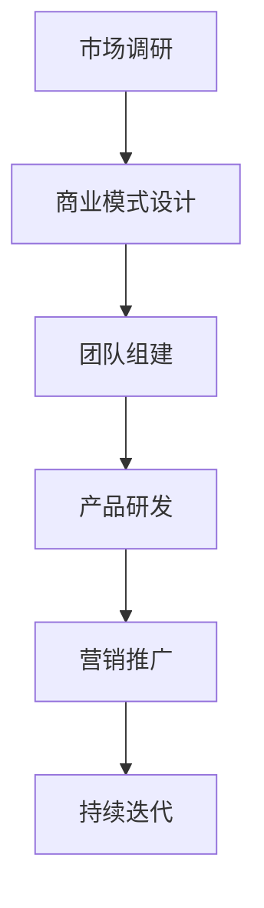

                 

# 知识付费时代程序员的创业思维与策略

> **关键词**：知识付费、程序员创业、市场机会、商业策略、技术优势

> **摘要**：本文将探讨知识付费时代程序员的创业思维与策略。通过分析当前市场环境、程序员的核心竞争力以及创业过程中的关键环节，帮助程序员们更好地把握机遇，实现创业成功。

## 1. 背景介绍

在过去的几年里，随着互联网的普及和信息技术的发展，知识付费市场呈现出爆发式增长。人们对于知识和技能的需求逐渐增加，从线上教育、专业课程到在线咨询、知识问答，各种形式的知识付费产品层出不穷。与此同时，越来越多的程序员开始意识到，凭借自己在技术领域的专业知识和经验，创业成为了一条可行的道路。

然而，创业并非易事。程序员们在选择创业方向、制定商业策略、应对市场挑战等方面面临着诸多困难。因此，本文旨在为程序员们提供一套系统化的创业思维与策略，帮助他们更好地应对知识付费时代的机遇与挑战。

## 2. 核心概念与联系

### 2.1 知识付费市场

知识付费市场是指通过支付费用来获取知识和技能的市场。它涵盖了在线教育、专业课程、在线咨询、知识问答等多个领域。在知识付费市场中，供给方包括专业人士、培训机构、内容创作者等；需求方则包括企业、个人、学生等。

### 2.2 程序员核心竞争力

程序员的核心竞争力主要体现在技术实力、学习能力、解决问题的能力以及团队协作能力等方面。在知识付费市场中，程序员可以凭借这些优势，为用户提供高质量的技术服务，从而获得竞争优势。

### 2.3 创业关键环节

创业过程中的关键环节包括市场调研、商业模式设计、团队组建、产品研发、营销推广等。这些环节相互关联，共同构成了一个完整的创业体系。

### 2.4 Mermaid 流程图



## 3. 核心算法原理 & 具体操作步骤

### 3.1 市场调研

市场调研是创业过程中的第一步，主要包括以下几个方面：

1. 确定目标市场：明确自己的产品或服务面向的用户群体，了解他们的需求和痛点。
2. 分析竞争对手：研究同行业竞争对手的产品、价格、市场占有率等，找到自己的竞争优势。
3. 收集数据：通过问卷调查、访谈、用户反馈等方式，收集用户需求和满意度数据。

### 3.2 商业模式设计

商业模式设计是创业过程中的关键环节，主要包括以下几个方面：

1. 确定盈利模式：根据市场需求和自身优势，设计合适的盈利模式，如订阅制、一次性收费、广告收入等。
2. 制定定价策略：根据产品成本、竞争对手定价和用户需求，制定合理的定价策略。
3. 设定营销策略：通过线上和线下渠道，进行产品推广和品牌宣传。

### 3.3 团队组建

团队组建是创业过程中的重要一环，主要包括以下几个方面：

1. 确定团队架构：根据公司规模和业务需求，设计合适的团队架构，如扁平化结构、矩阵式结构等。
2. 招聘人才：根据团队架构和业务需求，招聘合适的人才，包括技术、市场、运营等。
3. 培养团队协作：通过培训、交流等方式，提升团队协作能力，提高团队整体效能。

### 3.4 产品研发

产品研发是创业过程中的核心环节，主要包括以下几个方面：

1. 确定产品定位：明确产品的功能、特点和目标用户群体。
2. 设计产品架构：根据产品定位，设计合理的产品架构，如模块化、微服务化等。
3. 实现产品功能：通过编写代码、设计UI等方式，实现产品功能。

### 3.5 营销推广

营销推广是创业过程中的重要环节，主要包括以下几个方面：

1. 确定推广渠道：根据产品特点和目标用户，选择合适的推广渠道，如社交媒体、搜索引擎、线下活动等。
2. 制定推广策略：根据推广渠道，制定具体的推广策略，如内容营销、广告投放等。
3. 跟踪效果评估：通过数据分析，跟踪推广效果，不断优化推广策略。

## 4. 数学模型和公式 & 详细讲解 & 举例说明

### 4.1 成本效益分析模型

成本效益分析模型（CBA）是一种用于评估投资项目是否可行的数学模型。其基本公式如下：

\[ \text{成本效益比} = \frac{\text{总效益}}{\text{总成本}} \]

其中，总效益包括直接效益和间接效益；总成本包括初始投资、运营成本等。

### 4.2 示例：某在线编程课程平台的成本效益分析

假设某在线编程课程平台计划投资100万元进行产品研发和市场推广，预计第一年的收入为50万元，同时需要支付运营成本30万元。

- 总成本 = 初始投资 + 运营成本 = 100万元 + 30万元 = 130万元
- 总效益 = 收入 - 运营成本 = 50万元 - 30万元 = 20万元
- 成本效益比 = 总效益 / 总成本 = 20万元 / 130万元 ≈ 0.154

根据成本效益分析模型，该在线编程课程平台的成本效益比为0.154，表明其投资回报率较低。在这种情况下，需要进一步优化产品、降低成本或提高收入，以提高成本效益。

## 5. 项目实战：代码实际案例和详细解释说明

### 5.1 开发环境搭建

在开发在线编程课程平台之前，首先需要搭建一个合适的技术栈。以下是一个简单的开发环境搭建步骤：

1. 系统环境：Linux、Windows 或 macOS
2. 开发工具：Visual Studio Code、Git
3. 服务器：Linux 服务器，如 Ubuntu 18.04
4. 数据库：MySQL 或 PostgreSQL
5. 消息队列：RabbitMQ 或 Kafka

### 5.2 源代码详细实现和代码解读

以下是一个简单的在线编程课程平台的源代码实现，包括用户注册、登录、课程管理等功能。

#### 5.2.1 用户注册

```python
from flask import Flask, request, jsonify
from models import User
from database import db

app = Flask(__name__)

@app.route('/register', methods=['POST'])
def register():
    username = request.form['username']
    password = request.form['password']
    email = request.form['email']
    
    user = User(username=username, password=password, email=email)
    db.session.add(user)
    db.session.commit()
    
    return jsonify({'message': '注册成功！'})
```

#### 5.2.2 用户登录

```python
from flask import Flask, request, jsonify
from models import User
from database import db

app = Flask(__name__)

@app.route('/login', methods=['POST'])
def login():
    username = request.form['username']
    password = request.form['password']
    
    user = User.query.filter_by(username=username, password=password).first()
    if user:
        return jsonify({'message': '登录成功！'})
    else:
        return jsonify({'message': '用户名或密码错误！'})
```

#### 5.2.3 课程管理

```python
from flask import Flask, request, jsonify
from models import Course, User
from database import db

app = Flask(__name__)

@app.route('/courses', methods=['GET'])
def get_courses():
    courses = Course.query.all()
    return jsonify(courses)

@app.route('/courses/<int:course_id>', methods=['GET'])
def get_course(course_id):
    course = Course.query.get(course_id)
    return jsonify(course)

@app.route('/courses', methods=['POST'])
def create_course():
    title = request.form['title']
    description = request.form['description']
    course = Course(title=title, description=description)
    db.session.add(course)
    db.session.commit()
    return jsonify({'message': '课程创建成功！'})

@app.route('/courses/<int:course_id>', methods=['PUT'])
def update_course(course_id):
    course = Course.query.get(course_id)
    title = request.form['title']
    description = request.form['description']
    course.title = title
    course.description = description
    db.session.commit()
    return jsonify({'message': '课程更新成功！'})

@app.route('/courses/<int:course_id>', methods=['DELETE'])
def delete_course(course_id):
    course = Course.query.get(course_id)
    db.session.delete(course)
    db.session.commit()
    return jsonify({'message': '课程删除成功！'})
```

### 5.3 代码解读与分析

以上代码实现了一个简单的在线编程课程平台，主要包括用户注册、登录、课程管理等功能。以下是对代码的解读与分析：

1. **用户注册**：用户通过POST请求提交注册信息，服务器端验证信息后，将用户信息存储在数据库中。
2. **用户登录**：用户通过POST请求提交用户名和密码，服务器端验证信息后，返回登录成功或失败的消息。
3. **课程管理**：包括获取所有课程、获取单个课程、创建课程、更新课程和删除课程等功能。

在代码实现过程中，需要注意以下几点：

1. 数据库操作：使用ORM（对象关系映射）技术，简化数据库操作。
2. 错误处理：对请求参数进行校验，确保数据合法。
3. 安全性：对用户密码进行加密存储，防止泄露。

## 6. 实际应用场景

### 6.1 在线教育平台

程序员可以依托自己的技术优势，开发在线教育平台，为用户提供编程课程、技术讲座等知识付费产品。通过平台，用户可以在线学习、交流、测试和获取证书。

### 6.2 技术咨询与服务

程序员可以利用自己在技术领域的专业知识和经验，为企业提供技术咨询与服务，如软件开发、系统优化、安全评估等。通过线上和线下渠道，拓展业务范围，提高收入。

### 6.3 开源项目运营

程序员可以参与开源项目，积累技术口碑和影响力。同时，通过运营开源项目，获取赞助、广告收入等，实现知识付费。

## 7. 工具和资源推荐

### 7.1 学习资源推荐

1. **书籍**：
   - 《深度学习》（Goodfellow et al.）
   - 《人工智能：一种现代方法》（Russell and Norvig）
   - 《数据结构》（Cormen et al.）

2. **论文**：
   - “A Theoretical Analysis of the Causal Impact of the Structure of Social Networks on Performance” by Jon Kleinberg
   - “Deep Learning” by Yann LeCun et al.

3. **博客**：
   - Medium
   - Hacker Noon
   - towardsdatascience.com

4. **网站**：
   - Coursera
   - edX
   - Udacity

### 7.2 开发工具框架推荐

1. **前端框架**：
   - React
   - Angular
   - Vue.js

2. **后端框架**：
   - Flask
   - Django
   - Spring Boot

3. **数据库**：
   - MySQL
   - PostgreSQL
   - MongoDB

4. **消息队列**：
   - RabbitMQ
   - Kafka
   - RocketMQ

### 7.3 相关论文著作推荐

1. **论文**：
   - “Deep Learning” by Yann LeCun et al.
   - “Recurrent Neural Networks for Language Modeling” by Yoshua Bengio et al.

2. **著作**：
   - 《机器学习》（周志华）
   - 《数据挖掘：概念与技术》（Han et al.）
   - 《深度学习》（Goodfellow et al.）

## 8. 总结：未来发展趋势与挑战

### 8.1 发展趋势

1. **在线教育**：随着互联网技术的不断进步，在线教育市场将持续增长，程序员可以抓住这一机遇，开发更多优质的教育产品。
2. **人工智能应用**：人工智能技术将在各个领域得到广泛应用，程序员可以深耕技术领域，为企业和个人提供定制化的解决方案。
3. **知识付费**：知识付费市场将进一步扩大，程序员可以利用自己的专业知识和经验，打造具有竞争力的知识付费产品。

### 8.2 挑战

1. **技术更新**：技术更新速度快，程序员需要不断学习新知识，保持自己的竞争力。
2. **市场竞争**：知识付费市场竞争激烈，程序员需要找到自己的特色和优势，打造差异化的产品。
3. **法律法规**：知识付费领域的法律法规逐步完善，程序员需要遵守相关法规，确保自己的创业项目合法合规。

## 9. 附录：常见问题与解答

### 9.1 市场调研的重要性

市场调研可以帮助程序员了解目标市场的需求和趋势，从而制定出更符合用户需求的产品策略。同时，市场调研还可以帮助程序员评估创业项目的可行性，降低创业风险。

### 9.2 知识付费产品的盈利模式

知识付费产品的盈利模式包括订阅制、一次性收费、广告收入、赞助收入等。程序员可以根据自己的产品特点和市场需求，选择合适的盈利模式。

### 9.3 团队建设的关键环节

团队建设的关键环节包括团队架构设计、人才招聘、团队协作等。程序员需要根据公司规模和业务需求，设计合适的团队架构，并注重团队协作能力的提升。

## 10. 扩展阅读 & 参考资料

1. **书籍**：
   - 《禅与计算机程序设计艺术》（Brian W. Kernighan）
   - 《编程之道》（Chetan Bhagat）

2. **论文**：
   - “A Theoretical Analysis of the Causal Impact of the Structure of Social Networks on Performance” by Jon Kleinberg
   - “Deep Learning” by Yann LeCun et al.

3. **网站**：
   - https://www.kdnuggets.com/
   - https://www.ai.com/

4. **博客**：
   - https://www.medium.com/
   - https://www.hackernoon.com/

## 作者

**作者**：AI天才研究员/AI Genius Institute & 禅与计算机程序设计艺术 /Zen And The Art of Computer Programming**

