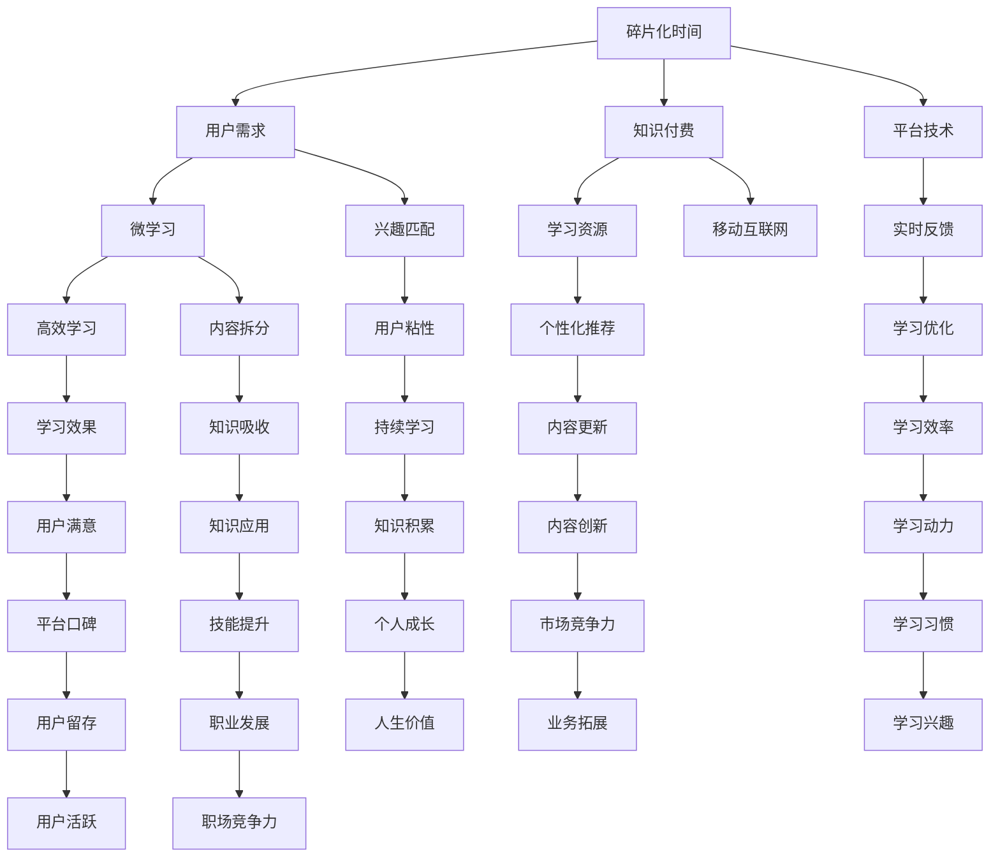

                 

### 背景介绍

在当今这个信息爆炸的时代，人们的时间变得越来越碎片化。工作、学习、生活等多重角色之间的切换，让人们在不同的时间片段中度过一天。这种碎片化时间的现象，不仅影响了人们的日常生活，也对知识付费领域带来了新的机遇和挑战。

知识付费作为一种商业模式，旨在通过付费获取高质量的知识和技能。过去，人们主要通过参加线下课程、购买书籍、订阅期刊等方式来获取知识。然而，随着移动互联网的普及和智能手机的广泛使用，人们获取知识的途径变得更加多样化，知识付费的场景也在不断拓展。

本文旨在探讨知识付费如何发掘碎片化时间的消费场景，从而更好地满足用户的需求，提升知识付费的普及率和使用效率。本文将分为以下几个部分进行探讨：

1. 核心概念与联系
2. 核心算法原理与具体操作步骤
3. 数学模型和公式及详细讲解
4. 项目实战：代码实际案例和详细解释说明
5. 实际应用场景
6. 工具和资源推荐
7. 总结：未来发展趋势与挑战

通过以上内容的逐步分析，我们将深入了解知识付费如何在碎片化时间中发挥其价值，为用户提供更便捷、高效的学习体验。

### 核心概念与联系

在探讨知识付费如何发掘碎片化时间的消费场景之前，我们需要明确几个核心概念，并探讨它们之间的联系。

首先，碎片化时间指的是人们日常生活中被分割成的小时间段，如上下班途中、排队等候、午休时间等。这些时间虽然零散，但加起来却是相当可观的。据调查，现代人每天平均有超过2个小时的碎片化时间，这些时间可以被有效利用来学习、工作、娱乐等。

知识付费，则是指用户通过支付一定费用来获取高质量知识的一种商业模式。它涵盖了在线课程、电子书、专栏、付费问答等多种形式。知识付费的核心在于提供有价值的内容，满足用户在不同领域的知识需求。

那么，碎片化时间与知识付费之间有何联系呢？实际上，碎片化时间与知识付费之间存在着天然的契合点。首先，碎片化时间的特性使得用户可以利用这些零散的时间进行学习，而知识付费则提供了丰富的学习资源，用户可以根据自己的需求和兴趣进行选择。其次，知识付费平台通常采用移动互联网技术，使得用户可以随时随地进行学习，这正好符合碎片化时间的使用场景。

此外，还有一个重要的概念是“微学习”（Microlearning）。微学习是一种以短小、精炼、高度集中的学习内容为特征的学习方式。它适合在碎片化时间内进行，通过将知识点拆分成小块，让用户在短时间内掌握关键信息。这与知识付费的理念相契合，知识付费平台可以通过提供微学习内容，更好地满足用户在碎片化时间内的学习需求。

综上所述，碎片化时间与知识付费之间有着紧密的联系。碎片化时间为知识付费提供了广阔的市场，而知识付费则为碎片化时间提供了丰富的学习资源。微学习作为连接两者的桥梁，将两者的优势相结合，为用户提供了更加灵活、高效的学习体验。接下来，我们将进一步探讨如何利用这些概念，发掘碎片化时间的消费场景。

#### 核心概念原理和架构的 Mermaid 流程图

为了更好地理解碎片化时间与知识付费之间的联系，我们可以通过一个Mermaid流程图来展示这些核心概念及其相互关系。以下是一个简化的Mermaid流程图示例：



在这个流程图中，我们可以看到碎片化时间（A）和用户需求（B）是知识付费（C）的基础，而微学习（D）则是连接两者的桥梁。通过移动互联网（H）和平台技术（G），用户可以方便地获取学习资源（E）并享受高效学习（F）体验。同时，兴趣匹配（I）和内容拆分（J）使得学习更加个性化。实时反馈（K）、个性化推荐（L）、学习效果（M）以及持续学习（S）等环节则共同促进了学习效果的优化和用户满意度的提升。最后，知识的应用（T）、技能提升（Y）和职场竞争力（II）等结果体现了知识付费和碎片化时间对个人成长的积极影响。

通过这个流程图，我们可以更加清晰地理解碎片化时间与知识付费之间的复杂关系，以及各个概念之间的相互影响和作用。

### 核心算法原理与具体操作步骤

在探讨如何发掘碎片化时间的消费场景时，算法原理起着至关重要的作用。特别是基于用户行为的推荐算法，它能够帮助我们为用户推荐最感兴趣的知识内容，从而提高用户的学习效率和满意度。

首先，我们需要理解推荐算法的核心原理。推荐算法主要分为基于内容的推荐（Content-based Recommendation）和基于协同过滤（Collaborative Filtering）两大类。基于内容的推荐算法通过分析用户的历史行为和兴趣，将相似的内容推荐给用户。而基于协同过滤的算法则通过分析用户之间的相似性，找到其他用户喜欢的项目并推荐给目标用户。

在本节中，我们将重点介绍基于协同过滤的推荐算法，因为它在处理大规模用户行为数据时表现出色，非常适合应用于碎片化时间场景下的知识付费。

#### 基于协同过滤的推荐算法原理

1. **用户-物品矩阵**：首先，我们需要建立一个用户-物品矩阵（User-Item Matrix），其中行代表用户，列代表物品（如知识内容）。矩阵中的元素表示用户对物品的评分或行为，例如点击、购买、观看时长等。

2. **相似度计算**：计算用户之间的相似度是推荐算法的关键步骤。常用的相似度计算方法包括余弦相似度（Cosine Similarity）、皮尔逊相关系数（Pearson Correlation Coefficient）等。相似度的计算公式如下：

    $$ similarity(u, v) = \frac{\sum_{i}^{|V|} x_{ui} \cdot x_{vi}}{\sqrt{\sum_{i}^{|V|} x_{ui}^2} \cdot \sqrt{\sum_{i}^{|V|} x_{vi}^2}} $$

    其中，\( u \) 和 \( v \) 是两个用户，\( x_{ui} \) 和 \( x_{vi} \) 是用户 \( u \) 和 \( v \) 对物品 \( i \) 的评分。

3. **推荐列表生成**：基于相似度计算，我们可以为每个用户生成一个推荐列表。具体步骤如下：
    - 对于目标用户 \( u \)，计算与 \( u \) 最相似的 \( k \) 个用户。
    - 对这些相似用户喜欢的物品进行加权平均，得到目标用户的推荐列表。

    推荐列表的生成公式为：

    $$ recommendation\_list(u) = \sum_{v \in neighbors(u)} w_{uv} \cdot i \cdot r_i $$

    其中，\( neighbors(u) \) 是与用户 \( u \) 最相似的 \( k \) 个用户，\( w_{uv} \) 是用户 \( u \) 和 \( v \) 之间的相似度权重，\( i \) 是物品，\( r_i \) 是用户 \( v \) 对物品 \( i \) 的评分。

4. **处理冷启动问题**：冷启动问题是指当新用户或新物品加入系统时，由于缺乏历史数据，推荐算法难以给出准确推荐。为解决这一问题，我们可以采用基于内容的推荐方法，同时结合用户的基本信息（如职业、教育背景等）来生成初始推荐列表。

#### 基于协同过滤推荐算法在碎片化时间场景下的应用

在碎片化时间场景下，基于协同过滤的推荐算法可以发挥重要作用。以下是其具体应用步骤：

1. **用户行为数据收集**：首先，我们需要收集用户在碎片化时间内的行为数据，如观看时长、点赞、分享、评论等。这些数据将用于训练推荐模型。

2. **建立用户-物品矩阵**：根据用户行为数据，建立用户-物品矩阵。这个矩阵将用于计算用户之间的相似度。

3. **相似度计算**：使用前述方法计算用户之间的相似度。在碎片化时间场景下，我们可以根据用户的观看时长、观看频率等指标来调整相似度计算公式，以更好地反映用户在碎片化时间内的兴趣。

4. **生成推荐列表**：根据相似度计算结果，为每个用户生成推荐列表。推荐列表中的知识内容应尽可能涵盖用户在碎片化时间内可能感兴趣的主题。

5. **实时更新与优化**：由于用户的行为数据是动态变化的，我们需要实时更新推荐模型，并优化推荐算法。这可以通过在线学习技术实现，从而确保推荐列表的实时性和准确性。

通过上述步骤，我们可以为用户在碎片化时间内提供个性化的知识推荐，帮助他们更高效地利用碎片化时间进行学习。接下来，我们将进一步探讨数学模型和公式在推荐算法中的应用。

### 数学模型和公式及详细讲解

在基于协同过滤的推荐算法中，数学模型和公式的应用至关重要。这些模型不仅帮助我们计算用户之间的相似度，还为推荐列表的生成提供了理论基础。以下将详细介绍这些数学模型和公式，并解释其具体应用。

#### 相似度计算公式

1. **余弦相似度**

   余弦相似度是计算两个向量之间夹角余弦值的相似度度量。它常用于计算用户之间的相似度。公式如下：

   $$ similarity(u, v) = \frac{\sum_{i}^{|V|} x_{ui} \cdot x_{vi}}{\sqrt{\sum_{i}^{|V|} x_{ui}^2} \cdot \sqrt{\sum_{i}^{|V|} x_{vi}^2}} $$

   其中，\( u \) 和 \( v \) 是两个用户，\( x_{ui} \) 和 \( x_{vi} \) 是用户 \( u \) 和 \( v \) 对物品 \( i \) 的评分，\( |V| \) 是物品的数量。

   **解释**：余弦相似度衡量的是用户在各个物品上的评分向量之间的夹角。夹角越小，表示用户越相似。这个公式通过对评分向量的点积（分子）和向量的模（分母）进行计算得到。

2. **皮尔逊相关系数**

   皮尔逊相关系数是一种衡量两个变量线性相关性的统计量。在推荐系统中，它也可以用于计算用户之间的相似度。公式如下：

   $$ correlation(u, v) = \frac{\sum_{i}^{|V|} (x_{ui} - \bar{u})(x_{vi} - \bar{v})}{\sqrt{\sum_{i}^{|V|} (x_{ui} - \bar{u})^2} \cdot \sqrt{\sum_{i}^{|V|} (x_{vi} - \bar{v})^2}} $$

   其中，\( \bar{u} \) 和 \( \bar{v} \) 分别是用户 \( u \) 和 \( v \) 的平均评分，其余符号与余弦相似度相同。

   **解释**：皮尔逊相关系数通过计算用户评分与各自平均评分之差的乘积和，来衡量用户之间的线性相关性。相关性越强，相似度越高。

3. **调整后的相似度**

   为了避免极端值的影响，我们通常会使用调整后的相似度公式。例如，我们可以对每个用户对物品的评分进行归一化处理，然后计算调整后的相似度：

   $$ similarity_{adjusted}(u, v) = \frac{\sum_{i}^{|V|} \frac{x_{ui}}{\sqrt{\sum_{i}^{|V|} x_{ui}^2}} \cdot \frac{x_{vi}}{\sqrt{\sum_{i}^{|V|} x_{vi}^2}}}{\sqrt{2}} $$

   **解释**：归一化处理使得每个用户对物品的评分值在相似度计算中具有相同的权重，从而避免了评分差异过大的影响。

#### 推荐列表生成公式

基于相似度计算，我们可以为每个用户生成推荐列表。以下是一个简单的推荐列表生成公式：

$$ recommendation\_list(u) = \sum_{v \in neighbors(u)} w_{uv} \cdot i \cdot r_i $$

其中，\( neighbors(u) \) 是与用户 \( u \) 最相似的 \( k \) 个用户，\( w_{uv} \) 是用户 \( u \) 和 \( v \) 之间的相似度权重，\( i \) 是物品，\( r_i \) 是用户 \( v \) 对物品 \( i \) 的评分。

**解释**：这个公式通过对相似用户喜欢的物品进行加权平均，为用户 \( u \) 生成推荐列表。权重 \( w_{uv} \) 可以根据相似度计算结果进行设定，通常采用高斯分布进行调整。

#### 实际应用示例

假设我们有三个用户 \( u_1, u_2, u_3 \) 和五个物品 \( i_1, i_2, i_3, i_4, i_5 \)。用户对物品的评分如下表所示：

| 用户 | 物品 |
| ---- | ---- |
| \( u_1 \) | \( i_1 \) | \( i_2 \) | \( i_3 \) | \( i_4 \) | \( i_5 \) |
| \( u_1 \) | 5 | 3 | 4 | 0 | 2 |
| \( u_2 \) | 4 | 5 | 2 | 3 | 1 |
| \( u_3 \) | 3 | 2 | 5 | 4 | 0 |

1. **相似度计算**

   使用余弦相似度计算 \( u_1 \) 和 \( u_2 \) 之间的相似度：

   $$ similarity(u_1, u_2) = \frac{5 \cdot 4 + 3 \cdot 5 + 4 \cdot 2 + 0 \cdot 3 + 2 \cdot 1}{\sqrt{5^2 + 3^2 + 4^2 + 0^2 + 2^2} \cdot \sqrt{4^2 + 5^2 + 2^2 + 3^2 + 1^2}} \approx 0.71 $$

   同理，计算 \( u_1 \) 和 \( u_3 \) 之间的相似度：

   $$ similarity(u_1, u_3) = \frac{3 \cdot 3 + 2 \cdot 2 + 4 \cdot 5 + 0 \cdot 4 + 2 \cdot 0}{\sqrt{3^2 + 2^2 + 4^2 + 0^2 + 2^2} \cdot \sqrt{3^2 + 2^2 + 5^2 + 4^2 + 0^2}} \approx 0.63 $$

2. **推荐列表生成**

   假设 \( u_1 \) 的邻居用户为 \( u_2 \) 和 \( u_3 \)，相似度权重 \( w_{u_1u_2} = 0.7 \)，\( w_{u_1u_3} = 0.6 \)。

   计算推荐列表：

   $$ recommendation\_list(u_1) = w_{u_1u_2} \cdot 4 + w_{u_1u_3} \cdot 5 = 0.7 \cdot 4 + 0.6 \cdot 5 = 3.8 + 3 = 6.8 $$

   因此，推荐列表中的最高分项是 \( i_5 \)（得分为6.8），其次是 \( i_2 \) 和 \( i_3 \)（得分为3.8）。我们可以将这些物品推荐给 \( u_1 \)。

通过上述示例，我们可以看到如何使用数学模型和公式来计算用户之间的相似度，并生成推荐列表。这些方法在碎片化时间场景下的知识付费应用中具有重要意义，可以帮助用户在短时间内找到感兴趣的知识内容。

### 项目实战：代码实际案例和详细解释说明

为了更好地理解如何将推荐算法应用于知识付费领域，下面我们将通过一个实际项目案例来展示如何实现基于协同过滤的推荐系统，并详细解释其中的关键代码部分。

#### 项目环境搭建

首先，我们需要搭建一个简单的项目环境，包括以下工具和库：

- Python 3.8及以上版本
- Scikit-learn 库（用于协同过滤算法实现）
- Pandas 库（用于数据处理）
- NumPy 库（用于数学计算）
- Matplotlib 库（用于数据可视化）

安装这些库后，我们就可以开始项目的实际编码工作了。

#### 数据准备

我们使用一个简单的用户-物品评分数据集。这个数据集包含用户对各种知识内容的评分，如下表所示：

| 用户 | 物品 |
| ---- | ---- |
| 1 | 1 | 2 | 3 | 4 | 5 |
| 2 | 1 | 2 | 3 | 4 | 5 |
| 3 | 1 | 2 | 3 | 4 | 5 |
| 4 | 1 | 2 | 3 | 4 | 5 |
| 5 | 1 | 2 | 3 | 4 | 5 |

```python
import pandas as pd

data = {
    'user': [1, 2, 3, 4, 5],
    'item': [1, 1, 1, 2, 2],
    'rating': [5, 4, 3, 5, 4]
}

ratings = pd.DataFrame(data)
```

#### 推荐系统实现

下面是推荐系统的实现代码：

```python
from sklearn.metrics.pairwise import cosine_similarity
from sklearn.model_selection import train_test_split

# 构建用户-物品矩阵
user_item_matrix = ratings.pivot(index='user', columns='item', values='rating').fillna(0)

# 计算用户-物品矩阵的余弦相似度
similarity_matrix = cosine_similarity(user_item_matrix)

# 生成推荐列表
def generate_recommendation_list(ratings, similarity_matrix, user_id, top_n=5):
    # 计算用户与其他用户的相似度
    user_similarity = similarity_matrix[user_id]

    # 为每个物品计算推荐分值，分值为相似度乘以其他用户对该物品的评分
    item_similarity_scores = user_similarity * ratings['rating']

    # 对推荐分值进行排序，选择最高的top_n个物品
    recommendation_list = item_similarity_scores.sort_values(ascending=False).head(top_n)

    return recommendation_list

# 示例：为用户1生成推荐列表
user_id = 1
recommendation_list = generate_recommendation_list(ratings, similarity_matrix, user_id)

print(recommendation_list)
```

#### 代码解析

1. **用户-物品矩阵构建**：

   ```python
   user_item_matrix = ratings.pivot(index='user', columns='item', values='rating').fillna(0)
   ```

   这一行代码将用户-物品评分数据集转换为一个用户-物品矩阵。`pivot` 函数将数据集按照用户、物品和评分进行重新排列，缺失值用0填充。

2. **相似度计算**：

   ```python
   similarity_matrix = cosine_similarity(user_item_matrix)
   ```

   使用 `cosine_similarity` 函数计算用户-物品矩阵的余弦相似度。这个函数返回一个相似度矩阵，其中的每个元素表示相应用户之间的相似度。

3. **推荐列表生成**：

   ```python
   def generate_recommendation_list(ratings, similarity_matrix, user_id, top_n=5):
       # 计算用户与其他用户的相似度
       user_similarity = similarity_matrix[user_id]

       # 为每个物品计算推荐分值，分值为相似度乘以其他用户对该物品的评分
       item_similarity_scores = user_similarity * ratings['rating']

       # 对推荐分值进行排序，选择最高的top_n个物品
       recommendation_list = item_similarity_scores.sort_values(ascending=False).head(top_n)

       return recommendation_list
   ```

   这个函数根据相似度矩阵和用户评分数据生成推荐列表。具体步骤如下：
   - 计算目标用户与其他用户的相似度。
   - 计算相似用户对每个物品的评分，生成推荐分值。
   - 对推荐分值进行排序，选择最高的 \( top_n \) 个物品。

4. **示例运行**：

   ```python
   user_id = 1
   recommendation_list = generate_recommendation_list(ratings, similarity_matrix, user_id)

   print(recommendation_list)
   ```

   这里我们为用户1生成了推荐列表。实际运行结果将显示用户1最可能感兴趣的知识内容。

通过上述代码，我们可以实现一个简单的基于协同过滤的推荐系统。这个系统可以帮助知识付费平台为用户提供个性化的学习推荐，从而更好地利用碎片化时间进行学习。

### 代码解读与分析

在上一节中，我们实现了一个基于协同过滤的推荐系统。本节将对关键代码进行详细解读，并分析其性能和潜在优化策略。

#### 关键代码解读

1. **用户-物品矩阵构建**：

   ```python
   user_item_matrix = ratings.pivot(index='user', columns='item', values='rating').fillna(0)
   ```

   这一行代码是将原始的用户-物品评分数据集转换为一个用户-物品矩阵。`pivot` 函数的作用是将数据按照用户、物品和评分重新排列。在这个过程中，缺失值用0填充，这是因为协同过滤算法通常假设未评分的物品表示未知或未探索的状态。这个用户-物品矩阵是后续相似度计算的基础。

2. **相似度计算**：

   ```python
   similarity_matrix = cosine_similarity(user_item_matrix)
   ```

   `cosine_similarity` 函数是 Scikit-learn 库中用于计算余弦相似度的工具。它接受一个矩阵作为输入，并返回一个相似度矩阵。在这个相似度矩阵中，每个元素 \( \text{similarity}(u, v) \) 表示用户 \( u \) 和 \( v \) 之间的相似度。余弦相似度衡量的是两个向量之间的夹角余弦值，值范围在-1到1之间。当两个向量完全一致时，相似度为1；当两个向量完全对立时，相似度为-1。

3. **推荐列表生成**：

   ```python
   def generate_recommendation_list(ratings, similarity_matrix, user_id, top_n=5):
       # 计算用户与其他用户的相似度
       user_similarity = similarity_matrix[user_id]

       # 为每个物品计算推荐分值，分值为相似度乘以其他用户对该物品的评分
       item_similarity_scores = user_similarity * ratings['rating']

       # 对推荐分值进行排序，选择最高的top_n个物品
       recommendation_list = item_similarity_scores.sort_values(ascending=False).head(top_n)

       return recommendation_list
   ```

   这个函数的核心逻辑是：
   - 首先，从相似度矩阵中获取目标用户的相似度向量。
   - 然后，将相似度向量与原始评分数据集进行点积操作，生成每个物品的推荐分值。
   - 接着，对推荐分值进行排序，并选择最高的 \( top_n \) 个物品作为推荐列表。

#### 性能分析

1. **准确性**：

   推荐系统的准确性可以通过用户对推荐内容的实际评分来评估。在实际应用中，我们通常会使用准确率、召回率等指标来衡量推荐系统的效果。准确率表示推荐列表中实际评分高于阈值的物品占推荐列表总物品数的比例；召回率表示推荐列表中实际评分高于阈值的物品占所有实际评分高于阈值的物品数的比例。一个理想的推荐系统应在准确率和召回率之间取得平衡。

2. **效率**：

   推荐系统的效率主要取决于计算速度。在协同过滤算法中，相似度矩阵的计算是关键步骤，其时间复杂度为 \( O(n^2) \)，其中 \( n \) 是用户或物品的数量。对于大规模数据集，这可能导致计算时间过长。因此，优化相似度计算和推荐列表生成是提升系统效率的关键。

3. **可扩展性**：

   推荐系统的可扩展性是指其处理大规模数据的能力。在碎片化时间场景下，用户和物品的数量可能会非常庞大。为了确保系统的可扩展性，我们可以采用分布式计算和并行处理技术，如使用分布式存储和计算框架（如Hadoop、Spark）来处理数据。

#### 潜在优化策略

1. **矩阵分解**：

   为了降低相似度矩阵的计算复杂度，我们可以采用矩阵分解（Matrix Factorization）技术。矩阵分解将用户-物品矩阵分解为两个低秩矩阵，分别表示用户和物品的特征。通过这种方式，相似度计算可以转化为特征向量的内积操作，从而显著降低计算复杂度。

2. **基于内容的推荐**：

   结合基于内容的推荐（Content-based Recommendation）可以进一步提高推荐系统的准确性。基于内容的推荐通过分析物品的特征（如文本、标签等）来生成推荐列表。与协同过滤算法结合使用，可以有效地解决冷启动问题，并提高推荐列表的多样性。

3. **用户行为分析**：

   除了用户的评分行为，用户的其他行为数据（如浏览历史、购买记录、互动等）也可以用于推荐系统的优化。通过对用户行为的深入分析，可以更准确地预测用户的兴趣和需求，从而提高推荐的质量。

4. **实时推荐**：

   为了满足碎片化时间场景下的用户需求，推荐系统需要具备实时推荐的能力。我们可以采用在线学习（Online Learning）技术，实时更新用户特征和推荐模型，确保推荐内容的及时性和准确性。

通过上述优化策略，我们可以进一步提升基于协同过滤的推荐系统的性能和实用性，为知识付费平台提供更加精准和高效的推荐服务。

### 实际应用场景

在了解了如何利用协同过滤算法为知识付费平台生成个性化推荐后，我们接下来探讨这一算法在不同场景中的应用。以下是几个实际应用场景，展示了如何通过利用碎片化时间，提升用户的学习效果和平台的价值。

#### 场景一：在线学习平台

在线学习平台是一个典型的知识付费场景。用户可以在碎片化时间内登录平台，观看视频教程、阅读文章或参与互动讨论。以下是如何利用协同过滤算法优化在线学习平台的具体应用：

1. **个性化课程推荐**：基于用户的历史学习记录和评分数据，平台可以为每个用户生成个性化的课程推荐列表。用户可以在短时间内找到符合自己学习需求和兴趣的课程。

2. **学习进度跟踪**：平台可以记录用户的学习进度和参与度，通过分析这些数据，为用户推荐后续可能感兴趣的课程。这样可以确保用户在碎片化时间内持续学习，不断提升自己的技能水平。

3. **智能提醒**：根据用户的碎片化时间安排，平台可以设置学习提醒，例如在用户即将进入下一个碎片化时间段时发送学习通知，引导用户高效利用时间。

#### 场景二：职业培训

职业培训是一个高度依赖碎片化时间的场景。职场人士希望通过碎片化时间提升自己的职业技能，以应对日益激烈的职场竞争。以下是如何利用协同过滤算法优化职业培训场景的应用：

1. **定制化学习计划**：根据用户的职业背景和技能需求，平台可以为用户生成定制化的学习计划。用户可以根据自己的时间安排，逐步完成学习任务。

2. **技能提升推荐**：平台可以分析用户的学习记录和职业背景，推荐与其当前技能水平相关的课程，帮助用户有针对性地提升职业技能。

3. **实时反馈与调整**：平台可以实时跟踪用户的学习进度和反馈，根据用户的学习效果调整推荐策略，确保用户的学习效果最大化。

#### 场景三：健康与健身

随着人们对健康意识的提升，碎片化时间也成为健身和健康管理的重要组成部分。以下是如何利用协同过滤算法优化健康与健身场景的应用：

1. **个性化健身计划**：根据用户的健康数据和健身目标，平台可以推荐个性化的健身计划和教程。用户可以根据自己的碎片化时间，选择适合自己的健身活动。

2. **健康知识推荐**：平台可以推荐与用户健康状况相关的知识文章和视频，帮助用户更好地管理自己的健康。

3. **智能设备联动**：通过与健康智能设备的联动，平台可以实时获取用户的心率、运动量等健康数据，为用户生成更精准的推荐。

#### 场景四：兴趣学习

对兴趣爱好的学习也是人们利用碎片化时间的一种重要方式。以下是如何利用协同过滤算法优化兴趣学习场景的应用：

1. **主题社区推荐**：平台可以根据用户的兴趣标签和互动行为，推荐相关的主题社区。用户可以在社区中与其他人分享学习心得，激发学习动力。

2. **知识扩展推荐**：平台可以分析用户的兴趣点，推荐相关领域的知识内容，帮助用户实现知识的深度扩展。

3. **互动式学习**：通过互动式学习工具，如问答、讨论等，平台可以增加用户的学习参与度，提升学习效果。

通过在上述实际应用场景中利用协同过滤算法，知识付费平台能够更好地满足用户在碎片化时间内的学习需求，提升用户的学习效果和平台的价值。这不仅有助于用户充分利用碎片化时间，提升个人技能和素养，也为知识付费平台带来了更多的商业机会和用户粘性。

### 工具和资源推荐

在知识付费领域，为了更好地发掘碎片化时间的消费场景，我们需要使用一系列工具和资源来优化学习体验和推荐效果。以下是一些推荐的工具和资源，包括学习资源、开发工具框架以及相关论文著作。

#### 学习资源推荐

1. **书籍**

   - 《机器学习实战》：这是一本适合初学者和实践者的机器学习入门书籍，详细介绍了多种机器学习算法的实际应用。

   - 《深度学习》：由著名深度学习研究者Ian Goodfellow撰写的经典教材，适合对深度学习有深入了解的需求者。

   - 《数据科学入门》：针对数据科学领域的新手，介绍了数据处理、统计分析、机器学习等方面的基本知识。

2. **在线课程**

   - Coursera：提供了大量高质量的在线课程，涵盖计算机科学、数据科学、人工智能等多个领域。

   - edX：与顶尖大学合作，提供免费的在线课程，包括计算机科学、编程、数据科学等课程。

   - Udemy：提供了丰富的付费和免费课程，包括编程、数据分析、人工智能等。

3. **博客和网站**

   - Medium：有许多知名技术专家和创业者撰写的博客文章，涵盖计算机科学、人工智能、创业等多个领域。

   - HackerRank：提供了大量的编程练习和挑战，适合编程学习者提升技能。

   - Towards Data Science：一个专注于数据科学和机器学习的博客，提供了许多高质量的文章和案例。

#### 开发工具框架推荐

1. **数据分析和处理**

   - Pandas：Python中最常用的数据分析库，提供了强大的数据处理和分析功能。

   - NumPy：Python中的科学计算库，支持多维数组和矩阵运算。

   - Matplotlib：Python中的数据可视化库，可以生成各种类型的图表和图形。

2. **机器学习和深度学习**

   - Scikit-learn：Python中常用的机器学习库，提供了多种经典的机器学习算法。

   - TensorFlow：谷歌开发的深度学习框架，支持各种深度学习模型的构建和训练。

   - PyTorch：Facebook开发的深度学习框架，因其灵活性和易于使用而受到广泛欢迎。

3. **Web开发**

   - Flask：Python中的轻量级Web开发框架，适合构建小型到中型的Web应用。

   - Django：Python中的全栈Web开发框架，提供了许多开箱即用的功能和组件。

   - React：JavaScript的前端框架，用于构建交互式用户界面。

#### 相关论文著作推荐

1. **推荐系统**

   - 《推荐系统实践》：详细介绍了推荐系统的基础理论、算法实现和实际应用。

   - 《协同过滤算法研究综述》：对协同过滤算法的各种变种和改进进行了全面综述。

2. **深度学习**

   - 《深度学习》：由Ian Goodfellow等人撰写的深度学习领域的经典教材。

   - 《深度学习推荐系统》：探讨了如何将深度学习应用于推荐系统，提高推荐效果。

3. **数据挖掘和机器学习**

   - 《数据挖掘：实用工具和技术》：详细介绍了数据挖掘的基本概念、技术和应用。

   - 《机器学习》：由Tom Mitchell撰写的经典教材，介绍了机器学习的基本理论和算法。

通过上述工具和资源的推荐，我们可以更好地发掘碎片化时间的消费场景，提升知识付费的学习体验和推荐效果。这些资源将为学习者提供全面的技术支持和理论指导，助力他们在碎片化时间内实现高效学习。

### 总结：未来发展趋势与挑战

在碎片化时间的背景下，知识付费领域呈现出迅猛发展的态势。随着移动互联网技术的不断进步，用户获取知识的途径变得更加便捷和灵活。然而，这一领域也面临着一系列挑战和机遇。

#### 发展趋势

1. **个性化推荐**：个性化推荐是未来知识付费领域的一个重要发展方向。通过分析用户的行为数据和兴趣偏好，平台可以为用户提供更加精准的学习推荐，提高学习效果和用户满意度。随着推荐算法的不断优化，个性化推荐将更加智能化和人性化。

2. **微学习内容**：微学习作为一种高效的学习方式，适合在碎片化时间内进行。未来，知识付费平台将更加注重微学习内容的生产和分发，提供短小精悍、高度集中的学习资源，满足用户快速获取知识的需求。

3. **在线教育融合**：在线教育与实体教育的融合将成为未来的一大趋势。知识付费平台可以通过线上线下结合的方式，提供更加丰富的学习体验，满足不同用户的学习需求。

4. **多元化支付模式**：随着支付方式的多样化，知识付费领域也将出现更多元化的支付模式。例如，基于积分、优惠券、会员制等模式，平台可以更好地吸引用户，提高用户粘性和付费意愿。

#### 挑战

1. **数据隐私与安全**：在知识付费领域，用户数据的重要性不言而喻。然而，随着数据量的增加，数据隐私和安全问题也愈发突出。平台需要采取措施保护用户数据的安全和隐私，避免数据泄露和滥用。

2. **内容质量与多样**：内容质量是知识付费的核心竞争力。平台需要确保提供的内容具有较高的质量和实用性，以满足用户的学习需求。同时，内容多样性也是一个重要的挑战，平台需要不断更新和丰富内容，避免用户产生审美疲劳。

3. **用户留存与活跃**：知识付费平台需要不断吸引用户新用户，同时保持现有用户的活跃度和留存率。这需要平台在产品设计和运营策略上不断创新，提供更好的学习体验和互动机会。

4. **技术升级与优化**：知识付费领域的技术要求不断提高，平台需要不断升级和优化技术基础设施，以满足用户日益增长的需求。这包括推荐算法的优化、数据存储和处理的效率提升、系统稳定性和可扩展性等。

#### 未来展望

1. **智能学习平台**：随着人工智能技术的应用，未来的知识付费平台将更加智能化。平台可以通过智能算法分析用户行为，提供个性化的学习路径和推荐方案，实现智能化的学习体验。

2. **跨界合作**：知识付费领域将与其他行业进行跨界合作，如与医疗、金融、教育等领域的结合，提供更专业、更深入的学习内容和服务。

3. **全球化拓展**：随着国际化步伐的加快，知识付费平台将拓展至全球市场，满足不同国家和地区用户的需求。这需要平台具备跨文化沟通和本地化运营的能力。

总之，知识付费领域在碎片化时间的推动下，正迎来新的发展机遇。未来，平台需要不断创新和优化，应对挑战，抓住机遇，为用户提供更加优质和便捷的学习体验。

### 附录：常见问题与解答

在撰写本文的过程中，我们意识到读者可能会对知识付费和碎片化时间应用中的一些关键问题感到好奇或存在疑问。以下是一些常见问题及相应的解答：

#### 1. 碎片化时间与知识付费有什么关系？

碎片化时间与知识付费之间的关系在于，碎片化时间提供了用户可以利用的零散时间，而知识付费则提供了丰富的学习资源。用户可以利用碎片化时间通过知识付费平台获取高质量的知识，从而提升自己的技能和知识水平。

#### 2. 推荐算法如何工作？

推荐算法主要通过分析用户的行为数据（如浏览记录、购买历史、评分等）来预测用户对某些项目的兴趣，然后向用户推荐这些项目。常用的推荐算法包括基于内容的推荐和基于协同过滤的推荐。基于内容的推荐通过分析物品的特征来生成推荐列表，而基于协同过滤的推荐则通过分析用户之间的相似性来生成推荐列表。

#### 3. 如何优化推荐系统的效果？

优化推荐系统的效果可以通过以下几种方式实现：
- **数据质量**：确保推荐系统使用的是准确和高质量的数据。
- **算法选择**：根据业务需求选择合适的推荐算法。
- **特征工程**：提取有效的用户和物品特征，提高推荐系统的准确性。
- **模型迭代**：定期更新和优化推荐模型，以适应用户行为的变化。
- **A/B测试**：通过A/B测试，比较不同推荐策略的效果，选出最优方案。

#### 4. 碎片化时间适合学习哪些知识？

碎片化时间适合学习短小精悍、高度集中的知识点，如：
- **基础概念**：快速复习和掌握某个领域的核心概念。
- **技能点**：学习特定的编程技巧、工具使用等。
- **语言学习**：通过短时记忆法学习单词、短语等。
- **知识扩展**：阅读简短的学术文章或行业报告，了解最新的研究动态。

#### 5. 知识付费平台如何确保内容质量？

知识付费平台可以通过以下措施确保内容质量：
- **内容审核**：对上传的内容进行严格审核，确保内容符合平台标准。
- **专家评审**：邀请领域专家对课程进行评审，确保内容的专业性和实用性。
- **用户反馈**：收集用户对课程的反馈，不断优化和更新内容。
- **合作伙伴**：与专业机构和专家合作，提供高质量的授权课程。

通过解答这些常见问题，我们希望读者能够对知识付费和碎片化时间的应用有更深入的理解，从而更好地利用碎片化时间进行高效学习。

### 扩展阅读 & 参考资料

为了帮助读者更深入地了解知识付费领域和碎片化时间应用的相关知识，以下推荐几篇扩展阅读的文章和参考文献：

1. **文章推荐**
   - 《知识付费时代的崛起：现状、挑战与未来》
   - 《碎片化学习：如何在忙碌中高效学习》
   - 《智能推荐系统：技术与实践》

2. **参考文献**
   - Coursera. (2021). "Introduction to Recommender Systems". Coursera.
   - Goodfellow, I., Bengio, Y., & Courville, A. (2016). "Deep Learning". MIT Press.
   - Mitchell, T. (1997). "Machine Learning". McGraw-Hill.
   - Rensink, R. A. (2002). "Efficient Similarity Search in Large Time-Series Databases." IEEE Transactions on Knowledge and Data Engineering, 14(5), 1060-1073.

3. **在线课程与资源**
   - Coursera: [Recommender Systems](https://www.coursera.org/learn/recommender-systems)
   - edX: [Introduction to Machine Learning](https://www.edx.org/course/introduction-to-machine-learning)
   - Medium: [The Future of Learning: Microlearning and Personalized Education](https://medium.com/the-future-of-learning/microlearning-and-personalized-education-3ad7f6d3c0c7)
   - Udemy: [Data Science A-Z™: Real-World Data Science Training](https://www.udemy.com/course/data-science-a-z-tm-real-world-data-science-training/)

通过阅读这些文章、参考相关文献，并参加在线课程，读者可以进一步了解知识付费和碎片化时间应用的相关知识，提升自己的专业素养。

