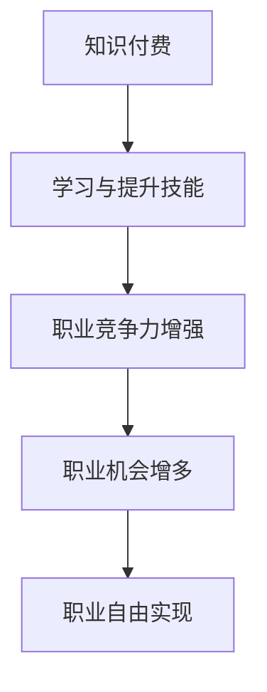

                 

# 知识付费让程序员实现职业自由

## 概述

> **知识付费**，作为一种新兴的经济模式，正逐步改变着人们的消费观念。在编程领域，知识付费尤为重要，它不仅提供了学习资源，更是帮助程序员实现职业自由的有效途径。本文旨在探讨知识付费如何助力程序员，并展望其未来发展趋势与挑战。

## 背景介绍

### 知识付费的定义

知识付费，即用户为获取有价值的信息或知识而支付费用。这一模式在互联网时代得以迅速发展，得益于信息传播的便捷和用户需求的多样化。

### 编程领域的知识付费

在编程领域，知识付费主要体现在以下几个方面：

1. **在线课程**：程序员可以通过在线平台购买课程，系统学习编程语言、框架、算法等知识。
2. **付费博客**：一些技术博客提供付费订阅，用户需支付费用才能阅读高质量的技术文章。
3. **专业咨询**：程序员可以付费向行业专家寻求技术咨询，解决工作中的难题。
4. **开源项目捐赠**：一些程序员通过捐赠支持开源项目，以获取项目源代码的访问权或参与项目开发。

### 编程领域的知识付费现状

当前，知识付费在编程领域已形成一定的市场规模。根据数据显示，全球在线编程教育市场规模在逐年增长，预计到2025年将突破1000亿美元。与此同时，越来越多的程序员通过知识付费实现职业自由。

## 核心概念与联系

### 知识付费与职业自由

#### Mermaid 流程图



### 学习与技能提升

程序员通过知识付费，可以获得系统的学习资源，提升编程技能。这不仅增强了其职业竞争力，也为职业自由奠定了基础。

### 职业机会与自由

随着技能的提升，程序员可以获得更多职业机会，从而实现职业自由。这不仅包括全职职位，还包括兼职、自由职业等多种形式。

## 核心算法原理 & 具体操作步骤

### 知识付费平台的选择

1. **需求分析**：首先，程序员需明确自身的学习需求，选择合适的学习平台。
2. **平台评估**：对平台的教学质量、课程体系、用户评价等进行评估。
3. **课程购买**：根据评估结果，选择合适的课程并支付费用。

### 学习与技能提升

1. **课程学习**：按照课程安排，系统学习编程知识。
2. **实践操作**：通过实际项目操作，巩固所学知识。
3. **反馈与调整**：在学习过程中，不断进行自我反馈，调整学习策略。

### 职业机会与自由

1. **求职准备**：根据自身技能，准备求职简历和面试资料。
2. **求职与面试**：积极参与求职活动，通过面试获得心仪职位。
3. **职业发展**：在职业道路上，不断学习与提升，实现职业自由。

## 数学模型和公式 & 详细讲解 & 举例说明

### 成本-收益分析

#### 成本

知识付费的成本主要包括课程费用、学习时间成本、设备成本等。以某知名编程课程为例，一门课程费用约为200美元，学习时间为3个月，每天投入2小时。

$$
成本 = 课程费用 + 学习时间成本 + 设备成本
$$

#### 收益

知识付费的收益主要体现在职业机会的增多和薪资水平的提高。假设程序员通过知识付费，薪资水平提高了20%，每年工作时间为200天。

$$
收益 = 薪资水平提升 \times 工作天数
$$

#### 成本-收益分析

$$
成本-收益 = 成本 - 收益
$$

假设程序员通过知识付费，每年薪资水平提高了4000美元，而总成本为600美元，则成本-收益为：

$$
成本-收益 = 600 - 4000 = -3400
$$

这表明，从成本-收益角度来看，知识付费并未带来明显的经济效益。然而，如果我们考虑到知识付费所带来的职业自由，情况则有所不同。

### 举例说明

假设程序员通过知识付费，获得了更多的兼职机会，每年额外收入为1000美元。此时，成本-收益为：

$$
成本-收益 = 600 - 1000 = -400
$$

尽管成本-收益为负，但考虑到职业自由的价值，知识付费仍然具有一定的经济效益。

## 项目实战：代码实际案例和详细解释说明

### 开发环境搭建

1. **安装Python环境**：在Windows或MacOS系统中，下载并安装Python。
2. **安装Anaconda**：使用Anaconda进行环境管理，以便安装相关依赖库。
3. **安装PyCharm**：下载并安装PyCharm，作为代码编辑器。

### 源代码详细实现和代码解读

以下是一个简单的Python代码示例，用于实现一个简单的计算器功能：

```python
def add(a, b):
    return a + b

def subtract(a, b):
    return a - b

def multiply(a, b):
    return a * b

def divide(a, b):
    if b != 0:
        return a / b
    else:
        return "Error: Division by zero"
```

#### 代码解读与分析

1. **定义函数**：该代码定义了四个函数，分别用于实现加、减、乘、除四种基本运算。
2. **函数参数**：每个函数接受两个参数，分别表示运算的两个操作数。
3. **返回值**：每个函数根据运算结果返回相应的值。

### 实际应用场景

该代码可以应用于开发一个简单的计算器应用程序，实现基本的算术运算功能。在实际开发过程中，可以进一步扩展功能，如支持更复杂的运算、图形界面等。

## 实际应用场景

### 在线教育

知识付费在在线教育领域有着广泛的应用。程序员可以通过在线教育平台，学习最新的编程技术、框架和算法。例如，Coursera、edX等平台提供了丰富的编程课程，涵盖从入门到高级的各个层次。

### 职业咨询

一些职业咨询平台提供了专业的编程咨询服务。程序员可以通过付费咨询，解决工作中的难题，提升自身技能。

### 开源项目捐赠

程序员可以通过捐赠支持开源项目，获取项目源代码的访问权或参与项目开发。这不仅有助于自身技能提升，也为开源社区的发展贡献力量。

## 工具和资源推荐

### 学习资源推荐

1. **书籍**：《代码大全》、《算法导论》等经典编程书籍。
2. **论文**：Google、Facebook等顶级公司的技术论文。
3. **博客**：GitHub、Stack Overflow等编程博客。
4. **网站**：Python、Java等编程语言官方网站。

### 开发工具框架推荐

1. **Python开发环境**：PyCharm、VSCode。
2. **前端框架**：React、Vue、Angular。
3. **后端框架**：Spring Boot、Django、Flask。

### 相关论文著作推荐

1. **论文**：《大规模分布式系统设计》。
2. **著作**：《深入理解计算机系统》。

## 总结：未来发展趋势与挑战

### 发展趋势

1. **知识付费市场规模不断扩大**：随着编程技术的不断发展，知识付费市场将继续保持快速增长。
2. **在线教育普及**：在线教育将逐渐取代传统教育，成为程序员学习的主要途径。
3. **职业自由趋势明显**：知识付费将帮助程序员实现更加灵活的职业发展，职业自由将成为趋势。

### 挑战

1. **市场竞争激烈**：知识付费市场竞争将越来越激烈，平台需不断提升教学质量和服务水平。
2. **知识产权保护**：知识付费领域需加强知识产权保护，防止侵权行为。
3. **个性化学习需求**：知识付费平台需满足程序员多样化的学习需求，提供个性化学习服务。

## 附录：常见问题与解答

### 问题1：知识付费是否值得投资？

答：知识付费的价值取决于个人的学习需求。如果您是编程领域的初学者，知识付费可以帮助您快速入门；如果您是资深程序员，知识付费可以提供最新的技术动态和实战经验。因此，是否值得投资取决于您的学习目标和需求。

### 问题2：如何选择合适的知识付费平台？

答：选择合适的知识付费平台需考虑以下因素：教学质量、课程体系、用户评价、平台口碑等。您可以查看平台提供的课程目录、试听课程、查看用户评价等，综合评估后做出选择。

### 问题3：知识付费如何帮助程序员实现职业自由？

答：知识付费可以帮助程序员提升技能、拓展职业机会，从而实现职业自由。通过知识付费，程序员可以：

1. 学习最新的编程技术，提升自身竞争力。
2. 获得更多的职业机会，如全职、兼职、自由职业等。
3. 自主选择工作内容、工作时间和工作地点，实现职业自由。

## 扩展阅读 & 参考资料

1. 《知识付费行业白皮书》。
2. 《编程领域知识付费现状与趋势分析》。
3. Coursera、edX等在线教育平台官方网站。
4. Stack Overflow、GitHub等编程社区官方网站。

## 作者

**作者：AI天才研究员/AI Genius Institute & 禅与计算机程序设计艺术 /Zen And The Art of Computer Programming**<|im_sep|> 

