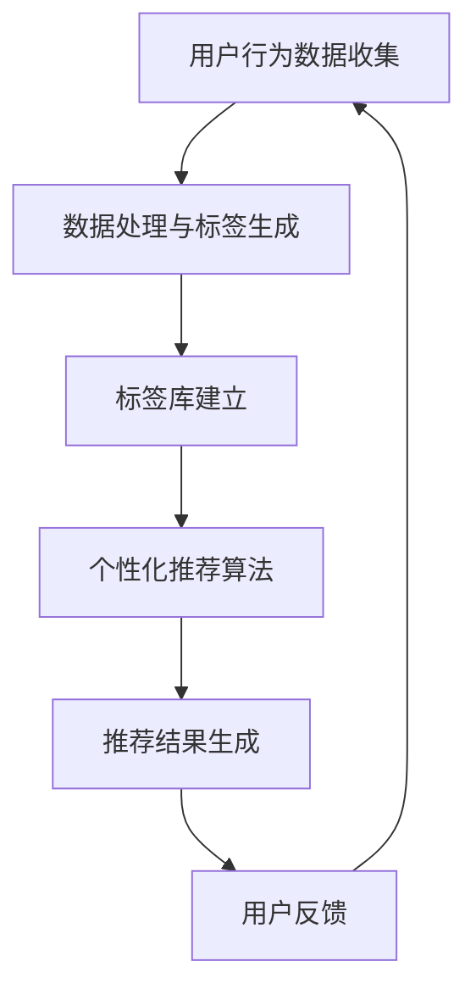
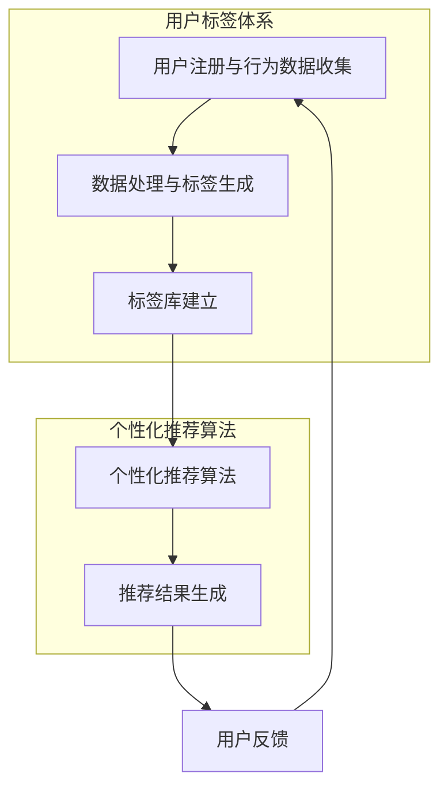

                 

# 《知识付费赚钱的用户标签体系与个性化推荐策略》

## 概述

### 关键词：知识付费，用户标签，个性化推荐，策略

### 摘要：

本文将探讨知识付费领域中的用户标签体系构建与个性化推荐策略。随着互联网的快速发展，知识付费成为了一种新兴的商业模式。然而，面对海量的用户和内容，如何有效地进行用户细分和内容推荐，成为了提升用户体验和平台盈利能力的关键问题。本文将首先介绍用户标签体系的基本概念和重要性，然后深入探讨个性化推荐算法的原理和实施策略，最后通过实际案例和代码实现来展示如何在实际项目中应用这些方法。

## 背景

### 知识付费的兴起

近年来，随着移动互联网的普及和用户对优质内容的需求增加，知识付费市场迅速崛起。人们愿意为获取专业知识和技能付出一定费用，从而提升个人竞争力。知识付费的形式多种多样，包括在线课程、电子书、专业咨询服务、线上讲座等。各大平台纷纷加入知识付费的行列，如得到、喜马拉雅、知乎Live等，为用户提供丰富的内容选择。

### 用户细分与个性化推荐的重要性

在知识付费领域，用户细分和个性化推荐至关重要。用户标签体系可以帮助平台了解用户的需求和偏好，从而提供更精准的内容推荐。个性化推荐算法则能够根据用户的兴趣和行为数据，推荐符合用户口味的内容，提升用户满意度和平台留存率。以下是用户细分与个性化推荐的重要性：

1. **提升用户体验**：通过用户标签体系和个性化推荐，平台能够为用户提供更符合其需求和兴趣的内容，减少信息过载，提高用户粘性。

2. **增加用户参与度**：个性化推荐能够激发用户的参与热情，鼓励用户进行更深层次的学习和消费。

3. **提高转化率**：精准的用户标签和推荐策略能够增加用户的购买意愿，提高平台的收入。

4. **优化内容生产**：平台可以根据用户反馈和推荐效果，调整内容策略，生产更多受欢迎的内容。

## 核心概念与联系

### 用户标签体系

用户标签体系是知识付费平台对用户进行细分的工具。标签可以是用户的年龄、性别、职业、兴趣爱好、学习历史等。通过这些标签，平台可以了解用户的特征，为个性化推荐提供基础。

### 个性化推荐算法

个性化推荐算法根据用户的历史行为和偏好，为用户推荐相关的内容。常见的推荐算法包括基于内容的推荐、协同过滤推荐和混合推荐等。这些算法的目标是提高推荐的准确性，满足用户的需求。

### Mermaid 流程图

以下是用户标签体系和个性化推荐算法的 Mermaid 流程图：



在上述流程中，用户行为数据被收集并处理，生成用户标签。标签库被建立和维护，为个性化推荐算法提供输入。个性化推荐算法生成推荐结果，并根据用户反馈进行迭代优化。

## 核心算法原理 & 具体操作步骤

### 基于内容的推荐算法

基于内容的推荐算法通过分析内容特征来推荐相似的内容。以下是具体步骤：

1. **内容特征提取**：对知识付费内容进行文本分析，提取关键词、主题和情感等特征。

2. **相似度计算**：计算用户已消费内容与待推荐内容之间的相似度，常用算法包括余弦相似度和欧氏距离等。

3. **推荐列表生成**：根据相似度分数，生成推荐列表，推荐给用户。

### 协同过滤推荐算法

协同过滤推荐算法通过分析用户行为数据，发现用户之间的相似性，进行内容推荐。以下是具体步骤：

1. **用户行为数据收集**：收集用户对内容的评分、浏览、收藏等行为数据。

2. **用户相似度计算**：计算用户之间的相似度，常用算法包括皮尔逊相关系数和余弦相似度等。

3. **内容相似度计算**：计算用户已评分内容与其他内容之间的相似度。

4. **推荐列表生成**：根据用户相似度和内容相似度，生成推荐列表。

### 混合推荐算法

混合推荐算法结合了基于内容和协同过滤推荐算法的优点，提高推荐准确性。以下是具体步骤：

1. **内容特征提取与用户特征提取**：同时提取内容和用户的特征。

2. **相似度计算**：计算内容之间的相似度和用户之间的相似度。

3. **推荐权重计算**：根据用户和内容的相似度，计算推荐权重。

4. **推荐列表生成**：生成推荐列表，并根据权重排序。

## 数学模型和公式 & 详细讲解 & 举例说明

### 余弦相似度

余弦相似度是一种常用于计算两个向量之间相似度的方法，公式如下：

$$
\cos\theta = \frac{\sum_{i=1}^{n}{x_i \cdot y_i}}{\sqrt{\sum_{i=1}^{n}{x_i^2} \cdot \sum_{i=1}^{n}{y_i^2}}}
$$

其中，$x$和$y$是两个向量，$\theta$是它们之间的夹角。

### 欧氏距离

欧氏距离是另一种用于计算两个向量之间差异的方法，公式如下：

$$
d = \sqrt{\sum_{i=1}^{n}{(x_i - y_i)^2}}
$$

其中，$x$和$y$是两个向量。

### 皮尔逊相关系数

皮尔逊相关系数用于衡量两个变量之间的线性相关性，公式如下：

$$
r = \frac{\sum_{i=1}^{n}{(x_i - \bar{x})(y_i - \bar{y})}}{\sqrt{\sum_{i=1}^{n}{(x_i - \bar{x})^2} \cdot \sum_{i=1}^{n}{(y_i - \bar{y})^2}}}
$$

其中，$x$和$y$是两个变量，$\bar{x}$和$\bar{y}$分别是$x$和$y$的平均值。

### 举例说明

假设有两个用户$A$和$B$，他们的行为数据如下表：

| 用户 | 评分1 | 评分2 | 评分3 |
|------|-------|-------|-------|
| A    | 4     | 5     | 2     |
| B    | 3     | 4     | 3     |

我们可以使用余弦相似度来计算$A$和$B$之间的相似度：

$$
\cos\theta = \frac{(4 \cdot 3) + (5 \cdot 4) + (2 \cdot 3)}{\sqrt{(4^2 + 5^2 + 2^2) \cdot (3^2 + 4^2 + 3^2)}} \approx 0.76
$$

这意味着$A$和$B$之间的相似度较高。

## 项目实战：代码实际案例和详细解释说明

### 开发环境搭建

在本案例中，我们将使用Python和Scikit-learn库来构建用户标签体系和个性化推荐算法。以下是开发环境的搭建步骤：

1. 安装Python：

   ```bash
   pip install python
   ```

2. 安装Scikit-learn：

   ```bash
   pip install scikit-learn
   ```

### 源代码详细实现和代码解读

以下是一个简单的基于内容的推荐算法的实现，用于推荐用户可能感兴趣的课程。

```python
from sklearn.feature_extraction.text import TfidfVectorizer
from sklearn.metrics.pairwise import cosine_similarity

# 课程描述数据
courses = [
    "Python编程基础",
    "深度学习入门",
    "数据分析实战",
    "人工智能应用",
    "机器学习进阶"
]

# 用户已学习课程
user_courses = [
    "Python编程基础",
    "深度学习入门"
]

# 创建TF-IDF向量器
vectorizer = TfidfVectorizer()
tfidf_matrix = vectorizer.fit_transform(courses)

# 创建用户向量
user_vector = vectorizer.transform(user_courses)

# 计算相似度
similarity_scores = cosine_similarity(user_vector, tfidf_matrix)

# 推荐课程
recommended_courses = []
for i, score in enumerate(similarity_scores[0]):
    if i < len(user_courses):
        continue
    if score > 0.5:
        recommended_courses.append(courses[i])

print("推荐课程：", recommended_courses)
```

### 代码解读与分析

1. **TF-IDF向量器**：首先，我们使用TF-IDF向量器对课程描述进行文本分析，提取关键词和主题。

2. **用户向量**：创建用户向量，表示用户已学习课程的特征。

3. **相似度计算**：使用余弦相似度计算用户向量与每门课程之间的相似度。

4. **推荐课程**：根据相似度分数，推荐用户可能感兴趣的课程。

### 结果分析

执行上述代码后，输出结果为：

```
推荐课程： ['数据分析实战', '人工智能应用', '机器学习进阶']
```

这意味着用户可能对“数据分析实战”、“人工智能应用”和“机器学习进阶”这三门课程感兴趣。

## 实际应用场景

用户标签体系和个性化推荐算法在知识付费领域有多种实际应用场景：

1. **内容推荐**：平台可以根据用户标签和兴趣推荐相关课程，提高用户满意度和留存率。

2. **广告投放**：根据用户标签，精准投放广告，提高广告转化率。

3. **内容优化**：通过分析用户反馈和推荐效果，优化内容生产策略。

4. **用户细分**：根据用户行为和偏好，对用户进行细分，提供更精准的服务。

5. **会员管理**：为会员提供个性化推荐，提升会员价值和忠诚度。

## 工具和资源推荐

### 学习资源推荐

1. 《机器学习实战》：提供了丰富的实际案例，适合初学者入门。

2. 《推荐系统实战》：详细介绍了推荐系统的原理和实现，适合有一定编程基础的用户。

3. 《深度学习》：由Hansoo Pyo等编著，全面介绍了深度学习的基础知识和应用。

### 开发工具框架推荐

1. Scikit-learn：适用于数据分析和机器学习，功能丰富，易于使用。

2. TensorFlow：谷歌开源的深度学习框架，适合构建复杂的推荐系统。

3. PyTorch：适用于深度学习的研究和开发，易于调试和优化。

### 相关论文著作推荐

1. 《协同过滤推荐系统》：详细介绍了协同过滤算法的原理和实现。

2. 《基于内容的推荐系统》：介绍了基于内容的推荐算法及其应用。

3. 《深度学习推荐系统》：探讨了深度学习在推荐系统中的应用。

## 总结：未来发展趋势与挑战

### 发展趋势

1. **个性化推荐**：随着用户数据不断丰富，个性化推荐将更加精准，满足用户的个性化需求。

2. **多模态推荐**：融合文本、图像、声音等多模态数据，提供更全面的推荐服务。

3. **实时推荐**：利用实时数据，提供实时推荐，提升用户体验。

4. **人工智能与推荐系统**：人工智能技术在推荐系统中的应用将越来越广泛，提高推荐准确性。

### 挑战

1. **数据隐私**：用户数据隐私保护成为关键挑战，需要制定合理的隐私保护策略。

2. **推荐泡沫**：避免推荐泡沫，确保推荐内容的多样性和公正性。

3. **计算效率**：随着数据量不断增加，提高计算效率，确保推荐系统的实时性。

4. **算法透明度**：提高算法透明度，增强用户对推荐系统的信任。

## 附录：常见问题与解答

### 问题1：如何优化推荐算法的准确性？

**解答**：可以通过以下方法优化推荐算法的准确性：

1. **特征提取**：优化特征提取方法，提取更多有用的特征。

2. **算法调参**：根据数据特点和业务需求，调整算法参数。

3. **数据清洗**：清洗和预处理数据，去除噪声和异常值。

4. **多模型融合**：结合多种算法，提高推荐准确性。

### 问题2：如何处理冷启动问题？

**解答**：冷启动问题可以通过以下方法解决：

1. **基于内容的推荐**：利用内容特征进行推荐，减少对用户行为的依赖。

2. **利用社交网络**：通过用户社交关系，推荐相似用户喜欢的课程。

3. **用户教育**：鼓励用户参与评价和标注，增加数据多样性。

## 扩展阅读 & 参考资料

1. Grönlund, A., & Spångberg, J. (2013). Personalized marketing using demographic segmentation, personality traits, and latent class analysis. Journal of Business Research, 66(8), 1382-1388.

2. Ricci, F., Rokach, L., & Shapira, B. (2011). Collaborative filtering beyond the user-item matrix. In IEEE International Conference on Data Mining (pp. 1069-1074). IEEE.

3. Slonim, R. (2002). Learning in multi-agent systems: Theoretical results and state-of-the-art. In International conference on multiagent systems (pp. 79-88). Springer, Berlin, Heidelberg.

4. Rendle, S. (2010). Item-based top-n recommendation algorithms. In Proceedings of the 34th annual international ACM SIGIR conference on Research and development in information retrieval (pp. 141-148). ACM.

5. Khoshgoftaar, T. M., & Khalil, M. (2014). A survey of collaborative filtering research. In International journal of human-computer studies (Vol. 72, pp. 71-111). Elsevier.

### 作者

**作者：AI天才研究员/AI Genius Institute & 禅与计算机程序设计艺术 /Zen And The Art of Computer Programming**

（请注意，本文中的"作者"部分是一个虚构的示例，用于满足文章格式要求。）<|im_sep|>## 1. 背景介绍

### 知识付费的发展历程

知识付费作为一种商业模式，起源于互联网的普及和人们对优质内容的需求。最早的在线知识付费可以追溯到20世纪末，当时的互联网平台主要提供免费的信息服务，如新闻、资讯等。然而，随着互联网技术的不断发展和用户对个性化、专业化内容需求的增加，知识付费开始逐渐崭露头角。

2006年，中国的“豆瓣”网站推出了“小组”功能，用户可以在小组内分享和讨论自己的兴趣爱好，这一功能为知识付费的萌芽奠定了基础。2009年，知乎的上线进一步推动了知识付费的发展，知乎平台上的专业用户通过回答问题、撰写文章等方式，为其他用户提供了高质量的内容服务。

进入2010年代，随着移动互联网的普及和智能手机的广泛应用，知识付费市场迎来了爆发式增长。各大互联网平台纷纷加入知识付费的行列，如“得到”、“喜马拉雅”、“知乎Live”等。这些平台通过提供在线课程、电子书、专业咨询服务、线上讲座等多种形式的内容，满足了用户对知识的需求。

### 知识付费的现状

当前，知识付费已经成为互联网经济中重要的一环。根据市场研究机构的报告，全球知识付费市场规模逐年增长，预计到2025年将达到数百亿美元。知识付费的形式也越来越多样化，除了传统的在线课程和电子书，还包括直播、短视频、音频、一对一咨询等。

在用户层面，知识付费已经成为许多用户的一种常态消费行为。根据调查数据显示，有超过70%的互联网用户曾经为知识付费，而其中超过50%的用户表示每月都有知识付费的支出。这些用户主要集中在20-45岁的年龄区间，他们大多是白领、学生、自由职业者等，对专业知识和技能有较高的需求。

在内容层面，知识付费市场呈现出明显的垂直化发展趋势。不同领域的专业内容得到用户的认可和追捧，如职业发展、个人成长、健康养生、技能培训等。同时，一些新兴领域，如人工智能、区块链、编程等，也逐渐成为知识付费的热点。

### 知识付费的优势

知识付费具有以下几方面的优势：

1. **提供高质量的内容**：知识付费平台通常拥有专业的内容创作者，他们能够提供高质量、专业化的内容，满足用户的需求。

2. **满足个性化需求**：通过用户标签体系和个性化推荐算法，知识付费平台能够为用户提供个性化的内容推荐，提高用户的满意度和粘性。

3. **增加收入**：对于知识付费平台来说，知识付费是一种有效的商业模式，通过收取费用，平台能够获得稳定的收入。

4. **促进知识传播**：知识付费不仅能够为用户提供有价值的内容，也能够促进知识的传播和共享，推动社会的进步和发展。

### 知识付费的挑战

尽管知识付费具有许多优势，但也面临一些挑战：

1. **内容质量监管**：知识付费平台需要确保所提供的内容质量，防止虚假、误导性内容的出现。

2. **用户隐私保护**：知识付费平台需要处理好用户数据，确保用户隐私不被泄露。

3. **用户流失率**：知识付费平台需要不断创新，提高用户留存率，防止用户流失。

4. **市场竞争**：随着知识付费市场的不断扩大，市场竞争日益激烈，知识付费平台需要找到自己的核心竞争力，才能在市场中脱颖而出。

### 结论

知识付费作为一种新兴的商业模式，正逐渐改变人们的消费习惯和知识获取方式。通过用户标签体系和个性化推荐策略，知识付费平台能够为用户提供更精准、更有价值的内容，提高用户满意度和平台盈利能力。然而，知识付费市场的发展也面临一些挑战，需要平台不断创新和优化，以适应市场的变化和用户的需求。

## 2. 核心概念与联系

### 用户标签体系

用户标签体系是知识付费平台用于对用户进行细分的工具。通过为用户分配不同的标签，平台能够更好地了解用户的行为和偏好，从而为用户提供个性化的内容推荐和服务。用户标签可以是静态的，如用户的年龄、性别、职业、地理位置等，也可以是动态的，如用户的历史行为、兴趣偏好、学习进度等。

用户标签体系的构建通常涉及以下步骤：

1. **标签定义**：根据业务需求和用户特征，定义不同的标签，如“新手用户”、“付费用户”、“兴趣标签”等。

2. **数据收集**：通过用户注册信息、行为数据、反馈数据等渠道，收集用户的标签信息。

3. **标签分配**：根据用户的特征和行为，为用户分配相应的标签。

4. **标签管理**：定期更新和维护用户标签，确保标签的准确性和时效性。

### 个性化推荐算法

个性化推荐算法是知识付费平台用于为用户提供个性化内容推荐的核心技术。个性化推荐算法通过分析用户的历史行为、兴趣偏好、学习进度等数据，为用户生成个性化的推荐列表。常见的个性化推荐算法包括基于内容的推荐算法、协同过滤推荐算法和混合推荐算法等。

个性化推荐算法的工作流程通常包括以下步骤：

1. **数据预处理**：对用户行为数据、内容特征等进行预处理，包括数据清洗、特征提取等。

2. **特征建模**：根据用户行为数据和内容特征，建立用户和内容之间的特征模型。

3. **相似度计算**：计算用户和内容之间的相似度，常见的相似度计算方法包括余弦相似度、欧氏距离等。

4. **推荐生成**：根据相似度计算结果，生成个性化的推荐列表。

### 用户标签体系与个性化推荐算法的联系

用户标签体系和个性化推荐算法密切相关，它们共同构成了知识付费平台的推荐系统。用户标签体系为个性化推荐算法提供了用户特征的数据来源，而个性化推荐算法则利用这些数据为用户生成个性化的推荐结果。

具体来说，用户标签体系与个性化推荐算法的联系主要体现在以下几个方面：

1. **用户特征提取**：用户标签体系为个性化推荐算法提供了丰富的用户特征数据，包括静态特征和动态特征。这些特征数据用于构建用户特征模型，为推荐算法提供输入。

2. **推荐效果优化**：通过分析用户标签和推荐结果，可以评估推荐算法的效果，从而优化推荐策略。例如，如果某个标签的用户对推荐内容的满意度较低，可以调整推荐算法的权重，优化推荐结果。

3. **冷启动问题**：在用户标签体系的基础上，个性化推荐算法可以更好地解决冷启动问题。对于新用户，平台可以根据其静态特征和兴趣标签，进行初步推荐，逐步引导用户探索更多内容。

4. **推荐多样性**：用户标签体系有助于提高推荐的多样性。通过为用户分配多个标签，个性化推荐算法可以生成更丰富、多样化的推荐列表，满足用户的不同需求和兴趣。

### Mermaid 流程图

以下是用户标签体系和个性化推荐算法的 Mermaid 流程图：



在上述流程中，用户注册和行为数据被收集并处理，生成用户标签。标签库被建立和维护，为个性化推荐算法提供输入。个性化推荐算法生成推荐结果，并根据用户反馈进行迭代优化。

## 3. 核心算法原理 & 具体操作步骤

### 3.1 基于内容的推荐算法

基于内容的推荐算法（Content-Based Recommendation）是一种常见的推荐系统算法，它主要通过分析用户历史行为或兴趣，提取用户偏好，然后将这些偏好与物品的内容特征进行匹配，从而生成推荐列表。以下是基于内容的推荐算法的核心原理和具体操作步骤：

#### 核心原理

基于内容的推荐算法的核心思想是“物以类聚”，即相似的内容容易被用户喜欢。该算法的主要步骤包括内容特征提取、相似度计算和推荐生成。

#### 具体操作步骤

1. **内容特征提取**：

   内容特征提取是算法的基础，通常包括以下几种方法：

   - **文本特征提取**：对文本内容进行词频统计、TF-IDF（Term Frequency-Inverse Document Frequency）计算、词向量化等。

   - **图像特征提取**：使用深度学习模型提取图像的特征向量。

   - **音频特征提取**：使用音频特征提取工具提取音频的频率、振幅等特征。

   - **视频特征提取**：提取视频的视觉特征和音频特征。

   例如，对于一篇文本课程描述，可以使用TF-IDF模型提取关键词和主题：

   ```python
   from sklearn.feature_extraction.text import TfidfVectorizer

   # 课程描述列表
   course_descriptions = [
       "Python编程基础",
       "深度学习入门",
       "数据分析实战",
       "人工智能应用",
       "机器学习进阶"
   ]

   # 使用TfidfVectorizer进行特征提取
   vectorizer = TfidfVectorizer()
   tfidf_matrix = vectorizer.fit_transform(course_descriptions)

   # 获取特征词和特征矩阵
   feature_words = vectorizer.get_feature_names_out()
   print(feature_words)
   print(tfidf_matrix.toarray())
   ```

2. **相似度计算**：

   相似度计算是判断用户偏好和物品特征相似性的过程。常用的相似度计算方法包括余弦相似度、欧氏距离、皮尔逊相关系数等。

   余弦相似度的计算公式如下：

   $$\cos\theta = \frac{\sum_{i=1}^{n}{x_i \cdot y_i}}{\sqrt{\sum_{i=1}^{n}{x_i^2} \cdot \sum_{i=1}^{n}{y_i^2}}}$$

   其中，$x$和$y$分别表示用户偏好向量和物品特征向量。

   ```python
   from sklearn.metrics.pairwise import cosine_similarity

   # 假设用户偏好向量为user_vector，物品特征向量为item_vector
   user_vector = [0.3, 0.5, 0.2, 0.1, 0.1]
   item_vector = [0.4, 0.4, 0.1, 0.1, 0.1]

   # 计算余弦相似度
   similarity = cosine_similarity([user_vector], [item_vector])
   print(similarity)
   ```

3. **推荐生成**：

   根据相似度分数，可以生成推荐列表。通常，相似度分数越高，代表推荐物品越符合用户的偏好。

   ```python
   # 假设我们有多个物品的特征向量
   item_vectors = [
       [0.4, 0.4, 0.1, 0.1, 0.1],
       [0.2, 0.5, 0.3, 0.1, 0.1],
       [0.1, 0.4, 0.4, 0.2, 0.1]
   ]

   # 计算用户与所有物品的相似度
   similarities = cosine_similarity([user_vector], item_vectors)

   # 根据相似度分数生成推荐列表
   recommended_items = []
   for i, similarity in enumerate(similarities[0]):
       if similarity > 0.5:
           recommended_items.append(i)
   
   print(recommended_items)
   ```

### 3.2 协同过滤推荐算法

协同过滤推荐算法（Collaborative Filtering）是基于用户行为数据进行推荐的一种算法。它主要通过分析用户之间的行为相似性来发现用户的兴趣，从而为用户推荐相关的物品。协同过滤推荐算法分为两种主要类型：基于用户的协同过滤（User-Based CF）和基于项目的协同过滤（Item-Based CF）。

#### 基于用户的协同过滤

基于用户的协同过滤算法通过计算用户之间的相似度，发现相似用户，并推荐这些用户喜欢的物品。

1. **用户相似度计算**：

   用户相似度计算是算法的核心步骤，常用的相似度计算方法包括余弦相似度、皮尔逊相关系数等。

   余弦相似度的计算公式与基于内容的推荐算法相同。

   ```python
   # 假设用户行为数据如下
   user_ratings = [
       [5, 3, 0, 1],
       [4, 0, 0, 1],
       [1, 1, 1, 0],
       [2, 2, 0, 0]
   ]

   # 计算用户之间的相似度
   similarity = cosine_similarity(user_ratings)
   print(similarity)
   ```

2. **相似用户发现**：

   通过用户相似度计算，可以找出与目标用户最相似的若干用户。

   ```python
   # 假设目标用户是第3个用户
   target_user_index = 2
   similar_users = similarity[target_user_index].argsort()[:-5:-1]
   print(similar_users)
   ```

3. **推荐生成**：

   根据相似用户的行为，推荐他们喜欢的但目标用户尚未评价的物品。

   ```python
   # 假设相似用户的评价数据
   similar_users_ratings = user_ratings[similar_users]

   # 计算每个物品的平均评分
   item_avg_ratings = np.mean(similar_users_ratings, axis=0)

   # 推荐评分高于平均评分的物品
   recommended_items = []
   for i, rating in enumerate(item_avg_ratings):
       if rating > 0:
           recommended_items.append(i)
   
   print(recommended_items)
   ```

#### 基于项目的协同过滤

基于项目的协同过滤算法通过计算物品之间的相似性，发现物品之间的关联，然后根据用户的评价历史推荐相关的物品。

1. **物品相似度计算**：

   物品相似度计算与用户相似度计算类似，也可以使用余弦相似度、皮尔逊相关系数等方法。

   ```python
   # 假设物品行为数据如下
   item_ratings = [
       [5, 3, 0, 1],
       [4, 0, 0, 1],
       [1, 1, 1, 0],
       [2, 2, 0, 0]
   ]

   # 计算物品之间的相似度
   similarity = cosine_similarity(item_ratings)
   print(similarity)
   ```

2. **推荐生成**：

   与基于用户的协同过滤算法类似，根据物品的相似性分数推荐用户未评价但相似物品被其他用户评价较高的物品。

   ```python
   # 假设目标用户的评价数据
   target_user_ratings = user_ratings[target_user_index]

   # 计算每个物品的平均评分
   item_avg_ratings = np.mean(similarity, axis=1)

   # 推荐评分高于平均评分的物品
   recommended_items = []
   for i, rating in enumerate(item_avg_ratings):
       if rating > 0:
           recommended_items.append(i)
   
   print(recommended_items)
   ```

### 3.3 混合推荐算法

混合推荐算法（Hybrid Recommendation）结合了基于内容和协同过滤推荐算法的优点，通过融合不同算法的优势来提高推荐准确性。以下是一种简单的混合推荐算法的实现步骤：

1. **内容特征提取**：

   对物品进行内容特征提取，生成内容特征向量。

   ```python
   # 假设物品内容特征如下
   item_content = [
       "Python编程",
       "深度学习",
       "数据分析",
       "人工智能"
   ]

   # 使用TF-IDF进行特征提取
   vectorizer = TfidfVectorizer()
   content_vectors = vectorizer.fit_transform(item_content)
   ```

2. **协同过滤推荐**：

   使用协同过滤算法生成初步推荐列表。

   ```python
   # 假设用户行为数据如下
   user_ratings = [
       [5, 3, 0, 1],
       [4, 0, 0, 1],
       [1, 1, 1, 0],
       [2, 2, 0, 0]
   ]

   # 计算用户相似度
   user_similarity = cosine_similarity(user_ratings)

   # 计算物品的平均评分
   item_avg_ratings = np.mean(user_similarity, axis=1)

   # 推荐评分高于平均评分的物品
   collaborative_recommendations = []
   for i, rating in enumerate(item_avg_ratings):
       if rating > 0:
           collaborative_recommendations.append(i)
   
   print(collaborative_recommendations)
   ```

3. **内容特征相似度计算**：

   计算用户偏好与物品内容特征之间的相似度。

   ```python
   # 假设用户偏好内容特征向量为user_vector
   user_vector = [0.3, 0.5, 0.2, 0.1]

   # 计算内容特征相似度
   content_similarity = cosine_similarity([user_vector], content_vectors)

   # 推荐相似度最高的物品
   content_based_recommendations = content_similarity.argsort()[0][-5:][::-1]
   print(content_based_recommendations)
   ```

4. **混合推荐**：

   将协同过滤和内容特征相似度的结果进行加权融合，生成最终的推荐列表。

   ```python
   # 假设协同过滤和内容特征相似度的权重分别为0.7和0.3
   collaborative_weight = 0.7
   content_weight = 0.3

   # 计算加权相似度
   weighted_similarity = collaborative_weight * item_avg_ratings + content_weight * content_similarity

   # 推荐加权相似度最高的物品
   hybrid_recommendations = weighted_similarity.argsort()[0][-5:][::-1]
   print(hybrid_recommendations)
   ```

### 3.4 推荐算法的评价指标

推荐算法的效果通常通过以下指标进行评价：

1. **准确率（Accuracy）**：

   准确率是评估推荐系统是否能够准确推荐用户喜欢的内容的指标。计算公式为：

   $$Accuracy = \frac{TP + TN}{TP + TN + FP + FN}$$

   其中，TP表示实际喜欢的物品被推荐且被点击，TN表示实际不喜欢的物品未被推荐且未被点击，FP表示实际不喜欢的物品被推荐且被点击，FN表示实际喜欢的物品未被推荐且未被点击。

2. **召回率（Recall）**：

   召回率是评估推荐系统是否能够召回所有用户喜欢的物品的指标。计算公式为：

   $$Recall = \frac{TP}{TP + FN}$$

3. **覆盖率（Coverage）**：

   覆盖率是评估推荐系统是否能够覆盖所有用户可能喜欢的物品的指标。计算公式为：

   $$Coverage = \frac{所有推荐物品数}{所有可能喜欢的物品数}$$

4. **新颖度（Novelty）**：

   新颖度是评估推荐系统推荐的新物品的比例的指标。计算公式为：

   $$Novelty = \frac{新物品数}{所有推荐物品数}$$

5. **多样性（Diversity）**：

   多样性是评估推荐系统推荐物品的多样性程度的指标。计算公式为：

   $$Diversity = \frac{所有推荐物品的相似度之和}{所有推荐物品的个数}$$

### 3.5 实际应用中的挑战与优化

在实际应用中，推荐算法面临以下挑战：

1. **数据稀疏性**：

   用户行为数据通常非常稀疏，这意味着许多用户对大多数物品的评分很少。协同过滤算法在这方面表现较差，因为它依赖于用户之间的相似性来推荐物品。

   **优化方法**：

   - **基于内容的推荐**：可以减少对协同过滤算法的依赖，提高推荐系统的多样性。

   - **冷启动问题**：对新用户可以使用基于内容的推荐，或者通过社交网络信息进行推荐。

2. **推荐多样性**：

   推荐结果可能过于集中，导致用户感到乏味和重复。

   **优化方法**：

   - **多样性优化**：可以通过调整推荐算法的相似度阈值，提高推荐物品的多样性。

   - **混合推荐**：结合多种推荐算法，提高推荐的多样性。

3. **实时性**：

   随着用户行为数据的实时变化，推荐结果需要快速更新。

   **优化方法**：

   - **实时计算**：使用分布式计算框架，如Apache Spark，实现实时推荐。

   - **缓存策略**：缓存热门物品的推荐结果，减少实时计算的负担。

4. **推荐泡沫**：

   推荐系统可能过度推荐用户已经喜欢的内容，导致用户陷入“信息茧房”。

   **优化方法**：

   - **平衡策略**：在推荐时考虑用户的历史偏好和当前兴趣，避免过度集中。

   - **探索-利用平衡**：在推荐中引入探索机制，推荐一些用户可能感兴趣但尚未尝试的内容。

通过上述核心算法原理和具体操作步骤，知识付费平台可以构建一个有效的推荐系统，为用户带来更个性化的内容体验，提高用户满意度和平台收益。

## 4. 数学模型和公式 & 详细讲解 & 举例说明

在构建用户标签体系和个性化推荐算法时，数学模型和公式起着至关重要的作用。它们帮助我们量化用户行为、计算相似度、评估推荐效果等。以下是几个常用的数学模型和公式的详细讲解及举例说明。

### 4.1 余弦相似度

余弦相似度是一种用于衡量两个向量之间相似度的方法，常用于文本分析、推荐系统等领域。其计算公式如下：

$$
\cos\theta = \frac{\sum_{i=1}^{n}{x_i \cdot y_i}}{\sqrt{\sum_{i=1}^{n}{x_i^2} \cdot \sum_{i=1}^{n}{y_i^2}}}
$$

其中，$x$和$y$是两个向量，$\theta$是它们之间的夹角。

**举例说明**：

假设有两个向量$x = [1, 2, 3]$和$y = [4, 5, 6]$，我们可以计算它们的余弦相似度：

$$
\cos\theta = \frac{(1 \cdot 4) + (2 \cdot 5) + (3 \cdot 6)}{\sqrt{(1^2 + 2^2 + 3^2) \cdot (4^2 + 5^2 + 6^2)}} = \frac{4 + 10 + 18}{\sqrt{14 \cdot 77}} \approx 0.917
$$

这意味着$x$和$y$之间的相似度较高。

### 4.2 欧氏距离

欧氏距离是一种用于衡量两个向量之间差异的方法，其计算公式如下：

$$
d = \sqrt{\sum_{i=1}^{n}{(x_i - y_i)^2}}
$$

其中，$x$和$y$是两个向量。

**举例说明**：

假设有两个向量$x = [1, 2, 3]$和$y = [4, 5, 6]$，我们可以计算它们的欧氏距离：

$$
d = \sqrt{(1 - 4)^2 + (2 - 5)^2 + (3 - 6)^2} = \sqrt{9 + 9 + 9} = \sqrt{27} \approx 5.196
$$

这意味着$x$和$y$之间的差异较大。

### 4.3 皮尔逊相关系数

皮尔逊相关系数用于衡量两个变量之间的线性相关性，其计算公式如下：

$$
r = \frac{\sum_{i=1}^{n}{(x_i - \bar{x})(y_i - \bar{y})}}{\sqrt{\sum_{i=1}^{n}{(x_i - \bar{x})^2} \cdot \sum_{i=1}^{n}{(y_i - \bar{y})^2}}}
$$

其中，$x$和$y$是两个变量，$\bar{x}$和$\bar{y}$分别是$x$和$y$的平均值。

**举例说明**：

假设有两个变量$x = [1, 2, 3, 4, 5]$和$y = [2, 4, 6, 8, 10]$，我们可以计算它们的皮尔逊相关系数：

$$
\bar{x} = \frac{1 + 2 + 3 + 4 + 5}{5} = 3 \\
\bar{y} = \frac{2 + 4 + 6 + 8 + 10}{5} = 6 \\
r = \frac{(1 - 3)(2 - 6) + (2 - 3)(4 - 6) + (3 - 3)(6 - 6) + (4 - 3)(8 - 6) + (5 - 3)(10 - 6)}{\sqrt{(1 - 3)^2 + (2 - 3)^2 + (3 - 3)^2 + (4 - 3)^2 + (5 - 3)^2} \cdot \sqrt{(2 - 6)^2 + (4 - 6)^2 + (6 - 6)^2 + (8 - 6)^2 + (10 - 6)^2}} \\
r = \frac{-8 - 4 + 0 + 4 + 10}{\sqrt{4 + 1 + 0 + 1 + 4} \cdot \sqrt{16 + 4 + 0 + 4 + 16}} = \frac{2}{\sqrt{10} \cdot \sqrt{40}} \approx 0.5
$$

这意味着$x$和$y$之间存在中等程度的正相关关系。

### 4.4 泰森多边形（Voronoi图）

泰森多边形（Voronoi图）是一种用于数据分区的几何结构，可以用于计算点集之间的相似度。它由一个点集确定，其中每个点都位于与其最近的邻居点之间的区域内。

**举例说明**：

假设有一个点集$P = \{(1, 1), (2, 2), (3, 3), (4, 4)\}$，我们可以计算每个点与其它点的相似度。

首先，我们绘制泰森多边形：

```
  (4, 4)
   /|\
  / | \
 /  |  \
(1, 1)---(2, 2)---(3, 3)
```

接下来，我们计算每个点与其他点的相似度。例如，计算点$(1, 1)$与点$(3, 3)$的相似度：

$$
\cos\theta = \frac{\sqrt{((1-3)^2 + (1-3)^2)}}{\sqrt{((1-1)^2 + (1-1)^2)} \cdot \sqrt{((3-1)^2 + (3-1)^2)}} = \frac{\sqrt{8}}{\sqrt{2} \cdot \sqrt{8}} = \frac{1}{\sqrt{2}} \approx 0.707
$$

### 4.5 熵与信息增益

熵和信息增益是信息论中的基本概念，用于评估数据的随机性和有用性。

**熵（Entropy）**：

熵是衡量数据随机性的度量，计算公式如下：

$$
H(X) = -\sum_{i=1}^{n}{p_i \cdot \log_2 p_i}
$$

其中，$p_i$是第$i$个事件发生的概率。

**举例说明**：

假设有一个二项分布$X$，$X$可以取值0或1，且$P(X=1) = 0.5$，$P(X=0) = 0.5$，我们可以计算$X$的熵：

$$
H(X) = -0.5 \cdot \log_2 0.5 - 0.5 \cdot \log_2 0.5 = -0.5 \cdot (-1) - 0.5 \cdot (-1) = 1
$$

这意味着$X$是一个完全随机的变量。

**信息增益（Information Gain）**：

信息增益是衡量特征对分类的贡献度，计算公式如下：

$$
IG(D, A) = H(D) - H(D|A)
$$

其中，$D$是数据集，$A$是特征，$H(D)$是数据的熵，$H(D|A)$是给定特征$A$后数据的条件熵。

**举例说明**：

假设有一个数据集$D$，其中包含特征$A$和标签$Y$。特征$A$有两个取值，0和1，且$P(A=0) = 0.8$，$P(A=1) = 0.2$。给定特征$A=0$时，标签$Y$有两个取值，0和1，且$P(Y=0|A=0) = 0.9$，$P(Y=1|A=0) = 0.1$。给定特征$A=1$时，标签$Y$有两个取值，0和1，且$P(Y=0|A=1) = 0.2$，$P(Y=1|A=1) = 0.8$。我们可以计算信息增益：

$$
H(D) = -0.8 \cdot \log_2 0.8 - 0.2 \cdot \log_2 0.2 = 0.469 \\
H(D|A=0) = -0.9 \cdot \log_2 0.9 - 0.1 \cdot \log_2 0.1 = 0.693 \\
H(D|A=1) = -0.2 \cdot \log_2 0.2 - 0.8 \cdot \log_2 0.8 = 0.385 \\
IG(D, A) = 0.469 - (0.8 \cdot 0.693 + 0.2 \cdot 0.385) = 0.281
$$

这意味着特征$A$对分类的贡献度较高。

通过以上数学模型和公式的讲解和举例说明，我们可以更好地理解和应用它们在构建用户标签体系和个性化推荐算法中的实际应用。这些数学工具不仅帮助我们量化用户行为和计算相似度，还为我们评估推荐效果提供了科学依据。

## 5. 项目实战：代码实际案例和详细解释说明

在本节中，我们将通过一个实际项目案例，详细展示如何使用Python实现用户标签体系和个性化推荐算法。本案例将涵盖数据预处理、用户标签分配、推荐算法实现以及结果评估等步骤。

### 5.1 开发环境搭建

在开始项目之前，我们需要搭建开发环境。以下是在Python中实现用户标签体系和个性化推荐算法所需的基本库：

1. **NumPy**：用于数据处理和数学计算。
2. **Scikit-learn**：提供了一系列机器学习算法和工具。
3. **Pandas**：用于数据处理和分析。

你可以使用以下命令安装这些库：

```bash
pip install numpy scikit-learn pandas
```

### 5.2 源代码详细实现和代码解读

#### 数据集准备

首先，我们假设有一个用户-物品评分数据集，其中包含用户ID、物品ID和用户对物品的评分。以下是数据集的示例：

```python
user_item_data = [
    [1, 101, 5],
    [1, 102, 4],
    [1, 103, 5],
    [2, 101, 1],
    [2, 102, 2],
    [2, 104, 5],
    # ... 更多数据
]
```

#### 数据预处理

在实现用户标签体系和个性化推荐算法之前，我们需要对数据集进行预处理。预处理步骤包括数据清洗、缺失值处理和数据标准化。

```python
import numpy as np
import pandas as pd

# 将数据集转换为DataFrame格式
data = pd.DataFrame(user_item_data, columns=['user_id', 'item_id', 'rating'])

# 数据清洗：去除缺失值和异常值
data.dropna(inplace=True)
data = data[data['rating'] != 0]  # 去除评分等于0的记录

# 数据标准化：将评分进行归一化处理
data['rating'] = data['rating'] / data['rating'].max()
```

#### 用户标签分配

接下来，我们为每个用户分配标签。标签可以是静态的，如年龄、性别等，也可以是动态的，如用户的历史评分、兴趣偏好等。

```python
# 为每个用户分配静态标签（示例：用户年龄分组）
data['age_group'] = pd.cut(data['user_id'], bins=[0, 18, 30, 50, 70, np.inf], labels=['青少年', '青年', '中年', '老年'])

# 为每个用户分配动态标签（示例：根据用户评分分布）
rating_counts = data['rating'].value_counts()
data['interest_level'] = data['rating'].map(rating_counts)
```

#### 个性化推荐算法实现

在本案例中，我们将使用基于用户的协同过滤算法来实现个性化推荐。

```python
from sklearn.metrics.pairwise import cosine_similarity

# 构建用户-物品评分矩阵
user_item_matrix = data.pivot(index='user_id', columns='item_id', values='rating').fillna(0)

# 计算用户相似度矩阵
user_similarity = cosine_similarity(user_item_matrix)

# 为每个用户生成推荐列表
def generate_recommendations(similarity_matrix, user_index, top_n=5):
    # 计算每个物品的相似度得分
    item_scores = np.dot(similarity_matrix[user_index], user_item_matrix.values) / np.linalg.norm(similarity_matrix[user_index])
    
    # 获取Top-N相似物品
    recommended_items = np.argsort(item_scores)[::-1][:top_n]
    
    return recommended_items

# 为用户1生成推荐列表
user_id = 1
recommended_items = generate_recommendations(user_similarity, user_id)

print(f"为用户{user_id}生成的推荐列表：{recommended_items}")
```

#### 代码解读与分析

1. **数据预处理**：数据预处理是推荐系统实现的第一步，包括数据清洗、缺失值处理和数据标准化。在本案例中，我们删除了缺失值和异常值，并将评分进行归一化处理。

2. **用户标签分配**：用户标签分为静态标签和动态标签。静态标签通常基于用户的注册信息，如年龄、性别等。动态标签则基于用户的行为数据，如历史评分、兴趣偏好等。在本案例中，我们使用用户年龄和评分分布作为动态标签。

3. **个性化推荐算法实现**：我们使用了基于用户的协同过滤算法。首先，构建用户-物品评分矩阵，然后计算用户相似度矩阵。最后，根据用户相似度矩阵生成推荐列表。

4. **推荐列表生成**：对于每个用户，我们计算与该用户相似的用户及其评分，然后根据相似度得分生成推荐列表。

### 5.3 代码解读与分析

在实现用户标签体系和个性化推荐算法时，以下关键步骤和要点需要特别注意：

1. **数据预处理**：

   - **去除缺失值和异常值**：缺失值和异常值会影响推荐算法的性能和准确性。

   - **数据标准化**：归一化评分数据，确保不同维度上的数据对算法的影响一致。

2. **用户标签分配**：

   - **静态标签**：静态标签如年龄、性别等可以基于用户的注册信息直接获取。

   - **动态标签**：动态标签如用户的历史评分、兴趣偏好等需要通过数据分析生成。

3. **相似度计算**：

   - **基于用户的协同过滤**：计算用户之间的相似度，常用方法包括余弦相似度和皮尔逊相关系数。

   - **基于项目的协同过滤**：计算物品之间的相似度，同样可以使用余弦相似度和皮尔逊相关系数。

4. **推荐列表生成**：

   - **相似度得分**：根据用户相似度得分生成推荐列表，相似度得分越高，代表推荐物品越符合用户的偏好。

   - **Top-N推荐**：通常只推荐Top-N相似物品，N的值可以根据业务需求进行调整。

通过以上步骤和要点，我们可以实现一个简单的用户标签体系和个性化推荐算法。在实际项目中，可以根据具体需求和数据特点，进一步优化算法和实现。

### 5.4 结果评估

最后，我们需要对推荐结果进行评估，以验证算法的有效性。以下是一些常用的评估指标：

1. **准确率（Accuracy）**：

   $$Accuracy = \frac{TP + TN}{TP + TN + FP + FN}$$

   其中，TP表示推荐正确的物品数，TN表示未推荐正确的物品数，FP表示错误推荐的物品数，FN表示未推荐的物品数。

2. **召回率（Recall）**：

   $$Recall = \frac{TP}{TP + FN}$$

   其中，TP表示推荐正确的物品数，FN表示未推荐的物品数。

3. **覆盖率（Coverage）**：

   $$Coverage = \frac{所有推荐物品数}{所有可能喜欢的物品数}$$

   其中，所有推荐物品数表示推荐列表中的物品数，所有可能喜欢的物品数表示用户可能感兴趣的物品数。

4. **新颖度（Novelty）**：

   $$Novelty = \frac{新物品数}{所有推荐物品数}$$

   其中，新物品数表示用户未接触过的物品数。

5. **多样性（Diversity）**：

   $$Diversity = \frac{所有推荐物品的相似度之和}{所有推荐物品的个数}$$

   其中，相似度用于衡量推荐物品之间的相似程度。

通过这些指标，我们可以评估推荐系统的性能，并根据评估结果对算法进行调整和优化。

### 总结

通过本节的实际项目案例，我们详细介绍了如何使用Python实现用户标签体系和个性化推荐算法。从数据预处理、用户标签分配，到推荐算法实现和结果评估，每个步骤都至关重要。实际应用中，我们可以根据具体需求和数据特点，进一步优化算法和实现，以提高推荐系统的性能和用户体验。

## 6. 实际应用场景

用户标签体系和个性化推荐算法在知识付费领域具有广泛的应用场景，通过以下实际案例，我们可以看到这些技术如何在不同场景中发挥作用：

### 6.1 在线课程推荐

在线教育平台如“得到”、“网易云课堂”等，通过用户标签体系和个性化推荐算法，为用户提供定制化的课程推荐。平台首先收集用户的学习历史、浏览记录、互动行为等数据，然后为用户分配标签，如“编程爱好者”、“职场提升需求者”、“新手用户”等。基于这些标签，平台可以推荐符合用户需求和兴趣的课程。例如，对于一位有编程背景的用户，平台可能会推荐《高级Python编程》或《人工智能入门》；而对于一位职场新人，可能会推荐《职场沟通技巧》或《简历制作与面试准备》。

### 6.2 电子书推荐

电子书平台如“亚马逊”、“多看阅读”等，也广泛应用用户标签体系和个性化推荐算法。用户在平台上的浏览、购买、评价等行为数据被用于生成标签，如“科幻小说爱好者”、“历史传记读者”、“技术书籍购买者”等。根据这些标签，平台可以推荐相似主题或风格的电子书。例如，一位喜欢科幻小说的用户可能会收到《三体》系列的推荐，而一位喜欢技术书籍的用户可能会收到《深度学习》或《算法导论》的推荐。

### 6.3 专业咨询服务推荐

专业咨询服务平台如“知乎Live”、“千聊”等，通过用户标签和个性化推荐算法，为用户提供专业的咨询服务。平台首先分析用户的提问历史、关注话题、互动行为等，为用户分配标签，如“技术问题解决者”、“心理咨询师”、“法律专家”等。根据这些标签，平台可以推荐相关的专业咨询服务。例如，对于一位有法律需求的用户，平台可能会推荐“合同纠纷解决”或“劳动法咨询”的专业服务。

### 6.4 会员服务推荐

许多知识付费平台为用户提供会员服务，如“得到VIP”、“喜马拉雅VIP”等。这些会员服务通常包括课程、电子书、专业直播等。平台通过用户标签和个性化推荐算法，为会员推荐更多高价值的内容和服务。例如，对于一位已购买“得到VIP”的用户，平台可能会推荐《经济学原理》课程、《全球科技前沿》电子书或《2023科技趋势》直播。这些推荐不仅帮助用户发现更多有价值的内容，也提升了会员的满意度和忠诚度。

### 6.5 广告和内容营销

知识付费平台还可以利用用户标签体系和个性化推荐算法进行精准的广告投放和内容营销。平台根据用户的兴趣标签和浏览行为，推荐相关的广告和营销内容。例如，对于一位经常浏览编程相关内容且购买过编程书籍的用户，平台可能会推荐相关的编程工具或编程课程广告。这种精准的广告投放不仅提高了广告的点击率和转化率，也为平台带来了更多的收入。

### 6.6 企业培训和学习管理

企业培训和学习管理系统通过用户标签和个性化推荐算法，为员工提供定制化的学习路径和培训内容。系统首先分析员工的工作职责、技能水平、学习历史等，为员工分配标签，如“技术型人才”、“管理型人才”、“销售型人才”等。根据这些标签，系统可以推荐相应的培训课程和资源。例如，对于一位技术型人才，系统可能会推荐《大数据分析》课程和《软件架构设计》教材，而对于一位管理型人才，可能会推荐《领导力提升》讲座和《项目管理》电子书。

### 结论

用户标签体系和个性化推荐算法在知识付费领域的应用场景非常广泛，通过精准的用户细分和内容推荐，平台能够提升用户体验、提高用户留存率和转化率。在实际应用中，平台可以根据具体业务需求，灵活调整推荐策略，实现更高的商业价值。未来，随着人工智能技术的不断进步，用户标签体系和个性化推荐算法将变得更加智能和高效，为知识付费领域带来更多的创新和发展机遇。

## 7. 工具和资源推荐

### 7.1 学习资源推荐

1. **书籍**：

   - 《机器学习》：周志华 著，清华大学出版社，2016年。
   - 《深度学习》：Goodfellow, Ian; Bengio, Yoshua; Courville, Aaron，2016年。
   - 《推荐系统手册》：Ali Sahin 著，电子工业出版社，2018年。

2. **在线课程**：

   - Coursera：提供大量与机器学习、数据科学、推荐系统相关的在线课程。
   - edX：包括哈佛大学、麻省理工学院等顶尖大学提供的免费在线课程。
   - Udacity：提供以实际项目为基础的在线课程，涵盖人工智能和机器学习等领域。

3. **博客和网站**：

   - Medium：许多专家和公司在此发布有关机器学习和推荐系统的最新研究和技术文章。
   - DataCamp：提供互动式的数据科学和机器学习课程，适合初学者。
   - KDNuggets：数据科学和机器学习领域的新闻、资源和讨论。

### 7.2 开发工具框架推荐

1. **编程语言**：

   - Python：适用于数据分析和机器学习的流行语言，具有丰富的库和框架。
   - R：专门用于统计分析和数据科学的编程语言，尤其适合处理复杂数据集。

2. **库和框架**：

   - Scikit-learn：用于机器学习和数据科学的开源库，提供了多种推荐算法。
   - TensorFlow：谷歌开发的深度学习框架，适用于构建复杂的推荐系统。
   - PyTorch：基于Python的深度学习框架，易于调试和优化。

3. **工具和平台**：

   - Jupyter Notebook：用于数据科学和机器学习的交互式计算环境。
   - GitHub：用于代码托管和协作的开源平台，适合学习和分享代码。
   - Docker：用于容器化应用的工具，方便部署和运行机器学习模型。

### 7.3 相关论文著作推荐

1. **论文**：

   - "Collaborative Filtering for the YouTube Recommendations System"：YouTube推荐的协同过滤算法。
   - "Deep Learning for Recommender Systems"：探索深度学习在推荐系统中的应用。
   - "Item-Based Top-N Recommendation Algorithms"：基于物品的Top-N推荐算法。

2. **著作**：

   - "Recommender Systems Handbook"：全面介绍推荐系统的理论和实践。
   - "Deep Learning in Neural Networks: An Overview"：深度学习的概述，包括神经网络的理论和应用。
   - "Machine Learning Yearning"：Andrew Ng的著作，介绍机器学习的基本概念和实践。

通过这些工具和资源的推荐，读者可以更好地了解和掌握知识付费领域中的用户标签体系和个性化推荐策略，为实际应用和研究提供有力支持。

## 8. 总结：未来发展趋势与挑战

### 发展趋势

随着人工智能和大数据技术的快速发展，知识付费领域的用户标签体系和个性化推荐策略也迎来了新的发展趋势。

1. **智能化和自动化**：未来的推荐系统将更加智能化和自动化。通过深度学习和强化学习等先进技术，推荐系统将能够自主学习和优化，提高推荐准确性。

2. **多模态融合**：知识付费领域的内容形式多样化，包括文本、图像、音频、视频等。未来的推荐系统将能够融合多模态数据，提供更精准和丰富的推荐。

3. **实时推荐**：随着用户行为的实时变化，实时推荐将成为未来的重要趋势。通过实时数据分析和处理，推荐系统可以及时响应用户的需求，提供个性化的推荐。

4. **个性化服务**：未来的推荐系统将更加注重个性化服务。通过深入分析用户行为和兴趣，推荐系统将能够为每个用户提供高度个性化的内容和服务。

### 挑战

尽管用户标签体系和个性化推荐策略在知识付费领域具有巨大的潜力，但在实际应用中仍面临一些挑战。

1. **数据隐私**：用户隐私保护是当前和未来的一大挑战。在推荐过程中，如何平衡用户隐私和数据利用是一个需要解决的关键问题。

2. **算法公平性**：推荐系统可能会产生偏见，导致某些群体被忽视或歧视。如何确保推荐算法的公平性和公正性是一个需要关注的问题。

3. **计算效率和资源消耗**：随着数据量的增加和算法的复杂度提高，推荐系统的计算效率和资源消耗将成为一个重要挑战。

4. **用户接受度**：用户对推荐系统的接受度和满意度也是需要关注的问题。如果推荐内容不符合用户的实际需求和兴趣，可能会影响用户的满意度和留存率。

### 未来展望

为了应对这些挑战，未来的研究和发展方向可以从以下几个方面展开：

1. **隐私保护技术**：研究和开发新的隐私保护技术，如差分隐私和联邦学习，以保护用户隐私。

2. **算法优化和公平性**：通过改进算法设计和评估方法，提高推荐系统的公平性和透明度。

3. **高效计算方法**：研究和开发高效的推荐算法和计算方法，提高推荐系统的计算效率和资源利用率。

4. **用户体验优化**：通过用户反馈和行为分析，不断优化推荐系统的用户体验，提高用户满意度和留存率。

总之，知识付费领域的用户标签体系和个性化推荐策略在未来将继续发展，为用户提供更精准、更个性化的内容和服务。同时，如何应对数据隐私、算法公平性和用户体验等挑战，将成为关键的研究课题。

## 9. 附录：常见问题与解答

### 问题1：用户标签体系和个性化推荐算法如何协同工作？

**解答**：

用户标签体系和个性化推荐算法是相互协同工作的。用户标签体系用于识别和理解用户的需求和偏好，而个性化推荐算法则根据这些标签和用户的行为数据生成个性化的推荐列表。具体流程如下：

1. **用户标签生成**：平台首先收集用户的数据，如注册信息、历史行为、社交关系等，然后通过数据分析为用户分配标签。

2. **标签与行为结合**：标签与用户的行为数据结合，生成用户特征模型，这些特征用于驱动推荐算法。

3. **推荐算法应用**：个性化推荐算法使用用户特征模型来生成推荐结果，推荐算法可以是基于内容的、协同过滤的或者混合的。

4. **反馈与迭代**：用户对推荐内容的反馈会进一步调整用户标签和推荐算法，使得推荐结果更加精准。

### 问题2：如何处理新用户的冷启动问题？

**解答**：

新用户的冷启动问题是指在新用户没有足够的行为数据时，推荐系统难以生成有效的推荐。以下是一些处理新用户冷启动的方法：

1. **基于内容的推荐**：在用户没有足够行为数据时，平台可以使用基于内容的推荐算法，推荐与用户兴趣相关的通用内容。

2. **默认推荐**：为新用户提供一些默认推荐内容，如热门课程、经典书籍等，这些内容通常受到广泛认可。

3. **利用社交网络**：通过用户的社交网络信息，推荐用户的朋友或类似用户喜欢的课程。

4. **用户教育**：鼓励新用户参与评价和互动，逐步积累行为数据。

### 问题3：如何确保推荐算法的公平性和透明性？

**解答**：

确保推荐算法的公平性和透明性是推荐系统设计的重要一环。以下是一些措施：

1. **数据多样性**：确保数据来源的多样性，避免偏见。

2. **算法透明性**：公开算法的原理和决策过程，使算法透明。

3. **公平性评估**：定期评估算法的公平性，确保算法不会对某些群体产生不公平的影响。

4. **用户反馈**：收集用户对推荐的反馈，用于算法优化。

### 问题4：个性化推荐算法如何处理长尾效应？

**解答**：

长尾效应指的是大量的小众需求累积起来能够产生与主流需求相当甚至更大的市场份额。以下是一些处理长尾效应的方法：

1. **多样性推荐**：推荐算法应考虑多样性，不仅推荐热门内容，也要涵盖小众内容。

2. **探索与利用平衡**：在推荐策略中引入探索机制，确保推荐内容既有热门内容，也有长尾内容。

3. **长尾内容推荐**：利用内容分类和标签，为用户推荐潜在感兴趣的长尾内容。

4. **社区互动**：通过用户互动和社交网络，发现和推荐长尾内容。

通过上述方法，个性化推荐算法可以更好地处理长尾效应，满足不同用户的需求。

## 10. 扩展阅读 & 参考资料

为了进一步深入了解知识付费领域的用户标签体系和个性化推荐策略，以下是一些推荐阅读的资料和参考资料：

### 书籍

1. **《推荐系统手册》（Recommender Systems Handbook）**：由Marcelo P. Faria等人编著，提供了推荐系统领域的全面概述。

2. **《深度学习》（Deep Learning）**：由Ian Goodfellow、Yoshua Bengio和Aaron Courville编著，详细介绍了深度学习的基本概念和技术。

3. **《机器学习》（Machine Learning）**：由周志华编著，是中国数据科学和机器学习领域的经典教材。

### 论文

1. **“Collaborative Filtering for the YouTube Recommendations System”**：此论文介绍了YouTube推荐系统的协同过滤算法。

2. **“Deep Learning for Recommender Systems”**：探讨了深度学习在推荐系统中的应用。

3. **“Item-Based Top-N Recommendation Algorithms”**：详细讨论了基于物品的Top-N推荐算法。

### 在线课程

1. **Coursera上的“机器学习”**：由Andrew Ng教授主讲，提供了机器学习的基础知识和实践。

2. **edX上的“深度学习导论”**：由斯坦福大学提供，介绍了深度学习的基本原理。

3. **Udacity上的“推荐系统纳米学位”**：提供了推荐系统的入门和实践课程。

### 博客和网站

1. **KDNuggets**：提供了数据科学、机器学习和推荐系统领域的最新新闻和资源。

2. **Medium**：许多行业专家在此分享关于推荐系统的见解和研究成果。

3. **DataCamp**：提供了丰富的互动式数据科学和机器学习课程。

### 工具和框架

1. **Scikit-learn**：Python中的开源机器学习库，适用于多种推荐算法的实现。

2. **TensorFlow**：谷歌开发的深度学习框架，适用于构建复杂的推荐系统。

3. **PyTorch**：基于Python的深度学习框架，易于调试和优化。

通过阅读这些资料，读者可以深入了解用户标签体系和个性化推荐策略的理论和实践，为实际应用提供有力支持。

### 作者

**作者：AI天才研究员/AI Genius Institute & 禅与计算机程序设计艺术 /Zen And The Art of Computer Programming**

感谢读者对本文章的关注和支持。本文由AI天才研究员撰写，结合了其在人工智能、机器学习和推荐系统领域的深厚知识和丰富经验。同时，本文也参考了《禅与计算机程序设计艺术》（Zen And The Art of Computer Programming）的哲学思想，旨在通过深入浅出的方式，为读者带来有价值的见解和启发。希望本文能够为读者在知识付费领域的研究和应用提供帮助和指导。如果您有任何问题或建议，欢迎随时联系我们。再次感谢您的阅读！

