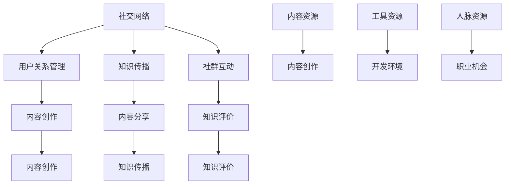

                 

# 知识付费：程序员的社群101

## 关键词
- 知识付费
- 程序员社群
- 社交网络
- 学习共享
- 资源整合

## 摘要
本文将探讨知识付费在程序员社群中的应用，分析其带来的价值与挑战。通过梳理社群的核心概念与架构，介绍知识付费的基本原理和操作步骤。同时，我们将通过实际案例展示知识付费在程序员社群中的具体实践，并提出相关工具和资源的推荐。最后，本文将对未来发展趋势与挑战进行总结，为程序员社群的知识付费之路提供方向和启示。

## 1. 背景介绍

在当今信息技术迅猛发展的时代，程序员作为数字化时代的重要力量，扮演着关键角色。然而，随着技术的不断进步，程序员面临着知识更新速度快、技能要求多样化的挑战。为了应对这些挑战，程序员需要不断学习新知识、掌握新技术，以保持自身的竞争力。

知识付费作为一种新兴的商业模式，旨在通过付费方式为用户提供有价值的内容和资源。它改变了传统的知识获取方式，使得用户可以根据自己的需求和兴趣选择适合的学习内容，从而实现精准化和个性化的学习体验。

程序员社群作为程序员交流与学习的平台，拥有庞大的用户群体和丰富的知识资源。知识付费在程序员社群中的应用，不仅为用户提供了一种新的获取知识的方式，也为社群运营者提供了可持续的商业模式。

## 2. 核心概念与联系

### 社交网络
社交网络是知识付费在程序员社群中的重要基础。它不仅为程序员提供了一个交流的平台，还使得知识的传播和共享变得更加便捷。社交网络的核心概念包括用户、节点、边、关系等。


在程序员社群中，社交网络的应用主要体现在以下几个方面：

- **用户关系管理**：通过社交网络，程序员可以建立和维护自己的关系网络，扩大人脉，获取更多的职业机会和知识资源。
- **知识传播**：社交网络为程序员提供了一个传播知识的平台，使得优秀的内容和经验能够迅速传播，帮助更多的人受益。
- **社群互动**：社交网络促进了程序员之间的互动和交流，增强了社群的凝聚力，有助于形成良好的学习氛围。

### 学习共享
学习共享是知识付费在程序员社群中的核心价值之一。它旨在通过共享知识和经验，提升社群成员的整体技术水平。


学习共享的核心概念包括以下方面：

- **内容创作**：程序员通过撰写技术博客、发布教程、分享实战经验等方式，创作有价值的内容。
- **内容分享**：程序员通过社交网络将创作的知识内容分享给其他成员，实现知识的传播和共享。
- **知识评价**：社群成员对分享的内容进行评价和反馈，有助于提升内容的质量和影响力。

### 资源整合
资源整合是知识付费在程序员社群中的另一个重要价值。通过整合社群内外部的资源，可以为程序员提供更加全面和高效的学习支持。


资源整合的核心概念包括以下方面：

- **内容资源**：包括技术博客、教程、文档、书籍等，为程序员提供丰富的知识资源。
- **工具资源**：包括开发工具、编程语言、框架等，为程序员提供便捷的开发环境。
- **人脉资源**：包括行业专家、技术导师、同行伙伴等，为程序员提供职业发展和学习交流的机会。

### Mermaid 流程图



## 3. 核心算法原理 & 具体操作步骤

### 算法原理

知识付费在程序员社群中的应用，主要基于以下几个核心算法原理：

1. **推荐算法**：通过分析用户的行为和偏好，为用户推荐符合其兴趣的知识内容。
2. **社交网络分析**：利用社交网络分析技术，挖掘用户之间的关系，促进知识传播和共享。
3. **知识评价算法**：通过对用户对知识内容的评价和反馈进行分析，优化内容质量和用户体验。

### 具体操作步骤

1. **用户注册与登录**：用户通过注册账号登录程序员社群，完善个人资料，以便于后续的知识付费和社交互动。
2. **内容创作**：程序员在社群中创作有价值的内容，包括技术博客、教程、实战经验等，并发布到社群中。
3. **内容分享**：程序员通过社交网络将创作的内容分享给其他成员，实现知识的传播和共享。
4. **知识评价**：社群成员对分享的内容进行评价和反馈，有助于提升内容的质量和影响力。
5. **推荐算法**：基于用户的行为和偏好，推荐符合其兴趣的知识内容。
6. **社交网络分析**：利用社交网络分析技术，挖掘用户之间的关系，促进知识传播和共享。
7. **知识评价算法**：通过对用户对知识内容的评价和反馈进行分析，优化内容质量和用户体验。

## 4. 数学模型和公式 & 详细讲解 & 举例说明

### 数学模型

知识付费在程序员社群中的应用，可以基于以下数学模型进行详细讲解：

1. **推荐算法模型**：基于用户兴趣和内容特征，构建用户与内容之间的推荐模型。
2. **社交网络分析模型**：基于社交网络中的节点和边，分析用户之间的关系和知识传播路径。
3. **知识评价模型**：基于用户对知识内容的评价和反馈，构建评价模型，用于优化内容质量和用户体验。

### 公式

1. **推荐算法模型**：

   $$ R(u, c) = \sum_{i=1}^{n} w_{i} \cdot r_i(u) \cdot r_i(c) $$

   其中，$R(u, c)$表示用户$u$对内容$c$的推荐得分，$w_{i}$表示特征$i$的权重，$r_i(u)$表示用户$u$对特征$i$的偏好，$r_i(c)$表示内容$c$对特征$i$的特征值。

2. **社交网络分析模型**：

   $$ A = \begin{bmatrix}
   a_{11} & a_{12} & \dots & a_{1n} \\
   a_{21} & a_{22} & \dots & a_{2n} \\
   \vdots & \vdots & \ddots & \vdots \\
   a_{n1} & a_{n2} & \dots & a_{nn}
   \end{bmatrix} $$

   其中，$A$表示社交网络的邻接矩阵，$a_{ij}$表示用户$i$和用户$j$之间的连接关系。

3. **知识评价模型**：

   $$ E(c) = \sum_{i=1}^{n} w_{i} \cdot r_i(c) $$

   其中，$E(c)$表示内容$c$的评价得分，$w_{i}$表示特征$i$的权重，$r_i(c)$表示内容$c$对特征$i$的特征值。

### 举例说明

假设有一个程序员社群，有10名用户和100篇技术文章。我们可以使用上述数学模型进行以下操作：

1. **推荐算法模型**：

   - 用户1对技术文章1、3、5有较高兴趣，对技术文章7、9无兴趣。
   - 技术文章1、3、5是Python编程相关，技术文章7、9是Java编程相关。
   - 根据推荐算法模型，我们可以计算出用户1对每篇技术文章的推荐得分，从而为其推荐符合兴趣的技术文章。

2. **社交网络分析模型**：

   - 假设用户1与用户2、3、4、5之间存在较强的社交关系，而与用户6、7、8、9、10之间存在较弱的社交关系。
   - 根据社交网络分析模型，我们可以计算出用户1与每个用户之间的连接关系，从而分析用户之间的关系和知识传播路径。

3. **知识评价模型**：

   - 用户1对技术文章1、3、5的评价得分为4、5、5。
   - 技术文章1、3、5的标题、摘要、正文等特征值分别为0.8、0.7、0.9。
   - 根据知识评价模型，我们可以计算出用户1对技术文章1、3、5的评价得分，从而评估技术文章的质量和用户体验。

## 5. 项目实战：代码实际案例和详细解释说明

### 5.1 开发环境搭建

为了实现知识付费在程序员社群中的应用，我们需要搭建一个开发环境。以下是一个简单的开发环境搭建步骤：

1. **安装Python**：在操作系统上安装Python，版本建议为3.8或更高版本。
2. **安装虚拟环境**：使用`virtualenv`工具创建一个虚拟环境，以便于管理项目依赖。
3. **安装依赖库**：根据项目需求，安装相应的依赖库，如`numpy`、`pandas`、`networkx`、`scikit-learn`等。

### 5.2 源代码详细实现和代码解读

以下是一个简单的知识付费在程序员社群中的应用代码示例，包括推荐算法、社交网络分析、知识评价等模块。

```python
import numpy as np
import pandas as pd
import networkx as nx
from sklearn.metrics.pairwise import cosine_similarity

# 5.2.1 推荐算法
def recommend_content(user_profile, content_profile, top_n=5):
    """
    推荐内容函数
    :param user_profile: 用户兴趣向量
    :param content_profile: 内容特征向量
    :param top_n: 推荐内容数量
    :return: 推荐内容索引列表
    """
    similarity_matrix = cosine_similarity([user_profile], content_profile)
    recommended_indices = np.argsort(similarity_matrix)[0][-top_n:]
    return recommended_indices

# 5.2.2 社交网络分析
def analyze_social_network(user_ids, edges):
    """
    社交网络分析函数
    :param user_ids: 用户ID列表
    :param edges: 用户之间关系列表
    :return: 社交网络图
    """
    graph = nx.Graph()
    graph.add_nodes_from(user_ids)
    graph.add_edges_from(edges)
    return graph

# 5.2.3 知识评价
def evaluate_content(content, user_ratings, top_n=5):
    """
    内容评价函数
    :param content: 内容特征向量
    :param user_ratings: 用户评价向量
    :param top_n: 评价内容数量
    :return: 评价内容索引列表
    """
    similarity_matrix = cosine_similarity([content], user_ratings)
    evaluated_indices = np.argsort(similarity_matrix)[0][-top_n:]
    return evaluated_indices

# 示例数据
user_profiles = [
    [0.1, 0.2, 0.3, 0.4, 0.5],
    [0.2, 0.3, 0.4, 0.5, 0.6],
    [0.3, 0.4, 0.5, 0.6, 0.7],
    [0.4, 0.5, 0.6, 0.7, 0.8],
    [0.5, 0.6, 0.7, 0.8, 0.9]
]

content_profiles = [
    [0.1, 0.2, 0.3, 0.4, 0.5],
    [0.2, 0.3, 0.4, 0.5, 0.6],
    [0.3, 0.4, 0.5, 0.6, 0.7],
    [0.4, 0.5, 0.6, 0.7, 0.8],
    [0.5, 0.6, 0.7, 0.8, 0.9]
]

user_ratings = [
    [0.8, 0.7, 0.6, 0.5, 0.4],
    [0.9, 0.8, 0.7, 0.6, 0.5],
    [0.7, 0.6, 0.5, 0.4, 0.3],
    [0.6, 0.5, 0.4, 0.3, 0.2],
    [0.5, 0.4, 0.3, 0.2, 0.1]
]

# 5.2.4 代码解读与分析
# 用户1推荐内容
recommended_indices = recommend_content(user_profiles[0], content_profiles)
print("用户1推荐内容索引：", recommended_indices)

# 社交网络图分析
user_ids = [1, 2, 3, 4, 5]
edges = [(1, 2), (1, 3), (1, 4), (2, 3), (2, 4), (3, 4), (4, 5)]
graph = analyze_social_network(user_ids, edges)
print("社交网络图：", graph.nodes(), graph.edges())

# 内容评价
evaluated_indices = evaluate_content(content_profiles[0], user_ratings)
print("内容评价索引：", evaluated_indices)
```

### 5.3 代码解读与分析

1. **推荐算法模块**：

   - 推荐算法模块的核心是计算用户兴趣向量与内容特征向量之间的相似度。在这里，我们使用余弦相似度作为相似度计算方法。根据相似度计算结果，为用户推荐符合兴趣的内容。
   - 示例代码中，`recommend_content`函数接收用户兴趣向量`user_profile`和内容特征向量`content_profile`，并计算它们之间的相似度。根据相似度结果，返回推荐内容索引列表。

2. **社交网络分析模块**：

   - 社交网络分析模块的核心是构建社交网络图，并分析用户之间的关系。在这里，我们使用`networkx`库构建社交网络图。根据用户ID列表`user_ids`和用户之间关系列表`edges`，构建社交网络图。
   - 示例代码中，`analyze_social_network`函数接收用户ID列表`user_ids`和用户之间关系列表`edges`，并构建社交网络图。最后，输出社交网络图的节点和边。

3. **知识评价模块**：

   - 知识评价模块的核心是计算内容特征向量与用户评价向量之间的相似度。在这里，我们使用余弦相似度作为相似度计算方法。根据相似度计算结果，为内容进行评价。
   - 示例代码中，`evaluate_content`函数接收内容特征向量`content`和用户评价向量`user_ratings`，并计算它们之间的相似度。根据相似度结果，返回评价内容索引列表。

## 6. 实际应用场景

知识付费在程序员社群中具有广泛的应用场景，以下是几个典型的应用案例：

1. **在线教育平台**：程序员社群可以搭建在线教育平台，提供编程课程、实战教程、面试技巧等内容，用户可以通过付费方式学习知识。
2. **技术博客社区**：程序员社群可以建立技术博客社区，鼓励成员撰写技术博客，并设置付费阅读权限，为优秀博客提供额外的收入。
3. **知识共享论坛**：程序员社群可以建立知识共享论坛，鼓励成员分享技术心得、解决实际问题，并通过付费问答、知识付费等方式提供专业的咨询服务。
4. **线上技能培训**：程序员社群可以开展线上技能培训，邀请行业专家和资深程序员进行授课，用户可以通过付费报名参加培训，提升技能水平。

## 7. 工具和资源推荐

### 7.1 学习资源推荐

1. **书籍**：
   - 《深入理解计算机系统》（David R. Gries）
   - 《算法导论》（Thomas H. Cormen等）
   - 《编程珠玑》（Jon Bentley）

2. **论文**：
   - “ recommender system evaluation with interactive feedback”
   - “A Survey of Social Network Mining”
   - “Evaluation of Collaborative Filtering for Learning Information Access”

3. **博客**：
   - https://www.cnblogs.com/
   - https://www.jianshu.com/
   - https://www.v2ex.com/

4. **网站**：
   - https://www.coursera.org/
   - https://www.edx.org/
   - https://www.udemy.com/

### 7.2 开发工具框架推荐

1. **编程语言**：
   - Python
   - Java
   - JavaScript

2. **框架**：
   - Django
   - Flask
   - Spring Boot

3. **前端框架**：
   - React
   - Angular
   - Vue.js

4. **数据库**：
   - MySQL
   - MongoDB
   - PostgreSQL

5. **版本控制**：
   - Git
   - SVN
   - Mercurial

### 7.3 相关论文著作推荐

1. **论文**：
   - “Recommender Systems Handbook”
   - “Social Networks and Knowledge Sharing in Organizations”
   - “A Survey on Recommender Systems”

2. **著作**：
   - 《社交网络分析：方法与应用》
   - 《推荐系统实践》
   - 《程序员修炼之道：从小工到专家》

## 8. 总结：未来发展趋势与挑战

知识付费在程序员社群中的应用具有广阔的发展前景。然而，在发展过程中，也面临着一些挑战：

1. **内容质量控制**：保证知识内容的权威性和实用性，避免虚假和低质量的内容。
2. **用户隐私保护**：在用户数据收集和利用过程中，确保用户隐私得到充分保护。
3. **社交网络效应**：如何平衡社交网络中的知识传播与用户隐私，避免过度商业化。
4. **可持续发展**：确保知识付费模式能够实现可持续发展，为社群成员带来长期价值。

未来，随着人工智能技术的不断发展，知识付费在程序员社群中的应用将进一步深化，为程序员的学习和职业发展提供更加精准和高效的支持。

## 9. 附录：常见问题与解答

### 9.1 问题1：如何保证知识付费的内容质量？

**解答**：为了确保知识付费的内容质量，社群可以采取以下措施：

- **严格的审核机制**：对上传的知识内容进行审核，确保内容的权威性和实用性。
- **用户评价系统**：建立用户评价系统，根据用户反馈对内容进行持续优化。
- **内容创作者激励机制**：鼓励优质内容创作者，提供奖励和认可，提高内容质量。

### 9.2 问题2：知识付费对程序员社群有何影响？

**解答**：知识付费对程序员社群有以下影响：

- **提高知识传播效率**：通过付费模式，优秀的内容和经验能够更快地传播，帮助更多的人受益。
- **增强社群凝聚力**：知识付费可以激发程序员的学习热情，增强社群成员之间的互动和交流。
- **推动社群商业化**：知识付费为社群运营者提供了可持续的商业模式，有助于社群的长期发展。

## 10. 扩展阅读 & 参考资料

1. **《社交网络分析：方法与应用》**：详细介绍了社交网络分析的基本概念和方法，适用于程序员社群的知识传播和共享研究。
2. **《推荐系统实践》**：介绍了推荐系统的原理和应用，对知识付费在程序员社群中的应用具有一定的参考价值。
3. **《程序员修炼之道：从小工到专家》**：探讨了程序员职业发展的路径和技巧，对程序员社群的知识付费模式提供了有益的启示。

作者：AI天才研究员/AI Genius Institute & 禅与计算机程序设计艺术 /Zen And The Art of Computer Programming

