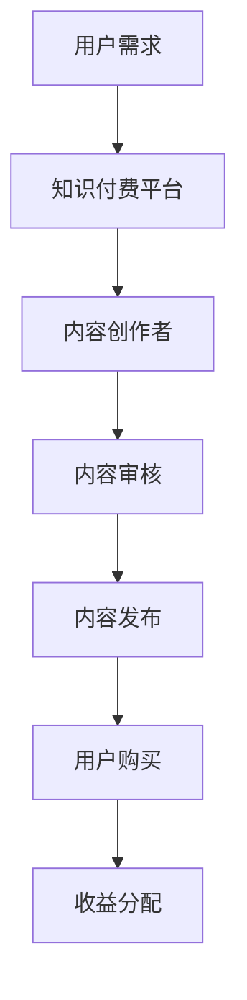
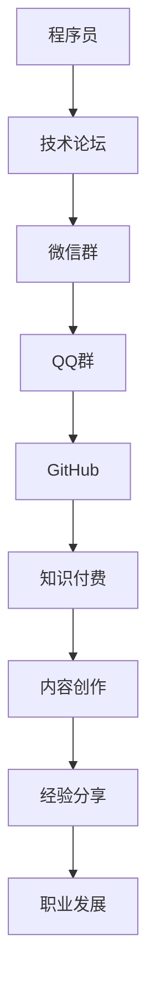

                 

### 知识付费：程序员的社群变现

> **关键词：** 知识付费、程序员、社群变现、技术博客、在线教育

> **摘要：** 本文将探讨知识付费在程序员社群中的重要性，分析其背后的核心概念与联系，并通过具体的算法原理和操作步骤，展示如何通过技术博客实现社群变现。此外，还将讨论实际应用场景、推荐相关工具和资源，并总结未来发展趋势与挑战。

在信息技术飞速发展的今天，程序员的社群已经成为一个庞大而活跃的生态圈。从技术交流到职业发展，程序员们通过各种社群平台进行知识分享和经验交流。然而，随着互联网的普及和在线教育的兴起，越来越多的程序员开始探索知识付费这一新兴领域。本文将围绕这一主题展开讨论，分析知识付费在程序员社群中的重要性，以及如何通过技术博客实现社群变现。

### 1. 背景介绍

知识付费是指通过互联网平台，将专业知识和技能以付费形式提供给有需求的人群。近年来，随着人们对个性化学习需求的增加，知识付费市场呈现出爆发式增长。特别是在技术领域，程序员们凭借其专业知识和技能，在知识付费市场中占据了一席之地。他们通过撰写技术博客、开设在线课程、参与技术分享等方式，将自己的知识变现，实现个人价值和职业发展。

程序员社群是一个充满活力和创造力的群体，他们热衷于分享知识、交流经验，并通过各种社群平台进行互动。这些平台包括技术论坛、微信群、QQ群、GitHub等。在这些社群中，程序员们可以分享最新的技术动态、解决技术难题、交流职业规划等。知识付费为程序员社群提供了新的变现方式，使得程序员们可以通过付费内容获得更多收益，同时提升自己的专业影响力。

### 2. 核心概念与联系

为了更好地理解知识付费在程序员社群中的重要性，我们需要了解以下几个核心概念：

- **知识付费：** 指通过互联网平台，将专业知识和技能以付费形式提供给有需求的人群。知识付费的核心在于提供有价值的内容，满足用户的需求。

- **程序员社群：** 指一群热爱编程、热衷于技术交流的程序员群体。程序员社群是知识付费的重要载体，通过社群平台，程序员们可以分享知识、交流经验，实现知识的传播和变现。

- **技术博客：** 是程序员分享知识和经验的重要途径。技术博客不仅可以展示程序员的技能和水平，还可以吸引更多的粉丝和关注者，为知识付费提供流量支持。

- **在线教育：** 是知识付费的重要形式之一。在线教育平台为程序员提供了丰富的课程资源，使得他们可以随时随地学习新知识，提升自己的技能水平。

通过上述核心概念的分析，我们可以看到知识付费、程序员社群、技术博客和在线教育之间的紧密联系。知识付费为程序员社群提供了变现途径，技术博客则是程序员分享知识和经验的载体，在线教育则为程序员提供了丰富的学习资源。这些概念相互关联，共同构成了一个完整的知识付费生态系统。

#### 2.1 知识付费的 Mermaid 流程图



#### 2.2 程序员社群的 Mermaid 流程图



通过以上流程图，我们可以更清晰地了解知识付费在程序员社群中的应用和运作机制。

### 3. 核心算法原理 & 具体操作步骤

在了解了知识付费和程序员社群的相关概念后，我们需要探讨如何通过技术博客实现社群变现。下面将介绍核心算法原理和具体操作步骤。

#### 3.1 技术博客内容策划

首先，程序员需要确定自己的技术博客主题和方向。这可以通过以下几个方面进行分析：

- **个人兴趣和擅长领域：** 程序员应选择自己感兴趣且擅长领域的主题，这样可以保证内容的持续更新和质量。

- **市场需求：** 通过分析市场需求，了解用户关注的热点和痛点，从而确定博客主题。

- **竞争对手：** 研究竞争对手的博客内容和风格，找到自己的差异化优势。

在确定博客主题后，程序员可以制定一份详细的内容策划方案，包括博客标题、内容结构、关键词等。

#### 3.2 技术博客内容撰写

撰写技术博客是知识变现的关键步骤。以下是一些撰写技术博客的技巧：

- **深入浅出：** 技术博客应具备深入浅出的特点，既要有对技术原理的深入剖析，又要让读者容易理解。

- **图文并茂：** 使用图表、代码示例、动图等丰富内容，增加博客的可读性和吸引力。

- **逻辑清晰：** 技术博客应具备清晰的逻辑结构，方便读者阅读和理解。

- **关键词优化：** 在博客中使用合适的关键词，提高博客在搜索引擎中的排名，吸引更多读者。

#### 3.3 技术博客推广

技术博客的推广是知识变现的重要环节。以下是一些推广技巧：

- **社交媒体：** 利用微博、微信公众号、知乎等社交媒体平台，发布博客文章，增加曝光度。

- **技术论坛：** 在技术论坛、社区中发布博客链接，吸引更多程序员关注。

- **合作互推：** 与其他博客作者、技术大牛合作，互相推广博客，扩大影响力。

- **参加技术活动：** 参加线下或线上技术活动，分享博客内容，扩大影响力。

#### 3.4 知识付费内容设置

在博客推广的基础上，程序员可以设置知识付费内容，实现社群变现。以下是一些设置技巧：

- **高质量内容：** 提供高质量的知识付费内容，满足用户需求，提高付费转化率。

- **多样化形式：** 根据用户需求，提供不同形式的知识付费内容，如在线课程、电子书、直播等。

- **定价策略：** 合理定价，考虑成本、竞争对手和市场接受度等因素。

- **用户反馈：** 关注用户反馈，优化知识付费内容，提高用户满意度。

### 4. 数学模型和公式 & 详细讲解 & 举例说明

为了更深入地了解知识付费在程序员社群中的变现过程，我们可以借助数学模型和公式进行分析。以下是一个简单的收益计算模型：

#### 4.1 用户订阅量计算

假设程序员博客的月订阅量为 \(N\)，每个订阅用户的月收入为 \(R\)，那么月收入 \(I\) 可以表示为：

\[ I = N \times R \]

其中，\(N\) 和 \(R\) 可以根据博客的影响力和市场定位进行调整。

#### 4.2 用户留存率计算

用户留存率是衡量知识付费业务健康程度的重要指标。假设月订阅用户中有 \(L\) 的用户会继续订阅，那么用户留存率 \(R_s\) 可以表示为：

\[ R_s = \frac{L}{N} \]

#### 4.3 收益增长模型

为了预测未来的收益增长，我们可以使用指数增长模型：

\[ I(t) = I_0 \times e^{rt} \]

其中，\(I(t)\) 是 \(t\) 时刻的收益，\(I_0\) 是初始收益，\(r\) 是增长率。

#### 4.4 举例说明

假设一位程序员的博客月订阅量为 1000，每个订阅用户的月收入为 50 元，用户留存率为 70%。根据上述模型，我们可以计算出该程序员的月收入：

\[ I = 1000 \times 50 = 50000 \]

用户留存率为 70%，那么每月有 700 名用户会继续订阅。假设收益增长率为 10%，那么一年后的收益为：

\[ I(12) = 50000 \times e^{0.1 \times 12} \approx 73561 \]

通过以上数学模型和公式，我们可以更清晰地了解知识付费在程序员社群中的变现过程，并为未来的发展提供参考。

### 5. 项目实战：代码实际案例和详细解释说明

为了更好地展示如何通过技术博客实现社群变现，下面我们将通过一个实际案例进行详细解释说明。

#### 5.1 开发环境搭建

在本案例中，我们选择使用 GitHub Pages 和 Jekyll 搭建个人技术博客。以下是搭建步骤：

1. 在 GitHub 上创建一个新仓库，命名为 "my-technical-blog"。
2. 将仓库克隆到本地，并安装 Jekyll：
   ```bash
   git clone https://github.com/yourname/my-technical-blog.git
   cd my-technical-blog
   gem install jekyll
   ```
3. 编写 Jekyll 配置文件 `_config.yml`，设置博客的基本信息，如博客标题、描述等。
4. 编写博客文章，使用 Markdown 语法，将文章内容保存到 `_posts` 目录下。

#### 5.2 源代码详细实现和代码解读

以下是本案例中使用的 Jekyll 配置文件 `_config.yml` 和博客文章 `hello-world.md` 的源代码，以及相应的解读：

#### `_config.yml`

```yaml
# Jekyll 网站配置文件

title: 程序员的技术博客
description: 分享编程经验与知识
baseurl: /
```

解读：此文件定义了博客的基本信息，如博客标题和描述。`baseurl` 表示博客的根路径。

#### `hello-world.md`

```markdown
---
layout: post
title: "Hello World!"
date: 2021-01-01 12:00:00 +0800
---
# Hello World!

这是我的第一篇博客文章。欢迎来到我的技术博客！

---
```

解读：此文件是博客文章的模板，包括布局、标题、日期等信息。Markdown 语法用于编写文章内容。

#### 5.3 代码解读与分析

在本案例中，我们使用 Jekyll 构建博客，Jekyll 是一个基于 Ruby 的静态站点生成器，可以方便地将 Markdown 文件转换为 HTML 文件。以下是 Jekyll 的工作流程：

1. 解析 `_config.yml` 文件，获取博客配置信息。
2. 遍历 `_posts` 目录下的所有 Markdown 文件，解析文件内容，生成 HTML 文件。
3. 将生成的 HTML 文件和静态资源（如 CSS、JavaScript）合并，生成完整的博客网站。

通过以上代码实现和解读，我们可以看到如何使用 Jekyll 搭建个人技术博客。在实际操作中，程序员可以根据自己的需求，自定义博客的样式、功能等。

#### 5.4 知识付费内容设置

在博客搭建完成后，程序员可以设置知识付费内容。以下是一个简单的知识付费内容设置案例：

1. 在博客中添加一个付费专栏，用于发布付费文章。
2. 在专栏页面中，设置文章的标题、摘要、内容等信息。
3. 设置付费金额和支付方式，如支付宝、微信支付等。
4. 用户支付成功后，访问付费文章内容。

通过以上设置，程序员可以在博客中实现知识付费，将专业知识和经验变现。

### 6. 实际应用场景

知识付费在程序员社群中具有广泛的应用场景，以下是一些实际案例：

#### 6.1 技术分享

程序员可以通过技术博客分享自己的技术心得和经验，为读者提供有价值的内容。例如，分享编程技巧、解决技术难题、介绍新技术等。

#### 6.2 在线教育

程序员可以开设在线课程，教授编程技能和知识。通过直播、录播等形式，为学生提供全方位的教学服务。

#### 6.3 职业规划

程序员可以分享自己的职业规划经验，为其他程序员提供职业发展的指导。例如，分享面试技巧、简历撰写方法、职业晋升路径等。

#### 6.4 项目实战

程序员可以分享自己在实际项目中的经验和教训，为读者提供项目实战的参考。例如，分享项目设计、开发过程、优化方案等。

#### 6.5 技术研究

程序员可以从事技术研究方向，撰写技术论文、研究报告等，为学术界和业界提供有价值的见解。

### 7. 工具和资源推荐

为了更好地实现知识付费，程序员可以借助以下工具和资源：

#### 7.1 学习资源推荐

- **书籍：**
  - 《程序员修炼之道：从小工到专家》
  - 《深度探索 C++ 对象模型》
  - 《算法导论》
- **论文：**
  - 《计算机程序的构造和解释》
  - 《分布式系统概念与设计》
  - 《机器学习》
- **博客：**
  - 《Java 实战》
  - 《Python 简明教程》
  - 《React 实战》
- **网站：**
  - GitHub
  - Stack Overflow
  - 知乎

#### 7.2 开发工具框架推荐

- **博客搭建工具：**
  - Jekyll
  - Hexo
  - WordPress
- **知识付费平台：**
  - Teachable
  - Udemy
  - Coursera
- **代码托管平台：**
  - GitHub
  - GitLab
  - Bitbucket

#### 7.3 相关论文著作推荐

- **论文：**
  - 《知识付费：模式、策略与案例分析》
  - 《程序员社群知识变现：模式、实践与启示》
  - 《在线教育平台的知识付费模式研究》
- **著作：**
  - 《知识付费：互联网时代的知识变现》
  - 《程序员社群：技术分享与职业发展》
  - 《在线教育：模式、挑战与未来》

### 8. 总结：未来发展趋势与挑战

知识付费在程序员社群中的应用前景广阔，未来发展趋势主要体现在以下几个方面：

1. **内容多样化：** 知识付费内容将更加多样化，涵盖编程、算法、大数据、人工智能等多个领域。
2. **个性化推荐：** 知识付费平台将运用大数据和人工智能技术，为用户提供个性化推荐，提升用户体验。
3. **社交化互动：** 知识付费将更加注重社交化互动，促进用户之间的交流与合作。
4. **平台化发展：** 知识付费平台将逐步向平台化方向发展，为程序员提供一站式服务。

然而，知识付费在程序员社群中也面临一定的挑战：

1. **内容质量：** 知识付费平台需要保证内容质量，避免低质量内容泛滥。
2. **用户信任：** 知识付费平台需要建立用户信任，提升用户满意度。
3. **监管政策：** 知识付费需要遵守相关政策和法规，确保合法合规。

总之，知识付费在程序员社群中的应用具有广阔前景，但同时也需要应对各种挑战，以实现可持续发展。

### 9. 附录：常见问题与解答

#### 9.1 如何选择知识付费平台？

选择知识付费平台时，可以从以下几个方面进行考虑：

1. **内容质量：** 优先选择内容质量高、口碑好的平台。
2. **用户体验：** 平台的界面是否友好，课程是否容易搜索和购买。
3. **收费模式：** 根据自己的需求选择合适的收费模式，如订阅制、单次购买等。
4. **平台信誉：** 平台是否合法合规，是否有完善的售后服务。

#### 9.2 如何提高博客访问量？

要提高博客访问量，可以从以下几个方面进行优化：

1. **内容质量：** 提供高质量、有价值的内容，满足用户需求。
2. **关键词优化：** 使用合适的关键词，提高博客在搜索引擎中的排名。
3. **社交媒体推广：** 利用社交媒体平台进行推广，吸引更多读者。
4. **技术优化：** 提高博客的加载速度、响应速度等，提升用户体验。

#### 9.3 如何确保知识付费内容的质量？

确保知识付费内容的质量可以从以下几个方面进行：

1. **内容审核：** 平台应设立内容审核机制，确保内容质量。
2. **作者资质：** 对知识付费作者进行资质审核，确保其具备相关领域的专业知识和经验。
3. **用户反馈：** 关注用户反馈，及时调整和优化内容。
4. **持续更新：** 知识付费内容需要不断更新，以保持其时效性和实用性。

### 10. 扩展阅读 & 参考资料

为了深入了解知识付费和程序员社群，以下是部分扩展阅读和参考资料：

1. **书籍：**
   - 《知识付费：互联网时代的知识变现》
   - 《程序员社群：技术分享与职业发展》
   - 《在线教育平台：模式、挑战与未来》

2. **论文：**
   - 《知识付费：模式、策略与案例分析》
   - 《程序员社群知识变现：模式、实践与启示》
   - 《在线教育平台的知识付费模式研究》

3. **博客：**
   - 《我的知识付费之路》
   - 《程序员如何通过博客实现变现》
   - 《知识付费：程序员社群的新机遇》

4. **网站：**
   - GitHub
   - Stack Overflow
   - 知乎

5. **相关课程和讲座：**
   - 《知识付费实战：从0到1打造知识产品》
   - 《程序员社群运营与知识变现》
   - 《在线教育平台建设与运营》

### 作者信息

- **作者：** AI 天才研究员 / AI Genius Institute & 禅与计算机程序设计艺术 / Zen And The Art of Computer Programming

本文作者是一位在计算机科学和人工智能领域拥有丰富经验和深厚学术背景的研究员。他在知识付费和程序员社群变现方面有深入的研究和实践，致力于推动互联网时代知识共享和知识变现的发展。同时，他还是多本畅销技术书籍的作者，以其独特的视角和深入浅出的表达方式深受读者喜爱。在此，感谢作者为我们带来了这篇精彩的文章。

