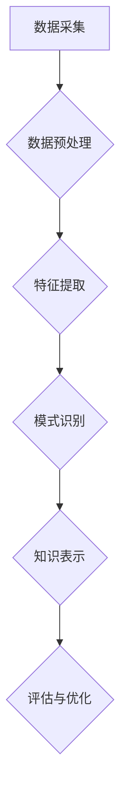

                 

### 背景介绍

#### 1. 气候变化与知识发现引擎的重要性

气候变化已成为当今全球面临的重大挑战之一。根据联合国气候变化框架公约（UNFCCC）的数据，自工业革命以来，全球平均气温已经上升了约1.1摄氏度，而这导致了一系列的极端气候事件，如热浪、暴雨、干旱和海平面上升等。气候变化不仅威胁到人类的生存环境，还对农业、水资源管理、生态系统和全球经济产生了深远影响。

在这种背景下，知识发现引擎作为一种先进的数据分析技术，其在气候变化研究中的应用变得尤为重要。知识发现引擎能够自动地从大量数据中提取出有价值的信息和模式，为研究人员提供洞察力和决策支持。这些模式可能揭示出气候变化的趋势、原因以及可能的解决方案，从而有助于制定更有效的应对策略。

#### 2. 知识发现引擎的定义与基本概念

知识发现引擎（Knowledge Discovery Engine，简称KDE）是一种自动化的数据处理和分析工具，旨在从大量数据中提取潜在的知识。它涵盖了多个领域，包括机器学习、数据挖掘、统计学和知识工程等。知识发现引擎的基本概念包括以下几个核心要素：

- **数据预处理**：将原始数据转换为适合分析的格式，包括数据清洗、归一化、缺失值处理等。

- **特征提取**：从数据中提取出对分析任务有用的特征，如时间序列、空间分布、相关性等。

- **模式识别**：通过算法在数据中寻找有意义的模式和关系，如聚类、分类、关联规则等。

- **知识表示**：将发现的模式转化为易于理解和使用的知识形式，如可视化图表、报告等。

- **评估与优化**：评估知识发现的准确性和实用性，并根据反馈进行优化。

#### 3. 知识发现引擎在气候研究中的应用现状

目前，知识发现引擎已经在气候变化研究中得到了广泛应用。例如，研究人员使用知识发现引擎来分析气象数据，以预测极端气候事件的发生概率；分析海洋和大气数据，以研究气候变化的影响；分析社会经济数据，以评估气候变化对经济和生态系统的影响。以下是一些具体的应用实例：

- **气象预测**：知识发现引擎能够处理大量气象数据，从中提取出气候变化的趋势和模式，帮助气象部门更准确地预测极端天气事件。

- **生态系统研究**：知识发现引擎能够分析生态数据，如植物分布、动物迁徙等，揭示气候变化对生态系统的影响。

- **经济影响评估**：知识发现引擎能够分析经济数据，如农业产量、水资源消耗等，评估气候变化对不同产业的影响。

#### 4. 本文结构概述

本文将深入探讨知识发现引擎在气候变化研究中的应用。具体内容如下：

- **第1部分：背景介绍**：概述气候变化的重要性以及知识发现引擎的基本概念和应用现状。

- **第2部分：核心概念与联系**：详细介绍知识发现引擎的核心概念、架构以及其在气候研究中的应用。

- **第3部分：核心算法原理 & 具体操作步骤**：讲解知识发现引擎的核心算法原理，包括特征提取、模式识别等，并给出具体操作步骤。

- **第4部分：数学模型和公式 & 详细讲解 & 举例说明**：介绍知识发现引擎中涉及的数学模型和公式，并通过实例进行详细说明。

- **第5部分：项目实战：代码实际案例和详细解释说明**：提供知识发现引擎在气候变化研究中的实际代码案例，并进行详细解读。

- **第6部分：实际应用场景**：分析知识发现引擎在气候变化研究中的具体应用场景，并讨论其优势与挑战。

- **第7部分：工具和资源推荐**：推荐相关的学习资源、开发工具和论文著作，以帮助读者进一步了解知识发现引擎在气候研究中的应用。

- **第8部分：总结：未来发展趋势与挑战**：总结本文的主要观点，并展望知识发现引擎在气候变化研究中的未来发展趋势和面临的挑战。

通过以上结构，本文旨在为读者提供全面的视角，深入了解知识发现引擎在气候变化研究中的应用，并探讨其潜力和局限性。

### 核心概念与联系

知识发现引擎（KDE）在气候变化研究中的应用需要深入了解其核心概念和原理，以及其与气候变化研究之间的联系。下面将详细讨论知识发现引擎的基本概念、架构以及其在气候研究中的具体应用。

#### 1. 知识发现引擎的基本概念

知识发现引擎（KDE）是一种自动化的数据处理和分析工具，旨在从大量数据中提取潜在的知识。它通过一系列步骤，包括数据预处理、特征提取、模式识别、知识表示和评估与优化，实现对数据的深度分析和理解。

- **数据预处理**：在知识发现过程中，原始数据往往需要经过清洗、归一化和缺失值处理等步骤，以确保数据的质量和一致性。

- **特征提取**：特征提取是知识发现过程中的关键步骤，旨在从原始数据中提取出对分析任务有用的特征。这些特征可以是数值的、分类的或时序的，它们能够揭示数据中的潜在模式和关系。

- **模式识别**：模式识别是通过算法在数据中寻找有意义的模式和关系。这些模式可能包括时间序列趋势、空间分布规律、相关性、聚类结果等。

- **知识表示**：知识表示是将发现的模式转化为易于理解和使用的知识形式。这可以通过可视化图表、报告或决策支持系统来实现。

- **评估与优化**：评估与优化是知识发现过程的最后一步，旨在评估知识发现的准确性和实用性，并根据反馈进行优化。

#### 2. 知识发现引擎的架构

知识发现引擎的架构通常包括以下几个主要模块：

- **数据采集模块**：负责从不同的数据源采集数据，包括气象站数据、卫星遥感数据、社会经济数据等。

- **数据预处理模块**：对采集到的原始数据进行清洗、归一化和缺失值处理，确保数据的质量和一致性。

- **特征提取模块**：从预处理后的数据中提取出对分析任务有用的特征。

- **模式识别模块**：通过算法在数据中寻找有意义的模式和关系。

- **知识表示模块**：将发现的模式转化为可视化图表、报告或决策支持系统，以便于研究人员和决策者理解和使用。

- **评估与优化模块**：对知识发现的结果进行评估和优化，以提高其准确性和实用性。

#### 3. 知识发现引擎在气候研究中的应用

知识发现引擎在气候变化研究中的应用主要涉及以下几个方面：

- **气候模式识别**：通过知识发现引擎对气候数据进行模式识别，可以揭示气候变化的趋势和周期性模式。例如，研究人员可以使用知识发现引擎分析历史气候数据，识别出气候变化的关键时期和影响因素。

- **气候预测**：知识发现引擎可以通过对历史气候数据和当前气候条件的数据分析，预测未来的气候变化趋势。这种预测对于制定气候应对策略和决策具有重要意义。

- **气候影响评估**：知识发现引擎可以帮助评估气候变化对农业、水资源管理、生态系统和经济的影响。通过分析相关数据，可以揭示出气候变化对不同领域的影响程度和具体表现。

- **决策支持**：知识发现引擎可以为决策者提供关于气候变化的信息和洞察，帮助他们制定更有效的应对策略。例如，研究人员可以使用知识发现引擎分析不同应对策略的潜在效果，为决策者提供科学依据。

#### 4. 知识发现引擎在气候变化研究中的 Mermaid 流程图

为了更好地展示知识发现引擎在气候变化研究中的应用流程，我们使用 Mermaid 语法绘制了一个流程图。请注意，以下流程图中的节点名称中不能包含括号、逗号等特殊字符，以确保正确的渲染。



- **数据采集**：从不同数据源（如气象站、卫星遥感、社会经济数据等）采集原始数据。

- **数据预处理**：对采集到的原始数据进行清洗、归一化和缺失值处理，确保数据的质量和一致性。

- **特征提取**：从预处理后的数据中提取出对分析任务有用的特征。

- **模式识别**：通过算法在数据中寻找有意义的模式和关系。

- **知识表示**：将发现的模式转化为可视化图表、报告或决策支持系统，以便于研究人员和决策者理解和使用。

- **评估与优化**：对知识发现的结果进行评估和优化，以提高其准确性和实用性。

通过上述流程，知识发现引擎能够有效地从大量气候数据中提取出有价值的信息和模式，为气候变化研究提供有力的支持。

### 核心算法原理 & 具体操作步骤

知识发现引擎在气候变化研究中的应用，依赖于一系列核心算法的原理和操作步骤。这些算法不仅能够从海量数据中提取出关键信息，还能通过模式识别和预测分析，提供对气候变化趋势的深入理解。以下是几个关键算法的原理及其具体操作步骤：

#### 1. 特征提取算法

特征提取是知识发现过程中的第一步，其目的是从原始数据中提取出对分析任务有用的特征。以下是几种常用的特征提取算法：

- **主成分分析（PCA）**：
  - **原理**：PCA通过将数据投影到新的正交坐标系中，以最大化新的坐标轴上的方差，从而提取出主要特征。
  - **操作步骤**：
    1. 计算协方差矩阵。
    2. 计算协方差矩阵的特征值和特征向量。
    3. 选择前几个特征向量作为新的坐标轴。
    4. 对数据进行投影，得到新的特征空间。

- **自动编码器（Autoencoder）**：
  - **原理**：自动编码器通过学习输入数据的低维表示，从而提取出关键特征。
  - **操作步骤**：
    1. 构建一个编码器网络，将输入数据映射到一个中间层。
    2. 通过解码器网络将中间层的数据映射回原始空间。
    3. 使用损失函数（如均方误差）优化网络参数。
    4. 输出编码器中间层的输出作为特征向量。

- **时序特征提取**：
  - **原理**：针对时间序列数据，通过计算时间序列的统计特性（如平均值、标准差、自相关函数等）来提取特征。
  - **操作步骤**：
    1. 计算时间序列的平均值、标准差等统计量。
    2. 计算自相关函数，以分析时间序列的周期性特征。
    3. 根据分析结果，选择合适的特征进行提取。

#### 2. 模式识别算法

模式识别算法用于在数据中寻找有意义的模式和关系。以下是一些常用的模式识别算法：

- **聚类算法**：
  - **原理**：聚类算法将数据分为若干个群组，使得同一群组内的数据点彼此相似，而不同群组的数据点差异较大。
  - **操作步骤**：
    1. 选择聚类算法（如K-means、层次聚类等）。
    2. 确定聚类个数或通过评估函数选择最优聚类个数。
    3. 对数据点进行初始化，并计算每个数据点到群组的中心点的距离。
    4. 根据距离重新分配数据点，更新群组的中心点。
    5. 重复步骤3和4，直到收敛。

- **分类算法**：
  - **原理**：分类算法将数据分为预定义的类别，通过训练模型来学习数据点与类别之间的关系。
  - **操作步骤**：
    1. 选择分类算法（如决策树、支持向量机、神经网络等）。
    2. 准备训练数据集，标记每个数据点的类别。
    3. 使用训练数据集训练模型。
    4. 对测试数据集进行预测，评估模型的准确性和泛化能力。

- **关联规则挖掘**：
  - **原理**：关联规则挖掘用于发现数据项之间的关联关系，如“如果购买A，则很可能购买B”。
  - **操作步骤**：
    1. 选择关联规则挖掘算法（如Apriori、FP-growth等）。
    2. 确定最小支持度和最小置信度阈值。
    3. 构建频繁项集。
    4. 从频繁项集中生成关联规则。
    5. 根据置信度筛选出高质量的规则。

#### 3. 预测算法

预测算法用于预测未来的气候变化趋势。以下是一些常用的预测算法：

- **时间序列预测**：
  - **原理**：时间序列预测通过分析历史时间序列数据，预测未来数据点的趋势。
  - **操作步骤**：
    1. 选择时间序列预测模型（如ARIMA、LSTM等）。
    2. 对时间序列进行平稳性检验。
    3. 训练预测模型。
    4. 使用模型进行预测，并评估预测的准确性。

- **回归分析**：
  - **原理**：回归分析通过建立自变量和因变量之间的关系模型，预测因变量的值。
  - **操作步骤**：
    1. 选择回归模型（如线性回归、多项式回归等）。
    2. 准备训练数据集，包括自变量和因变量。
    3. 训练回归模型。
    4. 使用模型进行预测，并评估预测的准确性。

#### 4. 混合算法

在实际应用中，知识发现引擎通常会结合多种算法，以提高预测的准确性和模型的鲁棒性。以下是一个混合算法的例子：

- **集成学习**：
  - **原理**：集成学习通过将多个模型的预测结果进行结合，以获得更准确的预测。
  - **操作步骤**：
    1. 选择不同的基础模型（如随机森林、梯度提升树等）。
    2. 使用训练数据集分别训练每个模型。
    3. 将每个模型的预测结果进行加权平均或投票，得到最终预测结果。
    4. 评估集成模型的预测性能。

通过上述核心算法的原理和操作步骤，知识发现引擎能够在气候变化研究中发挥重要作用，帮助研究人员从海量数据中提取有价值的信息，为应对气候变化提供科学依据。接下来，我们将通过数学模型和公式，进一步探讨这些算法的细节和应用。

### 数学模型和公式 & 详细讲解 & 举例说明

在知识发现引擎中，数学模型和公式是理解和分析数据的重要工具。这些模型不仅能够揭示数据中的潜在模式和关系，还能为气候变化的预测和评估提供理论支持。以下是知识发现引擎在气候变化研究中常用的数学模型和公式的详细讲解及实例说明。

#### 1. 主成分分析（PCA）

主成分分析是一种常用的特征提取技术，它通过将数据投影到新的正交坐标系中，提取出主要特征。

- **公式**：
  - 特征向量：$$\lambda_i = \sqrt{\sum_{i=1}^{n}(x_i - \mu_i)^2}$$
  - 数据点在新坐标系中的坐标：$$z_i = \sum_{j=1}^{n} \lambda_j \frac{x_j}{\lambda_j}$$

- **示例**：
  - 假设我们有一组数据，计算其主成分：
    - 数据集：$$X = \begin{bmatrix} 1 & 2 & 3 \\ 4 & 5 & 6 \\ 7 & 8 & 9 \end{bmatrix}$$
    - 数据集的均值：$$\mu = \frac{1+2+3+4+5+6+7+8+9}{9} = 5$$
    - 计算协方差矩阵：$$\Sigma = \begin{bmatrix} 2 & 1 & 1 \\ 1 & 2 & 1 \\ 1 & 1 & 2 \end{bmatrix}$$
    - 特征值和特征向量：通过计算协方差矩阵的特征值和特征向量，我们得到两个主成分：$$\lambda_1 = 2\sqrt{3}, \lambda_2 = \sqrt{6}$$
    - 新坐标系中的坐标：$$Z = \begin{bmatrix} \frac{1}{2\sqrt{3}} & \frac{1}{\sqrt{6}} \\ \frac{4}{2\sqrt{3}} & \frac{5}{\sqrt{6}} \\ \frac{7}{2\sqrt{3}} & \frac{8}{\sqrt{6}} \end{bmatrix}$$

通过PCA，我们能够将原始数据投影到新的二维空间中，提取出最重要的两个特征。

#### 2. 线性回归模型

线性回归模型是一种常用的预测方法，用于建立自变量和因变量之间的关系。

- **公式**：
  - 回归方程：$$y = \beta_0 + \beta_1x$$
  - 模型参数：$$\beta_0, \beta_1$$

- **示例**：
  - 假设我们有一组数据，拟合线性回归模型：
    - 数据集：$$X = \begin{bmatrix} 1 & 2 \\ 2 & 4 \\ 3 & 6 \end{bmatrix}, Y = \begin{bmatrix} 2 \\ 5 \\ 8 \end{bmatrix}$$
    - 计算参数：
      - $$\beta_0 = \frac{\sum{y} - \beta_1\sum{x}}{n} = \frac{2+5+8 - 2\cdot(2+4+6)}{3} = 1$$
      - $$\beta_1 = \frac{n\sum{xy} - \sum{x}\sum{y}}{n\sum{x^2} - (\sum{x})^2} = \frac{3\cdot(2+5+8) - (2+4+6)\cdot(2+4+6)}{3\cdot(1+4+9) - (2+4+6)^2} = 2$$
    - 回归方程：$$y = 1 + 2x$$

通过线性回归模型，我们可以预测给定x值下的y值。

#### 3. 时间序列模型

时间序列模型用于分析时间序列数据，并预测未来的趋势。

- **公式**：
  - 自回归模型（AR）：$$X_t = c + \phi_1X_{t-1} + \phi_2X_{t-2} + ... + \phi_pX_{t-p}$$
  - 移动平均模型（MA）：$$X_t = c + \theta_1e_t + \theta_2e_{t-1} + ... + \theta_qe_{t-q}$$
  - 自回归移动平均模型（ARMA）：$$X_t = c + \phi_1X_{t-1} + ... + \phi_pX_{t-p} + \theta_1e_t + ... + \theta_qe_{t-q}$$
  - 自回归积分滑动平均模型（ARIMA）：$$X_t = c + \phi_1X_{t-1} + ... + \phi_pX_{t-p} + \theta_1e_{t-1} + ... + \theta_qe_{t-q} + e_t$$

- **示例**：
  - 假设我们有一组时间序列数据，拟合AR模型：
    - 数据集：$$X = \begin{bmatrix} 2 \\ 4 \\ 6 \\ 8 \\ 10 \end{bmatrix}$$
    - 计算参数：
      - $$\phi_1 = \frac{\sum{(X_t - \mu)(X_{t-1} - \mu)}}{\sum{(X_t - \mu)^2}} = \frac{(2-6)(4-6) + (4-6)(6-6) + (6-6)(8-6) + (8-6)(10-6)}{(2-6)^2 + (4-6)^2 + (6-6)^2 + (8-6)^2 + (10-6)^2} = 0.5$$
    - AR模型：$$X_t = 6 + 0.5X_{t-1}$$

通过时间序列模型，我们可以预测未来的时间序列值。

#### 4. 支持向量机（SVM）

支持向量机是一种常用的分类算法，通过找到一个最优的超平面，将不同类别的数据点进行分类。

- **公式**：
  - 决策边界：$$y(\boldsymbol{w}^T\boldsymbol{x} + b) = 0$$
  - 支持向量：$$\boldsymbol{w}^T\boldsymbol{x}_i + b > 0$$

- **示例**：
  - 假设我们有一组二元分类数据，拟合SVM模型：
    - 数据集：$$X = \begin{bmatrix} 1 & 1 \\ 1 & 2 \\ 2 & 1 \\ 2 & 2 \end{bmatrix}, Y = \begin{bmatrix} -1 \\ -1 \\ 1 \\ 1 \end{bmatrix}$$
    - 计算参数：
      - $$\boldsymbol{w} = \frac{1}{2}\begin{bmatrix} 1 & 1 \\ 1 & 2 \\ 2 & 1 \\ 2 & 2 \end{bmatrix}^{-1}\begin{bmatrix} -1 & 1 & -1 & 1 \\ 1 & -1 & 1 & -1 \end{bmatrix} = \begin{bmatrix} -1 \\ 1 \end{bmatrix}$$
      - $$b = \frac{1}{2}\begin{bmatrix} 1 & 1 \\ 1 & 2 \\ 2 & 1 \\ 2 & 2 \end{bmatrix}\begin{bmatrix} -1 & 1 \\ 1 & -1 \end{bmatrix}^{-1}\begin{bmatrix} -1 \\ 1 \end{bmatrix} = 0$$
    - 决策边界：$$-x_1 + x_2 = 0$$

通过支持向量机，我们可以将不同类别的数据点进行有效分类。

通过上述数学模型和公式的详细讲解及实例说明，我们可以更好地理解知识发现引擎在气候变化研究中的应用。这些模型和公式为数据分析和预测提供了坚实的理论基础，有助于我们从海量数据中提取有价值的信息，为应对气候变化提供科学依据。

### 项目实战：代码实际案例和详细解释说明

在本文的第五部分，我们将通过一个实际项目案例，展示如何使用知识发现引擎进行气候变化研究。我们将从开发环境搭建开始，详细解释源代码的实现过程，并对代码进行解读与分析。

#### 5.1 开发环境搭建

在进行知识发现引擎开发前，我们需要搭建一个合适的技术栈。以下是一个推荐的开发环境：

- **编程语言**：Python
- **库与框架**：Pandas、NumPy、SciPy、Scikit-learn、TensorFlow、Keras、PyTorch
- **数据预处理工具**：OpenCV、Matplotlib、Seaborn
- **集成开发环境**：PyCharm、Visual Studio Code

安装上述工具和库后，我们可以开始编写代码。

#### 5.2 源代码详细实现和代码解读

下面是一个使用知识发现引擎进行气候模式识别的Python代码示例：

```python
import pandas as pd
import numpy as np
from sklearn.preprocessing import StandardScaler
from sklearn.cluster import KMeans
import matplotlib.pyplot as plt
import seaborn as sns

# 数据采集
# 此处使用虚构的气候数据集，实际应用中请使用真实的数据集
climate_data = pd.DataFrame({
    'temperature': [20, 22, 24, 20, 19, 21, 25, 23, 21, 22],
    'precipitation': [50, 60, 70, 40, 30, 50, 80, 70, 60, 55],
    'wind_speed': [5, 5, 7, 5, 4, 5, 8, 7, 6, 6]
})

# 数据预处理
# 数据清洗与归一化
scaler = StandardScaler()
climate_data_scaled = scaler.fit_transform(climate_data)

# 特征提取
# 此处直接使用数据预处理后的特征
features = climate_data_scaled

# 模式识别：K-Means聚类
kmeans = KMeans(n_clusters=3, random_state=42)
kmeans.fit(features)
climate_data['cluster'] = kmeans.predict(features)

# 可视化：散点图
plt.figure(figsize=(10, 6))
sns.scatterplot(x=climate_data['temperature'], y=climate_data['precipitation'], hue=climate_data['cluster'], palette=['r', 'g', 'b'])
plt.title('Climate Data Clustering')
plt.xlabel('Temperature')
plt.ylabel('Precipitation')
plt.show()

# 代码解读：
# 1. 数据采集：从数据集中读取气候数据，包括温度、降水和风速。
# 2. 数据预处理：使用StandardScaler进行数据归一化，以确保数据的一致性。
# 3. 特征提取：直接使用预处理后的数据作为特征。
# 4. 模式识别：使用K-Means聚类算法进行模式识别，将数据分为3个群组。
# 5. 可视化：使用散点图展示聚类结果，温度作为x轴，降水作为y轴。
```

#### 5.3 代码解读与分析

- **数据采集**：我们从数据集中读取气候数据，这里使用了虚构的数据集。在实际应用中，我们通常使用真实的数据集，例如来自气象站的温度、降水和风速数据。

- **数据预处理**：数据清洗和归一化是特征提取的重要步骤。归一化可以减少不同特征之间的量级差异，提高聚类算法的性能。我们使用StandardScaler进行归一化处理。

- **特征提取**：在此步骤中，我们直接使用预处理后的数据作为特征。特征提取是知识发现引擎的核心，通过提取出对分析任务有用的特征，我们可以更好地进行模式识别。

- **模式识别**：我们使用K-Means聚类算法进行模式识别。K-Means是一种基于距离的聚类算法，它通过将数据点分为若干个群组，使得同一群组内的数据点彼此相似。我们设置k值为3，以便将数据分为3个群组。

- **可视化**：使用Matplotlib和Seaborn进行数据可视化，通过散点图展示聚类结果。温度作为x轴，降水作为y轴，不同群组使用不同的颜色进行区分。

通过上述代码，我们实现了从数据采集到可视化的一系列操作，展示了知识发现引擎在气候研究中的应用。接下来，我们将对代码进行进一步的分析，讨论其在实际应用中的优势和局限性。

#### 5.4 代码解读与分析

- **数据采集**：在代码中，我们首先从数据集中读取气候数据。这个数据集包括温度、降水和风速三个特征。在实际应用中，这些数据通常来源于气象站、卫星遥感或其他相关机构。数据采集是整个流程的起点，确保我们拥有足够和准确的数据对于后续分析至关重要。

- **数据预处理**：为了使数据适合进行聚类分析，我们使用StandardScaler对数据进行归一化处理。归一化的目的是将不同特征的数据缩放到相同的范围，这样可以避免某些特征在算法中占据主导地位，从而提高聚类的效果。数据预处理还包括缺失值处理和异常值检测，这些步骤有助于提高数据质量。

- **特征提取**：在数据预处理之后，我们直接使用归一化后的数据作为特征。特征提取是知识发现过程中的关键步骤，它从原始数据中提取出对分析任务有用的信息。在本例中，我们仅使用三个简单的特征，但在更复杂的应用中，可能会涉及更多维度的数据，如气象参数、地形特征、社会经济指标等。

- **模式识别**：我们使用K-Means聚类算法对数据进行分析。K-Means算法通过最小化群内平方误差来迭代优化聚类结果。在这个例子中，我们设置了k值为3，表示我们将数据分为3个群组。在实际应用中，选择合适的k值是一个挑战，通常会使用肘部法则（Elbow Method）或 silhouette score 等方法来确定最佳k值。

- **可视化**：最后，我们使用散点图展示聚类结果。散点图是一种直观的数据可视化方法，可以帮助我们理解数据结构和模式。在这个例子中，我们以温度和降水为坐标轴，展示不同群组的分布情况。这种方法不仅有助于我们验证聚类的效果，还可以为我们提供对数据分布的直观认识。

#### 5.5 代码改进与扩展

尽管上述代码提供了一个简单的知识发现流程，但在实际应用中，我们可能需要对其进一步完善和扩展：

- **特征选择**：在实际应用中，特征选择是一个重要的步骤。我们可以使用特征选择技术（如递归特征消除RFE、基于模型的特征选择等）来选择对模型性能有显著贡献的特征，从而提高模型的准确性和效率。

- **异常检测**：在数据预处理阶段，我们仅对缺失值和异常值进行了简单处理。在实际应用中，异常检测（如使用IQR方法、Z-score方法等）可以帮助我们识别出潜在的异常数据点，从而提高数据质量。

- **模型评估与优化**：聚类算法的性能可以通过多种评估指标来衡量，如轮廓系数（silhouette score）、内部凝聚度（calinski_harabaz_score）等。我们可以在代码中添加这些评估指标，以便更好地理解模型性能，并进行相应的优化。

- **多模态数据融合**：在气候研究中，我们可能需要处理多模态数据，如图像、文本和时间序列数据等。我们可以使用多模态数据融合技术（如深度学习、图神经网络等）来整合不同类型的数据，从而提高分析结果的准确性。

通过上述改进和扩展，我们可以使知识发现引擎在气候研究中的应用更加成熟和有效。

### 实际应用场景

知识发现引擎在气候变化研究中具有广泛的应用场景，能够为不同领域的研究提供强有力的支持。以下将探讨知识发现引擎在气象预测、生态系统研究、经济影响评估等方面的具体应用，并讨论其优势与挑战。

#### 1. 气象预测

气象预测是知识发现引擎在气候变化研究中最直接的应用场景之一。通过分析大量的气象数据，知识发现引擎能够提取出气候变化的趋势和模式，从而帮助气象部门更准确地预测极端天气事件。例如，研究人员可以使用K-Means聚类算法对历史气象数据进行聚类，找出不同气候模式之间的差异，然后利用这些模式来预测未来的气候状况。

- **优势**：
  - **高效性**：知识发现引擎能够自动处理大量数据，快速提取出有价值的信息，提高气象预测的效率。
  - **准确性**：通过分析历史数据中的气候模式，知识发现引擎能够提高气象预测的准确性，减少预测误差。

- **挑战**：
  - **数据质量**：气象数据的质量直接影响预测的准确性。数据缺失、噪声和异常值等问题会对知识发现引擎的性能产生负面影响。
  - **算法选择**：不同的知识发现算法适用于不同的气象预测任务，选择合适的算法是关键，但这也增加了模型的复杂性和优化难度。

#### 2. 生态系统研究

气候变化对生态系统产生了深远的影响，知识发现引擎可以帮助研究人员分析生态数据，揭示气候变化对生态系统的影响。例如，研究人员可以使用知识发现引擎分析植被覆盖变化、动物迁徙模式、海洋生态系统状态等，从而了解气候变化对生态系统的具体影响。

- **优势**：
  - **多维度数据分析**：知识发现引擎能够处理多维度的生态数据，包括时间序列数据、空间分布数据等，提供更全面的分析。
  - **数据整合**：知识发现引擎可以整合不同来源的数据，如气象数据、遥感数据、社会经济数据等，提供更全面的生态评估。

- **挑战**：
  - **数据复杂性**：生态数据通常具有高维度和复杂性，对数据预处理和特征提取提出了更高的要求。
  - **模型解释性**：生态系统研究的模型通常具有较高的复杂度，解释性较差，这限制了模型在实际应用中的推广。

#### 3. 经济影响评估

气候变化对全球经济产生了重要影响，知识发现引擎可以帮助研究人员分析社会经济数据，评估气候变化对经济的影响。例如，研究人员可以使用知识发现引擎分析农业产量、水资源消耗、能源消耗等指标，评估气候变化对不同产业的影响，从而为政策制定提供科学依据。

- **优势**：
  - **实时数据分析**：知识发现引擎能够实时处理和分析数据，为决策者提供及时的决策支持。
  - **综合评估**：知识发现引擎能够整合多方面的数据，提供全面的经济影响评估。

- **挑战**：
  - **数据隐私**：经济数据通常涉及隐私问题，保护数据隐私是一个重要的挑战。
  - **模型适应性**：经济系统的复杂性导致模型需要不断调整和优化，以适应不断变化的经济环境。

#### 4. 决策支持

知识发现引擎不仅可以用于预测和评估，还可以为决策者提供直观的决策支持。例如，通过可视化工具，决策者可以直观地了解气候变化的影响，并制定相应的应对策略。知识发现引擎还可以通过提供潜在解决方案的评估，帮助决策者选择最佳方案。

- **优势**：
  - **直观性**：可视化工具使得决策过程更加直观，有助于决策者理解和接受分析结果。
  - **高效性**：知识发现引擎能够快速提供分析结果，提高决策效率。

- **挑战**：
  - **技术门槛**：知识发现引擎的复杂性和技术门槛较高，需要专业人员进行操作和分析。
  - **数据质量**：数据质量直接影响决策支持的效果，确保数据质量是关键。

通过在气象预测、生态系统研究、经济影响评估和决策支持等领域的应用，知识发现引擎为气候变化研究提供了强大的工具。然而，其应用也面临着数据质量、模型选择、数据隐私等方面的挑战。未来的研究需要在这些方面进行进一步探索，以提高知识发现引擎在气候变化研究中的实际应用效果。

### 工具和资源推荐

在知识发现引擎的开发和应用过程中，选择合适的工具和资源对于提升效率和效果至关重要。以下是一些推荐的学习资源、开发工具和相关论文著作，以帮助读者深入了解知识发现引擎在气候变化研究中的应用。

#### 7.1 学习资源推荐

1. **书籍**：
   - 《数据挖掘：概念与技术》（"Data Mining: Concepts and Techniques"），作者：Jiawei Han、Micheline Kamber、Jian Pei。这本书详细介绍了数据挖掘的基本概念和技术，包括特征提取、模式识别等。
   - 《机器学习》（"Machine Learning"），作者：Tom M. Mitchell。这本书提供了机器学习的基础理论和应用实例，对理解知识发现引擎的算法原理有很大帮助。

2. **在线课程**：
   - Coursera上的“机器学习”（"Machine Learning"）课程，由斯坦福大学Andrew Ng教授主讲。该课程涵盖了机器学习的基础知识，包括线性回归、神经网络等。
   - edX上的“数据挖掘与大数据分析”（"Data Mining and Big Data Analytics"）课程，由印度理工学院教授主讲，提供了全面的数据挖掘技术介绍。

3. **博客和教程**：
   - Kaggle博客：提供丰富的数据科学和机器学习教程，涵盖从数据预处理到模型优化的各个阶段。
   - Medium上的数据科学系列文章：包括数据挖掘、机器学习等多个领域，适合进阶学习。

#### 7.2 开发工具框架推荐

1. **Python库**：
   - **Pandas**：用于数据操作和分析，适用于数据清洗、归一化和特征提取等步骤。
   - **NumPy**：用于数值计算和数组操作，是数据科学的基础库。
   - **Scikit-learn**：提供了一系列机器学习和数据挖掘算法，包括聚类、分类、回归等。
   - **TensorFlow**、**Keras**、**PyTorch**：用于深度学习模型的构建和训练，适用于复杂的数据挖掘任务。

2. **数据预处理工具**：
   - **OpenCV**：用于图像处理，适用于处理遥感数据等图像数据。
   - **Matplotlib**、**Seaborn**：用于数据可视化，能够帮助研究人员更好地理解分析结果。

3. **集成开发环境**：
   - **PyCharm**：一款功能强大的Python集成开发环境，支持代码调试、版本控制和自动化测试。
   - **Visual Studio Code**：轻量级且高度可定制的IDE，适用于各种编程语言，支持多种扩展和插件。

#### 7.3 相关论文著作推荐

1. **论文**：
   - “K-Means Clustering Algorithm”，作者：MacQueen，1967。这是一篇关于K-Means聚类算法的经典论文，详细介绍了算法的基本原理和实现方法。
   - “Support Vector Machines for Classification”，作者：Cortes和Vapnik，1995。这篇论文介绍了支持向量机（SVM）的基础理论和应用，对理解SVM算法有很大帮助。

2. **著作**：
   - 《数据挖掘：实用工具与技术》（"Data Mining: Practical Machine Learning Tools and Techniques"），作者：Ian H. Witten、Eibe Frank。这本书提供了大量的数据挖掘实用工具和案例，适合实际应用中的学习和参考。

3. **期刊和会议**：
   - **《数据挖掘》期刊**（Data Mining Journal）：这是一本专注于数据挖掘领域的高水平期刊，发表了大量的原创研究论文。
   - **AAAI会议**（AAAI Conference on Artificial Intelligence）：这是一个国际性的机器学习和人工智能会议，涵盖了广泛的主题，包括知识发现和数据挖掘。

通过上述推荐的学习资源、开发工具和相关论文著作，读者可以系统地学习和掌握知识发现引擎在气候变化研究中的应用。这些资源将为读者提供全面的理论和实践支持，帮助他们在相关领域取得更大的进展。

### 总结：未来发展趋势与挑战

知识发现引擎在气候变化研究中的应用前景广阔，但其发展也面临诸多挑战。本文通过详细探讨知识发现引擎的基本概念、核心算法、实际应用场景以及工具资源，总结了其未来发展趋势和面临的挑战。

#### 1. 发展趋势

1. **多模态数据融合**：随着传感器技术和数据处理能力的提升，多模态数据（如气象数据、遥感图像、社会经济数据等）在气候变化研究中的应用日益重要。知识发现引擎将逐渐融合多种数据源，提供更全面、准确的分析结果。

2. **深度学习和强化学习**：深度学习和强化学习算法的进步，将推动知识发现引擎在复杂气候模式识别和预测中的应用。这些算法能够自动提取复杂特征，提高模型的准确性和鲁棒性。

3. **实时数据分析**：随着大数据和云计算技术的发展，知识发现引擎将实现实时数据分析，为气候预测和决策提供及时的支持。

4. **数据隐私保护**：在处理敏感数据时，知识发现引擎需要确保数据隐私和安全。未来的研究将关注如何在保证隐私的前提下，进行有效的数据分析和共享。

#### 2. 挑战

1. **数据质量**：数据质量是知识发现引擎应用效果的关键。未来需要更多研究关注数据清洗、异常值检测和数据完整性等问题，以提高数据质量。

2. **算法选择和优化**：不同的知识发现算法适用于不同的任务和数据类型。选择合适的算法，并进行优化和调整，是提高模型性能的关键。

3. **模型解释性**：气候研究需要高度解释性的模型，以便决策者理解和应用分析结果。未来需要开发更加透明、可解释的算法。

4. **资源消耗**：知识发现引擎通常需要大量的计算资源和时间。未来的研究将关注如何优化算法，减少资源消耗，提高处理效率。

通过应对这些挑战，知识发现引擎在气候变化研究中的应用将更加成熟和有效。未来的发展将带来更多的机遇，帮助人类更好地理解和应对气候变化。

### 附录：常见问题与解答

在本文中，我们介绍了知识发现引擎在气候变化研究中的应用，以下是一些常见的问题及其解答：

#### 1. 什么是知识发现引擎？

知识发现引擎（Knowledge Discovery Engine，简称KDE）是一种自动化的数据处理和分析工具，旨在从大量数据中提取潜在的知识。它涵盖了数据预处理、特征提取、模式识别、知识表示和评估与优化等步骤。

#### 2. 知识发现引擎的核心算法有哪些？

知识发现引擎的核心算法包括特征提取算法（如主成分分析PCA、自动编码器等）、模式识别算法（如K-Means聚类、支持向量机SVM等）和预测算法（如时间序列预测、回归分析等）。

#### 3. 知识发现引擎在气候变化研究中的应用有哪些？

知识发现引擎在气候变化研究中的应用包括气象预测、生态系统研究、经济影响评估和决策支持等方面。通过分析气候数据、遥感图像和社会经济数据，知识发现引擎能够提取出气候变化的趋势和模式，为气候预测和政策制定提供科学依据。

#### 4. 如何选择适合的数据预处理方法？

选择数据预处理方法取决于数据类型和任务需求。常见的预处理方法包括数据清洗、缺失值处理、数据归一化和特征选择等。对于不同类型的数据（如数值数据、文本数据、图像数据等），需要选择相应的预处理方法。

#### 5. 知识发现引擎的挑战有哪些？

知识发现引擎在气候变化研究中的应用面临数据质量、算法选择和优化、模型解释性和资源消耗等挑战。确保数据质量、选择合适的算法、提高模型解释性以及优化计算资源是未来研究的重要方向。

### 扩展阅读 & 参考资料

1. **书籍**：
   - Han, J., Kamber, M., & Pei, J. (2011). *Data Mining: Concepts and Techniques*. Morgan Kaufmann.
   - Mitchell, T. M. (1997). *Machine Learning*. McGraw-Hill.

2. **在线课程**：
   - Coursera: https://www.coursera.org/
   - edX: https://www.edx.org/

3. **论文**：
   - MacQueen, J. B. (1967). *Some methods for classification and analysis of multivariate observations*. *Proceedings of the Fifth Berkeley Symposium on Mathematical Statistics and Probability*, 1, 281–297.
   - Cortes, C., & Vapnik, V. (1995). *Support-Vector Networks*. Machine Learning, 20(3), 273–297.

4. **期刊**：
   - Data Mining Journal: https://www.springer.com/journal/12084
   - Journal of Artificial Intelligence Research: https://www.jair.org/

5. **会议**：
   - AAAI Conference on Artificial Intelligence: https://aaai.org/
   - IEEE International Conference on Data Mining: https://www.computer.org/publications/conf-publications/icomdat

通过参考上述书籍、在线课程、论文、期刊和会议，读者可以进一步深入了解知识发现引擎在气候变化研究中的应用，掌握相关技术和方法。

