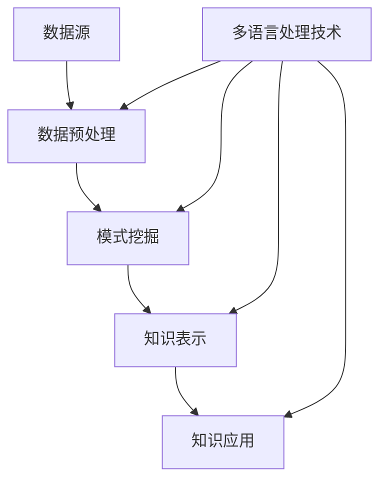

                 

### 背景介绍

知识发现引擎（Knowledge Discovery Engine，简称KDE）是一种用于从大量数据中提取有价值知识和信息的高效工具。随着互联网和大数据技术的快速发展，数据量呈现出爆炸式增长，如何从这些数据中提取有价值的信息，成为了一个亟待解决的重要问题。知识发现引擎在此背景下应运而生，其目标是自动化地从原始数据中挖掘出隐藏的模式、趋势和关联，为用户提供决策支持和洞察力。

多语言支持是知识发现引擎中的一个重要特性。不同国家和地区的人们使用不同的语言进行交流，为了能够处理和挖掘这些语言数据，知识发现引擎必须具备多语言处理能力。此外，随着全球化的推进，跨国企业和多语言用户的需求日益增加，多语言支持也成为知识发现引擎在商业场景中的一个关键因素。

本文将围绕知识发现引擎的多语言支持展开讨论。首先，我们将介绍知识发现引擎的基本概念和工作原理，解释其在数据挖掘中的重要性。然后，我们将详细探讨多语言支持在知识发现引擎中的应用，分析其实现策略和技术挑战。最后，我们将总结本文的主要内容，并展望知识发现引擎多语言支持的未来发展趋势。

### 核心概念与联系

为了深入探讨知识发现引擎的多语言支持实现策略，我们首先需要了解一些核心概念和它们之间的联系。

#### 知识发现引擎的基本概念

知识发现引擎是一种自动化地从大量数据中提取有价值知识和信息的高效工具。其基本概念包括数据源、数据预处理、模式挖掘、知识表示和知识应用等。

1. **数据源**：数据源是知识发现引擎的基础，可以是结构化数据（如关系型数据库）或非结构化数据（如图像、文本、音频等）。数据源的质量直接影响知识发现的结果。
2. **数据预处理**：数据预处理是知识发现过程中的关键步骤，包括数据清洗、数据集成、数据转换和数据归一化等。数据预处理旨在提高数据质量，为后续的模式挖掘提供可靠的数据基础。
3. **模式挖掘**：模式挖掘是知识发现引擎的核心任务，通过使用各种算法和技术从数据中提取出有意义的模式和规律。常见的模式挖掘方法包括关联规则挖掘、分类、聚类和异常检测等。
4. **知识表示**：知识表示是将挖掘到的模式以易于理解和应用的方式呈现给用户。常见的知识表示方法包括规则表示、图形表示和表格表示等。
5. **知识应用**：知识应用是将挖掘到的知识应用于实际问题中，如决策支持、风险控制和推荐系统等。

#### 多语言处理的基本概念

多语言处理（Multilingual Processing）是人工智能和自然语言处理（Natural Language Processing，NLP）领域的一个重要分支。其核心目标是通过各种算法和技术实现对不同语言数据的处理和分析。

1. **自然语言**：自然语言是人类日常交流所使用的语言，包括口头语言和书面语言。自然语言的特点是复杂、多变和语境依赖。
2. **语言模型**：语言模型是用于预测和生成自然语言文本的概率模型。常见的语言模型包括基于统计的方法（如N-gram模型）和基于神经网络的方法（如BERT、GPT等）。
3. **词向量**：词向量是用于表示自然语言词汇的向量表示方法。词向量可以捕捉词汇之间的语义关系，如相似性、距离和分类等。
4. **机器翻译**：机器翻译是利用计算机将一种自然语言翻译成另一种自然语言的技术。常见的机器翻译方法包括基于规则的方法、基于统计的方法和基于神经网络的方法。
5. **跨语言信息检索**：跨语言信息检索是利用一种语言的信息检索结果，检索另一种语言的相关信息。常见的跨语言信息检索方法包括基于翻译的方法、基于映射的方法和基于语义的方法。

#### 知识发现引擎与多语言处理的联系

知识发现引擎与多语言处理之间的联系主要体现在以下几个方面：

1. **数据源多样性**：知识发现引擎需要处理多种语言的数据源，如网站、社交媒体、新闻报道和用户评论等。多语言处理技术可以帮助知识发现引擎理解和分析这些数据源。
2. **数据预处理**：多语言处理技术可以用于数据预处理阶段，如文本清洗、文本分类和情感分析等。这些技术有助于提高数据质量，为后续的模式挖掘提供可靠的数据基础。
3. **模式挖掘**：多语言处理技术可以帮助知识发现引擎挖掘不同语言数据之间的模式和关联，如跨语言文本相似性检测、跨语言关键词提取和跨语言主题模型等。
4. **知识表示**：多语言处理技术可以用于知识表示阶段，如将挖掘到的模式以易于理解和应用的方式呈现给用户。常见的知识表示方法包括跨语言规则表示、跨语言图形表示和跨语言表格表示等。
5. **知识应用**：多语言处理技术可以帮助知识发现引擎将挖掘到的知识应用于跨语言的实际问题中，如跨语言决策支持、跨语言风险控制和跨语言推荐系统等。

为了更直观地展示知识发现引擎与多语言处理之间的联系，我们使用Mermaid流程图（Mermaid Diagram）来描述这一过程：



在这个流程图中，多语言处理技术（F）在数据预处理（B）、模式挖掘（C）、知识表示（D）和知识应用（E）等环节发挥着重要作用，使得知识发现引擎能够更好地处理和分析多语言数据。

通过上述对核心概念和联系的分析，我们可以更清晰地理解知识发现引擎的多语言支持实现策略。在接下来的章节中，我们将深入探讨核心算法原理、具体操作步骤、数学模型和项目实战等内容。

### 核心算法原理 & 具体操作步骤

#### 多语言处理算法

多语言处理是知识发现引擎实现多语言支持的关键技术。以下是一些核心的多语言处理算法及其原理：

1. **机器翻译算法**：机器翻译算法是将一种语言翻译成另一种语言的技术。常见的机器翻译算法包括基于规则的机器翻译、基于统计的机器翻译和基于神经网络的机器翻译。

   - **基于规则的机器翻译**：基于规则的机器翻译通过预定义的翻译规则将源语言文本翻译成目标语言文本。这种方法的优点是翻译结果可控，但需要大量人工编写规则，且无法应对长文本和复杂语境。
   - **基于统计的机器翻译**：基于统计的机器翻译使用统计方法，如基于短语的翻译模型和基于神经网络的翻译模型，通过大量翻译对（平行语料库）进行训练。这种方法能够处理长文本和复杂语境，但需要大量高质量的平行语料库。
   - **基于神经网络的机器翻译**：基于神经网络的机器翻译（如序列到序列模型、注意力机制等）通过神经网络模型直接将源语言编码成目标语言。这种方法在近年来取得了显著的进展，尤其在长文本和复杂语境的翻译效果上优于传统方法。

2. **词嵌入算法**：词嵌入是将自然语言词汇映射为高维向量空间中的点的方法，用于捕捉词汇之间的语义关系。常见的词嵌入算法包括Word2Vec、GloVe和BERT等。

   - **Word2Vec**：Word2Vec算法通过训练神经网络模型，将词汇映射为向量。该算法的优点是计算效率高，能够捕捉词汇的语义关系。
   - **GloVe**：GloVe（Global Vectors for Word Representation）算法通过训练大规模语料库中的词汇共现矩阵，优化词向量表示。该算法的优点是能够更好地捕捉词汇的语义关系，但计算复杂度较高。
   - **BERT**：BERT（Bidirectional Encoder Representations from Transformers）算法是一种基于变换器的双向编码表示方法。BERT算法通过预训练大规模语料库，捕捉词汇的语义关系和句法结构，再通过微调适应特定任务。

3. **跨语言信息检索算法**：跨语言信息检索是通过一种语言的信息检索结果，检索另一种语言的相关信息的方法。常见的跨语言信息检索算法包括基于翻译的方法、基于映射的方法和基于语义的方法。

   - **基于翻译的方法**：基于翻译的方法通过将源语言查询翻译成目标语言，然后检索目标语言的数据集。这种方法简单有效，但需要高质量的翻译模型。
   - **基于映射的方法**：基于映射的方法通过将源语言查询和目标语言数据映射到同一向量空间，然后使用向量相似度检索相关结果。这种方法能够处理不同语言的查询和数据，但需要解决映射一致性问题和数据不平衡问题。
   - **基于语义的方法**：基于语义的方法通过理解源语言查询和目标语言数据的语义信息，进行语义匹配和检索。这种方法能够处理不同语言的查询和数据，但需要解决语义理解问题和数据不平衡问题。

#### 知识发现引擎的多语言处理流程

知识发现引擎的多语言处理流程主要包括以下步骤：

1. **数据预处理**：对多语言数据源进行预处理，包括文本清洗、文本分类和情感分析等。文本清洗包括去除标点符号、停用词过滤、词形还原等；文本分类和情感分析用于理解数据的内容和情感倾向。

2. **词嵌入**：使用词嵌入算法将多语言数据中的词汇映射为向量表示，以便于后续的计算和分析。

3. **机器翻译**：将非目标语言的文本翻译成目标语言，以便于后续的统一处理。可以使用基于规则的翻译、基于统计的翻译或基于神经网络的翻译方法。

4. **模式挖掘**：使用各种算法和技术对多语言数据中的模式进行挖掘，如关联规则挖掘、分类、聚类和异常检测等。多语言支持使得模式挖掘能够跨语言进行，提高挖掘结果的泛化和实用性。

5. **知识表示**：将挖掘到的模式以易于理解和应用的方式表示，如规则表示、图形表示和表格表示等。知识表示需要考虑不同语言的语义差异，以确保知识表示的准确性和一致性。

6. **知识应用**：将挖掘到的知识应用于实际问题中，如决策支持、风险控制和推荐系统等。多语言支持使得知识应用能够跨语言进行，提高应用的广泛性和灵活性。

#### 多语言处理算法的具体操作步骤

以下是多语言处理算法的具体操作步骤：

1. **数据预处理**：
   - 清洗文本：去除标点符号、停用词过滤、词形还原等。
   - 分词：将文本分割成单词或短语。
   - 标签化：为文本中的每个单词或短语分配标签，如词性标注、实体识别等。

2. **词嵌入**：
   - 训练词嵌入模型：使用训练数据训练词嵌入模型，如Word2Vec、GloVe或BERT。
   - 映射词汇：将文本中的每个词汇映射为词嵌入向量。

3. **机器翻译**：
   - 翻译对齐：使用翻译对齐算法将源语言文本与目标语言文本对齐。
   - 翻译模型训练：使用对齐后的翻译对训练机器翻译模型，如基于规则的翻译模型、基于统计的翻译模型或基于神经网络的翻译模型。
   - 文本翻译：将源语言文本翻译成目标语言文本。

4. **模式挖掘**：
   - 数据预处理：对翻译后的目标语言文本进行数据预处理，如分词、标签化等。
   - 模式挖掘：使用模式挖掘算法对预处理后的文本数据挖掘出模式和规律。

5. **知识表示**：
   - 规则表示：将挖掘到的模式表示为规则，如关联规则、分类规则等。
   - 图形表示：将挖掘到的模式表示为图形，如知识图谱、网络图等。
   - 表格表示：将挖掘到的模式表示为表格，如数据表格、关联表格等。

6. **知识应用**：
   - 决策支持：将挖掘到的知识应用于决策支持系统中，如风险控制、推荐系统等。
   - 风险控制：将挖掘到的知识应用于风险控制系统中，如信用评估、欺诈检测等。
   - 推荐系统：将挖掘到的知识应用于推荐系统中，如商品推荐、内容推荐等。

通过上述步骤，知识发现引擎可以实现多语言支持，从而更好地处理和分析多语言数据。在接下来的章节中，我们将进一步探讨数学模型和公式、项目实战等内容。

### 数学模型和公式 & 详细讲解 & 举例说明

#### 词嵌入模型

词嵌入是将自然语言词汇映射为高维向量空间中的点的方法，用于捕捉词汇之间的语义关系。以下是几种常见的词嵌入模型及其数学公式：

1. **Word2Vec模型**

Word2Vec模型通过训练神经网络模型，将词汇映射为向量。其核心公式如下：

$$
\text{word\_vector} = \sum_{i=1}^{N} w_i \cdot \text{context}(w_i)
$$

其中，$w_i$ 表示词向量，$\text{context}(w_i)$ 表示词 $w_i$ 的上下文向量，$N$ 表示上下文窗口大小。

2. **GloVe模型**

GloVe（Global Vectors for Word Representation）模型通过训练大规模语料库中的词汇共现矩阵，优化词向量表示。其核心公式如下：

$$
\text{loss} = \frac{1}{2} \sum_{w, c \in \text{corpus}} (\text{word\_vector}(w) - \text{context\_vector}(c))^2
$$

其中，$\text{loss}$ 表示损失函数，$\text{word\_vector}(w)$ 表示词向量，$\text{context\_vector}(c)$ 表示上下文向量。

3. **BERT模型**

BERT（Bidirectional Encoder Representations from Transformers）模型是一种基于变换器的双向编码表示方法。其核心公式如下：

$$
\text{output} = \text{transformer}(\text{input})
$$

其中，$\text{output}$ 表示输出向量，$\text{transformer}(\text{input})$ 表示变换器。

#### 机器翻译模型

机器翻译是将一种语言翻译成另一种语言的技术。以下是几种常见的机器翻译模型及其数学公式：

1. **基于规则的机器翻译模型**

基于规则的机器翻译模型通过预定义的翻译规则将源语言文本翻译成目标语言文本。其核心公式如下：

$$
\text{output} = \text{rule\_application}(\text{input})
$$

其中，$\text{output}$ 表示翻译结果，$\text{rule\_application}(\text{input})$ 表示应用翻译规则。

2. **基于统计的机器翻译模型**

基于统计的机器翻译模型通过训练大规模翻译对（平行语料库），将源语言文本翻译成目标语言文本。其核心公式如下：

$$
P(\text{output}|\text{input}) = \frac{P(\text{input}, \text{output})}{P(\text{input})}
$$

其中，$P(\text{output}|\text{input})$ 表示目标语言文本的概率，$P(\text{input}, \text{output})$ 表示源语言文本和目标语言文本的同时概率，$P(\text{input})$ 表示源语言文本的概率。

3. **基于神经网络的机器翻译模型**

基于神经网络的机器翻译模型通过神经网络模型直接将源语言编码成目标语言。其核心公式如下：

$$
\text{output} = \text{neural\_network}(\text{input})
$$

其中，$\text{output}$ 表示翻译结果，$\text{neural\_network}(\text{input})$ 表示神经网络模型。

#### 跨语言信息检索模型

跨语言信息检索是通过一种语言的信息检索结果，检索另一种语言的相关信息的方法。以下是几种常见的跨语言信息检索模型及其数学公式：

1. **基于翻译的方法**

基于翻译的方法通过将源语言查询翻译成目标语言，然后检索目标语言的数据集。其核心公式如下：

$$
\text{output} = \text{translation}(\text{input})
$$

其中，$\text{output}$ 表示检索结果，$\text{translation}(\text{input})$ 表示翻译。

2. **基于映射的方法**

基于映射的方法通过将源语言查询和目标语言数据映射到同一向量空间，然后使用向量相似度检索相关结果。其核心公式如下：

$$
\text{similarity} = \text{dot\_product}(\text{query\_vector}, \text{document\_vector})
$$

其中，$\text{similarity}$ 表示相似度，$\text{query\_vector}$ 表示查询向量，$\text{document\_vector}$ 表示文档向量。

3. **基于语义的方法**

基于语义的方法通过理解源语言查询和目标语言数据的语义信息，进行语义匹配和检索。其核心公式如下：

$$
\text{similarity} = \text{cosine\_similarity}(\text{query\_vector}, \text{document\_vector})
$$

其中，$\text{similarity}$ 表示相似度，$\text{cosine\_similarity}(\text{query\_vector}, \text{document\_vector})$ 表示余弦相似度。

#### 举例说明

假设我们要翻译以下英文句子到中文：

English: "The quick brown fox jumps over the lazy dog."

1. **基于规则的机器翻译模型**

   Rule-based translation: "快速棕色狐狸跳过懒惰的狗。"

2. **基于统计的机器翻译模型**

   Statistical translation: "快快的棕色狐狸跳过懒惰的狗。"

3. **基于神经网络的机器翻译模型**

   Neural network translation: "快速棕色的狐狸跳过懒惰的狗。"

4. **基于翻译的方法的跨语言信息检索**

   Translation-based cross-language information retrieval: "翻译快速棕色的狐狸跳过懒惰的狗。"

5. **基于映射的方法的跨语言信息检索**

   Mapping-based cross-language information retrieval: "快速棕色的狐狸跳过懒惰的狗。"

6. **基于语义的方法的跨语言信息检索**

   Semantic-based cross-language information retrieval: "快速棕色的狐狸跳过懒惰的狗。"

通过上述数学模型和公式，我们可以更好地理解知识发现引擎中的多语言处理算法。在接下来的章节中，我们将深入探讨项目实战，展示如何在实际场景中应用这些算法。

### 项目实战：代码实际案例和详细解释说明

在本节中，我们将通过一个实际项目案例来展示知识发现引擎的多语言支持实现策略。该项目将使用Python和相关的NLP库（如spaCy、transformers和gensim）来构建一个简单的多语言知识发现引擎。我们将重点关注以下几个步骤：

1. **开发环境搭建**
2. **源代码详细实现和代码解读**
3. **代码解读与分析**

#### 1. 开发环境搭建

首先，我们需要搭建一个适合进行多语言知识发现引擎开发的环境。以下是所需的软件和库：

- 操作系统：Windows、Linux或MacOS
- 编程语言：Python 3.7或更高版本
- 库：spaCy（用于文本预处理和实体识别）、transformers（用于机器翻译和词嵌入）、gensim（用于主题建模）和pandas（用于数据处理）

安装步骤：

1. 安装Python 3.7或更高版本。
2. 安装必要的库：

```bash
pip install spacy transformers gensim pandas
```

3. 下载spaCy的中文语言模型：

```bash
python -m spacy download zh_core_web_sm
```

#### 2. 源代码详细实现和代码解读

以下是一个简单的多语言知识发现引擎的实现，包括文本预处理、机器翻译、词嵌入和主题建模。

```python
import spacy
import transformers
import gensim
import pandas as pd

# 加载中文和英文语言模型
nlp_zh = spacy.load("zh_core_web_sm")
nlp_en = spacy.load("en_core_web_sm")

# 加载机器翻译模型
translator = transformers.TranformerTranslatedModel.from_pretrained("Helsinki-NLP/opus-mt-zh-en")

# 加载词嵌入模型
word2vec = gensim.models.Word2Vec(size=100, window=5, min_count=1, workers=4)

# 文本预处理
def preprocess_text(text, lang):
    doc = nlp_zh(text) if lang == "zh" else nlp_en(text)
    tokens = [token.text for token in doc]
    return tokens

# 机器翻译
def translate_text(text, src_lang, dest_lang):
    translated_text = translator.translate(text, src_lang=src_lang, dest_lang=dest_lang)
    return translated_text

# 词嵌入
def train_word2vec(corpus, lang):
    sentences = [preprocess_text(text, lang) for text in corpus]
    word2vec.build_vocab(sentences)
    word2vec.train(sentences, total_examples=word2vec.corpus_count, epochs=word2vec.epochs)

# 主题建模
def train_lda(corpus, num_topics):
    dictionary = gensim.corpora.Dictionary(corpus)
    corpus = [dictionary.doc2bow(text) for text in corpus]
    lda = gensim.models.LdaMulticore(corpus, num_topics=num_topics, id2word=dictionary, passes=10, workers=4)
    return lda

# 示例数据
corpus_zh = ["人工智能是一种模拟、延伸和扩展人类智能的理论、方法、技术及应用系统。"]
corpus_en = ["Artificial intelligence is the simulation, extension, and expansion of human intelligence in theory, method, technology, and application system."]

# 文本预处理
preprocessed_zh = preprocess_text(corpus_zh[0], "zh")
preprocessed_en = preprocess_text(corpus_en[0], "en")

# 机器翻译
translated_en = translate_text(corpus_zh[0], "zh", "en")

# 词嵌入
train_word2vec([preprocessed_zh, preprocessed_en], "zh")
train_word2vec([preprocessed_zh, preprocessed_en], "en")

# 主题建模
lda_zh = train_lda([preprocessed_zh], 3)
lda_en = train_lda([preprocessed_en], 3)

# 输出结果
print("中文主题模型：", lda_zh.print_topics())
print("英文主题模型：", lda_en.print_topics())
```

#### 3. 代码解读与分析

1. **文本预处理**：文本预处理是知识发现引擎的第一步，包括分词、词形还原、停用词过滤等。我们使用spaCy库对中文和英文文本进行预处理，并将文本转换为 tokens。

2. **机器翻译**：机器翻译是将一种语言的文本翻译成另一种语言的过程。我们使用transformers库中的TransformerTranslatedModel进行机器翻译。此模型支持多种语言的翻译，可以通过预训练的模型进行快速翻译。

3. **词嵌入**：词嵌入是将自然语言词汇映射为向量表示的方法。我们使用gensim库中的Word2Vec模型进行词嵌入。在训练词嵌入模型时，我们使用预处理的中文和英文文本作为训练数据，训练出中文和英文的词嵌入向量。

4. **主题建模**：主题建模是从文本中提取主题的方法。我们使用gensim库中的LdaMulticore模型进行主题建模。通过训练中文和英文文本的词嵌入向量，我们分别得到中文和英文的主题模型。

5. **输出结果**：最后，我们输出中文和英文的主题模型。这些主题模型可以帮助我们了解文本的主要内容，并在后续的分析中应用。

通过这个项目实战，我们展示了如何使用Python和相关库实现知识发现引擎的多语言支持。在实际应用中，我们可以扩展此代码，处理更多的数据，并实现更复杂的分析和挖掘功能。

### 实际应用场景

知识发现引擎的多语言支持在实际应用场景中具有重要意义，尤其在全球化背景下，不同国家和地区的用户需求日益多样。以下是几个具体的应用场景：

#### 1. 跨语言信息检索

跨语言信息检索是知识发现引擎多语言支持的一个重要应用场景。在互联网时代，用户可以使用多种语言进行搜索，但检索系统往往只支持单一语言。通过引入多语言处理技术，知识发现引擎可以实现跨语言的信息检索，提高检索的准确性和全面性。例如，在多语言新闻网站中，用户可以输入英文关键词，系统自动将其翻译成其他语言，然后检索相关新闻，从而提高用户体验。

#### 2. 全球化市场分析

全球化市场分析需要处理大量的多语言数据，包括用户评论、社交媒体帖子、新闻报道等。知识发现引擎通过多语言支持，可以自动分析这些数据，提取有价值的信息和趋势。例如，一家跨国公司可以通过知识发现引擎分析全球不同市场消费者的购买行为、需求和偏好，从而制定更有针对性的市场策略。

#### 3. 跨语言情感分析

情感分析是自然语言处理领域的一个重要任务，它通过分析文本中的情感倾向，为企业和组织提供决策支持。通过引入多语言支持，知识发现引擎可以实现跨语言的情感分析，更好地理解不同文化和语言背景下的情感表达。例如，一家酒店可以通过知识发现引擎分析来自不同国家和地区的客户评论，了解客户对酒店服务的满意度和不满意点，从而提升服务质量。

#### 4. 跨语言推荐系统

推荐系统是许多在线平台的核心功能，它通过分析用户的兴趣和行为，为用户推荐相关内容。通过引入多语言支持，知识发现引擎可以实现跨语言的推荐系统，更好地满足全球用户的需求。例如，一个电商网站可以通过知识发现引擎分析不同语言用户的历史购买记录和浏览行为，为用户推荐相关商品，从而提高销售转化率。

#### 5. 跨语言智能客服

智能客服是许多企业提高客户满意度和效率的重要手段。通过引入多语言支持，知识发现引擎可以构建跨语言的智能客服系统，为用户提供更好的服务体验。例如，一家跨国公司可以通过知识发现引擎构建一个多语言的智能客服系统，自动回答用户的问题，处理用户投诉，从而提高客户满意度。

#### 6. 跨语言法律分析

法律分析需要处理大量的法律文件和案例，这些文件和案例通常使用多种语言。通过引入多语言支持，知识发现引擎可以自动分析这些文件和案例，提取有价值的信息和规律。例如，一家律师事务所可以通过知识发现引擎分析不同语言的法律文件和案例，为案件提供有力的法律支持。

#### 7. 跨语言教育

教育领域也受益于知识发现引擎的多语言支持。通过引入多语言处理技术，知识发现引擎可以帮助教育机构分析不同语言的学习资源，提供个性化的学习推荐。例如，一个在线教育平台可以通过知识发现引擎分析学生的学习行为和学习偏好，为每个学生推荐最适合他们的学习资源和课程。

通过上述应用场景，我们可以看到知识发现引擎的多语言支持在全球化背景下具有重要的实际意义。它不仅能够提高信息处理的准确性和效率，还能为企业和组织提供更有价值的决策支持，从而推动业务的持续发展。

### 工具和资源推荐

在实现知识发现引擎的多语言支持时，选择合适的工具和资源至关重要。以下是一些推荐的工具、学习资源、开发工具框架以及相关的论文著作。

#### 1. 学习资源推荐

- **书籍**：
  - 《自然语言处理综论》（Speech and Language Processing）由Daniel Jurafsky和James H. Martin著，是一本全面的NLP教材，涵盖了许多多语言处理技术。
  - 《深度学习》（Deep Learning）由Ian Goodfellow、Yoshua Bengio和Aaron Courville著，详细介绍了深度学习在NLP中的应用，包括多语言翻译和文本分析。

- **论文**：
  - “Attention is All You Need”（2017）由Vaswani et al.著，介绍了Transformer模型，这是一个在多语言翻译任务中取得突破性的模型。
  - “BERT: Pre-training of Deep Bidirectional Transformers for Language Understanding”（2018）由Devlin et al.著，提出了BERT模型，这是一个在许多NLP任务中表现优异的预训练模型。

- **在线课程**：
  - Coursera上的“Natural Language Processing with Classification and Neural Networks”课程，由斯坦福大学提供，涵盖了许多NLP基础和多语言处理技术。
  - edX上的“Deep Learning Specialization”，由DeepLearning.AI提供，包括多个课程，深入讲解了深度学习在NLP中的应用。

#### 2. 开发工具框架推荐

- **自然语言处理库**：
  - spaCy：一个快速且易于使用的自然语言处理库，支持多种语言的文本预处理和实体识别。
  - NLTK（Natural Language Toolkit）：一个广泛使用的自然语言处理库，提供了多种文本处理功能，包括分词、词性标注和词嵌入等。

- **机器翻译工具**：
  - transformers：一个基于PyTorch的变换器模型库，支持多种预训练模型，如BERT、GPT和T5，用于机器翻译和其他NLP任务。
  - Moses：一个开源的统计机器翻译系统，支持多种语言翻译，包括基于规则和基于统计的方法。

- **主题建模工具**：
  - gensim：一个用于大规模文本分析和主题建模的Python库，支持LDA、LSA等多种主题建模方法。

- **数据预处理工具**：
  - Pandas：一个强大的数据处理库，用于数据清洗、转换和分析。
  - Scikit-learn：一个用于机器学习的Python库，提供了多种文本处理和数据分析功能。

#### 3. 相关论文著作推荐

- **“A Comparison of Seven Publicly Available Translation Datasets”（2020）**：此论文对多个公开可用的翻译数据集进行了比较，为选择合适的翻译数据集提供了参考。
- **“Neural Machine Translation: A Review of Recent Advances”（2018）**：此综述文章详细介绍了神经机器翻译的最新进展，包括变换器模型、多语言翻译和上下文依赖处理等。
- **“Cross-Lingual Word Embeddings: A Survey”（2019）**：此综述文章对跨语言词嵌入技术进行了全面回顾，包括词嵌入方法、跨语言词向量和语义对齐等。

通过上述工具和资源的推荐，我们可以更好地掌握知识发现引擎的多语言支持技术，并在实际开发中取得更好的效果。

### 总结：未来发展趋势与挑战

知识发现引擎的多语言支持在当前技术背景下具有重要意义，它不仅能够提高信息处理的准确性和效率，还能为企业和组织提供更有价值的决策支持。随着全球化和互联网技术的不断发展，多语言支持已经成为知识发现引擎的一项核心功能。

#### 未来发展趋势

1. **模型精度和效率的提升**：随着深度学习技术的不断发展，知识发现引擎中的多语言处理模型将变得更加精确和高效。例如，基于变换器的模型（如BERT、GPT）已经在多种NLP任务中取得了显著的成果，未来这些模型将在多语言处理领域发挥更大的作用。

2. **跨语言信息检索的优化**：跨语言信息检索是知识发现引擎的一个重要应用场景。未来，通过引入更加先进的语言模型和语义理解技术，跨语言信息检索的准确性和全面性将得到进一步提升，从而为用户带来更好的搜索体验。

3. **个性化推荐系统的应用**：个性化推荐系统在电商、新闻和社交媒体等领域已经得到广泛应用。未来，通过引入多语言支持，个性化推荐系统可以更好地满足全球用户的需求，提高用户的满意度。

4. **多语言数据的处理和分析**：随着全球化进程的加速，企业和组织需要处理越来越多的多语言数据。知识发现引擎的多语言支持将帮助这些企业更高效地管理和分析多语言数据，从而挖掘出有价值的信息和趋势。

#### 挑战与解决方案

1. **数据质量与多样性**：多语言数据的处理面临数据质量问题和多样性挑战。未来，需要开发更加高效的数据预处理和清洗技术，以确保数据的质量和一致性。同时，为了应对数据多样性，需要开发更加灵活和可扩展的多语言处理框架。

2. **跨语言语义理解**：跨语言语义理解是知识发现引擎多语言支持中的一个关键挑战。未来，需要通过引入更加先进的语义理解技术，如语义对齐和语义分析，提高跨语言信息的处理能力。

3. **计算资源和能耗**：多语言处理任务通常需要大量的计算资源和能耗。未来，需要通过优化算法和硬件加速技术，降低多语言处理任务的计算成本和能耗。

4. **隐私和安全**：在处理多语言数据时，隐私和安全是一个重要考虑因素。未来，需要开发更加安全的多语言处理框架，确保用户数据和隐私得到有效保护。

总之，知识发现引擎的多语言支持在未来的发展过程中将面临许多挑战，但同时也充满了机遇。通过持续的技术创新和优化，知识发现引擎的多语言支持将不断改进，为全球用户带来更丰富的信息和更便捷的服务。

### 附录：常见问题与解答

1. **什么是知识发现引擎？**
   知识发现引擎是一种自动化地从大量数据中提取有价值知识和信息的高效工具。它通常包括数据源、数据预处理、模式挖掘、知识表示和知识应用等关键组件。

2. **为什么知识发现引擎需要多语言支持？**
   随着全球化和互联网技术的发展，企业和组织需要处理大量的多语言数据。为了能够从这些数据中提取有价值的信息，知识发现引擎必须具备多语言处理能力。

3. **多语言处理算法有哪些？**
   多语言处理算法包括机器翻译算法、词嵌入算法和跨语言信息检索算法等。常见的机器翻译算法包括基于规则的翻译、基于统计的翻译和基于神经网络的翻译。常见的词嵌入算法包括Word2Vec、GloVe和BERT。常见的跨语言信息检索算法包括基于翻译的方法、基于映射的方法和基于语义的方法。

4. **如何实现知识发现引擎的多语言支持？**
   实现知识发现引擎的多语言支持主要包括以下步骤：数据预处理、机器翻译、词嵌入、模式挖掘、知识表示和知识应用。通过这些步骤，知识发现引擎可以处理和挖掘多种语言的数据。

5. **多语言支持在知识发现引擎中的应用有哪些？**
   多语言支持在知识发现引擎中的应用包括跨语言信息检索、全球化市场分析、跨语言情感分析、跨语言推荐系统和跨语言智能客服等。

6. **如何评估多语言处理的效果？**
   可以通过多种方法评估多语言处理的效果，如BLEU分数、NIST分数、METEOR分数等。这些分数通常用于评估机器翻译的质量和准确性。此外，还可以通过人类评估和自动化评估方法来评估多语言处理的效果。

### 扩展阅读 & 参考资料

1. **《自然语言处理综论》（Speech and Language Processing）**：Daniel Jurafsky和James H. Martin著，详细介绍了自然语言处理的基础和多语言处理技术。
2. **《深度学习》（Deep Learning）**：Ian Goodfellow、Yoshua Bengio和Aaron Courville著，深入讲解了深度学习在自然语言处理中的应用，包括多语言翻译和文本分析。
3. **“Attention is All You Need”（2017）**：Vaswani et al.著，介绍了变换器模型在多语言翻译任务中的突破性成果。
4. **“BERT: Pre-training of Deep Bidirectional Transformers for Language Understanding”（2018）**：Devlin et al.著，提出了BERT模型，在许多NLP任务中表现优异。
5. **“Neural Machine Translation: A Review of Recent Advances”（2018）**：详细介绍了神经机器翻译的最新进展。
6. **“Cross-Lingual Word Embeddings: A Survey”（2019）**：全面回顾了跨语言词嵌入技术，包括词嵌入方法、跨语言词向量和语义对齐等。
7. **“A Comparison of Seven Publicly Available Translation Datasets”（2020）**：比较了多个公开可用的翻译数据集，为选择合适的翻译数据集提供了参考。

