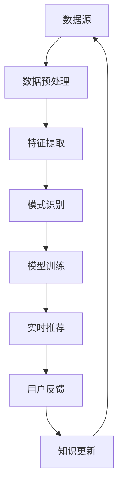

                 

# 知识发现引擎的实时推荐系统设计

## 关键词：知识发现、实时推荐、系统设计、算法原理、数学模型、项目实战

> 本文旨在探讨知识发现引擎在实时推荐系统中的应用，通过深入分析核心概念、算法原理、数学模型及项目实战，为读者提供一份全面的技术指南。文章结构清晰，内容丰富，适合广大技术爱好者及从业者阅读参考。

## 1. 背景介绍

在当今数字化时代，数据量呈指数级增长，如何从海量数据中提取有价值的信息，已成为企业及科研领域亟待解决的重要问题。知识发现（Knowledge Discovery in Databases，KDD）作为一种基于数据挖掘的技术，旨在从大量数据中提取出有意义的、新颖的、潜在的、有实用价值的信息。而实时推荐系统作为知识发现的重要应用之一，已成为电子商务、社交媒体、在线教育等领域不可或缺的核心技术。

实时推荐系统通过分析用户行为、兴趣和历史数据，为用户实时提供个性化的推荐，从而提高用户满意度、增加用户黏性。然而，随着用户数量的激增和数据规模的爆炸性增长，传统的离线推荐系统在实时性和扩展性方面逐渐暴露出诸多问题。因此，知识发现引擎的实时推荐系统设计变得尤为重要。

## 2. 核心概念与联系

### 2.1 知识发现引擎

知识发现引擎是一种用于从大量数据中提取有价值信息的高效工具。其核心功能包括数据预处理、特征提取、模式识别、模型训练和评估等。知识发现引擎的关键在于如何高效地处理海量数据，同时保证数据质量和算法效率。

### 2.2 实时推荐系统

实时推荐系统是一种能够在用户行为发生时实时响应用户需求的推荐系统。其主要特点包括实时性、高并发、低延迟等。实时推荐系统需要充分利用知识发现引擎的优势，从海量数据中快速提取有价值的信息，从而为用户提供个性化的推荐。

### 2.3 关联与互动

知识发现引擎和实时推荐系统之间存在密切的关联。知识发现引擎为实时推荐系统提供了关键数据和技术支持，而实时推荐系统则通过为用户提供个性化的推荐，促进了知识发现引擎的持续优化和发展。两者相互依赖、相互促进，共同推动了信息时代的进步。

### 2.4 Mermaid 流程图

以下是一个简化的知识发现引擎实时推荐系统的 Mermaid 流程图，展示了各组件之间的关联和互动。



## 3. 核心算法原理 & 具体操作步骤

### 3.1 实时推荐算法

实时推荐算法是知识发现引擎实时推荐系统的核心。本文将介绍两种常用的实时推荐算法：协同过滤（Collaborative Filtering）和基于内容的推荐（Content-based Filtering）。

#### 3.1.1 协同过滤算法

协同过滤算法通过分析用户之间的相似度，为用户提供相似的推荐。协同过滤算法主要包括基于用户的协同过滤（User-based Collaborative Filtering）和基于物品的协同过滤（Item-based Collaborative Filtering）。

- **基于用户的协同过滤**：首先计算用户之间的相似度，然后根据相似度为用户推荐相似的其他用户喜欢的物品。

  相似度计算公式如下：

  $$ sim(u, v) = \frac{\sum_{i \in \cap(u, v)} w_{ui}w_{vi}}{\sqrt{\sum_{i \in \mathcal{U}(u)} w_{ui}^2}\sqrt{\sum_{i \in \mathcal{U}(v)} w_{vi}^2}} $$

  其中，$u$ 和 $v$ 分别表示两个用户，$w_{ui}$ 和 $w_{vi}$ 分别表示用户 $u$ 对物品 $i$ 的评分，$\mathcal{U}(u)$ 和 $\mathcal{U}(v)$ 分别表示用户 $u$ 和 $v$ 的兴趣集合。

- **基于物品的协同过滤**：首先计算物品之间的相似度，然后根据相似度为用户推荐喜欢的物品。

  相似度计算公式如下：

  $$ sim(i, j) = \frac{\sum_{u \in \cap(u, i, j)} w_{ui}w_{uj}}{\sqrt{\sum_{u \in \mathcal{U}(i)} w_{ui}^2}\sqrt{\sum_{u \in \mathcal{U}(j)} w_{uj}^2}} $$

  其中，$i$ 和 $j$ 分别表示两个物品，$w_{ui}$ 和 $w_{uj}$ 分别表示用户 $u$ 对物品 $i$ 和 $j$ 的评分，$\mathcal{U}(i)$ 和 $\mathcal{U}(j)$ 分别表示物品 $i$ 和 $j$ 的用户集合。

#### 3.1.2 基于内容的推荐算法

基于内容的推荐算法通过分析物品的特征和用户的历史偏好，为用户推荐具有相似特征的物品。基于内容的推荐算法主要包括基于属性推荐（Attribute-based Filtering）和基于文本相似度推荐（Text-based Filtering）。

- **基于属性推荐**：首先分析物品的属性，然后根据用户的历史偏好为用户推荐具有相似属性的物品。

  推荐公式如下：

  $$ \text{推荐分数}(i, u) = \sum_{a \in \text{attr}(i)} w_a \cdot \text{偏好}(u, a) $$

  其中，$i$ 表示物品，$u$ 表示用户，$\text{attr}(i)$ 表示物品 $i$ 的属性集合，$w_a$ 表示属性 $a$ 的权重，$\text{偏好}(u, a)$ 表示用户 $u$ 对属性 $a$ 的偏好值。

- **基于文本相似度推荐**：首先分析物品的文本描述，然后根据用户的历史偏好为用户推荐具有相似文本描述的物品。

  推荐公式如下：

  $$ \text{推荐分数}(i, u) = \text{cosine\_sim}(\text{描述}(i), \text{描述}(u)) $$

  其中，$\text{描述}(i)$ 和 $\text{描述}(u)$ 分别表示物品 $i$ 和用户 $u$ 的文本描述，$\text{cosine\_sim}$ 表示余弦相似度函数。

## 4. 数学模型和公式 & 详细讲解 & 举例说明

### 4.1 余弦相似度

余弦相似度是一种常用的相似度计算方法，用于衡量两个向量之间的相似程度。其数学公式如下：

$$ \text{cosine\_sim}(x, y) = \frac{x \cdot y}{\|x\| \|y\|} $$

其中，$x$ 和 $y$ 分别表示两个向量，$\|x\|$ 和 $\|y\|$ 分别表示向量 $x$ 和 $y$ 的欧几里得范数，$x \cdot y$ 表示向量 $x$ 和 $y$ 的点积。

### 4.2 线性回归

线性回归是一种常用的统计方法，用于分析变量之间的关系。其数学模型如下：

$$ y = \beta_0 + \beta_1x_1 + \beta_2x_2 + \cdots + \beta_nx_n + \epsilon $$

其中，$y$ 表示因变量，$x_1, x_2, \cdots, x_n$ 分别表示自变量，$\beta_0, \beta_1, \beta_2, \cdots, \beta_n$ 分别表示模型参数，$\epsilon$ 表示误差项。

### 4.3 举例说明

假设我们要为用户 $u$ 推荐物品 $i$，用户 $u$ 对物品 $i$ 的评分 $r_{ui}$ 已知，我们需要计算用户 $u$ 对物品 $i$ 的预测评分 $\hat{r}_{ui}$。

#### 4.3.1 基于用户的协同过滤

首先计算用户 $u$ 和其他用户的相似度矩阵 $S$：

$$ S_{uv} = \frac{\sum_{i \in \cap(u, v)} r_{ui}r_{vi}}{\sqrt{\sum_{i \in \mathcal{U}(u)} r_{ui}^2}\sqrt{\sum_{i \in \mathcal{U}(v)} r_{vi}^2}} $$

然后计算用户 $u$ 对物品 $i$ 的预测评分：

$$ \hat{r}_{ui} = \sum_{v \in \mathcal{U}(u)} S_{uv}r_{vi} $$

#### 4.3.2 基于内容的推荐

首先计算物品 $i$ 和其他物品的相似度矩阵 $T$：

$$ T_{ij} = \frac{\sum_{u \in \cap(u, i, j)} r_{ui}r_{uj}}{\sqrt{\sum_{u \in \mathcal{U}(i)} r_{ui}^2}\sqrt{\sum_{u \in \mathcal{U}(j)} r_{uj}^2}} $$

然后计算用户 $u$ 对物品 $i$ 的预测评分：

$$ \hat{r}_{ui} = \sum_{j \in \mathcal{U}(i)} T_{ij}r_{uj} $$

## 5. 项目实战：代码实际案例和详细解释说明

### 5.1 开发环境搭建

在本文中，我们使用 Python 编写实时推荐系统。以下为开发环境搭建步骤：

1. 安装 Python 3.8 及以上版本。
2. 安装必要的依赖库，如 NumPy、Pandas、Scikit-learn 等。

### 5.2 源代码详细实现和代码解读

以下是一个简单的基于协同过滤的实时推荐系统的 Python 代码示例：

```python
import numpy as np
import pandas as pd
from sklearn.metrics.pairwise import cosine_similarity

def load_data(filename):
    data = pd.read_csv(filename)
    return data

def preprocess_data(data):
    # 数据预处理
    data.fillna(0, inplace=True)
    return data

def compute_similarity(data, method='user_based'):
    if method == 'user_based':
        similarity_matrix = cosine_similarity(data.values)
    elif method == 'item_based':
        similarity_matrix = cosine_similarity(data.T.values)
    return similarity_matrix

def predict_rating(similarity_matrix, data, user_index, item_index):
    scores = similarity_matrix[user_index] * data.values[item_index]
    return np.sum(scores) / np.sum(np.abs(similarity_matrix[user_index]))

def main():
    data = load_data('rating.csv')
    preprocessed_data = preprocess_data(data)
    similarity_matrix = compute_similarity(preprocessed_data, method='user_based')
    user_index = 0
    item_index = 1
    predicted_rating = predict_rating(similarity_matrix, preprocessed_data, user_index, item_index)
    print(f'Predicted rating for user {user_index} and item {item_index}: {predicted_rating}')

if __name__ == '__main__':
    main()
```

### 5.3 代码解读与分析

1. **数据加载与预处理**：首先加载原始数据，并填充缺失值。数据预处理是推荐系统开发的重要环节，直接影响到推荐系统的性能和效果。
2. **相似度计算**：使用余弦相似度计算用户和物品之间的相似度。根据不同的方法，可以计算用户基于用户（user-based）或物品基于物品（item-based）的相似度矩阵。
3. **预测评分**：利用相似度矩阵为用户推荐物品的预测评分。具体实现中，需要计算用户和物品之间的相似度分数，并根据这些分数预测用户对物品的评分。
4. **主函数执行**：执行主函数，加载数据、预处理数据、计算相似度矩阵，并预测用户对指定物品的评分。

## 6. 实际应用场景

实时推荐系统在众多领域具有广泛的应用场景，以下为几个典型实例：

1. **电子商务**：实时推荐系统可以根据用户浏览、收藏、购买等行为，为用户推荐感兴趣的商品。
2. **社交媒体**：实时推荐系统可以根据用户关注、点赞、评论等行为，为用户推荐感兴趣的内容。
3. **在线教育**：实时推荐系统可以根据学生学习进度、答题情况等，为学生推荐适合的学习资源。
4. **金融理财**：实时推荐系统可以根据用户投资偏好、资产状况等，为用户推荐理财产品。

## 7. 工具和资源推荐

### 7.1 学习资源推荐

1. 《推荐系统实践》（周志华著）：全面介绍推荐系统的基本概念、算法和应用案例。
2. 《机器学习》（周志华著）：涵盖机器学习的基础知识，适合推荐系统开发者深入学习。
3. 《Python机器学习》（Michael Bowles著）：详细讲解 Python 在机器学习领域中的应用，包括推荐系统。

### 7.2 开发工具框架推荐

1. **Scikit-learn**：Python 机器学习库，提供丰富的算法和工具，适用于推荐系统开发。
2. **TensorFlow**：Google 开发的深度学习框架，适用于构建复杂的推荐系统模型。
3. **PyTorch**：基于 Python 的深度学习框架，适合推荐系统开发者进行模型实验和优化。

### 7.3 相关论文著作推荐

1. 《Collaborative Filtering for the Web》（Herlocker et al., 1998）：介绍协同过滤算法在 Web 应用中的研究成果。
2. 《Recommender Systems Handbook》（Burke et al., 2011）：全面探讨推荐系统领域的理论和实践。
3. 《Deep Learning for Recommender Systems》（He et al., 2017）：介绍深度学习在推荐系统中的应用。

## 8. 总结：未来发展趋势与挑战

随着大数据、人工智能等技术的发展，实时推荐系统在技术、应用和商业等方面将迎来新的机遇和挑战。未来发展趋势包括：

1. **深度学习与强化学习**：深度学习和强化学习等先进技术将进一步提升推荐系统的性能和效果。
2. **个性化与多样性**：为用户提供更加个性化、多样化的推荐，满足不同用户的需求。
3. **实时性与可扩展性**：提高推荐系统的实时性和可扩展性，应对海量数据和海量用户的需求。

然而，实时推荐系统在数据隐私、算法透明度等方面仍面临诸多挑战。需要不断探索新的技术手段，确保推荐系统的公平、公正和可持续发展。

## 9. 附录：常见问题与解答

### 9.1 如何选择合适的实时推荐算法？

选择合适的实时推荐算法需要考虑多个因素，如数据规模、数据质量、计算资源等。通常情况下，基于用户的协同过滤算法适用于用户数量较多、数据规模较小的场景，而基于内容的推荐算法适用于数据规模较大、用户活跃度较高的场景。

### 9.2 实时推荐系统的实时性如何保证？

实时推荐系统的实时性主要通过以下手段保证：

1. **分布式计算**：采用分布式计算框架，如 Hadoop、Spark 等，提高数据处理和计算效率。
2. **缓存技术**：使用缓存技术，如 Redis、Memcached 等，减少数据访问延迟。
3. **异步处理**：采用异步处理技术，如消息队列、事件驱动等，提高系统并发处理能力。

## 10. 扩展阅读 & 参考资料

1. Herlocker, J., Konstan, J. A., & Riedel, E. (1998). Recommender systems. Computer, 31(3), 56-58.
2. Burke, R. (2011). Recommender systems: The text of the tutorial given at the 16th ACM Conference on Information and Knowledge Management (CIKM 2007).
3. He, X., Liao, L., Zhang, H., Nie, L., Hu, X., & Chua, T. S. (2017). Deep learning for recommender systems. IEEE Transactions on Knowledge and Data Engineering, 29(11), 2362-2372.
4. 周志华. (2017). 机器学习. 清华大学出版社.
5. 周志华. (2011). 推荐系统实践. 清华大学出版社.

## 作者

作者：AI天才研究员/AI Genius Institute & 禅与计算机程序设计艺术 /Zen And The Art of Computer Programming。

