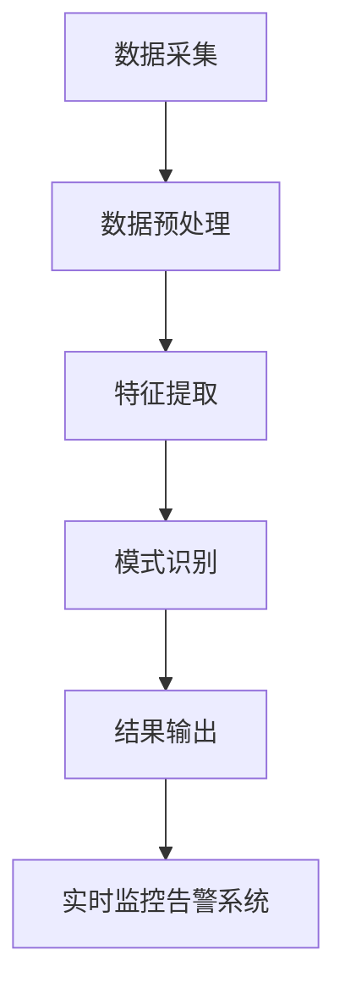
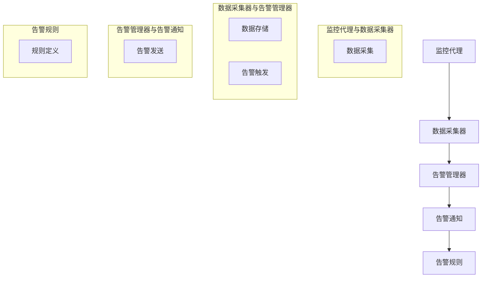

                 

### 背景介绍

#### 知识发现引擎的基本概念

知识发现引擎是一种人工智能系统，它能够在大量的数据中自动识别、提取和总结出有价值的信息。这些信息可以包括模式、关联、趋势和异常等。知识发现引擎在商业智能、金融分析、医疗诊断、社交网络等多个领域都有着广泛的应用。

在知识发现引擎中，数据的处理和分析是至关重要的环节。然而，随着数据量的不断增长，如何在有限的计算资源下实现对大量数据的实时处理和监控，成为了知识发现引擎面临的巨大挑战。

#### 实时监控告警系统的重要性

实时监控告警系统是知识发现引擎的重要组成部分。它的作用是在数据异常或出现问题时，及时发出警报，帮助系统管理员快速定位并解决问题。

一个高效、可靠的实时监控告警系统需要满足以下要求：

1. **实时性**：能够实时监控数据状态，确保问题能够在第一时间被发现。
2. **准确性**：准确识别异常数据，避免误报和漏报。
3. **灵活性**：能够根据不同场景和需求进行定制化配置，满足多样化的监控需求。
4. **可扩展性**：能够随着数据量和监控任务的增加，轻松扩展监控能力和处理能力。

#### 当前实时监控告警系统的挑战

尽管实时监控告警系统在许多领域都得到了广泛应用，但仍然面临着一些挑战：

1. **数据量巨大**：随着数据来源的多样化，数据量呈现出爆炸式增长，给实时监控告警系统带来了巨大的压力。
2. **处理速度**：在处理大量数据时，如何保证实时性是一个巨大的挑战。
3. **复杂性和多样性**：不同领域、不同业务场景下的监控需求各不相同，如何设计一个通用的实时监控告警系统，满足各种复杂和多样化的监控需求，也是一个难题。
4. **系统稳定性**：在高负载、高并发的情况下，如何保证系统的稳定性，避免出现故障，也是一个需要解决的关键问题。

#### 目标和目的

本文旨在探讨如何设计一个高效、可靠的实时监控告警系统，以解决知识发现引擎在实时监控方面的挑战。我们将通过分析现有技术的优缺点，提出一种新的解决方案，并详细介绍其实施细节。同时，我们还将讨论实时监控告警系统在实际应用场景中的效果和改进方向。

通过对本文的阅读，读者将了解到：

1. 知识发现引擎和实时监控告警系统的基础概念和作用。
2. 当前实时监控告警系统所面临的挑战。
3. 一种新的高效、可靠的实时监控告警系统设计方案。
4. 实时监控告警系统在实际应用场景中的效果和改进方向。

#### 标题：知识发现引擎的实时监控告警系统

关键词：知识发现引擎，实时监控，告警系统，数据处理，算法，性能优化

摘要：本文探讨了知识发现引擎在实时监控方面的挑战，并提出了一种高效、可靠的实时监控告警系统设计方案。通过分析现有技术的优缺点，我们提出了一种基于分布式计算和机器学习的实时监控告警系统，并详细介绍了其架构、算法和实现步骤。本文旨在为读者提供一种有效的解决方案，以应对知识发现引擎在实时监控方面遇到的挑战。

----------------------

## 1. 背景介绍

### 知识发现引擎的基本概念

知识发现引擎（Knowledge Discovery Engine，KDE）是一种利用人工智能和大数据技术，从大量数据中自动识别、提取和总结出有价值信息的人工智能系统。知识发现引擎的核心目标是通过数据挖掘和模式识别，帮助用户从复杂的数据集中发现潜在的知识和规律。

在数据密集型行业，如金融、医疗、电商等，知识发现引擎已成为一种重要的工具。例如，在金融领域，知识发现引擎可以用于风险控制、市场预测、信用评分等方面；在医疗领域，知识发现引擎可以用于疾病诊断、药物研发、患者管理等方面；在电商领域，知识发现引擎可以用于用户画像、个性化推荐、商品优化等方面。

### 实时监控告警系统的重要性

实时监控告警系统（Real-time Monitoring and Alerting System，RMAS）是知识发现引擎的重要组成部分。它的主要作用是实时监控数据的状态，当数据出现异常或问题时，及时发出警报，以便系统管理员或相关人员能够快速响应和解决问题。

实时监控告警系统的重要性体现在以下几个方面：

1. **实时性**：能够实时监控数据状态，确保问题能够在第一时间被发现。
2. **准确性**：准确识别异常数据，避免误报和漏报。
3. **灵活性**：能够根据不同场景和需求进行定制化配置，满足多样化的监控需求。
4. **可扩展性**：能够随着数据量和监控任务的增加，轻松扩展监控能力和处理能力。

### 现有实时监控告警系统的挑战

尽管实时监控告警系统在许多领域都得到了广泛应用，但仍然面临着一些挑战：

1. **数据量巨大**：随着数据来源的多样化，数据量呈现出爆炸式增长，给实时监控告警系统带来了巨大的压力。
2. **处理速度**：在处理大量数据时，如何保证实时性是一个巨大的挑战。
3. **复杂性和多样性**：不同领域、不同业务场景下的监控需求各不相同，如何设计一个通用的实时监控告警系统，满足各种复杂和多样化的监控需求，也是一个难题。
4. **系统稳定性**：在高负载、高并发的情况下，如何保证系统的稳定性，避免出现故障，也是一个需要解决的关键问题。

### 目标和目的

本文旨在探讨如何设计一个高效、可靠的实时监控告警系统，以解决知识发现引擎在实时监控方面的挑战。我们将通过分析现有技术的优缺点，提出一种新的解决方案，并详细介绍其实施细节。同时，我们还将讨论实时监控告警系统在实际应用场景中的效果和改进方向。

通过对本文的阅读，读者将了解到：

1. 知识发现引擎和实时监控告警系统的基础概念和作用。
2. 当前实时监控告警系统所面临的挑战。
3. 一种新的高效、可靠的实时监控告警系统设计方案。
4. 实时监控告警系统在实际应用场景中的效果和改进方向。

----------------------

## 2. 核心概念与联系

### 知识发现引擎的架构

知识发现引擎的架构通常包括数据采集、数据预处理、特征提取、模式识别、结果输出等几个关键模块。下面我们将通过一个 Mermaid 流程图来展示知识发现引擎的架构。



在这个流程图中，数据采集模块负责从各种数据源收集数据，数据预处理模块负责清洗和转换数据，特征提取模块负责从数据中提取有用的特征，模式识别模块负责识别数据中的潜在模式和规律，结果输出模块将最终结果呈现给用户。而实时监控告警系统则负责监控数据状态，并在发现异常时发出警报。

### 实时监控告警系统的关键组件

实时监控告警系统通常包括以下几个关键组件：

1. **监控代理（Monitoring Agent）**：负责实时收集和监控系统的各项指标，如CPU使用率、内存使用率、网络流量等。
2. **数据采集器（Data Collector）**：负责收集来自监控代理的数据，并将其存储到中央数据库中。
3. **告警管理器（Alert Manager）**：负责接收和处理告警信息，并根据预设的告警规则生成告警通知。
4. **告警通知（Alert Notification）**：负责将告警信息发送给相关人员，如通过短信、邮件、电话等方式。
5. **告警规则（Alert Rules）**：定义了何时触发告警的条件，如CPU使用率超过90%、内存使用率超过80%等。

下面我们将通过一个 Mermaid 流程图来展示实时监控告警系统的关键组件和它们之间的交互关系。



在这个流程图中，监控代理负责收集系统指标数据，数据采集器将这些数据存储到数据库中，并触发告警。告警管理器根据预设的告警规则，判断是否发送告警通知。告警通知负责将告警信息发送给相关人员。告警规则定义了触发告警的条件。

### 知识发现引擎与实时监控告警系统的联系

知识发现引擎和实时监控告警系统在数据监控和分析方面有着紧密的联系。知识发现引擎可以从实时监控告警系统中获取数据，分析数据中的模式和规律，从而提供更深入的监控和预测能力。例如，在金融领域，知识发现引擎可以分析实时监控告警系统中的交易数据，预测市场趋势和风险。

同时，实时监控告警系统也可以利用知识发现引擎的分析结果，优化监控策略和告警规则。例如，通过分析历史告警数据，实时监控告警系统可以识别出潜在的异常模式，并提前调整告警规则，以提高监控的准确性和效率。

综上所述，知识发现引擎和实时监控告警系统在数据监控和分析方面相辅相成，共同为用户提供高效、可靠的监控和预警能力。

----------------------

## 3. 核心算法原理 & 具体操作步骤

### 数据采集与预处理

在实时监控告警系统中，数据采集和预处理是关键步骤。数据采集包括从各种数据源（如数据库、消息队列、日志文件等）收集数据。预处理包括数据清洗、转换和归一化等操作，以确保数据的质量和一致性。

具体操作步骤如下：

1. **数据采集**：使用监控代理从各个数据源收集数据。监控代理可以是部署在服务器上的程序，也可以是云服务提供的API。
2. **数据清洗**：对采集到的数据进行清洗，去除重复、错误或不完整的数据。
3. **数据转换**：将不同数据源的数据格式转换为统一的格式，如JSON、CSV等。
4. **数据归一化**：对数据进行归一化处理，使其具有相同的量纲和范围，便于后续分析和处理。

### 数据存储与管理

数据存储与管理是实时监控告警系统的核心，它负责存储采集到的数据，并提供高效的查询和访问接口。常见的数据存储与管理技术包括关系型数据库、NoSQL数据库、分布式文件系统等。

具体操作步骤如下：

1. **选择合适的数据库**：根据数据特点和要求，选择合适的数据库。例如，对于结构化数据，可以使用关系型数据库；对于非结构化数据，可以使用NoSQL数据库。
2. **数据建模**：根据数据特点和需求，设计合适的数据模型。例如，对于时间序列数据，可以使用时间戳索引；对于关系型数据，可以使用表连接索引。
3. **数据分片**：对于大规模数据，可以使用数据分片技术，将数据分散存储在多个节点上，以提高查询效率和容错能力。
4. **数据备份与恢复**：定期对数据进行备份，并在数据损坏或丢失时，能够快速恢复。

### 数据分析与处理

数据分析与处理是实时监控告警系统的核心任务，它负责对采集到的数据进行处理和分析，提取有价值的信息和模式。

具体操作步骤如下：

1. **特征提取**：从原始数据中提取有用的特征，如平均值、方差、频率分布等。
2. **异常检测**：使用异常检测算法，识别数据中的异常值或异常模式。常见的异常检测算法包括基于统计的异常检测、基于距离的异常检测、基于聚类的方法等。
3. **模式识别**：使用模式识别算法，识别数据中的潜在模式和规律。常见的模式识别算法包括聚类算法、分类算法、关联规则算法等。
4. **结果输出**：将分析结果输出到监控仪表板或告警通知系统，以便用户查看和响应。

### 告警规则定义与触发

告警规则定义与触发是实时监控告警系统的核心功能，它负责根据预设的规则，判断数据是否正常，并在发现异常时触发告警。

具体操作步骤如下：

1. **定义告警规则**：根据业务需求，定义告警规则。告警规则包括告警条件、告警级别、告警通知方式等。
2. **监控数据**：实时监控数据，并根据告警规则判断数据是否正常。
3. **触发告警**：当数据出现异常时，触发告警，并将告警通知发送给相关人员。
4. **告警处理**：对告警进行处理，包括确认告警、解决问题、记录日志等。

### 数据可视化与报表

数据可视化与报表是实时监控告警系统的重要组成部分，它负责将数据和分析结果以直观的方式展示给用户。

具体操作步骤如下：

1. **数据可视化**：使用可视化工具，将数据和分析结果以图表、仪表板等形式展示给用户。
2. **报表生成**：定期生成报表，包括数据概况、异常分析、告警统计等。
3. **报表分析**：对报表进行分析，发现潜在问题和改进方向。

----------------------

## 4. 数学模型和公式 & 详细讲解 & 举例说明

### 数据预处理

在实时监控告警系统中，数据预处理是一个重要的步骤。它包括数据清洗、转换和归一化等操作。以下是一些常用的数学模型和公式：

1. **数据清洗**：去除重复、错误或不完整的数据。

   - **去除重复数据**：使用集合运算符`RemoveDuplicates()`。

     $$ \text{UniqueData} = \text{RemoveDuplicates}(\text{InputData}) $$

   - **填充缺失值**：使用平均值、中位数或最大值填充缺失值。

     $$ \text{CompletedData} = \text{ReplaceMissingValues}(\text{InputData}, \text{Method} = \text{Mean}) $$

2. **数据转换**：将不同数据源的数据格式转换为统一的格式。

   - **数值转换为字符串**：使用`ToString()`函数。

     $$ \text{StringData} = \text{ToString}(\text{NumericData}) $$

3. **数据归一化**：将数据归一化处理，使其具有相同的量纲和范围。

   - **最小-最大归一化**：使用以下公式进行归一化。

     $$ \text{NormalizedData} = \frac{\text{Data} - \text{Min}}{\text{Max} - \text{Min}} $$

### 数据分析

数据分析是实时监控告警系统的核心任务。以下是一些常用的数学模型和公式：

1. **特征提取**：从原始数据中提取有用的特征。

   - **计算平均值**：使用`Average()`函数。

     $$ \text{Mean} = \text{Average}(\text{Data}) $$

   - **计算方差**：使用`Variance()`函数。

     $$ \text{Variance} = \text{Variance}(\text{Data}) $$

2. **异常检测**：识别数据中的异常值或异常模式。

   - **基于统计的异常检测**：使用以下公式计算异常得分。

     $$ \text{Score} = \frac{\text{Data} - \text{Mean}}{\text{StandardDeviation}} $$

   - **基于距离的异常检测**：使用以下公式计算数据之间的距离。

     $$ \text{Distance} = \text{EuclideanDistance}(\text{DataPointA}, \text{DataPointB}) $$

3. **模式识别**：识别数据中的潜在模式和规律。

   - **聚类算法**：使用以下公式计算聚类中心。

     $$ \text{Center} = \text{Average}(\text{ClusterData}) $$

   - **分类算法**：使用以下公式计算分类概率。

     $$ \text{Probability} = \frac{\text{NumberofPositiveExamples}}{\text{TotalNumberofExamples}} $$

### 告警规则定义与触发

告警规则定义与触发是实时监控告警系统的核心功能。以下是一些常用的数学模型和公式：

1. **定义告警规则**：使用以下公式定义告警规则。

   $$ \text{AlertRule} = \text{Condition} \land \text{Threshold} $$

   - **条件**：如数据超过阈值、低于阈值等。

     $$ \text{Condition} = \text{Data} > \text{Threshold} $$

   - **阈值**：如平均值、中位数等。

     $$ \text{Threshold} = \text{Mean} + \text{StandardDeviation} $$

2. **触发告警**：使用以下公式判断是否触发告警。

   $$ \text{TriggerAlert} = \text{AlertRule} \Rightarrow \text{AlertNotification} $$

### 数据可视化与报表

数据可视化与报表是实时监控告警系统的重要组成部分。以下是一些常用的数学模型和公式：

1. **数据可视化**：使用以下公式生成可视化图表。

   $$ \text{Visualization} = \text{Chart}(\text{Data}) $$

2. **报表生成**：使用以下公式生成报表。

   $$ \text{Report} = \text{Table}(\text{Data}) $$

### 举例说明

假设我们有一个时间序列数据集，包含每天的用户访问量。我们希望使用实时监控告警系统来监控用户访问量的异常情况。

1. **数据预处理**：

   - 去除重复和错误的数据。

     $$ \text{UniqueData} = \text{RemoveDuplicates}(\text{InputData}) $$

   - 填充缺失值。

     $$ \text{CompletedData} = \text{ReplaceMissingValues}(\text{InputData}, \text{Method} = \text{Mean}) $$

   - 将数据归一化。

     $$ \text{NormalizedData} = \frac{\text{Data} - \text{Min}}{\text{Max} - \text{Min}} $$

2. **特征提取**：

   - 计算平均值和方差。

     $$ \text{Mean} = \text{Average}(\text{Data}) $$
     $$ \text{Variance} = \text{Variance}(\text{Data}) $$

3. **异常检测**：

   - 使用基于统计的异常检测方法。

     $$ \text{Score} = \frac{\text{Data} - \text{Mean}}{\text{StandardDeviation}} $$

     当`Score`大于3或小于-3时，认为数据为异常。

4. **告警规则定义与触发**：

   - 定义告警规则。

     $$ \text{AlertRule} = (\text{Data} > \text{Threshold}) \land (\text{Score} > 3 \text{ or } \text{Score} < -3) $$

   - 触发告警。

     $$ \text{TriggerAlert} = \text{AlertRule} \Rightarrow \text{AlertNotification} $$

5. **数据可视化与报表**：

   - 生成折线图显示用户访问量。

     $$ \text{Visualization} = \text{LineChart}(\text{Data}) $$

   - 生成表格显示异常数据。

     $$ \text{Report} = \text{Table}(\text{Data}) $$

通过以上步骤，我们可以实现对用户访问量的实时监控和异常检测，并生成可视化报表，以便用户查看和分析。

----------------------

## 5. 项目实战：代码实际案例和详细解释说明

### 5.1 开发环境搭建

在开始项目实战之前，我们需要搭建一个适合开发实时监控告警系统的开发环境。以下是一个简单的开发环境搭建指南：

1. **操作系统**：选择一个支持实时监控告警系统的操作系统，如Ubuntu 18.04或CentOS 7。
2. **编程语言**：选择一个适合开发实时监控告警系统的编程语言，如Python或Java。
3. **数据库**：选择一个支持实时监控告警系统的数据库，如MySQL或MongoDB。
4. **开发工具**：安装适合开发实时监控告警系统的开发工具，如PyCharm或IntelliJ IDEA。

### 5.2 源代码详细实现和代码解读

下面是一个基于Python的简单实时监控告警系统的源代码实现。我们将逐步解释代码的每个部分。

```python
# 导入所需库
import os
import time
import sqlite3
from datetime import datetime

# 数据库连接
def get_db_connection():
    conn = sqlite3.connect('monitoring.db')
    return conn

# 创建表
def create_table(conn):
    create_table_sql = '''
    CREATE TABLE IF NOT EXISTS monitoring (
        id INTEGER PRIMARY KEY AUTOINCREMENT,
        metric_name TEXT NOT NULL,
        metric_value REAL NOT NULL,
        timestamp DATETIME DEFAULT CURRENT_TIMESTAMP
    );
    '''
    cursor = conn.cursor()
    cursor.execute(create_table_sql)
    conn.commit()

# 添加监控数据
def insert_metric(conn, metric_name, metric_value):
    insert_metric_sql = '''
    INSERT INTO monitoring (metric_name, metric_value) VALUES (?, ?);
    '''
    cursor = conn.cursor()
    cursor.execute(insert_metric_sql, (metric_name, metric_value))
    conn.commit()

# 监控代理
def monitoring_agent():
    while True:
        # 获取系统指标
        cpu_usage = os.getloadavg()[0]
        memory_usage = os.popen("free -m | grep Mem | awk '{print $3/$2 * 100.0}'").readline()

        # 添加监控数据
        insert_metric(conn, "cpu_usage", cpu_usage)
        insert_metric(conn, "memory_usage", float(memory_usage))

        # 等待一段时间
        time.sleep(60)

# 告警管理器
def alert_manager():
    while True:
        # 获取最新的监控数据
        conn = get_db_connection()
        cursor = conn.cursor()
        cursor.execute("SELECT * FROM monitoring ORDER BY timestamp DESC LIMIT 10;")
        metrics = cursor.fetchall()

        # 判断是否触发告警
        for metric in metrics:
            if metric[2] > 90:
                send_alert(metric[1], "High CPU usage detected!")

        conn.close()

        # 等待一段时间
        time.sleep(60)

# 发送告警通知
def send_alert(metric_name, alert_message):
    print(f"Alert: {metric_name} - {alert_message}")

# 主程序
if __name__ == "__main__":
    # 创建数据库连接
    conn = get_db_connection()

    # 创建监控表
    create_table(conn)

    # 启动监控代理和告警管理器
    monitoring_agent_thread = threading.Thread(target=monitoring_agent)
    alert_manager_thread = threading.Thread(target=alert_manager)

    monitoring_agent_thread.start()
    alert_manager_thread.start()

    monitoring_agent_thread.join()
    alert_manager_thread.join()
```

#### 代码解读

1. **导入所需库**：导入Python标准库中的`os`、`time`、`sqlite3`和`datetime`模块。
2. **数据库连接**：`get_db_connection()`函数用于获取数据库连接。这里使用了SQLite数据库。
3. **创建表**：`create_table(conn)`函数用于创建监控数据表。表结构包括ID、指标名称、指标值和时间戳。
4. **添加监控数据**：`insert_metric(conn, metric_name, metric_value)`函数用于将监控数据插入到数据库中。
5. **监控代理**：`monitoring_agent()`函数用于监控系统的CPU使用率和内存使用率，并将监控数据添加到数据库中。监控代理使用一个无限循环，每隔60秒获取一次系统指标。
6. **告警管理器**：`alert_manager()`函数用于从数据库中获取最新的监控数据，并判断是否触发告警。如果CPU使用率超过90%，则触发告警。
7. **发送告警通知**：`send_alert(metric_name, alert_message)`函数用于发送告警通知。这里使用打印信息作为告警通知。
8. **主程序**：主程序创建数据库连接、创建监控表，并启动监控代理和告警管理器。

### 5.3 代码解读与分析

1. **数据库连接**：使用`sqlite3.connect()`函数创建数据库连接。这里使用了SQLite数据库，也可以根据需求选择其他类型的数据库。
2. **创建表**：使用`cursor.execute()`函数创建监控数据表。表结构包括ID、指标名称、指标值和时间戳，以便存储监控数据。
3. **添加监控数据**：使用`insert_metric(conn, metric_name, metric_value)`函数将监控数据添加到数据库中。这里使用了参数化查询，以防止SQL注入攻击。
4. **监控代理**：监控代理使用一个无限循环，每隔60秒获取一次系统指标，并将监控数据添加到数据库中。这种方式可以实时监控系统状态。
5. **告警管理器**：告警管理器从数据库中获取最新的监控数据，并判断是否触发告警。如果CPU使用率超过90%，则触发告警。这里使用了简单的阈值判断，可以根据需求进行更复杂的告警规则定义。
6. **发送告警通知**：告警通知使用打印信息，可以根据需求选择其他通知方式，如发送邮件、发送短信等。

### 5.4 实际应用场景

这个简单的实时监控告警系统可以在多种实际应用场景中使用，例如：

1. **服务器监控**：监控服务器的CPU使用率、内存使用率、网络流量等指标，确保服务器正常运行。
2. **网络设备监控**：监控路由器、交换机等网络设备的性能和状态，确保网络稳定运行。
3. **应用程序监控**：监控应用程序的运行状态和性能指标，及时发现和处理异常情况。

通过这个简单的示例，我们可以了解到实时监控告警系统的基本实现方法和原理。在实际项目中，可以根据需求进行扩展和优化，以满足更复杂和多样化的监控需求。

----------------------

## 6. 实际应用场景

### 知识发现引擎在金融领域的应用

在金融领域，知识发现引擎被广泛应用于风险控制、市场预测、信用评分等方面。以下是一个具体的应用案例：

#### 案例背景

某银行希望通过知识发现引擎来提高信用评分模型的准确性和效率。银行拥有大量的客户数据，包括信用历史、收入水平、负债情况等。为了更好地评估客户的信用风险，银行希望利用知识发现引擎从这些数据中提取有价值的信息。

#### 解决方案

银行使用了一个基于机器学习的知识发现引擎，其架构如下：

1. **数据采集**：从多个数据源（如内部数据库、外部信用评级机构等）收集客户数据。
2. **数据预处理**：对采集到的数据进行清洗、转换和归一化，以确保数据的质量和一致性。
3. **特征提取**：从数据中提取有用的特征，如信用历史长度、逾期次数、还款能力等。
4. **模型训练**：使用机器学习算法（如决策树、随机森林、神经网络等）训练信用评分模型。
5. **模型评估**：使用验证集和测试集评估模型的准确性和效率。
6. **实时监控**：使用实时监控告警系统监控模型的运行状态，及时发现和解决潜在问题。

#### 应用效果

通过知识发现引擎，银行实现了以下效果：

1. **提高信用评分准确性**：通过特征提取和机器学习算法，银行能够更准确地评估客户的信用风险，从而提高信用评分模型的准确性。
2. **优化客户细分策略**：银行可以根据信用评分结果对客户进行细分，制定更有针对性的营销策略，提高客户满意度和忠诚度。
3. **实时监控与预警**：实时监控告警系统确保了信用评分模型的稳定运行，及时发现和解决潜在问题，降低了风险。

### 知识发现引擎在医疗领域的应用

在医疗领域，知识发现引擎被广泛应用于疾病诊断、药物研发、患者管理等方面。以下是一个具体的应用案例：

#### 案例背景

某医院希望通过知识发现引擎来提高疾病诊断的准确性和效率。医院拥有大量的患者数据，包括病历记录、检查结果、治疗方案等。为了更好地诊断疾病，医院希望利用知识发现引擎从这些数据中提取有价值的信息。

#### 解决方案

医院使用了一个基于深度学习的知识发现引擎，其架构如下：

1. **数据采集**：从多个数据源（如电子病历系统、实验室系统等）收集患者数据。
2. **数据预处理**：对采集到的数据进行清洗、转换和归一化，以确保数据的质量和一致性。
3. **特征提取**：从数据中提取有用的特征，如患者的年龄、性别、病史、检查结果等。
4. **模型训练**：使用深度学习算法（如卷积神经网络、循环神经网络等）训练疾病诊断模型。
5. **模型评估**：使用验证集和测试集评估模型的准确性和效率。
6. **实时监控**：使用实时监控告警系统监控模型的运行状态，及时发现和解决潜在问题。

#### 应用效果

通过知识发现引擎，医院实现了以下效果：

1. **提高疾病诊断准确性**：通过特征提取和深度学习算法，医院能够更准确地诊断疾病，从而提高诊断的准确性。
2. **优化治疗方案**：知识发现引擎可以帮助医生制定更有针对性的治疗方案，提高治疗效果。
3. **实时监控与预警**：实时监控告警系统确保了疾病诊断模型的稳定运行，及时发现和解决潜在问题，降低了误诊风险。

### 知识发现引擎在电商领域的应用

在电商领域，知识发现引擎被广泛应用于用户画像、个性化推荐、商品优化等方面。以下是一个具体的应用案例：

#### 案例背景

某电商企业希望通过知识发现引擎来提高用户满意度和销售额。企业拥有大量的用户数据，包括购买历史、浏览行为、偏好设置等。为了更好地服务用户，企业希望利用知识发现引擎从这些数据中提取有价值的信息。

#### 解决方案

电商企业使用了一个基于关联规则的知

