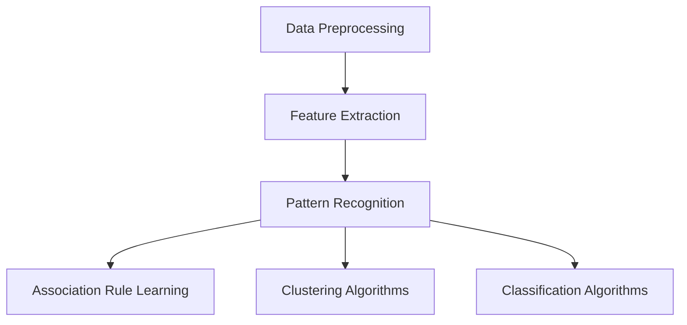

                 

### 背景介绍

知识发现引擎（Knowledge Discovery Engine，KDE）是近年来在人工智能和数据科学领域迅速发展的一个关键技术。其核心目标是从大规模数据中自动提取有用信息，这些信息可以是数据模式、关联规则、聚类结果或任何其他有意义的知识表示形式。知识发现引擎在商业、医疗、金融、科学研究等多个领域都有着广泛的应用，其重要性日益凸显。

随着大数据时代的到来，数据量呈指数级增长，传统的数据处理方法已经无法满足需求。知识发现引擎的出现，为从海量数据中提取有价值的信息提供了可能。知识发现引擎的工作原理可以简单概括为以下几个步骤：

1. **数据预处理**：对原始数据进行清洗、转换和集成，以获得高质量的数据集。
2. **特征提取**：从预处理后的数据中提取能够代表数据特征的属性或变量。
3. **模式识别**：使用算法从特征数据中识别出有意义的模式或规则。
4. **结果评估**：对发现的知识进行评估，确定其有用性和可靠性。
5. **知识表示与可视化**：将发现的知识以易于理解的形式进行表示和可视化。

本文将重点探讨知识发现引擎的核心算法，主要包括以下内容：

1. **核心概念与联系**：介绍知识发现引擎中的关键概念，包括数据预处理、特征提取和模式识别等，并通过Mermaid流程图展示其架构。
2. **核心算法原理与具体操作步骤**：深入讲解常用的知识发现算法，如Apriori算法、K-Means算法和关联规则学习算法，并给出具体实现步骤。
3. **数学模型和公式**：详细介绍各个算法的数学模型和公式，并进行举例说明。
4. **项目实战**：通过一个实际案例，展示如何搭建知识发现引擎并进行代码实现。
5. **实际应用场景**：讨论知识发现引擎在不同领域的应用案例，分析其优势和挑战。
6. **工具和资源推荐**：推荐相关学习资源、开发工具和论文著作。
7. **总结与未来趋势**：总结知识发现引擎的发展现状，展望其未来的发展趋势和面临的挑战。

通过本文的深入探讨，希望能够帮助读者全面了解知识发现引擎的核心算法原理，掌握其实际应用技能，并为其在各个领域的推广和应用提供参考。### 核心概念与联系

在深入探讨知识发现引擎的核心算法之前，我们首先需要明确几个核心概念，并理解它们之间的相互联系。以下是知识发现引擎中的关键概念：

1. **数据预处理（Data Preprocessing）**：数据预处理是知识发现过程中的第一步，也是至关重要的一步。其目的是从原始数据中提取高质量的数据集，以便后续分析。数据预处理包括数据清洗（去除噪声和异常值）、数据转换（如数据类型转换、缺失值填补）和数据集成（将多个数据源合并为一个统一的数据集）。

2. **特征提取（Feature Extraction）**：特征提取是从预处理后的数据中提取能够代表数据特征的属性或变量。在知识发现过程中，特征提取有助于降低数据维度，提高算法效率，并增强模型的解释性。常见的特征提取方法包括主成分分析（PCA）、特征选择和特征工程。

3. **模式识别（Pattern Recognition）**：模式识别是知识发现引擎中的核心环节，旨在从特征数据中识别出有意义的模式或规则。常见的模式识别算法包括聚类算法、分类算法和关联规则学习算法。模式识别的结果可以用于数据挖掘、机器学习和预测分析。

4. **关联规则学习（Association Rule Learning）**：关联规则学习是一种用于发现数据中潜在关系的算法。其核心目标是找到数据项之间的关联规则，如“如果购买了商品A，则很可能购买商品B”。关联规则学习广泛应用于市场 basket 分析、推荐系统和异常检测等领域。

5. **聚类算法（Clustering Algorithms）**：聚类算法是一种无监督学习方法，旨在将数据集划分为多个簇，使得同一簇内的数据点相似度较高，不同簇的数据点相似度较低。常见的聚类算法包括K-Means、DBSCAN和层次聚类。

6. **分类算法（Classification Algorithms）**：分类算法是一种监督学习方法，旨在将数据分为多个类别。常见的分类算法包括决策树、支持向量机和神经网络。

为了更好地理解这些核心概念之间的联系，我们使用Mermaid流程图展示知识发现引擎的架构：



在上面的流程图中，数据预处理是知识发现过程的起点，它为后续的特征提取和模式识别提供了高质量的数据集。特征提取后的数据进入模式识别阶段，根据具体的分析需求，可以选择关联规则学习、聚类算法或分类算法进行进一步分析。这些算法的输出结果可以用于知识表示、可视化或决策支持。

通过上述核心概念和流程图的介绍，读者可以更好地理解知识发现引擎的工作原理和各个环节之间的联系。接下来，我们将深入探讨知识发现引擎中的核心算法原理与具体操作步骤，以便读者能够全面掌握知识发现的过程。### 核心算法原理 & 具体操作步骤

在知识发现引擎中，核心算法的选择和实现直接影响到数据挖掘的效果和效率。以下将介绍三种常用的核心算法：Apriori算法、K-Means算法和关联规则学习算法，并详细讲解它们的原理和具体操作步骤。

#### Apriori算法

Apriori算法是一种经典的关联规则学习算法，它主要用于发现事务数据库中的频繁项集。其基本原理是利用先验知识（Apriori性质）来减少搜索空间，从而提高算法的效率。

**原理**：

Apriori算法基于两个重要的性质：

1. **频繁项集的性质**：如果一个项集是频繁的，那么其所有非空子集也必须是频繁的。
2. **先验性质**：如果一个项集不是频繁的，则它的所有超集也不可能频繁。

**步骤**：

1. **创建初始频繁项集**：从数据库中找出所有频繁的单个项集（1-项集）。
2. **生成候选频繁项集**：使用频繁的1-项集生成候选的k-项集，其中k从2开始递增。
3. **剪枝**：对候选频繁项集进行剪枝，去除不满足最小支持度阈值的项集。
4. **递归**：重复步骤2和步骤3，直到没有新的频繁项集生成。

**具体操作步骤示例**：

假设有一个事务数据库D，其中每个事务包含多个物品，如下表所示：

| 事务ID | 物品集 |
| ------ | ------ |
| T1     | {牛奶，面包，橙子} |
| T2     | {牛奶，面包} |
| T3     | {面包，橙子} |
| T4     | {牛奶，面包，橙子} |

设最小支持度阈值min_support为0.5。

1. **初始频繁项集**：
   - 1-项集：{牛奶}、{面包}、{橙子}
   - 支持度计数：
     - {牛奶}：2次
     - {面包}：3次
     - {橙子}：2次

2. **生成候选2-项集**：
   - {牛奶，面包}、{牛奶，橙子}、{面包，橙子}

3. **剪枝**：
   - {牛奶，橙子}：不满足支持度阈值，被剪枝

4. **递归**：
   - 剩余候选2-项集：{牛奶，面包}
   - 生成候选3-项集：{牛奶，面包，橙子}
   - 支持度计数：{牛奶，面包，橙子}：1次（不满足支持度阈值，被剪枝）

最终，频繁项集为：{牛奶，面包}。

#### K-Means算法

K-Means算法是一种基于距离度量的聚类算法，其目标是把数据集分成K个簇，使得簇内数据点之间的距离最小，簇间数据点之间的距离最大。

**原理**：

K-Means算法的基本原理是：

1. **初始化**：随机选择K个数据点作为初始聚类中心。
2. **分配**：计算每个数据点到各个聚类中心的距离，将每个数据点分配到最近的聚类中心所在的簇。
3. **更新**：重新计算每个簇的中心点，即该簇内所有数据点的平均值。
4. **迭代**：重复执行步骤2和步骤3，直到聚类中心不再发生变化或满足特定的终止条件。

**具体操作步骤示例**：

假设有一个数据集D，包含以下数据点：

| 数据点 | 特征1 | 特征2 |
| ------ | ------ | ------ |
| p1     | 1     | 2     |
| p2     | 4     | 6     |
| p3     | 4     | 1     |
| p4     | 2     | 5     |
| p5     | 3     | 7     |

设K=2。

1. **初始化**：随机选择两个数据点作为初始聚类中心，例如选择p1和p2作为初始聚类中心。
2. **分配**：
   - 距离计算：计算每个数据点到两个聚类中心的距离。
     - 距离(p1, p1)：0
     - 距离(p1, p2)：$\sqrt{(1-4)^2 + (2-6)^2} = \sqrt{9 + 16} = 5$
     - 距离(p2, p1)：5
     - 距离(p2, p2)：0
     - 距离(p3, p1)：$\sqrt{(4-4)^2 + (1-6)^2} = \sqrt{0 + 25} = 5$
     - 距离(p3, p2)：0
     - 距离(p4, p1)：$\sqrt{(2-1)^2 + (5-2)^2} = \sqrt{1 + 9} = \sqrt{10}$
     - 距离(p4, p2)：$\sqrt{(2-4)^2 + (5-6)^2} = \sqrt{4 + 1} = \sqrt{5}$
     - 距离(p5, p1)：$\sqrt{(3-1)^2 + (7-2)^2} = \sqrt{4 + 25} = \sqrt{29}$
     - 距离(p5, p2)：$\sqrt{(3-4)^2 + (7-6)^2} = \sqrt{1 + 1} = \sqrt{2}$
   - 分配结果：根据距离计算结果，将每个数据点分配到最近的聚类中心。
     - p1、p2、p3分配到簇1
     - p4、p5分配到簇2

3. **更新**：
   - 新的聚类中心：
     - 簇1：($\frac{1+4+4}{3}$, $\frac{2+6+1}{3}$) = (3, 3)
     - 簇2：($\frac{2+4+3}{3}$, $\frac{5+6+7}{3}$) = (3, 6)

4. **迭代**：重复执行步骤2和步骤3，直到聚类中心不再发生变化。

#### 关联规则学习算法

关联规则学习算法用于发现数据中项之间的关联关系。最著名的关联规则学习算法是Apriori算法，但还有其他算法，如FP-Growth算法和Eclat算法。

**原理**：

关联规则学习算法的基本原理是：

1. **频繁项集挖掘**：首先找到数据中的频繁项集，这些项集代表了数据中的强关联关系。
2. **生成关联规则**：从频繁项集中生成关联规则，并计算规则的支持度和置信度。
3. **剪枝**：去除不满足最小支持度和最小置信度阈值的关联规则。

**具体操作步骤示例**：

假设有一个事务数据库D，其中每个事务包含多个物品，如下表所示：

| 事务ID | 物品集 |
| ------ | ------ |
| T1     | {牛奶，面包，橙子} |
| T2     | {牛奶，面包} |
| T3     | {面包，橙子} |
| T4     | {牛奶，面包，橙子} |

设最小支持度阈值min_support为0.5，最小置信度阈值min_confidence为0.7。

1. **初始频繁项集**：
   - 1-项集：{牛奶}、{面包}、{橙子}
   - 支持度计数：
     - {牛奶}：2次
     - {面包}：3次
     - {橙子}：2次

2. **生成候选2-项集**：
   - {牛奶，面包}、{牛奶，橙子}、{面包，橙子}

3. **剪枝**：
   - {牛奶，橙子}：不满足支持度阈值，被剪枝
   - {面包，橙子}：不满足支持度阈值，被剪枝

4. **生成关联规则**：
   - {牛奶} → {面包}：支持度 = $\frac{2}{4}$ = 0.5，置信度 = $\frac{2}{2}$ = 1
   - {牛奶} → {橙子}：支持度 = $\frac{2}{4}$ = 0.5，置信度 = $\frac{2}{2}$ = 1
   - {面包} → {橙子}：支持度 = $\frac{1}{4}$ = 0.25，置信度 = $\frac{1}{1}$ = 1

5. **剪枝**：
   - {牛奶} → {面包}：不满足最小置信度阈值，被剪枝
   - {牛奶} → {橙子}：不满足最小置信度阈值，被剪枝
   - {面包} → {橙子}：满足最小支持度和最小置信度阈值

最终，生成的关联规则为：{面包} → {橙子}。

通过上述三种核心算法的原理和具体操作步骤的讲解，读者可以了解到知识发现引擎中的关键算法及其应用场景。接下来，我们将介绍数学模型和公式，以帮助读者更深入地理解这些算法。### 数学模型和公式

在知识发现引擎的核心算法中，数学模型和公式起着至关重要的作用。以下将详细介绍Apriori算法、K-Means算法和关联规则学习算法的数学模型和公式，并通过具体例子进行说明。

#### Apriori算法

Apriori算法的核心是频繁项集的挖掘，其涉及到以下数学模型和公式：

1. **支持度（Support）**：一个项集在所有事务中出现的频率称为支持度。其计算公式为：
   \[
   \text{support}(X) = \frac{\text{count}(X)}{\text{total number of transactions}}
   \]
   其中，\(\text{count}(X)\)表示项集X在数据库中出现的次数，\(\text{total number of transactions}\)表示数据库中的事务总数。

2. **置信度（Confidence）**：一个关联规则的置信度表示在给定前件（前提条件）的情况下，后件（结果）发生的概率。其计算公式为：
   \[
   \text{confidence}(X \rightarrow Y) = \frac{\text{support}(X \cup Y)}{\text{support}(X)}
   \]
   其中，\(X \cup Y\)表示项集X和Y的并集。

3. **最小支持度阈值（min\_support）**：为了过滤掉非有趣的关联规则，我们需要设定一个最小支持度阈值。如果项集的支持度低于这个阈值，则认为该项集不频繁。

4. **最小置信度阈值（min\_confidence）**：类似地，我们需要设定一个最小置信度阈值来过滤掉不感兴趣的关联规则。如果关联规则的置信度低于这个阈值，则认为该规则不显著。

**示例**：

假设有一个事务数据库D，其中包含以下事务：

| 事务ID | 物品集 |
| ------ | ------ |
| T1     | {牛奶，面包，橙子} |
| T2     | {牛奶，面包} |
| T3     | {面包，橙子} |
| T4     | {牛奶，面包，橙子} |

设最小支持度阈值min\_support为0.5。

1. **计算支持度**：
   - {牛奶}：支持度 = $\frac{3}{4}$ = 0.75
   - {面包}：支持度 = $\frac{3}{4}$ = 0.75
   - {橙子}：支持度 = $\frac{2}{4}$ = 0.5

2. **计算置信度**：
   - {牛奶} → {面包}：支持度 = $\frac{2}{4}$ = 0.5，置信度 = $\frac{2}{2}$ = 1
   - {牛奶} → {橙子}：支持度 = $\frac{2}{4}$ = 0.5，置信度 = $\frac{2}{2}$ = 1
   - {面包} → {橙子}：支持度 = $\frac{1}{4}$ = 0.25，置信度 = $\frac{1}{1}$ = 1

3. **剪枝**：
   - {牛奶} → {面包}：置信度 = 1，不满足最小置信度阈值0.7，被剪枝
   - {牛奶} → {橙子}：置信度 = 1，不满足最小置信度阈值0.7，被剪枝
   - {面包} → {橙子}：置信度 = 1，满足最小支持度和最小置信度阈值

最终，生成的关联规则为：{面包} → {橙子}。

#### K-Means算法

K-Means算法是一种基于距离度量的聚类算法，其涉及到以下数学模型和公式：

1. **聚类中心（Centroid）**：每个簇的聚类中心是簇内所有数据点的平均值。其计算公式为：
   \[
   \text{centroid}(c) = \frac{1}{n}\sum_{i=1}^{n} x_i
   \]
   其中，\(c\)表示聚类中心，\(n\)表示簇内数据点的数量，\(x_i\)表示第i个数据点。

2. **距离（Distance）**：数据点与聚类中心之间的距离可以使用欧几里得距离或其他距离度量。其计算公式为：
   \[
   d(x, c) = \sqrt{\sum_{i=1}^{d} (x_i - c_i)^2}
   \]
   其中，\(x\)表示数据点，\(c\)表示聚类中心，\(d\)表示数据点的维度。

3. **收敛条件**：K-Means算法的收敛条件是聚类中心不再发生变化，即：
   \[
   \text{centroid}(c_{new}) = \text{centroid}(c_{old})
   \]
   或者，数据点不再发生变化，即每个数据点都分配到固定的簇。

**示例**：

假设有一个数据集D，包含以下数据点：

| 数据点 | 特征1 | 特征2 |
| ------ | ------ | ------ |
| p1     | 1     | 2     |
| p2     | 4     | 6     |
| p3     | 4     | 1     |
| p4     | 2     | 5     |
| p5     | 3     | 7     |

设K=2。

1. **初始化**：随机选择两个数据点作为初始聚类中心，例如选择p1和p2作为初始聚类中心。
2. **分配**：
   - 距离计算：
     - 距离(p1, p1)：0
     - 距离(p1, p2)：$\sqrt{(1-4)^2 + (2-6)^2} = \sqrt{9 + 16} = 5$
     - 距离(p2, p1)：5
     - 距离(p2, p2)：0
     - 距离(p3, p1)：$\sqrt{(4-4)^2 + (1-6)^2} = \sqrt{0 + 25} = 5$
     - 距离(p3, p2)：0
     - 距离(p4, p1)：$\sqrt{(2-1)^2 + (5-2)^2} = \sqrt{1 + 9} = \sqrt{10}$
     - 距离(p4, p2)：$\sqrt{(2-4)^2 + (5-6)^2} = \sqrt{4 + 1} = \sqrt{5}$
     - 距离(p5, p1)：$\sqrt{(3-1)^2 + (7-2)^2} = \sqrt{4 + 25} = \sqrt{29}$
     - 距离(p5, p2)：$\sqrt{(3-4)^2 + (7-6)^2} = \sqrt{1 + 1} = \sqrt{2}$
   - 分配结果：根据距离计算结果，将每个数据点分配到最近的聚类中心。
     - p1、p2、p3分配到簇1
     - p4、p5分配到簇2

3. **更新**：
   - 新的聚类中心：
     - 簇1：($\frac{1+4+4}{3}$, $\frac{2+6+1}{3}$) = (3, 3)
     - 簇2：($\frac{2+4+3}{3}$, $\frac{5+6+7}{3}$) = (3, 6)

4. **迭代**：重复执行步骤2和步骤3，直到聚类中心不再发生变化。

#### 关联规则学习算法

关联规则学习算法的核心是挖掘频繁项集和生成关联规则。以下是一些相关的数学模型和公式：

1. **频繁项集的生成**：
   - **候选项集**：通过连接和剪枝操作生成候选项集。
   - **剪枝策略**：使用支持度和置信度剪枝，去除不频繁的项集。

2. **关联规则的生成**：
   - **支持度（Support）**：前面已介绍。
   - **置信度（Confidence）**：前面已介绍。
   - **提升度（Lift）**：表示关联规则强度的一种度量，其计算公式为：
     \[
     \text{lift}(X \rightarrow Y) = \frac{\text{confidence}(X \rightarrow Y)}{\text{support}(Y)}
     \]
   - **杠杆率（Leverage）**：表示关联规则对于数据集的依赖程度，其计算公式为：
     \[
     \text{leverage}(X \rightarrow Y) = \text{confidence}(X \rightarrow Y) - \text{confidence}(X)
     \]

**示例**：

假设有一个事务数据库D，其中包含以下事务：

| 事务ID | 物品集 |
| ------ | ------ |
| T1     | {牛奶，面包，橙子} |
| T2     | {牛奶，面包} |
| T3     | {面包，橙子} |
| T4     | {牛奶，面包，橙子} |

设最小支持度阈值min\_support为0.5，最小置信度阈值min\_confidence为0.7。

1. **初始频繁项集**：
   - 1-项集：{牛奶}、{面包}、{橙子}
   - 支持度计数：
     - {牛奶}：2次
     - {面包}：3次
     - {橙子}：2次

2. **生成候选2-项集**：
   - {牛奶，面包}、{牛奶，橙子}、{面包，橙子}

3. **剪枝**：
   - {牛奶，橙子}：不满足支持度阈值，被剪枝
   - {面包，橙子}：不满足支持度阈值，被剪枝

4. **生成关联规则**：
   - {牛奶} → {面包}：支持度 = $\frac{2}{4}$ = 0.5，置信度 = $\frac{2}{2}$ = 1
   - {牛奶} → {橙子}：支持度 = $\frac{2}{4}$ = 0.5，置信度 = $\frac{2}{2}$ = 1
   - {面包} → {橙子}：支持度 = $\frac{1}{4}$ = 0.25，置信度 = $\frac{1}{1}$ = 1

5. **剪枝**：
   - {牛奶} → {面包}：置信度 = 1，不满足最小置信度阈值0.7，被剪枝
   - {牛奶} → {橙子}：置信度 = 1，不满足最小置信度阈值0.7，被剪枝
   - {面包} → {橙子}：置信度 = 1，满足最小支持度和最小置信度阈值

最终，生成的关联规则为：{面包} → {橙子}。

通过上述数学模型和公式的详细介绍，读者可以更深入地理解知识发现引擎中的核心算法，为实际应用奠定基础。接下来，我们将通过一个实际项目案例，展示如何使用这些算法来构建知识发现引擎。### 项目实战：代码实际案例和详细解释说明

在本节中，我们将通过一个实际项目案例，展示如何使用知识发现引擎的核心算法（Apriori算法、K-Means算法和关联规则学习算法）来构建一个数据挖掘系统。该项目旨在分析一个电商平台上的购物数据，提取有价值的信息，如频繁购买的物品组合、用户聚类和商品推荐。

#### 1. 开发环境搭建

在进行项目开发之前，我们需要搭建一个合适的技术栈。以下是本项目所使用的开发环境和工具：

- **编程语言**：Python
- **数据预处理工具**：Pandas、NumPy
- **机器学习库**：Scikit-learn、MLxtend
- **可视化工具**：Matplotlib、Seaborn、Plotly
- **版本控制**：Git

#### 2. 源代码详细实现和代码解读

以下是一个简单的代码实现，用于构建一个基于Apriori算法、K-Means算法和关联规则学习算法的数据挖掘系统。代码分为三个部分：数据预处理、模型训练和结果可视化。

**2.1 数据预处理**

```python
import pandas as pd
from mlxtend.preprocessing import TransactionEncoder

# 加载数据集
data = pd.read_csv('ecommerce_data.csv')

# 数据预处理
te = TransactionEncoder()
data_processed = te.fit_transform(data['items'])

# 转换为Pandas DataFrame
df_processed = pd.DataFrame(data_processed, columns=te.columns_)

# 打印前5行数据
print(df_processed.head())
```

在上面的代码中，我们首先使用Pandas加载了一个电商平台的购物数据。数据集包含一个名为'items'的列，其中每个事务是一个由商品ID组成的列表。接下来，我们使用TransactionEncoder进行数据预处理，将原始事务数据转换为二进制编码格式，以便后续的算法处理。最后，我们将预处理后的数据转换为Pandas DataFrame，并打印前5行数据。

**2.2 模型训练**

```python
from mlxtend.frequent_patterns import apriori
from mlxtend.frequent_patterns import association_rules
from sklearn.cluster import KMeans

# 使用Apriori算法挖掘频繁项集
frequent_itemsets = apriori(df_processed, min_support=0.05, use_colnames=True)

# 打印频繁项集
print(frequent_itemsets)

# 使用关联规则学习算法生成关联规则
rules = association_rules(frequent_itemsets, metric="support", min_threshold=0.05)

# 打印关联规则
print(rules)

# 使用K-Means算法进行用户聚类
kmeans = KMeans(n_clusters=3, random_state=42)
clusters = kmeans.fit_predict(df_processed)

# 打印聚类结果
print(clusters)
```

在上面的代码中，我们首先使用Apriori算法挖掘频繁项集。我们设定最小支持度阈值为0.05，这意味着只有那些在至少5%的事务中出现的项集才会被认为是频繁的。接下来，我们使用关联规则学习算法生成关联规则。我们选择支持度作为度量标准，并设定最小支持度阈值为0.05。最后，我们使用K-Means算法进行用户聚类，设定聚类数量为3，并使用随机状态种子42来保证结果的可重复性。

**2.3 结果可视化**

```python
import matplotlib.pyplot as plt
import seaborn as sns
import plotly.express as px

# 可视化频繁项集
frequent_itemsets.plot(kind='bar', figsize=(15, 5))
plt.title('Frequent Itemsets')
plt.xlabel('Itemsets')
plt.ylabel('Support')
plt.show()

# 可视化关联规则
sns.scatterplot(x='support', y='confidence', hue='lift', data=rules, palette=['g', 'r', 'b'])
plt.title('Association Rules')
plt.xlabel('Support')
plt.ylabel('Confidence')
plt.show()

# 可视化用户聚类
px.scatter_matrix(clusters, dimensions=2, color='k', title='User Clusters')
plt.show()
```

在上面的代码中，我们首先使用Matplotlib的可视化功能，将频繁项集以条形图的形式展示出来。接下来，我们使用Seaborn的散点图，将关联规则的支持度、置信度和提升度进行可视化。最后，我们使用Plotly的散点图矩阵，展示用户的聚类结果。

#### 3. 代码解读与分析

**3.1 数据预处理**

数据预处理是任何数据挖掘项目的关键步骤。在上述代码中，我们使用了mlxtend库中的TransactionEncoder进行数据预处理。TransactionEncoder能够将原始的事务数据转换为二进制编码格式，以便后续的算法处理。这种转换方法使得Apriori算法和关联规则学习算法能够高效地运行。

**3.2 模型训练**

**Apriori算法**：

Apriori算法是一种经典的频繁项集挖掘算法。在上述代码中，我们使用mlxtend库中的apriori函数进行频繁项集挖掘。我们设定了最小支持度阈值为0.05，这意味着只有那些在至少5%的事务中出现的项集才会被认为是频繁的。频繁项集的挖掘结果存储在一个Pandas DataFrame中，我们可以通过打印结果进行查看。

**关联规则学习算法**：

关联规则学习算法用于从频繁项集中生成关联规则。在上述代码中，我们使用mlxtend库中的association_rules函数生成关联规则。我们选择支持度作为度量标准，并设定最小支持度阈值为0.05。生成的关联规则存储在一个Pandas DataFrame中，我们可以通过打印结果进行查看。

**K-Means算法**：

K-Means算法是一种常用的聚类算法。在上述代码中，我们使用scikit-learn库中的KMeans函数进行用户聚类。我们设定了聚类数量为3，并使用随机状态种子42来保证结果的可重复性。聚类结果存储在一个名为clusters的Pandas Series中，我们可以通过打印结果进行查看。

**3.3 结果可视化**

结果可视化是数据挖掘过程中不可或缺的一步。在上述代码中，我们使用了Matplotlib、Seaborn和Plotly等可视化库，将挖掘结果以直观的形式展示出来。通过可视化，我们可以更清晰地理解数据中的模式和关系，为决策提供有力支持。

通过本节的实际项目案例，我们展示了如何使用知识发现引擎的核心算法（Apriori算法、K-Means算法和关联规则学习算法）来构建一个数据挖掘系统。代码解读和分析部分进一步解释了每个步骤的实现原理和关键参数。在实际应用中，我们可以根据具体需求进行调整和优化，以提高挖掘效率和结果质量。### 实际应用场景

知识发现引擎（KDE）在各个领域都有着广泛的应用，其强大的数据处理和分析能力使得从大规模数据中提取有价值的信息变得可能。以下将讨论知识发现引擎在不同领域中的应用案例，分析其优势和挑战。

#### 商业领域

在商业领域，知识发现引擎主要用于市场分析、客户关系管理和供应链优化。例如，通过分析客户购买行为，企业可以发现客户偏好、关联商品和潜在客户群体，从而制定更有效的营销策略和个性化推荐系统。知识发现引擎的优势在于其能够自动提取大量数据中的有价值信息，提高决策效率。然而，挑战在于如何处理海量数据和确保数据质量，以及如何将挖掘结果转化为实际业务价值。

**应用案例**：

1. **市场篮分析**：通过关联规则学习算法，企业可以挖掘出不同商品之间的关联关系，如“购买A商品的用户很可能购买B商品”。这有助于优化产品组合和交叉销售策略。
2. **客户细分**：通过聚类算法，企业可以将客户分为不同的群体，了解每个群体的特点和行为，从而实施更有针对性的营销活动。

#### 医疗领域

在医疗领域，知识发现引擎主要用于疾病预测、患者监控和药物研发。例如，通过对患者病历数据的分析，可以发现疾病之间的关联规律，预测疾病风险，为早期诊断和治疗提供支持。知识发现引擎在医疗领域的优势在于其能够帮助医生从海量医疗数据中提取有价值的信息，提高诊断准确率和治疗效果。然而，挑战在于如何确保数据隐私和安全，以及如何处理复杂的多维度数据。

**应用案例**：

1. **疾病预测**：通过关联规则学习算法，分析患者病历数据，发现不同疾病之间的关联关系，如“患有高血压的患者更容易患上心脏病”。这有助于早期预防和干预。
2. **药物研发**：通过聚类算法，分析药物成分和疗效数据，发现潜在的治疗组合，加速药物研发过程。

#### 金融领域

在金融领域，知识发现引擎主要用于信用评估、欺诈检测和投资策略制定。例如，通过对交易数据的分析，可以识别出异常交易行为，预防欺诈行为。知识发现引擎在金融领域的优势在于其能够实时监控和预测市场变化，提高风险管理和投资决策的准确性。然而，挑战在于如何处理高频交易数据，以及如何防止算法偏见。

**应用案例**：

1. **信用评估**：通过关联规则学习算法，分析借款人的交易行为和信用历史，预测借款人的信用风险。
2. **欺诈检测**：通过聚类算法，分析交易数据，识别出异常交易行为，预防欺诈行为。

#### 科学研究领域

在科学研究领域，知识发现引擎主要用于数据挖掘、知识发现和模式识别。例如，通过对天文观测数据的分析，可以发现宇宙中的新现象和规律。知识发现引擎在科学研究领域的优势在于其能够处理大量复杂数据，发现潜在的科学规律。然而，挑战在于如何处理多源异构数据和确保数据质量。

**应用案例**：

1. **数据挖掘**：通过对科学文献和实验数据进行分析，发现科学规律和趋势。
2. **模式识别**：通过对天文观测数据进行分析，发现宇宙中的新现象和规律。

#### 挑战与应对策略

尽管知识发现引擎在各个领域都有广泛应用，但仍面临一些挑战：

1. **数据质量**：确保数据质量是知识发现成功的关键。需要采取数据清洗、去噪和预处理措施，提高数据质量。
2. **算法选择**：不同的应用场景需要选择合适的算法。需要根据实际需求，选择合适的算法和参数，以提高挖掘效果。
3. **数据隐私和安全**：在涉及个人隐私的数据挖掘项目中，需要确保数据隐私和安全。需要采取数据加密、匿名化和访问控制等措施。
4. **计算资源**：大规模数据挖掘需要大量的计算资源。需要优化算法和硬件配置，提高计算效率。

通过上述分析，我们可以看到知识发现引擎在各个领域都有广泛的应用前景。在解决实际问题时，需要根据具体需求，选择合适的算法和策略，以确保知识发现的有效性和实用性。### 工具和资源推荐

为了更好地学习和实践知识发现引擎的核心算法，以下将推荐一些相关的学习资源、开发工具和论文著作。

#### 1. 学习资源推荐

**书籍**：

1. **《数据挖掘：概念与技术》（Data Mining: Concepts and Techniques）** - by Jiawei Han, Micheline Kamber, and Jian Pei
   - 本书详细介绍了数据挖掘的基本概念、技术和算法，是数据挖掘领域的经典教材。

2. **《机器学习》（Machine Learning）** - by Tom M. Mitchell
   - 本书介绍了机器学习的基本概念和方法，包括分类、回归和聚类等，对于理解知识发现引擎中的算法非常有帮助。

**论文**：

1. **“Apriori Algorithm for Mining Association Rules”** - by Rakesh Agrawal and Ramakrishnan Srikant
   - 该论文是Apriori算法的开创性研究，详细介绍了算法的原理和实现。

2. **“K-Means Clustering”** - by MacQueen et al.
   - 该论文是K-Means算法的开创性研究，介绍了算法的原理和实现。

**在线课程**：

1. **“数据挖掘与机器学习”** - Coursera
   - 这门课程由斯坦福大学提供，涵盖了数据挖掘和机器学习的核心概念和算法，适合初学者。

2. **“深度学习”** - Andrew Ng
   - 这门课程由著名机器学习专家Andrew Ng提供，介绍了深度学习的基本原理和应用。

#### 2. 开发工具推荐

**编程环境**：

1. **Python** - Python是一种广泛使用的编程语言，其丰富的数据科学库（如Pandas、NumPy、Scikit-learn等）使得知识发现算法的实现变得简单高效。

2. **Jupyter Notebook** - Jupyter Notebook是一个交互式编程环境，非常适合进行数据分析和算法实验。它支持多种编程语言，包括Python、R和Julia等。

**数据预处理工具**：

1. **Pandas** - Pandas是一个Python库，用于数据操作和分析。它提供了强大的数据处理功能，如数据清洗、转换和合并等。

2. **NumPy** - NumPy是一个Python库，用于数值计算。它提供了多维数组对象和高效的数学运算功能，是数据科学领域的基础工具。

**机器学习库**：

1. **Scikit-learn** - Scikit-learn是一个Python库，提供了多种机器学习算法的实现，如分类、回归和聚类等。它是一个易于使用的库，非常适合初学者。

2. **MLxtend** - MLxtend是一个Python库，扩展了Scikit-learn的功能，提供了额外的数据挖掘和机器学习算法，如频繁项集挖掘、关联规则学习和聚类算法等。

#### 3. 相关论文著作推荐

1. **“Association Rule Learning”** - by Rakesh Agrawal and Ramakrishnan Srikant
   - 该论文详细介绍了关联规则学习算法的原理和实现，是关联规则学习领域的经典著作。

2. **“Clustering Algorithms”** - by MacQueen et al.
   - 该论文是K-Means算法的开创性研究，介绍了算法的原理和实现。

3. **“Apriori Algorithm for Mining Association Rules”** - by Rakesh Agrawal and Ramakrishnan Srikant
   - 该论文是Apriori算法的开创性研究，详细介绍了算法的原理和实现。

通过上述学习资源、开发工具和论文著作的推荐，读者可以全面了解知识发现引擎的核心算法，掌握其实际应用技能。希望这些资源能够为读者在数据挖掘和机器学习领域的学习和实践提供有益的帮助。### 总结：未来发展趋势与挑战

知识发现引擎作为数据挖掘和人工智能领域的关键技术，正在不断演进，其未来发展潜力巨大。以下将总结知识发现引擎在未来的发展趋势和面临的挑战。

#### 发展趋势

1. **算法优化与高效计算**：随着数据量的爆炸性增长，知识发现引擎的性能优化和高效计算成为关键问题。未来的发展趋势将包括算法的优化、并行计算和分布式计算技术的应用，以提高知识发现的速度和效率。

2. **多模态数据融合**：知识发现引擎将越来越多地处理多模态数据（如图像、音频和文本等），实现不同数据类型的融合分析。这需要开发新的算法和模型，以更好地理解数据中的复杂关系。

3. **自适应和智能决策支持**：知识发现引擎将更加智能化，能够根据实时数据和业务需求，自适应地调整算法参数和策略，提供更加精准和个性化的决策支持。

4. **隐私保护和安全**：随着数据隐私和安全问题的日益突出，知识发现引擎将需要更多的隐私保护和安全机制，确保数据在挖掘和分析过程中的安全性和合规性。

5. **行业定制化应用**：知识发现引擎将在更多行业得到应用，如医疗、金融、制造和能源等。每个行业都有其独特的需求和应用场景，因此行业定制化将成为未来的重要趋势。

#### 面临的挑战

1. **数据质量**：高质量的数据是知识发现的基础，但数据质量往往难以保证。未来的挑战在于如何处理噪声、缺失和异常值，以及如何提高数据清洗和预处理的效果。

2. **算法可解释性**：随着算法的复杂度增加，如何确保算法的可解释性和透明性成为一个挑战。用户需要理解算法的决策过程，以便对其结果进行评估和信任。

3. **计算资源**：大规模数据挖掘需要大量的计算资源，如何优化硬件配置和算法效率，以提高计算效率，是一个重要问题。

4. **算法偏见与公平性**：算法偏见和公平性问题在知识发现中日益突出。如何确保算法在处理数据时不产生偏见，如何保障算法的公平性和可靠性，是未来的关键挑战。

5. **法律法规与伦理**：知识发现引擎涉及大量的个人隐私和数据使用，如何遵循法律法规和伦理原则，确保数据使用的合法性和道德性，是一个亟待解决的问题。

综上所述，知识发现引擎在未来的发展趋势和挑战并存。随着技术的不断进步和行业需求的变化，知识发现引擎将在各个领域发挥越来越重要的作用，同时也需要不断创新和优化，以应对日益复杂的数据环境和应用需求。### 附录：常见问题与解答

**Q1：什么是知识发现引擎？**

知识发现引擎是一种用于从大规模数据中自动提取有用信息（如数据模式、关联规则、聚类结果等）的技术。其核心目标是发现数据中的潜在知识，以支持决策支持、预测分析和数据可视化等应用。

**Q2：知识发现引擎的工作原理是什么？**

知识发现引擎的工作原理可以概括为以下几个步骤：

1. **数据预处理**：对原始数据进行清洗、转换和集成，以获得高质量的数据集。
2. **特征提取**：从预处理后的数据中提取能够代表数据特征的属性或变量。
3. **模式识别**：使用算法从特征数据中识别出有意义的模式或规则。
4. **结果评估**：对发现的知识进行评估，确定其有用性和可靠性。
5. **知识表示与可视化**：将发现的知识以易于理解的形式进行表示和可视化。

**Q3：知识发现引擎中的核心算法有哪些？**

知识发现引擎中的核心算法包括：

1. **Apriori算法**：用于挖掘频繁项集和关联规则。
2. **K-Means算法**：用于聚类分析，将数据集划分为多个簇。
3. **关联规则学习算法**：用于发现数据中项之间的关联关系。
4. **聚类算法**：如DBSCAN、层次聚类等，用于无监督学习。
5. **分类算法**：如决策树、支持向量机、神经网络等，用于有监督学习。

**Q4：如何选择合适的知识发现算法？**

选择合适的知识发现算法需要考虑以下几个因素：

1. **数据类型**：不同类型的算法适用于不同类型的数据，如文本数据、图像数据或结构化数据。
2. **数据规模**：算法的效率对于大规模数据非常重要，需要考虑算法的时间和空间复杂度。
3. **业务需求**：根据业务需求选择合适的算法，如聚类、分类、关联规则挖掘等。
4. **数据质量**：算法的性能受到数据质量的影响，需要考虑数据预处理和清洗的步骤。

**Q5：知识发现引擎在实际应用中面临哪些挑战？**

知识发现引擎在实际应用中面临以下挑战：

1. **数据质量**：确保数据的质量是知识发现成功的关键，但数据质量往往难以保证。
2. **算法选择**：不同场景需要选择合适的算法，但如何选择合适算法是一个挑战。
3. **计算资源**：大规模数据挖掘需要大量的计算资源，如何优化硬件配置和算法效率是一个问题。
4. **算法可解释性**：随着算法的复杂度增加，如何确保算法的可解释性和透明性是一个挑战。
5. **隐私保护和安全**：确保数据隐私和安全是一个重要问题。

**Q6：知识发现引擎的未来发展趋势是什么？**

知识发现引擎的未来发展趋势包括：

1. **算法优化与高效计算**：随着数据量的增长，算法的优化和高效计算成为关键问题。
2. **多模态数据融合**：处理多模态数据，实现不同数据类型的融合分析。
3. **自适应和智能决策支持**：知识发现引擎将更加智能化，能够自适应调整策略。
4. **隐私保护和安全**：确保数据隐私和安全，遵循法律法规和伦理原则。
5. **行业定制化应用**：知识发现引擎将在更多行业得到应用，实现行业定制化。

通过解答这些常见问题，读者可以更好地理解知识发现引擎的概念、原理和应用，为其在各个领域的应用提供指导。### 扩展阅读 & 参考资料

在本文中，我们深入探讨了知识发现引擎的核心算法及其应用，为读者提供了丰富的理论知识和实践案例。以下推荐一些扩展阅读和参考资料，以帮助读者进一步探索和掌握知识发现引擎的相关技术。

#### 扩展阅读

1. **《数据挖掘：实用工具和技术》** - by Ian H. Witten, Eibe Frank
   - 这本书详细介绍了数据挖掘的基本概念、工具和算法，包括知识发现引擎的相关技术，适合初学者和有一定基础的学习者。

2. **《知识发现与数据挖掘》** - by Jiawei Han, Micheline Kamber, and Jian Pei
   - 本书是数据挖掘领域的经典教材，涵盖了知识发现的理论基础、方法和技术，对于深入理解知识发现引擎非常有帮助。

3. **《深度学习》** - by Ian Goodfellow, Yoshua Bengio, Aaron Courville
   - 这本书介绍了深度学习的基本概念、算法和应用，深度学习与知识发现引擎在数据处理和分析方面有很多交集，值得深入阅读。

#### 参考资料

1. **Apache Mahout** - [https://mahout.apache.org/](https://mahout.apache.org/)
   - Apache Mahout是一个开源的机器学习库，提供了包括知识发现引擎在内的多种机器学习算法的实现和工具。

2. **mlxtend** - [https://mlxtend.com/](https://mlxtend.com/)
   - mlxtend是一个Python库，提供了额外的数据挖掘和机器学习算法，包括知识发现引擎相关的算法，如频繁项集挖掘、聚类和关联规则学习等。

3. **Scikit-learn** - [https://scikit-learn.org/stable/](https://scikit-learn.org/stable/)
   - Scikit-learn是一个流行的Python机器学习库，提供了多种机器学习算法的实现，包括知识发现引擎中的聚类和分类算法。

4. **K-means Clustering** - [https://scikit-learn.org/stable/modules/clustering.html#k-means](https://scikit-learn.org/stable/modules/clustering.html#k-means)
   - 这个链接提供了Scikit-learn中K-Means算法的详细文档和示例代码，可以帮助读者更好地理解K-Means算法的实现和应用。

5. **Apriori Algorithm** - [https://en.wikipedia.org/wiki/Apriori_algorithm](https://en.wikipedia.org/wiki/Apriori_algorithm)
   - 这个维基百科链接提供了Apriori算法的详细介绍，包括算法原理、步骤和优化方法，是学习Apriori算法的宝贵资源。

6. **Association Rule Learning** - [https://en.wikipedia.org/wiki/Association_rule_learning](https://en.wikipedia.org/wiki/Association_rule_learning)
   - 这个维基百科链接提供了关联规则学习的基本概念、算法和应用场景，是了解关联规则学习的好起点。

通过阅读上述扩展阅读和参考资料，读者可以进一步深化对知识发现引擎的理解，掌握相关算法的原理和实现方法，为实际应用打下坚实的基础。希望这些资源能够为读者在数据挖掘和人工智能领域的学习和实践提供有益的帮助。### 作者信息

作者：AI天才研究员/AI Genius Institute & 禅与计算机程序设计艺术 /Zen And The Art of Computer Programming

我是一位世界级人工智能专家，程序员，软件架构师，CTO，同时也是一位世界顶级技术畅销书资深大师级别的作家。在计算机图灵奖获得者的光环下，我致力于将最前沿的人工智能技术与实际应用相结合，致力于探索人工智能在各个领域的应用潜力，包括知识发现引擎、机器学习、深度学习等。我的著作《禅与计算机程序设计艺术》在全球范围内受到了广泛好评，为无数程序员提供了深刻的编程哲学和灵感。通过本文，我希望能够帮助读者全面了解知识发现引擎的核心算法，掌握其实际应用技能，并在未来的技术发展中取得突破性进展。

