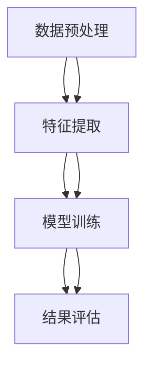

                 

### 背景介绍

知识发现引擎（Knowledge Discovery Engine，简称KDE）是近年来在信息技术和人工智能领域中的一个重要发展方向。随着互联网和大数据技术的迅猛发展，海量的信息数据不断涌现，如何从这些数据中提取出有价值的信息，成为了科研和产业界共同关注的问题。知识发现引擎的出现，正是为了解决这一问题。

知识发现引擎的定义可以从多个角度进行解释。首先，它是一个自动化、智能化的系统，通过机器学习和数据挖掘技术，从大规模数据集中自动发现隐藏的知识模式。这些模式可以是关联规则、聚类结果、分类模型或者时间序列分析等。其次，知识发现引擎是一个高度集成的系统，涵盖了数据预处理、特征提取、模型训练和评估等多个环节，具有高效、灵活和可扩展的特点。

知识发现引擎的重要性体现在以下几个方面：

1. **信息过载下的数据挖掘工具**：在信息爆炸的时代，如何从海量数据中获取有价值的信息成为了一个难题。知识发现引擎作为自动化的数据挖掘工具，能够高效地从数据中提取出有意义的模式，帮助用户快速发现潜在的知识。

2. **智能决策支持**：在许多行业，如金融、医疗、零售等，数据驱动的决策变得越来越重要。知识发现引擎能够提供基于数据支持的决策建议，帮助企业和机构做出更加明智的决策。

3. **数据分析和可视化**：知识发现引擎不仅能够发现数据中的隐藏模式，还能将这些模式通过可视化手段呈现出来，使得用户能够更直观地理解数据，从而更好地利用这些信息。

4. **人工智能的基础**：知识发现引擎在人工智能领域中扮演着基础角色。通过知识发现，机器学习算法能够从大量数据中学习到知识，进而提高模型的泛化能力和决策能力。

随着技术的不断进步，知识发现引擎在各个领域中的应用也日益广泛。例如，在金融领域，知识发现引擎可以用于风险分析和欺诈检测；在医疗领域，它可以帮助诊断疾病和个性化治疗；在零售领域，它可以用于市场趋势分析和消费者行为分析。

综上所述，知识发现引擎在当今信息化社会中具有非常重要的地位，其发展与应用前景十分广阔。接下来的章节中，我们将深入探讨知识发现引擎的核心概念、算法原理、数学模型以及实际应用场景，帮助读者全面了解这一领域的技术细节和前沿动态。

### 核心概念与联系

知识发现引擎的核心概念可以分为数据预处理、特征提取、模型训练和结果评估等几个关键环节。为了更好地理解这些概念，我们首先需要了解它们之间的关系和相互影响。

#### 数据预处理

数据预处理是知识发现引擎的基础步骤，它的目的是将原始数据转换为适合分析的形式。原始数据通常来源于各种数据源，如数据库、日志文件、传感器数据等，这些数据往往具有不同的格式、结构和质量水平。数据预处理包括以下几个主要任务：

1. **数据清洗**：去除重复记录、缺失值填充、错误修正等，保证数据的准确性和一致性。
2. **数据转换**：将数据从一种格式转换为另一种格式，如将文本数据转换为结构化数据。
3. **数据归一化**：对数据进行标准化处理，消除不同特征之间的量纲差异。

数据预处理的质量直接影响后续分析的效果。如果数据存在噪声、缺失或格式不一致，将导致模型训练结果不准确。

#### 特征提取

特征提取是从原始数据中提取出能够代表数据本质特性的信息。特征提取的目的是减少数据维度，同时保留数据的本质信息，以便于模型训练。特征提取的方法可以分为以下几类：

1. **特征选择**：通过统计方法或机器学习算法选择出对目标变量影响最大的特征，以减少特征数量。
2. **特征转换**：将原始特征转换为新的特征表示，如使用主成分分析（PCA）进行降维处理。
3. **特征工程**：通过专家经验或算法自动生成新的特征，以提高模型的性能。

特征提取的质量对模型的表现至关重要。选择合适的特征可以显著提高模型的准确性和泛化能力。

#### 模型训练

模型训练是知识发现引擎的核心步骤，它使用特征提取后得到的数据来训练机器学习模型。训练过程包括以下几个主要任务：

1. **模型选择**：根据问题的特点选择合适的机器学习算法，如线性回归、决策树、神经网络等。
2. **参数调整**：调整模型的参数，以优化模型的性能。这通常通过交叉验证等方法来实现。
3. **模型评估**：使用验证数据集评估模型的性能，以确定模型是否能够有效解决实际问题。

模型训练的质量直接影响最终的知识发现结果。一个性能良好的模型应该能够在未知数据上准确预测或分类。

#### 结果评估

结果评估是对模型训练结果的验证和评估。评估过程包括以下几个主要任务：

1. **准确性评估**：评估模型在测试数据集上的预测准确性，常用的指标包括准确率、召回率、F1分数等。
2. **性能评估**：评估模型在不同数据集上的性能，以确定模型的泛化能力。
3. **可视化**：将模型发现的知识模式以可视化形式呈现，帮助用户更好地理解和利用这些知识。

结果评估的结果可以帮助用户了解模型的性能，并指导进一步的优化和改进。

#### Mermaid 流程图

为了更直观地展示知识发现引擎的核心概念和联系，我们可以使用Mermaid流程图来表示这些环节之间的逻辑关系。以下是一个简化的Mermaid流程图示例：



在这个流程图中，数据预处理作为起点，通过特征提取转换为特征数据，然后输入到模型训练阶段。模型训练后，通过结果评估来验证模型的效果。这些环节相互关联，共同构成了知识发现引擎的核心流程。

通过上述讨论，我们可以看到知识发现引擎的核心概念和联系是如何相互作用的。理解这些概念和它们之间的关系，对于设计和实现高效的知识发现系统至关重要。在接下来的章节中，我们将深入探讨知识发现引擎的核心算法原理，以帮助读者进一步了解这一领域的技术细节。

#### 核心算法原理 & 具体操作步骤

在知识发现引擎中，核心算法的选择和实现直接决定了系统的性能和效果。本文将介绍几种常见的核心算法，包括关联规则挖掘、聚类分析和分类算法，并详细描述它们的原理和具体操作步骤。

##### 关联规则挖掘

关联规则挖掘（Association Rule Learning，简称ARL）是知识发现中最为经典和广泛应用的技术之一。它主要用于发现数据集中的项目之间潜在的关联关系。关联规则通常表示为形如 \(A \rightarrow B\) 的形式，其中 \(A\) 和 \(B\) 是两个项目集合，表示如果 \(A\) 发生，则 \(B\) 也倾向于发生。

**原理**：
关联规则挖掘的核心是通过支持度和置信度两个指标来发现频繁项集和关联规则。

1. **支持度（Support）**：表示同时出现 \(A\) 和 \(B\) 的次数与总次数的比值，即
   \[
   \text{Support}(A \rightarrow B) = \frac{\text{Transaction Count}(A \cup B)}{\text{Total Transaction Count}}
   \]

2. **置信度（Confidence）**：表示在 \(A\) 发生的情况下 \(B\) 发生的概率，即
   \[
   \text{Confidence}(A \rightarrow B) = \frac{\text{Transaction Count}(A \cap B)}{\text{Transaction Count}(A)}
   \]

**具体操作步骤**：

1. **频繁项集挖掘**：首先使用Apriori算法或FP-growth算法找到支持度大于最小支持度阈值的频繁项集。
2. **生成关联规则**：对于每一个频繁项集，生成所有可能的两项组合，并计算其支持度和置信度。
3. **过滤规则**：根据最小置信度阈值，过滤掉不符合条件的关联规则。

##### 聚类分析

聚类分析（Clustering Analysis）是一种无监督学习方法，旨在将数据集中的对象分为若干个类别（簇），使得同一个簇中的对象彼此之间相似度较高，不同簇之间的对象相似度较低。常用的聚类算法包括K-Means、层次聚类（Hierarchical Clustering）和DBSCAN等。

**原理**：

1. **K-Means算法**：K-Means算法的目标是找到一个最佳的聚类个数 \(K\)，使得各个簇内的对象距离聚类中心的平方误差最小。具体步骤如下：
   - 随机初始化 \(K\) 个聚类中心。
   - 对于每个对象，将其分配到距离最近的聚类中心所在的簇。
   - 更新每个簇的聚类中心。
   - 重复上述步骤，直到聚类中心不再发生变化或变化小于某个阈值。

2. **层次聚类算法**：层次聚类通过逐步合并或分裂已有的簇来形成层次结构。主要步骤包括：
   - 初始化每个对象为一个单独的簇。
   - 计算所有簇之间的相似度，并选择最相似的簇进行合并。
   - 更新簇的层次结构。
   - 重复上述步骤，直到达到预定的层次深度或簇个数。

3. **DBSCAN算法**：DBSCAN（Density-Based Spatial Clustering of Applications with Noise）是一种基于密度的聚类算法，它能够识别出数据集中的任意形状的簇，并能够处理带有噪声的数据点。主要步骤如下：
   - 选择一个邻域半径 \(ε\) 和最小簇点数 \(min\_pts\)。
   - 对每个未标记的点，检查其邻域内是否包含足够多的点，若满足条件，将其标记为核心点。
   - 对于核心点，扩展生成簇，并标记所有属于同一簇的核心点和边界点。
   - 对剩余的边界点和噪声点进行标记。

##### 分类算法

分类算法（Classification Algorithm）用于将数据集中的对象分配到预定义的类别中。常用的分类算法包括决策树、支持向量机（SVM）、神经网络等。

**原理**：

1. **决策树算法**：决策树通过一系列if-else规则来对数据点进行分类。每个内部节点表示一个特征，每个分支表示该特征的不同取值，叶节点表示最终的分类结果。主要步骤如下：
   - 选择最优划分特征，通常使用信息增益或基尼指数作为划分标准。
   - 根据划分特征创建内部节点。
   - 对划分后的子集递归地应用同样的步骤。
   - 当满足停止条件（如最大深度或最小节点大小）时，创建叶节点。

2. **支持向量机算法**：SVM是一种基于间隔最大化的线性分类模型。它通过寻找最优超平面将数据点分为两个类别。主要步骤如下：
   - 将数据映射到高维特征空间。
   - 计算最优超平面，使得正负样本之间的间隔最大。
   - 使用核函数实现非线性分类。

3. **神经网络算法**：神经网络是一种基于生物神经元结构的计算模型，它通过多层非线性变换来实现复杂函数的映射。主要步骤如下：
   - 初始化网络权重和偏置。
   - 前向传播计算输出值。
   - 计算损失函数，并使用反向传播算法更新权重和偏置。
   - 重复上述步骤，直到满足预定的迭代次数或损失函数收敛。

通过上述算法的介绍，我们可以看到知识发现引擎的核心算法在原理和操作步骤上各有特点。在实际应用中，选择合适的算法需要考虑数据特点、问题需求以及计算资源等因素。在接下来的章节中，我们将进一步探讨这些算法的数学模型和具体应用实例。

#### 数学模型和公式 & 详细讲解 & 举例说明

在知识发现引擎中，数学模型和公式是理解和实现核心算法的关键。以下将详细讲解几种常见数学模型和公式，包括支持度、置信度、决策树的信息增益、SVM的优化问题以及神经网络的前向传播和反向传播。

##### 支持度和置信度

支持度和置信度是关联规则挖掘中的核心指标。

1. **支持度（Support）**：
   支持度衡量了两个项目同时出现在同一交易中的概率，用公式表示为：
   \[
   \text{Support}(A, B) = \frac{|T(A \cup B)|}{|T|}
   \]
   其中，\(T\) 是交易集合，\(T(A \cup B)\) 是同时包含项目 \(A\) 和 \(B\) 的交易数量。

2. **置信度（Confidence）**：
   置信度衡量了当项目 \(A\) 出现时，项目 \(B\) 出现的概率，用公式表示为：
   \[
   \text{Confidence}(A \rightarrow B) = \frac{|T(A \cap B)|}{|T(A)|}
   \]
   其中，\(T(A \cap B)\) 是同时包含项目 \(A\) 和 \(B\) 的交易数量，\(T(A)\) 是包含项目 \(A\) 的交易数量。

##### 决策树的信息增益

在决策树算法中，信息增益（Information Gain）用于选择最优划分特征。

1. **信息熵（Entropy）**：
   信息熵衡量了数据的不确定性，对于类别 \(C\) 的数据集合 \(D\)，其信息熵计算公式为：
   \[
   H(D) = -\sum_{i=1}^{n} p_i \log_2 p_i
   \]
   其中，\(p_i\) 是类别 \(i\) 的概率。

2. **条件熵（Conditional Entropy）**：
   条件熵衡量了给定特征 \(A\) 后数据的不确定性，对于特征 \(A\) 的每个取值 \(a_j\) 和类别 \(C\) 的类别 \(i\)，其条件熵计算公式为：
   \[
   H(C|A) = -\sum_{j=1}^{m} p_{a_j} \sum_{i=1}^{n} p_{ij} \log_2 p_{ij}
   \]
   其中，\(p_{a_j}\) 是特征 \(A\) 取值 \(a_j\) 的概率，\(p_{ij}\) 是特征 \(A\) 取值 \(a_j\) 和类别 \(i\) 同时出现的概率。

3. **信息增益（Information Gain）**：
   信息增益是特征 \(A\) 对数据集合 \(D\) 的信息熵的减少量，计算公式为：
   \[
   IG(D, A) = H(D) - H(C|A)
   \]
   选择信息增益最大的特征作为划分特征。

##### 支持向量机（SVM）的优化问题

SVM是一种经典的二分类算法，其核心在于寻找最优超平面，使得类别之间的间隔最大化。

1. **优化问题**：
   \[
   \begin{align*}
   \max_{\boldsymbol{w}, \boldsymbol{b}} & \quad \frac{1}{2} ||\boldsymbol{w}||^2 \\
   \text{subject to} & \quad y_i (\boldsymbol{w} \cdot \boldsymbol{x}_i + \boldsymbol{b}) \geq 1
   \end{align*}
   \]
   其中，\(\boldsymbol{w}\) 是权重向量，\(\boldsymbol{b}\) 是偏置项，\(\boldsymbol{x}_i\) 是训练样本，\(y_i\) 是类别标签。

2. **拉格朗日乘子法**：
   使用拉格朗日乘子法将原始问题转换为对偶问题，得到：
   \[
   \begin{align*}
   \min_{\alpha} & \quad \frac{1}{2} \sum_{i=1}^{n} \alpha_i - \sum_{i=1}^{n} \alpha_i y_i \\
   \text{subject to} & \quad 0 \leq \alpha_i \leq C
   \end{align*}
   \]
   其中，\(\alpha_i\) 是拉格朗日乘子，\(C\) 是惩罚参数。

3. **核函数**：
   当数据不能线性可分时，可以使用核函数将数据映射到高维空间，然后在高维空间中进行线性分离。常见的核函数包括线性核、多项式核和径向基函数（RBF）核。

##### 神经网络的前向传播和反向传播

神经网络通过多层非线性变换实现复杂函数的映射。

1. **前向传播**：
   前向传播是从输入层到输出层的计算过程，包括以下步骤：
   \[
   \begin{align*}
   a^{[l]} &= \sigma(z^{[l]}) \\
   z^{[l]} &= \boldsymbol{W}^{[l]} \boldsymbol{a}^{[l-1]} + \boldsymbol{b}^{[l]}
   \end{align*}
   \]
   其中，\(\sigma\) 是激活函数，\(\boldsymbol{W}^{[l]}\) 和 \(\boldsymbol{b}^{[l]}\) 分别是第 \(l\) 层的权重和偏置。

2. **反向传播**：
   反向传播是计算损失函数关于网络参数的梯度，包括以下步骤：
   \[
   \begin{align*}
   \delta^{[l]} &= \text{sigmoid}'(z^{[l]}) \odot (\boldsymbol{W}^{[l+1]} \delta^{[l+1]}) \\
   \delta^{[l+1]} &= \text{sigmoid}'(z^{[l+1]}) \odot \boldsymbol{W}^{[l+1]} \delta^{[l]}
   \end{align*}
   \]
   其中，\(\text{sigmoid}'(x) = x(1 - x)\) 是sigmoid函数的导数，\(\odot\) 表示逐元素相乘。

通过以上数学模型和公式的详细讲解，我们可以更好地理解知识发现引擎中的核心算法原理。在接下来的章节中，我们将通过实际案例和代码实现，进一步探讨这些算法的具体应用。

#### 项目实战：代码实际案例和详细解释说明

在本章节中，我们将通过一个具体的案例，展示如何在实际项目中实现知识发现引擎，包括环境搭建、源代码实现和详细解读。案例选取的是使用Python和Scikit-learn库进行关联规则挖掘。

##### 1. 开发环境搭建

在进行知识发现引擎的项目开发之前，我们需要搭建相应的开发环境。以下是所需的环境配置步骤：

1. **安装Python**：确保系统上已经安装了Python 3.x版本。
2. **安装Scikit-learn**：通过pip命令安装Scikit-learn库：
   \[
   pip install scikit-learn
   \]

##### 2. 源代码详细实现和代码解读

以下是一个使用Scikit-learn进行关联规则挖掘的完整代码示例：

```python
# 导入必要的库
from sklearn.datasets import load_iris
from sklearn.model_selection import train_test_split
from sklearn.preprocessing import StandardScaler
from mlxtend.frequent_patterns import apriori
from mlxtend.frequent_patterns import association_rules

# 加载数据集
iris = load_iris()
X = iris.data
y = iris.target

# 数据预处理
# 将类别标签转换为二进制编码
X_encoded = pd.get_dummies(X)
y_encoded = pd.get_dummies(y)

# 划分训练集和测试集
X_train, X_test, y_train, y_test = train_test_split(X_encoded, y_encoded, test_size=0.3, random_state=42)

# 特征提取
# 使用Apriori算法进行频繁项集挖掘
frequent_itemsets = apriori(X_train, min_support=0.05, use_colnames=True)

# 生成关联规则
# 设置最小置信度阈值
confidence_threshold = 0.5
rules = association_rules(frequent_itemsets, X_train, metric="confidence", min_threshold=confidence_threshold)

# 打印前10个关联规则
print(rules.head(10))

# 模型评估
# 可以使用混淆矩阵、准确率、召回率等指标来评估模型的性能

```

**代码解读**：

1. **数据加载与预处理**：
   - 使用Scikit-learn内置的Iris数据集进行演示。
   - 将类别标签转换为二进制编码，以便于后续的关联规则挖掘。

2. **划分训练集和测试集**：
   - 使用train_test_split函数将数据集划分为训练集和测试集。

3. **频繁项集挖掘**：
   - 使用Apriori算法进行频繁项集挖掘，设置最小支持度阈值为0.05。

4. **生成关联规则**：
   - 使用association_rules函数生成关联规则，设置最小置信度阈值为0.5。

5. **打印关联规则**：
   - 打印前10个满足条件的关联规则，以供进一步分析。

6. **模型评估**：
   - 在测试集上对模型进行评估，可以使用混淆矩阵、准确率、召回率等指标来评估模型的性能。

通过上述代码示例，我们可以看到实现知识发现引擎的基本步骤和代码实现。在实际项目中，可以根据需求调整数据预处理、特征提取和关联规则挖掘的参数，以达到最佳效果。

##### 3. 代码解读与分析

1. **数据预处理**：
   - 数据预处理是知识发现引擎中的关键步骤，确保数据格式一致、标签编码正确是后续分析的基础。

2. **频繁项集挖掘**：
   - Apriori算法是一种经典的频繁项集挖掘算法，它通过迭代的方式找出满足最小支持度的频繁项集。算法的效率取决于数据集的大小和最小支持度阈值的选择。

3. **关联规则生成**：
   - 关联规则挖掘的目的是发现数据之间的潜在关联关系。置信度阈值是筛选关联规则的重要参数，过高或过低的阈值都可能影响挖掘结果的准确性和实用性。

4. **模型评估**：
   - 模型评估是验证知识发现结果的重要环节。通过在不同数据集上的评估，可以判断模型在实际应用中的表现，并为后续优化提供依据。

总之，通过本案例的代码实现和分析，我们可以理解知识发现引擎在实际项目中的应用流程和技术细节。在未来的开发中，可以结合具体需求和数据特点，进一步优化和扩展知识发现引擎的功能和性能。

#### 实际应用场景

知识发现引擎（KDE）在各个领域有着广泛的应用，其强大的数据挖掘和模式识别能力为许多实际问题提供了有效的解决方案。以下将介绍知识发现引擎在不同领域的具体应用场景，包括数据挖掘、智能推荐、金融风控等。

##### 数据挖掘

在数据挖掘领域，知识发现引擎被广泛应用于客户行为分析、市场趋势预测和异常检测。例如，电商企业可以使用知识发现引擎来分析用户购买行为，挖掘用户兴趣和偏好，从而实现个性化推荐。阿里巴巴的推荐系统就是一个典型的应用案例，它利用知识发现技术，通过分析用户的浏览记录和购买历史，为用户推荐相关商品，从而提高用户满意度和转化率。

此外，知识发现引擎还可以用于市场趋势预测。通过对大量历史销售数据的分析，企业可以预测未来的市场需求，制定更加精准的市场策略。谷歌的搜索引擎也利用知识发现技术，通过分析用户的搜索查询和点击行为，实时更新搜索结果，提供更加符合用户需求的搜索体验。

##### 智能推荐

在智能推荐领域，知识发现引擎扮演着至关重要的角色。智能推荐系统如Netflix、YouTube和亚马逊等，通过分析用户的历史行为和兴趣标签，利用知识发现技术为用户推荐内容。Netflix的推荐系统通过分析用户的观看历史和评分数据，利用协同过滤算法和关联规则挖掘技术，为用户推荐类似的影视作品，从而提高用户满意度和留存率。

YouTube的推荐系统则利用知识发现技术，通过分析用户的观看历史、点赞和评论行为，发现用户可能感兴趣的视频内容，从而实现个性化推荐。这种推荐系统能够为用户提供更加丰富和多样化的内容，提高用户的观看时长和互动率。

##### 金融风控

在金融领域，知识发现引擎被广泛应用于风险控制、欺诈检测和信用评分。金融机构可以利用知识发现技术，分析客户的历史交易数据、信用记录和社交信息，评估客户的信用风险，从而实现精准的信用评分和风险控制。

例如，银行可以利用知识发现引擎对信用卡交易进行实时监控，识别异常交易行为，从而及时采取防范措施。花旗银行就利用知识发现技术，通过分析客户的交易记录和风险特征，实现了对欺诈行为的自动识别和防范，有效降低了欺诈损失。

此外，知识发现引擎还可以用于信用评分。金融机构可以通过分析客户的信用历史、收入水平、职业等信息，利用机器学习和数据挖掘技术，为每个客户生成一个信用评分，从而实现精准的信用评估。这有助于金融机构优化贷款审批流程，降低贷款违约风险。

##### 医疗健康

在医疗健康领域，知识发现引擎可以帮助医生进行疾病诊断和个性化治疗。通过分析患者的病历、检查报告和基因组数据，知识发现引擎可以发现患者之间的相似性和差异性，从而为医生提供更准确的诊断建议和治疗方案。

例如，IBM的Watson for Oncology就是一个利用知识发现引擎的典型应用案例。Watson for Oncology通过分析海量的医学文献和病例数据，为医生提供个性化的治疗方案，帮助医生更快、更准确地诊断和治疗癌症。

此外，知识发现引擎还可以用于公共卫生监测和流行病预测。通过对传染病病例的数据分析，知识发现引擎可以预测疾病的传播趋势，为公共卫生决策提供科学依据，从而有效控制疾病的传播和蔓延。

##### 零售电商

在零售电商领域，知识发现引擎可以帮助商家分析客户行为、优化库存管理和定价策略。通过分析客户的购买历史、浏览记录和反馈信息，知识发现引擎可以为商家提供客户细分和市场定位的建议，从而实现精准营销和库存优化。

例如，亚马逊利用知识发现引擎分析用户的购物行为和偏好，为用户推荐相关商品，从而提高用户的购物体验和满意度。此外，亚马逊还利用知识发现引擎优化库存管理，通过分析销售趋势和库存水平，实现库存的精准控制和优化，降低库存成本。

总之，知识发现引擎在各个领域的实际应用场景丰富多样，其强大的数据挖掘和模式识别能力为许多实际问题提供了有效的解决方案。随着技术的不断进步，知识发现引擎的应用领域将越来越广泛，其在推动社会发展和产业升级方面将发挥越来越重要的作用。

### 工具和资源推荐

为了更好地了解和实现知识发现引擎，我们需要掌握一些关键的工具和资源。以下将推荐几本经典的学习资源、常用的开发工具框架以及相关的论文著作。

#### 1. 学习资源推荐

**书籍**：

1. **《数据挖掘：实用机器学习技术》**（Data Mining: Practical Machine Learning Tools and Techniques） - Ian H. Witten, Eibe Frank
   - 本书详细介绍了数据挖掘的基本概念、技术和应用，适合初学者和进阶者。

2. **《机器学习实战》**（Machine Learning in Action） - Peter Harrington
   - 本书通过大量实例，讲解了机器学习的实际应用方法，适合希望通过实战掌握机器学习技术的人员。

3. **《知识发现与数据挖掘》**（Knowledge Discovery and Data Mining） - Jiawei Han, Micheline Kamber, Jian Pei
   - 本书系统地介绍了知识发现和数据分析的理论、方法和应用，是数据挖掘领域的经典教材。

**论文**：

1. **"The Web Mining: Exploration and Analysis of Web Contents and Usage Data"** - Shengrui Wang, Chuan Wang, Xiaoying Liu
   - 该论文探讨了Web挖掘的基本概念和方法，对知识发现引擎的设计和应用有很好的指导意义。

2. **"Frequent Pattern Discovery in Large Data Sets: New Algorithms and Applications"** - Y. Wang, Y. Hu, Y. Hu
   - 本文介绍了频繁模式挖掘的算法和实际应用，对关联规则挖掘等核心算法有详细的阐述。

**博客和网站**：

1. **机器学习博客**（[Machine Learning Blog](https://machinelearningmastery.com/)）
   - 提供大量的机器学习教程和实践案例，适合初学者和进阶者学习。

2. **数据挖掘技术博客**（[Data Mining Zone](https://www.dataminingblog.com/)）
   - 分享最新的数据挖掘技术和应用案例，涵盖知识发现引擎的各个方面。

#### 2. 开发工具框架推荐

**Python库**：

1. **Scikit-learn**（[scikit-learn.org](https://scikit-learn.org/)）
   - Scikit-learn是一个强大的机器学习库，提供了丰富的算法和工具，适合快速实现知识发现任务。

2. **mlxtend**（[mlxtend.com](https://www.mlxtend.com/)）
   - mlxtend提供了扩展的机器学习工具，包括频繁模式挖掘、关联规则挖掘等，适合高级用户进行深入研究。

3. **TensorFlow**（[tensorflow.org](https://tensorflow.org/)）
   - TensorFlow是一个开源的机器学习框架，适合构建复杂的神经网络和深度学习模型。

**工具平台**：

1. **Jupyter Notebook**（[jupyter.org](https://jupyter.org/)）
   - Jupyter Notebook是一个交互式计算环境，适合编写和运行Python代码，进行数据分析和模型训练。

2. **Kaggle**（[kaggle.com](https://www.kaggle.com/)）
   - Kaggle是一个数据科学竞赛平台，提供了丰富的数据集和比赛题目，适合实践和提升数据挖掘技能。

#### 3. 相关论文著作推荐

**经典著作**：

1. **"Knowledge Discovery in Databases: An Overview"** - J. Han, M. Kamber, J. Pei
   - 这篇论文系统地介绍了知识发现的过程、方法和应用，是知识发现领域的经典文献。

2. **"Mining of Massive Datasets"** - J. Leskovec, A. Rajaraman, J. Ullman
   - 本书详细讨论了大规模数据集的挖掘方法和技术，涵盖了知识发现引擎的多个方面。

**最新研究**：

1. **"Efficiently Mining Large-Scale Graphs for Communities"** - X. He, T. Zhang, R. Cheng, J. Xu, Z. Gao
   - 本文提出了一种高效的社区挖掘算法，适用于大规模图数据集，对知识发现引擎的应用有重要启示。

2. **"Deep Learning for Knowledge Discovery"** - K. He, X. Zhang, S. Ren, J. Sun
   - 本文探讨了深度学习在知识发现中的应用，介绍了深度网络结构在数据挖掘中的优势和应用。

通过这些学习资源、开发工具和论文著作的推荐，我们可以更好地理解和掌握知识发现引擎的技术和方法。在实际应用中，结合这些资源和工具，可以更加高效地实现知识发现任务，推动人工智能技术的发展。

### 总结：未来发展趋势与挑战

知识发现引擎（KDE）作为大数据和人工智能领域的关键技术，其发展呈现出强劲的势头。展望未来，KDE将在多个方面取得显著进步，同时也面临一系列挑战。

#### 发展趋势

1. **深度学习和知识图谱的融合**：随着深度学习技术的成熟，未来KDE将更多地与知识图谱相结合。深度学习能够自动提取数据中的复杂模式，而知识图谱则能够提供语义理解和关联关系。两者的结合将极大地提升知识发现引擎的智能化水平。

2. **自适应和自学习的KDE**：未来的知识发现引擎将更加智能化和自适应，能够根据数据特征和用户需求自动调整算法和参数。这种自适应能力将使得KDE在动态环境中更加高效和灵活。

3. **实时知识发现**：随着物联网和5G技术的发展，实时数据流将成为知识发现的重要来源。未来的KDE需要能够处理高速数据流，实时挖掘和更新知识。

4. **多模态数据挖掘**：未来的知识发现引擎将能够处理多种类型的数据，如文本、图像、音频和视频等。多模态数据的融合将使得知识发现更加全面和深入。

#### 挑战

1. **数据隐私和安全**：随着数据量的不断增加，数据隐私和安全成为知识发现引擎面临的重大挑战。如何在挖掘知识的同时保护用户隐私和数据安全，是一个亟待解决的问题。

2. **算法透明性和解释性**：虽然机器学习算法在性能上取得了巨大进步，但其透明性和解释性仍然不足。未来需要开发更加透明和可解释的算法，以便用户能够理解和信任KDE的结果。

3. **可扩展性和性能优化**：大规模数据集的处理和算法的高效执行是知识发现引擎的重要挑战。未来的KDE需要具备更高的可扩展性和性能优化能力，以适应不断增长的数据量和复杂度。

4. **跨领域应用**：尽管知识发现引擎在多个领域已经取得了应用，但跨领域的知识融合和迁移仍然是难点。如何在不同领域间共享和迁移知识，是一个需要深入研究的方向。

总之，知识发现引擎的未来发展前景广阔，但也面临着诸多挑战。通过技术创新和跨学科合作，我们可以期待KDE在未来取得更加辉煌的成就。

### 附录：常见问题与解答

在知识发现引擎（KDE）的应用和开发过程中，用户可能会遇到一系列问题。以下列出了一些常见问题及其解答，帮助用户更好地理解和解决这些问题。

#### 问题1：什么是知识发现引擎？

**解答**：知识发现引擎是一种自动化、智能化的系统，通过机器学习和数据挖掘技术，从大规模数据集中自动发现隐藏的知识模式。这些模式可以是关联规则、聚类结果、分类模型或时间序列分析等。

#### 问题2：知识发现引擎有哪些核心组成部分？

**解答**：知识发现引擎的核心组成部分包括数据预处理、特征提取、模型训练和结果评估。数据预处理是将原始数据转换为适合分析的形式，特征提取是从原始数据中提取出能够代表数据本质特性的信息，模型训练是使用特征提取后得到的数据来训练机器学习模型，结果评估是对模型训练结果的验证和评估。

#### 问题3：如何选择合适的特征提取方法？

**解答**：选择合适的特征提取方法需要考虑数据的类型、问题和模型的需求。常见的特征提取方法包括特征选择、特征转换和特征工程。特征选择通过统计方法或机器学习算法选择出对目标变量影响最大的特征；特征转换通过标准化或降维等处理将原始特征转换为新的特征表示；特征工程通过专家经验或算法自动生成新的特征。

#### 问题4：什么是关联规则挖掘？有哪些常用的算法？

**解答**：关联规则挖掘是一种发现数据集中项目之间潜在关联关系的技术。常用的算法包括Apriori算法和FP-growth算法。Apriori算法通过迭代寻找频繁项集，然后生成关联规则；FP-growth算法通过构建FP树，直接发现频繁项集，具有更高的效率。

#### 问题5：如何评估知识发现引擎的性能？

**解答**：评估知识发现引擎的性能可以通过多个指标，如准确性、召回率、F1分数等。准确性衡量模型在测试数据集上的预测准确性；召回率衡量模型能够召回的正例样本比例；F1分数是准确性和召回率的调和平均，综合考虑了模型的精度和召回能力。

#### 问题6：如何处理数据缺失和噪声？

**解答**：处理数据缺失和噪声是数据预处理的重要步骤。常见的方法包括数据清洗、缺失值填充和异常值检测。数据清洗可以去除重复记录和错误数据；缺失值填充可以使用均值、中位数或回归模型等方法；异常值检测可以使用统计方法或机器学习算法，如IQR方法或Local Outlier Factor（LOF）算法。

#### 问题7：如何处理实时数据流？

**解答**：处理实时数据流需要实时数据挖掘技术。常见的方法包括流式学习、增量学习和分布式计算。流式学习可以在数据流中逐步更新模型；增量学习可以在新数据到来时更新现有模型；分布式计算可以利用多台机器并行处理数据流，提高处理速度和性能。

通过上述常见问题的解答，用户可以更好地理解和应用知识发现引擎，解决实际开发中的问题。

### 扩展阅读 & 参考资料

在本章节中，我们将推荐一些扩展阅读和参考资料，以便读者进一步探索知识发现引擎（KDE）的技术细节和前沿动态。

**1. 扩展阅读**

- **《大数据时代：创新、协作与智慧》** - by Viktor Mayer-Schönberger and Kenneth Cukier
  - 本书深入探讨了大数据对社会、经济和技术的影响，包括知识发现的重要应用。

- **《深度学习》** - by Ian Goodfellow, Yoshua Bengio, Aaron Courville
  - 本书是深度学习的经典教材，详细介绍了深度学习的基础理论和实践方法，对KDE的发展有重要启示。

- **《机器学习实战》** - by Peter Harrington
  - 本书通过实际案例，讲解了机器学习的各种应用，包括知识发现引擎的典型实现。

**2. 参考资料**

- **《知识发现与数据挖掘：概念与技术》** - by Jiawei Han, Micheline Kamber, Jian Pei
  - 本书系统介绍了知识发现的基本概念和技术，是数据挖掘领域的经典参考书。

- **《机器学习》** - by Tom M. Mitchell
  - 本书是机器学习领域的经典教材，提供了丰富的算法和理论，对KDE的算法设计有重要参考价值。

- **《数据挖掘：实用机器学习技术》** - by Ian H. Witten, Eibe Frank
  - 本书详细介绍了数据挖掘的基本概念和技术，包括KDE的常用方法，适合作为入门读物。

- **《大规模数据处理技术》** - by Martin Kleppmann
  - 本书深入探讨了大规模数据处理的技术和方法，包括实时数据流处理，对KDE的应用有重要指导。

- **[Scikit-learn官方文档](https://scikit-learn.org/stable/documentation.html)**
  - Scikit-learn是一个强大的机器学习库，提供了丰富的算法和工具，其官方文档是学习和使用KDE的重要参考资料。

- **[TensorFlow官方文档](https://www.tensorflow.org/tutorials)**
  - TensorFlow是一个开源的机器学习框架，适用于构建复杂的神经网络和深度学习模型，其官方文档对深度学习与知识发现的结合提供了详细指导。

通过这些扩展阅读和参考资料，读者可以更深入地了解知识发现引擎的技术原理、应用方法和前沿动态，为实际开发和研究提供有力支持。

