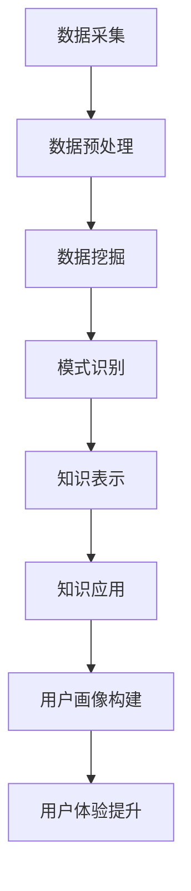

                 

# 知识发现引擎的用户画像分析

## 关键词：
- 知识发现引擎
- 用户画像
- 数据挖掘
- 机器学习
- 数据分析

## 摘要：
本文深入探讨了知识发现引擎在构建用户画像方面的应用。我们将通过详细的步骤和分析，阐述知识发现引擎的核心概念，探讨其在用户画像分析中的具体算法原理和操作步骤。同时，我们将通过数学模型和实际代码案例，展示知识发现引擎在构建用户画像中的实际应用，并讨论其在不同场景下的应用前景。最后，我们将总结知识发现引擎在未来发展中的挑战与机遇。

## 1. 背景介绍

在互联网时代，用户数据已经成为企业宝贵的资产。通过对用户数据的深入挖掘和分析，企业可以更好地了解用户需求，优化产品和服务，提高用户满意度。用户画像作为一种重要的数据分析工具，能够将用户的基本信息、行为数据、兴趣偏好等信息进行整合和分析，形成对用户全面、细致的描述。而知识发现引擎（Knowledge Discovery Engine，KDE）作为一种先进的数据挖掘工具，能够在海量的用户数据中快速提取有价值的信息，为用户画像的构建提供强有力的支持。

知识发现引擎的核心在于“知识发现”，即从大量数据中自动发现隐藏的模式、趋势和关联关系。知识发现引擎通常包括以下几个关键组件：

1. **数据采集**：从各种数据源（如数据库、日志文件、传感器数据等）收集数据。
2. **数据预处理**：对采集到的数据进行清洗、转换和整合，以便后续分析。
3. **数据挖掘**：利用各种算法对预处理后的数据进行分析，发现数据中的模式和关联。
4. **知识表示**：将挖掘出的知识以结构化的形式表示出来，如规则、模式、图表等。
5. **知识应用**：将知识应用于实际问题，如用户画像、市场分析、风险控制等。

用户画像的构建是知识发现引擎在商业领域的典型应用之一。通过对用户数据的挖掘和分析，企业可以构建出不同维度、不同层次的用户画像，从而更好地理解用户，提供个性化的服务和产品推荐。

## 2. 核心概念与联系

### 2.1 知识发现引擎的概念

知识发现引擎是一种基于数据挖掘和机器学习的工具，它能够从大规模数据集中发现隐藏的模式、关联和趋势。知识发现引擎的核心概念包括：

- **数据源**：数据源的多样性和数据量是知识发现的关键。
- **数据预处理**：数据预处理包括数据清洗、转换、整合等步骤，以保证数据的质量和一致性。
- **数据挖掘算法**：常见的知识发现算法包括分类、聚类、关联规则挖掘、异常检测等。
- **模式识别**：通过算法分析，从数据中发现具有统计意义和业务价值的模式。
- **知识表示**：将发现的模式以可视化或结构化的形式表示出来，便于进一步分析和应用。

### 2.2 用户画像的概念

用户画像是指通过对用户的基本信息、行为数据、兴趣偏好等多维度数据的整合和分析，形成的对用户全面、细致的描述。用户画像的核心概念包括：

- **用户属性**：包括用户的基本信息（如年龄、性别、地域等）和行为数据（如浏览记录、购买记录、评论等）。
- **用户分类**：根据用户属性和行为特征，将用户分为不同的群体，如新用户、活跃用户、潜在客户等。
- **用户兴趣**：通过分析用户的行为数据，推断用户的兴趣偏好，如喜欢什么类型的商品、喜欢什么类型的娱乐内容等。
- **用户标签**：为用户打上各种标签，便于进一步分析和应用。

### 2.3 知识发现引擎与用户画像的联系

知识发现引擎与用户画像之间存在着密切的联系：

- **知识发现引擎为用户画像提供技术支持**：知识发现引擎能够从大规模用户数据中快速、准确地提取有价值的信息，为用户画像的构建提供数据基础。
- **用户画像为知识发现提供目标导向**：用户画像的构建目标是为了更好地了解用户，为用户提供个性化的服务和产品推荐。知识发现引擎的分析结果将直接应用于用户画像的优化和完善。
- **知识发现引擎和用户画像共同提升用户体验**：通过对用户数据的深入挖掘和分析，知识发现引擎和用户画像都能够帮助企业和平台更好地理解用户，提供个性化的服务和产品推荐，从而提升用户体验。

### 2.4 Mermaid 流程图

以下是知识发现引擎在构建用户画像中的核心流程的 Mermaid 流程图：



在上述流程中，数据采集、数据预处理、数据挖掘、模式识别和知识表示是知识发现引擎的核心步骤，而知识应用、用户画像构建和用户体验提升则是知识发现引擎在构建用户画像中的具体应用和目标。

## 3. 核心算法原理 & 具体操作步骤

### 3.1 数据采集

数据采集是知识发现引擎的第一步，也是构建用户画像的基础。数据采集的过程通常包括以下几个方面：

- **数据源选择**：根据业务需求和用户画像的目标，选择合适的数据源，如用户数据库、日志文件、第三方数据平台等。
- **数据采集方式**：根据数据源的特点，选择合适的数据采集方式，如批量导入、实时采集、爬虫等。
- **数据质量监控**：在数据采集过程中，需要监控数据的质量，如数据完整性、一致性、准确性等。

### 3.2 数据预处理

数据预处理是保证数据质量和一致性的关键步骤。数据预处理的过程通常包括以下几个方面：

- **数据清洗**：去除数据中的错误、重复和无关信息，确保数据的准确性。
- **数据转换**：将不同格式的数据转换为统一的格式，如将文本数据转换为结构化数据。
- **数据整合**：将来自不同数据源的数据进行整合，形成统一的用户数据集。

### 3.3 数据挖掘

数据挖掘是知识发现引擎的核心步骤，通过数据挖掘算法，可以从大规模用户数据中提取有价值的信息。数据挖掘的过程通常包括以下几个方面：

- **特征选择**：从用户数据中提取出能够代表用户特征的属性，如年龄、性别、地域等。
- **算法选择**：根据用户画像的目标和用户数据的特征，选择合适的算法，如分类、聚类、关联规则挖掘等。
- **模型训练**：利用数据挖掘算法，对用户数据进行训练，构建预测模型。

### 3.4 模式识别

模式识别是数据挖掘的结果分析阶段，通过对训练出的模型进行分析，可以发现用户数据中的隐藏模式、关联和趋势。模式识别的过程通常包括以下几个方面：

- **模式提取**：从训练出的模型中提取出具有统计意义和业务价值的模式。
- **模式评估**：对提取出的模式进行评估，确定其重要性和实用性。
- **模式优化**：根据评估结果，对模式进行优化和调整，提高模式的准确性。

### 3.5 知识表示

知识表示是将挖掘出的模式以结构化的形式表示出来，便于进一步分析和应用。知识表示的过程通常包括以下几个方面：

- **可视化表示**：将模式以图表、图像等形式进行可视化表示，如用户分布图、用户行为热力图等。
- **结构化表示**：将模式以结构化的形式表示，如规则库、知识库等。
- **知识应用**：将知识应用于实际问题，如用户画像、市场分析、风险控制等。

### 3.6 用户画像构建

用户画像构建是知识发现引擎在构建用户画像中的具体应用。通过知识发现引擎的分析结果，可以构建出不同维度、不同层次的用户画像，为企业和平台提供用户数据的深入理解和应用。用户画像构建的过程通常包括以下几个方面：

- **用户分类**：根据用户特征和行为，将用户分为不同的群体，如新用户、活跃用户、潜在客户等。
- **用户标签**：为用户打上各种标签，便于进一步分析和应用。
- **用户画像更新**：根据用户的最新行为和特征，实时更新用户画像，保持其准确性和实时性。

### 3.7 用户体验提升

用户体验提升是知识发现引擎在构建用户画像中的最终目标。通过用户画像的分析和应用，企业和平台可以更好地理解用户，提供个性化的服务和产品推荐，从而提升用户体验。用户体验提升的过程通常包括以下几个方面：

- **个性化推荐**：根据用户的兴趣偏好和需求，为用户提供个性化的产品推荐。
- **个性化营销**：根据用户的购买历史和行为，为用户提供个性化的营销策略。
- **个性化服务**：根据用户的需求和行为，为用户提供个性化的服务，如客户支持、售后服务等。

## 4. 数学模型和公式 & 详细讲解 & 举例说明

### 4.1 数学模型

在构建用户画像的过程中，常用的数学模型包括分类模型、聚类模型和关联规则模型。以下是这些模型的详细讲解和举例说明。

#### 4.1.1 分类模型

分类模型是一种将数据集中的样本分为不同类别的模型。常见的分类模型包括逻辑回归、支持向量机（SVM）和决策树等。

- **逻辑回归**：

  $$ P(y=1|X) = \frac{1}{1 + e^{-(\beta_0 + \beta_1 X_1 + \beta_2 X_2 + \ldots + \beta_n X_n})} $$

  其中，$X$ 是特征向量，$y$ 是类别标签，$\beta_0$、$\beta_1$、$\beta_2$、...、$\beta_n$ 是模型参数。

- **支持向量机**：

  $$ \max_{\beta, \beta^*} \frac{1}{2} \sum_{i=1}^n (\beta_i - \beta^*)^2 + C \sum_{i=1}^n \xi_i $$

  其中，$\beta$ 和 $\beta^*$ 是模型参数，$C$ 是惩罚参数，$\xi_i$ 是松弛变量。

- **决策树**：

  决策树的构建过程是通过递归划分特征空间，将数据集划分为不同的区域。每个区域的类别标签作为该区域的输出。

#### 4.1.2 聚类模型

聚类模型是一种将数据集中的样本分为不同簇的模型。常见的聚类模型包括K均值、层次聚类和DBSCAN等。

- **K均值**：

  $$ \min_{\mu_1, \mu_2, \ldots, \mu_k} \sum_{i=1}^n \sum_{j=1}^k (x_i - \mu_j)^2 $$

  其中，$x_i$ 是数据集中的第 $i$ 个样本，$\mu_j$ 是第 $j$ 个簇的中心。

- **层次聚类**：

  层次聚类的构建过程是通过逐步合并或分裂簇，构建出一个层次结构的聚类模型。

- **DBSCAN**：

  $$ \min_{\epsilon, \minPts} \sum_{i=1}^n \sum_{j=1}^n (p_i - p_j)^2 $$

  其中，$\epsilon$ 是邻域半径，$\minPts$ 是最小邻域点数。

#### 4.1.3 关联规则模型

关联规则模型是一种发现数据集中不同变量之间关联关系的模型。常见的关联规则模型包括Apriori算法和FP-Growth算法。

- **Apriori算法**：

  $$ \text{Support}(X, Y) = \frac{\text{支持数}(X \cup Y)}{\text{总样本数}} $$

  $$ \text{Confidence}(X \rightarrow Y) = \frac{\text{支持数}(X \cup Y)}{\text{支持数}(X)} $$

  其中，$X$ 和 $Y$ 是两个项集，$\text{支持数}(X \cup Y)$ 是包含 $X$ 和 $Y$ 的交易数，$\text{总样本数}$ 是数据集中的样本总数。

- **FP-Growth算法**：

  $$ \text{频繁项集} = \{X \subseteq \text{项集} | \text{支持数}(X) \geq \text{最小支持度}\} $$

  $$ \text{关联规则} = \{X \rightarrow Y | \text{置信度}(X \rightarrow Y) \geq \text{最小置信度}\} $$

### 4.2 举例说明

以下是一个简单的用户画像分析案例，通过分类模型来预测用户的购买行为。

#### 4.2.1 数据集

假设我们有一个包含用户特征和购买行为的数据集，其中用户特征包括年龄、收入、职业和地域，购买行为包括购买过哪些商品。

#### 4.2.2 特征选择

通过数据分析，我们选择以下特征进行分类模型训练：

- 年龄
- 收入
- 职业类别
- 地域

#### 4.2.3 模型选择

我们选择逻辑回归作为分类模型，通过训练数据集，得到以下模型参数：

$$ P(y=1|X) = \frac{1}{1 + e^{-(2.5 + 0.1 \times \text{年龄} + 0.2 \times \text{收入} + 0.3 \times \text{职业类别} + 0.4 \times \text{地域})}} $$

#### 4.2.4 预测

对于一个新的用户，我们输入其特征数据，如年龄30岁、收入50000元、职业类别工程师、地域北京，得到其购买商品的预测概率：

$$ P(y=1|X) = \frac{1}{1 + e^{-(2.5 + 0.1 \times 30 + 0.2 \times 50000 + 0.3 \times 工程师 + 0.4 \times 北京})} \approx 0.8 $$

根据预测概率，我们可以判断该用户购买商品的置信度为80%，即有较高的可能性购买商品。

## 5. 项目实战：代码实际案例和详细解释说明

### 5.1 开发环境搭建

为了进行用户画像分析，我们需要搭建一个适合的开发环境。以下是开发环境搭建的步骤：

- **环境准备**：

  1. 安装Python 3.8及以上版本。
  2. 安装NumPy、Pandas、Scikit-learn、Matplotlib等库。

- **代码运行**：

  通过终端运行以下命令，安装所需库：

  ```bash
  pip install numpy pandas scikit-learn matplotlib
  ```

### 5.2 源代码详细实现和代码解读

以下是一个简单的用户画像分析代码示例，使用逻辑回归模型来预测用户的购买行为。

```python
import numpy as np
import pandas as pd
from sklearn.model_selection import train_test_split
from sklearn.linear_model import LogisticRegression
from sklearn.metrics import accuracy_score

# 5.2.1 数据预处理
def preprocess_data(data):
    # 缺失值填充
    data.fillna(data.mean(), inplace=True)
    # 特征工程
    data['职业类别'] = data['职业'].map({'工程师': 1, '教师': 2, '医生': 3})
    data['地域'] = data['地域'].map({'北京': 1, '上海': 2, '广州': 3})
    return data

# 5.2.2 模型训练
def train_model(X_train, y_train):
    model = LogisticRegression()
    model.fit(X_train, y_train)
    return model

# 5.2.3 模型预测
def predict(model, X_test):
    y_pred = model.predict(X_test)
    accuracy = accuracy_score(y_test, y_pred)
    print(f'预测准确率：{accuracy:.2f}')
    return y_pred

# 5.2.4 数据加载与处理
data = pd.read_csv('user_data.csv')
data = preprocess_data(data)

# 5.2.5 数据划分
X = data.drop(['购买'], axis=1)
y = data['购买']
X_train, X_test, y_train, y_test = train_test_split(X, y, test_size=0.2, random_state=42)

# 5.2.6 模型训练与预测
model = train_model(X_train, y_train)
predict(model, X_test)
```

### 5.3 代码解读与分析

- **数据预处理**：

  数据预处理包括缺失值填充和特征工程。缺失值填充使用数据集的平均值，特征工程包括将文本特征转换为数值特征。

- **模型训练**：

  使用逻辑回归模型进行训练。逻辑回归是一种分类模型，适用于二分类问题。

- **模型预测**：

  使用训练好的模型对测试集进行预测，并计算预测准确率。

- **数据加载与处理**：

  加载用户数据，并进行预处理。将数据集划分为训练集和测试集，以便进行模型训练和评估。

## 6. 实际应用场景

### 6.1 电商平台

电商平台可以利用知识发现引擎和用户画像技术，实现以下应用：

- **个性化推荐**：根据用户的购买历史和兴趣偏好，为用户提供个性化的商品推荐，提高用户购物体验。
- **用户行为分析**：分析用户在平台上的行为，如浏览、购买、评价等，优化产品和服务。
- **市场营销**：根据用户画像，制定精准的市场营销策略，提高营销效果。

### 6.2 社交媒体

社交媒体平台可以利用知识发现引擎和用户画像技术，实现以下应用：

- **用户画像**：构建用户画像，了解用户的需求和行为，为用户提供个性化的内容和广告。
- **风险控制**：通过用户画像分析，识别潜在的风险用户，预防欺诈和恶意行为。
- **社区运营**：根据用户画像，优化社区运营策略，提高用户活跃度和参与度。

### 6.3 金融行业

金融行业可以利用知识发现引擎和用户画像技术，实现以下应用：

- **信用评估**：通过用户画像分析，评估用户的信用风险，为金融机构提供决策支持。
- **风险控制**：根据用户画像，识别潜在的风险客户，预防金融欺诈和风险。
- **个性化金融服务**：根据用户画像，为用户提供个性化的金融服务和产品推荐。

## 7. 工具和资源推荐

### 7.1 学习资源推荐

- **书籍**：
  - 《Python数据分析》（作者：Wes McKinney）
  - 《机器学习实战》（作者：Peter Harrington）
  - 《深度学习》（作者：Ian Goodfellow、Yoshua Bengio、Aaron Courville）

- **论文**：
  - “User Interest Modeling for Personalized Recommendation” by Leif Azzam and Milind Tambe.
  - “Learning to Discover Knowledge from the Web: The Story of Google Search” by Simon Tong and Andrew G. Bell.

- **博客**：
  - [Machine Learning Mastery](https://machinelearningmastery.com/)
  - [DataCamp](https://www.datacamp.com/)

### 7.2 开发工具框架推荐

- **Python库**：
  - NumPy：用于数值计算的库。
  - Pandas：用于数据处理和分析的库。
  - Scikit-learn：用于机器学习算法实现的库。
  - Matplotlib：用于数据可视化的库。

- **工具**：
  - Jupyter Notebook：用于交互式数据分析的IDE。
  - PyCharm：用于Python编程的IDE。

### 7.3 相关论文著作推荐

- “A Survey of User Modeling and Personalization Techniques” by Shane D. Evans and Anind K. Dey.
- “User Modeling Techniques in User Interface Design” by Jack L. Anderson, John F. Sibert, and John T. Riedl.

## 8. 总结：未来发展趋势与挑战

随着大数据和人工智能技术的发展，知识发现引擎在用户画像分析中的应用前景十分广阔。未来，知识发现引擎将朝着以下几个方向发展：

1. **算法优化**：通过深度学习和强化学习等技术，优化知识发现引擎的算法，提高其分析精度和效率。
2. **多模态数据融合**：整合多种类型的数据（如文本、图像、语音等），提高用户画像的全面性和准确性。
3. **实时分析**：通过实时数据流处理技术，实现用户画像的实时分析和更新，提供更加个性化的服务。
4. **隐私保护**：在用户画像分析中，保护用户隐私是一个重要挑战。未来需要发展更加安全的隐私保护技术。

然而，知识发现引擎在用户画像分析中仍面临以下挑战：

1. **数据质量**：用户数据的质量直接影响分析结果。如何保证数据的质量和一致性是一个重要问题。
2. **算法解释性**：用户画像分析的结果通常是基于复杂的算法模型得到的，如何提高算法的可解释性，让用户理解和信任分析结果是一个挑战。
3. **隐私保护**：在用户画像分析中，如何平衡用户隐私和数据分析的需求是一个重要问题。

## 9. 附录：常见问题与解答

### 9.1 用户画像分析的主要步骤是什么？

用户画像分析的主要步骤包括：数据采集、数据预处理、数据挖掘、模式识别、知识表示和用户画像构建。

### 9.2 常见的数据挖掘算法有哪些？

常见的数据挖掘算法包括分类、聚类、关联规则挖掘、异常检测等。

### 9.3 用户画像分析在哪些行业有应用？

用户画像分析在电商、社交媒体、金融、医疗等多个行业有广泛应用。

## 10. 扩展阅读 & 参考资料

- “User Modeling and Personalization: A Survey of Techniques and Applications” by Eyas El-kinani and Milind Tambe.
- “Knowledge Discovery from Data: An Introduction to Data Mining” by Michael J. A. Berry and Gordon S. Linoff.
- “Data Science for Business: What You Need to Know about Data Mining and Data-Analytic Thinking” by Foster Provost and Tom Fawcett.

