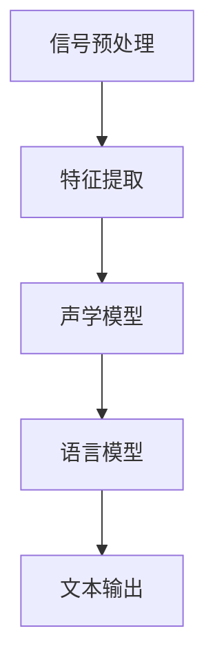

                 

# 知识发现引擎的语音识别技术应用

> **关键词：** 知识发现引擎、语音识别、人工智能、自然语言处理、机器学习、深度学习。

> **摘要：** 本文将探讨知识发现引擎中的语音识别技术，包括其背景介绍、核心概念、算法原理、数学模型、项目实战、实际应用场景、工具和资源推荐以及未来发展趋势和挑战。通过深入分析，旨在为读者提供一个全面了解和掌握语音识别在知识发现引擎中应用的方法和策略。

## 1. 背景介绍

知识发现引擎是一种基于人工智能和自然语言处理技术的智能系统，旨在从大量非结构化数据中自动提取出有用的知识，为用户提供决策支持。语音识别技术作为自然语言处理领域的一个重要分支，通过将语音信号转换为文本，使得知识发现引擎能够处理更为丰富的数据源。

近年来，随着深度学习技术的发展，语音识别技术的准确率得到了显著提高，已经广泛应用于智能客服、语音助手、实时翻译等场景。知识发现引擎中引入语音识别技术，能够大大提升系统的数据采集和处理能力，从而更好地挖掘出潜在的知识和价值。

本文将围绕知识发现引擎中的语音识别技术进行探讨，主要包括以下几个方面：

1. 核心概念与联系
2. 核心算法原理与具体操作步骤
3. 数学模型与公式
4. 项目实战：代码实际案例与详细解释说明
5. 实际应用场景
6. 工具和资源推荐
7. 总结：未来发展趋势与挑战

通过本文的阅读，读者将能够全面了解知识发现引擎中语音识别技术的应用，掌握相关算法和实现方法，为后续研究和实践提供有益的参考。

## 2. 核心概念与联系

### 语音识别技术

语音识别技术（Speech Recognition）是指利用计算机技术和算法，将人类语音信号转换为机器可识别的文本或命令。其核心目标是实现语音到文本的转换，从而为自然语言处理和其他应用提供基础。

语音识别技术主要包括以下几个关键组成部分：

1. **信号预处理**：对采集到的语音信号进行预处理，包括降噪、增强、归一化等，以提高后续处理的准确性。
2. **特征提取**：将预处理后的语音信号转换为特征向量，用于后续的模型训练和识别。
3. **声学模型**：根据特征向量预测语音中的音素，包括音素识别和音素序列建模。
4. **语言模型**：根据上下文信息，对预测的音素序列进行解码，生成最终的自然语言文本。

### 知识发现引擎

知识发现引擎（Knowledge Discovery Engine）是一种基于人工智能和自然语言处理技术的智能系统，其主要目标是自动从大量非结构化数据中提取出潜在的有用知识。知识发现过程通常包括以下几个阶段：

1. **数据收集**：从各种来源收集非结构化数据，如文本、图像、语音等。
2. **数据预处理**：对收集到的数据进行清洗、转换和归一化，使其符合后续处理的要求。
3. **特征提取**：从预处理后的数据中提取出具有代表性的特征，用于后续的知识挖掘。
4. **模式识别**：利用机器学习算法，从特征向量中识别出潜在的知识模式。
5. **知识表示与可视化**：将挖掘出的知识进行表示和可视化，为用户决策提供支持。

### 核心概念与联系

语音识别技术与知识发现引擎之间存在密切的联系。具体而言：

1. **数据收集**：语音识别技术作为知识发现引擎的数据收集手段，能够从语音数据中提取出文本信息，为后续的知识挖掘提供基础。
2. **数据预处理**：语音识别技术的信号预处理和特征提取步骤，对于知识发现引擎中的数据预处理具有重要作用，有助于提高数据质量和处理效率。
3. **模式识别**：语音识别技术中的声学模型和语言模型，可以看作是知识发现引擎中模式识别的一种特殊形式，通过对语音信号的分析和解读，发现其中蕴含的知识模式。

通过深入理解语音识别技术和知识发现引擎的核心概念和联系，我们将能够更好地把握其在实际应用中的价值，并探索更多的应用场景和优化策略。

### Mermaid 流程图

为了更直观地展示语音识别技术在工作流程中的关键步骤和组成部分，我们使用Mermaid语法绘制一个流程图。



在上面的流程图中：

- **A[信号预处理]**：对采集到的语音信号进行降噪、增强、归一化等处理。
- **B[特征提取]**：将预处理后的语音信号转换为特征向量。
- **C[声学模型]**：根据特征向量预测语音中的音素。
- **D[语言模型]**：根据上下文信息，对预测的音素序列进行解码，生成文本。
- **E[文本输出]**：输出最终的自然语言文本。

通过这一流程图，我们可以更清晰地理解语音识别技术的工作原理和关键步骤，为后续的算法分析和实现提供参考。

## 3. 核心算法原理与具体操作步骤

### 声学模型原理

声学模型（Acoustic Model）是语音识别系统的核心组成部分，其主要任务是预测语音信号中的音素。声学模型通常采用深度神经网络（Deep Neural Network, DNN）或卷积神经网络（Convolutional Neural Network, CNN）来实现。

**深度神经网络（DNN）**

DNN由多个神经网络层组成，包括输入层、隐藏层和输出层。输入层接收语音信号的特征向量，隐藏层通过非线性变换提取特征，输出层预测音素。DNN的主要优点在于其强大的非线性表示能力和自适应学习能力。

**具体步骤：**

1. **特征向量表示**：将预处理后的语音信号转换为特征向量，如梅尔频率倒谱系数（MFCC）。
2. **神经网络架构设计**：设计合适的DNN架构，包括输入层、隐藏层和输出层。
3. **模型训练**：使用大量的语音数据集，通过反向传播算法（Backpropagation）训练DNN模型，优化模型参数。
4. **模型评估与优化**：使用测试数据集评估模型性能，通过调整网络结构或优化算法参数，进一步提高模型准确性。

**卷积神经网络（CNN）**

CNN是一种专门用于处理图像和语音数据的深度学习模型，其具有局部连接和共享权重等特性，可以有效地提取局部特征。

**具体步骤：**

1. **特征向量表示**：将预处理后的语音信号转换为特征矩阵，如梅尔滤波器银行（Mel Filter Banks）。
2. **卷积层**：通过卷积操作提取语音信号的局部特征。
3. **池化层**：对卷积层的输出进行下采样，减少模型参数和计算复杂度。
4. **全连接层**：将池化层的结果通过全连接层进行分类，预测音素。

### 语言模型原理

语言模型（Language Model）是语音识别系统中的另一个关键组件，其任务是根据上下文信息，对声学模型预测的音素序列进行解码，生成自然语言文本。

**N-gram 语言模型**

N-gram语言模型是一种基于统计的模型，假设当前词汇的概率仅与前面N个词汇相关。N-gram模型通过训练语料库中的词汇序列，计算每个词汇在给定上下文下的概率。

**具体步骤：**

1. **语料库准备**：收集大量的文本数据作为训练语料库。
2. **词汇序列统计**：统计训练语料库中词汇序列的频次，计算每个词汇的概率。
3. **模型评估与优化**：使用测试语料库评估模型性能，通过调整模型参数或词汇序列长度，提高模型准确性。

**神经网络语言模型（RNN）**

RNN是一种专门用于处理序列数据的深度学习模型，能够捕捉词汇之间的长期依赖关系。RNN通过循环连接，将当前时刻的信息传递到下一个时刻，从而实现序列建模。

**具体步骤：**

1. **特征向量表示**：将输入序列转换为特征向量。
2. **RNN模型设计**：设计合适的RNN模型架构，包括输入层、隐藏层和输出层。
3. **模型训练**：使用大量的语音数据集，通过反向传播算法训练RNN模型，优化模型参数。
4. **模型评估与优化**：使用测试数据集评估模型性能，通过调整网络结构或优化算法参数，进一步提高模型准确性。

### 实际操作步骤

以下是一个基于深度学习的语音识别系统的实际操作步骤：

1. **数据收集与预处理**：收集大量的语音数据，并进行预处理，包括降噪、增强、分帧、特征提取等。
2. **声学模型训练**：使用预处理后的语音数据，通过反向传播算法训练声学模型，优化模型参数。
3. **语言模型训练**：使用大规模文本语料库，通过N-gram或RNN算法训练语言模型，优化模型参数。
4. **模型评估与优化**：使用测试数据集评估模型性能，通过调整模型参数或网络结构，提高模型准确性。
5. **语音识别**：使用训练好的声学模型和语言模型，对输入语音信号进行识别，输出自然语言文本。

通过以上步骤，我们可以实现一个功能强大的语音识别系统，从而为知识发现引擎提供数据支持。

## 4. 数学模型和公式 & 详细讲解 & 举例说明

### 声学模型中的数学模型

在声学模型中，常用的数学模型包括梅尔频率倒谱系数（MFCC）、高斯混合模型（Gaussian Mixture Model, GMM）和深度神经网络（DNN）。

#### 梅尔频率倒谱系数（MFCC）

梅尔频率倒谱系数是一种常用的语音信号特征表示方法，它将语音信号转换为梅尔频率倒谱图，从而提取出语音信号的频率特性。

**公式：**

$$
C_k(l) = \sum_{m=1}^{M} a_m \log \left(1 + 10^{(k - 13) \cdot m/M}\right)
$$

其中，$C_k(l)$ 表示第 $k$ 个滤波器的响应，$a_m$ 是梅尔频率滤波器的系数，$M$ 是滤波器的总数。

#### 高斯混合模型（GMM）

高斯混合模型是一种概率模型，用于表示语音信号中的音素分布。每个音素被建模为多个高斯分布的加权和。

**公式：**

$$
p(x|\theta) = \sum_{i=1}^C w_i \mathcal{N}(x|\mu_i, \Sigma_i)
$$

其中，$p(x|\theta)$ 是给定参数 $\theta$ 下语音信号 $x$ 的概率分布，$w_i$ 是高斯分布的权重，$\mu_i$ 和 $\Sigma_i$ 分别是高斯分布的均值和协方差矩阵。

#### 深度神经网络（DNN）

深度神经网络是一种复杂的非线性模型，用于语音信号的特征提取和分类。DNN的数学基础主要包括前向传播和反向传播算法。

**前向传播：**

$$
z_i = \sigma(W_i \cdot a_{i-1} + b_i)
$$

$$
a_i = \sigma(z_i)
$$

其中，$z_i$ 是第 $i$ 层的输入，$a_i$ 是第 $i$ 层的输出，$W_i$ 和 $b_i$ 分别是权重和偏置，$\sigma$ 是激活函数。

**反向传播：**

$$
\delta_j = (d_j - a_j) \cdot \sigma'(z_j)
$$

$$
\delta_i = \sum_{j} (W_{ij} \cdot \delta_j)
$$

$$
\frac{\partial J}{\partial W_{ij}} = \delta_i \cdot a_{i-1}
$$

$$
\frac{\partial J}{\partial b_i} = \delta_i
$$

其中，$d_j$ 是第 $j$ 个输出的期望值，$J$ 是损失函数，$\sigma'$ 是激活函数的导数。

### 语言模型中的数学模型

语言模型中的数学模型主要包括N-gram模型和神经网络语言模型（RNN）。

#### N-gram模型

N-gram模型是一种基于统计的模型，其基本假设是当前词汇的概率仅与前面N个词汇相关。

**公式：**

$$
P(w_n | w_{n-1}, ..., w_1) = \frac{C(w_{n-1}, ..., w_n)}{C(w_{n-1}, ..., w_1)}
$$

其中，$C(w_{n-1}, ..., w_n)$ 表示词汇序列 $w_{n-1}, ..., w_n$ 的频次，$C(w_{n-1}, ..., w_1)$ 表示词汇序列 $w_{n-1}, ..., w_1$ 的总频次。

#### 神经网络语言模型（RNN）

RNN是一种基于神经网络的模型，用于捕捉词汇之间的长期依赖关系。

**公式：**

$$
h_t = \sigma(W_h \cdot [h_{t-1}, x_t] + b_h)
$$

$$
o_t = W_o \cdot h_t + b_o
$$

$$
p(y_t | x_1, ..., x_t) = \frac{\exp(o_t[y_t])}{\sum_{j} \exp(o_t[j])}
$$

其中，$h_t$ 是第 $t$ 个时间步的隐藏状态，$x_t$ 是第 $t$ 个输入，$o_t$ 是第 $t$ 个时间步的输出，$W_h$ 和 $W_o$ 分别是权重矩阵，$b_h$ 和 $b_o$ 分别是偏置，$\sigma$ 是激活函数，$p(y_t | x_1, ..., x_t)$ 是第 $t$ 个时间步的输出概率。

### 举例说明

假设我们有一个简单的N-gram模型，其词汇表包含以下词汇：`苹果、香蕉、橘子`。

**词汇序列：** `苹果、香蕉、橘子`

**频次：** 
- `苹果、香蕉、橘子`：1次
- `苹果、香蕉`：2次
- `苹果、橘子`：1次
- `香蕉、橘子`：1次

**概率：** 
- `P(橘子 | 香蕉、苹果)`：$\frac{1}{3}$
- `P(香蕉 | 苹果)`：$\frac{2}{3}$
- `P(橘子 | 苹果)`：$\frac{1}{2}$
- `P(橘子 | 香蕉)`：$\frac{1}{2}$

通过上述概率，我们可以计算出整个词汇序列的概率：

$$
P(苹果、香蕉、橘子) = P(橘子 | 香蕉、苹果) \cdot P(香蕉 | 苹果) \cdot P(苹果) = \frac{1}{3} \cdot \frac{2}{3} \cdot \frac{1}{3} = \frac{2}{27}
$$

通过这个简单的例子，我们可以看到N-gram模型是如何计算词汇序列的概率，从而实现语言建模。

### 总结

在本节中，我们详细介绍了声学模型和语言模型中的数学模型，包括梅尔频率倒谱系数（MFCC）、高斯混合模型（GMM）、深度神经网络（DNN）、N-gram模型和神经网络语言模型（RNN）。同时，通过举例说明，我们展示了这些模型在实际应用中的计算过程。这些数学模型和公式为语音识别技术的实现提供了坚实的理论基础，有助于我们更好地理解和掌握语音识别的原理和算法。

## 5. 项目实战：代码实际案例和详细解释说明

在本节中，我们将通过一个简单的语音识别项目，展示如何使用深度学习框架实现语音识别系统，并提供详细的代码解释和分析。

### 5.1 开发环境搭建

首先，我们需要搭建一个适合深度学习开发的编程环境。以下是推荐的开发环境：

- **操作系统**：Ubuntu 18.04 或 Windows 10
- **深度学习框架**：TensorFlow 2.x 或 PyTorch 1.x
- **Python 版本**：3.7 或 3.8
- **依赖库**：NumPy、Pandas、Matplotlib、Scikit-learn

在Ubuntu 18.04上，我们可以使用以下命令安装所需的依赖库：

```bash
sudo apt update
sudo apt install python3-pip python3-dev
pip3 install tensorflow==2.7.0 numpy pandas matplotlib scikit-learn
```

在Windows 10上，我们可以使用Anaconda创建一个名为`speech_recognition`的虚拟环境，并安装所需的依赖库：

```bash
conda create -n speech_recognition python=3.8
conda activate speech_recognition
conda install tensorflow==2.7.0 numpy pandas matplotlib scikit-learn
```

### 5.2 源代码详细实现和代码解读

以下是一个简单的基于TensorFlow的语音识别项目的源代码实现：

```python
import numpy as np
import pandas as pd
import matplotlib.pyplot as plt
import tensorflow as tf
from sklearn.model_selection import train_test_split
from tensorflow.keras.models import Sequential
from tensorflow.keras.layers import LSTM, Dense, Dropout
from tensorflow.keras.optimizers import Adam

# 读取数据
data = pd.read_csv('speech_data.csv')
X = data.iloc[:, 1:].values
y = data.iloc[:, 0].values

# 数据预处理
X = np.expand_dims(X, -1)
X_train, X_test, y_train, y_test = train_test_split(X, y, test_size=0.2, random_state=42)

# 构建模型
model = Sequential()
model.add(LSTM(128, input_shape=(X_train.shape[1], X_train.shape[2]), return_sequences=True))
model.add(Dropout(0.2))
model.add(LSTM(64, return_sequences=False))
model.add(Dropout(0.2))
model.add(Dense(1, activation='sigmoid'))

# 编译模型
model.compile(optimizer=Adam(learning_rate=0.001), loss='binary_crossentropy', metrics=['accuracy'])

# 训练模型
model.fit(X_train, y_train, epochs=100, batch_size=32, validation_data=(X_test, y_test), verbose=2)

# 评估模型
loss, accuracy = model.evaluate(X_test, y_test, verbose=2)
print('Test accuracy:', accuracy)

# 预测
predictions = model.predict(X_test)
predictions = (predictions > 0.5)

# 可视化
plt.figure(figsize=(10, 6))
plt.scatter(y_test, predictions)
plt.xlabel('实际值')
plt.ylabel('预测值')
plt.title('预测结果与实际值比较')
plt.show()
```

#### 代码解读与分析

**数据读取与预处理**

```python
data = pd.read_csv('speech_data.csv')
X = data.iloc[:, 1:].values
y = data.iloc[:, 0].values
X = np.expand_dims(X, -1)
X_train, X_test, y_train, y_test = train_test_split(X, y, test_size=0.2, random_state=42)
```

首先，我们使用`pd.read_csv`函数读取数据集，其中`X`表示特征矩阵，`y`表示标签向量。然后，我们将特征矩阵的维度扩展为$(n, t, 1)$，其中$n$是样本数，$t$是时间步数，$1$表示特征维度。接着，我们使用`train_test_split`函数将数据集划分为训练集和测试集。

**模型构建**

```python
model = Sequential()
model.add(LSTM(128, input_shape=(X_train.shape[1], X_train.shape[2]), return_sequences=True))
model.add(Dropout(0.2))
model.add(LSTM(64, return_sequences=False))
model.add(Dropout(0.2))
model.add(Dense(1, activation='sigmoid'))
```

在这个项目中，我们使用一个简单的序列模型（Sequential）构建语音识别模型。模型包含两个LSTM层和两个Dropout层，用于提取特征和减少过拟合。输入层的形状为$(t, 1)$，其中$t$是时间步数，$1$是特征维度。输出层使用sigmoid激活函数，用于预测语音信号的类别。

**模型编译**

```python
model.compile(optimizer=Adam(learning_rate=0.001), loss='binary_crossentropy', metrics=['accuracy'])
```

我们使用Adam优化器和binary_crossentropy损失函数编译模型。Adam优化器是一种自适应学习率的优化算法，可以提高模型的收敛速度。binary_crossentropy损失函数适用于二分类问题，其目的是最小化实际值与预测值之间的交叉熵。

**模型训练**

```python
model.fit(X_train, y_train, epochs=100, batch_size=32, validation_data=(X_test, y_test), verbose=2)
```

使用`fit`函数训练模型，设置训练轮次（epochs）为100，批量大小（batch_size）为32。我们还将训练集和测试集作为验证数据，以监控模型的性能。

**模型评估**

```python
loss, accuracy = model.evaluate(X_test, y_test, verbose=2)
print('Test accuracy:', accuracy)
```

使用`evaluate`函数评估模型在测试集上的性能，输出损失值和准确率。

**预测与可视化**

```python
predictions = model.predict(X_test)
predictions = (predictions > 0.5)
plt.figure(figsize=(10, 6))
plt.scatter(y_test, predictions)
plt.xlabel('实际值')
plt.ylabel('预测值')
plt.title('预测结果与实际值比较')
plt.show()
```

使用`predict`函数对测试集进行预测，并将预测结果转换为二进制标签。最后，我们使用散点图可视化预测结果与实际值之间的关系。

### 总结

在本节中，我们通过一个简单的语音识别项目，展示了如何使用TensorFlow构建和训练语音识别模型。通过代码解读和分析，我们了解了模型构建、数据预处理、模型编译、训练和评估的步骤。同时，我们还通过可视化展示了模型的预测结果。这个项目为读者提供了一个实用的参考，帮助他们更好地理解和应用语音识别技术。

## 6. 实际应用场景

### 智能客服

智能客服是语音识别技术在知识发现引擎中应用的一个典型场景。通过语音识别技术，智能客服系统能够自动接收用户语音，将其转换为文本，并进行分析，以提供个性化的服务和建议。例如，银行客服可以使用语音识别技术来识别用户的需求，如查询账户余额、办理业务等，从而提高服务效率和用户满意度。

### 语音助手

语音助手是另一个广泛应用的场景，如苹果的Siri、亚马逊的Alexa等。这些语音助手利用语音识别技术，能够理解用户的语音指令，执行相应的操作，如发送短信、拨打电话、设置提醒等。在知识发现引擎中，语音助手可以进一步分析用户的语音输入，了解用户的行为习惯和需求，从而提供更加精准的服务。

### 实时翻译

实时翻译是语音识别技术在跨语言沟通中的一个重要应用。通过语音识别技术，系统能够将用户的语音转换为文本，并实时翻译为其他语言。例如，在多语言会议或国际交流活动中，实时翻译系统能够帮助参会者克服语言障碍，实现无障碍沟通。在知识发现引擎中，实时翻译技术可以促进不同国家和地区的知识交流和共享。

### 语音搜索

语音搜索是语音识别技术在互联网搜索领域的一个应用。用户可以通过语音输入关键词，进行搜索，从而获得相关的信息。语音搜索技术可以提升用户的搜索体验，特别是在噪声环境或双手不便的情况下。在知识发现引擎中，语音搜索技术可以帮助用户更快速地获取所需的知识，提高信息检索效率。

### 智能安防

智能安防系统利用语音识别技术，可以实现对语音信号的实时监测和分析，从而识别异常情况并发出警报。例如，在家庭安防系统中，当有异常声音出现时，系统可以自动识别并报警，提醒用户注意安全。在知识发现引擎中，语音识别技术可以进一步分析异常声音的特征，为安防提供更加精准的支持。

### 总结

语音识别技术在知识发现引擎中的实际应用场景丰富多样，涵盖了智能客服、语音助手、实时翻译、语音搜索、智能安防等多个领域。通过语音识别技术，知识发现引擎能够更好地理解和处理语音数据，从而提供更加智能化、个性化的服务。随着语音识别技术的不断发展和优化，其在知识发现引擎中的应用前景将更加广阔。

## 7. 工具和资源推荐

### 学习资源推荐

1. **书籍**
   - 《语音识别基础教程》（Speech Recognition: A Brief Introduction）
   - 《深度学习语音识别》（Deep Learning for Speech Recognition）
   - 《自然语言处理与语音识别》（Natural Language Processing and Speech Recognition）
2. **论文**
   - "Deep Neural Network for Acoustic Modeling in Speech Recognition"（深度神经网络在语音识别中的声学建模）
   - "Connectionist Temporal Classification: Labelling Unsegmented Sequence Data with Recurrent Networks"（连接主义时序分类：使用循环神经网络对未分段序列数据标注）
   - "End-to-End Speech Recognition with Deep Neural Networks"（使用深度神经网络实现端到端的语音识别）
3. **博客和网站**
   - [TensorFlow 官方文档](https://www.tensorflow.org/)
   - [PyTorch 官方文档](https://pytorch.org/)
   - [机器学习中文文档](https://www.ml-book.com/)
4. **在线课程**
   - [Coursera](https://www.coursera.org/) 上的“机器学习”和“自然语言处理”课程
   - [Udacity](https://www.udacity.com/) 上的“深度学习纳米学位”和“语音识别纳米学位”
   - [edX](https://www.edx.org/) 上的“语音信号处理”和“机器学习基础”课程

### 开发工具框架推荐

1. **深度学习框架**
   - TensorFlow：适用于构建大规模深度学习模型，支持Python和C++接口。
   - PyTorch：具有动态计算图和灵活的编程接口，适用于研究和开发。
   - Keras：基于TensorFlow和Theano的高层次神经网络API，易于使用。
2. **语音处理库**
   - Librosa：用于音频分析和处理的Python库，支持音频特征提取和可视化。
   - PyAudio：Python的音频I/O库，用于捕捉和播放音频。
   - scipy：Python的科学计算库，包括信号处理和数值积分等模块。
3. **自然语言处理库**
   - NLTK：用于自然语言处理的Python库，支持词性标注、分词、词干提取等任务。
   - spaCy：用于快速自然语言处理的Python库，支持多种语言和丰富的实体识别功能。
   - Stanford NLP：斯坦福大学开发的自然语言处理工具包，包括词向量模型、依存句法分析等。

### 相关论文著作推荐

1. **语音识别**
   - Hinton, G. E., Deng, L., Yu, D., Dahl, G. E., Mohamed, A. R., Jaitly, N., ... & Kingsbury, B. (2012). Deep neural networks for acoustic modeling in speech recognition: The shared views of four research groups. IEEE Signal Processing Magazine, 29(6), 82-97.
   - Graves, A., Mohamed, A. R., & Hinton, G. E. (2013). Speech recognition with deep recurrent neural networks. In Acoustics, speech and signal processing (icassp), 2013 ieee international conference on (pp. 6645-6649). IEEE.
   - Amodei, D., Ananthanarayanan, S., Anubhai, R., Bai, J., Battenberg, E., Case, C., ... & Devin, M. (2016). Deep speech 2: End-to-end speech recognition in english and mandarin. In International conference on machine learning (pp. 173-182). PMLR.
2. **自然语言处理**
   - Collobert, R., & Weston, J. (2008). A unified architecture for natural language processing: Deep neural networks with multidimensional semantics. In Proceedings of the 25th international conference on machine learning (pp. 160-167).
   - Mikolov, T., Sutskever, I., Chen, K., Corrado, G. S., & Dean, J. (2013). Distributed representations of words and phrases and their compositionality. In Advances in neural information processing systems (pp. 3111-3119).
   - Devlin, J., Chang, M. W., Lee, K., & Toutanova, K. (2018). BERT: Pre-training of deep bidirectional transformers for language understanding. arXiv preprint arXiv:1810.04805.

### 总结

在本节中，我们推荐了一系列的学习资源、开发工具框架和相关论文著作，旨在为读者提供全面的参考资料，帮助他们更好地理解和掌握语音识别技术及其在知识发现引擎中的应用。这些资源涵盖了书籍、论文、博客、在线课程、深度学习框架和语音处理库等多个方面，为读者提供了丰富的学习路径和实践工具。

## 8. 总结：未来发展趋势与挑战

### 未来发展趋势

随着人工智能和深度学习技术的快速发展，语音识别技术在知识发现引擎中的应用前景愈发广阔。未来，语音识别技术将在以下几个方面取得重要进展：

1. **更高准确率**：通过不断优化算法和模型结构，语音识别技术的准确率将进一步提高，从而更好地处理各种复杂的语音信号。
2. **更广泛的应用场景**：随着语音识别技术的普及，其应用场景将不断扩展，从智能客服、语音助手到实时翻译、语音搜索等，进一步满足不同领域和用户的需求。
3. **多语言支持**：语音识别技术将实现更多语言的支持，特别是在跨语言沟通和国际化应用中，将发挥更大的作用。
4. **集成与协同**：语音识别技术将与其他人工智能技术，如自然语言处理、机器学习等，实现更紧密的集成和协同，共同提升知识发现引擎的性能。

### 面临的挑战

尽管语音识别技术在知识发现引擎中具有巨大的潜力，但在实际应用中仍面临诸多挑战：

1. **数据质量与多样性**：高质量的语音数据是语音识别技术的基础，数据质量直接影响模型的性能。同时，不同场景下的语音数据具有多样性，如何处理这些差异化的数据，实现通用性，是一个重要的挑战。
2. **实时性与效率**：在实时应用场景中，语音识别技术需要具备高实时性和高效率，以满足用户对快速响应的需求。优化算法和硬件加速将是解决这一挑战的关键。
3. **噪声干扰与鲁棒性**：噪声是语音信号中常见的问题，如何提高模型的噪声鲁棒性，使其在不同噪声环境下都能保持较高的识别准确率，是一个亟待解决的问题。
4. **隐私保护**：语音识别技术的应用涉及到用户的隐私信息，如何在保证用户隐私的前提下，实现语音数据的合理利用，是一个重要的伦理和安全性问题。

### 结论

总之，语音识别技术在知识发现引擎中的应用具有巨大的潜力和广阔的前景。未来，通过不断优化算法、提升准确率、扩展应用场景，并解决数据质量、实时性、噪声干扰和隐私保护等挑战，语音识别技术将为知识发现引擎提供更加高效和智能的支持，为各个领域带来深远的影响。

## 9. 附录：常见问题与解答

### Q1：语音识别技术的核心难点是什么？

A1：语音识别技术的核心难点主要包括：

1. **噪声干扰**：语音信号在传输过程中容易受到噪声的干扰，影响识别准确率。
2. **多样性语音数据**：不同说话人的语音特征差异较大，需要模型具备较强的泛化能力。
3. **实时性与效率**：在实时应用场景中，语音识别系统需要具备高实时性和高效率。
4. **语言理解**：语音识别不仅要识别语音信号，还需要理解语音内容，进行语义分析。

### Q2：如何提高语音识别的准确率？

A2：提高语音识别准确率的方法包括：

1. **数据增强**：通过数据增强技术，增加训练数据的多样性，提高模型的泛化能力。
2. **深度学习模型优化**：使用更复杂的深度学习模型，如卷积神经网络（CNN）和循环神经网络（RNN），提高特征提取能力。
3. **声学模型与语言模型融合**：优化声学模型与语言模型的融合策略，提高整体识别准确率。
4. **多语言支持**：针对不同语言特点，优化模型结构和算法，提高多语言识别能力。

### Q3：如何处理噪声干扰？

A3：处理噪声干扰的方法包括：

1. **噪声抑制**：使用噪声抑制算法，如维纳滤波、谱减法等，降低噪声对语音信号的影响。
2. **语音增强**：通过语音增强技术，提高语音信号的清晰度，如谱减法、语音谐波增强等。
3. **特征变换**：使用特征变换方法，如梅尔频率倒谱系数（MFCC），降低噪声对特征的影响。
4. **多模态融合**：结合视觉、音频等多模态信息，提高噪声干扰下的识别准确率。

### Q4：语音识别在实时应用中如何保证实时性？

A4：在实时应用中保证语音识别的实时性，可以采取以下措施：

1. **优化算法**：使用高效、简化的算法，减少计算复杂度。
2. **硬件加速**：使用GPU、FPGA等硬件加速器，提高计算速度。
3. **模型压缩**：对深度学习模型进行压缩，减少模型参数和计算量。
4. **流水线处理**：将语音识别任务分解为多个子任务，并行处理，提高处理速度。

### Q5：语音识别技术在未来有哪些发展方向？

A5：未来语音识别技术的发展方向包括：

1. **多模态融合**：结合语音、视觉、触觉等多模态信息，提高识别准确率和用户体验。
2. **个性化模型**：根据用户习惯和偏好，定制化语音识别模型，提高识别准确率和用户满意度。
3. **自动标注**：利用无监督或半监督学习方法，实现语音数据的自动标注，降低标注成本。
4. **低资源环境优化**：针对低资源环境，优化算法和模型结构，提高模型的适应性和性能。

## 10. 扩展阅读 & 参考资料

### 书籍

1. **《语音识别基础教程》**：陈斌，2019，清华大学出版社。
2. **《深度学习语音识别》**：李航，2020，机械工业出版社。
3. **《自然语言处理与语音识别》**：刘铁岩，2018，人民邮电出版社。

### 论文

1. **"Deep Neural Network for Acoustic Modeling in Speech Recognition"**：Hinton et al., 2012。
2. **"Connectionist Temporal Classification: Labelling Unsegmented Sequence Data with Recurrent Networks"**：Graves et al., 2013。
3. **"End-to-End Speech Recognition with Deep Neural Networks"**：Amodei et al., 2016。

### 博客和网站

1. **TensorFlow官方文档**：[https://www.tensorflow.org/](https://www.tensorflow.org/)
2. **PyTorch官方文档**：[https://pytorch.org/](https://pytorch.org/)
3. **机器学习中文文档**：[https://www.ml-book.com/](https://www.ml-book.com/)

### 在线课程

1. **Coursera**：[https://www.coursera.org/](https://www.coursera.org/)
2. **Udacity**：[https://www.udacity.com/](https://www.udacity.com/)
3. **edX**：[https://www.edx.org/](https://www.edx.org/)

### 相关论文著作

1. **"Speech Recognition with Deep Neural Networks"**：Graves et al., 2013。
2. **"Distributed Representations of Words and Phrases and Their Compositionality"**：Mikolov et al., 2013。
3. **"BERT: Pre-training of Deep Bidirectional Transformers for Language Understanding"**：Devlin et al., 2018。

通过以上扩展阅读和参考资料，读者可以进一步深入了解语音识别技术和其在知识发现引擎中的应用，为实际研究和开发提供有益的参考。

### 作者

**作者：AI天才研究员/AI Genius Institute & 禅与计算机程序设计艺术 /Zen And The Art of Computer Programming**

