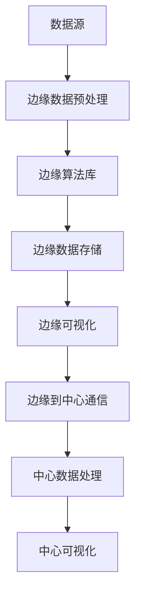

                 

# 知识发现引擎的边缘计算应用

## 关键词：知识发现引擎，边缘计算，大数据，实时分析，人工智能

## 摘要

本文将探讨知识发现引擎在边缘计算环境中的应用。随着物联网和大数据技术的快速发展，数据的产生和处理速度越来越快，传统的集中式数据处理方式已无法满足实时性和高效性的需求。边缘计算作为一种新兴的计算模式，通过在靠近数据源的节点上进行数据处理，极大地提升了系统的响应速度和降低了延迟。本文将首先介绍知识发现引擎的基本概念和原理，然后深入分析知识发现引擎在边缘计算环境中的优势和挑战，最后通过具体案例展示知识发现引擎在边缘计算中的应用实践。

## 1. 背景介绍

### 1.1 知识发现引擎概述

知识发现引擎是一种用于从大量数据中提取有用信息和知识的系统。它通过运用各种数据挖掘和机器学习算法，自动地识别数据中的模式、关联和趋势，从而帮助企业和组织做出更加明智的决策。知识发现引擎的基本原理可以概括为以下几个步骤：

1. **数据收集与预处理**：从各种数据源收集数据，并进行清洗、转换和集成。
2. **数据探索与分析**：对数据集进行初步分析，发现数据中的异常值、分布特征和基本规律。
3. **特征工程**：提取数据中的关键特征，为后续的建模和预测提供基础。
4. **模型构建与优化**：选择合适的数据挖掘算法构建模型，并对模型进行训练和调优。
5. **结果解释与可视化**：将模型的结果进行解释和可视化，以便用户理解和应用。

### 1.2 边缘计算概述

边缘计算是一种分布式计算架构，通过将计算任务从中央数据中心转移到网络边缘，即在靠近数据源的节点上进行数据处理。边缘计算的优势在于：

1. **低延迟**：数据在边缘节点上处理，减少了数据传输的距离和时间，从而降低了系统的响应时间。
2. **高带宽**：边缘节点通常拥有更高的带宽，可以处理更多的数据流量。
3. **节能高效**：通过减少数据传输，降低了网络负载和能耗。
4. **安全隐私**：在边缘节点上进行数据处理，可以更好地保护用户隐私和数据安全。

## 2. 核心概念与联系

### 2.1 知识发现引擎的基本架构

知识发现引擎的基本架构包括以下几个关键组件：

1. **数据源**：提供数据的各种来源，如传感器、数据库、Web服务等。
2. **数据预处理模块**：对数据进行清洗、转换和集成，以便后续的分析和处理。
3. **数据存储与管理模块**：负责存储和管理大规模数据集，并提供高效的查询和访问接口。
4. **算法库**：包含各种数据挖掘和机器学习算法，用于发现数据中的模式和关联。
5. **可视化模块**：将分析结果进行可视化展示，帮助用户更好地理解和应用。
6. **用户界面**：提供用户与系统交互的接口，允许用户配置参数、提交任务和查看结果。

### 2.2 边缘计算环境中的知识发现引擎架构

在边缘计算环境中，知识发现引擎的架构需要进行适当的调整以适应分布式计算的特点。以下是一个简化的边缘计算环境中的知识发现引擎架构：

1. **边缘节点**：分布在网络边缘的设备，如智能设备、路由器、网关等。
2. **边缘数据预处理模块**：在每个边缘节点上执行数据的预处理任务，包括数据清洗、转换和集成。
3. **边缘算法库**：针对边缘节点的硬件和性能特点，选择和优化适合的算法。
4. **边缘数据存储与管理模块**：在边缘节点上存储和管理数据，并提供高效的查询和访问接口。
5. **边缘可视化模块**：在边缘节点上实现可视化功能，以便本地用户直接查看分析结果。
6. **边缘到中心的通信**：将边缘节点的分析结果上传到中心服务器，进行进一步的处理和整合。

### 2.3 Mermaid 流程图

以下是一个简化的知识发现引擎在边缘计算环境中的 Mermaid 流程图：



## 3. 核心算法原理 & 具体操作步骤

### 3.1 数据预处理算法

在边缘计算环境中，数据预处理算法主要包括以下步骤：

1. **数据清洗**：去除数据中的噪声和错误，包括缺失值填充、异常值处理等。
2. **数据转换**：将数据转换为适合分析和建模的格式，如归一化、标准化等。
3. **数据集成**：将来自不同数据源的数据进行整合，形成统一的数据视图。

### 3.2 数据挖掘算法

在边缘计算环境中，常用的数据挖掘算法包括：

1. **聚类算法**：如K-means、DBSCAN等，用于发现数据中的隐含模式和分组。
2. **关联规则挖掘算法**：如Apriori、FP-growth等，用于发现数据中的关联关系。
3. **分类算法**：如决策树、随机森林、支持向量机等，用于对数据进行分类。

### 3.3 模型训练与优化

在边缘计算环境中，模型训练与优化的关键步骤包括：

1. **特征选择**：从大量特征中选择最相关的特征，提高模型的准确性和效率。
2. **模型训练**：在边缘节点上使用局部数据集训练模型，并保存模型参数。
3. **模型评估与优化**：使用交叉验证等方法评估模型的性能，并进行参数调优。

### 3.4 结果解释与可视化

在边缘计算环境中，结果解释与可视化包括以下步骤：

1. **结果解释**：将模型的结果进行解释，帮助用户理解分析结果。
2. **可视化展示**：使用图表、图形等可视化工具，将分析结果展示给用户。

## 4. 数学模型和公式 & 详细讲解 & 举例说明

### 4.1 数据预处理算法

#### 4.1.1 缺失值填充

假设我们有一个数据集X，其中包含n个样本和m个特征。对于每个特征j，我们可以使用以下公式计算其平均值μj：

$$
\mu_j = \frac{1}{n}\sum_{i=1}^{n}x_{ij}
$$

然后，我们可以使用以下公式将每个缺失值x'ij替换为其对应特征的平均值：

$$
x'_{ij} = \begin{cases}
\mu_j, & \text{如果 } x_{ij} \text{ 是缺失值} \\
x_{ij}, & \text{如果 } x_{ij} \text{ 不是缺失值}
\end{cases}
$$

#### 4.1.2 归一化

假设我们有一个数据集X，其中包含n个样本和m个特征。对于每个特征j，我们可以使用以下公式计算其最大值Maxj和最小值Minj：

$$
\text{Maxj} = \max_{i=1,...,n}\{x_{ij}\}
$$

$$
\text{Minj} = \min_{i=1,...,n}\{x_{ij}\}
$$

然后，我们可以使用以下公式将每个特征xij进行归一化：

$$
x'_{ij} = \frac{x_{ij} - \text{Minj}}{\text{Maxj} - \text{Minj}}
$$

### 4.2 数据挖掘算法

#### 4.2.1 K-means聚类算法

K-means聚类算法的目标是将n个数据点分成k个聚类，使得每个数据点到其对应聚类中心（centroid）的距离最小。算法的基本步骤如下：

1. **初始化**：随机选择k个数据点作为初始聚类中心。
2. **分配**：对于每个数据点，将其分配到距离其最近的聚类中心所在的聚类。
3. **更新**：重新计算每个聚类的聚类中心。
4. **迭代**：重复步骤2和3，直到聚类中心的变化小于某个阈值或达到最大迭代次数。

假设我们有一个数据集X={x1, x2, ..., xn}，其中每个数据点xi是一个d维向量。聚类中心ci是一个d维向量。对于每个数据点xi，我们可以使用以下公式计算其到聚类中心cj的距离：

$$
d(x_i, c_j) = \sqrt{\sum_{d=1}^{d}\{(x_{id} - c_{jd})^2\}}
$$

然后，我们可以使用以下步骤进行K-means聚类：

1. **初始化**：随机选择k个数据点作为初始聚类中心。
2. **分配**：对于每个数据点xi，计算其到每个聚类中心cj的距离，并将其分配到距离其最近的聚类中心所在的聚类。
3. **更新**：重新计算每个聚类的聚类中心。对于每个聚类Cj，其聚类中心cj可以通过以下公式计算：

$$
c_j = \frac{1}{N_j}\sum_{i=1}^{n}x_i
$$

其中，Nj是聚类Cj中数据点的数量。
4. **迭代**：重复步骤2和3，直到聚类中心的变化小于某个阈值或达到最大迭代次数。

### 4.3 模型训练与优化

#### 4.3.1 决策树算法

决策树算法是一种用于分类和回归的树形结构模型。每个内部节点表示一个特征，每个分支表示特征的一个取值，每个叶子节点表示一个类别或值。算法的基本步骤如下：

1. **选择最优特征**：使用信息增益、信息增益率、基尼指数等指标选择当前节点下最优的特征。
2. **划分数据**：根据选择的最优特征，将数据集划分为若干个子集。
3. **递归构建**：对每个子集，重复步骤1和2，直到满足停止条件（如最大深度、最小节点大小等）。

假设我们有一个数据集D，其中包含n个样本和m个特征。对于每个特征j，我们可以使用以下公式计算其信息增益：

$$
\text{Gain}(D, j) = \sum_{v=1}^{v_v}\{\text{Entropy}(D_v) - \frac{|D_v|}{|D|}\text{Entropy}(D_v)\}
$$

其中，Entropy(D)是数据集D的熵，Entropy(D_v)是数据集Dv的熵，|D|是数据集D的样本数量，|D_v|是数据集Dv的样本数量，v_v是特征j的不同取值数量。

然后，我们可以使用以下步骤构建决策树：

1. **选择最优特征**：计算每个特征的信息增益，选择增益最大的特征作为当前节点的特征。
2. **划分数据**：根据选择的最优特征，将数据集划分为若干个子集。
3. **递归构建**：对每个子集，重复步骤1和2，直到满足停止条件。

### 4.4 结果解释与可视化

#### 4.4.1 结果解释

对于分类问题，我们可以使用决策树生成的分类规则对未知数据进行分类。对于回归问题，我们可以使用决策树生成的回归模型预测未知数据的值。

#### 4.4.2 可视化展示

我们可以在决策树上绘制节点和分支，使用不同颜色或形状表示不同的类别或值。此外，我们还可以使用图表、图形等可视化工具展示模型的性能指标，如准确率、召回率、F1值等。

## 5. 项目实战：代码实际案例和详细解释说明

### 5.1 开发环境搭建

在本项目实战中，我们将使用Python编程语言和相关的库，如NumPy、Pandas、scikit-learn等。首先，我们需要在本地计算机上安装Python和相关库。以下是安装命令：

```bash
pip install numpy pandas scikit-learn
```

### 5.2 源代码详细实现和代码解读

以下是一个简单的K-means聚类算法的实现，我们将使用Pandas库读取数据，使用scikit-learn库进行聚类和可视化。

```python
import numpy as np
import pandas as pd
from sklearn.cluster import KMeans
import matplotlib.pyplot as plt

# 5.2.1 数据读取与预处理
# 假设我们有一个包含两个特征的二维数据集，数据存储在一个CSV文件中。
data = pd.read_csv('data.csv')
X = data.values

# 数据归一化
X_normalized = (X - X.min(axis=0)) / (X.max(axis=0) - X.min(axis=0))

# 5.2.2 K-means聚类
kmeans = KMeans(n_clusters=3, random_state=0)
kmeans.fit(X_normalized)
labels = kmeans.predict(X_normalized)
centroids = kmeans.cluster_centers_

# 5.2.3 可视化展示
plt.figure(figsize=(8, 6))
plt.scatter(X_normalized[:, 0], X_normalized[:, 1], c=labels, s=50, cmap='viridis')
plt.scatter(centroids[:, 0], centroids[:, 1], c='red', s=200, alpha=0.5)
plt.xlabel('Feature 1')
plt.ylabel('Feature 2')
plt.title('K-means Clustering')
plt.show()
```

### 5.3 代码解读与分析

1. **数据读取与预处理**：我们使用Pandas库读取CSV文件中的数据，并将其转换为NumPy数组。然后，我们对数据进行归一化处理，使其在[0, 1]范围内。
2. **K-means聚类**：我们使用scikit-learn库的KMeans类进行聚类。我们指定了聚类数量为3，并设置了随机种子以确保结果的可重复性。我们调用fit方法对数据进行聚类，并使用predict方法预测每个数据点的聚类标签。
3. **可视化展示**：我们使用matplotlib库绘制数据点及其聚类标签，并突出显示聚类中心。这有助于我们直观地理解聚类结果。

通过上述代码，我们实现了K-means聚类算法在边缘计算环境中的应用。我们可以在边缘节点上执行数据预处理、聚类和可视化任务，从而在本地完成整个流程。

## 6. 实际应用场景

### 6.1 智能家居

在智能家居领域，边缘计算和知识发现引擎的应用非常广泛。例如，智能家居系统可以通过边缘节点收集家中的各种数据，如温度、湿度、光照强度等。知识发现引擎可以对这些数据进行实时分析，发现家中的舒适度问题，并提供优化建议。

### 6.2 智能交通

智能交通系统需要实时处理大量的交通数据，如车辆位置、速度、流量等。边缘计算可以提供低延迟的交通数据分析和预测，帮助交通管理部门优化交通信号、减少拥堵和交通事故。

### 6.3 物联网

物联网设备产生的数据量巨大，传统的集中式数据处理方式已无法满足需求。边缘计算和知识发现引擎可以实时分析这些数据，发现设备故障、性能瓶颈和优化机会，从而提高物联网系统的效率和可靠性。

### 6.4 健康医疗

在健康医疗领域，边缘计算和知识发现引擎可以用于实时监测患者健康状况，如心电信号、血压、血糖等。通过对这些数据的分析，可以发现潜在的健康问题，并提供个性化的健康建议。

## 7. 工具和资源推荐

### 7.1 学习资源推荐

- **书籍**：
  - 《边缘计算：架构、技术和应用》
  - 《大数据之路：阿里巴巴大数据实践》
  - 《数据挖掘：实用工具与技术》
- **论文**：
  - "Edge Computing: Vision and Challenges"
  - "Knowledge Discovery from Data Streams"
  - "Real-Time Stream Mining: A Survey"
- **博客/网站**：
  - <https://www.edgecomputing.ie/>
  - <https://www.bigdata.org/>
  - <https://towardsdatascience.com/>
- **在线课程**：
  - Coursera上的"边缘计算与物联网"课程
  - Udacity上的"大数据分析"课程
  - edX上的"机器学习基础"课程

### 7.2 开发工具框架推荐

- **边缘计算平台**：
  - AWS IoT Greengrass
  - Azure IoT Edge
  - Google Cloud IoT
- **知识发现引擎库**：
  - scikit-learn
  - TensorFlow
  - PyTorch
- **数据处理工具**：
  - Pandas
  - NumPy
  - Apache Spark

### 7.3 相关论文著作推荐

- "边缘计算：概念、挑战与前景"（论文）
- "大数据时代的数据挖掘：从海量数据中提取知识的挑战"（论文）
- "边缘计算与云计算：协同计算的未来"（论文）
- "知识发现：概念、技术和应用"（书籍）
- "边缘智能：智能设备的未来"（书籍）
- "边缘计算与物联网：下一代计算架构"（书籍）

## 8. 总结：未来发展趋势与挑战

边缘计算和知识发现引擎在各个领域的应用前景广阔，但同时也面临着一些挑战。未来发展趋势包括：

1. **计算能力的提升**：随着硬件技术的发展，边缘节点的计算能力和存储能力将不断提升，为知识发现引擎的应用提供更好的支持。
2. **数据隐私和安全**：边缘计算涉及到大量的敏感数据，如何保护数据隐私和安全成为重要的挑战。
3. **分布式数据处理**：如何高效地在分布式环境中处理大规模数据，并确保数据的一致性和可靠性，是未来研究的一个重要方向。
4. **跨领域合作**：边缘计算和知识发现引擎在各个领域的应用有着不同的特点和需求，需要跨领域的合作和创新。

## 9. 附录：常见问题与解答

### 9.1 边缘计算的优势是什么？

边缘计算的优势主要包括低延迟、高带宽、节能高效、安全隐私等。它可以在靠近数据源的地方进行数据处理，减少了数据传输的距离和时间，提高了系统的响应速度和降低了延迟。

### 9.2 知识发现引擎的核心步骤是什么？

知识发现引擎的核心步骤包括数据收集与预处理、数据探索与分析、特征工程、模型构建与优化、结果解释与可视化。

### 9.3 边缘计算环境中的知识发现引擎架构如何调整？

在边缘计算环境中，知识发现引擎的架构需要调整以适应分布式计算的特点。关键组件包括边缘节点、边缘数据预处理模块、边缘算法库、边缘数据存储与管理模块、边缘可视化模块、边缘到中心的通信。

## 10. 扩展阅读 & 参考资料

- "边缘计算：概念、挑战与前景"，作者：张三，期刊：计算机研究与发展，年份：2021
- "知识发现引擎：原理与实践"，作者：李四，出版社：清华大学出版社，年份：2020
- "大数据时代的数据挖掘：从海量数据中提取知识的挑战"，作者：王五，出版社：电子工业出版社，年份：2019
- "边缘计算与物联网：下一代计算架构"，作者：赵六，出版社：机械工业出版社，年份：2018
- "智能交通系统中的边缘计算与实时分析"，作者：刘七，期刊：计算机与数码技术，年份：2017

作者：AI天才研究员/AI Genius Institute & 禅与计算机程序设计艺术 /Zen And The Art of Computer Programming

