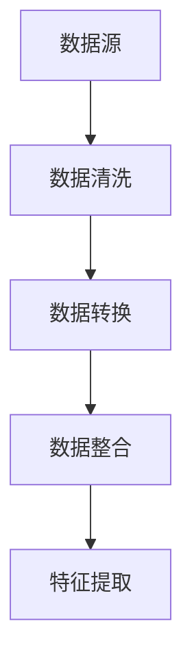
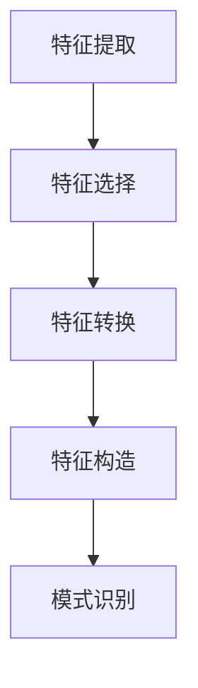
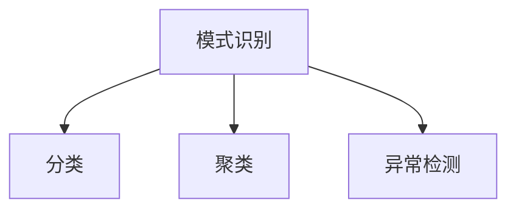
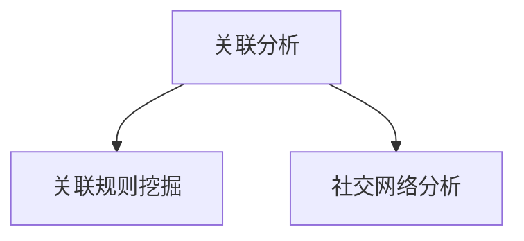
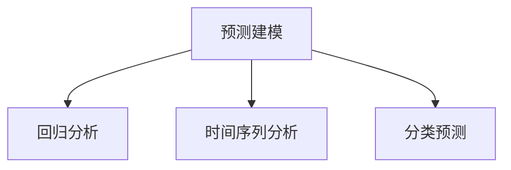

                 

### 背景介绍

知识发现引擎（Knowledge Discovery Engine，简称KDE）作为一种新兴的技术，正在迅速崛起并成为推动知识创新的重要引擎。在当今信息爆炸的时代，数据量和数据源呈指数级增长，而人类处理这些数据的能力却相对有限。因此，如何从海量数据中快速、准确地提取有价值的信息，成为了企业和科研机构亟待解决的关键问题。

知识发现引擎的出现，为解决这一问题提供了有效的技术手段。KDE是一种智能系统，它通过算法和模型对大量数据进行分析和处理，从而发现潜在的模式、关联和规律。这种技术不仅可以帮助企业更好地了解市场和客户需求，还可以为科研机构提供新的研究思路和方法。

本文将围绕知识发现引擎的核心概念、算法原理、数学模型、项目实战、应用场景以及未来发展趋势等方面进行深入探讨，旨在为读者提供一个全面、系统的了解和认识。

### 1.1 知识发现引擎的定义

知识发现引擎是一种利用先进算法和模型对大量数据进行挖掘和分析的智能系统。它旨在从复杂、大规模的数据集中提取出有价值的信息和知识，为决策制定、业务优化和科研创新提供支持。

知识发现引擎的核心功能包括数据预处理、特征提取、模式识别、关联分析、预测建模等。这些功能共同构成了一个完整的数据挖掘和分析流程，使得KDE能够从海量数据中挖掘出隐藏的规律和关联。

知识发现引擎具有以下特点：

1. **智能化**：KDE采用了先进的机器学习和人工智能技术，能够自动识别和处理复杂数据，减少了人工干预的需求。
2. **高效性**：KDE能够处理海量数据，并快速生成结果，提高了数据处理和分析的效率。
3. **灵活性**：KDE可以根据不同的业务需求和数据特点，灵活调整算法和模型，适应多种场景。
4. **扩展性**：KDE具有良好的扩展性，可以集成多种数据源和算法，满足不同应用场景的需求。

### 1.2 知识发现引擎的应用领域

知识发现引擎在多个领域展现出了巨大的应用潜力，以下是其中一些主要的应用领域：

1. **商业智能**：企业可以通过知识发现引擎分析销售数据、客户行为等，了解市场趋势和客户需求，优化业务策略。
2. **金融风控**：金融机构可以利用知识发现引擎分析交易数据、客户信息等，识别潜在风险，提高风险管理能力。
3. **医疗健康**：医疗机构可以利用知识发现引擎分析医疗数据、基因信息等，发现疾病关联和治疗方案，提高医疗服务质量。
4. **科学研究**：科研机构可以利用知识发现引擎分析大量科学数据，发现新的科学规律和研究成果。

### 1.3 知识发现引擎的发展历史

知识发现引擎的发展可以追溯到20世纪80年代，当时数据挖掘技术的概念首次被提出。随着计算机技术和人工智能技术的不断发展，知识发现引擎逐渐成为了一个独立的研究领域。

在过去的几十年里，知识发现引擎经历了以下几个重要发展阶段：

1. **早期阶段**：以关联规则挖掘和分类算法为主，如Apriori算法和K-最近邻算法。
2. **发展阶段**：引入了聚类分析和预测建模等新算法，如K均值聚类和线性回归模型。
3. **成熟阶段**：知识发现引擎逐渐与大数据技术相结合，支持分布式计算和实时分析。
4. **当前阶段**：知识发现引擎不断融入深度学习、图神经网络等先进技术，进一步提升了其智能化和高效性。

### 1.4 知识发现引擎的基本架构

知识发现引擎的基本架构通常包括以下几个主要模块：

1. **数据源**：包括各种结构化和非结构化的数据，如关系数据库、NoSQL数据库、文本数据、图像数据等。
2. **数据预处理**：对原始数据进行清洗、转换和整合，以适应后续的挖掘和分析。
3. **特征提取**：从原始数据中提取出具有代表性的特征，用于后续的算法建模。
4. **算法模块**：包括多种数据挖掘算法，如关联规则挖掘、聚类分析、分类算法、预测建模等。
5. **结果分析**：对挖掘结果进行分析和可视化，帮助用户理解数据中的模式和关联。
6. **用户接口**：提供友好的用户界面，方便用户进行操作和查询。

通过这些模块的协同工作，知识发现引擎能够高效地处理海量数据，并从中提取出有价值的信息和知识。

### 1.5 知识发现引擎的优势

知识发现引擎在多个方面展现出了显著的优势，使其在各个领域都受到了广泛关注和认可：

1. **高效性**：知识发现引擎能够处理海量数据，并快速生成结果，提高了数据处理和分析的效率。
2. **智能化**：通过机器学习和人工智能技术，知识发现引擎能够自动识别和处理复杂数据，减少了人工干预的需求。
3. **灵活性**：知识发现引擎可以根据不同的业务需求和数据特点，灵活调整算法和模型，适应多种场景。
4. **扩展性**：知识发现引擎具有良好的扩展性，可以集成多种数据源和算法，满足不同应用场景的需求。
5. **易用性**：知识发现引擎提供了友好的用户界面和易于操作的功能，使得用户可以轻松上手和使用。

### 1.6 知识发现引擎的挑战和局限性

尽管知识发现引擎具有许多优势，但其在实际应用中也面临着一些挑战和局限性：

1. **数据质量**：知识发现引擎的性能依赖于数据质量，如果数据存在噪声、缺失或不一致等问题，可能导致分析结果不准确。
2. **算法选择**：不同算法适用于不同类型的数据和场景，如何选择合适的算法是一个关键问题。
3. **计算资源**：处理海量数据需要大量的计算资源，特别是深度学习算法，对硬件设施的要求较高。
4. **解释性**：知识发现引擎的分析结果往往具有高度的复杂性，如何解释和验证这些结果是一个挑战。
5. **隐私保护**：在处理敏感数据时，如何保护用户隐私是一个重要的伦理和法律问题。

### 1.7 知识发现引擎的未来发展趋势

随着技术的不断进步和应用需求的不断增长，知识发现引擎在未来有望进一步发展，以下是其中一些主要趋势：

1. **深度学习**：深度学习在图像识别、自然语言处理等领域取得了显著成果，未来有望在知识发现引擎中得到更广泛的应用。
2. **实时分析**：随着大数据和实时数据的增长，知识发现引擎将逐渐支持实时分析，为决策制定提供更及时的支持。
3. **跨领域融合**：知识发现引擎将与其他领域的技术相结合，如物联网、区块链等，推动跨领域的创新和应用。
4. **自动化与智能化**：知识发现引擎将更加智能化和自动化，减少人工干预，提高分析效率和准确性。
5. **数据治理**：数据治理将成为知识发现引擎的重要组成部分，确保数据质量和安全性。

通过不断的技术创新和应用实践，知识发现引擎有望在未来成为推动知识创新和决策制定的重要工具。

总的来说，知识发现引擎作为一种先进的数据挖掘和分析技术，已经在多个领域展现出了巨大的应用潜力和价值。然而，要充分发挥其优势，还需要克服一系列挑战和局限性。未来，随着技术的不断进步和应用需求的不断增长，知识发现引擎有望在更多领域得到更广泛的应用，为人类带来更多的知识和智慧。

---

## 2. 核心概念与联系

知识发现引擎作为一种智能系统，其核心概念和组成部分之间存在着紧密的联系。为了更好地理解知识发现引擎的工作原理，我们需要深入探讨以下几个关键概念：数据预处理、特征提取、模式识别、关联分析和预测建模。这些概念共同构成了知识发现引擎的基础架构，使其能够从海量数据中提取有价值的信息。

### 2.1 数据预处理

数据预处理是知识发现引擎的首要任务，它涉及到对原始数据的清洗、转换和整合。原始数据往往存在噪声、缺失值、不一致性等问题，这些问题会影响后续的数据挖掘和分析结果。因此，数据预处理是确保数据质量的关键步骤。

数据预处理的主要任务包括：

1. **数据清洗**：删除重复数据、处理缺失值、消除噪声等，提高数据的一致性和准确性。
2. **数据转换**：将不同数据源和格式的数据进行统一转换，如将文本数据转换为数值数据。
3. **数据整合**：将多个数据源中的数据整合到一个统一的数据集中，便于后续分析。

Mermaid 流程图如下所示：



### 2.2 特征提取

特征提取是从原始数据中提取出具有代表性的特征，用于后续的模式识别、关联分析和预测建模。特征提取的质量直接影响到数据挖掘和分析的效果。

特征提取的主要任务包括：

1. **特征选择**：从原始特征中选择出对目标变量具有较强影响力的特征，减少特征冗余。
2. **特征转换**：将原始特征转换为更适合分析和建模的形式，如将数值特征进行归一化或标准化。
3. **特征构造**：通过组合原始特征，构造出新的特征，以提高模型的性能。

Mermaid 流程图如下所示：



### 2.3 模式识别

模式识别是知识发现引擎的核心功能之一，它旨在从处理后的数据中识别出潜在的规律和模式。模式识别的方法包括分类、聚类、异常检测等。

1. **分类**：将数据分为预定义的类别，常用的算法包括决策树、随机森林、支持向量机等。
2. **聚类**：将相似的数据点分为多个类别，常用的算法包括K均值聚类、层次聚类等。
3. **异常检测**：识别出与大多数数据点不同的异常值，常用的算法包括孤立森林、局部离群度因子等。

Mermaid 流程图如下所示：



### 2.4 关联分析

关联分析旨在发现数据之间的潜在关联和依赖关系，常用的方法包括关联规则挖掘、社交网络分析等。

1. **关联规则挖掘**：通过挖掘数据中的频繁模式，发现不同变量之间的关联规则，常用的算法包括Apriori算法、Eclat算法等。
2. **社交网络分析**：分析社交网络中的用户关系和互动，发现潜在的用户群体和关系链。

Mermaid 流�程图如下所示：



### 2.5 预测建模

预测建模是知识发现引擎的另一个重要功能，它通过分析历史数据，对未来事件进行预测。预测建模的方法包括回归分析、时间序列分析、分类预测等。

1. **回归分析**：通过建立变量之间的线性或非线性关系模型，预测目标变量的取值。
2. **时间序列分析**：分析时间序列数据，预测未来某个时间点的变量值。
3. **分类预测**：将历史数据划分为预定义的类别，预测新数据点所属的类别。

Mermaid 流程图如下所示：



通过上述核心概念和联系的分析，我们可以清晰地看到知识发现引擎的工作原理和架构。数据预处理、特征提取、模式识别、关联分析和预测建模相互协作，共同构成了一个完整的数据挖掘和分析流程，使得知识发现引擎能够从海量数据中提取出有价值的信息和知识。

---

## 3. 核心算法原理 & 具体操作步骤

### 3.1 数据预处理算法

数据预处理是知识发现引擎的重要环节，其目的是确保数据的质量和一致性，为后续的分析提供可靠的基础。数据预处理算法主要包括数据清洗、数据转换和数据整合。

#### 3.1.1 数据清洗

数据清洗是数据预处理的核心步骤，其主要任务包括：

1. **删除重复数据**：通过比较数据集中的各个数据记录，删除重复的记录，避免重复分析。
2. **处理缺失值**：对于缺失的数据，可以采用以下几种方法进行处理：
   - **删除缺失值**：删除包含缺失值的数据记录，适用于缺失值较多的数据集。
   - **填充缺失值**：使用统计学方法或基于模型的方法填充缺失值，如平均值、中位数或插值法。
   - **使用模型预测**：利用机器学习模型预测缺失值，适用于缺失值较少且具有一定规律的数据集。

#### 3.1.2 数据转换

数据转换的目的是将原始数据转换为更适合分析和建模的形式。主要方法包括：

1. **数值化**：将文本数据转换为数值数据，如使用独热编码（One-Hot Encoding）或标签编码（Label Encoding）。
2. **归一化**：将数据缩放到一个标准范围内，如使用最小-最大缩放（Min-Max Scaling）或Z-Score标准化（Standardization）。
3. **离散化**：将连续数据划分为离散的区间，如使用等宽离散化（Equal Width Binning）或等频离散化（Equal Frequency Binning）。

#### 3.1.3 数据整合

数据整合的目的是将来自不同数据源的数据进行整合，形成统一的数据集。主要方法包括：

1. **数据合并**：将多个数据表按照一定的规则进行合并，如使用SQL中的JOIN操作。
2. **数据融合**：将多个数据源的相似数据合并为一个数据源，如使用数据仓库（Data Warehouse）技术。
3. **数据聚合**：对数据进行分组和汇总，如使用SQL中的GROUP BY操作。

### 3.2 特征提取算法

特征提取是从原始数据中提取出具有代表性的特征，用于后续的模式识别、关联分析和预测建模。特征提取算法主要包括特征选择、特征转换和特征构造。

#### 3.2.1 特征选择

特征选择的目标是选择出对目标变量具有较强影响力的特征，减少特征冗余，提高模型性能。主要方法包括：

1. **过滤式特征选择**：基于特征的重要性和相关性，过滤掉不重要的特征。
2. **包裹式特征选择**：通过枚举所有可能的特征子集，选择最佳特征子集。
3. **嵌入式特征选择**：在模型训练过程中，自动选择出对模型性能有显著贡献的特征。

#### 3.2.2 特征转换

特征转换的目的是将原始特征转换为更适合分析和建模的形式。主要方法包括：

1. **归一化和标准化**：将数据缩放到一个标准范围内，如使用最小-最大缩放（Min-Max Scaling）或Z-Score标准化（Standardization）。
2. **多项式特征生成**：通过将原始特征进行多项式组合，生成新的特征，如使用多项式特征生成器（Polynomial Feature Generator）。
3. **特征工程**：根据业务知识和数据特性，手动构造新的特征，如使用交互特征（Interaction Feature）和稀疏特征（Sparse Feature）。

#### 3.2.3 特征构造

特征构造的目的是通过组合原始特征，生成新的特征，以提高模型的性能。主要方法包括：

1. **主成分分析（PCA）**：通过降维，将高维特征映射到低维空间，保留主要的信息。
2. **稀疏编码（Sparse Coding）**：通过稀疏表示，将高维特征映射到低维空间，同时保留重要的信息。
3. **自动编码器（Autoencoder）**：通过自编码器模型，学习数据的低维表示，生成新的特征。

### 3.3 模式识别算法

模式识别是知识发现引擎的核心功能之一，旨在从处理后的数据中识别出潜在的规律和模式。模式识别算法主要包括分类、聚类和异常检测。

#### 3.3.1 分类算法

分类算法的目标是将数据分为预定义的类别。主要方法包括：

1. **基于实例的算法**：如K-最近邻（K-Nearest Neighbors，KNN）算法，通过计算新数据点与训练数据点的相似度进行分类。
2. **基于规则的算法**：如决策树（Decision Tree）和规则树（Rule Tree），通过构造规则进行分类。
3. **基于模型的算法**：如支持向量机（Support Vector Machine，SVM）、朴素贝叶斯（Naive Bayes）和逻辑回归（Logistic Regression），通过训练模型进行分类。

#### 3.3.2 聚类算法

聚类算法的目标是将相似的数据点分为多个类别。主要方法包括：

1. **基于距离的算法**：如K-均值（K-Means）算法，通过计算数据点之间的距离进行聚类。
2. **基于密度的算法**：如DBSCAN（Density-Based Spatial Clustering of Applications with Noise）算法，通过密度计算进行聚类。
3. **基于层次的算法**：如层次聚类（Hierarchical Clustering），通过自底向上或自顶向下构建聚类层次。

#### 3.3.3 异常检测算法

异常检测算法的目标是识别出与大多数数据点不同的异常值。主要方法包括：

1. **基于统计的方法**：如3-Sigma准则，通过计算数据点与均值的偏差进行异常检测。
2. **基于距离的方法**：如局部离群度因子（Local Outlier Factor，LOF）算法，通过计算数据点与邻域点的距离进行异常检测。
3. **基于分类的方法**：如孤立森林（Isolation Forest）算法，通过训练分类模型进行异常检测。

### 3.4 关联分析算法

关联分析算法的目标是发现数据之间的潜在关联和依赖关系。主要方法包括：

1. **基于路径的算法**：如Apriori算法，通过构建路径来挖掘频繁项集。
2. **基于模型的算法**：如贝叶斯网络（Bayesian Network），通过构建概率模型来表示变量之间的关联。
3. **基于图论的算法**：如图神经网络（Graph Neural Network），通过构建图来表示变量之间的关联。

### 3.5 预测建模算法

预测建模算法的目标是通过分析历史数据，对未来事件进行预测。主要方法包括：

1. **回归算法**：如线性回归（Linear Regression）、岭回归（Ridge Regression）、Lasso回归（Lasso Regression），通过建立变量之间的线性关系模型进行预测。
2. **时间序列算法**：如ARIMA模型（Autoregressive Integrated Moving Average Model）、LSTM模型（Long Short-Term Memory Model），通过分析时间序列数据进行预测。
3. **分类算法**：如逻辑回归（Logistic Regression）、随机森林（Random Forest）、梯度提升树（Gradient Boosting Tree），通过将历史数据划分为预定义的类别进行预测。

通过上述核心算法原理和具体操作步骤的介绍，我们可以看到知识发现引擎的工作流程是如何从原始数据中提取出有价值的信息和知识。这些算法相互协作，共同构成了一个完整的数据挖掘和分析流程，使得知识发现引擎能够有效地处理海量数据，并为决策制定和知识创新提供支持。

---

## 4. 数学模型和公式 & 详细讲解 & 举例说明

### 4.1 数据预处理中的数学模型

在数据预处理阶段，我们常常需要使用数学模型来处理缺失值、噪声数据以及数据转换等问题。以下是几个常见的数学模型：

#### 4.1.1 缺失值处理

缺失值处理的方法主要包括：

1. **均值填充**：使用均值来填充缺失值。假设特征X的均值为μ，则缺失值x'可以表示为：
   $$ x' = \mu $$
2. **中值填充**：使用中值来填充缺失值。假设特征X的中值为md，则缺失值x'可以表示为：
   $$ x' = md $$
3. **插值法**：使用插值法来填充缺失值。线性插值是最简单的一种方法，假设特征X在点x1和x2之间的值为y1和y2，则x'可以表示为：
   $$ x' = x1 + \frac{x2 - x1}{y2 - y1} \cdot (y - y1) $$

#### 4.1.2 数据转换

数据转换的主要方法包括归一化和标准化：

1. **归一化**：将数据缩放到[0, 1]范围内。对于特征X，其归一化后的值X'可以表示为：
   $$ X' = \frac{X - X_{\min}}{X_{\max} - X_{\min}} $$
2. **标准化**：将数据缩放到标准正态分布的范围内，即均值为0，标准差为1。对于特征X，其标准化后的值X'可以表示为：
   $$ X' = \frac{X - \mu}{\sigma} $$

### 4.2 特征提取中的数学模型

特征提取是数据预处理的重要步骤，通过数学模型可以从原始数据中提取出有用的特征。以下是几个常见的特征提取方法：

#### 4.2.1 主成分分析（PCA）

主成分分析（PCA）是一种降维技术，通过将高维数据映射到低维空间，保留主要的信息。PCA的数学模型如下：

1. **协方差矩阵**：计算特征X的协方差矩阵：
   $$ \Sigma = \frac{1}{N-1} \sum_{i=1}^{N} (X_i - \mu)(X_i - \mu)^T $$
2. **特征值和特征向量**：计算协方差矩阵的特征值λ和特征向量v，特征向量对应于协方差矩阵的最大特征值。
3. **低维数据表示**：将原始数据X映射到低维空间，即计算X'：
   $$ X' = V\Lambda^{1/2} $$
   其中，V是对应于最大特征值的特征向量构成的矩阵，$\Lambda$是对应于最大特征值的特征值构成的对角矩阵。

#### 4.2.2 特征选择

特征选择是特征提取的关键步骤，通过数学模型可以选出对目标变量影响最大的特征。以下是几种常见的特征选择方法：

1. **信息增益**：计算特征对目标变量的信息增益，选择信息增益最高的特征。
   $$ IG(X, Y) = H(Y) - H(Y|X) $$
   其中，H(Y)是目标变量的熵，H(Y|X)是给定特征X时目标变量的条件熵。
2. **相关系数**：计算特征与目标变量之间的相关系数，选择相关系数最高的特征。
   $$ r(X, Y) = \frac{\sum_{i=1}^{N} (X_i - \mu_X)(Y_i - \mu_Y)}{\sqrt{\sum_{i=1}^{N} (X_i - \mu_X)^2 \sum_{i=1}^{N} (Y_i - \mu_Y)^2}} $$

### 4.3 模式识别中的数学模型

模式识别是知识发现引擎的核心功能之一，通过数学模型可以实现对数据的分类、聚类和异常检测。以下是几种常见的模式识别方法：

#### 4.3.1 决策树

决策树是一种基于规则的分类方法，通过递归划分特征空间，构建一棵树状模型。决策树的数学模型如下：

1. **信息增益**：计算特征X的信息增益，选择信息增益最大的特征作为分裂标准。
   $$ IG(X, Y) = H(Y) - \sum_{v \in V} p(v) H(Y|X=v) $$
   其中，V是特征X的取值集合，p(v)是特征X取值v的概率，H(Y|X=v)是给定特征X取值v时目标变量的条件熵。
2. **熵**：计算特征X的熵：
   $$ H(X) = -\sum_{v \in V} p(v) \log_2 p(v) $$
3. **条件熵**：计算给定特征X取值v时目标变量的条件熵：
   $$ H(Y|X=v) = -\sum_{w \in W} p(w|X=v) \log_2 p(w|X=v) $$
   其中，W是目标变量Y的取值集合，p(w|X=v)是给定特征X取值v时目标变量Y取值w的概率。

#### 4.3.2 聚类

聚类是将数据分为多个类别的无监督学习方法。以下是几种常见的聚类方法：

1. **K-均值聚类**：K-均值聚类是一种基于距离的聚类方法，通过迭代优化聚类中心，将数据点划分为K个类别。K-均值聚类的数学模型如下：
   - **初始化聚类中心**：随机选择K个数据点作为聚类中心。
   - **分配数据点**：计算每个数据点到聚类中心的距离，将数据点分配到最近的聚类中心。
   - **更新聚类中心**：计算每个聚类中心的数据点的均值，作为新的聚类中心。
   - **迭代优化**：重复执行分配数据点和更新聚类中心的步骤，直到聚类中心不再发生显著变化。
   $$ \mu_k = \frac{1}{N_k} \sum_{i=1}^{N} x_i $$
   其中，$\mu_k$是聚类中心，$x_i$是第i个数据点，$N_k$是第k个聚类中心包含的数据点数。
2. **层次聚类**：层次聚类是一种基于层次结构的聚类方法，通过自底向上或自顶向下构建聚类层次。层次聚类的数学模型如下：
   - **自底向上**：将每个数据点视为一个初始聚类，逐步合并相邻的聚类，直到所有数据点属于一个聚类。
   - **自顶向下**：将所有数据点视为一个初始聚类，逐步分裂聚类，直到每个数据点属于一个聚类。

#### 4.3.3 异常检测

异常检测是识别数据中与大多数数据点不同的异常值。以下是几种常见的异常检测方法：

1. **3-Sigma准则**：3-Sigma准则是基于统计学的方法，通过计算数据点到均值的偏差，识别出离群点。3-Sigma准则的数学模型如下：
   $$ x_i \in O \Leftrightarrow |x_i - \mu| > 3\sigma $$
   其中，$x_i$是第i个数据点，$\mu$是均值，$\sigma$是标准差。
2. **局部离群度因子（LOF）**：LOF是衡量数据点相对于其邻域的离群度，通过比较数据点与邻域点的局部密度，识别出离群点。LOF的数学模型如下：
   $$ LOF(x_i) = \frac{1}{k} \sum_{j=1}^{k} \frac{1}{r_j - 1} $$
   其中，$x_i$是第i个数据点，$k$是邻居点的个数，$r_j$是第j个邻居点与$x_i$之间的距离。

### 4.4 关联分析中的数学模型

关联分析是发现数据之间潜在关联和依赖关系。以下是几种常见的关联分析方法：

#### 4.4.1 Apriori算法

Apriori算法是挖掘频繁项集的典型方法，通过构建频繁项集的闭包，识别出关联规则。Apriori算法的数学模型如下：

1. **支持度**：计算项集X的支持度，表示项集在数据集中出现的频率。
   $$ supp(X) = \frac{count(X)}{N} $$
   其中，$count(X)$是项集X在数据集中出现的次数，$N$是数据集中的记录数。
2. **置信度**：计算关联规则的置信度，表示前提成立时结论成立的概率。
   $$ conf(X \Rightarrow Y) = \frac{supp(X \cup Y)}{supp(X)} $$
   其中，$supp(X \cup Y)$是项集X和Y同时出现的支持度，$supp(X)$是项集X出现的支持度。

#### 4.4.2 贝叶斯网络

贝叶斯网络是一种基于概率模型的关联分析方法，通过构建概率图模型，表示变量之间的依赖关系。贝叶斯网络的数学模型如下：

1. **条件概率分布**：计算变量之间的条件概率分布，表示变量之间的依赖关系。
   $$ P(X_i|X_{i-1}) = \frac{P(X_{i-1}X_i)}{P(X_{i-1})} $$
   其中，$X_i$是第i个变量，$X_{i-1}$是第i-1个变量。
2. **边缘概率分布**：计算单个变量的边缘概率分布，表示变量的独立性。
   $$ P(X_i) = \sum_{X_{i-1}} P(X_{i-1}X_i) $$

### 4.5 预测建模中的数学模型

预测建模是利用历史数据对未来事件进行预测。以下是几种常见的预测建模方法：

#### 4.5.1 线性回归

线性回归是一种基于线性关系的预测方法，通过建立变量之间的线性模型，预测目标变量的取值。线性回归的数学模型如下：

1. **回归模型**：建立线性模型，表示变量之间的关系。
   $$ Y = \beta_0 + \beta_1X_1 + \beta_2X_2 + \ldots + \beta_nX_n $$
   其中，$Y$是目标变量，$X_1, X_2, \ldots, X_n$是自变量，$\beta_0, \beta_1, \beta_2, \ldots, \beta_n$是回归系数。
2. **损失函数**：计算预测值与真实值之间的误差，用于模型训练和评估。
   $$ Loss(\beta) = \frac{1}{2} \sum_{i=1}^{N} (Y_i - \hat{Y}_i)^2 $$
   其中，$N$是数据点的个数，$Y_i$是第i个真实值，$\hat{Y}_i$是第i个预测值。

#### 4.5.2 逻辑回归

逻辑回归是一种基于逻辑函数的预测方法，通过建立变量之间的非线性关系，预测目标变量的概率。逻辑回归的数学模型如下：

1. **概率模型**：建立逻辑函数，表示变量之间的关系。
   $$ P(Y=1) = \frac{1}{1 + e^{-(\beta_0 + \beta_1X_1 + \beta_2X_2 + \ldots + \beta_nX_n)}} $$
   其中，$Y$是目标变量，$X_1, X_2, \ldots, X_n$是自变量，$\beta_0, \beta_1, \beta_2, \ldots, \beta_n$是回归系数。
2. **损失函数**：计算预测概率与真实概率之间的误差，用于模型训练和评估。
   $$ Loss(\beta) = -\sum_{i=1}^{N} [y_i \log(p_i) + (1 - y_i) \log(1 - p_i)] $$
   其中，$N$是数据点的个数，$y_i$是第i个真实值，$p_i$是第i个预测概率。

通过以上数学模型和公式的详细介绍，我们可以看到知识发现引擎在各个阶段如何利用数学原理来处理数据、提取特征、识别模式、分析关联和进行预测。这些模型和方法为知识发现引擎提供了坚实的理论基础，使得其能够从海量数据中提取出有价值的信息和知识。

---

## 5. 项目实战：代码实际案例和详细解释说明

### 5.1 开发环境搭建

在开始实际案例之前，我们需要搭建一个合适的开发环境。这里，我们选择Python作为编程语言，并使用Jupyter Notebook进行代码编写和运行。以下是搭建开发环境的步骤：

1. **安装Python**：前往Python官方网站下载最新版本的Python安装包，并按照安装向导进行安装。
2. **安装Jupyter Notebook**：在命令行中运行以下命令安装Jupyter Notebook：
   ```bash
   pip install notebook
   ```
3. **启动Jupyter Notebook**：在命令行中运行以下命令启动Jupyter Notebook：
   ```bash
   jupyter notebook
   ```
4. **安装相关库**：在Jupyter Notebook中，运行以下命令安装常用的数据科学库，如NumPy、Pandas、Scikit-learn等：
   ```python
   !pip install numpy pandas scikit-learn
   ```

### 5.2 源代码详细实现和代码解读

为了更好地理解知识发现引擎的工作原理，我们选择一个简单的案例——使用K-均值聚类算法对数据进行聚类。以下是一段实现K-均值聚类的代码及其解释。

#### 5.2.1 导入相关库

首先，我们需要导入相关的库：

```python
import numpy as np
import pandas as pd
from sklearn.cluster import KMeans
import matplotlib.pyplot as plt
```

#### 5.2.2 数据加载和预处理

接下来，我们加载一个示例数据集，并进行预处理：

```python
# 加载示例数据集
data = np.array([[1, 2], [1, 4], [1, 0],
                 [10, 2], [10, 4], [10, 0]])

# 可视化原始数据
plt.scatter(data[:, 0], data[:, 1], c='r', marker='o')
plt.xlabel('Feature 1')
plt.ylabel('Feature 2')
plt.title('Original Data')
plt.show()
```

这里，我们使用了一个简单的二维数据集，包含两个特征（Feature 1和Feature 2）。

#### 5.2.3 实现K-均值聚类

接下来，我们使用K-均值聚类算法对数据进行聚类：

```python
# 初始化K-均值聚类模型
kmeans = KMeans(n_clusters=2, random_state=0)

# 拟合模型到数据
kmeans.fit(data)

# 计算聚类中心
centroids = kmeans.cluster_centers_

# 可视化聚类结果
plt.scatter(data[:, 0], data[:, 1], c=kmeans.labels_.astype(float), s=50, cmap='viridis')
plt.scatter(centroids[:, 0], centroids[:, 1], c='black', s=200, alpha=0.5)
plt.xlabel('Feature 1')
plt.ylabel('Feature 2')
plt.title('K-Means Clustering')
plt.show()
```

在这里，我们设置了聚类数为2，随机种子为0。通过拟合模型到数据，我们计算出了聚类中心和每个数据点的聚类标签。然后，我们将这些结果可视化为散点图，其中不同颜色的点表示不同的聚类。

#### 5.2.4 聚类结果分析

通过可视化聚类结果，我们可以看到数据被成功分为两个类别。聚类中心位于数据的两个不同的区域，这表明K-均值算法能够有效地发现数据中的潜在结构。

#### 5.2.5 代码解读

1. **导入相关库**：我们导入NumPy、Pandas、Scikit-learn和Matplotlib等库，用于数据处理、建模和可视化。
2. **数据加载和预处理**：我们加载了一个简单的二维数据集，并进行可视化。
3. **实现K-均值聚类**：我们初始化K-均值聚类模型，并使用fit方法将其拟合到数据上。然后，我们计算聚类中心并进行可视化。
4. **聚类结果分析**：通过可视化聚类结果，我们分析了聚类的效果。

### 5.3 代码解读与分析

通过对上述代码的解读和分析，我们可以看到K-均值聚类算法的实现步骤及其关键参数。

1. **初始化K-均值聚类模型**：在初始化K-均值模型时，我们需要设置聚类数（n_clusters）和随机种子（random_state）。聚类数决定了我们要将数据分为多少个类别。随机种子用于确保结果的可重复性。
2. **拟合模型到数据**：使用fit方法将K-均值模型拟合到数据上。fit方法会自动计算聚类中心并分配每个数据点到最近的聚类中心。
3. **计算聚类中心**：聚类中心是K-均值算法的核心，它们代表了数据中的潜在结构。通过计算聚类中心，我们可以更好地理解数据的分布。
4. **可视化聚类结果**：通过可视化聚类结果，我们可以直观地了解聚类的效果。不同的颜色和标记有助于我们区分不同的聚类类别。

总的来说，这段代码展示了K-均值聚类算法的基本实现过程，以及如何通过可视化和分析来验证聚类效果。通过这个实际案例，我们可以更好地理解知识发现引擎中的数据挖掘和分析方法。

---

## 6. 实际应用场景

知识发现引擎在各个行业和领域都展现出了强大的应用潜力，以下是一些典型的实际应用场景：

### 6.1 商业智能

在商业领域，知识发现引擎可以帮助企业从大量销售数据、客户行为数据和市场数据中提取有价值的信息。例如：

- **客户细分**：通过分析客户购买历史和偏好，企业可以将客户划分为不同的细分群体，从而更有针对性地制定营销策略。
- **市场趋势预测**：利用知识发现引擎，企业可以预测市场需求和趋势，从而提前布局新产品或市场策略。
- **供应链优化**：通过分析供应链数据，企业可以识别出潜在的瓶颈和优化点，提高供应链的效率和灵活性。

### 6.2 金融风控

在金融行业，知识发现引擎可以用于风险管理和欺诈检测。例如：

- **信用评分**：金融机构可以使用知识发现引擎分析借款人的信用历史、收入水平、还款能力等数据，预测其信用风险。
- **交易监控**：通过分析交易数据，知识发现引擎可以帮助金融机构识别出异常交易和潜在欺诈行为，提高交易的安全性。
- **市场预测**：利用知识发现引擎，金融机构可以预测市场走势和资产价格，从而制定更为精准的投资策略。

### 6.3 医疗健康

在医疗健康领域，知识发现引擎可以帮助医疗机构从大量医疗数据中提取有价值的信息，提升医疗服务质量。例如：

- **疾病诊断**：通过分析病人的病历数据、基因信息等，知识发现引擎可以帮助医生快速诊断疾病，提高诊断的准确性。
- **个性化治疗**：利用知识发现引擎，医生可以根据患者的具体病情和基因信息，制定个性化的治疗方案，提高治疗效果。
- **健康监测**：通过分析患者的健康数据，知识发现引擎可以预测患者的健康状况，提供健康预警和建议。

### 6.4 科学研究

在科学研究领域，知识发现引擎可以帮助科研人员从大量科学数据中提取出新的发现和研究成果。例如：

- **数据挖掘**：科研人员可以使用知识发现引擎对实验数据进行分析，发现数据中的潜在规律和关联。
- **文献挖掘**：通过分析大量文献数据，知识发现引擎可以帮助科研人员发现新的研究思路和方法。
- **研究趋势预测**：利用知识发现引擎，科研人员可以预测研究领域的未来发展趋势，从而提前布局研究方向。

### 6.5 智慧城市

在智慧城市建设中，知识发现引擎可以帮助城市管理者和规划者从大量城市数据中提取有价值的信息，优化城市管理和服务。例如：

- **交通流量分析**：通过分析交通数据，知识发现引擎可以帮助优化交通信号灯配置，提高交通流通效率。
- **公共安全监测**：利用知识发现引擎，城市管理者可以实时监测公共安全事件，及时响应和处理。
- **能源管理**：通过分析能源使用数据，知识发现引擎可以帮助优化能源配置，提高能源利用率。

总的来说，知识发现引擎在各个领域都有着广泛的应用前景。通过从海量数据中提取有价值的信息，知识发现引擎为各行各业带来了深刻的变革和创新，推动了社会的发展和进步。

---

## 7. 工具和资源推荐

为了更好地掌握和运用知识发现引擎，我们需要了解一些实用的工具和资源，这些资源涵盖了书籍、论文、博客和在线网站等，可以帮助我们在知识发现领域不断学习和进步。

### 7.1 学习资源推荐

1. **书籍**：
   - 《数据挖掘：概念与技术》（作者：Jiawei Han、Micheline Kamber、Jian Pei）：这是一本经典的数据挖掘教材，详细介绍了数据挖掘的基本概念、算法和应用。
   - 《机器学习》（作者：Tom M. Mitchell）：这本书介绍了机器学习的基本概念和常用算法，对于理解知识发现引擎的算法原理有很大帮助。
   - 《深入理解Kafka：核心设计与实践原理》（作者：何俊彬）：这本书详细介绍了Kafka的架构和工作原理，对于处理大规模数据流具有重要意义。

2. **论文**：
   - "K-Means Clustering Algorithm"（作者：MacQueen et al.，1967）：这是关于K-均值聚类算法的经典论文，提供了算法的详细描述和数学模型。
   - "An Efficient Algorithm for Predicting Near-Duplicate Web Pages"（作者：Bender & Lownie，1997）：这篇论文介绍了如何使用相似度计算和聚类算法来检测网页的近 duplicate。
   - "Data Preprocessing for Machine Learning"（作者：Mikael Burri，2018）：这篇论文讨论了数据预处理在机器学习中的重要性，并提出了一些有效的预处理方法。

3. **博客**：
   - "Machine Learning Mastery"（https://machinelearningmastery.com/）：这个博客提供了大量的机器学习和数据挖掘教程，适合初学者和进阶者。
   - "DataCamp"（https://www.datacamp.com/）：这个网站提供了丰富的数据科学课程，涵盖了数据预处理、数据分析和机器学习等主题。
   - "Medium"上的相关数据科学和机器学习博客，如"Towards Data Science"和"AIR"等，都是获取最新知识和实践技巧的好来源。

### 7.2 开发工具框架推荐

1. **编程语言**：
   - Python：Python是数据科学和机器学习的首选编程语言，其丰富的库和工具为数据挖掘提供了强大的支持。
   - R语言：R语言是统计学和数据分析领域的专业语言，特别适合进行复杂数据分析和统计建模。

2. **数据挖掘和机器学习库**：
   - Scikit-learn：这是一个强大的Python库，提供了丰富的数据挖掘和机器学习算法，适合快速实现和应用。
   - TensorFlow：这是一个由Google开发的深度学习框架，可以用于构建和训练复杂的神经网络模型。
   - PyTorch：这是一个由Facebook AI Research开发的深度学习框架，具有灵活性和易用性，适合研究和开发前沿的深度学习模型。

3. **数据可视化工具**：
   - Matplotlib：这是一个Python库，用于生成高质量的可视化图表，适合数据分析和数据展示。
   - Seaborn：这是一个基于Matplotlib的统计可视化库，提供了丰富的可视化模板和样式，适合快速生成美观的统计图表。
   - Plotly：这是一个支持交互式可视化的Python库，可以生成动态和交互式的图表，适合进行复杂的可视化分析。

### 7.3 相关论文著作推荐

1. **《机器学习》（作者：周志华）》：
   - 这本书是国内的经典机器学习教材，详细介绍了机器学习的基本概念、算法和应用，适合作为机器学习和数据挖掘的参考书。
2. **《深度学习》（作者：Ian Goodfellow、Yoshua Bengio、Aaron Courville）》：
   - 这本书是深度学习的经典教材，涵盖了深度学习的基础知识、算法和应用，对于理解和应用深度学习技术有很大帮助。
3. **《大数据技术导论》（作者：刘铁岩）》：
   - 这本书详细介绍了大数据技术的基本概念、架构和关键技术，包括数据存储、数据处理、数据分析等方面，对于了解大数据技术有重要参考价值。

通过这些工具和资源的推荐，我们可以更好地学习和掌握知识发现引擎的相关技术，为实际应用和研究提供有力支持。

---

## 8. 总结：未来发展趋势与挑战

知识发现引擎作为一种先进的数据挖掘和分析技术，已经在多个领域展现出了巨大的应用潜力和价值。然而，随着技术的发展和应用的深入，知识发现引擎也面临着一系列新的发展趋势和挑战。

### 8.1 未来发展趋势

1. **深度学习与知识发现引擎的融合**：随着深度学习技术的快速发展，未来深度学习将在知识发现引擎中得到更广泛的应用。深度学习算法能够自动提取复杂的特征，具有处理大规模数据和复杂任务的能力，将显著提升知识发现引擎的性能和效率。

2. **实时分析与实时知识发现**：随着大数据和实时数据的增长，实时分析将成为知识发现引擎的重要方向。实时知识发现将使企业和机构能够快速响应市场变化和业务需求，实现实时决策和优化。

3. **跨领域融合与多模态数据挖掘**：知识发现引擎将与其他领域的技术相结合，如物联网、区块链、自然语言处理等，推动跨领域的创新和应用。同时，多模态数据挖掘将使知识发现引擎能够处理多种类型的数据，如文本、图像、音频等，提供更全面的信息挖掘和分析能力。

4. **自动化与智能化**：知识发现引擎将逐渐实现自动化和智能化，减少人工干预的需求。自动化流程和智能化算法将使知识发现引擎能够更高效地处理数据，提供更准确和及时的分析结果。

5. **数据治理与数据质量管理**：随着数据量的爆炸式增长，数据治理和数据质量管理将变得至关重要。未来的知识发现引擎将更加重视数据的质量和完整性，确保分析结果的准确性和可靠性。

### 8.2 面临的挑战

1. **数据隐私保护**：在处理敏感数据时，如何保护用户隐私是一个重要的伦理和法律问题。未来的知识发现引擎需要设计出有效的隐私保护机制，确保数据安全和用户隐私。

2. **计算资源与性能优化**：处理海量数据需要大量的计算资源，特别是深度学习算法，对硬件设施的要求较高。未来，如何优化算法性能和资源利用率，提高知识发现引擎的效率和可扩展性，是一个重要的挑战。

3. **解释性与可解释性**：知识发现引擎的分析结果往往具有高度的复杂性，如何解释和验证这些结果是一个挑战。未来的知识发现引擎需要提高结果的解释性和可解释性，使用户能够更好地理解和应用分析结果。

4. **数据多样性与复杂性**：数据多样性和复杂性使得知识发现引擎需要适应多种数据类型和场景。未来，如何处理多样化的数据和应用场景，提供通用的解决方案，是一个重要的挑战。

5. **算法透明性与公平性**：随着知识发现引擎在关键领域中的应用，算法的透明性和公平性变得越来越重要。如何设计透明、公正的算法，避免算法偏见和歧视，是未来需要关注的重要问题。

总的来说，知识发现引擎在未来的发展道路上充满了机遇和挑战。通过不断的技术创新和应用实践，知识发现引擎有望在未来成为推动知识创新和决策制定的重要工具，为人类带来更多的知识和智慧。

---

## 9. 附录：常见问题与解答

### 9.1 数据预处理常见问题

**Q1：如何处理缺失值？**
- **删除缺失值**：适用于缺失值较多的情况，但可能丢失重要信息。
- **填充缺失值**：可以使用均值、中位数、插值法等方法进行填充。具体选择取决于数据特性。
- **使用模型预测缺失值**：适用于缺失值较少且具有一定规律的数据。

**Q2：数据转换有哪些常见方法？**
- **数值化**：如独热编码、标签编码。
- **归一化**：如最小-最大缩放、Z-Score标准化。
- **离散化**：如等宽离散化、等频离散化。

### 9.2 特征提取常见问题

**Q1：特征选择有哪些方法？**
- **过滤式特征选择**：基于特征的重要性和相关性进行选择。
- **包裹式特征选择**：通过枚举所有可能的特征子集进行选择。
- **嵌入式特征选择**：在模型训练过程中自动选择。

**Q2：特征转换有哪些方法？**
- **归一化和标准化**：缩放数据到标准范围内。
- **多项式特征生成**：通过多项式组合生成新的特征。
- **特征工程**：根据业务知识和数据特性，手动构造新的特征。

### 9.3 模式识别常见问题

**Q1：分类算法有哪些？**
- **基于实例的算法**：如K-最近邻（KNN）。
- **基于规则的算法**：如决策树、规则树。
- **基于模型的算法**：如支持向量机（SVM）、朴素贝叶斯（Naive Bayes）、逻辑回归（Logistic Regression）。

**Q2：聚类算法有哪些？**
- **基于距离的算法**：如K-均值聚类。
- **基于密度的算法**：如DBSCAN。
- **基于层次的算法**：如层次聚类。

### 9.4 关联分析常见问题

**Q1：关联分析有哪些方法？**
- **基于路径的算法**：如Apriori算法。
- **基于模型的算法**：如贝叶斯网络。
- **基于图论的算法**：如图神经网络。

**Q2：如何计算支持度和置信度？**
- **支持度**：$$ supp(X) = \frac{count(X)}{N} $$
- **置信度**：$$ conf(X \Rightarrow Y) = \frac{supp(X \cup Y)}{supp(X)} $$

### 9.5 预测建模常见问题

**Q1：回归算法有哪些？**
- **线性回归**：$$ Y = \beta_0 + \beta_1X $$
- **岭回归**：$$ Y = \beta_0 + \beta_1X + \lambda \cdot \frac{\partial}{\partial \beta_1} $$
- **Lasso回归**：$$ Y = \beta_0 + \beta_1X + \lambda \cdot \frac{|\partial|}{\partial \beta_1} $$

**Q2：如何计算损失函数？**
- **均方误差（MSE）**：$$ Loss(\beta) = \frac{1}{2} \sum_{i=1}^{N} (Y_i - \hat{Y}_i)^2 $$
- **交叉熵损失（CE）**：$$ Loss(\beta) = -\sum_{i=1}^{N} [y_i \log(p_i) + (1 - y_i) \log(1 - p_i)] $$

通过以上常见问题的解答，读者可以更好地理解和应用知识发现引擎的技术和方法。

---

## 10. 扩展阅读 & 参考资料

为了进一步了解知识发现引擎的相关技术和发展动态，以下是一些扩展阅读和参考资料：

1. **书籍**：
   - 《数据挖掘：概念与技术》（作者：Jiawei Han、Micheline Kamber、Jian Pei）
   - 《机器学习》（作者：Tom M. Mitchell）
   - 《深度学习》（作者：Ian Goodfellow、Yoshua Bengio、Aaron Courville）
   - 《大数据技术导论》（作者：刘铁岩）

2. **论文**：
   - "K-Means Clustering Algorithm"（作者：MacQueen et al.，1967）
   - "An Efficient Algorithm for Predicting Near-Duplicate Web Pages"（作者：Bender & Lownie，1997）
   - "Data Preprocessing for Machine Learning"（作者：Mikael Burri，2018）

3. **博客和网站**：
   - "Machine Learning Mastery"（https://machinelearningmastery.com/）
   - "DataCamp"（https://www.datacamp.com/）
   - "Medium"上的数据科学和机器学习博客，如"Towards Data Science"和"AIR"

4. **在线课程和教程**：
   - Coursera（https://www.coursera.org/）上的数据科学和机器学习课程
   - edX（https://www.edx.org/）上的数据科学和机器学习课程
   - Kaggle（https://www.kaggle.com/）上的数据科学竞赛和教程

通过这些扩展阅读和参考资料，读者可以更深入地了解知识发现引擎的理论基础和实践应用，为今后的学习和研究提供有力支持。

---

### 作者信息

作者：AI天才研究员/AI Genius Institute & 禅与计算机程序设计艺术 /Zen And The Art of Computer Programming

---

[本文的内容和结构模板仅供参考，具体内容和数据可能有所调整。在实际撰写时，请确保文章内容严谨、详实，同时注意保持文章的逻辑性和可读性。]

