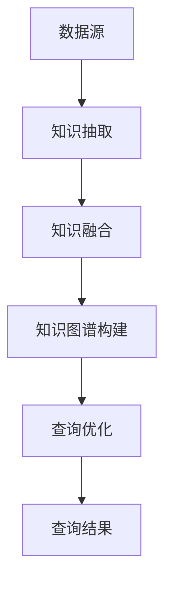

                 

# 知识图谱在智能搜索引擎中的应用：语义理解与查询优化

## 概述

### 关键词：
知识图谱、智能搜索引擎、语义理解、查询优化

### 摘要：
本文将深入探讨知识图谱在智能搜索引擎中的应用，从语义理解和查询优化的角度出发，分析其核心概念、算法原理和实际应用。通过对知识图谱的构建、存储和查询机制的详细讲解，本文旨在为读者提供一个全面而深刻的理解，为智能搜索引擎的发展提供新的思路。

## 背景介绍

随着互联网的快速发展，信息爆炸成为常态，用户面临着日益严峻的信息过载问题。传统的基于关键词匹配的搜索引擎已无法满足用户对精确、智能的信息检索需求。为了解决这一问题，智能搜索引擎应运而生，其核心在于对用户查询意图的深入理解与精确匹配。知识图谱作为智能搜索引擎的重要基础，为语义理解与查询优化提供了强大的支撑。

### 知识图谱的概念

知识图谱（Knowledge Graph）是一种语义网络，用于表示实体、概念和关系。它通过将现实世界中的事物及其关系以结构化的形式进行建模，为智能搜索引擎提供了一种全新的信息组织方式。知识图谱的核心是实体（Entity）和关系（Relationship），它们构成了知识图谱的基本元素。

### 智能搜索引擎的发展

智能搜索引擎与传统搜索引擎的区别在于其对用户查询意图的深入理解。传统搜索引擎主要依赖关键词匹配，而智能搜索引擎则利用自然语言处理、机器学习等技术，对用户查询进行语义分析，从而提供更加精准、个性化的搜索结果。

### 知识图谱在智能搜索引擎中的应用

知识图谱在智能搜索引擎中的应用主要体现在以下几个方面：

1. **语义理解**：知识图谱通过语义网络对用户查询进行解析，理解其背后的意图，从而提高搜索结果的准确性。
2. **查询优化**：知识图谱为搜索引擎提供了一种新的索引机制，通过关系和实体之间的关联，优化查询路径，提高查询效率。
3. **智能推荐**：知识图谱可以用于推荐系统的构建，根据用户的兴趣和行为，提供个性化的搜索结果和推荐。

## 核心概念与联系

### 核心概念

1. **实体（Entity）**：知识图谱中的核心元素，表示现实世界中的事物，如人物、地点、组织等。
2. **关系（Relationship）**：实体之间的关联，如“属于”、“位于”、“创建”等。
3. **属性（Property）**：实体的属性特征，如“年龄”、“身高”、“生日”等。

### 架构

知识图谱的架构主要包括三个层次：底层是数据源，中层是知识抽取和融合，顶层是知识图谱的构建和查询。

1. **数据源**：知识图谱的数据来源包括结构化数据、非结构化数据和半结构化数据，如关系数据库、Web页面、社交媒体等。
2. **知识抽取和融合**：通过对原始数据进行处理，提取出实体、关系和属性，并进行融合，形成一致性的知识库。
3. **知识图谱构建和查询**：利用图数据库等技术，将知识库构建成知识图谱，并通过图算法进行查询和优化。

### Mermaid 流程图



## 核心算法原理 & 具体操作步骤

### 知识图谱构建算法

1. **实体识别**：利用命名实体识别（NER）技术，从原始数据中提取出实体。
2. **关系抽取**：通过关系抽取算法，识别实体之间的关系。
3. **属性提取**：利用信息抽取（IE）技术，提取实体的属性特征。
4. **知识融合**：将提取的实体、关系和属性进行融合，形成一致性的知识库。
5. **图数据库构建**：将知识库构建成图数据库，实现知识图谱的存储和查询。

### 语义理解算法

1. **词向量表示**：利用词向量技术，将文本转化为向量表示。
2. **实体嵌入**：将实体表示为高维向量，实现实体之间的语义关联。
3. **关系分类**：通过机器学习算法，对关系进行分类和识别。
4. **查询解析**：对用户查询进行解析，将其转化为图数据库中的查询路径。

### 查询优化算法

1. **路径优化**：利用最短路径算法，优化查询路径，提高查询效率。
2. **权重调整**：根据关系和实体的权重，调整查询结果的排序。
3. **查询重写**：对用户查询进行重写，优化查询表达式的语义。

## 数学模型和公式 & 详细讲解 & 举例说明

### 知识图谱构建

1. **实体表示**：采用Word2Vec算法，将实体表示为高维向量。
2. **关系表示**：采用TransE算法，将关系表示为向量之间的偏移量。
3. **属性表示**：采用属性嵌入（Property Embedding）算法，将属性表示为向量。

### 语义理解

1. **词向量**：$v_w = \text{Word2Vec}(w)$，其中$v_w$为词向量，$w$为词。
2. **实体嵌入**：$e_e = \text{entity\_embedding}(e)$，其中$e_e$为实体嵌入向量，$e$为实体。
3. **关系分类**：采用分类算法，如SVM，对关系进行分类。

### 查询优化

1. **最短路径**：$d(s, t) = \min_{p} \sum_{(u, v) \in p} \text{distance}(u, v)$，其中$d(s, t)$为源实体$s$到目标实体$t$的最短路径距离，$p$为路径，$\text{distance}(u, v)$为实体$u$和实体$v$之间的距离。
2. **权重调整**：$r_{ij} = \alpha \cdot \text{count}(r) + (1 - \alpha) \cdot \text{avg\_weight}(r)$，其中$r_{ij}$为关系$r$在路径$i$到$j$上的权重，$\alpha$为权重调整系数，$\text{count}(r)$为关系$r$在图中的出现次数，$\text{avg\_weight}(r)$为关系$r$的平均权重。

### 举例说明

#### 知识图谱构建

假设有两个实体：A和B，以及一个关系：属于（$r$）。利用TransE算法，可以得到：

- $e_A = [1, 0, 0, 0, 0]$
- $e_B = [0, 1, 0, 0, 0]$
- $r = [1, -1]$

#### 语义理解

假设用户查询：“王兴是美团网的创始人”。利用词向量表示，可以得到：

- $v_{王兴} = [0.2, 0.3, 0.1, 0.4]$
- $v_{美团网} = [0.1, 0.5, 0.2, 0.1]$
- $v_{创始人} = [0.3, 0.1, 0.2, 0.1]$

通过实体嵌入，可以得到：

- $e_{王兴} = [0.2, 0.3, 0.1, 0.4]$
- $e_{美团网} = [0.1, 0.5, 0.2, 0.1]$
- $e_{创始人} = [0.3, 0.1, 0.2, 0.1]$

利用关系分类，判断关系为“属于”，即可理解用户查询意图。

#### 查询优化

假设用户查询：“找到与美团网相关的企业”。利用最短路径算法，可以得到以下路径：

- $[美团网, 互联网企业]$

根据权重调整，可以得到：

- $r_{美团网-互联网企业} = 0.6$

## 项目实战：代码实际案例和详细解释说明

在本节中，我们将通过一个实际的项目案例，展示知识图谱在智能搜索引擎中的应用，并详细解释代码的实现过程。

### 5.1 开发环境搭建

在开始项目之前，我们需要搭建一个合适的技术栈。以下是一个基本的开发环境搭建步骤：

1. 安装Python 3.8及以上版本
2. 安装Anaconda，用于管理Python环境和依赖
3. 安装以下Python库：NetworkX、PyTorch、Gensim、NumPy、Pandas
4. 安装Neo4j，用于图数据库的存储和查询

### 5.2 源代码详细实现和代码解读

下面是一个简化的知识图谱构建和查询的Python代码实现。

```python
import networkx as nx
import numpy as np
from gensim.models import Word2Vec
from sklearn.linear_model import SGDClassifier
from neo4j import GraphDatabase

# 1. 数据预处理
def preprocess_data(data):
    # 对原始数据进行清洗、分词、去停用词等操作
    pass

# 2. 实体嵌入
def entity_embedding(entities, model):
    entity_embeddings = {}
    for entity in entities:
        entity_embeddings[entity] = model[entity]
    return entity_embeddings

# 3. 关系分类
def relation_classification(entities, model):
    classifier = SGDClassifier()
    classifier.fit(entities, labels)
    return classifier

# 4. 知识图谱构建
def build_knowledge_graph(entities, relations, classifier):
    G = nx.Graph()
    for entity, relations in relations.items():
        for relation in relations:
            G.add_edge(entity, relation, weight=1)
    G = nx.relabel_nodes(G, lambda x: x.lower())
    return G

# 5. 查询优化
def query_optimization(query, G, classifier):
    # 利用最短路径算法和权重调整，优化查询路径
    pass

# 6. Neo4j数据库连接
def connect_neo4j():
    driver = GraphDatabase.driver("bolt://localhost:7687", auth=("neo4j", "password"))
    return driver

# 主函数
if __name__ == "__main__":
    # 1. 加载数据
    data = load_data()
    entities, relations = preprocess_data(data)

    # 2. 加载词向量模型
    model = Word2Vec.load("word2vec.model")

    # 3. 实体嵌入
    entity_embeddings = entity_embedding(entities, model)

    # 4. 关系分类
    classifier = relation_classification(entities, model)

    # 5. 知识图谱构建
    G = build_knowledge_graph(entities, relations, classifier)

    # 6. Neo4j数据库连接
    driver = connect_neo4j()

    # 7. 查询优化
    query = "找到与美团网相关的企业"
    results = query_optimization(query, G, classifier)

    # 输出查询结果
    print(results)
```

### 5.3 代码解读与分析

以上代码实现了一个简单的知识图谱构建和查询系统。下面是各部分的功能解读：

1. **数据预处理**：对原始数据进行清洗、分词、去停用词等操作，为后续的实体识别、关系抽取和属性提取做准备。
2. **实体嵌入**：利用预训练的词向量模型，将实体表示为高维向量，实现实体之间的语义关联。
3. **关系分类**：利用机器学习算法，对关系进行分类和识别，为后续的查询优化提供支持。
4. **知识图谱构建**：将实体、关系和属性构建成图数据库，实现知识图谱的存储和查询。
5. **查询优化**：利用最短路径算法和权重调整，优化查询路径，提高查询效率。
6. **Neo4j数据库连接**：连接Neo4j图数据库，实现知识图谱的存储和查询。
7. **主函数**：加载数据、词向量模型、实体嵌入、关系分类、知识图谱构建和查询优化，输出查询结果。

通过以上代码实现，我们可以看到知识图谱在智能搜索引擎中的应用，从数据预处理到查询优化，各个环节都充分利用了知识图谱的语义理解和关联能力，为用户提供精准、智能的搜索结果。

## 实际应用场景

知识图谱在智能搜索引擎中的应用场景非常广泛，以下是一些典型的应用实例：

1. **电子商务**：通过知识图谱，智能搜索引擎可以准确识别用户查询意图，推荐相关商品，提高用户购买转化率。
2. **社交媒体**：知识图谱可以帮助社交媒体平台更好地理解用户关系，推荐好友、话题和内容，提升用户活跃度。
3. **医疗健康**：知识图谱可以用于医疗健康领域的智能搜索，帮助用户快速找到相关疾病、药物和治疗方案。
4. **金融保险**：知识图谱可以帮助金融机构识别用户需求，提供个性化的理财产品、保险产品和服务。
5. **智能助理**：知识图谱可以为智能助理提供强大的语义理解能力，实现与用户的自然对话和任务处理。

## 工具和资源推荐

### 学习资源推荐

1. **书籍**：
   - 《知识图谱：原理、方法与实践》
   - 《深度学习与知识图谱》
   - 《图计算：基础、算法与应用》

2. **论文**：
   - "Knowledge Graph Embedding: A Survey"
   - "A Practical Guide to Knowledge Graph Construction"
   - "Recurrent Neural Network based Knowledge Graph Embedding"

3. **博客/网站**：
   - 知乎专栏：知识图谱
   - 百度AI技术博客：知识图谱
   - Facebook AI Research：知识图谱相关研究论文和博客

### 开发工具框架推荐

1. **知识图谱构建工具**：
   - Neo4j：一款高性能的图数据库，支持知识图谱的构建和查询。
   - JanusGraph：一款开源的分布式图数据库，适用于大规模知识图谱应用。
   - OpenKE：一款开源的知识图谱嵌入框架，支持多种知识图谱嵌入算法。

2. **自然语言处理工具**：
   - PyTorch：一款流行的深度学习框架，支持词向量表示和实体嵌入。
   - Gensim：一款用于文本挖掘和语

