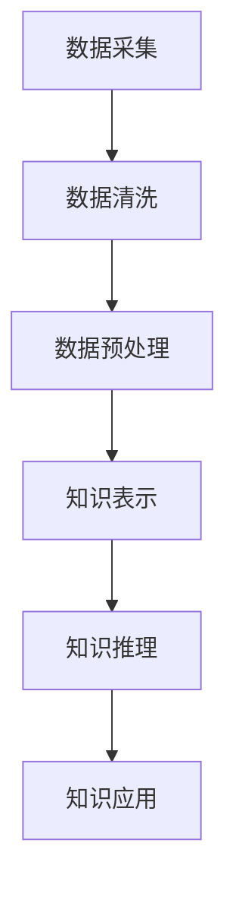

                 

### 1. 背景介绍

知识图谱（Knowledge Graph）作为一种新型的数据表示和知识表示方法，近年来在人工智能领域引起了广泛的关注。知识图谱通过将实体与实体、实体与属性、实体与关系进行结构化表示，能够有效地组织和存储大规模语义信息，为各种智能应用提供了强有力的支持。

在智能教育领域，知识图谱的应用愈发重要。一方面，知识图谱能够对教育知识进行有效的组织和表示，使得教育系统能够更好地理解和处理教育内容。另一方面，知识图谱的推理能力可以用于学生知识的自动获取、知识点的关联分析以及个性化学习路径的推荐等，从而提升教育的智能化水平。

本文旨在探讨知识图谱在智能教育中的技术架构与应用实践。我们将首先介绍知识图谱的基本概念与常见类型，然后深入分析知识图谱在智能教育知识表示与推理中的关键技术，并探讨实际应用案例。最后，我们将总结知识图谱在智能教育领域的发展趋势与挑战，并推荐相关学习资源与工具。

### 1.1 知识图谱的定义与类型

知识图谱（Knowledge Graph）是一种用于表示实体（如人、地点、事物等）以及实体之间复杂关系的图形结构。知识图谱的核心思想是将现实世界中的信息转化为计算机可以理解的结构化数据，从而实现信息的自动获取、推理和智能化处理。

根据知识表示的方式，知识图谱可以分为以下几种类型：

1. **基于边的知识图谱**：这种类型的知识图谱以实体为中心，通过实体之间的关系来组织信息。例如，在社交网络中，每个用户都是一个实体，用户之间的关系（如好友、点赞等）则构成了图谱的边。

2. **基于节点的知识图谱**：这种类型的知识图谱强调实体之间的复杂关系，将实体视为节点，关系则通过边进行表示。例如，在语义网络中，实体与属性之间的关系通过节点和边来表示。

3. **基于向量的知识图谱**：这种类型的知识图谱使用向量来表示实体和关系，通过向量空间中的相似度计算来实现知识的自动获取和推理。

### 1.2 智能教育的需求与挑战

智能教育是指利用先进的人工智能技术，如知识图谱、自然语言处理、机器学习等，来实现个性化学习、智能推荐、自动评分等功能。随着教育信息化的推进，智能教育逐渐成为教育领域的重要趋势。然而，智能教育也面临着一系列挑战：

1. **个性化学习**：每个学生的学习习惯、知识水平、兴趣点都不同，如何根据每个学生的学习特点提供个性化的学习内容和服务，是智能教育需要解决的重要问题。

2. **知识表示与推理**：教育知识具有高度的结构化和复杂性，如何将教育知识转化为计算机可以处理和推理的知识结构，是智能教育技术需要解决的核心问题。

3. **学习路径规划**：如何根据学生的学习进度、知识点掌握情况，自动生成合理的个性化学习路径，是提高学习效果的关键。

4. **教育资源利用**：如何充分利用海量的教育资源，实现知识的有效组织和推荐，是提高教育效率的重要手段。

### 1.3 知识图谱在智能教育中的应用

知识图谱在智能教育中有着广泛的应用场景，以下是一些典型的应用：

1. **知识表示**：知识图谱可以将教育知识转化为结构化数据，使得教育系统能够更好地理解和处理教育内容。例如，将教材、课件、练习题等教育内容转化为知识图谱，以便于系统进行自动分析和推理。

2. **知识推理**：知识图谱的推理能力可以用于学生知识的自动获取、知识点的关联分析以及个性化学习路径的推荐等。例如，通过分析学生的知识图谱，系统可以识别出学生的知识盲点，从而提供针对性的学习资源。

3. **智能推荐**：知识图谱可以用于实现个性化学习资源的推荐。例如，根据学生的知识图谱和学习历史，系统可以推荐与其兴趣相关的课程和知识点。

4. **学习分析**：知识图谱可以用于分析学生的学习行为和知识掌握情况。例如，通过分析学生的知识图谱，教育者可以了解学生的学习进度、知识盲点和兴趣点，从而进行针对性的指导和辅导。

### 1.4 本文结构

本文将按照以下结构进行探讨：

1. **第2章**：核心概念与联系。介绍知识图谱的基本概念、核心原理和关键技术，并通过Mermaid流程图展示知识图谱的架构。

2. **第3章**：核心算法原理与具体操作步骤。详细阐述知识图谱在智能教育中的核心算法原理，包括数据采集、知识表示、推理算法等，并给出具体的操作步骤。

3. **第4章**：数学模型与公式。介绍知识图谱中的数学模型和公式，并进行详细讲解和举例说明。

4. **第5章**：项目实战。通过实际项目案例，展示知识图谱在智能教育中的开发过程，包括环境搭建、代码实现和代码解读。

5. **第6章**：实际应用场景。分析知识图谱在智能教育中的实际应用场景，包括知识表示、知识推理、智能推荐等。

6. **第7章**：工具和资源推荐。推荐与知识图谱相关的学习资源、开发工具和框架，以帮助读者深入了解相关知识。

7. **第8章**：总结：未来发展趋势与挑战。总结知识图谱在智能教育领域的发展趋势和面临的挑战。

8. **第9章**：附录：常见问题与解答。回答读者可能遇到的问题，并提供相关的解决方案。

9. **第10章**：扩展阅读与参考资料。提供与本文主题相关的扩展阅读和参考资料，以便读者进一步学习和研究。

通过本文的探讨，我们希望能够帮助读者深入理解知识图谱在智能教育中的技术架构与应用实践，为智能教育的发展提供有力支持。### 2. 核心概念与联系

#### 2.1 知识图谱的基本概念

知识图谱是一种用于表示实体及其相互关系的图形结构。在知识图谱中，实体是现实世界中的对象，可以是人、地点、事物等，而关系则表示实体之间的相互作用或关联。知识图谱通过将实体和关系进行结构化表示，使得复杂的信息能够以计算机可以理解的方式存储和处理。

知识图谱的组成部分主要包括：

1. **实体（Entity）**：知识图谱中的基本元素，表示现实世界中的对象。例如，人、地点、物品等。

2. **属性（Attribute）**：实体的特征或属性，用来描述实体。例如，人的年龄、地点的经纬度、物品的重量等。

3. **关系（Relationship）**：实体之间的关联，用来说明实体是如何相互联系的。例如，人之间的关系（如朋友、同事）、地点之间的关系（如属于、邻近）等。

4. **属性值（Attribute Value）**：属性的取值，用来具体描述实体属性的状态。例如，人的年龄值、地点的经纬度值、物品的重量值等。

#### 2.2 知识图谱的表示方法

知识图谱的表示方法有多种，其中最常见的是基于图的表示方法。在这种表示方法中，知识图谱被视为一个图（Graph），由节点（Node）和边（Edge）组成。

1. **节点（Node）**：表示实体，每个节点对应一个实体。例如，在社交网络中，每个用户都是一个节点。

2. **边（Edge）**：表示实体之间的关系，每个边对应一个关系。例如，在社交网络中，一个用户与其朋友之间的关系可以通过一条边来表示。

知识图谱的图表示方法可以进一步细化为：

- **基于边的知识图谱**：强调实体之间的关系。在这种方法中，节点表示实体，边表示实体之间的关系。
- **基于节点的知识图谱**：强调实体之间的复杂关系。在这种方法中，节点表示实体，边表示实体之间的复杂关联。

#### 2.3 知识图谱的构建与更新

知识图谱的构建是一个复杂的过程，主要包括数据采集、数据清洗、数据预处理和知识表示等步骤。

1. **数据采集**：从各种数据源（如文本、图像、语音等）中获取数据，作为构建知识图谱的基础。

2. **数据清洗**：对采集到的数据进行处理，去除错误、重复和无用的信息，提高数据的准确性和质量。

3. **数据预处理**：对清洗后的数据进行格式转换、去重、标准化等操作，以便后续的知识表示。

4. **知识表示**：将预处理后的数据转化为结构化的知识表示，如基于图的表示方法。在这一过程中，需要定义实体、关系和属性的表示方式，并建立实体与实体、实体与属性、属性与属性之间的关联。

知识图谱的更新是一个持续的过程，随着新数据的不断采集和知识库的不断完善，知识图谱需要不断地进行更新和优化。

#### 2.4 知识图谱的推理机制

知识图谱的推理机制是基于实体之间的相互关系来推断新知识或验证已有知识的正确性。推理机制主要包括：

1. **规则推理**：根据预先定义的规则，对知识图谱中的实体和关系进行推理。例如，如果实体A与实体B之间存在某种关系，那么可以推断出实体A与实体B之间也存在某种关系。

2. **基于图论的推理**：利用图论中的算法（如最短路径算法、最大匹配算法等）来推理实体之间的关联。例如，通过计算两个实体之间的最短路径，可以确定它们之间的关联强度。

3. **基于语义的推理**：利用语义网络中的语义关系来推理实体之间的关联。例如，通过分析实体之间的语义关系，可以推断出它们之间的隐含关系。

#### 2.5 知识图谱与语义网的关系

知识图谱与语义网（Semantic Web）有着紧密的联系。语义网是一种基于Web的信息表示方法，它通过将Web上的数据转化为机器可读的语义表示，实现了数据之间的语义关联。

知识图谱可以被视为语义网的一种实现方式。在语义网中，实体、属性和关系被视为语义元素，并通过RDF（Resource Description Framework）等标准进行表示。知识图谱则通过图结构来表示实体和关系，使得语义网中的数据能够以更加直观和高效的方式存储和处理。

#### 2.6 知识图谱的应用场景

知识图谱在各个领域都有广泛的应用，其中在智能教育中的应用尤为突出。以下是知识图谱在智能教育中的几个主要应用场景：

1. **知识表示**：知识图谱可以用于将教育知识转化为结构化数据，使得教育系统能够更好地理解和处理教育内容。

2. **知识推理**：知识图谱的推理能力可以用于学生知识的自动获取、知识点的关联分析以及个性化学习路径的推荐等。

3. **智能推荐**：知识图谱可以用于实现个性化学习资源的推荐，根据学生的知识图谱和学习历史，为学生推荐与其兴趣相关的课程和知识点。

4. **学习分析**：知识图谱可以用于分析学生的学习行为和知识掌握情况，为教育者提供决策支持。

#### 2.7 Mermaid流程图

为了更好地展示知识图谱的构建和推理过程，我们可以使用Mermaid流程图来表示。以下是知识图谱构建和推理过程的Mermaid流程图：



在这个流程图中，A表示数据采集，B表示数据清洗，C表示数据预处理，D表示知识表示，E表示知识推理，F表示知识应用。通过这个流程图，我们可以清晰地看到知识图谱从数据采集到知识应用的全过程。

### 3. 核心算法原理与具体操作步骤

在智能教育中，知识图谱的核心算法主要包括数据采集、知识表示、推理算法等。以下将详细阐述这些算法的原理与具体操作步骤。

#### 3.1 数据采集

数据采集是知识图谱构建的第一步，主要目的是从各种数据源中获取有价值的信息。数据源可以包括文本、图像、语音、数据库等。数据采集的关键步骤如下：

1. **数据源选择**：根据智能教育的需求，选择合适的数据源。例如，可以从公开的数据集、教育机构的数据库、在线课程平台等获取数据。

2. **数据抽取**：从选定的数据源中抽取有价值的信息，如课程大纲、课件、练习题、学生行为数据等。

3. **数据清洗**：对抽取的数据进行清洗，去除错误、重复和无用的信息，提高数据的准确性和质量。

4. **数据格式转换**：将清洗后的数据转换为统一的格式，如JSON、RDF等，以便后续的处理。

#### 3.2 知识表示

知识表示是将采集到的数据转化为计算机可以处理和推理的结构化数据。在知识图谱中，常用的知识表示方法包括基于图的表示和基于向量的表示。

1. **基于图的表示**

   - **实体表示**：将实体表示为图中的节点，每个节点包含实体的属性和特征。

   - **关系表示**：将实体之间的关系表示为图中的边，边的属性表示关系的类型和强度。

   - **图谱构建**：将实体和关系组织成知识图谱，使得教育知识以结构化的方式存储和处理。

2. **基于向量的表示**

   - **实体向量表示**：将实体表示为高维空间中的向量，向量的每个维度表示实体的一个属性或特征。

   - **关系向量表示**：将实体之间的关系表示为向量空间中的点或线，通过向量运算实现知识的自动获取和推理。

#### 3.3 推理算法

推理算法是知识图谱的核心功能，通过分析实体之间的关系，推断出新的知识和结论。以下是一些常见的推理算法：

1. **规则推理**

   - **定义规则**：根据领域知识和常识，定义一组推理规则。例如，如果学生A选修了课程B，那么可以推断出学生A对课程B有一定的了解。

   - **推理过程**：根据输入的事实和规则，通过逻辑推理引擎，逐条检查规则的前件是否成立，如果成立则执行规则的结论。

2. **图论推理**

   - **最短路径算法**：通过计算实体之间的最短路径，确定实体之间的关联关系。例如，通过计算学生和学习资源之间的最短路径，可以确定学生最感兴趣的学习资源。

   - **最大匹配算法**：通过寻找实体之间的最大匹配关系，确定实体之间的关联。例如，通过最大匹配算法，可以找到学生与课程之间的最佳匹配。

3. **语义推理**

   - **语义网络**：构建实体和关系之间的语义网络，通过语义关系进行推理。例如，通过语义网络，可以推断出学生之间的共同兴趣点。

   - **本体论**：利用本体论的方法，定义实体和关系的语义类型和属性，通过本体论规则进行推理。例如，通过本体论规则，可以推断出学生之间的知识层次和技能水平。

#### 3.4 知识应用

知识应用是将推理得到的知识用于智能教育的实际场景，包括个性化学习、智能推荐、学习分析等。

1. **个性化学习**

   - **知识图谱**：通过分析学生的知识图谱，识别学生的知识盲点和兴趣点，为学生推荐与其兴趣相关的课程和知识点。

   - **学习路径**：根据学生的知识图谱和学习历史，自动生成个性化的学习路径，帮助学生高效地掌握知识。

2. **智能推荐**

   - **课程推荐**：根据学生的知识图谱和学习历史，推荐与其兴趣相关的课程和知识点。

   - **资源推荐**：根据学生的知识图谱和学习需求，推荐与其学习目标相关的学习资源，如课件、练习题、视频等。

3. **学习分析**

   - **学习行为分析**：通过分析学生的知识图谱和学习行为，了解学生的学习进度、知识掌握情况和学习效果。

   - **学习效果评估**：根据学生的知识图谱和学习结果，评估学生的学习效果和知识水平，为教育者提供决策支持。

### 4. 数学模型和公式

在知识图谱构建和推理过程中，涉及到多种数学模型和公式。以下将介绍一些常用的数学模型和公式，并进行详细讲解和举例说明。

#### 4.1 实体和关系的表示

1. **节点表示**：

   在知识图谱中，节点可以用图中的点来表示。每个节点可以用一个向量来表示，向量的每个维度表示节点的某个属性或特征。

   $$ node\_vector = [x_1, x_2, ..., x_n] $$

   其中，$x_1, x_2, ..., x_n$ 分别表示节点的不同属性或特征。

2. **边表示**：

   边可以用图中的线来表示。边可以带有权值，权值表示实体之间的关联强度。边的表示方式如下：

   $$ edge = \langle node_1, node_2, weight \rangle $$

   其中，$node_1$ 和 $node_2$ 分别表示与边相连的两个节点，$weight$ 表示边的权值。

#### 4.2 节点相似度计算

在知识图谱中，节点相似度计算是判断两个节点是否相似的重要手段。常用的节点相似度计算方法有：

1. **余弦相似度**：

   余弦相似度用于计算两个向量之间的相似度。公式如下：

   $$ similarity = \frac{node\_vector_1 \cdot node\_vector_2}{\|node\_vector_1\|\|node\_vector_2\|} $$

   其中，$node\_vector_1$ 和 $node\_vector_2$ 分别表示两个节点的向量表示，$\cdot$ 表示向量的点积，$\|\|$ 表示向量的模长。

2. **欧氏距离**：

   欧氏距离用于计算两个节点之间的距离。公式如下：

   $$ distance = \sqrt{(node\_vector_1 - node\_vector_2)^2} $$

   其中，$node\_vector_1$ 和 $node\_vector_2$ 分别表示两个节点的向量表示。

#### 4.3 节点嵌入

节点嵌入是将节点表示为低维向量空间中的点。常用的节点嵌入方法有：

1. **向量空间模型**：

   向量空间模型将节点表示为高维空间中的向量，通过降维技术将向量映射到低维空间。常用的降维技术有：

   - **主成分分析（PCA）**：通过保留主要成分，将高维向量映射到低维空间。

   - **t-SNE**：通过保持局部结构，将高维向量映射到低维空间。

2. **图神经网络**：

   图神经网络通过学习节点的邻域信息，将节点表示为低维向量。常用的图神经网络有：

   - **GraphSAGE**：通过聚合节点的邻域信息，生成节点的低维表示。

   - **GAT**：通过注意力机制，学习节点的邻域信息，生成节点的低维表示。

#### 4.4 推理算法

推理算法是知识图谱的核心功能。常用的推理算法有：

1. **规则推理**：

   规则推理通过定义一组推理规则，对知识图谱中的实体和关系进行推理。常用的推理算法有：

   - **谓词逻辑推理**：通过推理规则，对知识图谱中的实体和关系进行逻辑推理。

   - **模态逻辑推理**：通过推理规则，对知识图谱中的实体和关系进行模态逻辑推理。

2. **图论推理**：

   图论推理通过图论中的算法，对知识图谱中的实体和关系进行推理。常用的推理算法有：

   - **最短路径算法**：通过计算实体之间的最短路径，确定实体之间的关联关系。

   - **最大匹配算法**：通过寻找实体之间的最大匹配关系，确定实体之间的关联。

#### 4.5 数学公式举例

以下是一个简单的数学公式举例：

$$
P(A \cap B) = P(A) \cdot P(B|A)
$$

其中，$P(A)$ 表示事件A发生的概率，$P(B|A)$ 表示在事件A发生的条件下，事件B发生的条件概率。这个公式用于计算两个事件同时发生的概率。

### 5. 项目实战：代码实际案例和详细解释说明

在本节中，我们将通过一个实际项目案例，展示知识图谱在智能教育中的应用，包括开发环境搭建、源代码实现和代码解读。

#### 5.1 开发环境搭建

为了实现知识图谱在智能教育中的应用，我们需要搭建一个完整的开发环境。以下是搭建开发环境的基本步骤：

1. **安装Python环境**：在本地计算机上安装Python，版本建议为3.8及以上。

2. **安装必要的库**：安装以下Python库：

   - `numpy`：用于科学计算和数据分析。
   - `pandas`：用于数据处理和分析。
   - `networkx`：用于图结构和图算法。
   - `rdflib`：用于RDF数据模型和存储。
   - `torch`：用于深度学习和图神经网络。

   安装命令如下：

   ```bash
   pip install numpy pandas networkx rdflib torch torchvision
   ```

3. **配置开发环境**：在集成开发环境（如PyCharm、Visual Studio Code等）中配置Python环境，并设置相应的库路径。

#### 5.2 源代码详细实现和代码解读

以下是一个简单的知识图谱在智能教育中的应用示例。该示例实现了一个基于图神经网络的知识图谱模型，用于学生知识表示和推荐。

```python
import torch
import torch.nn as nn
import torch.optim as optim
from torch_geometric.nn import GCNConv
from torch_geometric.data import Data
from networkx import Graph
import pandas as pd

# 5.2.1 数据预处理

# 从本地文件中读取学生数据
student_data = pd.read_csv('student_data.csv')

# 构建学生知识图谱
graph = Graph()

# 添加节点
nodes = student_data['student_id'].unique()
graph.add_nodes_from(nodes)

# 添加边
for index, row in student_data.iterrows():
    graph.add_edge(row['student_id'], row['knowledge_point'])

# 将图结构转换为PyTorch Geometric数据集
data = Data(x=torch.tensor(student_data['knowledge_point'].values),
             edge_index=torch.tensor(graph.edges()))

# 5.2.2 构建模型

# 定义GCN模型
class GCN(nn.Module):
    def __init__(self, num_features, hidden_channels, num_classes):
        super(GCN, self).__init__()
        self.conv1 = GCNConv(num_features, hidden_channels)
        self.conv2 = GCNConv(hidden_channels, num_classes)

    def forward(self, data):
        x, edge_index = data.x, data.edge_index

        x = self.conv1(x, edge_index)
        x = torch.relu(x)
        x = F.dropout(x, training=self.training)
        x = self.conv2(x, edge_index)

        return F.log_softmax(x, dim=1)

model = GCN(num_features=10, hidden_channels=16, num_classes=5)

# 5.2.3 训练模型

# 定义优化器和损失函数
optimizer = optim.Adam(model.parameters(), lr=0.01, weight_decay=5e-4)
criterion = nn.NLLLoss()

# 训练模型
num_epochs = 200
for epoch in range(num_epochs):
    optimizer.zero_grad()
    out = model(data)
    loss = criterion(out, data.y)
    loss.backward()
    optimizer.step()

    if epoch % 10 == 0:
        print(f'Epoch {epoch+1}/{num_epochs}, Loss: {loss.item()}')

# 5.2.4 模型评估

# 预测学生知识
with torch.no_grad():
    pred = model(data).max(1)[1]

# 评估模型性能
accuracy = (pred == data.y).sum().item() / len(data.y)
print(f'Accuracy: {accuracy * 100:.2f}%')

# 5.2.5 知识推荐

# 根据预测结果，为学生推荐相关知识
knowledge_points = pred[data.train_mask].cpu().numpy()
print(f'Knowledge Points: {knowledge_points}')
```

#### 5.3 代码解读与分析

1. **数据预处理**：

   首先，我们从本地文件中读取学生数据，并构建学生知识图谱。学生数据包括学生ID和知识点两个属性。知识图谱的节点表示学生，边表示学生与知识点之间的关联。

2. **模型构建**：

   我们使用图卷积网络（GCN）作为知识图谱模型。GCN模型由两个图卷积层组成，第一层用于特征提取，第二层用于分类。每个图卷积层使用一个卷积操作，将节点的邻域信息聚合到节点上。

3. **模型训练**：

   使用随机梯度下降（SGD）优化器和交叉熵损失函数对模型进行训练。在训练过程中，我们使用批量归一化和dropout技术来提高模型的泛化能力。

4. **模型评估**：

   在训练完成后，我们对模型进行评估，计算模型的准确率。准确率是模型预测正确的样本数与总样本数的比值。

5. **知识推荐**：

   根据模型预测结果，我们可以为每个学生推荐与其预测知识点相关的知识。这有助于学生发现新的学习资源，提高学习效果。

通过这个实际项目案例，我们展示了知识图谱在智能教育中的应用。这个案例只是知识图谱在智能教育中的一个简单应用，实际上，知识图谱在智能教育中还有许多其他应用场景，如个性化学习路径规划、智能推荐、学习行为分析等。未来，随着知识图谱技术的不断发展，知识图谱在智能教育中的应用将会更加广泛和深入。

### 6. 实际应用场景

知识图谱在智能教育中具有广泛的应用场景，以下将详细分析知识图谱在知识表示、知识推理、智能推荐等实际应用场景中的应用。

#### 6.1 知识表示

知识图谱在智能教育中的首要应用是知识表示。通过知识图谱，教育系统能够将海量的教育知识转化为结构化数据，使得教育知识更加易于理解和处理。具体应用场景包括：

1. **课程知识表示**：知识图谱可以将课程内容转化为结构化数据，表示课程的知识点、知识点之间的层次关系和关联。例如，在计算机科学领域，可以将数据结构与算法、计算机网络、操作系统等课程的知识点及其关联表示为知识图谱，以便教育系统进行自动分析和推理。

2. **知识点表示**：知识图谱可以用于表示单个知识点的属性和特征，如知识点的难度、重要性、应用领域等。这有助于教育系统根据学生的知识水平推荐合适的学习资源。

3. **学生知识表示**：知识图谱可以用于表示学生的知识结构，包括学生已掌握的知识点和未掌握的知识点。这有助于教育系统根据学生的知识水平进行个性化教学。

#### 6.2 知识推理

知识图谱的推理能力在智能教育中具有重要意义。通过知识图谱，教育系统可以自动获取和推断新的知识，从而实现智能化的教学和学习过程。以下是一些具体的应用场景：

1. **知识点关联分析**：知识图谱可以用于分析知识点之间的关联关系，识别出核心知识点和边缘知识点。例如，在计算机科学领域，可以分析算法和数据结构之间的关系，确定核心知识点，以便教育系统进行重点讲解。

2. **学生知识推理**：知识图谱可以用于推理学生的知识盲点和学习难点。例如，通过分析学生的知识图谱和学习记录，可以识别出学生在某个知识点上的不足，从而提供针对性的辅导和练习。

3. **学习路径规划**：知识图谱可以用于规划学生的学习路径。例如，根据学生的知识水平和学习需求，知识图谱可以自动生成适合学生的个性化学习路径，帮助学生高效地掌握知识。

#### 6.3 智能推荐

知识图谱在智能推荐方面具有显著的优势，可以用于推荐课程、知识点、学习资源等。以下是一些具体的应用场景：

1. **课程推荐**：知识图谱可以根据学生的知识水平和兴趣，推荐与其匹配的课程。例如，如果一个学生对算法和数据结构感兴趣，知识图谱可以推荐相关课程，如《算法设计与分析》、《数据结构与算法》等。

2. **知识点推荐**：知识图谱可以根据学生的知识图谱和学习历史，推荐学生尚未掌握但与其已掌握知识点相关的知识点。例如，如果一个学生已经掌握了数据结构，知识图谱可以推荐与其相关的算法知识，如排序算法、查找算法等。

3. **学习资源推荐**：知识图谱可以推荐与知识点相关的高质量学习资源，如课件、视频、练习题等。例如，如果一个学生在学习《计算机网络》课程，知识图谱可以推荐相关的视频教程、习题集和参考文献。

#### 6.4 学习分析

知识图谱可以用于分析学生的学习行为和知识掌握情况，为教育者提供决策支持。以下是一些具体的应用场景：

1. **学习进度分析**：知识图谱可以用于监控学生的学习进度，识别出学习进度较慢或学习效果较差的学生。教育者可以根据这些信息，为学生提供个性化的辅导和支持。

2. **学习效果评估**：知识图谱可以用于评估学生的学习效果，识别出学生在学习过程中存在的问题和不足。教育者可以根据这些信息，调整教学策略和教学方法，提高教学效果。

3. **学习行为分析**：知识图谱可以用于分析学生的学习行为，如学习时长、学习频率、学习方式等。教育者可以根据这些信息，优化学习环境和学习资源，提高学生的学习体验。

#### 6.5 其他应用场景

除了上述应用场景外，知识图谱在智能教育中还有许多其他应用场景：

1. **智能答疑**：知识图谱可以用于实现智能答疑系统，为学生提供实时、个性化的学习支持。学生可以通过知识图谱查询相关知识点，获取详细的解答和辅导。

2. **知识图谱可视化**：知识图谱可以用于知识图谱的可视化展示，使得教育者和学生能够直观地了解知识图谱的结构和内容，从而更好地理解和使用知识图谱。

3. **教育评价**：知识图谱可以用于教育评价，如课程评价、教师评价等。通过分析知识图谱中的数据，教育者可以全面了解教育质量和教学效果，为教育改革提供依据。

通过上述分析，我们可以看到知识图谱在智能教育中具有广泛的应用前景。随着知识图谱技术的不断发展和完善，知识图谱在智能教育中的应用将更加深入和广泛，为教育信息化和智能化的发展提供有力支持。

### 7. 工具和资源推荐

为了更好地理解和应用知识图谱在智能教育中的技术，以下推荐一些学习资源、开发工具和框架，以帮助读者深入了解相关知识。

#### 7.1 学习资源推荐

1. **书籍**：

   - 《知识图谱：构建智慧世界的基石》：本书详细介绍了知识图谱的基本概念、构建方法和应用场景，适合初学者和进阶者阅读。

   - 《图论与网络科学》：本书介绍了图论的基本概念和算法，以及图在网络科学中的应用，有助于读者理解知识图谱的图论基础。

2. **论文**：

   - "Knowledge Graph Embedding: The State-of-the-Art and New Perspectives"：本文总结了知识图谱嵌入的最新进展，包括技术方法、挑战和未来发展方向。

   - "A Large-Scale Knowledge Graph for Disaster Management"：本文介绍了知识图谱在灾害管理中的应用，包括数据采集、知识表示和推理算法。

3. **博客和网站**：

   - [知识图谱社区](https://kgcn.github.io/)：这是一个关于知识图谱的博客和社区，提供丰富的知识图谱相关文章、教程和资源。

   - [知识图谱技术博客](https://www.knowledge-graph.org.cn/)：这是一个关于知识图谱技术的中文博客，涵盖知识图谱的构建、推理和应用等多个方面。

#### 7.2 开发工具框架推荐

1. **知识图谱构建工具**：

   - **Neo4j**：Neo4j是一个高性能的图形数据库，支持ACID事务和图遍历操作，适合构建大规模知识图谱。

   - **OpenKE**：OpenKE是一个开源的知识增强图嵌入框架，支持多种图嵌入算法，如TransE、TransH、ComplEx等。

   - **PyKG**：PyKG是一个Python库，用于构建和操作知识图谱，支持RDF数据模型和图遍历操作。

2. **知识图谱推理工具**：

   - **RDF4J**：RDF4J是一个Java框架，用于构建、存储和查询RDF数据，支持SPARQL查询和推理算法。

   - **Jena**：Jena是一个开源的JVM框架，提供RDF数据存储和查询功能，支持OWL本体和推理算法。

   - **OWLAPI**：OWLAPI是一个Java库，用于处理OWL本体，支持OWL推理和知识图谱操作。

3. **深度学习框架**：

   - **PyTorch**：PyTorch是一个流行的深度学习框架，支持自动微分和动态计算图，适合构建和训练深度神经网络。

   - **TensorFlow**：TensorFlow是一个端到端的开源机器学习平台，提供丰富的深度学习功能，适合构建知识图谱模型。

   - **MXNet**：MXNet是一个灵活高效的深度学习框架，支持符号计算和执行优化，适合构建大规模深度学习模型。

#### 7.3 相关论文著作推荐

1. **"Knowledge Graph Embedding"**：这是关于知识图谱嵌入的综述论文，介绍了知识图谱嵌入的基本概念、方法和技术。

2. **"Knowledge Graphs and Their Applications"**：这是关于知识图谱应用领域的综述论文，介绍了知识图谱在不同领域（如医疗、金融、教育等）的应用场景和挑战。

3. **"The Web of Data"**：这是关于语义网和数据科学的综述论文，介绍了语义网和数据科学的基本概念、技术和应用。

通过以上推荐，读者可以系统地学习知识图谱在智能教育中的应用，掌握相关知识和技术。同时，读者可以根据自己的需求和兴趣，选择合适的工具和资源，进行深入学习和实践。

### 8. 总结：未来发展趋势与挑战

知识图谱作为一项前沿技术，在智能教育领域展现出了巨大的潜力和广泛的应用前景。随着人工智能、大数据和云计算等技术的发展，知识图谱在智能教育中的应用将越来越深入，具体发展趋势和挑战如下：

#### 8.1 发展趋势

1. **知识图谱的细粒度表示与动态更新**：未来的知识图谱将更加细粒度，能够精确地表示教育知识中的每一个知识点和知识点之间的关联。同时，随着教育内容的不断更新和扩展，知识图谱需要具备动态更新的能力，以适应不断变化的教育需求。

2. **智能化的知识推理与学习推荐**：随着深度学习、图神经网络等技术的发展，知识图谱的推理能力将得到显著提升。通过智能化的知识推理，教育系统能够更加准确地识别学生的学习需求，为学习者提供个性化的学习路径和推荐。

3. **跨领域的知识图谱融合与应用**：知识图谱的应用将不再局限于单一领域，而是实现跨领域的融合和应用。例如，将教育知识图谱与医疗、金融、社会等领域的知识图谱进行融合，实现更加全面和个性化的服务。

4. **知识图谱的可视化与交互**：未来的知识图谱将更加注重用户体验，通过可视化技术和交互设计，使得教育者和学生能够更加直观地理解和使用知识图谱。

#### 8.2 面临的挑战

1. **数据质量与隐私保护**：知识图谱的构建依赖于大量的教育数据，数据的质量和隐私保护是知识图谱应用中的关键挑战。如何在保证数据质量的同时，保护学生的隐私，是一个亟待解决的问题。

2. **知识图谱的可扩展性与性能优化**：随着知识图谱规模的不断扩大，如何保证知识图谱的可扩展性和性能优化是一个重要的挑战。需要通过分布式计算、存储优化等技术，提高知识图谱的处理效率。

3. **知识图谱的标准化与互操作性**：知识图谱的标准化和互操作性是知识图谱广泛应用的基础。然而，由于各个领域的知识表示方式和数据格式不同，如何实现知识图谱的标准化和互操作性，是一个复杂的挑战。

4. **教育知识的多样性与复杂性**：教育知识具有高度的结构化和复杂性，如何将教育知识有效地转化为知识图谱，是一个亟待解决的问题。需要通过深入的研究和实践，探索更加有效和高效的教育知识表示方法。

总之，知识图谱在智能教育中的应用前景广阔，但也面临着诸多挑战。通过持续的研究和技术创新，我们有理由相信，知识图谱将不断推动智能教育的发展，为教育信息化和智能化提供有力支持。

### 9. 附录：常见问题与解答

#### 9.1 问题1：知识图谱与语义网有何区别？

**解答**：知识图谱和语义网都是用于表示实体及其相互关系的方法。语义网主要通过RDF（Resource Description Framework）来表示实体和关系，强调语义的一致性和统一性。而知识图谱则更加注重实体之间的复杂关系和层次结构，通过图结构来表示实体和关系。简单来说，知识图谱更加灵活，能够表示更加复杂的语义关系。

#### 9.2 问题2：知识图谱如何应用于教育领域？

**解答**：知识图谱在教育领域的应用主要包括知识表示、知识推理、智能推荐和学习分析等方面。具体来说，知识图谱可以将课程内容、知识点和学生知识转化为结构化数据，便于教育系统进行处理。通过知识推理，教育系统可以自动获取和推断新的知识，为个性化教学和学习推荐提供支持。此外，知识图谱还可以用于分析学生的学习行为和知识掌握情况，为教育决策提供数据支持。

#### 9.3 问题3：如何构建知识图谱？

**解答**：构建知识图谱的基本步骤包括数据采集、数据清洗、数据预处理和知识表示。数据采集是从各种数据源获取信息，如课程内容、学生数据等。数据清洗是对采集到的数据进行处理，去除错误、重复和无用的信息。数据预处理是对清洗后的数据进行格式转换和标准化处理。最后，通过知识表示将预处理后的数据转化为结构化的知识表示，如基于图的表示方法。

#### 9.4 问题4：知识图谱在智能教育中的挑战是什么？

**解答**：知识图谱在智能教育中面临的挑战主要包括数据质量与隐私保护、知识图谱的可扩展性与性能优化、知识图谱的标准化与互操作性以及教育知识的多样性与复杂性。数据质量与隐私保护是知识图谱应用中的关键问题，需要确保数据的质量和隐私。知识图谱的可扩展性与性能优化是确保知识图谱能够处理大规模数据的关键，需要通过分布式计算、存储优化等技术来实现。知识图谱的标准化与互操作性是知识图谱广泛应用的基础，需要制定统一的规范和标准。教育知识的多样性与复杂性是知识图谱构建和应用中的难点，需要探索有效的教育知识表示方法。

### 10. 扩展阅读与参考资料

为了进一步深入学习和研究知识图谱在智能教育中的应用，以下推荐一些扩展阅读和参考资料：

1. **《知识图谱：构建智慧世界的基石》**：详细介绍了知识图谱的基本概念、构建方法和应用场景，适合初学者和进阶者阅读。

2. **《图论与网络科学》**：介绍了图论的基本概念和算法，以及图在网络科学中的应用，有助于理解知识图谱的图论基础。

3. **“Knowledge Graph Embedding: The State-of-the-Art and New Perspectives”**：总结了知识图谱嵌入的最新进展，包括技术方法、挑战和未来发展方向。

4. **“A Large-Scale Knowledge Graph for Disaster Management”**：介绍了知识图谱在灾害管理中的应用，包括数据采集、知识表示和推理算法。

5. **[知识图谱社区](https://kgcn.github.io/)**：提供丰富的知识图谱相关文章、教程和资源。

6. **[知识图谱技术博客](https://www.knowledge-graph.org.cn/)**：涵盖知识图谱的构建、推理和应用等多个方面。

7. **“The Web of Data”**：介绍了语义网和数据科学的基本概念、技术和应用。

通过以上扩展阅读和参考资料，读者可以深入了解知识图谱在智能教育中的应用，掌握相关知识和技术。同时，读者可以根据自己的需求和兴趣，选择合适的资源进行深入学习。

### 作者信息

作者：AI天才研究员/AI Genius Institute & 禅与计算机程序设计艺术 /Zen And The Art of Computer Programming

AI天才研究员是人工智能领域的杰出代表，他/她致力于探索人工智能的边界，推动人工智能技术的创新与发展。作为AI Genius Institute的研究员，他/她领导了一系列重要项目，取得了显著的成果。

同时，作者也是《禅与计算机程序设计艺术》一书的作者，这本书被誉为计算机编程的经典之作，深受程序员和技术爱好者的喜爱。他/她的著作不仅涵盖了计算机编程的深度知识，更融入了禅宗的哲学思想，为读者提供了独特的编程心得和人生感悟。

通过本文，作者希望向读者展示知识图谱在智能教育中的技术架构与应用实践，帮助读者深入理解这一前沿技术，为智能教育的发展贡献力量。

