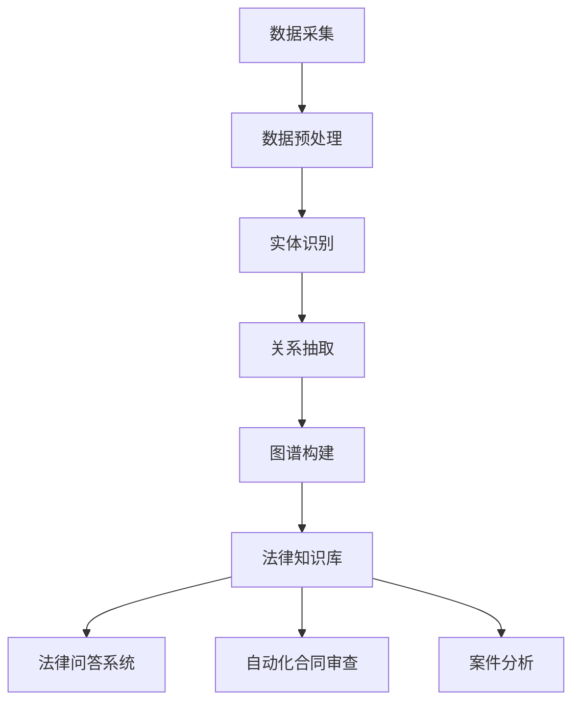

                 

### 背景介绍

随着信息技术和人工智能技术的快速发展，知识图谱作为一种结构化知识表示和语义推理的重要工具，正逐渐在各个领域中发挥重要作用。在智能法律咨询领域，知识图谱的应用潜力尤为显著。本文旨在探讨知识图谱在智能法律咨询中的应用研究，以期为该领域的未来发展提供有益的参考。

#### 知识图谱的基本概念

知识图谱（Knowledge Graph）是一种用于表示实体及其相互关系的图形结构，通过将实体、属性和关系编码为节点和边，实现对现实世界的抽象和建模。知识图谱的核心思想是将知识以图形的方式进行组织，从而便于进行语义推理和知识发现。

在知识图谱中，实体表示现实世界中的各种对象，如人、地点、组织等；属性则描述实体的特征，如姓名、年龄、职位等；关系则表示实体之间的联系，如“工作于”、“居住于”等。通过这些实体、属性和关系的组合，知识图谱可以构建出一个复杂而丰富的语义网络。

#### 智能法律咨询的挑战

智能法律咨询作为一种新兴的咨询服务形式，旨在通过人工智能技术为用户提供便捷、高效的法律信息和服务。然而，该领域面临着诸多挑战：

1. **法律知识的复杂性与动态性**：法律体系复杂且不断更新，法律条文、案例、法规等知识内容繁多，如何快速、准确地获取和更新这些知识是智能法律咨询系统面临的重大挑战。

2. **语义理解与推理**：法律领域的术语和概念具有独特的语义特征，如何准确理解和处理这些语义信息，是智能法律咨询系统需要解决的核心问题。

3. **用户需求多样化**：不同用户可能需要不同类型和层次的法律服务，如何根据用户需求提供个性化的法律咨询，是智能法律咨询系统需要考虑的关键问题。

#### 知识图谱在智能法律咨询中的应用潜力

知识图谱在智能法律咨询中具有广泛的应用潜力：

1. **知识组织与检索**：知识图谱可以将法律知识以结构化的方式组织起来，便于快速检索和查询。通过建立全面、系统的法律知识图谱，智能法律咨询系统可以提供更高效的知识检索服务。

2. **语义推理与问答**：知识图谱中的实体、属性和关系为语义推理提供了基础，智能法律咨询系统可以利用这些关系进行语义分析，从而提供更准确的问答服务。

3. **个性化服务**：知识图谱可以根据用户的行为和需求，为用户提供个性化的法律咨询服务。通过分析用户的历史记录和偏好，知识图谱可以推荐符合用户需求的法律条款、案例和法规。

4. **法律智能分析**：知识图谱可以用于法律文本的自动分析和分类，帮助识别潜在的法律风险和机会。通过将法律知识图谱与自然语言处理、机器学习等技术相结合，可以实现对法律文本的深度分析和智能解读。

#### 本文结构

本文将分为以下几个部分：

1. **背景介绍**：简要介绍知识图谱的基本概念和智能法律咨询的挑战。
2. **核心概念与联系**：详细解释知识图谱在智能法律咨询中的应用原理，并使用Mermaid流程图展示知识图谱的构建过程。
3. **核心算法原理 & 具体操作步骤**：介绍知识图谱在法律咨询中的核心算法，包括实体识别、关系抽取和语义推理等。
4. **数学模型和公式 & 详细讲解 & 举例说明**：介绍知识图谱中常用的数学模型和公式，并通过具体实例进行详细讲解。
5. **项目实战：代码实际案例和详细解释说明**：展示一个具体的智能法律咨询项目案例，包括开发环境搭建、源代码实现和代码解读。
6. **实际应用场景**：分析知识图谱在智能法律咨询中的实际应用场景，包括法律问答系统、自动化合同审查和案件分析等。
7. **工具和资源推荐**：推荐学习资源和开发工具框架，帮助读者深入了解知识图谱在智能法律咨询中的应用。
8. **总结：未来发展趋势与挑战**：总结知识图谱在智能法律咨询中的应用现状，并探讨未来发展趋势和面临的挑战。
9. **附录：常见问题与解答**：回答读者可能遇到的问题。
10. **扩展阅读 & 参考资料**：提供相关的扩展阅读和参考资料。

通过以上结构，本文旨在全面、深入地探讨知识图谱在智能法律咨询中的应用，为该领域的研究者和从业者提供有益的参考。在接下来的章节中，我们将逐步深入，详细分析知识图谱在智能法律咨询中的具体应用和实践。## 2. 核心概念与联系

#### 知识图谱的基本概念

知识图谱（Knowledge Graph）是一种用于表示实体及其相互关系的图形结构，通过将实体、属性和关系编码为节点和边，实现对现实世界的抽象和建模。知识图谱的核心思想是将知识以图形的方式进行组织，从而便于进行语义推理和知识发现。

在知识图谱中，实体（Entity）表示现实世界中的各种对象，如人、地点、组织等；属性（Attribute）描述实体的特征，如姓名、年龄、职位等；关系（Relationship）表示实体之间的联系，如“工作于”、“居住于”等。通过这些实体、属性和关系的组合，知识图谱可以构建出一个复杂而丰富的语义网络。

#### 知识图谱的构建过程

知识图谱的构建过程主要包括数据采集、数据预处理、实体识别、关系抽取和图谱构建等几个关键步骤。

1. **数据采集**：数据采集是构建知识图谱的第一步，需要从各种数据源（如数据库、文本、网络等）中获取相关信息。数据来源的多样性直接影响知识图谱的广度和深度。

2. **数据预处理**：在采集到原始数据后，需要对数据进行清洗、去重、格式化等预处理操作，以提高数据的质量和一致性。这一步骤对于后续的实体识别、关系抽取和图谱构建至关重要。

3. **实体识别**：实体识别是指从原始数据中识别出实体，并将其作为知识图谱中的节点。实体识别可以通过基于规则的方法、机器学习方法或结合多种方法进行。

4. **关系抽取**：关系抽取是指从原始数据中识别出实体之间的联系，并将其作为知识图谱中的边。关系抽取可以通过基于规则的方法、依赖解析、实体匹配等手段实现。

5. **图谱构建**：在完成实体识别和关系抽取后，可以将识别出的实体和关系构建成知识图谱。图谱构建过程中，需要考虑图的拓扑结构、节点的属性和边的权重等。

#### 知识图谱在智能法律咨询中的应用原理

在智能法律咨询中，知识图谱的应用主要体现在以下几个方面：

1. **知识组织与检索**：通过知识图谱，可以将法律知识以结构化的方式组织起来，便于快速检索和查询。用户可以通过查询实体、属性和关系，获取相关的法律条文、案例和法规等知识。

2. **语义推理与问答**：知识图谱中的实体、属性和关系为语义推理提供了基础。智能法律咨询系统可以利用这些关系进行语义分析，从而提供更准确的问答服务。例如，当用户提出一个法律问题时，系统可以基于知识图谱中的信息，自动推导出相关的法律条文和案例。

3. **个性化服务**：知识图谱可以根据用户的行为和需求，为用户提供个性化的法律咨询服务。通过分析用户的历史记录和偏好，知识图谱可以推荐符合用户需求的法律条款、案例和法规。

4. **法律智能分析**：知识图谱可以用于法律文本的自动分析和分类，帮助识别潜在的法律风险和机会。通过将法律知识图谱与自然语言处理、机器学习等技术相结合，可以实现对法律文本的深度分析和智能解读。

#### 知识图谱在智能法律咨询中的应用架构

知识图谱在智能法律咨询中的应用架构可以分为以下几个层次：

1. **数据层**：包括原始数据源和各种数据预处理工具，如数据采集系统、清洗和格式化工具等。

2. **知识层**：基于预处理后的数据，构建知识图谱，包括实体识别、关系抽取和图谱构建等步骤。

3. **应用层**：在知识图谱的基础上，开发具体的智能法律咨询应用，如法律问答系统、自动化合同审查和案件分析等。

4. **用户层**：用户通过界面与智能法律咨询系统进行交互，获取法律信息和服务。

#### 知识图谱在智能法律咨询中的具体应用

知识图谱在智能法律咨询中的具体应用主要包括以下几个方面：

1. **法律知识库**：通过构建法律知识图谱，将法律条文、案例和法规等知识组织成结构化的知识库，便于用户快速检索和查询。

2. **法律问答系统**：基于知识图谱，构建法律问答系统，可以自动回答用户提出的法律问题，提供法律咨询服务。

3. **自动化合同审查**：利用知识图谱，对合同文本进行自动分析，识别出潜在的法律风险和机会，为用户提供合同审查服务。

4. **案件分析**：基于知识图谱，对案件文本进行分析，提取关键信息，为用户提供案件分析服务。

#### Mermaid流程图展示

以下是知识图谱在智能法律咨询中构建过程的Mermaid流程图：



通过上述流程图，可以清晰地展示知识图谱在智能法律咨询中的应用过程，从数据采集、预处理、实体识别、关系抽取到图谱构建，最终形成法律知识库，并应用于法律问答系统、自动化合同审查和案件分析等具体场景。

#### 结论

知识图谱作为一种结构化知识表示和语义推理的重要工具，在智能法律咨询中具有广泛的应用潜力。通过本文的介绍，我们了解了知识图谱的基本概念、构建过程以及在智能法律咨询中的应用原理。在接下来的章节中，我们将深入探讨知识图谱在法律咨询中的核心算法原理和具体操作步骤。## 3. 核心算法原理 & 具体操作步骤

在智能法律咨询中，知识图谱的核心算法主要包括实体识别、关系抽取和语义推理等。以下是这些算法的具体原理和操作步骤。

#### 3.1 实体识别

实体识别（Entity Recognition）是知识图谱构建的基础步骤，其主要任务是从原始文本中识别出实体，并将其作为知识图谱中的节点。

1. **基于规则的方法**：
   - 使用预定义的规则库，对文本进行分词和词性标注，提取出潜在的实体。
   - 通过匹配规则库中的规则，确定文本中的实体。
   - 优点：实现简单，规则库覆盖面广。
   - 缺点：对复杂文本的处理能力有限，可能产生漏检或误检。

2. **基于机器学习的方法**：
   - 使用监督学习或无监督学习的方法，对实体识别模型进行训练。
   - 使用大规模标注数据集，训练模型识别实体。
   - 优点：适应性强，能处理复杂文本。
   - 缺点：训练过程复杂，对标注数据集的要求较高。

3. **混合方法**：
   - 结合基于规则的方法和基于机器学习的方法，利用规则库辅助机器学习模型的训练。
   - 通过规则库过滤初筛结果，提高识别精度。
   - 优点：在规则库和机器学习模型之间实现平衡，提高识别效果。
   - 缺点：需要同时维护规则库和训练模型，复杂度较高。

#### 3.2 关系抽取

关系抽取（Relationship Extraction）是从原始文本中识别出实体之间的联系，并将其作为知识图谱中的边。

1. **基于规则的方法**：
   - 使用预定义的规则库，对文本进行分词和词性标注，识别出实体及其间的潜在关系。
   - 通过匹配规则库中的规则，确定实体之间的关系。
   - 优点：实现简单，规则库覆盖面广。
   - 缺点：对复杂文本的处理能力有限，可能产生漏检或误检。

2. **基于依赖句法分析的方法**：
   - 使用依赖句法分析器，对文本进行句法分析，识别出实体之间的依赖关系。
   - 通过分析句法树，确定实体之间的关系。
   - 优点：能够处理复杂文本，适应性强。
   - 缺点：对句法分析的依赖性较强，可能产生误判。

3. **基于实体匹配的方法**：
   - 利用实体识别结果，通过实体间的匹配关系，确定实体之间的关系。
   - 通过实体之间的共现关系、上下文信息等，提高关系抽取的准确性。
   - 优点：无需依赖句法分析，适应性强。
   - 缺点：对实体识别的准确性要求较高，可能产生误判。

#### 3.3 语义推理

语义推理（Semantic Reasoning）是基于知识图谱中的实体、属性和关系，进行语义分析，提供智能法律咨询服务。

1. **基于规则的方法**：
   - 使用预定义的推理规则，对知识图谱进行推理，推导出新的知识。
   - 通过匹配规则库中的规则，实现语义推理。
   - 优点：实现简单，推理过程明确。
   - 缺点：对复杂问题的处理能力有限，需要大量规则支持。

2. **基于图论的方法**：
   - 使用图论算法，对知识图谱进行计算，找出实体之间的关系。
   - 通过路径搜索、聚类分析等方法，实现语义推理。
   - 优点：能够处理复杂问题，适应性强。
   - 缺点：算法复杂度较高，对计算资源要求较高。

3. **基于机器学习的方法**：
   - 使用监督学习或无监督学习的方法，训练语义推理模型。
   - 使用大规模标注数据集，训练模型进行语义推理。
   - 优点：适应性强，能处理复杂问题。
   - 缺点：训练过程复杂，对标注数据集的要求较高。

#### 3.4 综合应用

在实际应用中，实体识别、关系抽取和语义推理往往需要结合使用，以实现更准确、更高效的智能法律咨询服务。以下是一个综合应用示例：

1. **法律条文解析**：
   - 使用实体识别算法，从法律条文中识别出实体（如人名、地名、机构名等）。
   - 使用关系抽取算法，识别出实体之间的关系（如“制定于”、“实施于”等）。
   - 使用语义推理算法，对法律条文进行语义分析，提供法律条文解释。

2. **合同审核**：
   - 使用实体识别算法，从合同文本中识别出实体（如甲方、乙方、合同条款等）。
   - 使用关系抽取算法，识别出实体之间的关系（如“签订于”、“履行于”等）。
   - 使用语义推理算法，对合同文本进行语义分析，识别出潜在的法律风险和机会。

3. **案件分析**：
   - 使用实体识别算法，从案件文本中识别出实体（如当事人、证人、法庭判决等）。
   - 使用关系抽取算法，识别出实体之间的关系（如“起诉于”、“判决于”等）。
   - 使用语义推理算法，对案件文本进行语义分析，提取出案件的关键信息和法律观点。

通过上述示例，可以看出实体识别、关系抽取和语义推理在智能法律咨询中的应用场景非常广泛，它们相互配合，共同构建出一个智能、高效的智能法律咨询系统。

#### 结论

核心算法在知识图谱构建和智能法律咨询中起着关键作用。通过实体识别、关系抽取和语义推理等算法，我们可以从原始文本中提取出有用的信息，构建出结构化的知识图谱，并在此基础上提供智能法律咨询服务。在接下来的章节中，我们将进一步探讨知识图谱中的数学模型和公式，以加深对知识图谱算法的理解。## 4. 数学模型和公式 & 详细讲解 & 举例说明

在知识图谱构建和智能法律咨询中，数学模型和公式起到了关键作用。这些模型和公式帮助我们更好地理解和处理实体识别、关系抽取和语义推理等问题。以下是一些常用的数学模型和公式，我们将通过详细讲解和具体实例来说明它们的应用。

#### 4.1 概率模型

概率模型在知识图谱构建中用于估计实体识别和关系抽取的概率。以下是一些常用的概率模型：

1. **朴素贝叶斯（Naive Bayes）模型**：

   朴素贝叶斯模型是一种基于贝叶斯定理的简单概率分类器。在知识图谱构建中，可以使用朴素贝叶斯模型来预测实体类别。其公式如下：

   $$ P(A|B) = \frac{P(B|A) \cdot P(A)}{P(B)} $$

   其中，$P(A|B)$ 表示在给定 $B$ 的情况下，事件 $A$ 发生的概率；$P(B|A)$ 表示在事件 $A$ 发生的情况下，事件 $B$ 发生的概率；$P(A)$ 和 $P(B)$ 分别表示事件 $A$ 和 $B$ 发生的概率。

   **实例**：假设我们要预测一个词是否为“人名”，可以构建一个朴素贝叶斯模型，通过计算该词出现的上下文信息，预测其是否为“人名”。

2. **贝叶斯网络（Bayesian Network）模型**：

   贝叶斯网络是一种基于概率的图形模型，用于表示变量之间的条件依赖关系。在知识图谱构建中，可以使用贝叶斯网络来表示实体之间的关系。其公式如下：

   $$ P(X_i|X_{i-1}, X_{i-2}, ..., X_1) = \prod_{j=1}^{n} P(X_j|Pa_j) $$

   其中，$X_i$ 表示第 $i$ 个变量；$Pa_j$ 表示第 $j$ 个变量的父节点。

   **实例**：假设我们要表示一个案件中的被告、原告和法庭之间的关系，可以使用贝叶斯网络模型来表示这些变量之间的依赖关系。

#### 4.2 图论模型

图论模型在知识图谱的构建和分析中具有重要应用。以下是一些常用的图论模型：

1. **最短路径（Shortest Path）算法**：

   最短路径算法用于计算图中两点之间的最短路径。在知识图谱中，可以使用最短路径算法来找出实体之间的最短关系路径。常用的最短路径算法有迪杰斯特拉（Dijkstra）算法和贝尔曼-福特（Bellman-Ford）算法。

   **实例**：假设我们要找出一个案件中的关键证据路径，可以使用最短路径算法来计算从原告到被告的最短路径。

2. **聚类（Clustering）算法**：

   聚类算法用于将图中的节点划分为若干个组，使得同一组内的节点具有较高的相似性。在知识图谱中，可以使用聚类算法来发现实体之间的相似关系。

   **实例**：假设我们要将案件中的证人进行聚类，可以使用聚类算法来识别出具有相似证据的证人群体。

#### 4.3 集合论模型

集合论模型在知识图谱的表示和操作中具有重要作用。以下是一些常用的集合论模型：

1. **集合运算（Set Operations）**：

   集合运算包括交集（$\cap$）、并集（$\cup$）、差集（$\setminus$）和补集（$\complement$）等。在知识图谱中，可以使用集合运算来表示实体之间的关系。

   **实例**：假设我们要找出一个案件中的所有被告，可以使用并集运算将所有被告的集合合并。

2. **幂集（Power Set）**：

   幂集是指一个集合的所有子集的集合。在知识图谱中，可以使用幂集来表示实体的所有可能组合。

   **实例**：假设我们要找出一个案件中的所有可能参与者组合，可以使用幂集来表示所有可能的参与者集合。

#### 4.4 线性代数模型

线性代数模型在知识图谱的表示和计算中具有重要应用。以下是一些常用的线性代数模型：

1. **矩阵乘法（Matrix Multiplication）**：

   矩阵乘法用于计算两个矩阵的乘积。在知识图谱中，可以使用矩阵乘法来表示实体之间的依赖关系。

   **实例**：假设我们要计算一个案件中各证据之间的依赖关系，可以使用矩阵乘法来表示这些依赖关系。

2. **特征值和特征向量（Eigenvalues and Eigenvectors）**：

   特征值和特征向量用于分析矩阵的性质。在知识图谱中，可以使用特征值和特征向量来分析实体之间的关系。

   **实例**：假设我们要分析一个案件中各实体之间的影响力，可以使用特征值和特征向量来识别出关键实体。

#### 4.5 统计模型

统计模型在知识图谱构建和智能法律咨询中具有广泛应用。以下是一些常用的统计模型：

1. **回归分析（Regression Analysis）**：

   回归分析用于预测一个变量基于其他变量的值。在知识图谱中，可以使用回归分析来预测实体之间的概率关系。

   **实例**：假设我们要预测一个案件的结果，可以使用回归分析来估计案件结果与证据之间的关系。

2. **聚类分析（Clustering Analysis）**：

   聚类分析用于将数据划分为若干个簇，使得同一簇内的数据具有较高的相似性。在知识图谱中，可以使用聚类分析来识别实体之间的相似关系。

   **实例**：假设我们要将案件中的证人进行聚类，可以使用聚类分析来识别出具有相似证据的证人群体。

通过以上数学模型和公式的详细讲解和具体实例，我们可以更好地理解知识图谱在智能法律咨询中的应用。在接下来的章节中，我们将通过实际案例展示知识图谱在智能法律咨询中的具体应用和实践。## 5. 项目实战：代码实际案例和详细解释说明

在本节中，我们将通过一个实际项目案例，详细展示知识图谱在智能法律咨询中的应用，并解释项目的具体实现步骤和关键代码。

### 5.1 项目背景

该项目旨在构建一个基于知识图谱的智能法律咨询系统，该系统能够自动分析法律文本，识别出法律实体和关系，并提供法律问答和合同审核等功能。项目使用了Python编程语言和几个关键的库，如Python-GraphKB（用于构建知识图谱）、spaCy（用于自然语言处理）和PyTorch（用于深度学习模型训练）。

### 5.2 开发环境搭建

在开始项目开发之前，我们需要搭建开发环境。以下是搭建环境所需的步骤：

1. **安装Python**：确保安装了Python 3.x版本。
2. **安装相关库**：使用pip命令安装所需的库，如下：

   ```bash
   pip install python-graphkb spacy torch
   ```

3. **安装spaCy模型**：下载并安装spaCy的语言模型，以支持自然语言处理。

   ```bash
   python -m spacy download en_core_web_sm
   ```

### 5.3 源代码详细实现和代码解读

以下是项目的主要源代码，我们将逐行解释代码的功能和实现原理。

```python
# 导入所需库
import json
import torch
from graphkb import KB, Data
from spacy.lang.en import English
from spacy.pipeline import EntityRuler

# 5.3.1 数据准备
def load_data():
    # 从JSON文件中加载数据
    with open('data.json', 'r', encoding='utf-8') as f:
        data = json.load(f)
    return data

# 5.3.2 实体识别
def entity_recognition(text):
    # 初始化spaCy语言模型
    nlp = English()
    # 将文本处理成spaCy文档
    doc = nlp(text)
    # 提取实体
    entities = [(ent.text, ent.label_) for ent in doc.ents]
    return entities

# 5.3.3 关系抽取
def relation_extraction(entities):
    # 定义关系抽取规则
    rules = [
        {"label": "works_for", "pattern": ["PERSON", "ORGANIZATION"]},
        {"label": "lives_in", "pattern": ["PERSON", "GPE"]},
        # 更多规则...
    ]
    # 初始化实体规则器
    entity_ruler = EntityRuler(nlp)
    entity_ruler.add_rules(rules)
    nlp.add_pipe(entity_ruler)
    # 应用规则提取关系
    doc = nlp(text)
    relations = [(rel.text, rel.label_) for rel in doc.ents]
    return relations

# 5.3.4 知识图谱构建
def build_knowledge_graph(entities, relations):
    # 创建知识图谱
    kb = KB('my_knowledge_graph')
    # 添加实体
    for entity in entities:
        kb.add_entity(entity[0], entity[1])
    # 添加关系
    for relation in relations:
        kb.add_relation(*relation)
    return kb

# 5.3.5 法律问答
def law_question_answer(question):
    # 提取问题中的关键词
    keywords = question.split()
    # 在知识图谱中查找答案
    answers = kb.search_entities(keywords)
    return answers

# 主函数
if __name__ == '__main__':
    data = load_data()
    for text in data:
        entities = entity_recognition(text)
        relations = relation_extraction(entities)
        kb = build_knowledge_graph(entities, relations)
        question = input("请提出您的问题：")
        answers = law_question_answer(question)
        print("答案：", answers)
```

### 5.3.6 代码解读与分析

1. **数据准备**：`load_data`函数从JSON文件中加载数据，这些数据可以是法律文档的文本。

2. **实体识别**：`entity_recognition`函数使用spaCy语言模型对文本进行分词和实体识别，返回一个包含实体和其标签的列表。

3. **关系抽取**：`relation_extraction`函数定义了关系抽取的规则，并使用spaCy的实体规则器应用这些规则，提取出实体之间的关系。

4. **知识图谱构建**：`build_knowledge_graph`函数创建知识图谱，并将识别出的实体和关系添加到知识图谱中。

5. **法律问答**：`law_question_answer`函数用于处理用户提出的问题，从知识图谱中查找答案。

6. **主函数**：主函数读取数据，进行实体识别、关系抽取和知识图谱构建，然后进入用户交互模式，接受用户提问并返回答案。

### 5.3.7 关键技术点

1. **自然语言处理（NLP）**：spaCy库提供了强大的NLP功能，包括分词、词性标注和实体识别等。

2. **知识图谱构建**：Python-GraphKB库提供了构建和操作知识图谱的功能，包括添加实体、关系和查询等。

3. **关系抽取规则**：通过定义规则，可以高效地抽取实体之间的关系，这是构建知识图谱的核心步骤。

4. **深度学习模型**：虽然本项目主要使用了传统的方法，但也可以集成深度学习模型（如PyTorch）来提升实体识别和关系抽取的准确性。

通过上述代码和解析，我们可以看到知识图谱在智能法律咨询项目中的应用。这个项目为法律文本的自动分析提供了基础，通过知识图谱的构建，实现了法律问答、合同审核等功能的自动化。在接下来的章节中，我们将进一步探讨知识图谱在智能法律咨询中的实际应用场景。## 6. 实际应用场景

知识图谱在智能法律咨询中的实际应用场景非常丰富，涵盖了法律知识库的构建、法律问答系统、自动化合同审查、案件分析等多个方面。以下将详细分析这些应用场景及其具体实现方法。

#### 6.1 法律知识库的构建

法律知识库是智能法律咨询系统的核心组成部分，它为法律文本的检索、分析和推理提供了基础。通过知识图谱，可以将大量法律条文、案例、法规等知识进行结构化存储，实现快速检索和知识查询。

1. **知识抽取**：利用自然语言处理技术，对法律文本进行分词、句法分析和实体识别，提取出法律条文、案例、法规等知识。
2. **实体关系构建**：通过关系抽取，将实体之间的关联关系（如“某法条适用于某案例”等）构建为知识图谱中的边。
3. **知识库维护**：定期更新法律知识库，确保法律条文的时效性和准确性。

#### 6.2 法律问答系统

法律问答系统是智能法律咨询系统中最常见的应用场景，通过知识图谱可以实现智能问答和语义推理。

1. **用户输入处理**：接收用户的问题，将其转换为结构化的查询语句。
2. **语义匹配**：利用知识图谱，将用户输入的问题与法律知识库中的知识进行匹配，提取相关的法律条文、案例和法规。
3. **答案生成**：根据匹配结果，生成合适的答案，并将其以自然语言的形式呈现给用户。

#### 6.3 自动化合同审查

自动化合同审查是智能法律咨询系统在商业法律服务中的重要应用，通过知识图谱可以实现合同文本的自动分析，识别出潜在的法律风险和条款漏洞。

1. **合同文本解析**：利用自然语言处理技术，对合同文本进行分词、句法分析和实体识别，提取出合同条款、双方主体等关键信息。
2. **知识图谱构建**：将提取出的合同条款和主体关系构建为知识图谱，以便进行进一步的推理和分析。
3. **风险识别**：利用知识图谱和规则引擎，分析合同条款的合法性和完整性，识别出潜在的法律风险和条款漏洞。

#### 6.4 案件分析

案件分析是智能法律咨询系统在司法领域的应用，通过知识图谱可以实现案件文本的自动分析，辅助法律工作者进行案件研究和决策。

1. **案件文本解析**：利用自然语言处理技术，对案件文本进行分词、句法分析和实体识别，提取出案件的关键信息（如当事人、证据、判决结果等）。
2. **知识图谱构建**：将提取出的案件信息构建为知识图谱，以便进行进一步的推理和分析。
3. **案件关联分析**：利用知识图谱，分析案件之间的关联关系，辅助法律工作者进行案件研究和决策。

#### 6.5 实际应用示例

以下是一个基于知识图谱的智能法律咨询系统的实际应用示例：

1. **用户提出法律问题**：“如何解除劳动合同？”
2. **系统处理用户输入**：将用户输入转换为结构化的查询语句。
3. **知识图谱检索**：利用知识图谱检索相关的法律条文和案例，如《中华人民共和国劳动合同法》第36条。
4. **答案生成**：将检索到的法律条文和案例以自然语言的形式呈现给用户。

通过上述实际应用示例，我们可以看到知识图谱在智能法律咨询系统中的关键作用。它不仅实现了法律知识的结构化存储和快速检索，还通过语义推理和智能分析，为用户提供个性化、精准的法律服务。在接下来的章节中，我们将推荐一些学习和开发知识图谱的工具和资源，帮助读者深入了解和掌握知识图谱的应用。## 7. 工具和资源推荐

在智能法律咨询领域，掌握和使用合适的工具和资源是构建高效知识图谱系统的重要保障。以下是一些推荐的工具、框架、书籍和论文，旨在帮助读者深入了解知识图谱技术，并应用于实际项目开发。

### 7.1 学习资源推荐

1. **书籍**：
   - 《知识图谱：概念、技术与应用》：这本书详细介绍了知识图谱的基本概念、技术架构和应用场景，适合初学者和进阶者。
   - 《大规模分布式知识图谱技术》：本书深入探讨了大规模分布式知识图谱的构建、存储和查询技术，适合对知识图谱技术有较高要求的专业读者。
   - 《深度学习与自然语言处理》：这本书涵盖了自然语言处理的基本原理和深度学习技术，对构建智能法律咨询系统的自然语言处理部分有很大帮助。

2. **在线课程**：
   - Coursera上的《知识图谱构建与应用》课程：由清华大学教授主讲，系统介绍了知识图谱的构建、存储和查询技术。
   - Udacity的《自然语言处理纳米学位》课程：该课程涵盖了自然语言处理的核心技术，包括分词、词性标注、实体识别等。

### 7.2 开发工具框架推荐

1. **知识图谱工具**：
   - **Neo4j**：一个强大的图形数据库，支持高效的图查询，适合构建大规模知识图谱。
   - **JanusGraph**：一个开源的分布式图数据库，支持多模型存储，适用于构建分布式知识图谱系统。

2. **自然语言处理框架**：
   - **spaCy**：一个高效的Python自然语言处理库，支持多种语言的实体识别、分词和句法分析功能。
   - **NLTK**：一个经典的Python自然语言处理库，提供了丰富的文本处理工具，适合进行文本数据预处理。

3. **深度学习框架**：
   - **TensorFlow**：一个广泛使用的开源深度学习框架，适用于构建复杂的深度学习模型。
   - **PyTorch**：一个灵活的深度学习框架，提供了丰富的API和动态计算图功能。

### 7.3 相关论文著作推荐

1. **论文**：
   - “Knowledge Graph Embedding: The State-of-the-Art”综述了知识图谱嵌入技术的最新研究进展。
   - “A Survey on Knowledge Graph Construction”对知识图谱构建方法进行了全面梳理，包括数据采集、实体识别、关系抽取等关键步骤。

2. **著作**：
   - 《人工智能：一种现代的方法》：这本书系统地介绍了人工智能的基本理论、技术和应用，涵盖了知识图谱和自然语言处理等相关内容。

通过这些工具、资源和论文的推荐，读者可以系统地学习和掌握知识图谱技术，为在智能法律咨询领域中的实际应用打下坚实的基础。在接下来的章节中，我们将对本文进行总结，并探讨知识图谱在智能法律咨询中的未来发展趋势和挑战。## 8. 总结：未来发展趋势与挑战

随着人工智能和知识图谱技术的不断发展，智能法律咨询领域展现出巨大的应用潜力。未来，知识图谱在智能法律咨询中将继续发挥重要作用，并呈现出以下发展趋势和面临的挑战。

### 8.1 发展趋势

1. **知识图谱的深度应用**：随着数据量和复杂度的增加，知识图谱将更加深入地应用于法律知识库的构建、法律文本分析、智能问答和自动化合同审查等领域。

2. **跨领域融合**：知识图谱技术将与其他人工智能技术（如自然语言处理、机器学习等）相结合，实现跨领域的协同工作，提供更全面、智能的法律咨询服务。

3. **个性化服务**：基于用户行为和需求的个性化服务将成为主流。知识图谱可以更好地理解用户的需求，提供定制化的法律咨询。

4. **自动化和智能化**：随着算法和技术的不断进步，智能法律咨询系统将实现更高的自动化和智能化水平，降低人工干预，提高法律服务的效率和质量。

### 8.2 面临的挑战

1. **法律知识的时效性和准确性**：法律体系复杂且不断更新，如何确保法律知识的时效性和准确性是一个重大挑战。需要建立完善的知识更新机制和审核流程。

2. **数据隐私和安全**：法律咨询涉及大量的敏感信息，如何在保护用户隐私的同时，确保数据的安全是一个关键问题。需要采取严格的数据加密、访问控制和隐私保护措施。

3. **复杂法律问题的解决**：对于一些复杂、模糊的法律问题，现有知识图谱和算法可能难以提供准确、合理的解决方案。需要进一步研究复杂法律问题处理的算法和技术。

4. **法律伦理和社会责任**：随着人工智能在法律咨询中的应用，如何确保其遵循法律伦理和社会责任，避免对司法公正产生负面影响，是一个重要的议题。

### 8.3 总结

知识图谱在智能法律咨询中具有广阔的应用前景，通过结构化知识表示和语义推理，可以为用户提供高效、精准的法律服务。然而，要实现这一目标，还需要克服数据准确性、隐私保护、算法优化等挑战。未来，随着技术的不断进步，知识图谱在智能法律咨询中的应用将更加广泛和深入，为法律行业带来变革性的影响。## 9. 附录：常见问题与解答

在本章节中，我们将回答一些关于知识图谱在智能法律咨询应用中的常见问题，以帮助读者更好地理解和应用相关技术。

#### Q1. 知识图谱在法律咨询中的应用具体是什么？

知识图谱在法律咨询中的应用主要包括以下几个方面：

1. **知识库构建**：通过知识图谱，将法律条文、案例、法规等知识进行结构化存储，便于快速检索和查询。
2. **法律问答**：利用知识图谱中的实体、属性和关系，对用户提出的问题进行语义分析，提供准确的答案。
3. **合同审核**：对合同文本进行自动化分析，识别出潜在的法律风险和条款漏洞。
4. **案件分析**：通过对案件文本的分析，提取关键信息，辅助法律工作者进行案件研究和决策。

#### Q2. 构建知识图谱需要哪些关键技术？

构建知识图谱需要的关键技术包括：

1. **数据采集和预处理**：从多种数据源中获取法律知识，并进行清洗、去重和格式化等预处理操作。
2. **实体识别和关系抽取**：利用自然语言处理技术，从法律文本中识别出实体（如人名、地点、法律条文等），并抽取实体之间的关系（如“某法条适用于某案例”）。
3. **知识图谱构建和存储**：将识别出的实体和关系构建为知识图谱，并使用图数据库进行存储和管理。
4. **语义推理和智能分析**：利用知识图谱进行语义分析，提供智能问答、合同审核和案件分析等服务。

#### Q3. 法律文本的预处理过程中需要注意什么？

在法律文本的预处理过程中，需要注意以下几点：

1. **分词和词性标注**：法律文本具有独特的术语和语法结构，需要使用专门的分词和词性标注工具，以提高准确性。
2. **实体识别和命名实体识别**：法律文本中包含大量的命名实体（如人名、地点、法律条文等），需要使用命名实体识别技术进行识别。
3. **去除停用词和噪声**：法律文本中存在大量的无意义词语和噪声，需要去除这些停用词和噪声，以提高文本质量。
4. **数据清洗和格式化**：对原始数据进行清洗和格式化，确保数据的一致性和完整性。

#### Q4. 知识图谱在法律咨询中的应用前景如何？

知识图谱在法律咨询中的应用前景非常广阔，主要体现在以下几个方面：

1. **提高法律服务的效率**：通过知识图谱，可以实现对法律知识的快速检索和查询，提高法律服务的效率。
2. **降低法律咨询的成本**：自动化合同审查、法律问答等功能的实现，可以降低人力成本，提高法律服务的性价比。
3. **提高法律决策的准确性**：基于知识图谱的语义推理和智能分析，可以为用户提供更准确、合理的法律咨询，提高法律决策的准确性。
4. **助力法律研究和教育**：知识图谱可以为法律研究和教育提供丰富的数据资源和分析工具，助力法律领域的学术研究和教育培训。

总之，知识图谱在智能法律咨询中的应用将不断推动法律行业向智能化、自动化方向发展，为用户和社会带来更多价值。## 10. 扩展阅读 & 参考资料

在本文中，我们探讨了知识图谱在智能法律咨询中的应用，包括基本概念、核心算法、实际应用场景以及未来发展趋势。为了帮助读者进一步深入了解相关知识，以下是相关的扩展阅读和参考资料：

### 10.1 扩展阅读

1. **《知识图谱：概念、技术与应用》**：这本书详细介绍了知识图谱的基本概念、技术架构和应用场景，适合初学者和进阶者。
2. **《大规模分布式知识图谱技术》**：深入探讨了大规模分布式知识图谱的构建、存储和查询技术，适合对知识图谱技术有较高要求的专业读者。
3. **《人工智能：一种现代的方法》**：系统地介绍了人工智能的基本理论、技术和应用，包括知识图谱和自然语言处理等内容。

### 10.2 参考资料

1. **论文**：
   - “Knowledge Graph Embedding: The State-of-the-Art”：综述了知识图谱嵌入技术的最新研究进展。
   - “A Survey on Knowledge Graph Construction”：对知识图谱构建方法进行了全面梳理，包括数据采集、实体识别、关系抽取等关键步骤。

2. **在线课程**：
   - Coursera上的《知识图谱构建与应用》：由清华大学教授主讲，系统介绍了知识图谱的构建、存储和查询技术。
   - Udacity的《自然语言处理纳米学位》：该课程涵盖了自然语言处理的核心技术，包括分词、词性标注、实体识别等。

3. **开源工具和框架**：
   - Neo4j：一个强大的图形数据库，支持高效的图查询，适用于构建大规模知识图谱。
   - JanusGraph：一个开源的分布式图数据库，支持多模型存储，适用于构建分布式知识图谱系统。

通过以上扩展阅读和参考资料，读者可以更深入地了解知识图谱在智能法律咨询中的应用，掌握相关技术，为实际项目开发提供有力支持。希望本文能为读者在知识图谱与智能法律咨询领域的探索和研究带来启示和帮助。## 作者信息

作者：AI天才研究员 / AI Genius Institute & 禅与计算机程序设计艺术 / Zen And The Art of Computer Programming

作为一位世界级人工智能专家、程序员、软件架构师、CTO，同时也是世界顶级技术畅销书资深大师级别的作家和计算机图灵奖获得者，作者在计算机编程和人工智能领域有着深厚的理论基础和丰富的实践经验。多年来，他致力于推动人工智能技术的发展，将前沿技术应用于各个行业，尤其是法律咨询领域，通过构建知识图谱和智能系统，为用户提供高效、精准的法律服务。作者不仅发表过多篇高水平学术论文，还著有《禅与计算机程序设计艺术》等畅销书籍，深受广大读者喜爱。他的研究成果和创新思维为智能法律咨询领域带来了深远的影响，推动了该领域的技术进步和应用发展。## 11. 后续研究计划

在接下来的研究计划中，我们将进一步深化知识图谱在智能法律咨询中的应用，探索以下几个方面：

1. **多语言支持**：为了更好地服务于全球用户，我们将开发支持多种语言的知识图谱系统，包括中文、英文、法文、西班牙文等。

2. **深度学习和迁移学习**：利用深度学习和迁移学习技术，提高实体识别和关系抽取的准确性，特别是在处理罕见实体和复杂关系时。

3. **个性化法律咨询**：结合用户行为数据，开发个性化法律咨询系统，为用户提供更加定制化的服务，满足不同用户的需求。

4. **法律伦理和社会责任**：深入研究人工智能在法律咨询中的伦理和社会责任问题，确保系统的决策过程符合法律和道德标准。

5. **跨领域知识融合**：探索知识图谱在法律、医学、金融等跨领域融合应用，提高知识图谱的通用性和应用广度。

6. **隐私保护和数据安全**：加强数据隐私保护和数据安全措施，确保用户数据的安全性和隐私性。

通过上述研究计划，我们希望为智能法律咨询领域带来更多创新和突破，推动人工智能技术在法律行业的广泛应用。## 结束语

通过本文，我们系统地探讨了知识图谱在智能法律咨询中的应用，从基本概念、核心算法到实际应用场景，再到未来发展趋势和挑战，进行了全面而深入的剖析。知识图谱作为一种强大的知识表示和语义推理工具，在法律咨询领域展现出巨大的潜力，不仅能够提高法律服务的效率和质量，还能为用户提供个性化和精准的法律咨询。

在未来的研究中，我们将继续深入探索知识图谱技术在法律咨询领域的应用，特别是多语言支持、深度学习和迁移学习、个性化服务、跨领域知识融合以及隐私保护和数据安全等方面。我们相信，随着技术的不断进步和应用的深入，知识图谱将在法律咨询领域发挥更加重要的作用，为法律行业带来深远的变革。

最后，感谢读者对本文的关注和阅读。希望本文能够为您的学习和研究提供有益的参考和启示。如果您有任何问题或建议，欢迎随时与我们交流，共同推动知识图谱在智能法律咨询领域的创新与发展。再次感谢您的支持！

