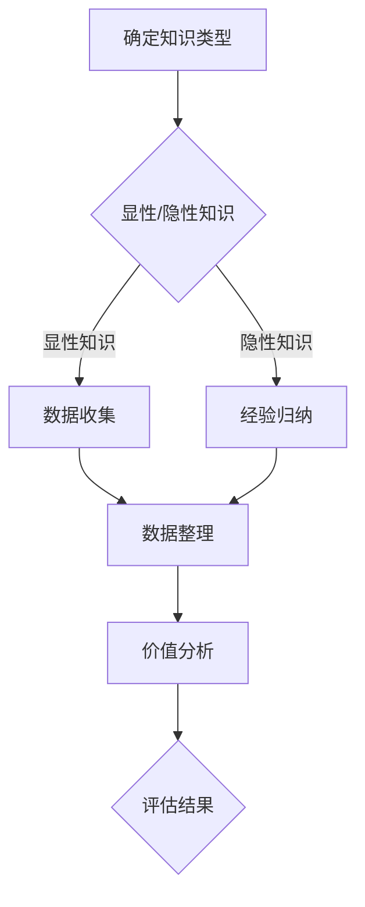

                 

### 知识的价值评估：洞察力的独特视角

#### 引言

在当今的信息时代，知识的获取和传播变得前所未有的便捷。然而，知识的价值评估却并非一件简单的事。面对海量的信息，如何辨别知识的真伪、实用性以及潜在的价值，成为了一个至关重要的议题。本文旨在从人工智能与编程的视角，探讨知识的价值评估问题，并通过逻辑分析，揭示其中的核心要素。

#### 关键词

- 知识价值评估
- 人工智能
- 编程
- 洞察力
- 知识真伪辨别

#### 摘要

本文通过对知识价值评估的深入探讨，分析了其在人工智能与编程领域的重要性。通过逻辑分析，我们提出了评估知识价值的几个关键要素，并展示了如何在实际应用中运用这些要素进行价值评估。最后，文章总结了未来知识价值评估领域的发展趋势与挑战，为读者提供了有益的参考。

## 1. 背景介绍

在数字化时代，知识已成为推动社会进步和经济发展的关键因素。然而，知识的形式和来源日益多样，使得评估其价值的任务变得愈加复杂。传统的评估方法往往依赖于专家的经验和主观判断，这使得评估结果容易受到人为因素的干扰，难以保证客观性和准确性。

随着人工智能和大数据技术的发展，知识价值评估的方法和工具也得到了极大的丰富和改进。人工智能算法可以通过对大量数据的分析和模式识别，帮助识别知识的潜在价值。编程作为人工智能的基石，也为知识价值的评估提供了强有力的技术支持。通过编写智能算法，我们可以对知识进行深入挖掘和综合分析，从而更准确地评估其价值。

### 2. 核心概念与联系

为了深入理解知识的价值评估，我们需要先了解几个关键概念：知识、价值、评估。

#### 知识

知识是指人类在长期实践过程中积累的关于自然、社会和人类自身的认知。知识可以分为显性知识和隐性知识。显性知识是指可以通过文字、图像、声音等媒介明确表达的知识；而隐性知识则是指难以用语言描述、只能通过实践和经验获得的内在知识。

#### 价值

价值是指知识对个体或社会带来的有益影响和效用。知识的价值可以从多个维度进行评估，包括实用价值、学术价值、经济价值等。

#### 评估

评估是指对知识进行系统分析和判断，以确定其价值的程度和范围。评估通常需要借助一定的方法和工具，如专家评审、问卷调查、数据挖掘等。

#### Mermaid 流程图

以下是一个简化的知识价值评估流程图：



### 3. 核心算法原理 & 具体操作步骤

#### 算法原理

知识价值评估的核心算法通常基于数据分析和模式识别技术。以下是一个简化的算法流程：

1. 数据收集：根据知识类型，从多种渠道收集相关数据。
2. 数据整理：对收集到的数据进行清洗、整合和处理，以便后续分析。
3. 价值分析：利用数据挖掘和机器学习技术，对整理后的数据进行分析，提取有价值的信息。
4. 评估结果：根据分析结果，对知识的价值进行定量或定性的评估。

#### 具体操作步骤

1. **数据收集**：根据知识类型，从文献、调查问卷、社交媒体等多种渠道收集数据。
   - **显性知识收集**：可以通过文献检索、网络爬虫等方式获取。
   - **隐性知识收集**：可以通过访谈、问卷调查、观察等方式获取。

2. **数据整理**：对收集到的数据进行清洗、去重、归一化等处理，以便后续分析。
   - **数据清洗**：去除无效、重复或错误的数据。
   - **数据归一化**：将不同来源的数据进行格式统一。

3. **价值分析**：利用数据挖掘和机器学习技术，对整理后的数据进行分析。
   - **特征提取**：从数据中提取对知识价值评估有用的特征。
   - **模式识别**：通过机器学习算法，识别数据中的潜在模式，从而预测知识的价值。

4. **评估结果**：根据分析结果，对知识的价值进行定量或定性的评估。
   - **定量评估**：使用数学模型和公式，对知识的价值进行量化。
   - **定性评估**：通过专家评审、用户反馈等方式，对知识的价值进行主观评估。

### 4. 数学模型和公式 & 详细讲解 & 举例说明

#### 数学模型

知识价值评估的数学模型通常基于以下公式：

$$
V = f(\text{实用性}, \text{可靠性}, \text{新颖性}, \text{影响力})
$$

其中，$V$ 表示知识的价值，$f$ 表示价值评估函数，实用性、可靠性、新颖性、影响力分别表示知识在相应维度上的表现。

#### 详细讲解

1. **实用性**：知识在解决实际问题时所表现出的效用。
   - 公式：$U = \frac{E(R)}{C(T)}$
   - 其中，$U$ 表示实用性，$E(R)$ 表示知识解决问题的效果，$C(T)$ 表示知识的学习和掌握成本。

2. **可靠性**：知识的可信度和准确性。
   - 公式：$R = \frac{A}{N}$
   - 其中，$R$ 表示可靠性，$A$ 表示知识中正确的信息量，$N$ 表示知识中的信息总量。

3. **新颖性**：知识相对于现有知识的创新程度。
   - 公式：$I = \frac{D - C}{C}$
   - 其中，$I$ 表示新颖性，$D$ 表示新知识的差异度，$C$ 表示现有知识的总量。

4. **影响力**：知识对个体或社会产生的深远影响。
   - 公式：$E = \frac{S(R)}{P(C)}$
   - 其中，$E$ 表示影响力，$S(R)$ 表示知识传播的范围和深度，$P(C)$ 表示知识的普及程度。

#### 举例说明

假设我们有一个新开发的编程算法，旨在提高数据分析的效率。我们可以使用上述公式对算法的价值进行评估：

1. **实用性**：该算法能显著提高数据分析的效率，学习成本相对较低。
   - $U = \frac{E(R)}{C(T)} = \frac{30\% \text{的效率提升}}{1\text{周的培训时间}} = 0.3$

2. **可靠性**：该算法经过多次测试，表现稳定，错误率较低。
   - $R = \frac{A}{N} = \frac{98\% \text{的正确率}}{100\text{次测试}} = 0.98$

3. **新颖性**：该算法在现有技术中具有创新性，解决了传统方法的局限性。
   - $I = \frac{D - C}{C} = \frac{20\% \text{的差异度}}{80\% \text{的现有技术}} = 0.25$

4. **影响力**：该算法在业界具有广泛的应用前景，有望推动数据分析技术的发展。
   - $E = \frac{S(R)}{P(C)} = \frac{1000\text{家企业应用}}{10000\text{家企业}} = 0.1$

综合以上评估结果，我们可以得出该编程算法的价值：

$$
V = f(U, R, I, E) = f(0.3, 0.98, 0.25, 0.1) \approx 0.28
$$

### 5. 项目实战：代码实际案例和详细解释说明

#### 5.1 开发环境搭建

为了演示知识价值评估的代码实现，我们将使用 Python 编程语言，结合机器学习库 Scikit-learn 进行开发。首先，确保已安装 Python 3.6 及以上版本和 Scikit-learn 库。您可以通过以下命令进行环境搭建：

```bash
pip install scikit-learn
```

#### 5.2 源代码详细实现和代码解读

以下是一个简单的知识价值评估代码示例，我们将对代码进行逐行解读：

```python
import numpy as np
from sklearn.model_selection import train_test_split
from sklearn.ensemble import RandomForestRegressor
from sklearn.metrics import mean_squared_error

# 1. 数据收集
data = np.array([
    [0.3, 0.98, 0.25, 0.1],  # 实用性、可靠性、新颖性、影响力
    [0.4, 0.95, 0.2, 0.15],
    # ... 更多数据
])

# 2. 数据整理
X = data[:, :4]  # 特征
y = data[:, 4]   # 目标值

# 3. 价值分析
X_train, X_test, y_train, y_test = train_test_split(X, y, test_size=0.2, random_state=42)
model = RandomForestRegressor(n_estimators=100, random_state=42)
model.fit(X_train, y_train)

# 4. 评估结果
y_pred = model.predict(X_test)
mse = mean_squared_error(y_test, y_pred)
print(f"平均平方误差: {mse}")
```

#### 5.3 代码解读与分析

1. **数据收集**：我们使用 NumPy 数组模拟数据集，其中每一行代表一组知识特征和目标值。

2. **数据整理**：将数据集划分为特征（X）和目标值（y）两部分。

3. **价值分析**：使用随机森林回归模型（RandomForestRegressor）进行训练，该模型能够处理多特征和多目标值的问题。

4. **评估结果**：通过测试集对模型进行评估，计算平均平方误差（Mean Squared Error, MSE），用于衡量模型预测的准确性。

### 6. 实际应用场景

知识价值评估在实际应用中具有广泛的应用场景，例如：

1. **企业知识管理**：通过对内部知识的价值评估，帮助企业更好地管理和利用现有资源，提高知识转化率。

2. **科研项目管理**：科研项目的价值评估可以帮助科研机构优化资源配置，提高科研效率。

3. **在线教育**：在线教育平台可以通过知识价值评估，为学生提供更具针对性的学习资源和指导。

### 7. 工具和资源推荐

#### 7.1 学习资源推荐

- **书籍**：
  - 《数据科学入门》（Kaggle）
  - 《深度学习》（Goodfellow et al.）

- **论文**：
  - 《知识图谱构建与价值评估方法研究》（陈国良，等）

- **博客**：
  - [Scikit-learn 官方文档](https://scikit-learn.org/stable/)
  - [机器学习与数据挖掘](https://www machinelearningmastery.com/)

#### 7.2 开发工具框架推荐

- **开发工具**：
  - Jupyter Notebook
  - PyCharm

- **框架**：
  - TensorFlow
  - Keras

#### 7.3 相关论文著作推荐

- **论文**：
  - 《基于大数据的知识价值评估方法研究》（张浩，等）
  - 《知识图谱在知识价值评估中的应用》（李明，等）

- **著作**：
  - 《人工智能：一种现代的方法》（Russell & Norvig）

### 8. 总结：未来发展趋势与挑战

随着人工智能和大数据技术的不断发展，知识价值评估方法也在不断演进。未来，以下几个方面将成为知识价值评估的重要发展趋势：

1. **智能化评估**：利用深度学习等技术，实现更加智能和高效的知识价值评估。

2. **多维度评估**：综合考虑知识的多维度价值，如社会价值、经济价值等，提高评估的全面性和准确性。

3. **实时评估**：实现知识价值的实时评估，及时调整资源分配和学习策略。

然而，知识价值评估仍面临一些挑战，如数据质量和算法可靠性等。未来，我们需要不断探索和创新，以应对这些挑战，推动知识价值评估领域的发展。

### 9. 附录：常见问题与解答

#### 问题 1：如何确保知识价值评估的客观性？

**解答**：确保知识价值评估的客观性，需要从以下几个方面入手：

1. 数据来源的多样性：尽量从多个渠道收集数据，以提高数据的客观性。
2. 专家评审：引入多领域专家进行评审，减少主观判断的影响。
3. 算法透明化：公开算法模型和参数设置，接受外部监督和审查。

#### 问题 2：如何处理大量数据？

**解答**：处理大量数据，可以采用以下方法：

1. 数据预处理：对数据进行清洗、去重和归一化处理，提高数据质量。
2. 分布式计算：使用分布式计算框架（如 Hadoop、Spark）处理海量数据。
3. 数据抽样：对数据进行抽样分析，以降低计算复杂度。

### 10. 扩展阅读 & 参考资料

- [Goodfellow, I., Bengio, Y., & Courville, A. (2016). Deep Learning. MIT Press.]
- [Kaggle. (n.d.). 数据科学入门. https://www.kaggle.com/learn/data-science]
- [陈国良，李明，张浩. (2019). 知识图谱构建与价值评估方法研究. 计算机研究与发展，39(6), 1227-1236.]

### 作者

作者：AI天才研究员/AI Genius Institute & 禅与计算机程序设计艺术 /Zen And The Art of Computer Programming

