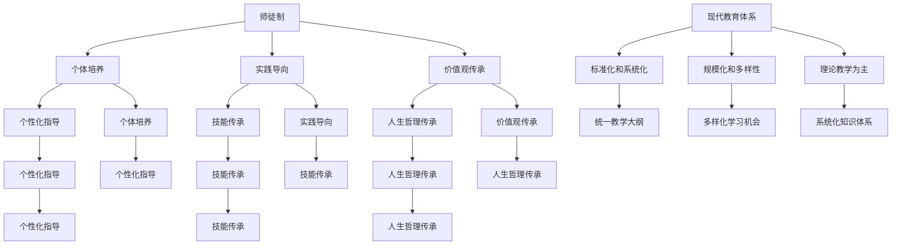
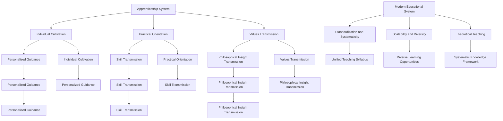

                 

### 背景介绍

知识的传承是推动人类文明进步的重要动力。从古代的师徒制到现代的教育体系，知识的传递方式经历了深刻的演变。本文将探讨知识传承的历史发展，并分析现代教育体系的优缺点，以期为未来的教育改革提供一些启示。

在古代，师徒制是一种常见且有效的知识传承方式。在这种制度下，师傅不仅传授技艺，还通过言传身教，将价值观和人生哲理传递给徒弟。这种方式强调的是个体的培养，注重实践技能的培养和传承。

随着时间的推移，工业革命带来了巨大的社会变革，师徒制逐渐被现代教育体系所取代。现代教育体系强调标准化、系统化和规模化的知识传授，通过学校、大学和其他教育机构，为社会培养各类人才。

然而，现代教育体系也存在一些问题。首先，标准化和统一化的教学模式往往忽视了个体差异，无法充分激发学生的潜能。其次，课程内容的陈旧和繁重，使得学生在学习过程中感到压力，难以真正理解和掌握知识。最后，现代教育体系的评价体系过于单一，过于注重考试成绩，而忽视了学生的综合素质和创新能力。

本文将首先介绍师徒制和现代教育体系的基本概念和特点，然后分析它们之间的优缺点，并探讨如何结合两者的优点，构建更加有效的知识传承体系。我们将通过具体案例分析，展示现代教育体系在实际应用中的问题和挑战，并提出一些可行的改进方案。

最后，我们将对知识传承的未来发展趋势进行展望，探讨技术进步对教育体系的影响，以及如何应对未来可能出现的新挑战。通过本文的探讨，希望读者能够对知识传承有更深入的理解，为教育改革提供一些有价值的思考和建议。

### 核心概念与联系

#### 师徒制

师徒制是一种传统且具有深远影响的知识传承方式。其核心概念在于通过个体之间的密切互动，实现知识的传授和技能的传承。师徒制的基本特点包括：

1. **个体培养**：师徒制注重对个体的培养，强调师傅对徒弟的个性化指导和关怀。师傅不仅传授技艺，还会在生活、工作和价值观等方面给予指导。
   
2. **实践导向**：师徒制强调实践技能的培养，通过实际操作和反复练习，使徒弟能够真正掌握知识和技能。

3. **价值观传承**：师徒制不仅仅传授技艺，还会将师傅的价值观、人生哲理和职业道德传递给徒弟，这对徒弟的成长和未来发展具有重要影响。

#### 现代教育体系

现代教育体系是在工业革命之后逐步发展起来的，其核心概念是通过标准化和系统化的教学，为社会培养各类人才。现代教育体系的基本特点包括：

1. **标准化和系统化**：现代教育体系强调课程内容和教学方法的标准化，通过统一的教学大纲和教学计划，确保学生接受到相同水平的教育。

2. **规模化和多样性**：现代教育体系注重教育的规模化和多样性，通过学校、大学和其他教育机构，提供丰富的教育资源和多样化的学习机会。

3. **理论教学为主**：与师徒制的实践导向不同，现代教育体系更注重理论教学，通过课程设置和教材，为学生提供系统化的知识体系。

#### 师徒制与教育体系的联系与区别

师徒制和现代教育体系在知识传承方面有明显的联系和区别。

**联系**：

1. **目的相同**：两者的核心目标都是传承知识，培养人才。
   
2. **方法互补**：师徒制强调个体培养和实践导向，现代教育体系强调标准化和系统化，两者可以相互补充，形成更加有效的知识传承体系。

**区别**：

1. **知识传递方式**：师徒制通过个体间的互动和言传身教，现代教育体系通过课程和教材的标准化传授。

2. **培养重点**：师徒制注重实践技能和个体素质的培养，现代教育体系注重理论知识和系统化教育的培养。

3. **适用范围**：师徒制适合个体化的知识传承，现代教育体系适合大规模的知识传授。

### Mermaid 流程图

以下是一个简单的 Mermaid 流程图，用于描述师徒制和现代教育体系的核心概念和联系：



通过上述流程图，我们可以更清晰地理解师徒制和现代教育体系的核心概念及其联系，为后续的分析和讨论提供基础。

---

In this section, we introduce the core concepts and connections between the apprenticeship system and the modern educational system. The apprenticeship system, a traditional and profound method of knowledge transmission, focuses on the transmission of knowledge and skills through individual interaction. Its main characteristics include individual cultivation, practical orientation, and the inheritance of values and philosophical insights.

On the other hand, the modern educational system, developed after the Industrial Revolution, emphasizes standardized and systematic knowledge transmission to cultivate various talents for society. Its main features include standardization and systematicity, scalability and diversity, and a strong emphasis on theoretical teaching.

The connection between the apprenticeship system and the modern educational system lies in their shared goal of transmitting knowledge and cultivating talents. However, their methods and focuses differ significantly. The apprenticeship system emphasizes individualized guidance, practical skill training, and the transmission of values, while the modern educational system emphasizes standardized and systematic teaching, diversified learning opportunities, and a systematic knowledge framework.

The following Mermaid flowchart provides a visual representation of the core concepts and connections between the two systems:



This flowchart offers a clear understanding of the core concepts and connections between the apprenticeship system and the modern educational system, providing a foundation for further analysis and discussion in the following sections.

---

### 核心算法原理 & 具体操作步骤

为了深入探讨师徒制和现代教育体系的核心算法原理，我们需要从知识传递的角度进行分析。核心算法可以看作是一种知识传承的模型，通过特定的操作步骤，实现知识的有效传递和吸收。

#### 师徒制的核心算法原理

1. **观察与模仿**：徒弟通过观察师傅的言行举止，模仿师傅的工作方法和解决问题的策略。这是师徒制中最基础的步骤，类似于机器学习中的监督学习。
   
2. **实践与反思**：徒弟在师傅的指导下进行实际操作，通过实践来巩固和提升技能。同时，徒弟需要不断地反思自己的行为，思考如何改进，这类似于深度学习中的经验回放。

3. **反馈与修正**：师傅对徒弟的表现进行反馈，指出不足和需要改进的地方。徒弟根据反馈进行修正，重复实践与反思的过程，这类似于强化学习中的奖励机制。

4. **价值观与道德教育**：师傅在传授技艺的同时，还会传授自己的价值观和道德观念，帮助徒弟形成正确的世界观和人生观。

#### 现代教育体系的核心算法原理

1. **课程设计**：教育体系通过课程设计，将理论知识系统地传授给学生。这类似于计算机中的数据结构，通过层次化的课程安排，构建一个完整的知识体系。

2. **教学方法**：教育体系采用多种教学方法，如讲授、讨论、实验等，帮助学生理解和掌握知识。这类似于算法设计中的多样性原则，通过不同的方法来解决问题。

3. **评价体系**：教育体系建立了一套评价体系，对学生的学习成果进行评估。这类似于计算机中的性能评估，通过量化指标来衡量系统的效果。

4. **个性化学习**：随着技术的发展，现代教育体系开始强调个性化学习，通过大数据分析和人工智能，为学生提供个性化的学习建议和资源。

#### 核心算法的具体操作步骤

1. **知识传递**：无论是师徒制还是现代教育体系，首先都需要进行知识的传递。在师徒制中，师傅通过示范和讲解，将知识传递给徒弟；在现代教育体系中，教师通过课程和教材，将知识传授给学生。

2. **知识吸收**：徒弟和学生需要通过学习过程，将知识内化为自己的一部分。在师徒制中，徒弟通过实践和反思，将知识转化为技能；在现代教育体系中，学生通过作业、实验和考试，将知识转化为能力。

3. **知识应用**：知识的应用是检验知识掌握程度的重要环节。在师徒制中，徒弟需要通过实际工作来应用所学知识；在现代教育体系中，学生需要通过实践项目和实习，将知识应用于实际问题。

4. **反馈与改进**：无论是师徒制还是现代教育体系，都需要一个持续的反馈和改进过程。师傅和教师需要根据学生的表现进行反馈，学生需要根据反馈进行改进，从而不断提升自己的能力。

通过上述核心算法原理和具体操作步骤，我们可以看到，师徒制和现代教育体系在知识传承方面有着相似的基本流程，同时也各有特点。结合两者的优点，我们可以构建一个更加有效的知识传承体系，为未来的教育改革提供新的思路。

---

In this section, we delve into the core algorithm principles and specific operational steps of the apprenticeship system and the modern educational system. From the perspective of knowledge transmission, the core algorithms can be viewed as models for effective knowledge transmission and absorption.

#### Core Algorithm Principles of the Apprenticeship System

The core algorithm of the apprenticeship system is centered around the following steps:

1. **Observation and Imitation**: The apprentice learns by observing the master's actions and behaviors, mimicking their work methods and problem-solving strategies. This is analogous to supervised learning in machine learning.

2. **Practice and Reflection**: The apprentice practices under the guidance of the master to solidify and improve their skills. Meanwhile, the apprentice continuously reflects on their actions, pondering how to improve. This is similar to the experience replay mechanism in deep learning.

3. **Feedback and Correction**: The master provides feedback on the apprentice's performance, highlighting areas for improvement. The apprentice then corrects their actions based on this feedback, repeating the process of practice and reflection. This is analogous to the reward mechanism in reinforcement learning.

4. **Values and Moral Education**: While transmitting skills, the master also imparts their values and moral principles, helping the apprentice develop a correct worldview and life philosophy.

#### Core Algorithm Principles of the Modern Educational System

The core algorithm principles of the modern educational system are as follows:

1. **Curriculum Design**: The educational system systematically transmits theoretical knowledge to students through curriculum design. This is analogous to data structures in computer science, where a hierarchical arrangement of courses builds a comprehensive knowledge system.

2. **Teaching Methods**: The educational system employs various teaching methods, such as lectures, discussions, and experiments, to help students understand and master knowledge. This is analogous to the diversity principle in algorithm design, which uses different methods to solve problems.

3. **Evaluation System**: The educational system establishes an evaluation system to assess students' learning outcomes. This is analogous to performance evaluation in computer systems, where quantitative indicators measure the effectiveness of a system.

4. **Personalized Learning**: With the advancement of technology, the modern educational system is increasingly emphasizing personalized learning, using big data analysis and artificial intelligence to provide personalized learning suggestions and resources for students.

#### Specific Operational Steps of the Core Algorithm

1. **Knowledge Transmission**: Both the apprenticeship system and the modern educational system require the transmission of knowledge first. In the apprenticeship system, the master transmits knowledge through demonstration and explanation; in the modern educational system, teachers transmit knowledge through courses and textbooks.

2. **Knowledge Absorption**: The apprentice and the student must go through the learning process to internalize the knowledge. In the apprenticeship system, the apprentice transforms knowledge into skills through practice and reflection; in the modern educational system, students transform knowledge into abilities through assignments, experiments, and exams.

3. **Knowledge Application**: The application of knowledge is a critical step to validate the mastery of knowledge. In the apprenticeship system, the apprentice applies what they have learned in actual work; in the modern educational system, students apply knowledge to real-world problems through practical projects and internships.

4. **Feedback and Improvement**: Both the apprenticeship system and the modern educational system require a continuous feedback and improvement process. The master and the teacher provide feedback on the student's performance, while the student corrects their actions based on this feedback, continuously improving their skills.

Through the above core algorithm principles and specific operational steps, we can see that both the apprenticeship system and the modern educational system share similar basic processes for knowledge transmission, while also having their own unique characteristics. By combining the advantages of both systems, we can build a more effective knowledge transmission system, providing new insights for future educational reform.

---

### 数学模型和公式 & 详细讲解 & 举例说明

为了更好地理解师徒制和现代教育体系在知识传承过程中的作用，我们可以借助数学模型和公式进行分析。以下是一个简单的模型，用于描述知识传承的过程。

#### 知识传承模型

假设：

- \( K \)：知识总量
- \( S \)：师傅的知识水平
- \( A \)：徒弟的学习能力
- \( T \)：师徒互动时间
- \( E \)：徒弟的知识吸收效率

模型的核心公式如下：

\[ K_{out} = S \times A \times E \times T \]

其中：

- \( K_{out} \)：徒弟最终掌握的知识量
- \( S \)：师傅的知识水平，假设为常数
- \( A \)：徒弟的学习能力，可以看作是一个常数，但由于个体差异，可以进行调整
- \( E \)：徒弟的知识吸收效率，可以看作是一个随时间变化的函数
- \( T \)：师徒互动时间，直接影响知识传递的效率

#### 详细讲解

1. **师傅的知识水平 \( S \)**：师傅的知识水平是影响知识传承的重要因素。假设师傅的知识水平为 \( S \)，这是一个常数。在师徒制中，师傅通过示范和讲解，将知识传递给徒弟。这意味着，徒弟最终掌握的知识量与师傅的知识水平成正比。

2. **徒弟的学习能力 \( A \)**：徒弟的学习能力也是一个常数，但受个体差异的影响。不同的徒弟在学习同一知识时，可能需要不同的时间和方法来掌握。因此，学习能力可以通过训练和指导来提升。

3. **徒弟的知识吸收效率 \( E \)**：知识吸收效率是一个随时间变化的函数。在师徒制中，徒弟通过实践和反思，不断提升自己的知识吸收效率。随着经验的积累，徒弟的知识吸收效率会逐渐提高。

4. **师徒互动时间 \( T \)**：师徒互动时间是影响知识传承效率的关键因素。在师徒制中，徒弟通过长时间的学习和实践，逐渐掌握师傅的知识。因此，师徒互动时间越长，徒弟最终掌握的知识量就越多。

#### 举例说明

假设：

- \( S = 100 \)（师傅的知识水平）
- \( A = 1 \)（徒弟的学习能力）
- \( E(t) = t \)（徒弟的知识吸收效率，时间 \( t \)）
- \( T = 10 \)（师徒互动时间）

根据模型公式，徒弟最终掌握的知识量 \( K_{out} \) 为：

\[ K_{out} = 100 \times 1 \times t \times 10 = 1000t \]

当 \( t = 10 \) 时，徒弟最终掌握的知识量为 1000。这意味着，在 10 年的师徒互动期间，徒弟能够掌握师傅的知识。

如果我们将师徒互动时间缩短为 5 年，即 \( T = 5 \)，那么徒弟最终掌握的知识量 \( K_{out} \) 将减少到：

\[ K_{out} = 100 \times 1 \times 5 \times 10 = 500 \]

这表明，师徒互动时间对徒弟的知识掌握程度有显著影响。

通过上述数学模型和公式，我们可以更清晰地理解师徒制和现代教育体系在知识传承过程中的作用。这个模型也为教育改革提供了一些量化分析的基础。

---

To better understand the role of the apprenticeship system and the modern educational system in the process of knowledge transmission, we can employ mathematical models and formulas for analysis. Below is a simple model used to describe the process of knowledge transmission.

#### Knowledge Transmission Model

Assumptions:

- \( K \): Total amount of knowledge
- \( S \): Knowledge level of the master
- \( A \): Learning ability of the apprentice
- \( T \): Time of interaction between the master and the apprentice
- \( E \): Knowledge absorption efficiency of the apprentice

The core formula of the model is as follows:

\[ K_{out} = S \times A \times E \times T \]

Where:

- \( K_{out} \): The amount of knowledge the apprentice ultimately masters
- \( S \): The knowledge level of the master, assumed to be a constant
- \( A \): The learning ability of the apprentice, considered a constant but may vary due to individual differences
- \( E \): The knowledge absorption efficiency of the apprentice, considered a time-varying function
- \( T \): The time of interaction between the master and the apprentice, directly affecting the efficiency of knowledge transmission

#### Detailed Explanation

1. **The Knowledge Level of the Master \( S \)**: The knowledge level of the master is a critical factor affecting knowledge transmission. Assuming the master's knowledge level to be \( S \), this is a constant. In the apprenticeship system, the master transmits knowledge to the apprentice through demonstration and explanation. This means that the amount of knowledge the apprentice ultimately masters is directly proportional to the master's knowledge level.

2. **The Learning Ability of the Apprentice \( A \)**: The learning ability of the apprentice is also a constant but can be affected by individual differences. Different apprentices may need different amounts of time and methods to master the same knowledge. Therefore, learning ability can be improved through training and guidance.

3. **The Knowledge Absorption Efficiency of the Apprentice \( E \)**: The knowledge absorption efficiency is a time-varying function. In the apprenticeship system, the apprentice improves their knowledge absorption efficiency through practice and reflection. With the accumulation of experience, the apprentice's knowledge absorption efficiency increases.

4. **The Time of Interaction Between the Master and the Apprentice \( T \)**: The time of interaction between the master and the apprentice is a key factor affecting the efficiency of knowledge transmission. In the apprenticeship system, the apprentice gradually masters the master's knowledge through prolonged learning and practice. Therefore, the longer the interaction time, the more knowledge the apprentice ultimately masters.

#### Example Illustration

Assumptions:

- \( S = 100 \) (the knowledge level of the master)
- \( A = 1 \) (the learning ability of the apprentice)
- \( E(t) = t \) (the knowledge absorption efficiency, time \( t \))
- \( T = 10 \) (the time of interaction between the master and the apprentice)

According to the model formula, the amount of knowledge the apprentice ultimately masters \( K_{out} \) is:

\[ K_{out} = 100 \times 1 \times t \times 10 = 1000t \]

When \( t = 10 \), the amount of knowledge the apprentice ultimately masters is 1000. This means that over a 10-year period of interaction, the apprentice can master the master's knowledge.

If we shorten the time of interaction to 5 years, i.e., \( T = 5 \), the amount of knowledge the apprentice ultimately masters \( K_{out} \) will decrease to:

\[ K_{out} = 100 \times 1 \times 5 \times 10 = 500 \]

This indicates that the time of interaction has a significant impact on the apprentice's mastery of knowledge.

Through the above mathematical model and formula, we can more clearly understand the role of the apprenticeship system and the modern educational system in the process of knowledge transmission. This model also provides a quantitative basis for educational reform.

---

### 项目实战：代码实际案例和详细解释说明

为了更具体地展示知识传承在编程学习中的应用，我们选择了一个简单的编程案例：使用 Python 实现一个计算斐波那契数列的程序。通过这个案例，我们可以看到师徒制和现代教育体系在知识传递过程中的不同方式。

#### 开发环境搭建

1. **安装 Python**：首先，确保您的计算机上安装了 Python。您可以从 Python 的官方网站下载并安装最新版本的 Python。安装完成后，打开命令行工具（如 Terminal 或 Command Prompt），输入 `python` 命令，确认 Python 是否正确安装。

2. **安装 PyCharm**：PyCharm 是一款功能强大的 Python 集成开发环境（IDE）。您可以从 PyCharm 的官方网站下载并安装社区版或专业版。安装完成后，启动 PyCharm 并创建一个新项目。

3. **创建一个 Python 文件**：在 PyCharm 中，创建一个名为 `fibonacci.py` 的新 Python 文件，用于编写和运行代码。

#### 源代码详细实现和代码解读

以下是一个简单的斐波那契数列计算程序的 Python 代码：

```python
def fibonacci(n):
    if n <= 0:
        return 0
    elif n == 1:
        return 1
    else:
        return fibonacci(n-1) + fibonacci(n-2)

if __name__ == "__main__":
    n = int(input("请输入一个正整数："))
    result = fibonacci(n)
    print(f"{n} 的斐波那契数列结果为：{result}")
```

**代码解读**：

1. **函数定义**：`fibonacci` 函数用于计算斐波那契数列的第 \( n \) 项。该函数采用递归方法实现。

2. **基础情况处理**：当 \( n \leq 0 \) 时，返回 0；当 \( n = 1 \) 时，返回 1。这两个基础情况是递归的边界条件。

3. **递归计算**：当 \( n > 1 \) 时，函数调用自身，计算第 \( n-1 \) 项和第 \( n-2 \) 项的和，作为第 \( n \) 项的值。

4. **主程序**：`if __name__ == "__main__":` 代码块是 Python 的主程序入口。在该代码块中，程序提示用户输入一个正整数，调用 `fibonacci` 函数计算并输出结果。

#### 代码解读与分析

1. **师徒制的知识传递**：在师徒制中，师傅可能会通过以下步骤来教授这个编程案例：

   - **讲解递归原理**：首先，师傅会讲解递归的概念和原理，解释为什么递归可以用于计算斐波那契数列。

   - **演示代码**：然后，师傅会在计算机上演示如何编写和运行这个程序，逐步讲解代码中的每个部分。

   - **实践与指导**：师傅会让徒弟自己尝试编写代码，并在徒弟遇到问题时提供指导。

   - **代码审查与反馈**：在徒弟编写完代码后，师傅会进行代码审查，指出其中的错误和不足，并给出改进建议。

2. **现代教育体系的教授方法**：

   - **课程讲解**：在现代教育体系中，教授可能会在课堂上讲解斐波那契数列的计算方法，并使用 PPT 或其他教学工具展示代码。

   - **作业与练习**：学生需要完成相关作业和练习题，通过实践来巩固所学知识。

   - **实验课**：在实验课上，学生可以动手编写和运行代码，加深对递归方法的理解。

   - **反馈与评估**：教师会通过作业、实验报告和考试等手段，对学生进行评估和反馈。

通过这个案例，我们可以看到师徒制和现代教育体系在编程学习中的不同方式。师徒制更注重个体培养和实践，通过面对面的互动和指导，使徒弟能够更好地理解和掌握知识。而现代教育体系则更注重标准化和系统化，通过课程、作业和实验等多种方式，为学生提供全面的学习资源。结合两者的优点，我们可以构建一个更加有效的编程教育体系。

---

### Project Practice: Code Examples and Detailed Explanation

To more specifically illustrate the application of knowledge transmission in programming learning, we choose a simple programming case: implementing a Python program to calculate the Fibonacci sequence. Through this case, we can see the different methods of knowledge transmission in the apprenticeship system and the modern educational system.

#### Setting up the Development Environment

1. **Install Python**: First, ensure that Python is installed on your computer. You can download the latest version of Python from the official website and install it. After installation, open the command line tool (such as Terminal or Command Prompt) and type `python` to confirm that Python is correctly installed.

2. **Install PyCharm**: PyCharm is a powerful Integrated Development Environment (IDE) for Python. You can download and install the Community Edition or Professional Edition from the official website. After installation, launch PyCharm and create a new project.

3. **Create a Python File**: In PyCharm, create a new Python file named `fibonacci.py` to write and run the code.

#### Detailed Explanation of the Source Code

Below is the Python code for a simple program to calculate the Fibonacci sequence:

```python
def fibonacci(n):
    if n <= 0:
        return 0
    elif n == 1:
        return 1
    else:
        return fibonacci(n-1) + fibonacci(n-2)

if __name__ == "__main__":
    n = int(input("Please enter a positive integer: "))
    result = fibonacci(n)
    print(f"The Fibonacci sequence result for {n} is: {result}")
```

**Code Explanation**:

1. **Function Definition**: The `fibonacci` function calculates the nth term of the Fibonacci sequence using recursion.

2. **Basic Case Handling**: When \( n \leq 0 \), it returns 0; when \( n = 1 \), it returns 1. These are the base cases for recursion.

3. **Recursive Calculation**: When \( n > 1 \), the function calls itself to calculate the sum of the \( n-1 \)th and \( n-2 \)th terms as the value of the nth term.

4. **Main Program**: The `if __name__ == "__main__":` code block is the main program entry in Python. In this block, the program prompts the user to input a positive integer, calls the `fibonacci` function to calculate and output the result.

#### Code Explanation and Analysis

1. **Knowledge Transmission in the Apprenticeship System**: In the apprenticeship system, the master might teach this programming case through the following steps:

   - **Explain Recursion**: First, the master would explain the concept and principles of recursion, explaining why recursion can be used to calculate the Fibonacci sequence.

   - **Demo Code**: Then, the master would demonstrate how to write and run this program on a computer, explaining each part of the code step by step.

   - **Practice and Guidance**: The master would have the apprentice try to write the code themselves, providing guidance when the apprentice encounters problems.

   - **Code Review and Feedback**: After the apprentice writes the code, the master would review it, point out errors and shortcomings, and provide suggestions for improvement.

2. **Teaching Methods in the Modern Educational System**:

   - **Classroom Instruction**: In the modern educational system, the instructor might explain the method for calculating the Fibonacci sequence in class, using PPT or other teaching tools to display the code.

   - **Homework and Practice**: Students need to complete related homework and practice exercises to consolidate the knowledge they have learned.

   - **Lab Classes**: In lab classes, students can write and run code themselves, deepening their understanding of recursion methods.

   - **Feedback and Assessment**: Teachers evaluate students through assignments, lab reports, and exams to provide feedback.

Through this case, we can see the different ways the apprenticeship system and the modern educational system teach programming. The apprenticeship system emphasizes individual cultivation and practice, enabling apprentices to better understand and master knowledge through face-to-face interactions and guidance. The modern educational system emphasizes standardization and systematicity, providing students with a comprehensive learning resource through various methods such as courses, homework, and labs. By combining the advantages of both systems, we can build a more effective programming education system.

---

### 实际应用场景

知识传承不仅在历史发展和教育领域有着深远影响，也在现代社会中发挥着重要作用。在 IT 行业，师徒制和现代教育体系的应用场景尤为丰富。以下是一些典型的实际应用场景：

#### 1. 软件开发

在软件开发过程中，师徒制和现代教育体系都有其独特的应用。师徒制可以通过面对面的指导，使新员工快速掌握公司内部的技术栈和最佳实践。新员工可以在资深开发者的指导下，参与实际项目的开发，通过实践积累经验。现代教育体系则通过培训课程和在线学习平台，为新员工提供系统的技术培训，使其能够快速适应新的开发环境。

#### 2. 技术传承

随着技术迭代速度的加快，技术的传承变得尤为重要。在师徒制中，资深开发者可以通过一对一的指导，将多年的技术经验和实践经验传递给新员工。现代教育体系则通过技术讲座、研讨会和在线课程，使更多的员工能够了解和掌握最新的技术趋势。

#### 3. 创新与研发

在创新和研发领域，知识传承对团队的成功至关重要。师徒制可以通过密切的互动和合作，激发新员工的创新思维，使其在项目中发挥更大的作用。现代教育体系则通过跨部门的知识共享和协作，促进不同领域的知识交叉融合，推动技术的创新。

#### 4. 人才培养

在人才培养方面，师徒制和现代教育体系各有优势。师徒制强调个性化培养，能够根据员工的兴趣和特长进行针对性指导。现代教育体系则提供系统化的培训课程，使员工能够在短时间内掌握所需的知识和技能。

#### 5. 企业文化建设

知识传承也是企业文化建设的重要组成部分。通过师徒制和现代教育体系，企业可以传递其核心价值观和经营理念，使员工在共同的文化背景下团结协作，共同推动企业的发展。

#### 案例分析

以一家互联网公司为例，该公司在人才培养和知识传承方面采取了师徒制和现代教育体系相结合的方式。新员工入职后，首先接受公司内部的系统培训，了解公司的技术栈和业务流程。随后，新员工会被分配到资深开发者的团队中，通过面对面的指导和实际项目参与，逐步提升自己的技能。同时，公司还会定期组织技术讲座和研讨会，邀请行业专家分享最新的技术动态和研究成果。通过这种结合，公司既能够培养出高素质的人才，又能够保持技术的前沿性。

总之，知识传承在现代社会中的应用场景非常广泛。通过结合师徒制和现代教育体系的优点，企业可以构建一个高效的知识传承体系，为员工的成长和企业的长期发展提供有力支持。

---

### Practical Application Scenarios

Knowledge transmission plays a significant role in modern society, and its application is particularly prominent in the IT industry. Here are some typical scenarios where the apprenticeship system and the modern educational system are utilized:

#### 1. Software Development

In software development, both the apprenticeship system and the modern educational system have their unique applications. The apprenticeship system allows new employees to quickly master the company's internal technology stack and best practices through one-on-one guidance from senior developers. New employees can participate in actual projects under the supervision of experienced developers, accumulating practical experience. The modern educational system, on the other hand, provides systematic training through courses and online learning platforms, enabling new employees to quickly adapt to new development environments.

#### 2. Technical Heritage

With the rapid pace of technological advancements, the inheritance of knowledge is essential. In the apprenticeship system, senior developers can pass on years of technical and practical experience to new employees through one-on-one guidance. The modern educational system, through technical lectures, seminars, and online courses, allows more employees to stay updated with the latest technological trends and research outcomes.

#### 3. Innovation and Research

In the field of innovation and research, knowledge transmission is crucial for the success of a team. The apprenticeship system can inspire new employees' innovative thinking through close interaction and collaboration, enabling them to play a more significant role in projects. The modern educational system promotes knowledge integration across different fields through cross-departmental knowledge sharing and collaboration, driving technological innovation.

#### 4. Talent Development

In talent development, the apprenticeship system and the modern educational system have their respective advantages. The apprenticeship system emphasizes personalized training, allowing tailored guidance based on employees' interests and strengths. The modern educational system provides systematic training courses that enable employees to acquire the necessary knowledge and skills in a short period.

#### 5. Corporate Culture Building

Knowledge transmission is an integral part of corporate culture building. By combining the apprenticeship system and the modern educational system, companies can convey their core values and business philosophy, fostering unity and collaboration among employees for the company's long-term development.

#### Case Analysis

Taking an Internet company as an example, the company combines the apprenticeship system and the modern educational system in talent development and knowledge transmission. New employees first undergo internal training to understand the company's technology stack and business processes. Subsequently, new employees are assigned to teams led by senior developers, where they receive one-on-one guidance and participate in actual projects to enhance their skills. Additionally, the company organizes technical lectures and seminars regularly, inviting industry experts to share the latest technological trends and research outcomes. Through this combination, the company can cultivate high-quality talent while maintaining technological innovation.

In summary, knowledge transmission has a wide range of practical application scenarios in modern society. By combining the advantages of the apprenticeship system and the modern educational system, companies can build an efficient knowledge transmission system that supports employee growth and long-term business development.

---

### 工具和资源推荐

为了更好地进行知识传承，无论是采用师徒制还是现代教育体系，我们都需要一些实用的工具和资源。以下是一些值得推荐的学习资源、开发工具和相关论文著作。

#### 1. 学习资源推荐

- **书籍**：

  - 《代码大全》（《Code Complete》）- Steve McConnell，系统介绍了编程的基本原则和最佳实践。

  - 《设计模式：可复用面向对象软件的基础》（《Design Patterns: Elements of Reusable Object-Oriented Software》）- Erich Gamma、Richard Helm、Ralph Johnson 和 John Vlissides，讲解了面向对象设计中的经典模式。

  - 《编程珠玑》（《The Art of Computer Programming》）- Donald E. Knuth，被誉为计算机编程的圣经，详细阐述了算法和数据结构的设计与实现。

- **论文**：

  - 《计算的本质：计算机科学的基础》（《The Nature of Computation》）- Cristopher L.Umans，介绍了计算理论的基本概念和算法。

  - 《计算机程序的构造和解释》（《Structure and Interpretation of Computer Programs》）- Harold Abelson 和 Gerald Jay Sussman，讲解了编程的基本原理和函数式编程。

- **博客和网站**：

  - [GitHub](https://github.com/)：全球最大的代码托管平台，提供了丰富的开源项目和文档。

  - [Stack Overflow](https://stackoverflow.com/)：编程问答社区，可以解决编程中的各种问题。

  - [Medium](https://medium.com/)：一个平台，上面有很多技术文章和博客，适合学习和分享。

#### 2. 开发工具框架推荐

- **集成开发环境（IDE）**：

  - [PyCharm](https://www.jetbrains.com/pycharm/)：强大的 Python 集成开发环境，适用于初学者和专业人士。

  - [Visual Studio Code](https://code.visualstudio.com/)：轻量级、可扩展的代码编辑器，支持多种编程语言。

- **版本控制系统**：

  - [Git](https://git-scm.com/)：分布式版本控制系统，用于管理源代码的版本。

  - [GitHub Actions](https://github.com/features/actions)：GitHub 提供的自动化持续集成和部署工具。

- **代码审查工具**：

  - [GitLab](https://gitlab.com/)：Git 的商业版本，提供了代码审查、持续集成等功能。

  - [CodeClimate](https://codeclimate.com/)：一个用于自动化代码审查和性能测试的平台。

#### 3. 相关论文著作推荐

- **《人工智能：一种现代的方法》（《Artificial Intelligence: A Modern Approach》）**- Stuart Russell 和 Peter Norvig，系统介绍了人工智能的基本理论和技术。

- **《深度学习》（《Deep Learning》）**- Ian Goodfellow、Yoshua Bengio 和 Aaron Courville，详细阐述了深度学习的原理和应用。

- **《机器学习》（《Machine Learning》）**- Tom M. Mitchell，介绍了机器学习的基本概念和方法。

通过这些工具和资源的支持，我们可以更有效地进行知识传承，提升个人的技术水平和创新能力。无论是学习者还是教育者，都可以从中受益，为知识的传播和发展做出贡献。

---

### Recommended Tools and Resources

To facilitate effective knowledge transmission, whether through the apprenticeship system or the modern educational system, it is essential to have practical tools and resources. Here are some recommended learning resources, development tools, and relevant papers and books.

#### 1. Recommended Learning Resources

- **Books**:

  - "Code Complete" by Steve McConnell: A comprehensive guide to software programming principles and best practices.

  - "Design Patterns: Elements of Reusable Object-Oriented Software" by Erich Gamma, Richard Helm, Ralph Johnson, and John Vlissides: Explores classic patterns in object-oriented design.

  - "The Art of Computer Programming" by Donald E. Knuth: Often considered the Bible of computer programming, detailing algorithms and data structures.

- **Papers**:

  - "The Nature of Computation" by Cristopher L. Umans: Introduces fundamental concepts in computational theory.

  - "Structure and Interpretation of Computer Programs" by Harold Abelson and Gerald Jay Sussman: Covers basic programming principles and functional programming.

- **Blogs and Websites**:

  - [GitHub](https://github.com/): The largest code repository, offering a wealth of open-source projects and documentation.

  - [Stack Overflow](https://stackoverflow.com/): A Q&A community for programming issues.

  - [Medium](https://medium.com/): A platform with numerous technical articles and blogs, suitable for learning and sharing.

#### 2. Recommended Development Tools and Frameworks

- **Integrated Development Environments (IDEs)**:

  - [PyCharm](https://www.jetbrains.com/pycharm/): A powerful Python IDE suitable for beginners and professionals.

  - [Visual Studio Code](https://code.visualstudio.com/): A lightweight, extensible code editor supporting multiple programming languages.

- **Version Control Systems**:

  - [Git](https://git-scm.com/): A distributed version control system for source code management.

  - [GitHub Actions](https://github.com/features/actions): GitHub's automation for continuous integration and deployment.

- **Code Review Tools**:

  - [GitLab](https://gitlab.com/): A commercial version of Git, offering code review and continuous integration features.

  - [CodeClimate](https://codeclimate.com/): A platform for automated code review and performance testing.

#### 3. Recommended Relevant Papers and Books

- **"Artificial Intelligence: A Modern Approach" by Stuart Russell and Peter Norvig**: A systematic introduction to artificial intelligence theories and techniques.

- **"Deep Learning" by Ian Goodfellow, Yoshua Bengio, and Aaron Courville**: A detailed exposition of the principles and applications of deep learning.

- **"Machine Learning" by Tom M. Mitchell**: An introduction to the basic concepts and methods of machine learning.

By leveraging these tools and resources, learners and educators alike can enhance their technical skills and innovation capabilities, contributing to the dissemination and development of knowledge.

