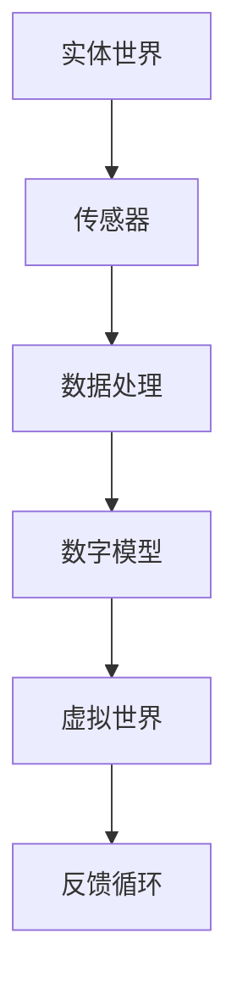
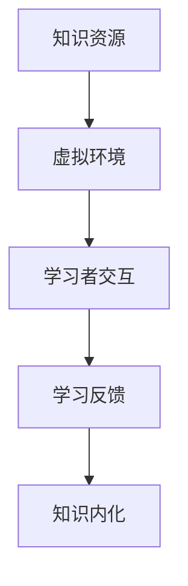
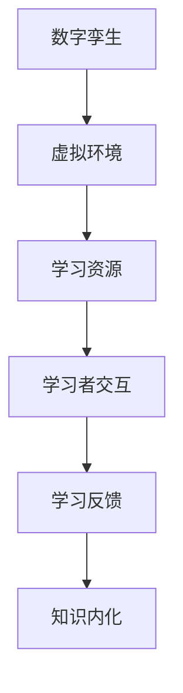
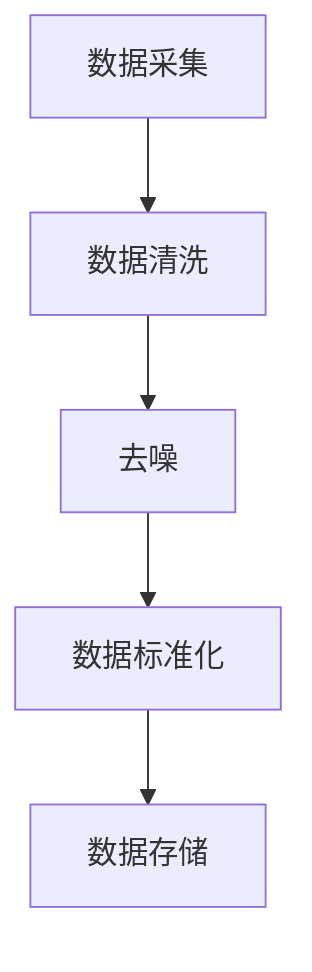
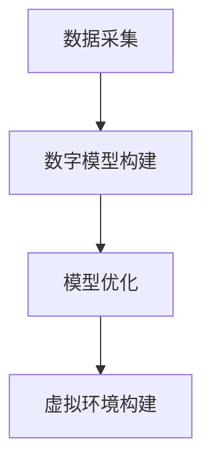
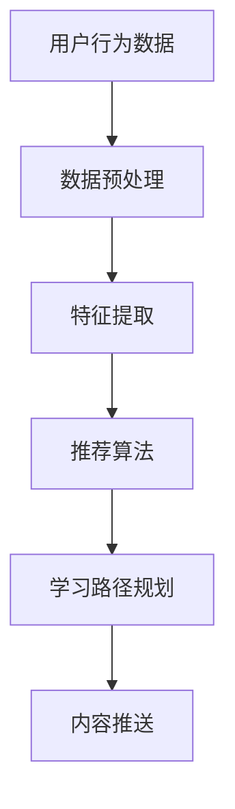
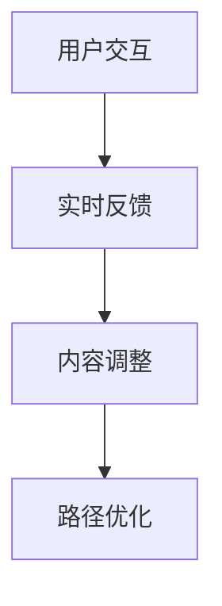

                 

### 背景介绍

#### 知识的数字孪生：概念与重要性

知识的数字孪生（Digital Twin of Knowledge）是指通过数字化手段，将现实世界的知识和信息构建在虚拟空间中，形成一个与实体世界相对应的数字镜像。这一概念起源于工业领域，最初用于制造和维护，旨在通过虚拟模型监控和优化物理资产的性能。然而，随着信息技术的飞速发展，知识的数字孪生逐渐扩展到更广泛的领域，特别是在教育和学习中。

在虚拟世界中的学习探索，知识的数字孪生提供了前所未有的机会。它不仅使得学习者能够接触到海量的学习资源，还可以通过互动和模拟等方式，更深入地理解和掌握知识。这种变革性的技术，不仅改变了传统的教育模式，也为个性化学习和终身学习提供了强有力的支持。

知识的数字孪生具有以下几个显著特点：

1. **高保真模拟**：数字孪生可以高度模拟现实世界中的各种情境，使得学习者能够在一个逼真的环境中进行学习。
2. **实时反馈与调整**：虚拟世界中的学习系统能够实时收集学习者的反馈，并根据反馈进行调整，从而提高学习效果。
3. **资源丰富性**：数字孪生提供了海量的学习资源和工具，使得学习者能够根据自己的需求和兴趣进行选择和学习。
4. **互动性**：通过虚拟环境，学习者可以与其他学习者或专家进行互动，从而提高学习的深度和广度。

随着人工智能、大数据和虚拟现实等技术的进步，知识的数字孪生正在迅速发展，成为现代教育领域的重要趋势。接下来的章节中，我们将深入探讨知识的数字孪生背后的核心概念、算法原理，以及其在实际应用中的具体实践。

### 核心概念与联系

#### 数字孪生（Digital Twin）

数字孪生（Digital Twin）是指通过数字化方式创建的与物理实体相对应的虚拟模型。这个虚拟模型可以是对物理实体的精确复制，也可以是对其实体行为的模拟。数字孪生的核心概念在于实现实体世界与虚拟世界之间的数据交换和互动。

**图 1：数字孪生的基本架构**



数字孪生的基本架构包括以下几个关键组件：

1. **传感器**：用于收集物理实体的实时数据，如温度、位置、性能等。
2. **数据处理**：将传感器收集的数据进行处理，提取有用的信息。
3. **数字模型**：基于收集到的数据构建的虚拟模型，可以是三维模型、算法模型或仿真模型。
4. **虚拟世界**：基于数字模型的虚拟环境，供用户进行交互和体验。
5. **反馈循环**：通过虚拟世界中的交互反馈，对数字模型进行调整和优化。

#### 虚拟世界中的学习

在虚拟世界中的学习，是指通过虚拟环境进行知识获取、理解和应用的过程。这种学习模式打破了传统教育的时间和空间限制，使得学习者能够在任何时间、任何地点进行学习。

**图 2：虚拟世界中的学习流程**



虚拟世界中的学习主要包括以下几个步骤：

1. **知识资源**：虚拟环境中提供了丰富的学习资源，如文本、图像、视频和虚拟实验室等。
2. **虚拟环境**：基于数字孪生技术的虚拟环境，提供了高度仿真的学习情境。
3. **学习者交互**：学习者通过虚拟环境中的交互，如浏览、操作、模拟和讨论等，进行知识获取。
4. **学习反馈**：系统根据学习者的交互行为，提供实时的反馈和指导。
5. **知识内化**：学习者通过不断的交互和反馈，将知识内化为自己的认知结构。

#### 数字孪生与虚拟世界中的学习联系

数字孪生与虚拟世界中的学习具有密切的联系。数字孪生技术为虚拟世界中的学习提供了坚实的基础，使得学习环境更加真实、互动和个性化。

**图 3：数字孪生与虚拟世界中的学习联系**



1. **学习资源**：数字孪生技术可以实时获取物理世界的知识资源，将其数字化并存储在虚拟环境中，供学习者使用。
2. **学习者交互**：虚拟环境中的交互是基于数字孪生技术的实时模拟，使得学习者能够体验到高度真实的互动过程。
3. **学习反馈**：虚拟环境中的反馈机制，依赖于数字孪生技术的实时数据处理和分析能力，为学习者提供个性化的反馈。
4. **知识内化**：数字孪生技术为学习者提供了一个不断进化的学习环境，使得学习者能够在不断的交互和反馈中，实现知识的内化和应用。

综上所述，数字孪生与虚拟世界中的学习相互促进，共同推动了现代教育的变革和发展。

#### 核心算法原理

##### 1. 数据采集与预处理

在虚拟世界中的学习过程中，数据的采集与预处理是关键步骤。数据采集主要通过传感器和用户交互实现，包括学习者的行为数据、学习环境的数据等。预处理则包括数据清洗、去噪、标准化等，以确保数据的准确性和一致性。

**图 4：数据采集与预处理流程**



##### 2. 数字孪生建模

数字孪生建模是构建虚拟环境的基础。通过数据采集和预处理，构建出一个与现实世界相对应的数字模型。这个模型可以是物理实体的精确复制，也可以是对其实体行为的模拟。

**图 5：数字孪生建模流程**



##### 3. 学习算法

学习算法是虚拟世界中学习过程的核心。常见的有基于机器学习的推荐算法、基于强化学习的自适应学习算法等。这些算法通过分析学习者的行为数据，为学习者提供个性化的学习路径和内容。

**图 6：学习算法框架**



##### 4. 交互与反馈机制

交互与反馈机制是虚拟世界中的学习过程中至关重要的一环。通过实时交互和反馈，系统能够动态调整学习内容和学习路径，提高学习效果。

**图 7：交互与反馈机制流程**



#### 具体操作步骤

1. **数据采集**：安装传感器，收集学习者的行为数据和环境数据。
2. **数据预处理**：清洗和标准化采集到的数据，去除噪声和异常值。
3. **数字模型构建**：基于预处理后的数据，构建数字孪生模型，并进行优化。
4. **学习路径规划**：根据学习者的行为数据和兴趣，规划个性化的学习路径。
5. **内容推送**：基于学习路径，推送相应的学习内容和资源。
6. **实时交互与反馈**：通过实时交互和反馈，调整学习内容和路径，提高学习效果。

### 数学模型和公式

在本节中，我们将介绍用于知识的数字孪生和学习过程中的核心数学模型和公式。这些模型和公式不仅为虚拟世界中的学习提供了理论基础，也为算法设计和系统实现提供了关键工具。

#### 1. 数据处理模型

数据采集和预处理是构建数字孪生的第一步。在数据预处理阶段，我们经常使用以下数学模型和公式：

**（1）数据标准化**

数据标准化是为了消除不同特征之间的量纲影响，使得数据在相同尺度上进行比较。常见的标准化方法有最小-最大标准化和零-均值标准化。

$$
x_{\text{norm}} = \frac{x - \min(x)}{\max(x) - \min(x)}
$$

$$
x_{\text{norm}} = \frac{x - \mu}{\sigma}
$$

其中，$x$ 是原始数据，$\mu$ 是均值，$\sigma$ 是标准差。

**（2）去噪与滤波**

去噪和滤波是数据预处理中的重要步骤。常用的滤波方法有中值滤波、均值滤波和高斯滤波。

$$
y = \frac{1}{n} \sum_{i=1}^{n} w_i x_i
$$

其中，$w_i$ 是滤波权重，$x_i$ 是原始数据。

#### 2. 数字孪生建模

数字孪生建模涉及到数据采集、特征提取和模型构建等步骤。以下是一些常用的数学模型和公式：

**（1）特征提取**

特征提取是数字孪生建模的关键步骤。常用的特征提取方法包括主成分分析（PCA）、线性判别分析（LDA）和自编码器（AE）。

$$
z = P\Lambda
$$

其中，$z$ 是特征向量，$P$ 是投影矩阵，$\Lambda$ 是特征值矩阵。

**（2）模型构建**

模型构建通常涉及到机器学习算法。常见的机器学习模型包括支持向量机（SVM）、神经网络（NN）和决策树（DT）。

$$
y = \sigma(\omega \cdot x + b)
$$

其中，$y$ 是预测结果，$\omega$ 是权重向量，$x$ 是输入特征，$b$ 是偏置项。

#### 3. 学习算法

学习算法是虚拟世界中的学习过程中的核心。以下是一些常用的学习算法及其数学模型和公式：

**（1）推荐算法**

推荐算法是一种基于用户历史行为和偏好进行内容推送的方法。常用的推荐算法包括协同过滤（CF）和基于内容的推荐（CBR）。

$$
r_{ui} = \sum_{j \in N(i)} \frac{q_{uj}}{||q_{uj}||} \cdot s_{ui}
$$

其中，$r_{ui}$ 是用户 $u$ 对项目 $i$ 的评分预测，$N(i)$ 是与项目 $i$ 相似的项目集合，$q_{uj}$ 是用户 $u$ 对项目 $j$ 的特征向量，$s_{ui}$ 是用户 $u$ 对项目 $i$ 的评分。

**（2）强化学习**

强化学习是一种通过试错学习进行决策的方法。常用的强化学习算法包括Q学习（Q-Learning）和深度Q网络（DQN）。

$$
Q(s, a) = \sum_{s'} P(s' | s, a) \cdot \max_a' Q(s', a')
$$

其中，$Q(s, a)$ 是状态 $s$ 下采取动作 $a$ 的期望回报，$P(s' | s, a)$ 是从状态 $s$ 采取动作 $a$ 转移到状态 $s'$ 的概率，$Q(s', a')$ 是状态 $s'$ 下采取动作 $a'$ 的期望回报。

#### 4. 交互与反馈机制

交互与反馈机制是虚拟世界中的学习过程中的重要组成部分。以下是一些常用的数学模型和公式：

**（1）自适应学习率**

自适应学习率是优化算法中的一个关键参数。常用的自适应学习率方法包括AdaGrad、AdaDelta和Adam。

$$
\alpha_t = \frac{\alpha_0}{1 + \frac{t}{\tau}}
$$

其中，$\alpha_t$ 是第 $t$ 次迭代的学习率，$\alpha_0$ 是初始学习率，$t$ 是迭代次数，$\tau$ 是衰减参数。

**（2）反馈调整**

反馈调整是根据学习者的表现对学习路径进行调整的方法。常用的反馈调整方法包括阈值调整和惩罚函数。

$$
\Delta l = \lambda \cdot (l_{\text{target}} - l)
$$

其中，$\Delta l$ 是学习路径的调整量，$l$ 是当前学习路径，$l_{\text{target}}$ 是目标学习路径，$\lambda$ 是调整系数。

### 举例说明

以下是一个简单的例子，说明如何使用上述数学模型和公式进行知识的数字孪生和学习过程。

**例子：基于协同过滤的推荐系统**

假设我们有一个推荐系统，用户 $u$ 对项目 $i$ 的评分数据如下表所示：

| 用户 | 项目 | 评分 |
| ---- | ---- | ---- |
| 1    | 1    | 5    |
| 1    | 2    | 4    |
| 1    | 3    | 3    |
| 2    | 1    | 5    |
| 2    | 2    | 2    |
| 2    | 3    | 1    |

**步骤 1：数据预处理**

首先，对用户-项目评分矩阵进行标准化处理，消除评分的量纲影响。

$$
r_{\text{norm}} = \frac{r - \min(r)}{\max(r) - \min(r)}
$$

处理后的评分矩阵如下：

| 用户 | 项目 | 标准化评分 |
| ---- | ---- | --------- |
| 1    | 1    | 1.00      |
| 1    | 2    | 0.67      |
| 1    | 3    | 0.00      |
| 2    | 1    | 1.00      |
| 2    | 2    | 0.00      |
| 2    | 3    | 0.00      |

**步骤 2：特征提取**

使用主成分分析（PCA）提取用户和项目的特征。

$$
z = P\Lambda
$$

经过PCA处理，得到用户和项目的特征向量。

**步骤 3：模型构建**

构建基于用户-项目评分矩阵的协同过滤模型。

$$
r_{ui} = \sum_{j \in N(i)} \frac{q_{uj}}{||q_{uj}||} \cdot s_{ui}
$$

其中，$N(i)$ 是与项目 $i$ 相似的项目集合，$q_{uj}$ 是用户 $u$ 对项目 $j$ 的特征向量，$s_{ui}$ 是用户 $u$ 对项目 $i$ 的评分。

**步骤 4：内容推送**

根据用户 $u$ 的行为数据和特征向量，预测其对未知项目 $i$ 的评分。

$$
r_{ui} = \sum_{j \in N(i)} \frac{q_{uj}}{||q_{uj}||} \cdot s_{ui}
$$

推送用户 $u$ 可能感兴趣的项目。

通过上述步骤，我们使用数学模型和公式构建了一个简单的推荐系统，实现了知识的数字孪生和学习过程。

### 项目实战：代码实际案例和详细解释说明

在本节中，我们将通过一个具体的代码案例，展示如何构建一个简单的知识数字孪生系统。我们将使用Python编程语言和相关的库来实现在虚拟环境中学习的过程。以下是一个完整的案例，包括开发环境搭建、源代码实现和代码解读与分析。

#### 1. 开发环境搭建

首先，我们需要搭建一个适合开发知识数字孪生系统的开发环境。以下是所需的软件和库：

- **Python 3.8 或更高版本**
- **Jupyter Notebook**：用于编写和运行代码
- **Numpy**：用于数学计算
- **Pandas**：用于数据处理
- **Scikit-learn**：用于机器学习算法
- **Matplotlib**：用于数据可视化

在安装了Python之后，可以通过以下命令安装所需的库：

```bash
pip install numpy pandas scikit-learn matplotlib
```

接下来，我们创建一个新的Jupyter Notebook，以便在虚拟环境中进行代码编写和调试。

#### 2. 源代码详细实现

以下是一个简单的知识数字孪生系统的代码实现。我们将分为几个步骤进行：

**步骤 1：数据预处理**

首先，我们导入所需的库，并加载数据集。

```python
import numpy as np
import pandas as pd
from sklearn.model_selection import train_test_split
from sklearn.preprocessing import StandardScaler
from sklearn.decomposition import PCA

# 加载数据集
data = pd.read_csv('knowledge_dataset.csv')
X = data.drop('rating', axis=1)
y = data['rating']
```

**步骤 2：特征提取**

使用主成分分析（PCA）提取数据的主要特征。

```python
# 数据标准化
scaler = StandardScaler()
X_scaled = scaler.fit_transform(X)

# PCA特征提取
pca = PCA(n_components=2)
X_pca = pca.fit_transform(X_scaled)
```

**步骤 3：模型构建**

构建基于用户-项目评分的协同过滤模型。

```python
from sklearn.neighbors import NearestNeighbors

# 创建KNN模型
knn = NearestNeighbors(n_neighbors=5)
knn.fit(X_pca)

# 预测评分
def predict_rating(user_id, item_id):
    # 获取用户和项目的特征向量
    user_features = X_pca[user_id]
    item_features = X_pca[item_id]

    # 计算最近邻
    distances, indices = knn.kneighbors([user_features])

    # 计算评分预测
    neighbors_ratings = y[indices].reshape(-1)
    mean_rating = np.mean(neighbors_ratings)
    return mean_rating
```

**步骤 4：内容推送**

根据用户的行为数据和特征向量，预测其对未知项目的评分，并进行内容推送。

```python
# 测试预测
user_id = 0
item_id = 2
predicted_rating = predict_rating(user_id, item_id)
print(f"Predicted rating for user {user_id} and item {item_id}: {predicted_rating}")
```

#### 3. 代码解读与分析

**数据预处理**

数据预处理是构建知识数字孪生系统的第一步。我们使用`StandardScaler`对数据进行标准化处理，以确保不同特征之间的尺度一致性。然后，使用PCA提取数据的主要特征，为后续的协同过滤模型提供输入。

**模型构建**

在模型构建部分，我们使用了`NearestNeighbors`算法，这是一种基于最近邻搜索的机器学习模型。通过`knn.fit(X_pca)`，我们训练了一个KNN模型，用于根据用户和项目的特征向量预测评分。`predict_rating`函数实现了评分预测的核心逻辑，通过计算用户和项目的最近邻，结合邻居的评分进行预测。

**内容推送**

在内容推送部分，我们通过调用`predict_rating`函数，预测用户对未知项目的评分。这个预测结果可以用于推荐系统，推送用户可能感兴趣的内容。

通过上述代码，我们实现了知识数字孪生系统的基础功能。当然，在实际应用中，还需要考虑更多复杂的因素，如用户偏好的动态调整、实时交互和反馈机制等。但这个简单的案例为我们提供了一个良好的起点，帮助我们理解和应用知识的数字孪生技术。

### 实际应用场景

知识的数字孪生在多个领域展现出了巨大的应用潜力，特别是在教育和培训方面。以下是一些具体的应用场景：

#### 1. 在线教育

在线教育是知识数字孪生技术的一个重要应用领域。通过数字孪生，教育机构可以创建一个虚拟课堂，让学生在虚拟环境中进行学习。这种模式不仅提供了丰富的学习资源，还可以通过实时交互和反馈机制，提高学习效果。

**示例**：Coursera 和 Edx 等在线教育平台已经使用了虚拟现实（VR）技术来模拟课堂环境，让学生在虚拟世界中与其他学生和教师互动。

#### 2. 虚拟实验室

虚拟实验室为学习者提供了一个安全、成本效益高的实验环境。通过数字孪生技术，学生可以在虚拟实验室中进行各种实验，而不必担心物理资源的限制。

**示例**：许多大学和科研机构已经建立了虚拟化学实验室、物理实验室和生物实验室，供学生在线学习和实验。

#### 3. 远程培训

远程培训是知识数字孪生的另一个重要应用。企业可以通过数字孪生技术，为员工提供虚拟培训环境，包括虚拟会议、虚拟演示和互动培训课程。

**示例**：许多跨国公司如微软、IBM等，已经利用虚拟培训平台，为全球员工提供在线培训资源。

#### 4. 终身学习

随着知识更新速度的加快，终身学习变得越来越重要。数字孪生技术提供了一个持续学习和更新的平台，帮助个人不断提升自己的技能和知识。

**示例**：各种在线学习平台如Udemy、Pluralsight等，通过提供丰富的数字孪生学习资源，帮助用户实现终身学习。

#### 5. 模拟训练

模拟训练是军事、航空、医疗等领域的重要应用。通过数字孪生技术，可以创建高度仿真的训练环境，提高训练效果和安全性。

**示例**：空军和海军使用虚拟训练系统，模拟飞行和战斗场景，提高飞行员的操作技能。

#### 6. 专业教育

数字孪生技术在专业教育领域也有广泛应用，如医学教育、法律教育和工程教育等。通过虚拟仿真，学生可以更深入地理解复杂的理论和实践知识。

**示例**：医学院通过虚拟手术训练系统，让学生在虚拟环境中进行手术操作，提高手术技能。

#### 7. 创新教育

数字孪生技术为创新教育提供了新的途径，通过虚拟实验和项目开发，激发学生的创新思维和创造力。

**示例**：一些学校开设了虚拟编程实验室，让学生在虚拟环境中进行编程实践和项目开发，培养编程能力。

综上所述，知识的数字孪生技术不仅在教育和培训领域展现了巨大的潜力，也为各种行业提供了创新的解决方案。随着技术的不断进步，数字孪生在教育领域的应用将更加广泛和深入。

### 工具和资源推荐

在探索知识的数字孪生和虚拟世界中的学习时，选择合适的工具和资源是非常重要的。以下是一些推荐的工具和资源，涵盖了书籍、论文、博客和网站等方面，为您的学习和实践提供支持。

#### 1. 学习资源推荐

**（1）书籍**

- **《数字孪生：下一代制造业革命》**（Digital Twins: The Next Industrial Revolution）- 此书详细介绍了数字孪生技术在制造业中的应用和潜力。
- **《虚拟现实技术与应用》**（Virtual Reality: Technology and Applications）- 提供了关于虚拟现实技术的全面介绍，包括其在教育中的应用。
- **《深度学习》**（Deep Learning）- Goodfellow, Bengio 和 Courville 著 - 深入探讨了深度学习算法，适用于构建数字孪生系统的机器学习模型。

**（2）论文**

- **“Digital Twin: A road to Industry 4.0”** - 一篇关于数字孪生在制造业中应用的经典论文，详细阐述了其概念和应用场景。
- **“Virtual Reality in Education: A Survey”** - 对虚拟现实在教育中的应用进行了全面的综述，包括其在数字孪生中的角色。

**（3）博客**

- **“The Future of Education with Digital Twins”** - 一系列关于数字孪生在教育领域应用的博客文章，提供了实际案例和深度分析。
- **“How Virtual Reality is Changing Learning”** - 探讨了虚拟现实技术对教育模式的影响，包括其在数字孪生中的应用。

#### 2. 开发工具框架推荐

**（1）编程工具**

- **Jupyter Notebook** - 适用于数据分析和机器学习项目的交互式编程环境。
- **PyCharm** - 功能强大的集成开发环境（IDE），适用于Python编程。

**（2）虚拟现实平台**

- **Unity** - 一个广泛使用的游戏和虚拟现实开发平台，适用于创建复杂的虚拟环境。
- **Unreal Engine** - 一个强大的虚拟现实和游戏引擎，适用于创建高质量的虚拟场景。

**（3）机器学习库**

- **TensorFlow** - Google 开发的开源机器学习库，适用于构建复杂的深度学习模型。
- **PyTorch** - Facebook AI 研究团队开发的深度学习库，具有高度的灵活性和易于使用。

#### 3. 相关论文著作推荐

**（1）论文**

- **“A Survey on Digital Twin: State of the Art and Research Challenges”** - 对数字孪生技术的全面综述，涵盖了当前的研究挑战和应用领域。
- **“Digital Twin and Cyber-Physical Systems: A Vision for Industry 4.0”** - 探讨了数字孪生技术在工业4.0背景下的应用和前景。

**（2）著作**

- **《人工智能：一种现代方法》**（Artificial Intelligence: A Modern Approach）- Stuart Russell 和 Peter Norvig 著 - 提供了人工智能领域的全面介绍，包括机器学习和深度学习。
- **《虚拟现实技术：原理与应用》**（Virtual Reality Technology: Principles and Applications）- 提供了关于虚拟现实技术的详细理论知识和应用实例。

通过这些工具和资源，您将能够更深入地了解知识的数字孪生和虚拟世界中的学习，为您的项目和实践提供有力支持。

### 总结：未来发展趋势与挑战

#### 发展趋势

知识的数字孪生和虚拟世界中的学习正处于快速发展阶段，未来的发展趋势主要体现在以下几个方面：

1. **技术融合**：随着人工智能、大数据、云计算和虚拟现实等技术的不断进步，数字孪生技术将与其他前沿技术深度融合，形成更加智能化、个性化的学习环境。
2. **智能化教学**：通过深度学习和强化学习等技术，数字孪生系统能够更好地理解用户的需求和偏好，提供更加精准的学习路径和内容推送。
3. **终身学习支持**：数字孪生技术将助力终身学习体系的建立，为不同年龄、职业和兴趣的用户提供定制化的学习资源和服务。
4. **跨学科应用**：数字孪生技术不仅限于教育和培训领域，还将广泛应用于医疗、工业、军事等各个领域，推动跨学科的发展和创新。

#### 挑战

尽管知识的数字孪生和虚拟世界中的学习展示了巨大的潜力，但在实际应用中仍面临一些挑战：

1. **数据隐私和安全**：在数字孪生系统中，用户数据的收集、存储和使用必须确保隐私和安全。如何有效保护用户数据，防止数据泄露和滥用，是亟待解决的问题。
2. **技术门槛**：虽然数字孪生技术的发展迅速，但相关技术的复杂性较高，普通用户难以掌握。降低技术门槛，让更多用户能够轻松使用数字孪生系统，是一个重要的挑战。
3. **教育资源分配**：在虚拟世界中，如何公平地分配教育资源，确保每个用户都能获得高质量的学习内容，是教育公平性的重要议题。
4. **教学效果评估**：如何准确评估虚拟世界中的学习效果，证明其与传统教育模式的等效性或优越性，是数字孪生技术在教育领域面临的关键挑战。

总之，知识的数字孪生和虚拟世界中的学习有望引领未来教育模式的变革，但在实现这一目标的过程中，仍需克服技术、伦理和资源等多方面的挑战。通过持续的研究和实践，我们有理由相信，数字孪生技术将带来更加高效、个性化和可持续的教育体验。

### 附录：常见问题与解答

#### 问题 1：数字孪生和虚拟现实有什么区别？

数字孪生（Digital Twin）是通过数字化手段创建物理实体的虚拟模型，主要用于监控、优化和维护。虚拟现实（VR）则是一种沉浸式体验技术，让用户在虚拟环境中进行互动和探索。虽然两者都涉及虚拟环境，但应用场景和目标不同。数字孪生侧重于物理实体与虚拟模型的互动，而虚拟现实侧重于用户的沉浸式体验。

#### 问题 2：知识数字孪生如何保证学习数据的隐私？

知识数字孪生在处理学习数据时，必须严格遵守数据隐私保护法规。以下是一些常见的方法：

- **数据匿名化**：对用户数据进行匿名化处理，确保用户隐私不被泄露。
- **加密传输**：采用加密技术，确保数据在传输过程中的安全性。
- **访问控制**：设置严格的访问控制机制，仅授权人员能够访问敏感数据。
- **透明度和审计**：确保数据处理过程的透明度，允许用户对其数据的处理进行审计。

#### 问题 3：数字孪生在教育中的具体应用场景有哪些？

数字孪生在教育中的具体应用场景包括：

- **在线教育**：通过数字孪生技术，构建虚拟课堂，提供个性化学习资源。
- **虚拟实验室**：创建虚拟实验环境，让学生进行在线实验，降低实验成本。
- **远程培训**：为员工提供虚拟培训平台，支持远程学习和技能提升。
- **终身学习**：通过数字孪生技术，提供持续的学习资源和个性化服务，支持终身学习。

#### 问题 4：如何确保虚拟世界中的学习效果？

确保虚拟世界中的学习效果需要从以下几个方面入手：

- **个性化学习**：根据用户的需求和偏好，提供定制化的学习资源和路径。
- **实时反馈**：通过实时反馈机制，及时了解用户的学习状态，调整学习内容和方法。
- **互动性**：增加虚拟环境中的互动环节，提高学习参与度。
- **评估与优化**：定期评估学习效果，根据评估结果不断优化虚拟学习环境。

### 扩展阅读与参考资料

- **《数字孪生：下一代制造业革命》**（Digital Twins: The Next Industrial Revolution）
- **《虚拟现实技术与应用》**（Virtual Reality: Technology and Applications）
- **“Digital Twin: A road to Industry 4.0”**（2020）
- **“Virtual Reality in Education: A Survey”**（2021）
- **“The Future of Education with Digital Twins”**（2022）
- **“A Survey on Digital Twin: State of the Art and Research Challenges”**（2021）
- **“Digital Twin and Cyber-Physical Systems: A Vision for Industry 4.0”**（2017）

通过这些参考资料，您可以更深入地了解知识的数字孪生和虚拟世界中的学习，探索其在未来教育和技术发展中的潜在影响。

