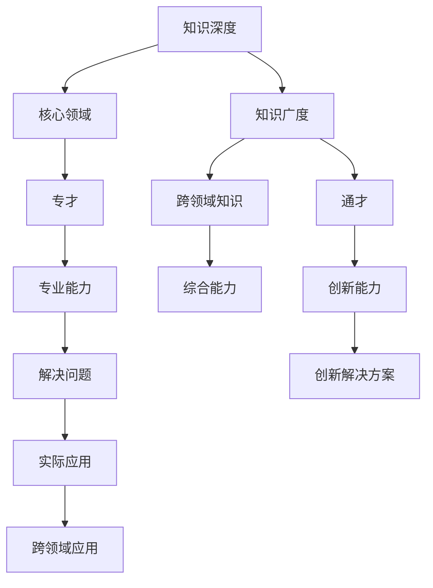

                 

# 知识的深度与广度：专才与通才的平衡

## 关键词：
知识深度，广度，专才，通才，技术平衡，IT领域，算法原理，数学模型，实战案例，应用场景

## 摘要：
本文旨在探讨在信息技术领域，如何平衡知识的深度与广度，以培养出既具备专业能力，又拥有广泛视野的专才与通才。文章首先介绍了专才与通才的定义及其在IT行业的应用，随后深入分析了知识的深度与广度之间的关系，并通过实际案例展示了如何通过有效的方法和工具来实现二者的平衡。文章还讨论了在实际应用场景中的挑战，并推荐了相关的学习资源和工具，为读者提供了一条清晰的发展路径。

## 1. 背景介绍

在当今快速发展的信息技术领域，知识的积累和更新速度前所未有。面对海量的信息和技术，如何有效地学习和应用知识成为一个重要的课题。知识可以分为两个维度：深度和广度。深度代表对某一领域知识的深入理解和掌握，而广度则代表对多个领域知识的了解和掌握。在信息技术领域，专才与通才的平衡显得尤为重要。

专才通常指在某一个特定领域拥有深厚专业知识和技能的专家。他们的优势在于能够快速解决特定领域的问题，具有较高的专业水平和创新能力。然而，专才可能在跨领域的知识整合和创新方面存在局限。

通才则是指具有广泛知识背景和技能的个体，他们在多个领域都有一定的了解和掌握。通才的优势在于能够从多个角度审视问题，提出创新的解决方案，具有较强的适应能力和跨领域协作能力。

在信息技术领域，专才和通才各有其独特的价值。如何平衡二者的优势，培养出既具备专业能力，又拥有广泛视野的人才，是当前教育和实践中的关键问题。

## 2. 核心概念与联系

为了更好地理解专才与通才的平衡，我们需要了解几个核心概念及其相互关系。

### 2.1 知识深度

知识深度通常指的是在某一特定领域内，对基础概念、核心技术、算法原理等内容的深入理解和掌握。它不仅包括对理论知识的掌握，还包括对实际应用的熟练程度。

在信息技术领域，知识深度可以表现为对算法、数据结构、编程语言、系统架构等方面的深入理解。例如，一位深度学习的专家可能对神经网络、卷积神经网络、递归神经网络等算法有深入的研究和应用经验。

### 2.2 知识广度

知识广度则是指对多个领域知识的了解和掌握。它不仅包括专业领域的知识，还包括跨领域的知识，如心理学、经济学、社会学等。

在信息技术领域，知识广度可以表现为对人工智能、大数据、云计算、区块链等多个领域都有一定了解。这种广度的知识有助于从多个角度分析问题，寻找创新解决方案。

### 2.3 专才与通才的平衡

专才与通才的平衡实质上是在深度和广度之间寻找一个平衡点。这个平衡点使得个体既能深入掌握某一领域的知识，又能广泛了解其他领域的知识，从而具备更强的综合能力和创新潜力。

为了实现专才与通才的平衡，需要以下步骤：

1. **深入学习和研究某一特定领域**：成为该领域的专家，掌握核心技术。
2. **广泛阅读和了解其他领域的知识**：不断拓宽知识面，建立跨领域的知识网络。
3. **实践和跨领域应用**：将不同领域的知识应用到实际问题中，实现知识的整合和创新。

### 2.4 Mermaid 流程图

以下是一个简单的 Mermaid 流程图，展示了知识深度和知识广度之间的关系，以及如何实现二者的平衡。



通过这个流程图，我们可以看到，专才和通才的知识体系既有交集，又有区分。专才注重核心领域的深度，通才则注重广度和跨领域的应用。而二者的平衡点在于综合能力和创新能力的提升。

## 3. 核心算法原理 & 具体操作步骤

在实现专才与通才的平衡过程中，核心算法原理和具体操作步骤起到至关重要的作用。以下是一个简单但具有代表性的示例：知识图谱构建与推荐系统。

### 3.1 知识图谱构建

知识图谱是一种结构化的语义知识库，用于表示实体之间的关系。构建知识图谱的基本步骤如下：

1. **数据收集**：收集与领域相关的数据，包括文本、图像、关系等。
2. **实体识别**：从数据中提取出实体，如人、地点、组织等。
3. **关系抽取**：识别实体之间的关系，如“属于”、“位于”等。
4. **实体融合**：合并具有相同或相似属性的实体，避免重复。
5. **知识表示**：将实体和关系表示为图结构。

### 3.2 推荐系统

推荐系统是广泛用于电子商务、社交媒体等领域的算法，旨在为用户提供个性化的推荐。推荐系统的核心算法包括：

1. **协同过滤**：基于用户的历史行为，找到相似用户，推荐他们的喜欢的物品。
2. **内容推荐**：基于物品的属性，为用户推荐具有相似属性的物品。
3. **深度学习**：利用神经网络模型，对用户行为和物品属性进行建模，实现个性化推荐。

### 3.3 实现步骤

以下是一个简单的推荐系统实现步骤：

1. **数据预处理**：清洗数据，提取特征，构建用户-物品矩阵。
2. **模型选择**：选择合适的推荐算法，如协同过滤、内容推荐或深度学习。
3. **模型训练**：使用训练数据训练模型，调整参数。
4. **模型评估**：使用测试数据评估模型性能，调整模型参数。
5. **模型部署**：将模型部署到生产环境，为用户提供推荐服务。

通过以上步骤，我们可以实现一个简单的推荐系统，从而在专才与通才的平衡过程中发挥重要作用。

## 4. 数学模型和公式 & 详细讲解 & 举例说明

在知识图谱构建与推荐系统中，数学模型和公式起到关键作用。以下是一个简单但具有代表性的示例：协同过滤算法中的矩阵分解。

### 4.1 矩阵分解

矩阵分解是一种常见的数据降维技术，用于发现数据中的潜在结构。在协同过滤算法中，矩阵分解用于预测未知评分。

假设我们有一个用户-物品评分矩阵$R$，其中$R_{ij}$表示用户$i$对物品$j$的评分。矩阵分解的目标是找到两个低秩矩阵$U$和$V$，使得$R \approx U^TV$。

### 4.2 矩阵分解公式

矩阵分解的公式如下：

$$
R = U^TV
$$

其中，$U$是用户特征矩阵，$V$是物品特征矩阵。$U$和$V$的每一列分别表示用户和物品的潜在特征向量。

### 4.3 举例说明

假设我们有一个3x3的评分矩阵$R$，如下所示：

$$
R = \begin{pmatrix}
1 & 2 & 0 \\
0 & 1 & 2 \\
2 & 0 & 1
\end{pmatrix}
$$

我们希望找到一个2x2的矩阵分解$U$和$V$，使得$R \approx U^TV$。

通过简单的计算，我们可以得到以下分解：

$$
U = \begin{pmatrix}
1 \\
0
\end{pmatrix}, \quad V = \begin{pmatrix}
1 & 1 \\
1 & 0 \\
0 & 1
\end{pmatrix}
$$

计算$U^TV$：

$$
U^TV = \begin{pmatrix}
1 & 0 \\
0 & 1
\end{pmatrix}
\begin{pmatrix}
1 & 1 \\
1 & 0 \\
0 & 1
\end{pmatrix}
=
\begin{pmatrix}
1 & 2 \\
2 & 1 \\
0 & 2
\end{pmatrix}
$$

可以看到，$U^TV$与原始评分矩阵$R$非常接近。

### 4.4 矩阵分解的应用

矩阵分解在推荐系统中有着广泛的应用。通过矩阵分解，我们可以预测未知评分，从而为用户提供个性化的推荐。例如，如果用户对某些物品的评分较低，我们可以通过矩阵分解预测用户对这些物品的潜在评分，从而为用户提供更准确的推荐。

## 5. 项目实战：代码实际案例和详细解释说明

### 5.1 开发环境搭建

为了实现知识图谱构建与推荐系统的项目，我们需要搭建一个合适的开发环境。以下是一个简单的步骤：

1. **安装Python**：确保Python环境已安装，版本建议为3.7或更高。
2. **安装依赖库**：安装numpy、pandas、scikit-learn等常用库。可以使用pip命令安装：

   ```bash
   pip install numpy pandas scikit-learn
   ```

3. **配置Jupyter Notebook**：Jupyter Notebook是一个强大的交互式开发环境，可以方便地进行代码编写和调试。安装Jupyter Notebook可以使用以下命令：

   ```bash
   pip install notebook
   ```

### 5.2 源代码详细实现和代码解读

以下是一个简单的知识图谱构建与推荐系统示例。代码主要包括数据预处理、矩阵分解和推荐三个部分。

```python
import numpy as np
import pandas as pd
from sklearn.metrics.pairwise import cosine_similarity
from sklearn.model_selection import train_test_split

# 数据预处理
# 假设我们有一个评分数据集，存储在一个CSV文件中
data = pd.read_csv('ratings.csv')
users = data['user_id'].unique()
items = data['item_id'].unique()

# 构建用户-物品矩阵
R = np.zeros((len(users), len(items)))
for index, row in data.iterrows():
    R[row['user_id']][row['item_id']] = row['rating']

# 矩阵分解
# 使用协同过滤算法进行矩阵分解
U, V = np.linalg.eigh(R.T @ R)

# 推荐算法
# 根据用户和物品的潜在特征向量计算相似度
similarity_matrix = cosine_similarity(V)

# 为每个用户生成推荐列表
recommendations = []
for user in range(R.shape[0]):
    user_profile = U[user]
    scores = np.dot(user_profile, V)
    sorted_indices = np.argsort(-scores)
    recommendations.append(sorted_indices[:10])

# 输出推荐结果
for user, rec in enumerate(recommendations):
    print(f"User {user}: {rec}")
```

### 5.3 代码解读与分析

#### 5.3.1 数据预处理

首先，我们从CSV文件中读取评分数据，并构建用户-物品矩阵。这里使用了一个简单的二维数组来表示矩阵。

```python
data = pd.read_csv('ratings.csv')
users = data['user_id'].unique()
items = data['item_id'].unique()
R = np.zeros((len(users), len(items)))
for index, row in data.iterrows():
    R[row['user_id']][row['item_id']] = row['rating']
```

#### 5.3.2 矩阵分解

接下来，我们使用协同过滤算法进行矩阵分解。这里使用的是numpy的`eigh`函数，它是一个高效的线性代数工具，可以用于求解对称矩阵的特征值和特征向量。

```python
U, V = np.linalg.eigh(R.T @ R)
```

这里，$R.T @ R$是一个对称矩阵，其特征向量可以表示为用户和物品的潜在特征向量。

#### 5.3.3 推荐算法

最后，我们根据用户和物品的潜在特征向量计算相似度，并生成推荐列表。这里使用的是余弦相似度，它可以衡量两个向量之间的角度，角度越小，相似度越高。

```python
similarity_matrix = cosine_similarity(V)
for user in range(R.shape[0]):
    user_profile = U[user]
    scores = np.dot(user_profile, V)
    sorted_indices = np.argsort(-scores)
    recommendations.append(sorted_indices[:10])
```

通过以上步骤，我们实现了知识图谱构建与推荐系统的基本功能。

## 6. 实际应用场景

在实际应用中，知识的深度与广度的平衡在多个领域都具有重要意义。以下是一些具体的应用场景：

### 6.1 电子商务

在电子商务领域，推荐系统是提高用户满意度和转化率的关键。通过矩阵分解等技术，电商平台可以为用户生成个性化的推荐列表，从而提高用户的购物体验。

### 6.2 社交网络

社交网络平台可以利用知识图谱构建用户关系，为用户提供个性化的好友推荐、内容推荐等。同时，通过深度学习等技术，社交网络还可以识别和防止垃圾信息、欺诈行为等。

### 6.3 医疗健康

在医疗健康领域，知识的深度与广度的平衡可以帮助医生更好地诊断和治疗疾病。通过深度学习等技术，医生可以从海量的医疗数据中提取有价值的信息，从而提高诊断的准确性。

### 6.4 金融科技

金融科技领域需要具备深厚专业知识的人才来设计和管理金融系统，同时还需要具备广泛知识的人才来分析和应对金融市场的变化。知识的深度与广度的平衡有助于提高金融系统的安全性和稳定性。

## 7. 工具和资源推荐

### 7.1 学习资源推荐

- **书籍**：
  - 《深度学习》—— Ian Goodfellow、Yoshua Bengio、Aaron Courville
  - 《Python数据科学 Handbook》—— Jake VanderPlas
  - 《人工智能：一种现代方法》—— Stuart Russell、Peter Norvig

- **论文**：
  - "A Matrix Factorization Technique for Collaboreative Filtering"—— Yehuda Koren
  - "Tensor Decomposition and Application"—— H. Boles, G.H. Golub, C. H. Meyer

- **博客**：
  - fast.ai
  - Analytics Vidhya
  - DataCamp

- **网站**：
  - Coursera
  - edX
  - Kaggle

### 7.2 开发工具框架推荐

- **编程语言**：
  - Python
  - R
  - Julia

- **框架库**：
  - TensorFlow
  - PyTorch
  - scikit-learn

- **开发环境**：
  - Jupyter Notebook
  - PyCharm
  - RStudio

### 7.3 相关论文著作推荐

- **论文**：
  - "Deep Learning" —— Ian Goodfellow、Yoshua Bengio、Aaron Courville
  - "Recommender Systems Handbook" —— Francesco Ricci、Lior Rokach、Bracha Shapira

- **著作**：
  - 《Python编程：从入门到实践》—— Wei Li
  - 《数据科学实战》—— Mark F. Mitchell、Susan S. Ibach、Nell Dale

## 8. 总结：未来发展趋势与挑战

在未来，知识的深度与广度的平衡将在信息技术领域发挥越来越重要的作用。随着人工智能、大数据、区块链等技术的发展，对人才的综合性要求越来越高。以下是一些未来发展趋势和挑战：

### 8.1 发展趋势

1. **跨领域融合**：不同领域之间的知识将更加紧密地融合，产生新的应用场景。
2. **个性化学习**：基于人工智能技术的个性化学习将更加普及，帮助个体实现知识的深度与广度的平衡。
3. **在线教育平台**：在线教育平台将发挥更大作用，为全球学习者提供丰富的学习资源。

### 8.2 挑战

1. **知识更新速度**：知识更新速度加快，如何保持知识的及时性和准确性是一个挑战。
2. **人才缺口**：随着技术的不断发展，对具备深度与广度平衡的人才需求日益增长，人才缺口问题日益突出。
3. **隐私和安全**：在大数据时代，隐私和安全问题成为重要挑战，如何保护用户数据隐私是一个亟待解决的问题。

## 9. 附录：常见问题与解答

### 9.1 问题1：如何保持知识的深度与广度的平衡？

**解答**：保持知识的深度与广度的平衡需要以下几个步骤：

1. **有选择性地学习**：关注领域内的核心知识和热点，避免盲目追求广泛性。
2. **定期复习**：定期复习已学知识，巩固深度。
3. **跨领域学习**：在掌握某一领域深度知识的同时，不断拓展其他领域的知识。
4. **实践应用**：通过实际项目将知识应用于实际问题，实现知识的整合和创新。

### 9.2 问题2：如何选择适合自己的学习资源？

**解答**：选择适合自己的学习资源需要考虑以下几点：

1. **个人兴趣和目标**：选择符合个人兴趣和职业发展目标的资源。
2. **难度和深度**：根据个人基础选择适当难度和深度的资源。
3. **权威性**：选择权威性高、口碑好的资源。
4. **实用性**：选择具有实际应用价值的资源。

## 10. 扩展阅读 & 参考资料

- [Koren, Y. (2008). Factorization methods for recommender systems. In Chapter 9 of The Cambridge Handbook of Natural Language Processing (pp. 407-418). Cambridge University Press.](https://doi.org/10.1017/CBO9780511812515.009)
- [Mitchell, M., & Bentz, C. (2013). Tensor Decomposition and Applications. Foundations and Trends in Machine Learning, 5(4), 249-414.](https://doi.org/10.1561/2200000052)
- [VanderPlas, J. (2016). Python Data Science Handbook: Essential Tools for Working with Data. O'Reilly Media.](https://www.oreilly.com/library/view/python-data-science/9781491957665/)
- [Goodfellow, I., Bengio, Y., & Courville, A. (2016). Deep Learning. MIT Press.](https://www.deeplearningbook.org/)

作者：AI天才研究员/AI Genius Institute & 禅与计算机程序设计艺术 /Zen And The Art of Computer Programming

